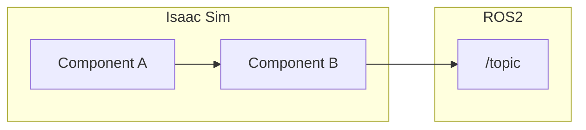

# Mermaid Diagrams

## Правило

Все диаграммы в Markdown-отчётах — только **Mermaid** (````mermaid).
GitHub рендерит их нативно, ASCII-рисование запрещено.

## Типы

| Синтаксис               | Назначение                    |
| ----------------------- | ----------------------------- |
| `graph TB` / `graph LR` | Блок-схемы, архитектура       |
| `block-beta`            | Табличная вёрстка (3 колонки) |
| `subgraph`              | Группировка компонентов       |

## Соглашения

- ID узлов — только латиница и подчёркивания
- Labels — в кавычках, кириллица допустима
- `-->` для направленных связей
- `===` для выделенных связей
- `<br/>` для переноса строки внутри label

## Запрещено

- Рисовать диаграммы ASCII-графикой (`┌─┐│└┘`) в `.md` файлах
- Svgbob, ditaa — только Mermaid

## Генерация SVG

```bash
npx -p @mermaid-js/mermaid-cli mmdc -i diagram.mmd -o diagram.svg
```

## Пример


