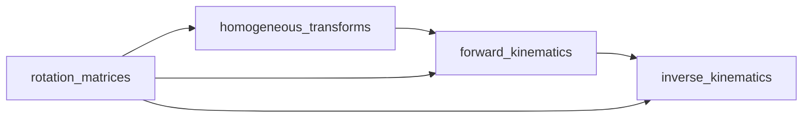

# Кинематика C++

## Описание

Модуль кинематики реализует прямую (Forward Kinematics, FK) и обратную (Inverse Kinematics, IK) кинематику четырёхногого робота с 12 степенями свободы (3 сустава на ногу × 4 ноги). Написан на C++17 с использованием библиотеки Eigen3 для линейной алгебры.

## Параметры звеньев

| Параметр | Значение | Описание |
|----------|----------|----------|
| `body_length` | 0.3762 м | Длина корпуса |
| `body_width` | 0.0935 м | Ширина корпуса |
| `l1` | 0.0 м | Hip (тазобедренный сустав) |
| `l2` | 0.0955 м | Thigh (бедро) |
| `l3` | 0.213 м | Calf (голень, часть 1) |
| `l4` | 0.213 м | Calf (голень, часть 2) |

## Индексация ног

| Индекс | Нога | Положение |
|--------|------|-----------|
| 0 | FR (Front-Right) | Передняя правая |
| 1 | FL (Front-Left) | Передняя левая |
| 2 | RR (Rear-Right) | Задняя правая |
| 3 | RL (Rear-Left) | Задняя левая |

## Прямая кинематика (Forward Kinematics)

### Файлы

- Заголовок: `include/.../kinematics/forward_kinematics.hpp`
- Реализация: `src/kinematics/forward_kinematics.cpp`

### LegBasePositions

Структура с static методом для получения базовой позиции ноги в системе координат корпуса:

```cpp
struct LegBasePositions {
    static Eigen::Vector2d get(int leg_index, double body_length, double body_width);
};
```

**Параметры:**
- `leg_index` -- индекс ноги (0-3)
- `body_length`, `body_width` -- размеры корпуса

**Возвращает:** `{x, y}` базовой точки ноги

### compute_leg_fk_chain

Цепочка однородных преобразований для одной ноги:

```cpp
Eigen::Vector3d compute_leg_fk_chain(
    double theta1, double theta3, double theta4,
    int leg_index,
    double base_x, double base_y,
    double l1, double l2, double l3, double l4
);
```

**Цепочка преобразований:**
```
T_base → T_hip → T_thigh_pitch → T_thigh_trans → T_calf_pitch → T_calf_trans → T_foot
```

**Параметры:**
- `theta1` -- угол hip (поворот вокруг Z)
- `theta3` -- угол thigh (поворот вокруг Y)
- `theta4` -- угол calf (поворот вокруг Y)
- `leg_index` -- индекс ноги
- `base_x, base_y` -- базовая позиция ноги
- `l1-l4` -- длины звеньев

**Возвращает:** `Eigen::Vector3d` -- позицию стопы (x, y, z)

### Класс ForwardKinematics

```cpp
class ForwardKinematics {
public:
    ForwardKinematics(double body_length, double body_width,
                      double l1, double l2, double l3, double l4);
    
    std::vector<Eigen::Vector3d> forward_kinematics_all_legs(
        const std::vector<double>& joint_angles
    );
};
```

**Параметры конструктора:**
- `body_length, body_width` -- размеры корпуса
- `l1-l4` -- длины звеньев

**Метод `forward_kinematics_all_legs`:**
- **Вход:** 12 углов суставов (4 ноги × 3 сустава)
- **Выход:** 4 позиции стоп (`vector<Vector3d>`)

**Пример использования:**

```cpp
ForwardKinematics fk(0.3762, 0.0935, 0.0, 0.0955, 0.213, 0.213);
std::vector<double> angles(12, 0.0); // Все нули
auto foot_positions = fk.forward_kinematics_all_legs(angles);
// foot_positions.size() == 4
// Каждый элемент: {x, y, z}
```

## Обратная кинематика (Inverse Kinematics)

### Файлы

- Заголовок: `include/.../kinematics/inverse_kinematics.hpp`
- Реализация: `src/kinematics/inverse_kinematics.cpp`

### compute_local_positions

Преобразование позиций стоп из глобальной системы координат в локальную систему ноги:

```cpp
Eigen::MatrixXd compute_local_positions(
    double body_dx, double body_dy, double body_dz,
    double roll, double pitch, double yaw,
    const Eigen::MatrixXd& global_positions  // (3, 4)
);
```

**Алгоритм:**
1. Создаёт матрицу вращения ног: `R_legs = rotxyz(π/2, -π/2, 0)`
2. Создаёт матрицу корпуса: `T_blwbl = homog_transform(dx, dy, dz, roll, pitch, yaw)`
3. Для каждой ноги: `local = R_legs × T_blwbl⁻¹ × global`

**Вход:**
- `body_dx, dy, dz` -- позиция корпуса
- `roll, pitch, yaw` -- ориентация корпуса
- `global_positions` -- матрица (3, 4) позиций стоп

**Выход:** Матрица (4, 3) -- по строке на ногу

### compute_joint_angles_for_leg

Аналитическое решение обратной кинематики для одной ноги:

```cpp
std::vector<double> compute_joint_angles_for_leg(
    double x, double y, double z,
    int leg_index,
    double l1, double l2, double l3, double l4
);
```

**Алгоритм:**
1. Вычисляет расстояние от базы до стопы
2. Использует закон косинусов для нахождения углов
3. Применяет знаки ног: `LEG_SIGNS = {1, -1, 1, -1}` для различения левых/правых

**Возвращает:** `{theta1, theta3, theta4}` (hip, thigh, calf)

### compute_all_joint_angles

Оптимизированная версия для всех 4 ног:

```cpp
std::vector<double> compute_all_joint_angles(
    const Eigen::MatrixXd& positions,  // (3, 4)
    double l1, double l2, double l3, double l4
);
```

**Оптимизации:**
- Векторизованные вычисления
- Без повторного вычисления констант
- Предварительное вычисление общих подвыражений

**Вход:** Матрица (3, 4) позиций стоп
**Выход:** 12 углов суставов

### Класс InverseKinematics

```cpp
class InverseKinematics {
public:
    InverseKinematics(double l1, double l2, double l3, double l4);
    
    Eigen::MatrixXd get_local_positions(
        double dx, double dy, double dz,
        double roll, double pitch, double yaw,
        const Eigen::MatrixXd& global_positions
    );
    
    std::vector<double> inverse_kinematics(
        const Eigen::MatrixXd& leg_positions,
        double dx, double dy, double dz,
        double roll, double pitch, double yaw
    );
};
```

**Внутренние компоненты:**
- `ForwardKinematics fk_` -- для валидации

**Метод `inverse_kinematics`:**
Полный пайплайн:
1. `global_positions` → `local_positions`
2. `local_positions` → `joint_angles`

**Пример использования:**

```cpp
InverseKinematics ik(0.0, 0.0955, 0.213, 0.213);
Eigen::MatrixXd positions(3, 4);
// Заполняем позиции стоп...

std::vector<double> angles = ik.inverse_kinematics(
    positions,
    0.0, 0.0, 0.0,  // dx, dy, dz
    0.0, 0.0, 0.0   // roll, pitch, yaw
);
// angles.size() == 12
```

## Зависимости



## Отличия от Python версии

| Аспект | Python | C++ |
|--------|--------|-----|
| **Библиотека** | NumPy | Eigen3 |
| **Типы данных** | `np.ndarray` | `Eigen::MatrixXd`, `Vector3d` |
| **Производительность** | Интерпретируемый | Компилируемый, O2 |
| **Векторизация** | Автоматическая (NumPy) | Ручная оптимизация |
| **Точность** | float64 | double (идентично) |

## Тесты

Тесты находятся в `test/test_fk.cpp`, `test/test_ik.cpp`, `test/test_ik_with_roll.cpp`:

| Тест                      | Что проверяет                                                       |
| ------------------------- | ------------------------------------------------------------------- |
| `test_fk.cpp`             | FK для 12 углов, smoke-тест на 4 позиции                            |
| `test_ik.cpp`             | IK углы совпадают с Python, 12 углов на выходе, диапазон < 2π       |
| `test_base_link_roll.cpp` | 10 тестов rotxyz: identity, 45°, Python совпадение, ортогональность |
| `test_ik_with_roll.cpp`   | 8 тестов IK с roll: zero_roll, roll=45°, roundtrip, симметрия       |

## Связанные документы

- [[Обзор C++ архитектуры]]
- [[Утилиты C++]]
- [[Контроллеры C++]]
- [[Кинематика (Python)]]
- [[Сравнение Python vs C++]]
