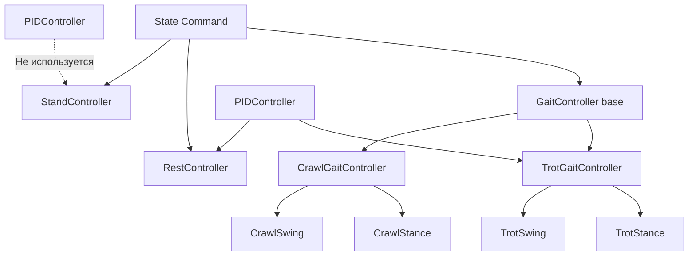
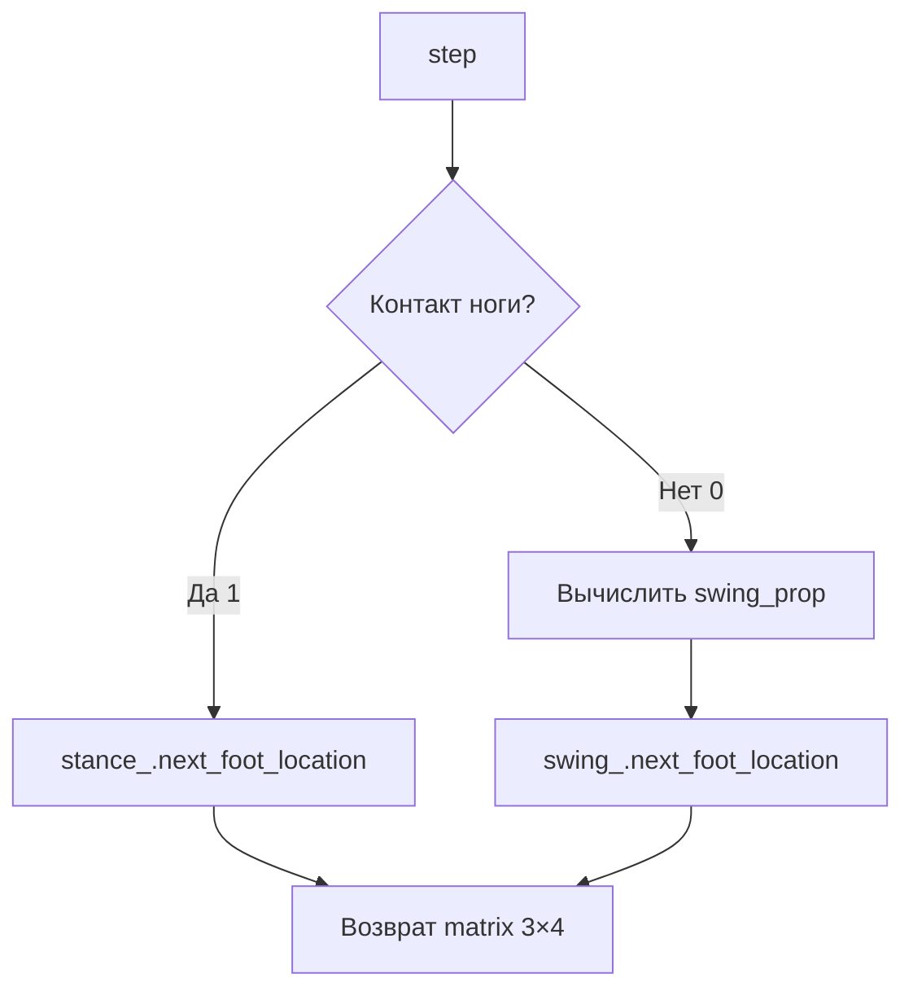

# Контроллеры C++

## Описание

Иерархия контроллеров управления движением четырёхногого робота. Реализует 4 режима: REST, STAND, TROT, CRAWL. Все контроллеры походки следуют архитектуре **Raibert Heuristics**.

## Архитектура контроллеров



## State Command

### Файлы

- Заголовок: `include/.../states/state_command.hpp`
- Реализация: `src/states/state_command.cpp` (пустой, только структуры)

### BehaviorState

Перечисление режимов поведения:

```cpp
enum class BehaviorState {
    REST = 0,   // Покой
    TROT = 1,   // Рысь
    CRAWL = 2,  // Ползание
    STAND = 3   // Стойка
};
```

### struct State

Текущее состояние робота:

```cpp
struct State {
    double body_height = 0.25;                    // Высота корпуса
    Eigen::MatrixXd foot_locations = Eigen::MatrixXd::Zero(3, 4);  // Позиции стоп (3×4)
    std::array<double, 3> body_local_position = {0, 0, 0};        // Локальная позиция
    std::array<double, 3> body_local_orientation = {0, 0, 0};     // Локальная ориентация
    double imu_roll = 0.0;                                         // Крен из IMU
    double imu_pitch = 0.0;                                        // Тангаж из IMU
    int ticks = 0;                                                 // Счётчик тиков
    BehaviorState behavior_state = BehaviorState::REST;            // Текущий режим
    double robot_height = -0.25;                                   // Целевая высота (отрицательная!)
};
```

**Важно:** `robot_height` отрицательная, т.к. ось Z направлена вниз в системе координат робота.

### struct Command

Команда управления:

```cpp
struct Command {
    std::array<double, 3> velocity = {0, 0, 0};     // Линейная скорость {vx, vy, vz}
    std::array<double, 3> yaw_rate = {0, 0, 0};     // Угловая скорость {roll, pitch, yaw}
    double robot_height = -0.25;                     // Целевая высота
    bool trot_event = true;                          // Флаг события TROT
    bool rest_event = true;                          // Флаг события REST
    bool crawl_event = false;                        // Флаг события CRAWL
    bool stand_event = false;                        // Флаг события STAND
};
```

## GaitController (Базовый класс)

### Файлы

- Заголовок: `include/.../controllers/gait_controller.hpp`
- Реализация: `src/controllers/gait_controller.cpp`

### Конструктор

```cpp
GaitController(double stance_time, double swing_time, double time_step,
               const Eigen::MatrixXd& contact_phases,
               const Eigen::MatrixXd& default_stance);
```

**Параметры:**
- `stance_time` -- длительность фазы опоры (сек)
- `swing_time` -- длительность фазы переноса (сек)
- `time_step` -- шаг контроллера (сек)
- `contact_phases` -- матрица контактов (ноги × фазы)
- `default_stance` -- матрица позиций стоп по умолчанию (3×4)

### Ключевые методы

#### phase_index

Номер текущей фазы в цикле:

```cpp
int phase_index(int ticks);
```

**Формула:**
```cpp
return (ticks / time_step) % total_phases;
```

#### subphase_ticks

Сколько тиков прошло в текущей фазе:

```cpp
int subphase_ticks(int ticks);
```

**Формула:**
```cpp
int phase_tick = (ticks / time_step) % total_phases;
int phase_start = ...  // Накопленная длина предыдущих фаз
return phase_tick - phase_start;
```

#### contacts

Вектор контактов (4 элемента) для данного тика:

```cpp
std::vector<int> contacts(int ticks);
```

**Алгоритм:**
1. Вычисляет `phase = phase_index(ticks)`
2. Возвращает столбец из `contact_phases` для данной фазы

#### compute_phase_ticks

Определяет длительность каждой фазы:

```cpp
void compute_phase_ticks();
```

**Алгоритм:**
```cpp
for each phase:
    if any leg in swing (0) in this phase:
        phase_ticks[phase] = swing_ticks
    else:
        phase_ticks[phase] = stance_ticks
```

**Результат:** Заполняет `phase_ticks_` -- массив длительностей фаз в тиках.

## PIDController

### Файлы

- Заголовок: `include/.../controllers/pid_controller.hpp`
- Реализация: `src/controllers/pid_controller.cpp`

### Конструктор

```cpp
PIDController(double kp, double ki, double kd);
```

### Методы

#### run

Вычисление компенсации по текущим ошибкам:

```cpp
std::array<double, 2> run(double roll, double pitch, double current_time);
```

**Возвращает:** `{roll_compensation, pitch_compensation}`

**Алгоритм:**
```cpp
dt = current_time - prev_time;
error_roll = roll - desired_roll;
error_pitch = pitch - desired_pitch;

// Пропорциональная составляющая
P_roll = kp * error_roll;
P_pitch = kp * error_pitch;

// Интегральная составляющая (с anti-windup)
I_roll += ki * error_roll * dt;
I_pitch += ki * error_pitch * dt;
I_roll = clamp(I_roll, -max_i_, max_i_);
I_pitch = clamp(I_pitch, -max_i_, max_i_);

// Дифференциальная составляющая
D_roll = kd * (error_roll - prev_error_roll) / dt;
D_pitch = kd * (error_pitch - prev_error_pitch) / dt;

return {P_roll + I_roll + D_roll, P_pitch + I_pitch + D_pitch};
```

**Anti-windup:** `max_i_ = 0.2` -- ограничение интегральной составляющей.

#### reset

Сброс интегратора и дифференциатора:

```cpp
void reset(double current_time);
```

#### set_desired

Установка целевых значений:

```cpp
void set_desired(double roll, double pitch);
```

### Параметры PID в контроллерах

| Контроллер | kp | ki | kd | max_i |
|------------|-----|-----|------|-------|
| **TrotGait** | 0.15 | 0.02 | 0.002 | 0.2 |
| **RestController** | 0.75 | 2.29 | 0.0 | 0.2 |

## TrotGaitController

### Файлы

- Заголовок: `include/.../controllers/trot_gait.hpp`
- Реализация: `src/controllers/trot_gait.cpp`

### Контактная матрица

Диагональные пары ног поднимаются синхронно:

| Нога | Фаза 0 | Фаза 1 | Фаза 2 | Фаза 3 |
|------|--------|--------|--------|--------|
| FR (0) | 1 | 1 | 1 | 0 |
| FL (1) | 1 | 0 | 1 | 1 |
| RR (2) | 1 | 0 | 1 | 1 |
| RL (3) | 1 | 1 | 1 | 0 |

**Пары:** FR+RL (диагональ 1), FL+RR (диагональ 2)

### Параметры

| Параметр | Значение | Описание |
|----------|----------|----------|
| `stance_time` | 0.04 с | Длительность опоры |
| `swing_time` | 0.18 с | Длительность переноса |
| `time_step` | 0.02 с | Шаг контроллера |
| `stance_ticks` | 2 | Тиков в фазе опоры |
| `swing_ticks` | 9 | Тиков в фазе переноса |
| `phase_length` | 22 | Общая длина фазы |
| `z_leg_lift` | 0.14 м | Высота подъёма ноги |

### Внутренние компоненты

```cpp
class TrotGaitController : public GaitController {
private:
    TrotSwingController swing_;
    TrotStanceController stance_;
    PIDController pid_;
    bool use_imu_;
};
```

### Метод step

Основной шаг контроллера:

```cpp
Eigen::MatrixXd step(int ticks, const State& state, const Command& cmd, double robot_height);
```

**Алгоритм:**



**Детали:**
```cpp
for each leg in 0..3:
    if contacts[leg] == 1:  // Stance фаза
        foot = stance_.next_foot_location(leg, state.foot_positions[leg],
                                          cmd.velocity, robot_height);
    else:  // Swing фаза
        swing_prop = subphase_ticks(ticks) / swing_ticks;
        foot = swing_.next_foot_location(swing_prop, leg, 
                                         state.foot_positions[leg],
                                         cmd.velocity, robot_height);
    result.col(leg) = foot;
return result;
```

### Логика при нулевой скорости

В `robot_controller_node`: при TROT режиме и нулевой скорости -- плавный lerp к `default_stance`:
```cpp
foot_locations = alpha * current + (1 - alpha) * default_stance;  // alpha = 0.1
```

## TrotStanceController

### Файлы

- Заголовок: `include/.../controllers/trot_stance.hpp`
- Реализация: `src/controllers/trot_stance.cpp`

### Конструктор

```cpp
TrotStanceController(double phase_length, double stance_ticks, 
                     double swing_ticks, double time_step, 
                     double z_error_constant);
```

### Методы

#### position_delta

Вычисление дельты позиции стопы в фазе опоры:

```cpp
Eigen::Vector3d position_delta(int leg_index, 
                                const Eigen::Vector3d& state_foot,
                                const std::array<double, 3>& cmd_vel,
                                double robot_height);
```

**Алгоритм:**
```cpp
// X/Y: пропорционально скорости, делённой на 4 ноги и stance_ticks
delta_x = cmd_vel[0] / (4 * stance_ticks);
delta_y = cmd_vel[1] / (4 * stance_ticks);

// Z: P-регулятор к целевой высоте
delta_z = (robot_height - state_foot.z()) / z_error_constant;

return {delta_x, delta_y, delta_z};
```

#### next_foot_location

Применение дельты + поворот через угловые скорости:

```cpp
Eigen::Vector3d next_foot_location(int leg_index,
                                    const Eigen::Vector3d& state_foot,
                                    const std::array<double, 3>& cmd_vel,
                                    const std::array<double, 3>& yaw_rate,
                                    double robot_height,
                                    double dt);
```

**Алгоритм:**
```cpp
delta = position_delta(leg_index, state_foot, cmd_vel, robot_height);
new_pos = state_foot + delta;

// Поворот через угловые скорости
Eigen::Matrix3d R = rotxyz(-yaw_rate[0]*dt, -yaw_rate[1]*dt, -yaw_rate[2]*dt);
return R * new_pos;
```

## TrotSwingController

### Файлы

- Заголовок: `include/.../controllers/trot_swing.hpp`
- Реализация: `src/controllers/trot_swing.cpp`

### Методы

#### raibert_touchdown_location

Raibert Heuristic для точки приземления:

```cpp
Eigen::Vector3d raibert_touchdown_location(int leg_index,
                                            const std::array<double, 3>& cmd_vel);
```

**Алгоритм:**
```cpp
// Предсказание перемещения
delta_pos = cmd_vel * phase_length * time_step;

// Компенсация поворота
rotation = rotz(stance_ticks * time_step * cmd_vel[2]);

return rotation * default_stance.col(leg_index) + delta_pos;
```

#### swing_height

Треугольный профиль высоты подъёма ноги:

```cpp
double swing_height(double swing_prop);
```

**Формула:**
```cpp
if swing_prop < 0.5:
    return z_leg_lift * (swing_prop / 0.5);  // Линейный рост
else:
    return z_leg_lift * ((1 - swing_prop) / 0.5);  // Линейный спад
```

**График:**
```
z_leg_lift |    /\
           |   /  \
           |  /    \
      0    |_/______\___
           0   0.5    1  (swing_prop)
```

#### next_foot_location

Полный шаг swing фазы:

```cpp
Eigen::Vector3d next_foot_location(double swing_prop, int leg_index,
                                    const Eigen::Vector3d& current,
                                    const std::array<double, 3>& cmd_vel,
                                    double robot_height);
```

**Алгоритм:**
```cpp
// X/Y: interpolation от текущей к точке приземления
touchdown = raibert_touchdown_location(leg_index, cmd_vel);
x = current.x() + swing_prop * (touchdown.x() - current.x());
y = current.y() + swing_prop * (touchdown.y() - current.y());

// Z: профиль высоты
z = robot_height + swing_height(swing_prop);

return {x, y, z};
```

## CrawlGaitController

### Файлы

- Заголовок: `include/.../controllers/crawl_gait.hpp`
- Реализация: `src/controllers/crawl_gait.cpp`

### Контактная матрица

Одна нога поднимается за раз (8 фаз):

| Нога | Ф0 | Ф1 | Ф2 | Ф3 | Ф4 | Ф5 | Ф6 | Ф7 |
|------|-----|-----|-----|-----|-----|-----|-----|-----|
| FR | 1 | 1 | 1 | 0 | 1 | 1 | 1 | 1 |
| FL | 1 | 1 | 1 | 1 | 1 | 1 | 1 | 0 |
| RR | 1 | 0 | 1 | 1 | 1 | 1 | 1 | 1 |
| RL | 1 | 1 | 1 | 1 | 1 | 0 | 1 | 1 |

**Последовательность подъёма:** FR → RR → FL → RL

### Параметры

| Параметр | Значение | Описание |
|----------|----------|----------|
| `stance_time` | 0.55 с | Длительность опоры |
| `swing_time` | 0.45 с | Длительность переноса |
| `time_step` | 0.02 с | Шаг контроллера |
| `body_shift_y` | 0.06 м | Боковое смещение корпуса |

### Особенности

- `first_cycle_` -- флаг первого цикла (для коррекции бокового смещения)
- `reset()` -- сброс `first_cycle_`

## CrawlStanceController

### Файлы

- Заголовок: `include/.../controllers/crawl_stance.hpp`
- Реализация: `src/controllers/crawl_stance.cpp`

### Отличия от TrotStance

1. **Боковое смещение:** `body_shift_y = 0.06` м
2. **X-скорость делится на 3** (не на 4, как в троте) -- т.к. 3 ноги всегда в контакте
3. **Параметры `move_sideways`, `move_left`** -- для коррекции бокового смещения
4. **`shift_factor`** -- `1` для первого цикла, `2` для последующих

```cpp
side_vel = move_sideways ? cmd_vel[1] : 0.0;
delta_x = (cmd_vel[0] / 3 + side_vel) / stance_ticks * shift_factor;
```

## CrawlSwingController

### Файлы

- Заголовок: `include/.../controllers/crawl_swing.hpp`
- Реализация: `src/controllers/crawl_swing.cpp`

### Отличия от TrotSwing

- `raibert_touchdown_location` принимает дополнительный параметр `shifted_left`
- Добавляет коррекцию `body_shift_y` при боковом смещении
- Нет параметра `robot_height` (использует заглушку)

## RestController

### Файлы

- Заголовок: `include/.../controllers/rest_controller.hpp`
- Реализация: `src/controllers/rest_controller.cpp`

### Метод step

```cpp
Eigen::MatrixXd step(const State& state, const Command& cmd);
```

**Алгоритм:**
```cpp
// Возвращает default_stance с Z = cmd.robot_height
result = default_stance;
result.row(2).setConstant(cmd.robot_height);

// Если use_imu_ -- применяем PID компенцию
if use_imu_:
    pid_compensation = pid_.run(state.imu_roll, state.imu_pitch, current_time);
    R = rotxyz(pid_compensation[0], pid_compensation[1], 0);
    result = R * result;

return result;
```

**Параметры PID:** `kp=0.75, ki=2.29, kd=0.0`

## StandController

### Файлы

- Заголовок: `include/.../controllers/stand_controller.hpp`
- Реализация: `src/controllers/stand_controller.cpp`

### Метод run

```cpp
Eigen::MatrixXd run(State& state, const Command& cmd);
```

**Алгоритм:**
```cpp
// Обновляем локальную позицию корпуса
state.body_local_position[0] += cmd.velocity[0] * body_velocity_scale_;
state.body_local_position[1] += cmd.velocity[1] * body_velocity_scale_;

// Обновляем локальную ориентацию
state.body_local_orientation[2] += cmd.yaw_rate[2] * body_angular_scale_;

// Ограничения
state.body_local_position[0] = clamp(..., -max_linear_velocity_, max_linear_velocity_);
state.body_local_orientation[2] = clamp(..., -max_angular_velocity_, max_angular_velocity_);

// Возвращаем default_stance с Z = cmd.robot_height
result = default_stance;
result.row(2).setConstant(cmd.robot_height);
return result;
```

**Параметры:**

| Параметр | Значение | Описание |
|----------|----------|----------|
| `max_linear_velocity_` | 0.035 м/с | Макс. линейная скорость |
| `max_angular_velocity_` | 0.1 рад/с | Макс. угловая скорость |
| `body_velocity_scale_` | 0.01 | Масштаб скорости |
| `body_angular_scale_` | 0.005 | Масштаб угловой скорости |

## Robot Controller Node

### Файлы

- Реализация: `src/nodes/robot_controller_node.cpp`

### Логика control_loop

```cpp
void control_loop() {
    // 1. Grace period 2 секунды (120 тиков) при старте
    if (ticks_ < 120) {
        publish_default_joints();
        return;
    }
    
    // 2. Вызов соответствующего контроллера
    switch (state_.behavior_state) {
        case BehaviorState::TROT:
            foot_locs = trot_gait_->step(ticks_, state_, cmd_, state_.robot_height);
            break;
        case BehaviorState::CRAWL:
            foot_locs = crawl_gait_->step(ticks_, state_, cmd_, state_.robot_height);
            // Ограничение скорости: vx<0.011, vy<0.0055, yaw<0.15
            break;
        case BehaviorState::REST:
            foot_locs = rest_->step(state_, cmd_);
            break;
        case BehaviorState::STAND:
            foot_locs = stand_->run(state_, cmd_);
            break;
    }
    
    // 3. Обновить foot_locations
    state_.foot_locations = foot_locs;
    
    // 4. Опубликовать foot contacts
    publish_foot_contacts();
    
    // 5. Вызвать IK -> опубликовать углы
    joints = ik_->inverse_kinematics(foot_locs, ...);
    publish_joints(joints);
}
```

**Частота:** 60 Hz

**Ограничения CRAWL:**
```cpp
cmd.velocity[0] = clamp(cmd.velocity[0], -0.011, 0.011);
cmd.velocity[1] = clamp(cmd.velocity[1], -0.0055, 0.0055);
cmd.yaw_rate[2] = clamp(cmd.yaw_rate[2], -0.15, 0.15);
```

## Тесты

| Файл | Что проверяет |
|------|---------------|
| `test_pid.cpp` | PID возвращает 2 элемента |
| `test_gait.cpp` | `phase_ticks = [2,9,2,9]`, contacts размер 4 |
| `test_cross_validation.cpp` | TrotGait, TrotSwing, RestController (совпадение с Python) |
| `test_step_trot.cpp` | 8 тестов TrotStance: z_convergence, forward_motion, yaw_rotation, Python equivalence |

## Связанные документы

- [[Обзор C++ архитектуры]]
- [[Кинематика C++]]
- [[Одометрия C++]]
- [[Gait Controller (Python)]]
- [[Trot Gait Controller (Python)]]
- [[Crawl Gait Controller (Python)]]
