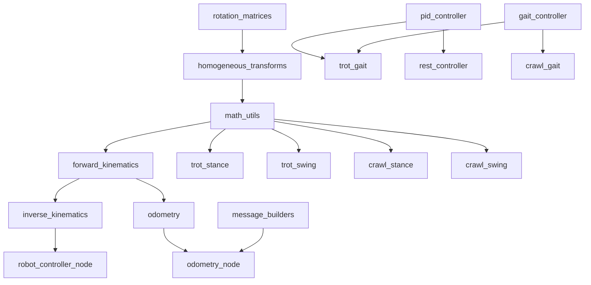

# Обзор C++ архитектуры

## Описание

Пакет `quadropted_controller_cpp` -- это высокопроизводительная реализация контроллера четырёхногого робота (Unitree Go1/Go2) на **C++17** с использованием **ROS 2 Jazzy**. Является портом Python-реализации с идентичной функциональностью и подтверждённой численной точностью через кросс-валидацию.

## Ключевые особенности

| Характеристика | Значение |
|----------------|----------|
| **Язык** | C++17 |
| **Сборка** | CMake + Ament |
| **Линейная алгебра** | Eigen3 |
| **Тестирование** | Google Mock (12 наборов тестов) |
| **Бенчмарки** | Google Benchmark |
| **Частота контроллера** | 60 Hz |
| **Частота одометрии** | 50 Hz |
| **Компиляторы** | GCC, Clang |
| **Флаги** | `-Wall -Wextra -Wpedantic -O2` |

## Структура пакета

```
quadropted_controller_cpp/
├── include/quadropted_controller_cpp/
│   └── utils/
│       ├── math_utils.hpp                 # Агрегирующий заголовок
│       ├── rotation_matrices.hpp          # Матрицы вращения (Rx, Ry, Rz, Rxyz)
│       ├── homogeneous_transforms.hpp     # Однородные преобразования
│       └── message_builders.hpp           # Структуры для ROS сообщений
│   └── kinematics/
│       ├── forward_kinematics.hpp         # Прямая кинематика
│       └── inverse_kinematics.hpp         # Обратная кинематика
│   └── odometry/
│       └── odometry.hpp                   # Однометрия (State + Update)
│   └── states/
│       └── state_command.hpp              # Команды и состояния (State, Command)
│   └── controllers/
│       ├── gait_controller.hpp            # Базовый класс походки
│       ├── pid_controller.hpp             # PID-регулятор
│       ├── trot_gait.hpp                  # Походка рысью
│       ├── trot_stance.hpp                # Фаза опоры (Trot)
│       ├── trot_swing.hpp                 # Фаза переноса (Trot)
│       ├── crawl_gait.hpp                 # Ползущая походка
│       ├── crawl_stance.hpp               # Фаза опоры (Crawl)
│       ├── crawl_swing.hpp                # Фаза переноса (Crawl)
│       ├── rest_controller.hpp            # Режим покоя
│       └── stand_controller.hpp           # Режим стойки
├── src/
│   ├── utils/                             # Реализация утилит
│   ├── kinematics/                        # Реализация кинематики
│   ├── odometry/                          # Реализация одометрии
│   │   ├── odometry_state.cpp             # Состояние одометрии
│   │   └── odometry_update.cpp            # Шаг обновления
│   ├── states/                            # Реализация состояний
│   ├── controllers/                       # Реализация контроллеров
│   └── nodes/                             # ROS 2 узлы
│       ├── robot_controller_node.cpp      # Главный контроллер (60 Hz)
│       ├── odometry_node.cpp              # Узел одометрии (50 Hz)
│       └── cmd_vel_pub.cpp                # Конвертер cmd_vel
├── test/                                  # Google Mock тесты (12 файлов)
├── benchmark/                             # Google Benchmark
│   └── benchmark.cpp
├── CMakeLists.txt
└── package.xml
```

## Исполняемые узлы

### 1. robot_controller_node

Главный узел управления роботом (60 Hz).

**Подписки:**
- `robot_velocity` (`RobotVelocity`) -- команды скорости
- `imu` (`Imu`) -- данные IMU для компенсации крена
- `robot_mode` (`RobotModeCommand`) -- переключение режимов

**Публикации:**
- `joint_group_controller/commands` (`Float64MultiArray`) -- 12 углов суставов
- `foot_contact` (`RobotFootContact`) -- контакты 4 ног

**Сервисы:**
- `robot_behavior_command` (`RobotBehaviorCommand`) -- команды sit/up/walk

**Режимы работы:**
- **REST** -- покой, PID компенция крена/тангажа
- **STAND** -- стойка, вращение на месте
- **TROT** -- походка рысью (диагональные пары ног)
- **CRAWL** -- ползущая походка (последовательные ноги)

### 2. odometry_node

Узел одометрии на основе кинематики (50 Hz).

**Подписки:**
- `imu_plugin/out` (`Imu`) -- yaw из кватерниона
- `joint_group_controller/commands` -- 12 углов суставов
- `foot_contact` (`RobotFootContact`) -- контакты стоп
- `robot_velocity` (`RobotVelocity`) -- линейная скорость

**Публикации:**
- `odom` (`Odometry`) -- позиция (x, y, theta), ориентация, скорости
- `foot_markers` (`MarkerArray`) -- визуализация позиций стоп
- **TF:** `odom` → `base`

### 3. cmd_vel_pub

Промежуточный узел конвертации команд скорости.

**Назначение:** Конвертирует `geometry_msgs/Twist` (cmd_vel) в `RobotVelocity` с нелинейным сглаживанием:
- X: `0.035 * (1 - exp(-100 * |value|))`
- Y: `0.012 * (1 - exp(-100 * |value|))`

## Архитектурные компоненты

### Утилиты (Utils)

Базовый слой, не зависящий от других компонентов:
- **Rotation Matrices** -- матрицы вращения Rx, Ry, Rz, Rxyz (ZYX порядок)
- **Homogeneous Transforms** -- однородные преобразования (трансляция + вращение)
- **Math Utils** -- агрегирующий заголовок
- **Message Builders** -- структуры и функции для построения ROS сообщений

### Кинематика (Kinematics)

Зависит от Utils (матрицы и преобразования):
- **Forward Kinematics** -- вычисление позиций стоп из 12 углов суставов
- **Inverse Kinematics** -- вычисление 12 углов из позиций стоп

### Однометрия (Odometry)

Использует Forward Kinematics для определения позиций стоп:
- **OdometryState** -- состояние с скользящим окном (14 значений)
- **OdometryUpdate** -- шаг интегрирования с коэффициентом контакта 0.65

### Контроллеры (Controllers)

Иерархия контроллеров походки:
- **GaitController** (базовый) -- общая логика фаз и контактов
- **TrotGaitController** -- рысь (диагональные пары)
- **CrawlGaitController** -- ползание (последовательные ноги)
- **RestController** -- покой с PID компенсацией
- **StandController** -- стойка с вращением

## Параметры робота

### Геометрические параметры (Go1/Go2)

| Параметр | Значение | Описание |
|----------|----------|----------|
| `body_length` | 0.3762 м | Длина корпуса |
| `body_width` | 0.0935 м | Ширина корпуса |
| `l1` | 0.0 м | Бедро (hip) |
| `l2` | 0.0955 м | Бедро (thigh) |
| `l3` | 0.213 м | Голень (calf) |
| `l4` | 0.213 м | Голень (calf) |

### Параметры контроллеров

| Контроллер | Параметр | Значение |
|------------|----------|----------|
| **Trot** | stance_time | 0.04 с |
| | swing_time | 0.18 с |
| | time_step | 0.02 с |
| | z_leg_lift | 0.14 м |
| | PID (kp, ki, kd) | 0.15, 0.02, 0.002 |
| **Crawl** | stance_time | 0.55 с |
| | swing_time | 0.45 с |
| | time_step | 0.02 с |
| | body_shift_y | 0.06 м |
| **Rest** | PID (kp, ki, kd) | 0.75, 2.29, 0.0 |
| **Stand** | max_linear_velocity | 0.035 м/с |
| | max_angular_velocity | 0.1 рад/с |

## Зависимости между компонентами



## Запуск

### Через Makefile

```bash
# Запуск с C++ контроллером
make gazebo-cpp

# Запуск телеоперации
make teleop

# Переключение режимов
make trot
make crawl
make rest
make stand
```

### Через ROS 2

```bash
# Запуск launch файла
ros2 launch quadropted_controller_cpp quadropted_controller_cpp.launch.py

# Запуск отдельного узла
ros2 run quadropted_controller_cpp robot_controller_node --ros-args -r __ns:=/robot1
ros2 run quadropted_controller_cpp odometry_node --ros-args -r __ns:=/robot1
```

## Связанные документы

- [[Кинематика C++]]
- [[Контроллеры C++]]
- [[Одометрия C++]]
- [[Утилиты C++]]
- [[Тестирование C++]]
- [[Производительность C++]]
- [[Сравнение Python vs C++]]
