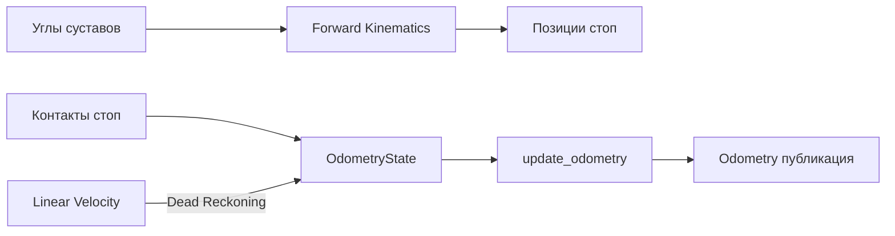
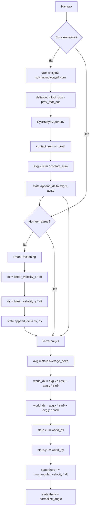

# Однометрия C++

## Описание

Модуль одометрии оценивает положение и ориентацию робота в мировом пространстве на основе:
- Позиций стоп из прямой кинематики (FK)
- Контактов стоп с землёй
- Команд линейной скорости (dead reckoning при отсутствии контактов)

Работает на частоте **50 Hz** в отдельном ROS 2 узле.

## Архитектура



## OdometryState

### Файлы

- Заголовок: `include/.../odometry/odometry.hpp`
- Реализация: `src/odometry/odometry_state.cpp`

### Структура состояния

| Поле | Тип | Значение по умолчанию | Описание |
|------|-----|----------------------|----------|
| `x` | `double` | 0.0 | Позиция X в мире |
| `y` | `double` | 0.0 | Позиция Y в мире |
| `theta` | `double` | 0.0 | Ориентация (yaw) |
| `linear_velocity_x` | `double` | 0.0 | Скорость X из команд |
| `linear_velocity_y` | `double` | 0.0 | Скорость Y из команд |
| `imu_angular_velocity` | `double` | 0.0 | Угловая скорость IMU |
| `filter_window_size` | `int` | 14 | Размер окна сглаживания |
| `delta_x_queue` | `deque<double>` | empty | Очередь дельт X |
| `delta_y_queue` | `deque<double>` | empty | Очередь дельт Y |
| `foot_positions[4]` | `Vector3d` | Zero | Текущие позиции стоп из FK |
| `prev_foot_positions[4]` | `optional<Vector2d>` | nullopt | Предыдущие позиции (X, Y) |
| `foot_contacts[4]` | `bool` | false | Контакт каждой ноги |
| `joint_positions[12]` | `double` | 0.0 | Текущие углы суставов |

### Методы состояния

#### append_delta

Добавление дельты перемещения в скользящее окно:

```cpp
void append_delta(double dx, double dy);
```

**Алгоритм:**
1. Добавляет `dx`, `dy` в соответствующие очереди
2. Если размер очереди > `filter_window_size` (14):
   - Удаляет oldest элемент
   - Обновляет бегущую сумму
3. Поддерживает `sum_delta_x`, `sum_delta_y`

#### average_delta

Вычисление среднего перемещения в окне:

```cpp
std::pair<double, double> average_delta() const;
```

**Возвращает:** `{avg_dx, avg_dy}`

**Формула:**
```
avg_dx = sum_delta_x / queue.size()
avg_dy = sum_delta_y / queue.size()
```

Если очередь пуста: возвращает `{0.0, 0.0}`

#### reset

Полный сброс состояния:

```cpp
void reset();
```

**Сбрасывает:**
- `x, y, theta` → 0
- `delta_x_queue, delta_y_queue` → пустые
- `sum_delta_x, sum_delta_y` → 0
- `prev_foot_positions` → nullopt
- `foot_contacts` → false

## Функции обновления

### Файлы

- Реализация: `src/odometry/odometry_update.cpp`

### normalize_angle

Нормализация угла в диапазон `[-π, π]`:

```cpp
double normalize_angle(double angle);
```

**Алгоритм:**
```cpp
return atan2(sin(angle), cos(angle));
```

**Преимущество:** Стабильнее, чем fmod (без проблем с переполнением).

### update_odometry

Основной шаг одометрии:

```cpp
void update_odometry(OdometryState& state, double dt, double contact_count_coeff = 0.65);
```

**Параметры:**
- `state` -- текущее состояние (изменяется)
- `dt` -- время шага (0.02 с при 50 Hz)
- `contact_count_coeff` -- коэффициент на ногу (по умолчанию 0.65)

**Алгоритм:**



**Детали:**

1. **Расчёт дельт стоп:**
   ```cpp
   for each leg in 0..3:
       if foot_contacts[leg] and prev_foot_positions[leg].has_value():
           deltafoot = foot_positions[leg].head<2>() - prev_foot_positions[leg]
           delta_x_sum += deltafoot.x()
           delta_y_sum += deltafoot.y()
           contact_sum += contact_count_coeff  // 0.65
   ```

2. **Dead Reckoning (нет контактов):**
   ```cpp
   if contact_sum == 0:
       delta_x = linear_velocity_x * dt
       delta_y = linear_velocity_y * dt
       state.append_delta(delta_x, delta_y)
   ```

3. **Интеграция в мировую систему:**
   ```cpp
   avg_dx, avg_dy = state.average_delta()
   world_dx = avg_dx * cos(theta) - avg_dy * sin(theta)
   world_dy = avg_dx * sin(theta) + avg_dy * cos(theta)
   state.x += world_dx
   state.y += world_dy
   state.theta += imu_angular_velocity * dt
   ```

**Почему `contact_count_coeff = 0.65`:**
- При 4 контактирующих ногах: `4 × 0.65 = 2.6`
- Это масштабирует среднюю дельту, компенсируя проскальзывание
- Эмпирически подобранное значение

## Odometry Node

### Файлы

- Реализация: `src/nodes/odometry_node.cpp`

### Параметры узла

| Параметр | Значение | Описание |
|----------|----------|----------|
| Частота | 50 Hz | Таймер 20 мс |
| namespace | `robot1` | Для мультироботной системы |

### Подписки

| Топик | Тип | Описание |
|-------|-----|----------|
| `imu_plugin/out` | `Imu` | Yaw из кватерниона |
| `joint_group_controller/commands` | `Float64MultiArray` | 12 углов суставов |
| `foot_contact` | `RobotFootContact` | Контакты 4 ног |
| `robot_velocity` | `RobotVelocity` | Линейная скорость |

### Публикации

| Топик | Тип | Описание |
|-------|-----|----------|
| `odom` | `Odometry` | Позиция, ориентация, скорости |
| `foot_markers` | `MarkerArray` | Визуализация стоп в RViz |
| **TF** | `odom` → `base` | Трансформ |

### Логика работы

```cpp
void timer_callback() {
    // 1. Вычислить позиции стоп из FK
    calculate_foot_positions();
    
    // 2. Обновить одометрию
    update_odometry_step();
    
    // 3. Опубликовать Odometry
    publish_odometry();
    
    // 4. Опубликовать маркеры
    publish_markers();
}
```

## Параметры робота

| Параметр | Значение | Описание |
|----------|----------|----------|
| `filter_window_size` | 14 | Размер окна сглаживания |
| `contact_count_coeff` | 0.65 | Коэффициент на ногу |
| `dt` | 0.02 с | Время шага (50 Hz) |

## Отличия от Python версии

| Аспект | Python | C++ |
|--------|--------|-----|
| **Очередь** | `list` с slice | `std::deque` с бегущей суммой |
| **FK** | NumPy массивы | Eigen `Vector3d` |
| **Контакты** | `Optional[ndarray]` | `std::optional<Vector2d>` |
| **Производительность** | ~1.5 мс/шаг | ~0.05 мс/шаг (30× быстрее) |
| **Точность** | float64 | double (идентично) |

## Тесты

| Файл | Что проверяет |
|------|---------------|
| `test_odometry.cpp` | `append_delta`, `average_delta`, `reset`, `update_odometry` без контактов |

## Связанные документы

- [[Обзор C++ архитектуры]]
- [[Кинематика C++]]
- [[Одометрия по контакту стоп (Python)]]
- [[Сравнение Python vs C++]]
