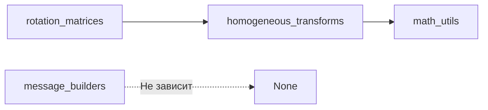

# Утилиты C++

## Описание

Базовый слой библиотеки, предоставляющий математические функции и утилиты для построения ROS сообщений. Не зависит от других компонентов проекта. Используется всеми контроллерами, кинематикой и одометрией.

## Rotation Matrices

### Файлы

- Заголовок: `include/.../utils/rotation_matrices.hpp`
- Реализация: `src/utils/rotation_matrices.cpp`

### Функции

Все функции находятся в пространстве имён `quadropted`.

#### rotx

Матрица вращения вокруг оси X (крен/roll):

```cpp
Eigen::Matrix3d rotx(double alpha);
```

**Параметры:**
- `alpha` -- угол вокруг X (радианы)

**Возвращает:** Матрица 3×3

**Формула:**
```
[1,    0,         0       ]
[0,  cos(α),  -sin(α)    ]
[0,  sin(α),   cos(α)    ]
```

#### roty

Матрица вращения вокруг оси Y (тангаж/pitch):

```cpp
Eigen::Matrix3d roty(double beta);
```

**Параметры:**
- `beta` -- угол вокруг Y (радианы)

**Возвращает:** Матрица 3×3

**Формула:**
```
[ cos(β),  0,  sin(β) ]
[    0,    1,    0    ]
[-sin(β),  0,  cos(β) ]
```

#### rotz

Матрица вращения вокруг оси Z (рыскание/yaw):

```cpp
Eigen::Matrix3d rotz(double gamma);
```

**Параметры:**
- `gamma` -- угол вокруг Z (радианы)

**Возвращает:** Матрица 3×3

**Формула:**
```
[cos(γ),  -sin(γ),  0]
[sin(γ),   cos(γ),  0]
[   0,       0,     1]
```

#### rotxyz

Составная матрица вращения в порядке ZYX (yaw-pitch-roll):

```cpp
Eigen::Matrix3d rotxyz(double alpha, double beta, double gamma);
```

**Параметры:**
- `alpha` -- roll (вокруг X)
- `beta` -- pitch (вокруг Y)
- `gamma` -- yaw (вокруг Z)

**Возвращает:** Матрица 3×3

**Формула:** `R = Rz(γ) × Ry(β) × Rx(α)`

**Оптимизация:** Элементы матрицы вычислены аналитически в одном выражении для производительности (без промежуточных матриц).

**Свойства:**
- Ортогональная матрица: `R⁻¹ = Rᵀ`
- Определитель = 1

## Homogeneous Transforms

### Файлы

- Заголовок: `include/.../utils/homogeneous_transforms.hpp`
- Реализация: `src/utils/homogeneous_transforms.cpp`

### Функции

#### homog_transxyz

Однородная матрица чистой трансляции (переноса):

```cpp
Eigen::Matrix4d homog_transxyz(double dx, double dy, double dz);
```

**Возвращает:** Матрица 4×4:
```
[1, 0, 0, dx]
[0, 1, 0, dy]
[0, 0, 1, dz]
[0, 0, 0, 1 ]
```

#### homog_transform

Однородная матрица трансляции + вращения:

```cpp
Eigen::Matrix4d homog_transform(
    double dx, double dy, double dz,
    double alpha, double beta, double gamma
);
```

**Алгоритм:**
1. Вычисляет `R = rotxyz(alpha, beta, gamma)`
2. Создаёт матрицу 4×4 с R и трансляцией

**Возвращает:** Матрица 4×4:
```
[R₁₁, R₁₂, R₁₃, dx]
[R₂₁, R₂₂, R₂₃, dy]
[R₃₁, R₃₂, R₃₃, dz]
[ 0,   0,   0,   1]
```

#### homog_transform_inverse

Быстрое обращение однородной матрицы:

```cpp
Eigen::Matrix4d homog_transform_inverse(const Eigen::Matrix4d& T);
```

**Алгоритм:**
Для ортогональных матриц вращения:
- `R⁻¹ = Rᵀ` (транспонирование)
- `t⁻¹ = -Rᵀ × t`

**Преимущество:** Быстрее общего метода обращения матрицы (без Гаусса).

**Возвращает:** Обратная матрица 4×4

## Math Utils

### Файлы

- Заголовок: `include/.../utils/math_utils.hpp`

Агрегирующий заголовок, включающий:
- `rotation_matrices.hpp`
- `homogeneous_transforms.hpp`

Файл `src/utils/math_utils.cpp` пустой -- все функции реализованы в соответствующих `.cpp` файлах.

## Message Builders

### Файлы

- Заголовок: `include/.../utils/message_builders.hpp`
- Реализация: `src/utils/message_builders.cpp`

### Структуры данных

#### Quaternion

```cpp
struct Quaternion {
    double x, y, z, w;
};
```

#### Position

```cpp
struct Position {
    double x, y, z;
};
```

#### TwistLin / TwistAng

```cpp
struct TwistLin {
    double x, y, z;
};

struct TwistAng {
    double x, y, z;
};
```

#### OdometryData

Полный набор данных одометрии:

```cpp
struct OdometryData {
    std::string frame_id;
    double stamp;
    Position position;
    Quaternion orientation;
    TwistLin linear_velocity;
    TwistAng angular_velocity;
};
```

#### TFData

Данные для tf2 трансформации:

```cpp
struct TFData {
    std::string parent_frame;
    std::string child_frame;
    Position position;
    Quaternion orientation;
};
```

#### MarkerData

Данные для визуализации маркеров ног в RViz:

```cpp
struct MarkerData {
    double x, y, z;
    int id;
    float r, g, b;  // Цвет (RGB)
};
```

### Функции

#### build_quaternion_from_yaw

Создание кватерниона только по углу yaw:

```cpp
Quaternion build_quaternion_from_yaw(double theta);
```

**Алгоритм:**
- `x = 0, y = 0`
- `z = sin(theta / 2)`
- `w = cos(theta / 2)`

**Применение:** Когда робот движается только в плоскости (без крена и тангажа).

#### build_odometry_data

Сборка полного набора одометрии:

```cpp
OdometryData build_odometry_data(
    const std::string& frame_id,
    double stamp,
    double x, double y, double theta,
    double linear_x, double linear_y,
    double angular_z
);
```

#### build_tf_data

Сборка данных для tf2:

```cpp
TFData build_tf_data(
    const std::string& parent_frame,
    const std::string& child_frame,
    double x, double y, double theta
);
```

#### build_marker_data

Создание массива маркеров для 4 ног:

```cpp
std::vector<MarkerData> build_marker_data(
    const std::vector<Eigen::Vector3d>& foot_positions,
    int start_id
);
```

**Цвета маркеров:**
| Нога | Цвет | RGB |
|------|------|-----|
| FR (Front-Right) | Красный | (1.0, 0.0, 0.0) |
| FL (Front-Left) | Зелёный | (0.0, 1.0, 0.0) |
| RR (Rear-Right) | Синий | (0.0, 0.0, 1.0) |
| RL (Rear-Left) | Жёлтый | (1.0, 1.0, 0.0) |

## Зависимости



## Использование

### Пример: Матрицы вращения

```cpp
#include "quadropted_controller_cpp/utils/math_utils.hpp"

// Матрица вращения: roll=30°, pitch=45°, yaw=60°
double roll = 30.0 * M_PI / 180.0;
double pitch = 45.0 * M_PI / 180.0;
double yaw = 60.0 * M_PI / 180.0;

Eigen::Matrix3d R = quadropted::rotxyz(roll, pitch, yaw);

// Проверка ортогональности
Eigen::Matrix3d identity = R * R.transpose();
// identity должно быть близко к единичной матрице
```

### Пример: Однородные преобразования

```cpp
#include "quadropted_controller_cpp/utils/homogeneous_transforms.hpp"

// Преобразование: перенос + вращение
Eigen::Matrix4d T = quadropted::homog_transform(
    0.5, 0.3, 0.2,  // dx, dy, dz
    0.0, 0.0, 0.5   // roll, pitch, yaw
);

// Обратное преобразование
Eigen::Matrix4d T_inv = quadropted::homog_transform_inverse(T);

// Проверка: T * T_inv ≈ I
Eigen::Matrix4d I = T * T_inv;
```

### Пример: Построение сообщений

```cpp
#include "quadropted_controller_cpp/utils/message_builders.hpp"

// Однометрия
auto odom = quadropted::build_odometry_data(
    "odom", 1234567890.0,
    1.5, 2.3, 0.5,   // x, y, theta
    0.1, 0.0,        // linear_x, linear_y
    0.05             // angular_z
);

// Маркеры
std::vector<Eigen::Vector3d> feet = {
    {0.2, 0.1, -0.3},
    {-0.2, 0.1, -0.3},
    {0.2, -0.1, -0.3},
    {-0.2, -0.1, -0.3}
};
auto markers = quadropted::build_marker_data(feet, 0);
```

## Тесты

| Файл | Что проверяет |
|------|---------------|
| `test_rotation_matrices.cpp` | `rotx`, `roty`, `rotz`, `rotxyz` (совпадение с Python для 10 наборов углов) |
| `test_homogeneous_transforms.cpp` | `homog_transxyz`, `homog_transform`, `homog_transform_inverse` (M × M⁻¹ = I) |
| `test_message_builders.cpp` | OdometryData и TFData поля |

## Связанные документы

- [[Обзор C++ архитектуры]]
- [[Кинематика C++]]
- [[Контроллеры C++]]
- [[Трансформации (Python)]]
