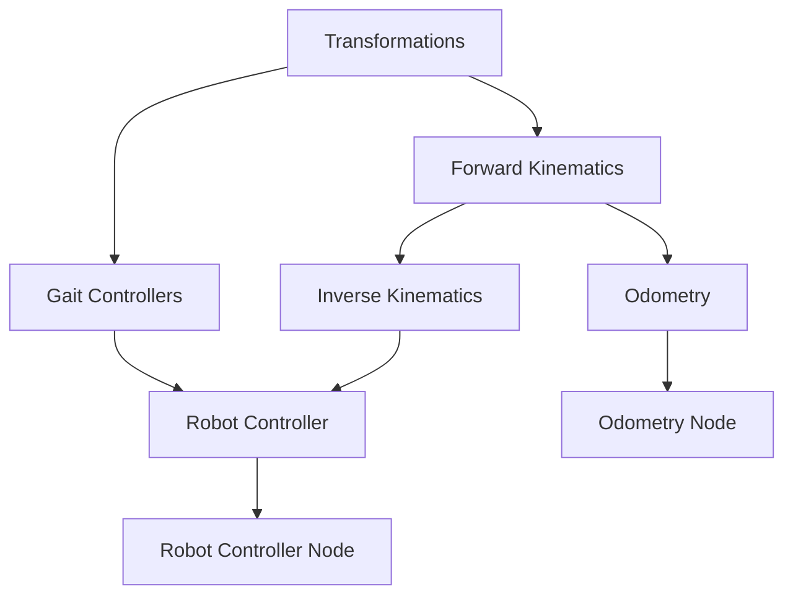

# Обзор Python архитектуры

## Описание

Пакет `quadropted_controller` -- это реализация контроллера четырёхногого робота (Unitree Go1/Go2) на **Python 3** с использованием **ROS 2 Jazzy** и **NumPy/SciPy** для вычислений. Является оригинальной реализацией, с которой была сделана C++ версия.

## Ключевые особенности

| Характеристика | Значение |
|----------------|----------|
| **Язык** | Python 3 |
| **Линейная алгебра** | NumPy, SciPy |
| **Тестирование** | pytest (13 файлов) |
| **Частота контроллера** | 60 Hz |
| **Частота одометрии** | 50 Hz |
| **Зависимости** | numpy, scipy, PyYAML |

## Структура пакета

```
quadropted_controller/
├── scripts/
│   ├── robot_controller_gazebo.py         # Главный узел (точка входа)
│   ├── QuadrupedOdometryNode.py           # Узел одометрии
│   ├── cmd_vel_pub.py                     # Twist → RobotVelocity адаптер
│   │
│   ├── RobotController/
│   │   ├── RobotController.py             # Главный контроллер (state machine)
│   │   ├── GaitController.py              # Базовый класс походки
│   │   ├── TrotGaitController.py          # Рысь (диагональные пары)
│   │   ├── CrawlGaitController.py         # Ползание (последовательные ноги)
│   │   ├── RestController.py              # Покой (неподвижность)
│   │   ├── StandController.py             # Стойка (вращение на месте)
│   │   ├── PIDController.py               # IMU roll/pitch компенсация
│   │   └── StateCommand.py                # Data classes State/Command
│   │
│   ├── ForwardKinematics/
│   │   └── robot_FK.py                    # Прямая кинематика
│   │
│   ├── InverseKinematics/
│   │   └── robot_IK.py                    # Обратная кинематика
│   │
│   └── RoboticsUtilities/
│       └── Transformations.py             # Матрицы поворота/трансформации
│
├── launch/
│   ├── launch_python.launch.py            # Launch файл для Python контроллера
│   └── ...
│
└── test/                                  # pytest тесты (13 файлов)
```

## Исполняемые узлы

### 1. robot_controller_gazebo.py

Главный узел управления роботом (60 Hz).

**Запуск:**
```python
def main():
    rclpy.init()
    node = rclpy.create_node('robot_controller')
    # Инициализация робота и контроллеров
    # Создание подписок и сервисов
    rclpy.spin(node)
```

**Подписки:**
- `robot_velocity` (`RobotVelocity`) -- команды скорости
- `imu` (`Imu`) -- данные IMU для компенсации крена
- `robot_mode` (`RobotModeCommand`) -- переключение режимов

**Публикации:**
- `joint_group_controller/commands` (`Float64MultiArray`) -- 12 углов суставов
- `foot_contact` (`RobotFootContact`) -- контакты 4 ног

**Сервисы:**
- `robot_behavior_command` (`RobotBehaviorCommand`) -- команды sit/up/walk

**Режимы работы:**
- **REST** -- покой, PID компенция крена/тангажа
- **STAND** -- стойка, вращение на месте
- **TROT** -- походка рысью (диагональные пары ног)
- **CRAWL** -- ползущая походка (последовательные ноги)

### 2. QuadrupedOdometryNode.py

Узел одометрии на основе кинематики (50 Hz).

**Подписки:**
- `imu_plugin/out` (`Imu`) -- yaw из кватерниона
- `joint_group_controller/commands` -- 12 углов суставов
- `foot_contact` (`RobotFootContact`) -- контакты стоп
- `robot_velocity` (`RobotVelocity`) -- линейная скорость

**Публикации:**
- `odom` (`Odometry`) -- позиция (x, y, theta), ориентация, скорости
- `foot_markers` (`MarkerArray`) -- визуализация позиций стоп
- **TF:** `odom` → `base`

### 3. cmd_vel_pub.py

Промежуточный узел конвертации команд скорости.

**Назначение:** Конвертирует `geometry_msgs/Twist` (cmd_vel) в `RobotVelocity` с нелинейным сглаживанием:
- X: `0.035 * (1 - exp(-100 * |value|))`
- Y: `0.012 * (1 - exp(-100 * |value|))`

## Архитектурные компоненты

### RoboticsUtilities

Базовый слой, не зависящий от других компонентов:
- **Transformations.py** -- матрицы поворота (Rx, Ry, Rz, Rxyz) и однородные преобразования

### Кинематика

Зависит от RoboticsUtilities:
- **ForwardKinematics/robot_FK.py** -- вычисление позиций стоп из 12 углов суставов
- **InverseKinematics/robot_IK.py** -- вычисление 12 углов из позиций стоп

### Однометрия

Использует Forward Kinematics для определения позиций стоп:
- **QuadrupedOdometryNode.py** -- состояние с скользящим окном, обновление одометрии

### Контроллеры

Иерархия контроллеров походки:
- **GaitController.py** -- базовый класс, общая логика фаз и контактов
- **TrotGaitController.py** -- рысь (диагональные пары)
- **CrawlGaitController.py** -- ползание (последовательные ноги)
- **RestController.py** -- покой с PID компенсацией
- **StandController.py** -- стойка с вращением

### Robot Controller (State Machine)

Главный конечный автомат:
- **RobotController.py** -- класс `Robot`, переключение между контроллерами
- **StateCommand.py** -- data classes `State` и `Command`

## Параметры робота

### Геометрические параметры (Go1/Go2)

| Параметр | Значение | Описание |
|----------|----------|----------|
| `body_length` | 0.3762 м | Длина корпуса |
| `body_width` | 0.0935 м | Ширина корпуса |
| `l1` | 0.0 м | Бедро (hip) |
| `l2` | 0.0955 м | Бедро (thigh) |
| `l3` | 0.213 м | Голень (calf) |
| `l4` | 0.213 м | Голень (calf) |

### Параметры контроллеров

| Контроллер | Параметр | Значение |
|------------|----------|----------|
| **Trot** | stance_time | 0.04 с |
| | swing_time | 0.18 с |
| | time_step | 0.02 с |
| | z_leg_lift | 0.14 м |
| | PID (kp, ki, kd) | 0.15, 0.02, 0.002 |
| **Crawl** | stance_time | 0.55 с |
| | swing_time | 0.45 с |
| | time_step | 0.02 с |
| | body_shift_y | 0.06 м |
| **Rest** | PID (kp, ki, kd) | 0.75, 2.29, 0.0 |
| **Stand** | max_linear_velocity | 0.035 м/с |
| | max_angular_velocity | 0.1 рад/с |

## Зависимости между компонентами



## Запуск

### Через Makefile

```bash
# Запуск с Python контроллером
make gazebo-py

# Запуск телеоперации
make teleop

# Переключение режимов
make trot
make crawl
make rest
make stand
```

### Через ROS 2

```bash
# Запуск launch файла
ros2 launch quadropted_controller launch_python.launch.py

# Запуск отдельного узла
ros2 run quadropted_controller robot_controller_gazebo.py
ros2 run quadropted_controller QuadrupedOdometryNode.py
```

## Тестирование

### pytest тесты

13 файлов тестов в `test/`:

| Файл | Что проверяет |
|------|---------------|
| `test_rotations.py` | Матрицы вращения |
| `test_fk.py` | Прямая кинематика |
| `test_ik.py` | Обратная кинематика |
| `test_odometry.py` | Однометрия |
| `test_pid.py` | PID-регулятор |
| `test_gait.py` | Базовый класс походки |
| `test_trot.py` | Походка рысью |
| `test_crawl.py` | Ползущая походка |
| `test_rest.py` | Режим покоя |
| `test_stand.py` | Режим стойки |
| `test_robot_controller.py` | Главный контроллер |
| `test_state_command.py` | State/Command классы |
| `test_cross_validation.py` | Кросс-валидация с C++ |

## Связанные документы

- [[Gait Controller]]
- [[Trot Gait Controller]]
- [[Crawl Gait Controller]]
- [[Stand Controller]]
- [[Rest Controller]]
- [[PID Controller]]
- [[Robot Controller]]
- [[Прямая кинематика]]
- [[Обратная кинематика]]
- [[Трансформации]]
- [[Одометрия по контакту стоп]]
- [[Сравнение Python vs C++]]
