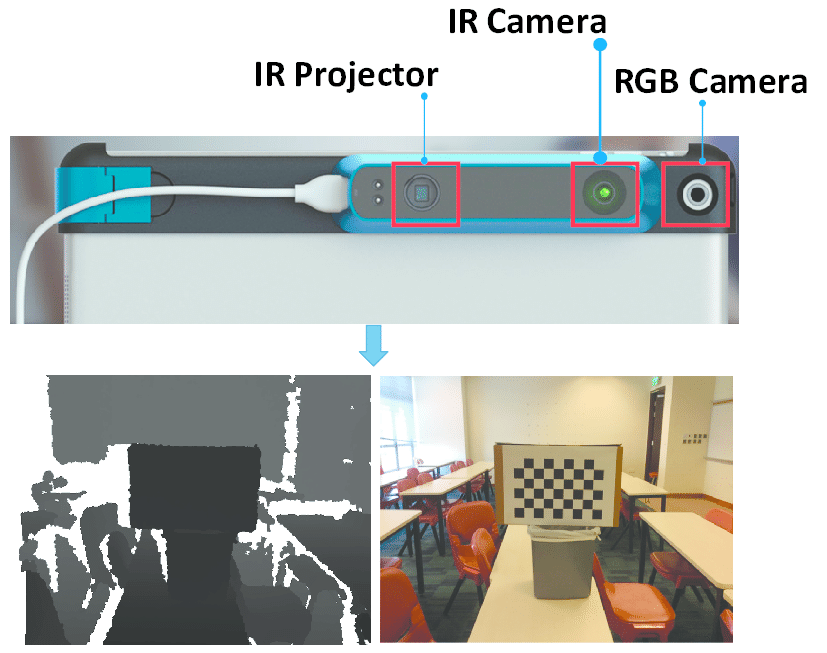
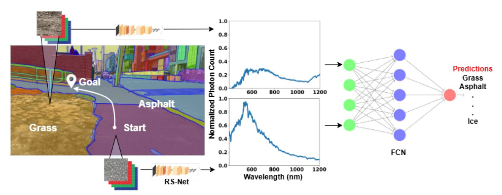
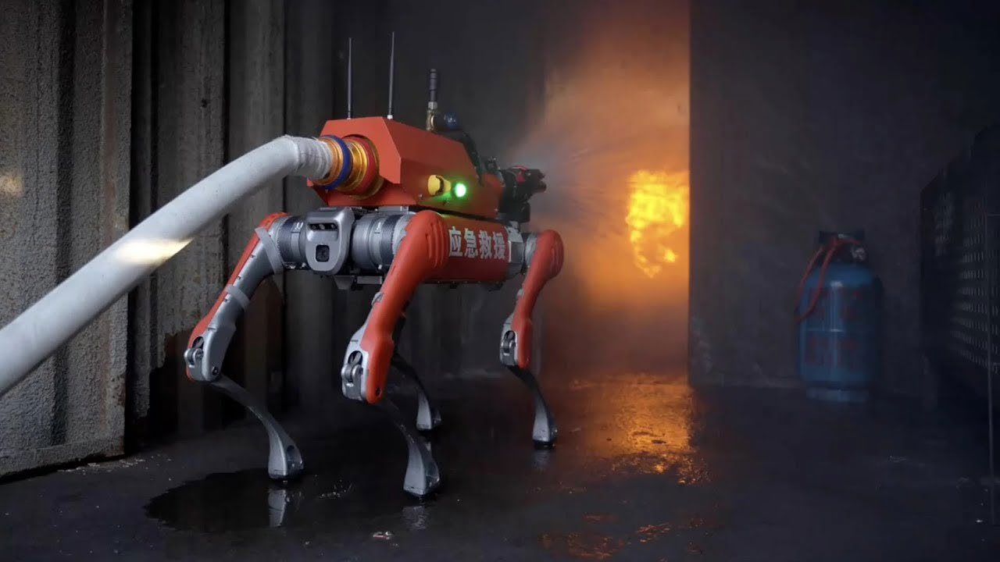
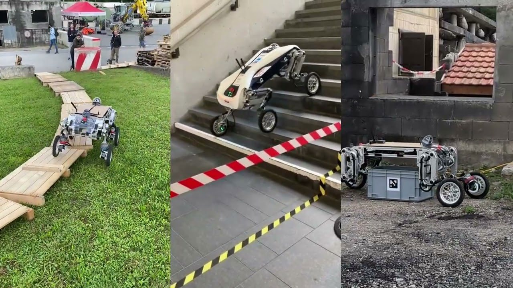
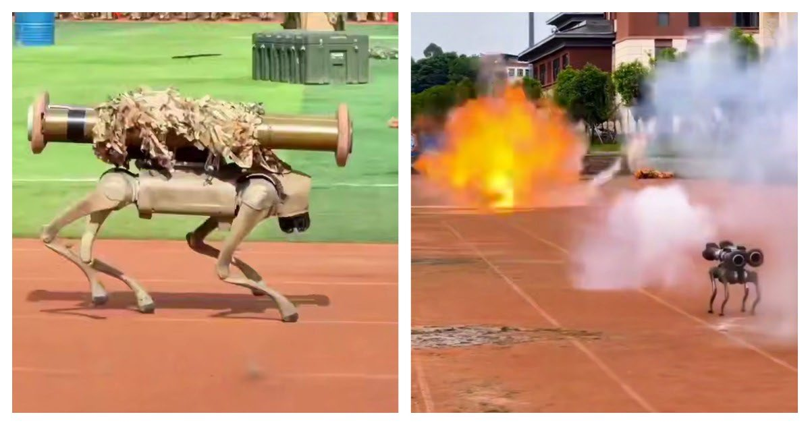
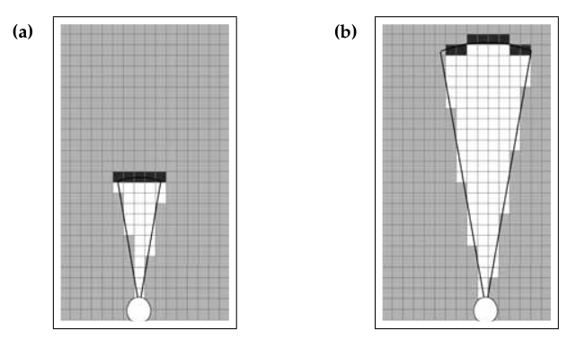
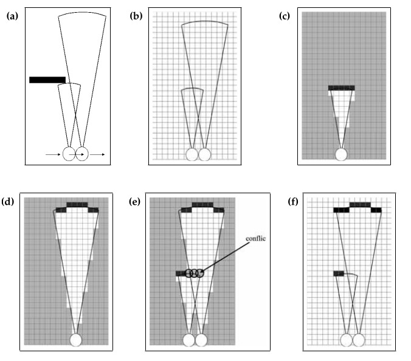

# Иллюстрации к НИРС1 (Глава 1)

## Рисунок 1 — Шагающий робот Unitree Go2

## Рисунок 2 — Принцип работы LiDAR

## Рисунок 3 — Принцип работы RGB-D камеры

## Рисунок 4 — Концепция terrain-aware navigation

## Рисунок 5 — TOP-Nav: интеграция terrain, obstacle и proprioception

## Рисунок 6 — Общая схема системы навигации шагающего робота

## Рисунок 7 — Unitree B2 Робопес-пожарник

## Рисунок 8 — LEVA: высокомобильное транспортное средство

## Рисунок 9 — Unitree Go2 с вооружением

## Рисунок 10 — Архитектура Visual SLAM

## Рисунок 11 — Основные этапы Visual SLAM (2007-2020)

## Рисунок 12 — Обзор конвейера LOVON

## Рисунок 13 — Выполнение задачи по инструкции (NaVILA)

## Рисунок 14 — Обратная измерительная модель

## Рисунок 15 — Факторный подход в SLAM

## Рисунок 16 — Демонстрация Gazebo + SLAM + Nav2

