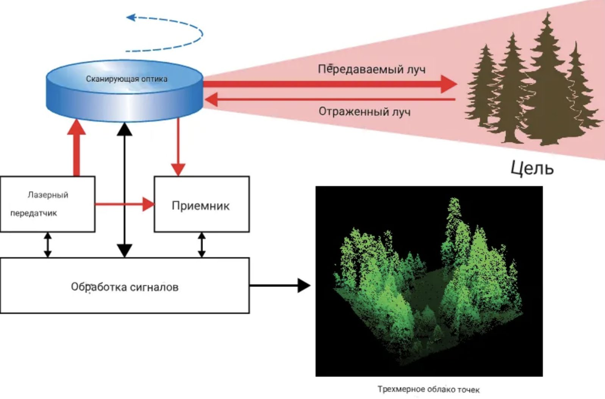
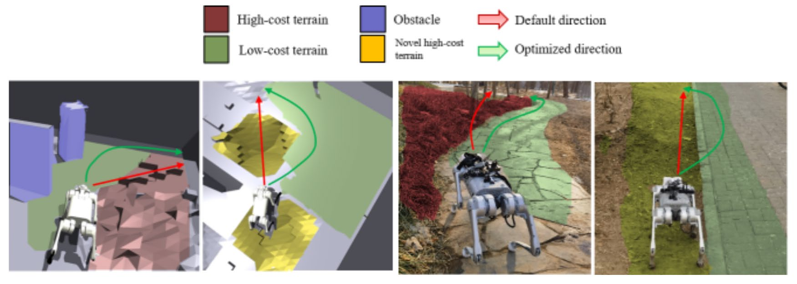
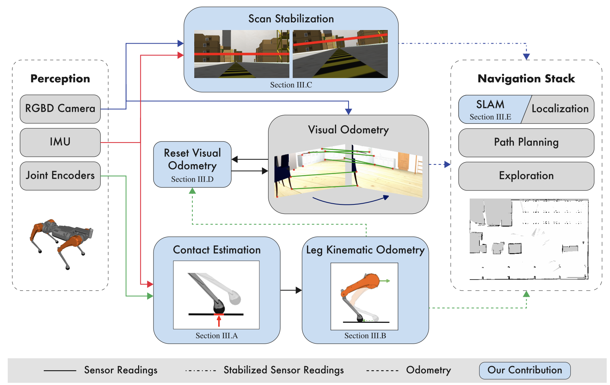

# Описание предметной области

Автономная навигация шагающих роботов — область на стыке теории управления, компьютерного зрения, ИИ и механики. Четвероногие и двуногие роботы способны преодолевать препятствия, недоступные колёсным аналогам.

## Определение и область применения

Способность роботов самостоятельно перемещаться в неструктурированных средах, достигая заданной позиции с минимизацией риска столкновений.

### Применения

- **Поиск и спасание (SAR):** преодоление руин, обнаружение жертв (робопес-пожарник Unitree B2)
- **Промышленная инспекция:** АЭС, химзаводы, нефтяные платформы (AutoInspect на Boston Dynamics Spot)
- **Логистика и доставка:** LEVA — транспортировка грузов до 85 кг по пересечённой местности
- **Сельское хозяйство:** мониторинг посевов, анализ почвы
- **Безопасность и охрана:** патрулирование периметров
- **Строительство и съёмка:** 3D-карты строительных площадок

- **Правоохранительная деятельность:** разведка опасных мест

## Terrain-aware навигация

Планировщик маршрута учитывает не только препятствия, но и характеристики поверхности: уклон, жёсткость, гранулярность, трение.

**TOP-Nav** (Terrain, Obstacle, Proprioception Navigation) — интеграция terrain, obstacle и proprioception для выбора путевых точек на более проходимых участках.

### SLAM-free навигация

Отказ от метрических карт в пользу семантического понимания среды и топологических представлений. Интеграция Vision-Language Models (LLM) для высокоуровневого рассуждения о целях.

### Технологический стек

- **ROS 2 Jazzy** — распределённая архитектура, publish-subscribe, tf2
- **Nav2** — планирование и локализация
- **Gazebo Harmonic** — физически точная симуляция
- **LiDAR + RGB-D + IMU** — мультимодальное восприятие
- **C++/Rust** — высокопроизводительные компоненты real-time
- **Python** — прототипирование и ML
