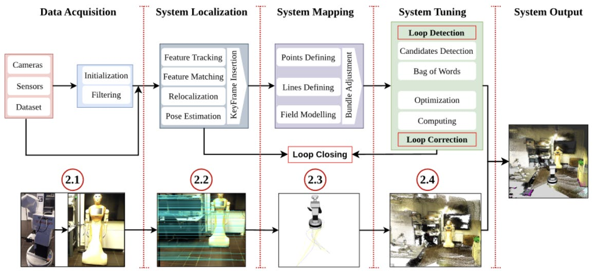
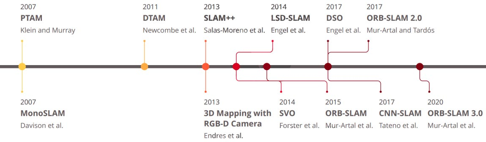
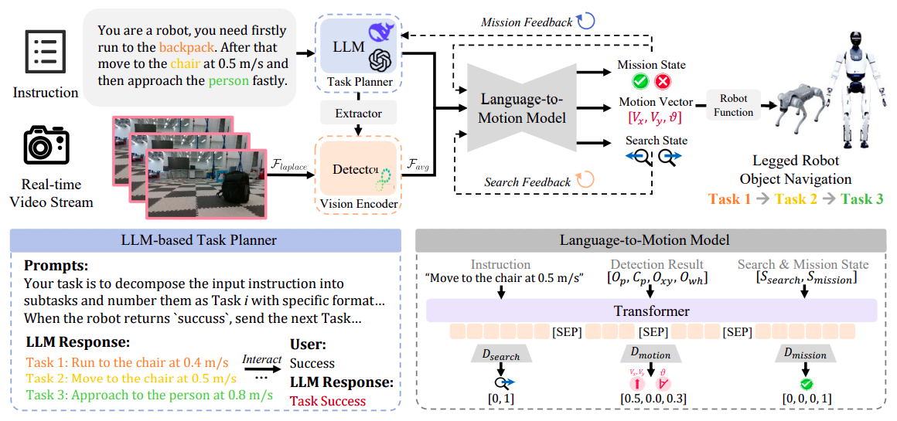
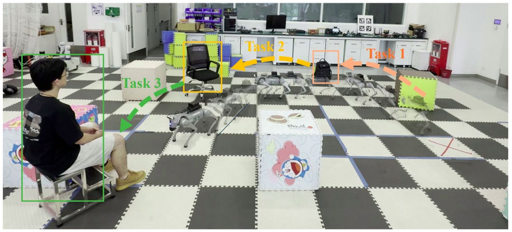

# Хронология развития

## Ранний период (1960-е – 1980-е годы)

Первые шагающие роботы с гидравлическими приводами, требовавшие прямого управления человеком. Прорыв — работы Marc Raibert в MIT Leg Lab: принципы динамической локомоции, первые четвероногие с силовыми сенсорами.

## Период развития SLAM (1990-е годы)

Истоки SLAM — 1986 год, IEEE Robotics and Automation Conference. Термин "SLAM" введён в 1995 году на International Symposium on Robotics Research.

## Прорыв в Visual SLAM (2007-2015 годы)

- **2007:** Mono-SLAM (Davison) — первая real-time система монокулярного Visual SLAM на EKF
- **2007:** PTAM (Klein) — многопоточность + Bundle Adjustment
- **2015:** ORB-SLAM — объединение лучших практик, наиболее влиятельный Visual SLAM

## Период распространения шагающих платформ (2010-2020 годы)

- Boston Dynamics: BigDog → Spot (2018-2020) — надёжная локомоция по сложному рельефу
- ORB-SLAM2 (2016) — RGB-D SLAM
- ORB-SLAM3 (2020) — visual-inertial SLAM
- Deep RL для управления локомоцией

## Vision-Language Models в робототехнике (2023-2025 годы)

Интеграция LLM и vision-language моделей в навигацию:

- **LOVON** (Legged Open-Vocabulary Object Navigator) — естественноязычные инструкции для роботов
- **NaVILA** (Vision-Language-Action Model)
- **AdVENTR**
