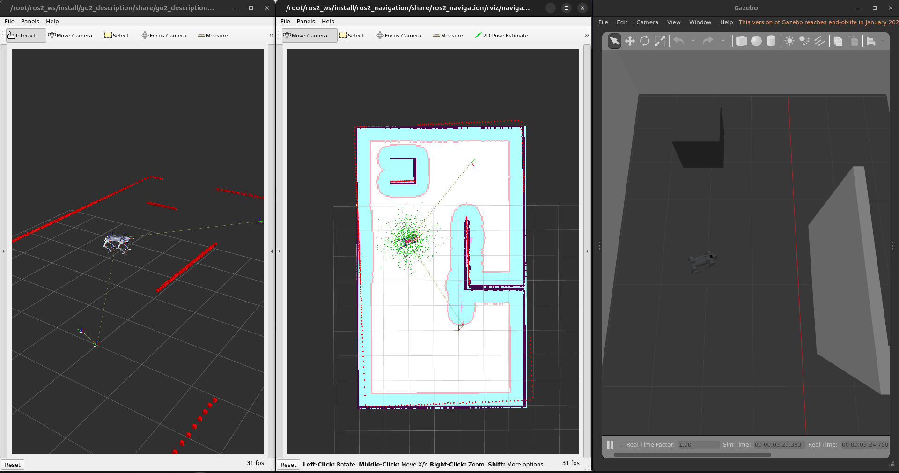

# Современное состояние и перспективы

Semantic SLAM находится на трансформационном этапе: инновации в восприятии и ИИ позволяют извлекать высокоуровневые семантические признаки. Роботы распознают объекты, выводят взаимосвязи и интеллектуально взаимодействуют с окружением.

**Вызовы:** поддержание точности в динамических условиях, real-time обработка, надёжные алгоритмы слияния данных.

**Перспективный подход — гибридный:**
- Multi-sensor fusion (LiDAR + RGB-D + IMU)
- Semantic SLAM для интеллектуального понимания среды
- Topometric представление для эффективного планирования
- Deep Learning для адаптивного управления
- C++/Rust для real-time
