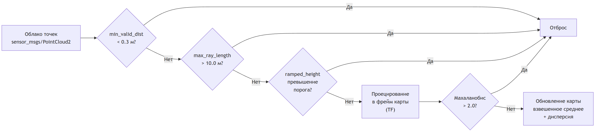
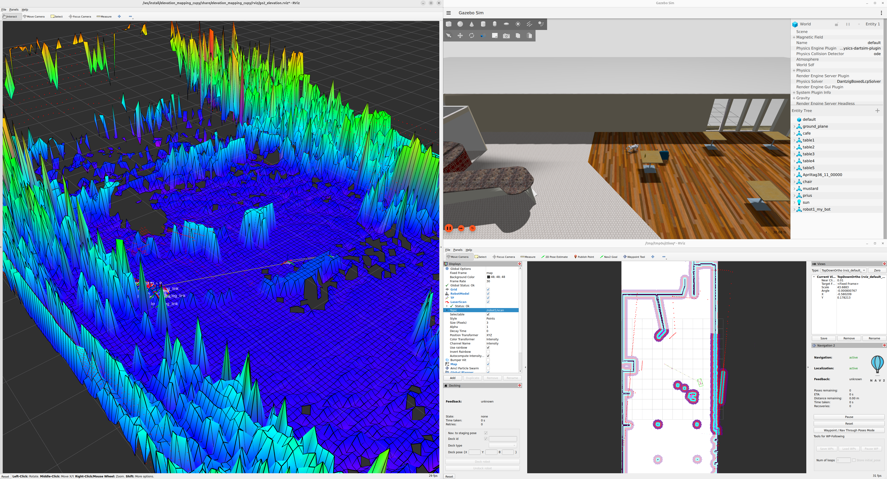

# Иллюстрации к НИРС2 (Глава 3)

## Рисунок 1 — Схема взаимодействия компонентов системы

## Рисунок 2 — Развёртывание контейнеров на хосте

## Рисунок 3 — Поток данных от сенсора до исполнительных механизмов

## Рисунок 4 — Схема межконтейнерной связи через Cyclone DDS

## Рисунок 5 — Этапы фильтрации облака точек

## Рисунок 6 — Испытание робота в закрытом помещении

