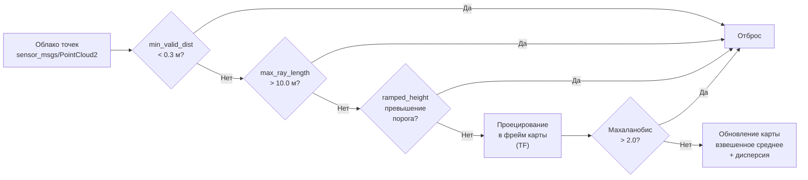

# Глава 3. Разработка модуля Elevation Mapping и terrain-aware планирования

## 3.6 Фильтрация облака точек и параметры сенсора

Данные LiDAR содержат значительное количество шумов и некорректных измерений, которые необходимо отфильтровать перед построением карты высот. Лидар LiDAR LIVOX Mid-360 генерирует облако точек, содержащее как точки на поверхности земли, так и точки на корпусе робота, в воздухе и на нависающих объектах. Модуль elevation_mapping_cupy предоставляет набор встроенных фильтров для обработки этих данных, включая фильтрацию по высоте, расстоянию и углу обзора. Дополнительно применяется RAM-фильтр для адаптивного порога высоты и visibility cleanup для удаления артефактов на границах карты. В данном разделе описываются параметры конфигурации elevation_mapping_cupy и настройки фильтрации облака точек.

### 3.6.1 Параметры elevation_mapping_cupy

Конфигурация модуля задаётся в двух файлах: `core_param.yaml` (основные параметры, общие для всех роботов) и `go2_lidar3d.yaml` (параметры для Unitree Go2). Основные параметры карты высот: resolution = 0,1 м (разрешение ячейки карты), map_length = 20,0 м (размер карты), min_valid_distance = 0,3 м (минимальное расстояние точки), max_ray_length = 10,0 м (максимальная длина луча), max_height_range = 10,5 м (максимальный диапазон высот) [11, 14].

Параметры RAM-фильтра высоты: ramped_height_range_a = 0,3 (коэффициент наклона порога), ramped_height_range_b = 1,0 (расстояние излома), ramped_height_range_c = 0,2 (минимальный порог высоты). Параметры visibility cleanup: cleanup_step = 0,1 (шаг очистки, определяющий уверенность), cleanup_footprint = 1 (радиус очистки в ячейках). Параметры фильтрации точек: mahalanobis_thresh = 2,0 (порог фильтрации Махаланобиса), sensor_noise_stddev = 0,01 (стандартное отклонение шума сенсора).

Robot-specific конфигурация включает map_frame = "odom", base_frame = "base_link", sensor_frame = "laser_frame", топик подписки `/robot1/scan/points` с типом данных pointcloud и слои публикации elevation, variance, traversability.

### 3.6.2 Фильтрация по расстоянию и высоте

LiDAR установлен на корпусе робота в позиции (0,22; 0; 0,095) относительно base_link. Вертикальный угол обзора ±15° означает, что при расстоянии менее 30 см лучи попадают на корпус робота. Параметр min_valid_distance = 0,3 м отбрасывает все точки ближе 30 см, что исключает отображение корпуса и крышки робота на карте высот. Без данного параметра на карте появляются артефакты в виде возвышения вокруг робота [11].

LiDAR имеет физическое ограничение дальности 12 м. Для ray tracing установлен max_ray_length = 10,0 м, что обеспечивает корректную обработку видимости (точки за пределами 10 м не используются для visibility cleanup), оптимизацию производительности и фокус на рабочей зоне 20×20 м.

RAM-фильтр (Ramped Adaptive Maximum height) реализует адаптивный порог высоты, зависящий от расстояния до точки (математическая модель приведена в Главе 2, раздел 2.4.2). Для a = 0,3, b = 1,0, c = 0,2: на 0,3 м порог 0,2 м; на 2,0 м — 0,5 м; на 10,0 м — 2,9 м. Это позволяет на близких расстояниях отбрасывать потолки и нависающие объекты, а на дальних — учитывать естественный рельеф [4].

### 3.6.3 Visibility Cleanup и фильтрация Махаланобиса

Visibility cleanup — алгоритм на CUDA, корректирующий карту высот на основе анализа видимости (описание приведено в Главе 2, раздел 2.4.4). Эффект: динамические объекты автоматически удаляются через несколько кадров; шумовые измерения не создают ложных объектов [5, 14].

Для дополнительной фильтрации используется критерий Махаланобиса (Глава 2, раздел 2.4.3): если расстояние между измеренной и ожидаемой высотой превышает mahalanobis_thresh = 2,0, точка отбрасывается (отклонение более чем на 2σ).

### 3.6.4 Комплексная фильтрация

При поступлении нового облака точек каждая точка проходит последовательно этапы, описанные в Главе 2 (раздел 2.4.5). Pipeline фильтрации представлен на Рисунке 3.4.

Рисунок 3.4 — Этапы фильтрации облака точек
