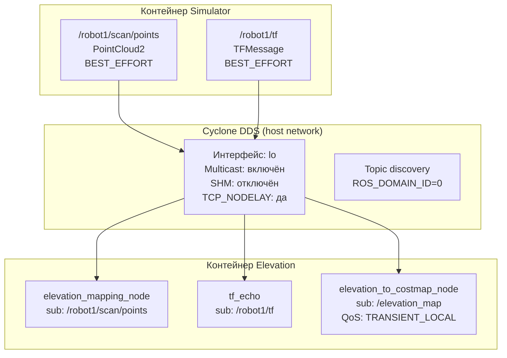

# Глава 3. Разработка модуля Elevation Mapping и terrain-aware планирования

## 3.5 Настройка TF и межконтейнерной связи (DDS)

Система трансформаций TF является фундаментальным компонентом любой робототехнической системы на ROS 2, обеспечивающим пространственную привязку всех сенсоров и исполнительных устройств. Для elevation mapping критически важно иметь точное знание о положении сенсора относительно карты в каждый момент времени. Дополнительную сложность вносит двухконтейнерная архитектура, где TF-дерево должно быть доступно в обоих контейнерах, что требует настройки межконтейнерной связи DDS. Неправильная конфигурация DDS может привести к потере TF-сообщений и некорректной работе модуля. В данном разделе описываются TF-дерево робота и конфигурация DDS для работы в двухконтейнерной архитектуре.

### 3.5.1 TF-дерево и relay

Правильная работа elevation_mapping_node критически зависит от наличия полного и актуального TF-дерева [4]. Модуль использует трансформации для проецирования точек облака из фрейма сенсора в фрейм карты, определения положения робота на карте высот и вычисления углов обзора для visibility cleanup.

TF-дерево робота Unitree Go2 [6] имеет следующий вид: map → odom → base_link, от которого отходят laser_frame, imu_frame, foot_front_left, foot_front_right, foot_hind_left и foot_hind_right. Симулятор публикует эти трансформации на namespaced топиках: `/robot1/tf` (динамические, около 100 Гц) и `/robot1/tf_static` (статические, однократно).

Модуль elevation_mapping_cupy слушает стандартные топики `/tf` и `/tf_static`. Для перенаправления трансформаций разработан TF-relay (`tf_relay.py`), который подписывается на namespaced топики с QoS BEST_EFFORT и TRANSIENT_LOCAL соответственно и републикует на стандартные топики. Relay не буферизирует трансформации — он работает как прозрачный прокси в том же контейнере, что и симулятор.

Для привязки карты высот к глобальной системе координат запускается статический publisher трансформации `map` → `odom` с нулевым смещением. **Известная проблема: сдвиг costmap из-за статического map → odom.** Поскольку static_transform_publisher публикует нулевое смещение вне зависимости от положения робота, возникает рассогласование costmap. Решение: на начальном этапе (без SLAM) удалить статический publisher и позволить Nav2 стартовать с тождественной трансформацией (map = odom в момент t=0).

### 3.5.2 Конфигурация DDS и диагностика

Оба контейнера используют единую RMW-реализацию `rmw_cyclonedds_cpp` и единый ROS_DOMAIN_ID = 0. Конфигурация Cyclone DDS включает явное указание сетевого интерфейса (lo), разрешение multicast, включение topic discovery и отключение Shared Memory транспорта (Рисунок 3.3). Отключение SHM является критическим, так как контейнеры не имеют общей разделяемой памяти [8].

Рисунок 3.3 — Схема межконтейнерной связи через Cyclone DDS

Для диагностики discovery используются инструменты `ros2 node list`, `ros2 topic list`, `ros2 topic echo /tf` и Cyclone DDS трассировка. Типичные проблемы приведены в Таблице 3.2.

Таблица 3.2 — Типичные проблемы DDS discovery и их решения

| Проблема                            | Причина                                | Решение                                           |
| ----------------------------------- | -------------------------------------- | ------------------------------------------------- |
| Ноды не видны                       | Разные ROS_DOMAIN_ID                   | Установить единый ID                              |
| TF не публикуется                   | Неправильный QoS                       | Использовать BEST_EFFORT                          |
| PointCloud не принимается           | SHM-конфликт                           | Отключить SHM в Cyclone                           |
| Discovery медленный                 | Много интерфейсов                      | Явно указать lo interface                         |
| Ground truth не приходит            | RELIABLE vs BEST_EFFORT                | Подписываться BEST_EFFORT, как публикует Gazebo   |
| Elevation map не доставляется мосту | RELIABLE + VOLATILE vs TRANSIENT_LOCAL | Использовать TRANSIENT_LOCAL для subscriber моста |

### 3.5.3 Ground truth bridge и оптимизация трафика

Для диагностики одометрии разработан `ground_truth_publisher.py`, который получает истинное положение робота от Gazebo через топик `/model/robot1_my_bot/pose` (Gazebo native) с резервным источником `/world_poses_info`. Нода публикует ROS 2 Odometry на `/robot1/ground_truth` для сравнения leg odometry с эталоном и TF-трансформацию `gt_odom` → `base_link_gt` для визуализации в RViz. Ground truth bridge использует QoS-профиль BEST_EFFORT, так как Gazebo публикует именно с этим профилем.

PointCloud2 на частоте 10 Гц генерирует трафик около 230 КБ/с. Для оптимизации применяются: отключение SHM (использование UDP стабильнее при межконтейнерной передаче), явное указание lo-интерфейса (предотвращает широковещательный discovery на внешние сети) и TCP_NODELAY в Cyclone DDS для минимизации задержки [8].
