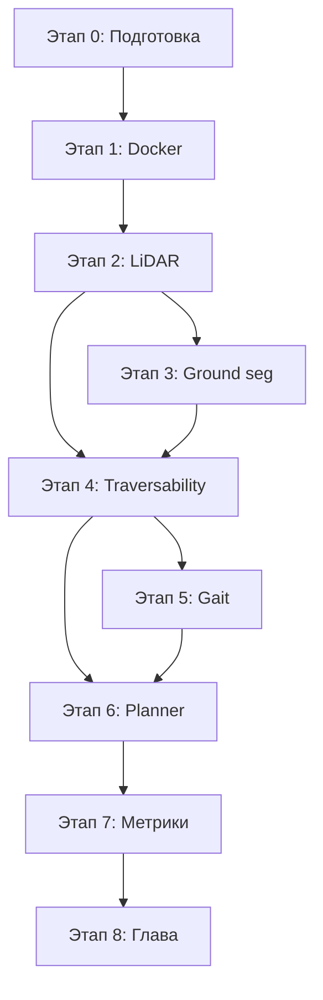

# Декомпозиция интеграции elevation_mapping_cupy в WalkingRobotSim

## Цель

Интегрировать GPU-ускоренное построение карты высот (elevation_mapping_cupy v2.1.0)
в существующую симуляцию Unitree Go2 в Gazebo Harmonic + ROS 2 Jazzy
и получить terrain-aware планирование маршрута.

---

## Этап 0. Подготовка окружения и изучение референса

### Задачи
- [ ] Изучить архитектуру elevation_mapping_cupy (документация, примеры)
- [ ] Запустить golden path тест из README (synthetic_depth_demo.launch.py)
- [ ] Проверить, что Docker-сборка работает на твоей машине
- [ ] Выяснить, есть ли NVIDIA GPU и CUDA (без CuPy не запустится)
- [ ] Прочитать paper "Elevation Mapping for Locomotion and Navigation using GPU" (Miki et al., IROS 2022)

### Артефакты
- Конспект архитектуры elevation_mapping_cupy
- Результаты тестового прогона

### Время
~1 неделя

---

## Этап 1. Интеграция в Docker-сборку проекта

### Задачи
- [ ] Добавить elevation_mapping_cupy как подмодуль / зависимость в Dockerfile
- [ ] Собрать образ с поддержкой CUDA + CuPy
- [ ] Проверить совместимость с существующим образом (ros:jazzy-desktop)
- [ ] Настроить DDS (CycloneDDS) для передачи сообщений между контейнером и Gazebo

### Артефакты
- Обновлённый Dockerfile (если необходимо)
- Рабочий контейнер с elevation_mapping_cupy

### Время
~1 неделя

---

## Этап 2. Подключение LiDAR топиков Unitree к elevation_mapping

### Задачи
- [ ] Определить, какие LiDAR топики публикует симулятор Unitree в Gazebo
- [ ] Настроить input_sources в конфиге elevation_mapping для приёма PointCloud2
- [ ] Настроить robot_pose_topic (топик с pose + covariance)
- [ ] Настроить TF дерево: map → odom → base_link → lidar_frame
- [ ] Подобрать параметры sensor_model (noise model, cutoff depths)
- [ ] Калибровать min_variance, max_variance под LiDAR Unitree

### Конфигурация
Пример конфига `config/elevation_mapping.yaml`:
```yaml
elevation_mapping:
  ros__parameters:
    input_sources:
      lidar:
        type: pointcloud
        topic: /robot1/points
        queue_size: 1
        publish_on_update: true
    robot_pose_topic: /robot1/robot_state/pose
    base_frame_id: robot1/base_link
    map_frame_id: robot1/elevation_map
    track_point_frame_id: robot1/base_link
    length_in_x: 5.0
    length_in_y: 5.0
    resolution: 0.05
    fused_map_publishing_rate: 5.0
```

### Артефакты
- Конфигурационный файл elevation_mapping для Unitree
- Запуск elevation_mapping_node как composable node в launch файле

### Время
~1.5 недели

---

## Этап 3. Сегментация ground/non-ground

### Задачи
- [ ] Написать Python-ноду для ground segmentation
- [ ] Алгоритм: Ground Plane Fitting (RANSAC на нижние точки)
- [ ] Выход: два топика PointCloud2 — ground_cloud и obstacle_cloud
- [ ] Объединить ground_cloud с elevation map
- [ ] Тестировать на синтетических данных из Gazebo

### Алгоритм (Zermas 2017)
1. Взять PointCloud2
2. Отфильтровать по высоте (ignore_points_above/below)
3. Запустить RANSAC на поиск плоскости земли
4. Точки в пределах threshold от плоскости → ground, иначе → obstacle

### Артефакты
- Пакет `walkingrobot_vision` с нодой `ground_segmenter`
- Тесты сегментации на записях из симуляции

### Время
~1 неделя

---

## Этап 4. Вычисление gradient поверхности и cost function

### Задачи
- [ ] Включить фильтр NormalVectorsFilter из grid_map_filters
- [ ] Вычислять угол наклона (slope) для каждой ячейки карты
- [ ] Вычислять roughness (отклонение высот в окне)
- [ ] Написать cost function: cost = w_slope * slope_cost + w_roughness * roughness_cost + w_elevation * elevation_diff_cost
- [ ] Интегрировать cost map как дополнительный слой в elevation map

### Формула
```
traversability = 1.0 - (w_slope * (slope / max_slope)
                + w_roughness * (roughness / max_roughness)
                + w_elevation * (elevation_diff / max_elevation_diff))
```

### Артефакты
- Пакет `walkingrobot_planning` с нодой `traversability_estimator`
- Конфиг filter chain для grid_map
- Визуализация слоёв traversability в RViz

### Время
~1.5 недели

---

## Этап 5. Адаптация походки по типу местности

### Задачи
- [ ] Определить классы terrain по traversability: дорога (high), трава (medium), камни (low), препятствие (no-go)
- [ ] Написать ноду, которая читает traversability под опорами робота
- [ ] Адаптировать параметры походки:
  - Высота шага (step_height)
  - Частота шага (step_frequency)
  - Угол наклона корпуса (body_angle)
- [ ] Связать с существующим контроллером (RobotControllerNode)

### Логика
```
if traversability < 0.3:  # опасная зона
    step_height = max, step_frequency = min, speed = min
elif traversability < 0.6:  # средняя
    step_height = medium, speed = medium
else:  # безопасная
    step_height = min, step_frequency = max
```

### Артефакты
- Пакет `walkingrobot_controller` с адаптацией gait
- Демонстрация адаптации на разных рельефах

### Время
~1.5 недели

---

## Этап 6. Terrain-aware path planning через Nav2

### Задачи
- [ ] Настроить Nav2 для использования cost map из elevation_mapping
- [ ] Либо: переписать глобальный planner с учётом traversability слоя
- [ ] Либо: подключить custom planner plugin через nav2_core
- [ ] Тестировать маршруты: A → B через сложный рельеф
- [ ] Сравнить маршруты с/без terrain-aware planning

### Артефакты
- Плагин terrain-aware planner (или адаптация Nav2)
- Сравнительная таблица маршрутов

### Время
~2 недели

---

## Этап 7. Сбор метрик и валидация

### Задачи
- [ ] Настроить запись rosbags для каждого сценария
- [ ] Собрать метрики карты высот (RMSE, MAE, max error)
- [ ] Собрать метрики производительности (FPS, latency, GPU/CPU)
- [ ] Собрать метрики пути (длина, время, энергозатраты, наклоны)
- [ ] Сделать скрипт для автоматического подсчёта метрик из rosbag
- [ ] Сравнить baseline (Nav2 без elevation map) vs terrain-aware

### Сценарии тестирования
1. Ровная дорога — baseline
2. Лёгкие неровности (трава, гравий)
3. Холмы, подъёмы/спуски
4. Смешанный рельеф
5. Лестницы (если доступны)

### Артефакты
- Скрипт `scripts/compute_metrics.py`
- CSV с результатами по каждому сценарию
- Графики сравнения

### Время
~1 неделя

---

## Этап 8. Оформление Главы 3

### Задачи
- [ ] Описать постановку задачи
- [ ] Архитектура модуля (диаграмма)
- [ ] Описание алгоритмов (elevation mapping, ground seg, cost function)
- [ ] Параметры и конфигурация
- [ ] Результаты тестирования (таблицы метрик)
- [ ] Анализ и выводы

### Структура главы
```
3.1. Постановка задачи
3.2. Архитектура модуля построения карты высот
3.3. Сегментация ground/non-ground
3.4. Функция стоимости и traversability
3.5. Адаптация походки по рельефу
3.6. Экспериментальная валидация
3.7. Выводы по главе
```

### Время
~1 неделя

---

## Итого по времени

| Этап | Недель |
|---|---|
| 0. Подготовка | 1 |
| 1. Docker-интеграция | 1 |
| 2. Подключение LiDAR | 1.5 |
| 3. Ground segmentation | 1 |
| 4. Gradient + cost function | 1.5 |
| 5. Адаптация походки | 1.5 |
| 6. Terrain-aware planning | 2 |
| 7. Сбор метрик | 1 |
| 8. Оформление главы | 1 |
| **Итого** | **~11.5 недель** |

---

## Зависимости



---

## Стек технологий

- ROS 2 Jazzy (Ubuntu 24.04)
- Gazebo Harmonic
- elevation_mapping_cupy v2.1.0 (Python + CuPy)
- grid_map (C++ библиотека)
- Nav2 (планирование)
- Unitree Go2 (робот)
- NVIDIA GPU + CUDA 12.x
- Docker + docker-compose
