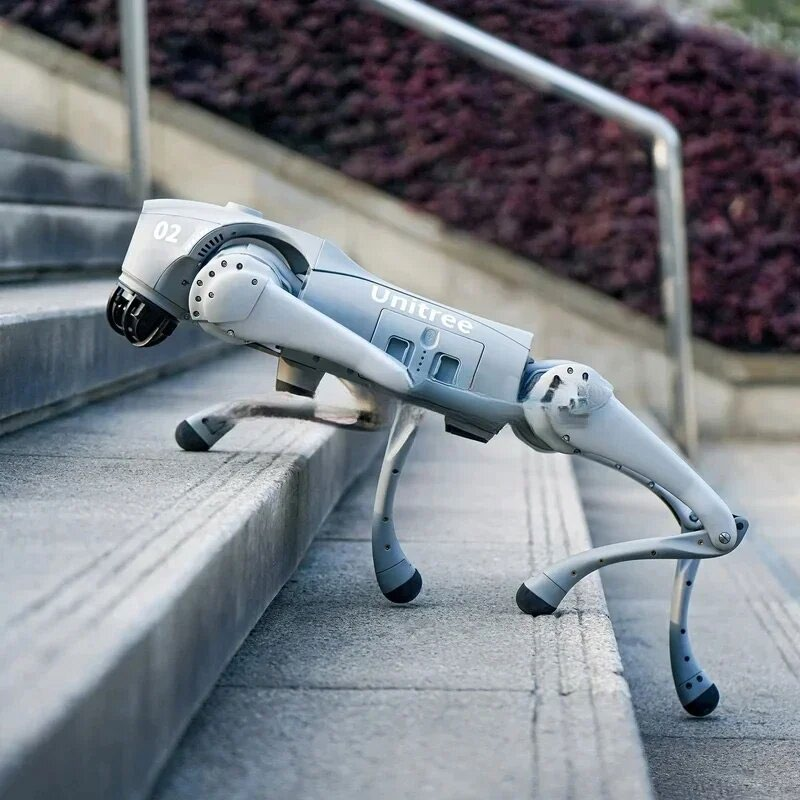

## 1.1 Четырёхногие роботы и автономная навигация

Автономная навигация шагающих роботов является активно развивающейся областью робототехники. Четырёхногие платформы, такие как Boston Dynamics Spot, ANYmal от ANYbotics и Unitree Go2, демонстрируют способность передвигаться по сложному рельефу, недоступному для колёсных и гусеничных платформ [1, 2]. Развитие этой области стало возможным благодаря снижению стоимости вычислительных компонентов, прогрессу в методах глубокого обучения и появлению открытых программных платформ — ROS 2, Gazebo, Nav2 [3].

Исследования Aditya et al. [4] показали, что традиционные алгоритмы SLAM, разработанные для колёсных платформ, часто показывают неудовлетворительную производительность на четвероногих роботах из-за резких колебаний восприятия (jitter), генерируемых современными контроллерами локомоции на основе обучения с подкреплением. Это приводит к потере локализации и разрушению карт, что обосновывает необходимость специализированных решений для шагающих роботов.

## 1.2 Elevation Mapping и цифровые модели рельефа

Ключевым элементом terrain-aware навигации является построение цифровой модели рельефа (Digital Elevation Model, DEM). Fankhauser et al. [5] заложили основу вероятностного elevation mapping с использованием фильтра Калмана для оценки высоты каждой ячейки карты. Данный подход получил развитие в библиотеке grid_map [6], обеспечивающей многослойное представление картографических данных в ROS.

Miki et al. [7] представили GPU-ускоренную реализацию elevation mapping для задач локомоции и навигации, продемонстрировав обработку 5760 точек за 0,2 мс на GPU — ускорение примерно в 10× относительно CPU. Erni et al. [8] расширили данный подход до multi-modal elevation mapping (MEM), интегрируя данные с нескольких сенсоров (LiDAR, depth-камера, стереопара) в единую карту высот с автоматическим взвешиванием измерений по достоверности.

## 1.3 Ground segmentation и фильтрация облаков точек

Для корректного построения DEM необходимо разделение облака точек на классы ground и non-ground. Zermas et al. [9] предложили алгоритм Ground Plane Fitting (GPF) на основе RANSAC с адаптивным порогом, обеспечивающий высокую производительность на встраиваемых системах. Belter et al. [10] исследовали построение плотной карты рельефа на основе RGB-D данных, показав, что на дистанциях до 3-5 м depth-камера обеспечивает плотность облака точек в 10-50 раз выше, чем 16-лучевой LiDAR.

## 1.4 Traversability analysis и terrain-aware планирование

Wermelinger et al. [11] предложили метод навигационного планирования для шагающих роботов в сложном рельефе, использующий взвешенную сумму уклона, шероховатости и перепада высот. Dong et al. [12] представили метод MARG (MAstering Risky Gap Terrains), обеспечивающий адаптацию высоты шага, частоты и скорости движения на основе непрерывной оценки traversability под опорами робота.

Pan et al. [13] разработали GPU-ускоренную систему оценки traversability в реальном времени, выполняющую вычисление gradient поверхности методом PCA, оценку roughness и финальной traversability непосредственно на GPU. Это позволило достичь частоты обновления costmap свыше 20 Гц для карты 50×50 м.

## 1.5 Программные платформы и инструменты

Технологический стек для реализации проекта включает ROS 2 Jazzy [14] как распределённую middleware-систему, Nav2 [15] для планирования и локализации, Gazebo Harmonic [16] для физической симуляции, а также библиотеки NumPy, CuPy [17] для GPU-ускоренных вычислений. Контейнеризация Docker [18] с Cyclone DDS [19] обеспечивает модульность и воспроизводимость окружения.

## 1.6 Анализ существующих решений

Сравнительный анализ существующих подходов (Таблица 1) показывает, что большинство работ выполнены для роботов средней размерной категории (Spot, ANYmal) с бортовыми GPU высокой производительности, в то время как лёгкие четырёхногие роботы с GPU начального уровня (GTX 1650 Ti, 4 ГБ) остаются малоизученными. Кроме того, существующие решения реализованы в виде изолированных модулей, не образующих целостного конвейера от сенсора до исполнительных механизмов.

**Таблица 1 — Сравнение существующих подходов к elevation mapping**

| Работа | Платформа | GPU | Частота | Разрешение | Интеграция |
|---|---|---|---|---|---|
| Fankhauser [5] | ANYmal | CPU | 5 Гц | 0,05 м | Grid map |
| Miki [7] | ANYmal | RTX 3000 | 20 Гц | 0,05 м | Nav2 |
| Erni [8] | Spot | Jetson Orin | 15 Гц | 0,1 м | MEM |
| **Данная работа** | **Unitree Go2** | **GTX 1650 Ti** | **10 Гц** | **0,1 м** | **Nav2 + походка** |

