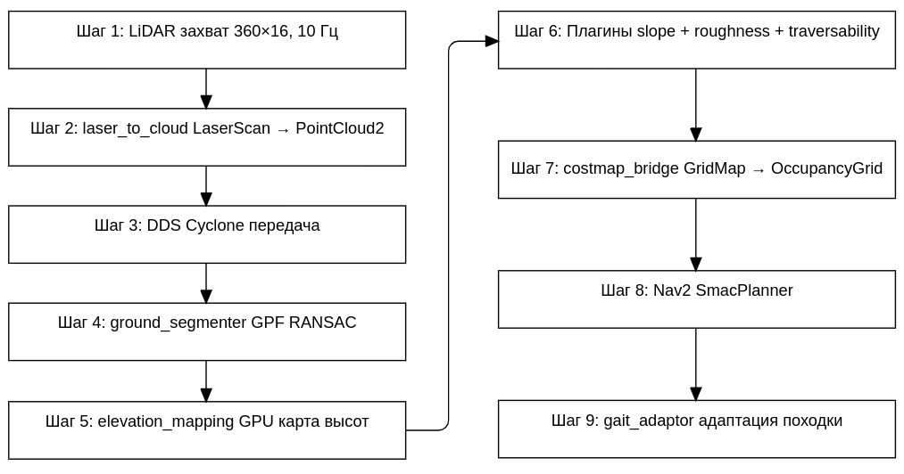

## 2.1 Архитектура системы

На основе проведённого анализа предлагается двухконтейнерная архитектура, разделяющая среду симуляции и среду обработки данных:

1. **Контейнер Simulator** — включает Gazebo Harmonic с GPU LiDAR (16×360 лучей), C++ конвертер LaserScan в PointCloud2, robot_state_publisher, TF-relay и ROS 2 Gazebo Bridge.
2. **Контейнер Elevation** — включает Python 3.12 с CuPy (CUDA 12.x), библиотеку elevation_mapping_cupy с GPU-ядрами, плагины для вычисления gradient и roughness, модуль traversability cost и мост GridMap → OccupancyGrid для интеграции с Nav2.

Взаимодействие между контейнерами осуществляется через Cyclone DDS с отключением Shared Memory транспорта, так как контейнеры не имеют общей разделяемой памяти.

## 2.2 Конвейер обработки данных

Предлагаемый конвейер обработки данных включает следующие этапы:

1. **Захват данных LiDAR** — GPU LiDAR в Gazebo генерирует измерения 360×16 точек с частотой 10 Гц
2. **Конвертация LaserScan → PointCloud2** — C++ конвертер проецирует точки в трёхмерное пространство
3. **Транспортировка через DDS** — PointCloud2 передаётся между контейнерами
4. **Ground segmentation** — алгоритм GPF (RANSAC, 3 итерации) разделяет облако на ground и obstacle
5. **Обновление DEM на GPU** — elevation_mapping_node обновляет карту высот (разрешение 0,1 м, размер 20×20 м)
6. **Вычисление gradient и roughness** — плагины surface_gradient (PCA, окно 3×3) и roughness (RMSE, окно 5×5)
7. **Расчёт traversability cost** — взвешенная сумма slope (0,5) + roughness (0,3) + elevation (0,2)
8. **Конвертация в costmap** — GridMap → OccupancyGrid для Nav2
9. **Адаптация походки** — изменение параметров походки на основе traversability под опорами робота

## 2.3 Классификация типов местности

Предлагается классификация местности на три класса на основе traversability:

**Таблица 2 — Классификация типов местности**

| Класс | Traversability | Тип местности | Параметры походки |
|---|---|---|---|
| Safe | > 0,7 | Дорога, бетон | Высота шага 0,04 м, частота 2,0 Гц, скорость 0,5 м/с |
| Medium | 0,3–0,7 | Трава, гравий | Высота шага 0,08 м, частота 1,5 Гц, скорость 0,3 м/с |
| Unsafe | < 0,3 | Камни, склоны | Высота шага 0,15 м, частота 1,0 Гц, скорость 0,15 м/с |

## 2.4 Плагины анализа поверхности

Для анализа поверхности предлагаются три плагина, загружаемые через механизм postprocessor_plugins:

1. **surface_gradient.py** — вычисление gradient (уклона) поверхности методом PCA в окне 3×3. Значение gradient нормализовано: 0,0 — горизонтальная поверхность, 1,0 — вертикальная стена.

2. **roughness.py** — вычисление шероховатости как RMSE отклонения высот в окне 5×5. Интерпретация roughness: < 0,01 м — ровная дорога; 0,01–0,03 м — гладкий асфальт; 0,03–0,06 м — трава, гравий; 0,06–0,10 м — мелкие камни; > 0,10 м — крупные камни.

3. **cost_function.py** — вычисление traversability cost как взвешенной суммы трёх компонентов:
   $$c = w_{\text{slope}} \cdot c_{\text{slope}} + w_{\text{roughness}} \cdot c_{\text{roughness}} + w_{\text{elevation}} \cdot c_{\text{elevation}}$$
   где веса $w$ являются настраиваемыми параметрами.

## 2.5 Плавность адаптации походки

Для обеспечения плавного изменения походки предлагается экспоненциальное сглаживание с коэффициентом α = 0,3. Типичное время перехода между режимами: Safe → Medium — 3-4 шага (1,5-2 с), Medium → Unsafe — 1-2 шага (быстрая реакция на опасность). Для упреждающей адаптации используется карта traversability в направлении движения — ячейки на пути на расстоянии до 2 м вперёд. Если впереди traversability < 0,5, параметры начинают меняться за 1-2 шага до входа на участок.

## 2.6 Тестовые сценарии

Для валидации модуля предлагается пять тестовых сценариев в симуляции Gazebo:
- **Сценарий 1** — ровная дорога (baseline, RMSE < 0,02 м)
- **Сценарий 2** — лёгкие неровности (трава, гравий)
- **Сценарий 3** — холмы и подъёмы (синусоидальный рельеф)
- **Сценарий 4** — смешанный рельеф (ровные участки + трава + камни)
- **Сценарий 5** — препятствия (ящики, бордюры, ступени 0,1–0,3 м)

