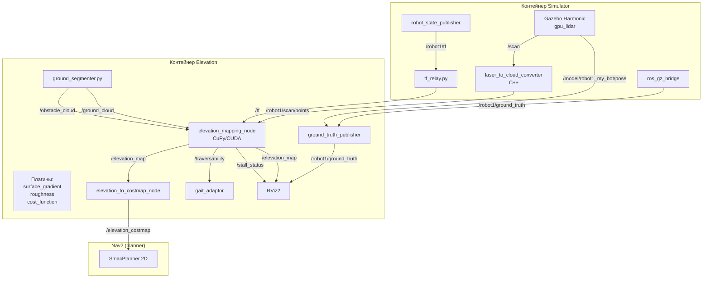

# Глава 3. Разработка модуля Elevation Mapping и terrain-aware планирования

## 3.2 Архитектура модуля

### 3.2.1 Общая архитектура системы

Разработанный модуль состоит из нескольких компонентов, взаимодействующих через ROS 2-топики и сервисы. Схема взаимодействия представлена на Рисунке 3.1.

Рисунок 3.1 — Схема взаимодействия компонентов системы

На верхнем уровне выделяются два Docker-контейнера:

1) контейнер Simulator — запускает симуляцию Gazebo Harmonic, сенсоры (трёхмерный LiDAR, IMU), robot_state_publisher, C++ конвертер LaserScan — PointCloud и TF-relay;

2) контейнер Elevation — запускает elevation_mapping_node (CuPy/CUDA), ground segmenter, traversability estimator, gait adaptor и RViz.

Компоненты внутри elevation-контейнера образуют конвейер обработки: LiDAR PointCloud  —  ground_seg  —  ground_cloud  —  elevation_mapping, ground_seg  —  obstacle_cloud  —  traversability, traversability  —  gait_adaptor  —  robot_controller, elevation_map  —  costmap_bridge  —  Nav2 (planner + controller).

Дополнительно разработаны вспомогательные мосты: ground_truth_publisher (Gazebo  —  ROS 2 odometry для диагностики) и elevation_to_costmap_node (конвертация GridMap  —  OccupancyGrid для Nav2).

### 3.2.2 Двухконтейнерная архитектура

Ключевым архитектурным решением стало разделение на два Docker-контейнера. Данный подход применяется в современных робототехнических системах для разделения вычислительных нагрузок различного типа [1, 9].

Контейнер Simulator использует образ `osrf/ros:jazzy-desktop` и включает: Gazebo Harmonic с gpu_lidar (16×360 лучей), ROS 2 Gazebo Bridge для конвертации сообщений, написанный на C++ конвертер `laser_to_cloud_converter.cc`, robot_state_publisher для публикации кинематики робота и `tf_relay.py` для републикации `/robot1/tf` на `/tf`.

Контейнер Elevation использует образ `nvidia/cuda:12.6.3-cudnn-devel-ubuntu24.10` и включает: Python 3.12 с CuPy (CUDA 12.x) для GPU-вычислений, PyTorch 2.x из индекса cu126 для совместимости с CUDA 12.8, ROS 2 Jazzy с Cyclone DDS RMW, пакет `elevation_mapping_cupy` с GPU-ядрами обновления карты, библиотеку `grid_map` для работы со слоями карты и RViz2 для визуализации.

Разделение на два контейнера обеспечивает следующие преимущества:

— независимая сборка и обновление: simulator-образ (~2–3 ГБ с Gazebo) не требует пересборки при изменении GPU-части, что экономит около 30 минут на каждой пересборке;

— изолированные зависимости: контейнеры могут использовать разные версии библиотек — например, CuPy требует numpy<2, в то время как simulator этой проблемы не имеет;

— различные базовые образы: CPU-часть использует официальный ROS-образ, GPU-часть — CUDA-образ с драйверами NVIDIA, что исключает конфликты драйверов;

— масштабирование: при необходимости можно запускать несколько elevation-контейнеров для разных роботов, используя различные ROS_DOMAIN_ID.

### 3.2.3 Межконтейнерная связь

Контейнеры общаются через общую сеть (host network) с использованием Cyclone DDS в качестве RMW-реализации [8]. Ключевые настройки: RMW_IMPLEMENTATION = `rmw_cyclonedds_cpp` для обоих контейнеров, ROS_DOMAIN_ID = 0 (единый domain ID для discovery). Конфигурационный файл Cyclone DDS монтируется в оба контейнера и содержит настройки, явно указывающие сетевой интерфейс, отключающие Shared Memory (так как контейнеры не имеют общей разделяемой памяти) и включающие трассировку для диагностики discovery.

### 3.2.4 Организация TF-дерева

Для корректной работы elevation_mapping_node требуется полное TF-дерево, включающее трансформации между всеми фреймами робота. Используются следующие механизмы:

1) robot_state_publisher в simulator-контейнере публикует статические и динамические трансформации на топики `/robot1/tf` и `/robot1/tf_static` (namespaced, так как в симуляции может быть несколько роботов);

2) tf_relay.py перепубликует эти трансформации на `/tf` и `/tf_static`, используя корректные QoS-профили (BEST_EFFORT для `/robot1/tf`, TRANSIENT_LOCAL для `/robot1/tf_static`);

3) статический publisher в elevation-контейнере публикует трансформацию `map`  —  `odom` с нулевым смещением для привязки глобальной системы координат.

### 3.2.5 Поток данных в системе

Рассмотрим поток данных от сенсора до исполнительных механизмов (Рисунок 3.2).

```mermaid
flowchart LR
    A["Шаг 1: LiDAR<br/>захват 360×16<br/>10 Гц"] --> B["Шаг 2: laser_to_cloud<br/>LaserScan  —  PointCloud2"]
    B --> C["Шаг 3: DDS<br/>Cyclone передача<br/>между контейнерами"]
    C --> D["Шаг 4: ground_segmenter<br/>GPF RANSAC<br/>ground / obstacle"]
    D --> E["Шаг 5: elevation_mapping<br/>GPU обновление<br/>карты высот"]
    E --> F["Шаг 6: Плагины<br/>slope + roughness<br/>+ traversability"]
    F --> G["Шаг 7: costmap_bridge<br/>GridMap  —  OccupancyGrid"]
    G --> H["Шаг 8: Nav2<br/>SmacPlanner<br/>планирование пути"]
    H --> I["Шаг 9: gait_adaptor<br/>адаптация походки<br/>под рельеф"]
```

Рисунок 3.2 — Поток данных от сенсора до исполнительных механизмов

Шаг 1 — захват данных: gpu_lidar в Gazebo генерирует лазерные измерения (360×16 точек, 10 Гц). Измерения передаются как `gz.msgs.LaserScan`.

Шаг 2 — конвертация в PointCloud2: C++ конвертер `laser_to_cloud_converter.cc` принимает LaserScan, проецирует точки в трёхмерное пространство с учётом вертикальных углов и публикует `gz.msgs.PointCloudPacked`. ros_gz_bridge конвертирует его в `sensor_msgs/PointCloud2` на топик `/robot1/scan/points`.

Шаг 3 — транспортировка через DDS: PointCloud2 передаётся через Cyclone DDS из simulator-контейнера в elevation-контейнер.

Шаг 4 — ground segmentation: нода `ground_segmenter` принимает облако точек, выполняет Ground Plane Fitting (RANSAC, 3 итерации) и разделяет на ground_cloud и obstacle_cloud.

Шаг 5 — обновление карты высот: `elevation_mapping_node` принимает ground_cloud (или полное облако, если ground segmentation отключена) и обновляет карту высот на GPU.

Шаг 6 — анализ traversability: traversability estimator вычисляет gradient, roughness и traversability для каждой ячейки карты. Используются три плагина: surface_gradient.py (уклон), roughness.py (шероховатость) и cost_function.py (итоговая traversability как взвешенная сумма).

Шаг 7 — конвертация в costmap: elevation_to_costmap_node конвертирует GridMap в OccupancyGrid для Nav2, публикует на топик /elevation_costmap.

Шаг 8 — планирование: Nav2 плагин (SmacPlanner) использует /elevation_costmap как глобальную costmap, прокладывает путь с учётом traversability.

Шаг 9 — адаптация походки: gait_adaptor читает traversability под опорами робота и корректирует параметры походки (высота шага, частота, скорость).

### 3.2.6 Топики и сервисы

Основные топики в системе приведены в Таблице 3.1.

Таблица 3.1 — Основные ROS 2-топики системы

| Направление | Топик | Тип сообщения | Частота |
|------------|-------|---------------|---------|
| sim  —  elevation | /robot1/scan/points | PointCloud2 | 10 Гц |
| sim  —  elevation | /robot1/tf | TFMessage | 100 Гц |
| sim  —  elevation | /robot1/tf_static | TFMessage | static |
| elevation  —  rviz | /elevation_map | GridMap | 10 Гц |
| elevation  —  rviz | /ground_cloud | PointCloud2 | 10 Гц |
| elevation  —  rviz | /obstacle_cloud | PointCloud2 | 10 Гц |
| elevation  —  gait | /traversability | GridMap | 10 Гц |
| elevation  —  nav2 | /elevation_costmap | OccupancyGrid | 10 Гц |
| sim  —  elevation | /robot1/ground_truth | Odometry | 10 Гц |
| elevation  —  diagnostics | /stall_status | Bool | 10 Гц |
| gait  —  controller | /gait_params | GaitParams | 10 Гц |
