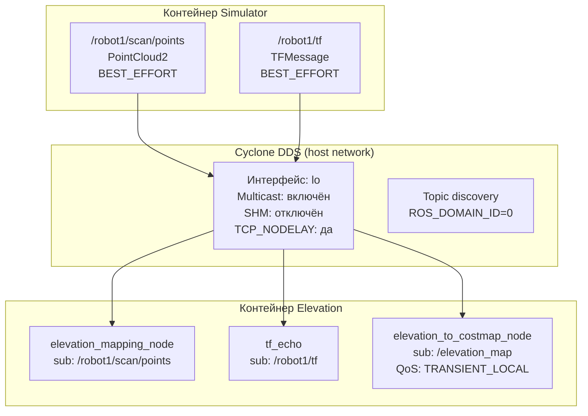

# Глава 3. Разработка модуля Elevation Mapping и terrain-aware планирования

## 3.5 Настройка TF и межконтейнерной связи (DDS)

Система трансформаций TF является фундаментальным компонентом любой робототехнической системы на ROS 2, обеспечивающим пространственную привязку всех сенсоров и исполнительных устройств. Для elevation mapping критически важно иметь точное знание о положении сенсора относительно карты в каждый момент времени. Дополнительную сложность вносит двухконтейнерная архитектура, где TF-дерево должно быть доступно в обоих контейнерах, что требует настройки межконтейнерной связи DDS. Неправильная конфигурация DDS может привести к потере TF-сообщений и некорректной работе модуля. В данном разделе описываются TF-дерево робота и конфигурация DDS для работы в двухконтейнерной архитектуре.

### 3.5.1 Трансформации (TF)

Правильная работа elevation_mapping_node критически зависит от наличия полного и актуального TF-дерева [4]. Модуль использует трансформации для проецирования точек облака из фрейма сенсора в фрейм карты, определения положения робота на карте высот и вычисления углов обзора для visibility cleanup.

TF-дерево робота Unitree Go2 [6] имеет следующий вид: map  —  odom  —  base_link, от которого отходят laser_frame, imu_frame, foot_front_left, foot_front_right, foot_hind_left и foot_hind_right.

Симулятор публикует эти трансформации на namespaced топиках: `/robot1/tf` (динамические трансформации, частота около 100 Гц) и `/robot1/tf_static` (статические, однократно).

### 3.5.2 Разработка TF-relay

Модуль elevation_mapping_cupy слушает стандартные топики `/tf` и `/tf_static`. Для перенаправления трансформаций разработан TF-relay (`tf_relay.py`). Нода подписывается на `/robot1/tf` с QoS-профилем BEST_EFFORT (трансформации публикуются с высокой частотой, допустима потеря отдельных сообщений) и на `/robot1/tf_static` с QoS-профилем TRANSIENT_LOCAL (гарантия доставки всем подписчикам, включая подключившихся после публикации). Публикация осуществляется на `/tf` и `/tf_static` с соответствующими QoS-профилями.

TF-relay не буферизирует трансформации — он работает как прозрачный прокси. Буферизация выполняется на стороне tf2_ros::Buffer в elevation_mapping_node. Relay работает в том же контейнере, что и симулятор, поэтому дополнительная сетевая задержка отсутствует.

### 3.5.3 Статический publisher map  —  odom

Для привязки карты высот к глобальной системе координат запускается статический publisher трансформации map  —  odom с нулевым смещением. Это необходимо, так как в симуляции отсутствует отдельный SLAM-модуль, и координаты map и odom совпадают. В реальной системе вместо этого будет использоваться SLAM (например, RTAB-Map или Cartographer) [7].

**Известная проблема: сдвиг costmap из-за статического map — odom.** При движении робота elevation map остаётся в системе координат odom, а Nav2 ожидает costmap в системе map. Поскольку static_transform_publisher публикует нулевое смещение map — odom вне зависимости от реального положения робота, возникает рассогласование: traversability costmap не следует за фактическим положением робота в глобальной карте. Решение: на начальном этапе (без SLAM) следует удалить статический publisher и позволить Nav2 стартовать с тождественной трансформацией (map = odom в момент t=0), при этом amcl не используется.

### 3.5.4 Настройка DDS discovery

Проблема discovery между контейнерами решена следующим образом. Оба контейнера используют единую RMW-реализацию `rmw_cyclonedds_cpp` и единый ROS_DOMAIN_ID = 0, что обеспечивает видимость нод друг другу.

Конфигурация Cyclone DDS включает явное указание сетевого интерфейса (lo), разрешение multicast, включение topic discovery и отключение Shared Memory транспорта (Рисунок 3.3). Отключение SHM является критическим, так как контейнеры не имеют общей разделяемой памяти, и использование SHM-транспорта приводит к невозможности discovery [8].

Рисунок 3.3 — Схема межконтейнерной связи через Cyclone DDS

### 3.5.5 Диагностика discovery

Для диагностики проблем discovery используются следующие инструменты:

— `ros2 node list` — проверка видимости нод между контейнерами;

— `ros2 topic list` — проверка доступных топиков;

— `ros2 topic echo /tf` — проверка наличия трансформаций;

— Cyclone DDS трассировка с включённым Tracing в конфигурационном файле.

Типичные проблемы и их решения приведены в Таблице 3.2.

Таблица 3.2 — Типичные проблемы DDS discovery и их решения

| Проблема | Причина | Решение |
|----------|---------|---------|
| Ноды не видны | Разные ROS_DOMAIN_ID | Установить единый ID |
| TF не публикуется | Неправильный QoS | Использовать BEST_EFFORT |
| PointCloud не принимается | SHM-конфликт | Отключить SHM в Cyclone |
| Discovery медленный | Много интерфейсов | Явно указать lo interface |
| Ground truth не приходит | RELIABLE vs BEST_EFFORT | Подписываться BEST_EFFORT, как публикует Gazebo |
| Elevation map не доставляется мосту | RELIABLE + VOLATILE vs TRANSIENT_LOCAL | Использовать TRANSIENT_LOCAL для subscriber моста |

### 3.5.6 Ground truth bridge

Для диагностики одометрии разработан `ground_truth_publisher.py`, который получает истинное положение робота от Gazebo через топик `/model/robot1_my_bot/pose` (Gazebo native) с резервным источником `/world_poses_info` (GzBridge). Нода публикует:
— ROS 2 Odometry на `/robot1/ground_truth` для сравнения leg odometry с эталоном;
— TF-трансформацию `gt_odom  —  base_link_gt` для визуализации в RViz.

Ground truth bridge использует QoS-профиль BEST_EFFORT, так как Gazebo публикует /model/robot1_my_bot/pose именно с этим профилем. При использовании RELIABLE подписка не получает сообщения, что является типичной проблемой несоответствия QoS (см. раздел 3.11.6).

### 3.5.7 Оптимизация сетевого трафика

PointCloud2 на частоте 10 Гц генерирует трафик около 230 КБ/с (360 × 16 × 4 байта × 10 Гц). Для оптимизации применяются: отключение SHM (гарантирует использование UDP, что стабильнее при межконтейнерной передаче), явное указание lo-интерфейса (предотвращает широковещательный discovery на внешние сети) и использование TCP_NODELAY в Cyclone DDS для минимизации задержки [8].
