# Глава 3. Разработка модуля Elevation Mapping и terrain-aware планирования

## 3.6 Фильтрация облака точек и параметры сенсора

### 3.6.1 Параметры elevation_mapping_cupy

Конфигурация модуля задаётся в двух файлах: `core_param.yaml` (основные параметры, общие для всех роботов) и `go2_lidar3d.yaml` (параметры для Unitree Go2). Основные параметры карты высот: resolution = 0,1 м (разрешение ячейки карты), map_length = 20,0 м (размер карты), min_valid_distance = 0,3 м (минимальное расстояние точки), max_ray_length = 10,0 м (максимальная длина луча), max_height_range = 10,5 м (максимальный диапазон высот) [11].

Параметры RAM-фильтра высоты: ramped_height_range_a = 0,3 (коэффициент наклона порога), ramped_height_range_b = 1,0 (расстояние излома), ramped_height_range_c = 0,2 (минимальный порог высоты). Параметры visibility cleanup: cleanup_step = 0,1 (шаг очистки, определяющий уверенность), cleanup_footprint = 1 (радиус очистки в ячейках). Параметры фильтрации точек: mahalanobis_thresh = 2,0 (порог фильтрации Махаланобиса), sensor_noise_stddev = 0,01 (стандартное отклонение шума сенсора).

Robot-specific конфигурация включает map_frame = "odom", base_frame = "base_link", sensor_frame = "laser_frame", топик подписки `/robot1/scan/points` с типом данных pointcloud и слои публикации elevation, variance, traversability.

### 3.6.2 Фильтрация тела робота

LiDAR установлен на корпусе робота в позиции (0,22; 0; 0,095) относительно base_link. Вертикальный угол обзора ±15° означает, что при расстоянии менее 30 см лучи попадают на корпус робота. Параметр min_valid_distance = 0,3 м отбрасывает все точки ближе 30 см, что исключает отображение корпуса и крышки робота на карте высот.

Без данного параметра (при значении 0,1 по умолчанию) на карте высот отображаются артефакты в виде возвышения вокруг позиции робота, что приводит к ложной классификации местности как непроходимой [11].

### 3.6.3 Ограничение дальности

LiDAR имеет физическое ограничение дальности 12 м. Для ray tracing (visibility cleanup) установлен max_ray_length = 10,0 м, что обеспечивает корректную обработку видимости (точки за пределами 10 м не используются для visibility cleanup, так как их точность недостаточна), оптимизацию производительности (сокращение количества обрабатываемых точек на периферии снижает нагрузку на GPU) и фокус на рабочей зоне (карта имеет размер 20×20 м, и обработка точек за пределами 10 м от робота не даёт существенного улучшения качества карты).

### 3.6.4 RAM-фильтр высоты

RAM-фильтр (Ramped Adaptive Maximum height) реализует адаптивный порог высоты, зависящий от расстояния до точки. Принцип работы: на близких расстояниях (d < b) порог равен минимальному значению c; на дальних расстояниях (d > b) порог линейно растёт с коэффициентом a.

Для значений a = 0,3, b = 1,0, c = 0,2 фильтр работает следующим образом: на расстоянии 0,3 м порог высоты составляет 0,2 м (отбрасывается всё выше 20 см над сенсором); на расстоянии 1,0 м — 0,2 м; на расстоянии 2,0 м — 0,5 м; на расстоянии 5,0 м — 1,4 м; на расстоянии 10,0 м — 2,9 м.

Данный подход позволяет на близких расстояниях отбрасывать потолки и нависающие объекты, а на дальних расстояниях — учитывать естественный рельеф (холмы) [4].

### 3.6.5 Visibility Cleanup

Visibility cleanup — алгоритм, реализованный на CUDA, который корректирует карту высот на основе анализа видимости. Для каждой ячейки карты на расстоянии d от сенсора определяется, находится ли ячейка на прямой видимости (line of sight) между сенсором и точкой измерения. Если ячейка находится на линии видимости, её уверенность уменьшается на cleanup_step (0,1). При продолжении поступления измерений, подтверждающих наличие объекта в данной ячейке, уверенность восстанавливается.

Эффект от применения visibility cleanup: динамические объекты (движущиеся роботы, люди) автоматически удаляются с карты через несколько кадров; шумовые измерения не создают ложных объектов на карте; точность карты на границах объектов повышается [5].

### 3.6.6 Фильтрация выбросов Махаланобиса

Для дополнительной фильтрации используется критерий Махаланобиса: если расстояние Махаланобиса между измеренной высотой и ожидаемой превышает порог mahalanobis_thresh, точка отбрасывается. Порог 2,0 означает, что отбрасываются точки, отклоняющиеся от ожидаемой высоты более чем на 2 стандартных отклонения, что удаляет редкие выбросы, не затрагивая основную поверхность.

### 3.6.7 Комплексная фильтрация

При поступлении нового облака точек каждая точка проходит последовательно следующие этапы фильтрации (Рисунок 3.4):

```mermaid
flowchart LR
    A["Облако точек<br/>sensor_msgs/PointCloud2"] --> B{"min_valid_dist<br/>&#60; 0.3 м?"}
    B -->|Да| X["Отброс"]
    B -->|Нет| C{"max_ray_length<br/>&#62; 10.0 м?"}
    C -->|Да| X
    C -->|Нет| D{"ramped_height<br/>превышение<br/>порога?"}
    D -->|Да| X
    D -->|Нет| E["Проецирование<br/>в фрейм карты<br/>(TF)"]
    E --> F{"Махаланобис<br/>&#62; 2.0?"}
    F -->|Да| X
    F -->|Нет| G["Обновление карты<br/>взвешенное среднее<br/>+ дисперсия"]
```

Рисунок 3.4 — Этапы фильтрации облака точек

1) проверка min_valid_distance: если расстояние менее 0,3 м — отбрасывание;

2) проверка max_ray_length: если расстояние более 10,0 м — отбрасывание;

3) проверка ramped_height_range: если высота превышает адаптивный порог — отбрасывание;

4) проецирование в фрейм карты с использованием TF-трансформаций;

5) проверка Махаланобиса: если расстояние Махаланобиса превышает 2,0 — отбрасывание;

6) обновление карты: взвешенное усреднение высоты с учётом дисперсии.
