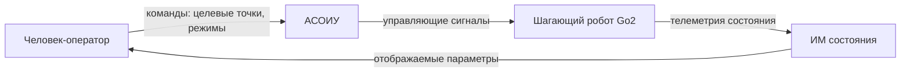

# Черновик КР по эргономике (тема А2)

**Тема:** Разработка и оценка информационной модели состояния шагающего
робота для человека-оператора в контуре управления
**Статус:** черновик. Числа и ссылки в квадратных скобках `[TODO]` —
заглушки, заполняются по мере работы.
**Связанный файл:** `a2-structure.md` (структура и план РПЗ)

---

# Титульный лист

> Заполняется по шаблону ВКРМ: вуз, кафедра, дисциплина, тема,
> исполнитель, руководитель, город/год. [TODO]

---

# Содержание

> По разделам `a2-structure.md`. [TODO сформировать после финализации]

---

# Введение

Шагающие роботы всё чаще используются как мобильные платформы в
автоматизированных системах обработки информации и управления
(АСОИУ): они несут датчики, перемещают их в пространстве и выступают
исполнительным звеном в контуре управления. Управление таким роботом,
как правило, не полностью автономно: человек-оператор (ЧО) задаёт
целевые точки, контролирует ход выполнения и вмешивается в нештатных
ситуациях. Эффективность его работы напрямую зависит от того, насколько
полно, точно и своевременно он воспринимает состояние робота.

Состояние шагающего робота описывается большим числом динамически
меняющихся параметров: положение и ориентация корпуса, высота опорной
поверхности, углы в суставах конечностей, контакты ног с грунтом,
скорость, крен и дифферент, остаток заряда. Отображение всех параметров
одновременно перегружает оператора; отображение слишком малого набора —
лишает его информации, необходимой для безопасного управления.
Возникает задача эргономического проектирования информационной модели
(ИМ): выбора состава, приоритетов и формы представления контролируемых
параметров.

Объект исследования — информационное обеспечение деятельности
человека-оператора в контуре управления шагающим роботом.

Предмет исследования — информационная модель состояния шагающего робота
как средство отображения динамической информации оператору.

Цель работы — разработка и оценка информационной модели состояния
шагающего робота, обеспечивающей эффективную работу человека-оператора
в контуре управления.

Задачи работы:
1. провести анализ деятельности человека-оператора в контуре управления
   шагающим роботом и выявить состав контролируемых параметров состояния
   робота;
2. формализовать требования к информационной модели состояния робота на
   основе системно-деятельностного подхода;
3. разработать (выбрать) варианты информационной модели;
4. провести эргономическую оценку вариантов методами экспертных оценок;
5. обосновать рекомендуемый вариант и сформулировать выводы.

Методы исследования: системно-деятельностный подход, анализ источников,
метод экспертных оценок, эргономическая экспертиза.

---

# 1. Анализ предметной области

## 1.1. Шагающий робот как объект управления

Объектом исследования в работе является четырёхопорный шагающий робот
Unitree Go2. Робот имеет 12 управляемых суставов (по три на конечность:
тазобедренный, коленный, голеностопный). Управление реализовано на базе
промежуточного программного обеспечения ROS2; отработка походки
выполняется в симуляционной среде Isaac Lab. [TODO: добавить ссылки на
документацию и описание стенда]

Робот оснащён сенсорной системой, формирующей данные о состоянии:

- углы и скорости в суставах (топик `joint_states`);
- инерциальные измерения — ориентация, угловые скорости, ускорения
  (топик `imu`);
- контакты ног с опорной поверхностью (топик `foot_contact`);
- одометрия — положение и ориентация робота в пространстве (топик
  `odom`), в том числе высота корпуса Z и дрейф по поперечной оси Y;
- состояние источника питания (топик `battery_state`).

Перечень топиков и состав данных приведён в приложении А.

## 1.2. Контур управления «оператор — АСОИУ — робот»

В работе рассматривается контур управления, в котором человек-оператор
занимает верхний уровень:

Оператор выполняет следующие функции:
- постановка целевых точек (в том числе с помощью инструмента
  целеуказания в сцене визуализации);
- наблюдение за движением робота и его состоянием;
- оценка ситуации (штатная / нештатная);
- вмешательство при отклонениях от задания.

Особенность деятельности оператора шагающего робота — высокая
динамичность наблюдаемых параметров: положение корпуса, высота и
контакты ног меняются с частотой шага [TODO: указать частоту], поэтому
к ИМ предъявляются повышенные требования по скорости восприятия.

## 1.3. Существующие средства отображения информации (анализ ПО)

В качестве средств отображения информации в рассматриваемой системе
используются:
- трёхмерная сцена визуализации (RViz), где отображается модель робота,
  его маршрут и целевые точки;
- числовые и графические панели телеметрии (высота Z, углы суставов,
  скорости, число шагов);
- индикаторы состояния (контакт ног, заряд батареи).

Анализ ПО [TODO: раздел 3 «Введение (анализ ПО)» по методичке —
посвятить обзору существующих систем и интерфейсов управления мобильными
роботами; сравнение с известными панелями операторов (напр., панели
телеметрии Boston Dynamics Spot, Unitree, исследовательские интерфейсы)]
показывает, что типовым решением является комбинированное отображение:
3D-сцена дополняется числовыми индикаторами. При этом состав параметров
и их приоритеты выбираются, как правило, эвристически, без явного
обоснования с позиций деятельности оператора. Это и составляет проблему
исследования.

---

# 2. Системно-деятельностный подход к проектированию ИМ

## 2.1. Общие положения СДП

Системно-деятельностный подход (СДП) рассматривает человека-оператора
как активное звено системы «человек — машина», а его деятельность — как
целенаправленный процесс, структура которого определяется целью и
условиями. Проектирование информационного обеспечения при СДП ведётся
«от деятельности»: сначала описывается деятельность, затем определяются
информационные потребности, и только потом — состав и форма средств
отображения. [TODO: ссылки на источники по СДП, в т.ч. авторы МГТУ]

## 2.2. Модель деятельности оператора

Деятельность оператора шагающего робота представим в виде
последовательности укрупнённых действий:

На каждом такте оператору требуется ответить на вопросы:
1. соответствует ли движение робота заданию (положение, маршрут);
2. устойчив ли робот, нет ли угрозы опрокидывания;
3. исправны ли подсистемы (контакты ног, заряд, связь);
4. не требуется ли вмешательство.

Из этих вопросов выводятся информационные потребности — набор параметров,
которые оператор должен воспринять.

## 2.3. Перечень контролируемых параметров состояния

По результатам анализа деятельности составлен перечень параметров
состояния робота, значимых для оператора, с оценкой критичности
[TODO: уточнить по протоколу эксперимента]:

| № | Параметр | Источник данных | Критичность | Частота изменения |
|---|---|---|---|---|
| 1 | Устойчивость (опрокидывающий момент / наклон) | `imu`, вычисляемый | Критичный | высокая |
| 2 | Высота корпуса Z | `odom` | Критичный | высокая |
| 3 | Контакты ног с опорой | `foot_contact` | Критичный | высокая (частота шага) |
| 4 | Соответствие движения заданию (отклонение от траектории) | `odom`, целевые точки | Важный | средняя |
| 5 | Положение/ориентация в сцене | `odom` | Важный | средняя |
| 6 | Скорость движения | `odom` | Важный | средняя |
| 7 | Углы в суставах | `joint_states` | Фоновый | высокая |
| 8 | Дрейф по поперечной оси Y | `odom` | Важный | низкая |
| 9 | Заряд батареи | `battery_state` | Фоновый | низкая |

Критичность определяет приоритет параметра при проектировании ИМ.

---

# 3. Формализация задачи и требования к ИМ

## 3.1. Критерии качества информационной модели

Качество ИМ будем оценивать по критериям [TODO: обосновать по
источникам]:

- **полнота** — ИМ содержит все параметры, необходимые для принятия
  решения;
- **точность** — значения отображаются с погрешностью, не искажающей
  оценку ситуации;
- **своевременность (латентность)** — задержка отображения не превышает
  допустимую для темпа деятельности;
- **читаемость (однозначность)** — параметр легко и однозначно
  считывается оператором;
- **нагрузка на внимание** — ИМ не требует одновременного удержания
  избыточного числа параметров.

## 3.2. Постановка задачи выбора ИМ

Пусть задан перечень контролируемых параметров `P = {p1…pn}` с
приоритетами `w(p)`. Требуется выбрать состав отображаемых параметров
`D ⊆ P`, форму их представления и способ кодирования так, чтобы
обеспечить заданное качество восприятия при ограниченных ресурсах
внимания оператора.

Приоритизация выполняется по правилу: параметры критичной группы
отображаются всегда и в наиболее наглядной форме (крупно, с цветовой
кодировкой состояния); параметры фоновой группы — по запросу или в
свёрнутом виде. [TODO: формализовать, возможно весовые коэффициенты]

## 3.3. Требования к ИМ (результат формализации)

1. Отображение критичных параметров (устойчивость, высота, контакты)
   — постоянно и без возможности скрытия.
2. Цветовая кодировка состояния: штатное / предупреждение / авария.
3. Время считывания критичного параметра — не более [TODO: c], что
   согласуется с темпом шага.
4. ИМ должна позволять оператору заметить аномалию (снижение Z, дрейф
   по Y, потерю контакта ноги) за время, меньшее времени развития
   аварийной ситуации.
5. Команды оператора и их результат должны быть связаны (оператор видит
   следствие своей команды).

---

# 4. Разработка вариантов информационной модели

## 4.1. Описание вариантов

На основе сформулированных требований разработаны три варианта ИМ:

**Вариант 1 — числовая панель.** Параметры состояния отображаются в виде
таблицы числовых значений (высота Z, крен, дифферент, контакты, скорость,
заряд). Достоинство — точность; недостаток — высокая нагрузка на
внимание и низкая скорость считывания динамики.

**Вариант 2 — трёхмерная сцена с наложением.** Состояние робота
отображается в 3D-сцене (модель робота, маршрут, целевые точки), а
критичные параметры — цветовыми маркерами и индикаторами, встроенными в
сцену. Достоинство — естественность восприятия пространственного
положения; недостаток — сложнее считывать точные значения.

**Вариант 3 — комбинированный (рекомендуемый к проверке).** 3D-сцена
дополняется компактной панелью критичных параметров с цветовой
кодировкой и графиком тренда высоты. Фоновые параметры доступны по
запросу.

## 4.2. Привязка вариантов к реальной системе

Прототипы вариантов реализуются на основе средств отображения,
присутствующих в системе управления роботом (сцена RViz, панели
телеметрии). [TODO: описать, как именно собран прототип; приложить
скриншоты]

---

# 5. Эргономическая оценка вариантов ИМ

## 5.1. Методика экспертной оценки

Оценка проводится методом экспертных оценок. Состав группы экспертов —
5–7 человек [TODO: указать состав]. Каждый эксперт оценивает варианты ИМ
по критериям раздела 3.1 по шкале [TODO: 5-балльной или иной].
Обработка результатов — расчёт средних оценок и показателя
согласованности [TODO: указать метод, напр., коэффициент конкордации].

Критерии оценки:
- полнота и достаточность информации;
- скорость и однозначность считывания;
- нагрузка на внимание;
- удобство при нештатной ситуации;
- общая эргономичность.

## 5.2. Результаты оценки

> Таблица средних оценок вариантов по критериям. [TODO: заполнить по
> итогам экспертизы]

## 5.3. Дополнительная проверка на реальных данных

Помимо экспертной оценки, выполняется проверка: на записи телеметрии
реального запуска робота (ходьба в Isaac Lab, [TODO: число шагов],
стабильная высота Z ≈ [TODO: значение] м) фиксируется, за какое время
оператор с помощью каждого варианта ИМ обнаруживает модельную аномалию
(например, внезапное снижение Z или дрейф по Y). Это связывает экспертную
оценку с объективным показателем времени реакции. [TODO: методика и
результаты]

---

# Заключение

В ходе работы:
1. проанализирована деятельность человека-оператора в контуре управления
   шагающим роботом и определён перечень контролируемых параметров
   состояния;
2. на основе системно-деятельностного подхода формализованы требования
   к информационной модели;
3. разработаны три варианта информационной модели;
4. проведена их эргономическая оценка методами экспертных оценок;
5. обоснован рекомендуемый вариант.

Основной результат — [TODO: сформулировать после экспертизы]. Результаты
работы используются в дипломном проектировании при построении панели
оператора системы управления шагающим роботом.

---

# Список использованных источников

> Не менее 15–20 источников. Желательно: ≥5 свежих (не старше 5 лет),
> 2–5 от авторов МГТУ, наличие DOI, источники на английском. ГОСТы — по
> возможности не использовать. [TODO: собрать]

Примерный состав:
1. [Источники по эргономике, инженерной психологии, СДП — учебники и
   статьи авторов МГТУ] [TODO]
2. [Информационные модели и средства отображения информации] [TODO]
3. [ROS2, RViz — документация] [TODO]
4. [Unitree Go2 — документация, спецификация] [TODO]
5. [Isaac Lab / Isaac Sim — документация] [TODO]
6. [Шагающие роботы, телеуправление — статьи] [TODO]
7. [Метод экспертных оценок — методическая литература] [TODO]

---

# Приложение А. Состав данных телеметрии

> Таблица топиков ROS2, типов сообщений и частоты публикации по данным
> системы управления роботом. [TODO: заполнить фактическими значениями]

# Приложение Б. Скриншоты вариантов ИМ

> Скриншоты вариантов 1–3. [TODO]

# Приложение В. Протоколы экспертной оценки

> Исходные оценки экспертов и обработка. [TODO]
