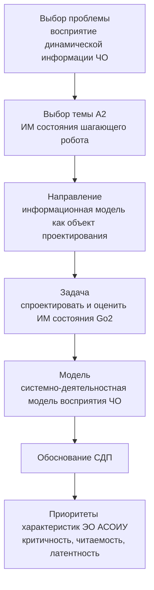

# Структура КР «Разработка и оценка информационной модели состояния шагающего робота»

**Тема:** А2 — Разработка и оценка информационной модели состояния
шагающего робота для человека-оператора в контуре управления
**Вариант КР:** 1 (аналитический)
**Объём РПЗ:** 25–30 стр. А4 (без приложений), TNR 14, полуторный
интервал, отступ 1,25 см
**Дисциплина:** ЭА_СОиОИ (эргономика), МГТУ им. Н.Э. Баумана

---

## 1. Карта КР на требования методички (вариант 1)

Этапы и рубежный контроль:

| РПК | Срок | Содержание этапа | Артефакт |
|---|---|---|---|
| РПК-1 | 3 нед. | Выбор проблемы и темы, согласование | формулировка темы, введение |
| РПК-2 | 6 нед. | Определение задачи, обзор источников | обзор ПО и литературы |
| РПК-3 | 8 нед. | Формализация задачи, модель, приоритеты ЭО | **ДЗ (часть 1, теория), 15 нед.** |
| РПК-4 | 14 нед. | Сбор данных, разработка/выбор ИМ, оценка | экспериментальная часть |
| РПК-5 | 16 нед. | Экспертиза, выводы, оформление | РПЗ, защита 16–17 нед. |

---

## 2. Состав РПЗ (по структуре варианта 1 методички)

### Часть 1 — теоретическая (ДЗ, сдаётся на 15 неделе)

| № | Раздел | Содержание | Объём, стр. |
|---|---|---|---|
| 1 | Титульный лист | по шаблону ВКРМ | 1 |
| 2 | Содержание | оглавление | 1 |
| 3 | Введение (анализ ПО) | АСОИУ шагающего робота, постановка проблемы | 2–3 |
| 4 | Исследовательская часть | обзор, СДП, формализация, требования к ИМ | 10–12 |
| 5 | Оценка результатов (экспертиза) | методика и результаты оценки | 4–5 |
| 6 | Заключение, выводы | выводы по цели и задачам | 2 |
| 7 | Список источников | ≥15–20 источников | 2 |

### Часть 2 — практическая (обоснование результатов)

| № | Раздел | Содержание | Объём, стр. |
|---|---|---|---|
| 8 | Обоснование | расчётные/экспертные обоснования, связь с экспериментом Go2 | 3–4 |

### Часть 3 — приложения (необязательная)

- Скриншоты интерфейса (RViz), таблицы экспертных оценок, фрагменты
  топиков ROS2, протоколы запуска.

---

## 3. Развёрнутый план по разделам РПЗ

### 3.1. Введение (анализ ПО)

1. Актуальность: телеуправление шагающими роботами, рост автономности,
   роль оператора.
2. Объект и предмет.
3. Цель: разработать и оценить ИМ состояния шагающего робота для
   человека-оператора в контуре управления.
4. Задачи:
   - проанализировать деятельность ЧО в контуре управления шагающим
     роботом;
   - выявить перечень контролируемых параметров состояния робота;
   - сформулировать требования к ИМ на основе СДП;
   - спроектировать (выбрать) вариант ИМ;
   - провести эргономическую экспертизу варианта ИМ.
5. Методы: системно-деятельностный подход, метод экспертных оценок,
   эргономическая экспертиза.

### 3.2. Исследовательская часть (теория)

1. **Анализ предметной области.**
   - Шагающий робот Unitree Go2 как объект управления; ROS2-стек,
     симуляция Isaac Lab.
   - Контур управления «оператор — АСОИУ — робот»; что контролирует
     оператор (RViz, waypoint-инструмент, телеметрия).
2. **Анализ ПО.** Каналы данных о состоянии робота: `joint_states`,
   `imu`, `foot_contact`, `odom`, `battery_state`, статус шагов
   (число шагов, Z-высота, дрейф по Y).
3. **Системно-деятельностный подход.** Деятельность ЧО: восприятие →
   оценка ситуации → принятие решения → командование. Применение СДП к
   выбору состава и формы ИМ.
4. **Формализация задачи.** Критерии качества ИМ (полнота, точность,
   своевременность, однозначность, минимальная нагрузка на внимание).
   Приоритизация параметров: критичные (опрокидывание, контакт ног,
   наклон) vs фоновые (углы суставов, скорость).
5. **Требования к ИМ.** Принципы отображения динамической информации;
   нормы по цвету, размеру, обновлению; ограничения СЧМ.

### 3.3. Оценка полученных результатов (экспертиза)

1. Методика экспертной оценки (группа 5–7 экспертов, критерии,
   шкалы).
2. Сравнение вариантов ИМ (например, числовая панель vs 3D-сцена с
   наложением vs комбинированная).
3. Результаты: таблицы оценок, обработка (средние, согласованность),
   графики.
4. Эргономический вывод: рекомендуемый вариант.

### 3.4. Обоснование полученных результатов (практика)

- Привязка к реальному эксперименту: запуск Go2 в Isaac Lab, запись
  телеметрии, демонстрация, что выбранная ИМ позволяет оператору
  своевременно заметить аномалию (например, падение Z или дрейф).
- Сопоставление с теоретическими критериями из ч. 1.

### 3.5. Заключение, выводы

- Достигнута ли цель, решены ли задачи.
- Практическая значимость для дипломной работы.

---

## 4. Материалы, которые можно взять из проекта (реальные данные)

| Что | Где в проекте | Для чего в КР |
|---|---|---|
| Список топиков состояния | `joint_states`, `imu`, `foot_contact`, `odom`, `battery_state` | перечень контролируемых параметров |
| Панель визуализации | RViz (`go2_description`, `rviz_launch.py`) | прототип ИМ |
| Данные телеметрии | логи Isaac Lab: Z-высота, углы суставов, число шагов, дрейф по Y | примеры для раздела «оценка» |
| Инструмент целеуказания | `rviz_waypoint_tool` | канал командования в контуре |
| Перцепция | `yolo_detector.py` (YOLO) | дополнительный канал информирования |

---

## 5. Ориентировочное распределение по этапам (что и когда делаем)

| Неделя | Работа | Результат |
|---|---|---|
| 1–3 | Выбор темы, введение, план | РПК-1 |
| 4–6 | Анализ предметной области, обзор источников | РПК-2 |
| 7–8 | СДП-модель, требования к ИМ | РПК-3, начало ДЗ |
| 9–15 | Сбор данных Go2, разработка/выбор вариантов ИМ, экспертиза | ДЗ (теория) + практика |
| 16 | Оформление РПЗ, подготовка к защите | РПК-5, защита |

---

## 6. Чек-лист соответствия требованиям

- [ ] Объём 25–30 стр. А4 (без приложений)
- [ ] Times New Roman 14, полуторный интервал, отступ 1,25 см
- [ ] Поля: левое 30, правое 10, верх/низ 20 мм
- [ ] 1800–2000 знаков на странице
- [ ] Структура: титул, содержание, введение (анализ ПО),
      исследовательская часть, оценка (экспертиза), заключение,
      список источников, обоснование (практика), приложения
- [ ] Список источников ≥15–20 (желательно ≥5 свежих, 2–5 от МГТУ,
      наличие DOI)
- [ ] Демонстрация результатов (компьютер + бумажный вид)
