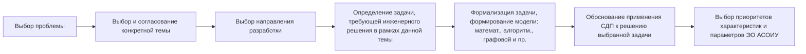
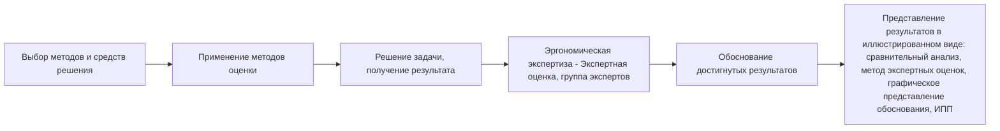
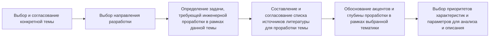
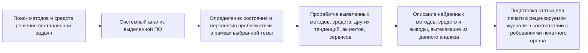
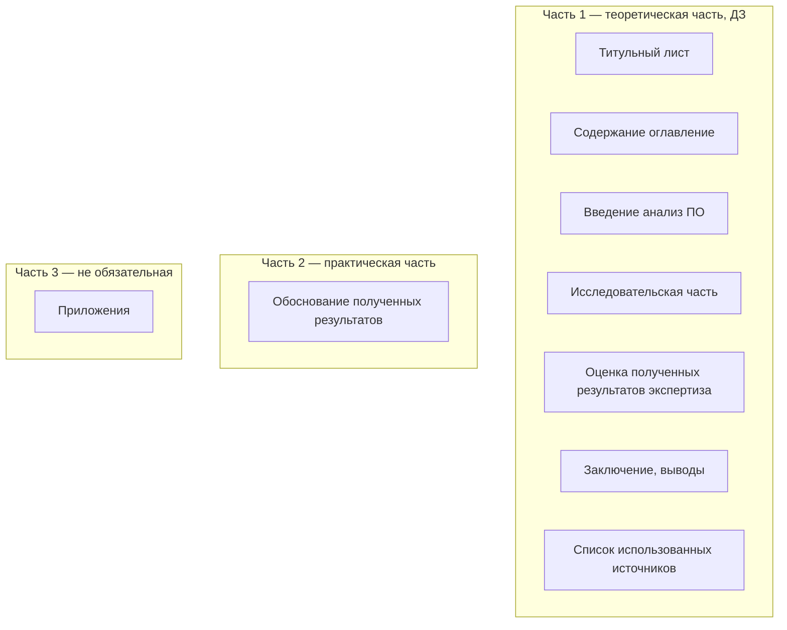
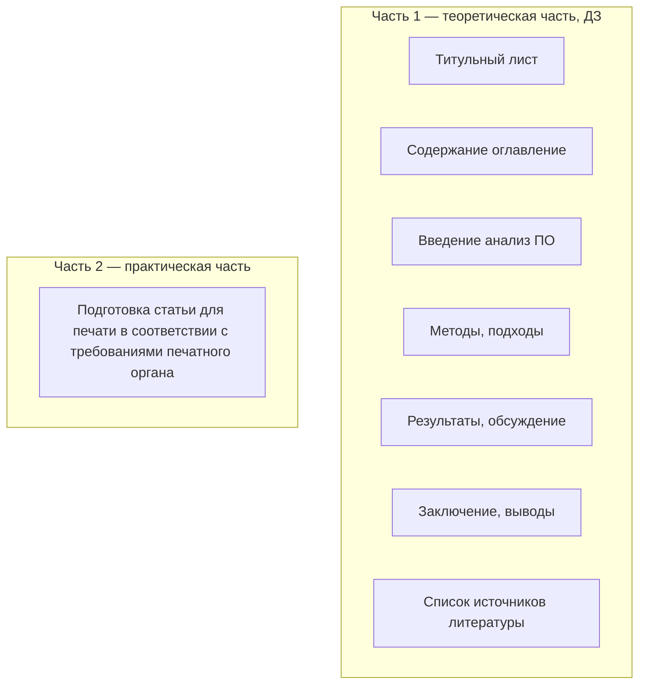

# КР по эргономике — методика (Горячкин Б.С.)

**Источник:** `КР по эргономике.pdf` (презентация PowerPoint, 22 слайда)
**Автор:** Горячкин Б.С.
**Предмет:** ЭА_СОиОИ (эргономика), 1 семестр
**Дата документа:** 2026-08-30
**Статус:** конспект методички для выполнения КР

---

## Общий алгоритм работы

1. **Выбор варианта (пути) КР** — два пути (аналитический / обзорный).
2. **Этапы КР** — два этапа (модуль 1, модуль 2).
3. **Темы КР** — направления и примеры тем.
4. **Текущий контроль и защита КР** — РПК, ДЗ, защита.
5. **Требования к рубежным контролям и к защите.**
6. **Структура РПЗ КР.**
7. **Требования к РПЗ.**

---

## I. Выбор варианта (пути) КР

### Вариант 1 (аналитический)

Анализ, исследование, моделирование, экспертиза, оптимизация, создание
оценочных и подтверждающих теоретические выводы методов и средств
(включая информационно-программные), подготовка **аналитической статьи**
(выборочно и по желанию).

### Вариант 2 (обзорный)

Системный анализ ПО, расширение понятийного базиса выбранного
направления, обсуждение и экспертиза результатов работы, подготовка
**обзорной или постановочной статьи**.

---

## II. Этапы КР

### Вариант 1 (путь)

Формализация задачи по эффективному восприятию сложной динамической
информации при системно-деятельностном подходе к проектированию АСОИУ.
Выбор приоритетов характеристик и параметров эргономического обеспечения
АСОИУ.

Разработка вариантов оптимального пользовательского интерфейса.
Обоснование выбора типа, состава и числа информационных моделей. Оценка
информационных моделей. Подготовка эргономического сертификата.

#### Первый этап (модуль 1) — контроль РПК-1, РПК-2, РПК-3

#### Второй этап (модуль 2) — контроль РПК-4, РПК-5

### Вариант 2 (путь)

Выбор и обоснование акцентов, глубины проработки, а также приоритетов
характеристик и параметров для анализа и описания в рамках выбранной
тематики.

Описание и представление выявленных в рамках выбранной тематики
тенденций, подходов, методов, средств, сервисов и инструментов.
Подготовка **печатной статьи**.

#### Первый этап (модуль 1) — контроль РПК-1, РПК-2, РПК-3

#### Требования к списку источников (вариант 2)

- Не менее **25–30 источников**; источники интернет-ресурсов не должны
  превышать **половину** указанного списка.
- В тексте — **не менее 20 ссылок** на различные источники литературы.
- Как минимум **5 источников** литературы должны быть **не старше 5 лет**.
- Крайне желательно, чтобы **2–5 источников** принадлежали авторам из
  **МГТУ им. Н.Э. Баумана**.
- Не рекомендуется ссылаться на ГОСТы, нормативные документы, законы и
  пр. (не запрещается).
- Настоятельно рекомендуется ссылаться только на материалы, у которых
  есть **DOI** (digital object identifier).
- Не рекомендуется ссылаться на источники на отличном от английского
  языке (можно, но не более **2 ссылок**).

#### Второй этап (модуль 2) — контроль РПК-4, РПК-5

---

## III. Темы КР

### Вариант 1

#### Проблемы

1. Эффективная работа человека-оператора (ЧО) в контуре управления (КУ)
   при различных режимах деятельности.
2. Распределение функций в АСОИУ.
3. Проблемы восприятия информации в контуре управления.
4. Разработка эффективных информационных моделей (ИМ).
5. Создание удобных и доступных методов и средств эргономической оценки.

#### Направления

1. Системно-деятельностный подход к проектированию АСОИУ. Его
   отличительные особенности.
2. ЧО в АСОИУ. Профотбор, обучение, алгоритмы функционирования.
3. Вопросы создания и оценки эргономического обеспечения (ЭО).
4. Прием трудновоспринимаемой информации человеком-оператором.
5. Рабочая среда системы «человек-машина» (СЧМ). Антропометрические
   аспекты при работе в контуре управления.
6. Информационная модель как объект проектирования.
7. Выявление при проектировании критических характеристик и параметров
   моделей в зависимости от различных видов ИМ.
8. Эргономическая оценка ИМ, коммуникантов СЧМ и АСОИУ в целом.
9. Эргономическая экспертиза (ЭЭ). Принципы, методы, средства.
10. Особенности и специфика эргономического проектирования.

#### Примеры тем

1. Разработка алгоритмов деятельности (функционирования) ЧО в контуре
   управления.
2. Пошаговые инженерные методики для различных видов деятельности и
   условий функционирования.
3. Модели поведения ЧО при управлении АСОИУ. Математическое
   моделирование деятельности человека-оператора.
4. Анализ характеристик рабочей среды. Создание комфортного контура
   управления для нештатных и аварийных ситуаций.
5. Поиск и оценка новых критериев и показателей эргономического
   обеспечения АСОИУ при различных видах деятельности и условиях
   функционирования.
6. Анализ и оптимизация выходных экранных форм.
7. Сравнительный анализ различных информационных моделей. Преимущества
   и недостатки.
8. Разработка эргономических сертификатов.
9. Анализ методов ЭЭ. Поиск новых решений и подходов.
10. Разработка новых методов и средств эргономической оценки.
11. Гармония цвета. Адаптация цветовых решений к прикладным задачам,
    процессам и отраслям.
12. Разработка эргономического чат-бота.
13. Драматургия цвета. Разработка эксклюзивных цветовых решений для
    больших объёмов сложноструктурированной информации.

### Вариант 2

#### Направления

1. Виртуальная и дополненная реальность.
2. Обработка графических изображений с помощью графических редакторов.
3. Поведенческий подход ЧО при функционировании АСОИУ.
4. Распределение функций между человеком и машиной в СЧМС.
5. Эргодизайн. Методы, средства, инструменты.
6. Эргономические исследовательские программы.
7. Нормативная база эргономики.
8. Эргономические базы данных.
9. Авиационная и космическая эргономика.
10. Современные средства отображения информации.
11. Современные и перспективные методы и средства оценки
    эргономического обеспечения.

#### Примеры тем

1. Виртуальная реальность. Преимущества, недостатки, перспективы
   развития.
2. Дополненная реальность. Преимущества, недостатки, перспективы
   развития.
3. Системный анализ форматов графических файлов.
4. Компьютерное зрение.
5. Системный анализ моделей поведения ЧО при управлении АСОИУ.
6. Системный анализ существующих средств эргономической оценки.
7. Системный анализ методов распределения функций между человеком и
   машиной.
8. Системный анализ методов оценки распределения функций между человеком
   и машиной.
9. Эргономические исследования. Методы, средства, ограничения.
10. Банки эргономических данных.
11. Анализ эргономических исследовательских программ.
12. Авиационная эргономика. Специфика, проблемы, методы, средства.
13. Космическая эргономика. Специфика, проблемы, методы, средства.
14. Системный анализ эргономических стандартов.
15. Эргономические контрольные карты и эргономические сертификаты.
16. Системный анализ инструментов эргодизайна.
17. Анализ существующих единиц измерения в веб-дизайне.
18. Системный анализ средств отображения информации (включая вогнутые и
    RETINA экраны).
19. Анализ цветовой гаммы изображения. Тенденции развития, перспективы,
    нерешённые проблемы.
20. Ментальные карты. Использование ментальных карт при концептуальном
    проектировании АСОИУ.
21. Эргономические датасеты как эффективный инструмент на ранних стадиях
    проектирования АСОИУ.

---

## IV. Текущий контроль и защита КР

### Рубежный промежуточный контроль (РПК)

| Контроль | Срок |
|---|---|
| РПК-1 | 3 неделя |
| РПК-2 | 6 неделя |
| РПК-3 | 8 неделя |
| РПК-4 | 14 неделя |
| РПК-5 | 16 неделя |

### Внутренний контроль (ЭУ)

- Этап 1 — 8 неделя
- Этап 2 — 16 неделя
- **ДЗ (домашнее задание) — 15 неделя** (часть 1 — теоретическая часть)

### Защита КР

- **16–17 неделя** (по мере выполнения).

---

## V. Требования к рубежным контролям и к защите

### Рубежный контроль

- Демонстрация результатов на компьютере.
- Представление результатов в бумажном виде.
- Ответы на вопросы преподавателя.

### Защита

- Представление РПЗ КР в электронном и бумажном виде (полный комплект*).
- Демонстрация результатов.
- Публичная* защита КР (по необходимости).

---

## VI. Структура РПЗ КР

### Вариант 1

1. Титульный лист
2. Содержание (оглавление)
3. Введение (анализ ПО)
4. Исследовательская часть
5. Оценка полученных результатов (экспертиза)
6. Заключение, выводы
7. Список использованных источников
8. Обоснование полученных результатов (часть 2 — практическая часть)
9. Приложения (часть 3 — не обязательная)

### Вариант 2

1. Титульный лист
2. Содержание (оглавление)
3. Введение (анализ ПО)
4. Методы, подходы
5. Результаты, обсуждение
6. Заключение, выводы
7. Список источников литературы
8. Подготовка статьи для печати в соответствии с требованиями печатного
   органа (часть 2 — практическая часть)

---

## VII. Требования к РПЗ

### Вид и оформление

- РПЗ представляется в **электронном и бумажном виде**.
- Оформление — в соответствии с требованиями к оформлению **ВКРМ***.

### Объём

- Рекомендуемый объём — **25–30 страниц** печатного текста формата А4
  без учёта приложений.

### Состав и содержание

- В соответствии с избранным вариантом КР.

### Требования к тексту РПЗ*

- Печать на одной стороне стандартного листа формата А4 (210 × 297 мм).
- Поля по всем четырём сторонам: левое — **30 мм**, правое — **10 мм**,
  нижнее и верхнее — **20 мм**.
- Количество знаков на странице — **1800–2000**.
- Текстовой редактор (рекомендуемый) — **Microsoft Word**.
- Шрифт — **«Times New Roman», № 14**.
- Базовый стиль — «обычный».
- Отступ абзаца — **1,25 см**.
- Интервал — **полуторный**.

---

## Примечания

- «*» — звёздочкой в презентации помечены термины, уточняемые у
  преподавателя (ВКРМ, полный комплект, публичная защита, текст РПЗ).
- Сокращения: АСОИУ — автоматизированная система обработки информации и
  управления; ЧО — человек-оператор; ИМ — информационная модель;
  ЭО — эргономическое обеспечение; ЭЭ — эргономическая экспертиза;
  СДП — системно-деятельностный подход; СЧМ — система «человек-машина»;
  РПЗ — расчётно-пояснительная записка; РПК — рубежный промежуточный
  контроль; ДЗ — домашнее задание.
