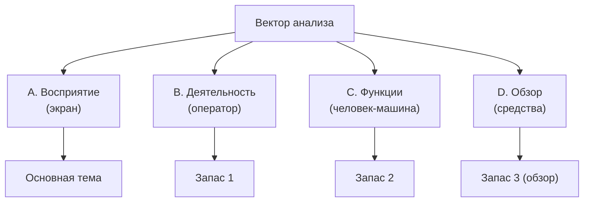

# Повторная консультация
**Студент:** Папин А.В., ИУ5Ц-31М

**Цель встречи:** получить конкретное задание и согласовать **вектор
анализа** (узкий выбор темы: на что смотрим)

---

## 1. Что требует преподаватель (по итогам консультаций)

- **Указать вектор анализа** — под каким углом смотрим на объект.
- **Узкий выбор темы** — не «робот вообще», а конкретный ракурс.
- **Понять, на что смотреть** — что именно анализируем и что оцениваем.
- Три вопроса: объект / где анализ / характеристики.
- Не смешивать эргономику (человек) и технику (робот).

---

## 2. Вектор анализа (основной)

**Вектор:** информационно-перцептивный — как информация о состоянии
робота доходит до оператора и воспринимается им.

| Что | Значение |
|---|---|
| Вектор | восприятие информации оператором |
| Узкий выбор | экран оператора в сценарии обнаружения аномалии |
| На что смотрим | критические параметры и форма их представления |
| Что оцениваем | полнота, своевременность, однозначность, нагрузка |
| Что НЕ смотрим | суставы, моменты, алгоритм походки (это техника) |

**Тема:** «Эргономическое обоснование информационной модели оператора
шагающего робота на основе анализа деятельности (на примере обнаружения
аномалий)».

**Критерии, метрики, значения (пример):**

| Критерий | Метрика | Пример значения |
|---|---|---|
| Полнота | доля критичных параметров в ИМ | 4 из 4 = 100% |
| Своевременность | задержка индикации аномалии | ≤ 0.5 с (проектно) |
| Однозначность | число трактовок показателя | 1 (нет двусмысленности) |
| Нагрузка | число одновременно отображаемых параметров | ≤ 5 |

*Метрики структурные/проектные — считаются по модели, а не измеряются на
людях.*

**Ключевая мысль:** обнаружение аномалии — в роботе, а эргономика
начинается там, где событие превращается в информацию для оператора.

---

## 3. Ответы на три вопроса

| Вопрос | Мой ответ |
|---|---|
| 1. Объект | Экран оператора (информационная модель) |
| 2. Где анализ | Вывод требований из деятельности + сравнение форм |
| 3. Характеристики | Полнота, своевременность, однозначность, нагрузка |

---

## 3a. Характеристики и параметры (основная тема A)

**Параметры** — что отображаем оператору (с приоритетом):

| Параметр | Что показывает | Приоритет |
|---|---|---|
| Высота корпуса | просадка/падение | критичный |
| Наклон (крен/дифферент) | риск опрокидывания | критичный |
| Контакты ног | потеря опоры | критичный |
| Отклонение от маршрута | уход с задания | важный |
| Скорость | темп движения | важный |
| Заряд батареи | ресурс | фоновый |

**Характеристики** — качества самой модели (с приоритетом):

| Характеристика | Что означает | Приоритет |
|---|---|---|
| Полнота | все критичные параметры присутствуют | высокий |
| Своевременность | аномалия видна до развития | высокий |
| Однозначность | сигнал читается однозначно | высокий |
| Нагрузка на внимание | минимум одновременно | средний |
| Помехозащищённость | «нет данных» ≠ «норма» | средний |

**Ключевой принцип приоритизации:** критичные параметры — всегда и
крупно; важные — постоянно, но компактно; фоновые — по запросу.

---

## 4. Пример: обнаружение аномалии по массиву

Ряд высоты корпуса (10 тактов):

`19 19 19 18 18 17 15 14 14 13`

- 19 — норма; 18–17 — ещё похоже на норму (простой порог не сработал бы);
- 15 → 13 — просадка видна **по массиву**, а не по одному значению.

Цепочка: массив → признак (тренд) → событие → индикация оператору.

---

## 5. Векторы анализа: выбор на встрече

| № | Вектор | На что смотрим | Возможная тема |
|---|---|---|---|
| **A** | Информационно-перцептивный | восприятие экрана оператором | ИМ оператора + обнаружение аномалий |
| B | Деятельностный | что делает оператор (алгоритм деятельности) | анализ деятельности оператора робота |
| C | Функциональный | распределение функций человек—машина | кто решает: оператор или робот |
| D | Обзорно-системный | средства отображения у операторов роботов | системный анализ интерфейсов (обзор) |

Основной — **A**. Запасные (если A не устроит) — B или C.

---

## 6. Запасной план: другая тема, другой вектор

**Запас B (деятельностный вектор).**
Тема: «Эргономический анализ деятельности оператора при управлении
шагающим роботом».
- Вектор: деятельность человека (что делает оператор).
- На что смотрим: алгоритм деятельности, этапы, точки принятия решений.
- Отличие от A: смотрим не на экран, а на самого человека.

**Запас C (функциональный вектор).**
Тема: «Распределение функций между человеком и машиной при управлении
шагающим роботом».
- Вектор: разделение труда человек—машина.
- На что смотрим: какие функции у оператора, какие у робота.
- Отличие от A: смотрим на границу ответственности.

**Запас D (обзорный вектор, вариант 2 методички).**
Тема: «Системный анализ средств отображения информации для операторов
мобильных роботов».
- Вектор: обзор существующих решений.
- На что смотрим: существующие интерфейсы и средства.
- Отличие: не исследование, а обзор + статья.

---

## 6a. Примеры по запасным векторам

### Пример к вектору B (деятельность оператора)

**Ситуация:** робот идёт по маршруту и проседает по высоте.

- **Объект:** деятельность оператора при управлении шагающим роботом.
- **Метод:** анализ деятельности (разбор этапов, описание алгоритма).
- **Анализ:** этапы цикла, где теряется время, где возможна ошибка.
- **Ключевая мысль:** эргономика — в структуре деятельности человека, а
  не в роботе.

Цикл деятельности оператора:

- **Пример вопроса:** «На каком этапе оператор теряет время?»
- **Пример вывода:** требования к экрану, чтобы этап «заметил» был быстрее.
- **Данные-пример:** журнал действий оператора (когда заметил, когда подал
  команду).
- **Что получаем:** таблицу этапов деятельности с узкими местами.

**Параметры** — этапы деятельности (с приоритетом):

| Параметр (этап) | Что означает | Приоритет |
|---|---|---|
| Восприятие («заметил») | оператор увидел аномалию | критичный |
| Оценка («опасно?») | понял степень угрозы | критичный |
| Решение («остановить?») | выбрал действие | важный |
| Командование («подал») | выполнил действие | важный |

**Характеристики** — качества деятельности (с приоритетом):

| Характеристика | Что означает | Метрика | Пример | Приоритет |
|---|---|---|---|---|
| Оперативность | быстрый переход между этапами | длительность этапа | 2 с | высокий |
| Безошибочность | нет ошибок на этапах | число ошибочных этапов | 0 | высокий |
| Минимум действий | нет лишних шагов | число действий до решения | 3 | средний |
| Нагрузка | сколько этапов под контролем | число этапов | 4 | средний |

### Пример к вектору C (распределение функций)

- **Объект:** система «человек—машина» (распределение функций).
- **Метод:** функциональный анализ (кто что выполняет).
- **Анализ:** какие функции у оператора, какие у робота, где передача.
- **Ключевая мысль:** эффективность зависит от верного распределения
  функций между человеком и машиной.

**Таблица функций при обнаружении аномалий:**

| Функция | Робот (автоматика) | Оператор |
|---|---|---|
| Обнаружить просадку | ✅ (по датчикам) | наблюдает |
| Оценить опасность | ⚠️ частично | ✅ решение |
| Стабилизировать корпус | ✅ | — |
| Аварийно остановить | ⚠️ порог | ✅ по кнопке |

- **Пример вопроса:** «Кто должен обнаруживать аномалию — система или
  оператор?»
- **Пример вывода:** матрица распределения функций человек—машина.
- **Данные-пример:** перечень функций и условий их передачи оператору.
- **Что получаем:** заполненную матрицу «функция × исполнитель».

**Параметры** — функции системы (с приоритетом):

| Параметр (функция) | Кто выполняет | Приоритет |
|---|---|---|
| Обнаружить аномалию | робот (по датчикам) | критичный |
| Оценить опасность | оператор | критичный |
| Стабилизировать корпус | робот | важный |
| Аварийно остановить | оператор (кнопка) | критичный |
| Информировать | интерфейс | важный |
| Контроль заряда | робот | фоновый |

**Характеристики** — качества распределения (с приоритетом):

| Характеристика | Что означает | Метрика | Пример | Приоритет |
|---|---|---|---|---|
| Автоматизация рутины | рутинные функции у машины | коэффициент автоматизации | 4 из 6 = 0.67 | высокий |
| Ответственность человека | решения в нештатных — за человеком | число решений оператора | 2 | высокий |
| Полнота распределения | все функции закреплены | всего функций | 6 | высокий |
| Прозрачность передачи | понятность точек передачи | число точек передачи | 2 | средний |

### Пример к вектору D (обзор средств отображения)

- **Объект:** средства отображения информации для операторов роботов.
- **Метод:** системный анализ / обзор (сравнение существующих решений).
- **Анализ:** какие интерфейсы есть, как классифицируются, чего не хватает.
- **Ключевая мысль:** обзор выявляет пробелы существующих решений и
  обосновывает требования к новым.

**Сравнение существующих интерфейсов:**

| Средство | Что показывает | Тревожная индикация |
|---|---|---|
| RViz (наш проект) | 3D-сцена, лидар, карта | нет явной |
| Штатная панель Unitree | режим, состояние | есть базовая |
| Интерфейсы Boston Dynamics | состояние, телеметрия | есть |
| Учебные дашборды | графики телеметрии | зависит |

- **Пример вопроса:** «Какие средства отображения существуют и как их
  классифицировать?»
- **Пример вывода:** обзор + статья (постановочная/обзорная).
- **Данные-пример:** описания из документации и публикаций.
- **Что получаем:** классификацию средств и таблицу пробелов.

**Параметры** — средства отображения (с приоритетом):

| Параметр (средство) | Что показывает | Приоритет |
|---|---|---|
| RViz (наш проект) | 3D-сцена, лидар, карта | базовое |
| Панель Unitree | режим, состояние | базовое |
| Интерфейсы Boston Dynamics | состояние, телеметрия | пример |
| Учебные дашборды | графики телеметрии | пример |

**Характеристики** — качества обзора (с приоритетом):

| Характеристика | Что означает | Метрика | Пример | Приоритет |
|---|---|---|---|---|
| Покрытие | охват классов средств | число средств | 4 | высокий |
| Критериальность | единые критерии сравнения | число критериев | 3 | высокий |
| Выявление пробелов | найдены недостатки | число пробелов | 2 из 4 | высокий |
| Актуальность | свежесть источников | доля источников ≤ 5 лет | ≥ 50% | средний |
