# Разбор консультации с Горячкиным Б.С. по теме КР: сужение объекта анализа

**Дата:** 2026-09-07
**Ветка:** `feat/isaam-research`
**Версия:** 1.0
**Дисциплина:** ЭА_СОиОИ (эргономика), МГТУ им. Н.Э. Баумана
**Источник:** расшифровка аудиозаписи консультации «Конса горячкин.docx»
**Научный руководитель:** Канев Антон Игоревич

---

## Содержание

1. [Резюме](#1-резюме)
2. [Участники и контекст](#2-участники-и-контекст)
3. [Реконструкция разговора](#3-реконструкция-разговора)
4. [Гипотеза проблемы](#4-гипотеза-проблемы)
5. [Три возможных объекта анализа](#5-три-возможных-объекта-анализа)
6. [Граница эргономики и техники](#6-граница-эргономики-и-техники)
7. [Понятие эффективности](#7-понятие-эффективности)
8. [Три вопроса, на которые нужен ответ](#8-три-вопроса-на-которые-нужен-ответ)
9. [Проблема научного доказательства](#9-проблема-научного-доказательства)
10. [Разбор текущей темы A2](#10-разбор-текущей-темы-a2)
11. [Варианты сужения темы](#11-варианты-сужения-темы)
12. [Целевая формулировка и структура](#12-целевая-формулировка-и-структура)
13. [Роль научного руководителя](#13-роль-научного-руководителя)
14. [План действий](#14-план-действий)
15. [Риски и митигации](#15-риски-и-митигации)
16. [Открытые вопросы](#16-открытые-вопросы)
17. [Связанные отчёты](#17-связанные-отчёты)
18. [Приложение A. Очищенные цитаты](#приложение-a-очищенные-цитаты)
19. [Приложение B. Глоссарий](#приложение-b-глоссарий)
20. [Приложение C. Карта соответствия замечаний](#приложение-c-карта-соответствия-замечаний)

---

## 1. Резюме

Консультация с преподавателем по эргономике Горячкиным Б.С. показала,
что предложенная тема курсовой работы (КР) — «Разработка и оценка
информационной модели состояния шагающего робота для
человека-оператора в контуре управления» — **выбрана в правильной
области, но сформулирована слишком широко**. Главное требование
преподавателя: **сузить объект анализа до одного конкретного** и
операционализировать понятие «эффективность».

Ключевые решения и выводы сведены в таблицу.

| № | Замечание Горячкина | Что это значит | Действие |
|---|---|---|---|
| 1 | Тема слишком широкая: «всё пространство анализировать не будем» | Нельзя анализировать «робота вообще» | Выбрать один объект анализа |
| 2 | Есть три возможных объекта: робот, оператор, экран оператора | Нужно осознанно выбрать один | Выбрать «экран оператора» (ИМ) |
| 3 | «Технические параметры — это уже не эргономика» | Убрать суставы/быстродействие из ядра работы | Оставить только информационные характеристики |
| 4 | «Эффективность — что это конкретно?» | Нужны критерии (задать без измерений) | Задать принципы: полнота, своевременность, однозначность |
| 5 | «Научно доказать, что тестируешь» | Нужен корректный метод без людей | Аналитическое обоснование (СДП) |
| 6 | Три вопроса: объект, где анализ, характеристики | Каркас постановки задачи | Ответить письменно на все три |
| 7 | «Посоветуйся с Антоном» | Привлечь научрука | Согласовать тему с Каневым А.И. (когда освободится) |
| 8 | Нет группы экспертов, нет ГОСТ на восприятие | «Оценка» и измерения невозможны | Перейти к «обоснованию» |

**Главная идея одной фразой:** взять не «состояние робота вообще», а
конкретный **экран оператора (информационную модель)** и **аналитически
обосновать**, каким должен быть состав и форма отображения информации,
чтобы оператор своевременно и однозначно обнаруживал аномалии — без
экспертов, измерений и опоры на отсутствующий ГОСТ.

---

## 2. Участники и контекст

### 2.1. Участники

| Роль | Персона | Что важно |
|---|---|---|
| Преподаватель по эргономике | Горячкин Б.С. | Требует конкретики, отвечает жёстко на защите, «спросит каждую детальку» |
| Научный руководитель диплома | Канев Антон Игоревич | Советует, к кому идти за советом; согласование темы диплома и КР |
| Студент | Папин Алексей Владимирович | Автор КР и дипломной работы |
| Ведущий специалист (упомянут) | не назван | Горячкин советует с ним посоветоваться по теме |

### 2.2. Контекст проекта

Дипломная работа (WalkingRobotSim) — система управления четвероногим
шагающим роботом Unitree Go2:

- контроллер походки на Rust, стек ROS2;
- симуляция в Isaac Sim / Isaac Lab и Gazebo;
- контур управления с человеком-оператором (RViz, целевые точки,
  телеметрия);
- информационные потоки: положение, ориентация, высота корпуса, углы
  суставов, контакты ног, скорость, заряд.

КР по эргономике (дисциплина ЭА_СОиОИ) выполняется по варианту 1
(аналитический путь) и должна быть связана с дипломом.

### 2.3. Хронология работы над темой

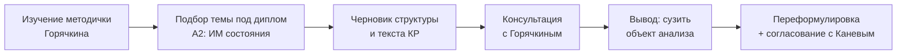

---

## 3. Реконструкция разговора

Расшифровка аудиозаписи имеет низкое качество (автоматическое
распознавание речи, много искажённых слов), поэтому ниже приведена
**реконструкция смысла**, а не дословный текст. Очищенные цитаты — в
[Приложении A](#приложение-a-очищенные-цитаты).

### 3.1. Общий ход разговора

Горячкин начинает с вопроса: что именно студент собирается
анализировать. Студент показывает черновики, но преподаватель говорит,
что «пока нечего показывать». Далее он объясняет проблему: информации
слишком много, и попытка объять «всё пространство» обречена — «сил не
хватит и времени не хватит».

Затем Горячкин предлагает три возможных объекта анализа (робот,
операторская деятельность, экран оператора) и требует выбрать один.
Подчёркивает, что технические параметры — не эргономика, а
информационные характеристики (восприятие информации человеком) — это
и есть эргономика.

Далее он требует определить, что такое «эффективность», конкретно и
измеримо, и научно доказать результат, а не тестировать «на бабушке,
дедушке, папе и маме». В конце советует посоветоваться с научным
руководителем и ведущим специалистом.

### 3.2. Логика замечаний Горячкина

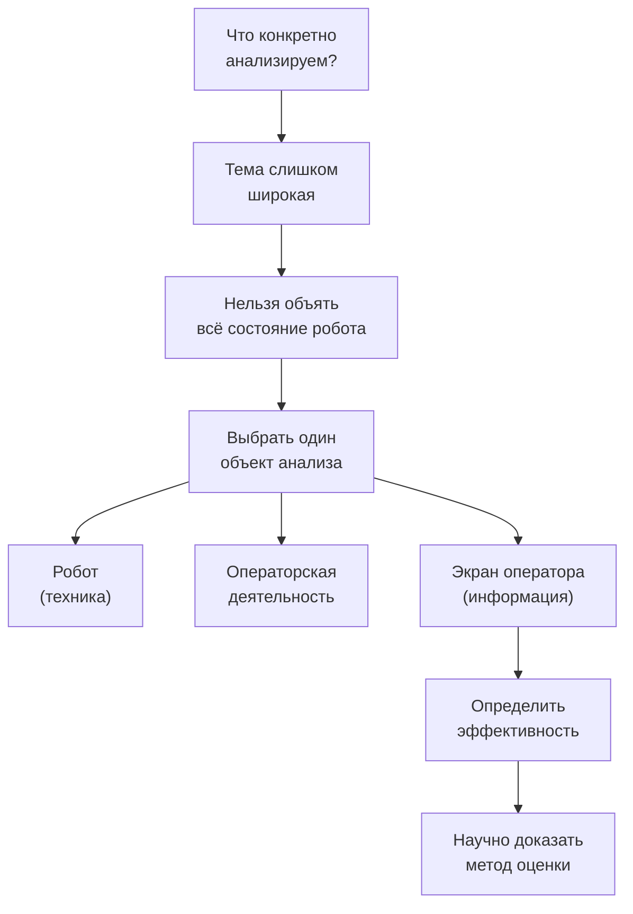

### 3.3. Эмоциональный фон и стиль

Разговор имеет характер жёсткой, но конструктивной критики. Горячкин
несколько раз повторяет, что «работа не тривиальна», «просто так ура-ура
не получится», и предупреждает, что на защите «спросит каждую детальку
и почему так, а не иначе». При этом он прямо помогает: сам предлагает
варианты, подсказывает направления, называет три вопроса-каркаса.

Это означает: **критика относится к формулировке, а не к выбору
области**. Направление (информационная модель оператора) принято, но
требует сужения и операционализации.

---

## 4. Гипотеза проблемы

### 4.1. Формулировка проблемы

**Проблема не в том, что тема неверна, а в том, что она не
операционализирована.** Текущая формулировка «Разработка и оценка
информационной модели состояния шагающего робота» допускает трактовку
«проанализировать всё состояние робота», что:

- не имеет границ (12 суставов, ориентация, скорость, контакты, заряд,
  траектория — бесконечное множество параметров);
- смешивает эргономику (восприятие человеком) с техникой (параметры
  машины);
- не задаёт, что именно и как оценивается;
- не определяет, что такое «эффективность» и как её измерить.

### 4.2. Гипотеза в виде утверждений «если → то»

| Если | То |
|---|---|
| Если объект анализа — «состояние робота вообще» | То работа не имеет границ и будет отклонена |
| Если оставить технические параметры в ядре | То это перестанет быть эргономикой |
| Если не определить «эффективность» измеримо | То оценка будет недоказуемой |
| Если выбрать один объект (экран оператора) | То появляется чёткая граница исследования |
| Если задать критерии восприятия | То эффективность становится измеримой |
| Если предложить метод оценки | То результат можно научно доказать |

### 4.3. Симптом ↔ причина

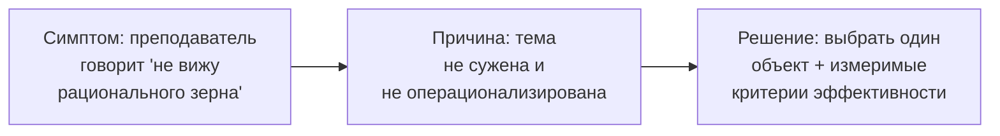

---

## 5. Три возможных объекта анализа

Горячкин прямо перечислил три объекта, которые можно анализировать.
Разберём каждый.

### 5.1. Объект 1 — робот (технические характеристики)

Что это: анализ самого робота как технической системы — «разложить
робота на мелкие части», оценить быстродействие каждого звена, найти,
«где плохо работает, какое звено слабое».

Плюсы:

- опирается на реальные данные симуляции и телеметрии;
- «робота можно разобрать» — есть что измерять.

Минусы (по Горячкину):

- **это не эргономика**, а техника/техническая диагностика;
- «технические параметры называешь — это уже не эргономика»;
- не про человека и его восприятие.

Вердикт: **не подходит** для КР по эргономике (но может быть частью
диплома по технической части).

### 5.2. Объект 2 — операторская деятельность

Что это: анализ того, что **должен делать оператор**, чтобы эффективно
управлять роботом. «Мы не трогаем робота — робот чёрный ящик, а
анализируем оператора».

Плюсы:

- это ядро эргономики (деятельность человека);
- согласуется с системно-деятельностным подходом из методички;
- позволяет вывести требования к информации «от деятельности».

Минусы:

- без привязки к конкретному средству отображения рискует стать
  абстрактной психологией труда;
- сложнее оценить измеримо без эксперимента с людьми.

Вердикт: **подходит**, но требует конкретизации средства.

### 5.3. Объект 3 — экран оператора (информационная модель)

Что это: анализ того, **какая информация и в каком виде** предъявляется
оператору на экране. «Информация о 12 суставах — как она представлена,
в каком виде, что оператор не успевает обработать».

Плюсы:

- прямое попадание в эргономику (восприятие информации);
- «это твоё железно» — по словам Горячкина;
- есть конкретный артефакт (экран/панель/RViz), который можно оценивать;
- связано с реальным проектом (панель оператора в дипломе).

Минусы:

- нужно чётко определить, что считается «экраном» в проекте;
- нужно задать измеримые критерии.

Вердикт: **рекомендуется** как основной объект.

### 5.4. Сравнительная таблица объектов

| Критерий | Робот (техника) | Оператор (деятельность) | Экран (информация) |
|---|---|---|---|
| Относится к эргономике | ❌ нет | ✅ да | ✅ да |
| Есть конкретный артефакт | ✅ робот | ⚠️ процесс | ✅ экран/ИМ |
| Измеримость | ✅ техническая | ⚠️ психофизическая | ✅ восприятие |
| Связь с дипломом | ✅ | ✅ | ✅✅ |
| Вердикт Горячкина | ❌ | ✅ | ✅ «железно» |

### 5.5. Схема выбора

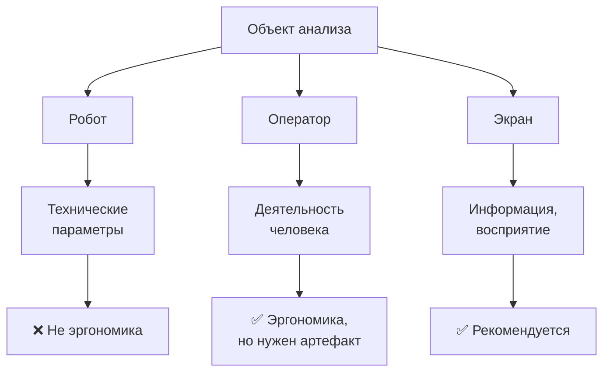

### 5.6. Сценарии деятельности оператора

Чтобы выбранный объект (экран) не «повис в воздухе», его нужно связать
с реальными сценариями деятельности оператора. Ниже — сценарии,
которые рассматриваются в дипломе и которые задают, **какую именно
информацию** оператор должен получать с экрана.

| Сценарий | Что делает оператор | Какая информация нужна | Критичность |
|---|---|---|---|
| Запуск движения | задаёт режим и цель | текущий режим, готовность | высокая |
| Штатная ходьба | наблюдает за движением | положение, скорость, маршрут | средняя |
| Движение по маршруту | контролирует отклонение | отклонение от траектории | высокая |
| Обнаружение препятствия | оценивает обстановку | данные лидара/камеры | высокая |
| Просадка корпуса | замечает снижение высоты | высота корпуса, тренд | критичная |
| Потеря опоры | замечает потерю контакта | контакты ног | критичная |
| Риск опрокидывания | оценивает устойчивость | наклон, крен, дифферент | критичная |
| Аварийная остановка | принимает решение | сводное состояние | критичная |

Эта таблица — заготовка для раздела «анализ деятельности оператора».
Она показывает, что не все параметры равнозначны: одни нужны постоянно
и крупно, другие — фоново. Это и есть основание для приоритизации
информационной модели.

### 5.7. Почему «робот» и «оператор» вместе не работают

Может возникнуть соблазн объединить объекты: «проанализирую и робота, и
оператора». Горячкин явно против: «не надо всё в одну кучу». Причины:

- разная природа анализа (технический vs эргономический);
- разный инструментарий (измерения vs оценки восприятия);
- размывается предмет и цель работы;
- на защите невозможно чётко ответить на вопрос «что вы анализируете?».

Поэтому выбирается **один** объект — экран оператора, а данные робота
используются лишь как источник информации для этого экрана.

---

## 6. Граница эргономики и техники

### 6.1. Ключевой водораздел

Горячкин проводит чёткую границу:

- **Эргономика** — про человека: как он воспринимает информацию, как
  быстро и точно считывает, какова нагрузка на внимание, успевает ли
  обработать.
- **Техника** — про машину: суставы, быстродействие звеньев, моменты,
  точность позиционирования, качество ходьбы.

Цитата-ориентир: «Технические параметры называешь — это уже не
эргономика. Информационные характеристики называешь — вот это твоё
железно».

### 6.2. Что относится к каждому полюсу

| Аспект | Эргономика (наше) | Техника (не наше) |
|---|---|---|
| 12 суставов | как показать их состояние оператору | углы, моменты, точность |
| Высота корпуса | читаемость индикатора высоты | физика опоры |
| Скорость | скорость восприятия показателя | реальная скорость робота |
| Контакты ног | наглядность индикации | сила контакта, трение |
| Походка | как оператор понимает режим | алгоритм TROT/CRAWL |
| Ошибки | как оператор замечает аномалию | код ошибки контроллера |

### 6.3. Диаграмма разделения

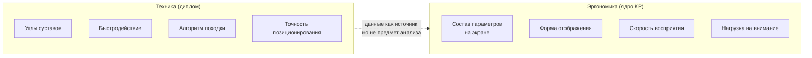

### 6.4. Практический вывод

Технические данные робота (телеметрия) нужны как **источник
информации**, которую мы показываем оператору. Но **предметом анализа**
является не сама телеметрия, а её **представление человеку** и
**восприятие** им.

### 6.5. Информационные потоки как сырьё для ИМ

Ниже — перечень информационных потоков проекта, которые могут быть
источником для информационной модели. Важно: это **сырьё**, а не
предмет эргономического анализа.

| Поток | Содержание | Возможное применение в ИМ |
|---|---|---|
| Состояние суставов | углы 12 суставов | фоновый индикатор |
| Ориентация | крен, дифферент, курс | индикатор устойчивости |
| Высота корпуса | вертикальное положение | график тренда |
| Контакты ног | касание опоры | схема опоры |
| Одометрия | положение, скорость | положение на карте |
| Заряд | остаток питания | фоновый индикатор |
| Лидар | облако точек | карта окружения |
| Камера | изображение | контекст обстановки |

### 6.6. От сырья к модели: три шага

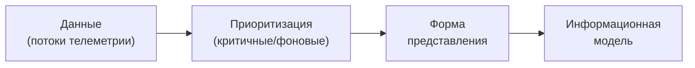

Первый шаг — технический (сбор данных). Второй и третий — предмет
эргономики. Горячкин требует, чтобы работа была про шаги 2–3, а не про
шаг 1.

### 6.7. Типичные ошибки формулировки темы

| Ошибка | Пример | Почему плохо |
|---|---|---|
| Слишком широко | «анализ состояния робота» | нет границ |
| Смешение областей | «оптимизация походки и интерфейса» | техника + эргономика |
| Нет объекта | «повышение эффективности управления» | неясно, что оцениваем |
| Нет критерия | «улучшение интерфейса» | недоказуемо |
| Две задачи | «разработка и оценка и внедрение» | размывается цель |

### 6.8. Как выглядит правильная формулировка

Правильная формулировка темы КР по эргономике должна содержать:

1. **объект** — что именно оценивается (информационная модель);
2. **предмет/аспект** — что в нём анализируется (критичные параметры,
   формы представления);
3. **субъект** — для кого (человек-оператор);
4. **метод/критерий** — как оценивается (по критериям восприятия).

Пример-шаблон: «Эргономическая оценка [объект] для [субъект] по
критериям [критерии]». Наша целевая формулировка следует этому шаблону.

---

## 7. Понятие эффективности

### 7.1. Почему это критично

Горячкин несколько раз спрашивает: «Что есть эффективность? Я спрошу
эффективность — это что?» Без чёткого определения понятия оценка
превращается в декларацию.

### 7.2. Что такое эффективность в эргономике

Эффективность системы «человек — машина» — это степень достижения цели
деятельности при заданных затратах ресурсов человека. В контексте
информационной модели это означает: **насколько быстро и точно оператор
воспринимает нужную информацию и принимает решение**.

### 7.3. Критерии (как принципы, без измерений)

Раз ГОСТ на скорость восприятия отсутствует и группы экспертов нет,
критерии выступают не как измеряемые величины, а как **проектные
принципы** — требования, которым должна соответствовать модель.

| Принцип | Что означает | Как проверяется (без людей) |
|---|---|---|
| Полнота | все нужные для решения параметры есть | сопоставление с деятельностью |
| Своевременность | аномалия видна до развития | анализ по массивам данных |
| Однозначность | параметр читается однозначно | разбор по литературе |
| Нагрузка на внимание | минимум одновременно | подсчёт числа параметров |
| Помехозащищённость | «нет данных» ≠ «норма» | разбор сценариев |

### 7.4. Схема связи «эффективность → принцип»

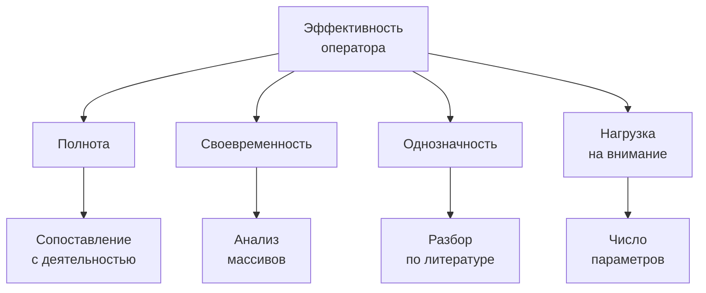

### 7.5. Рабочее определение для КР

**Эффективность информационной модели** — это свойство модели
обеспечивать оператору полноту, своевременность и однозначность
восприятия критичных параметров и обнаружения аномалий при минимуме
нагрузки на внимание.

Это определение:
- относится к человеку (эргономика);
- **не требует измерений** (принципы, а не метрики);
- привязано к конкретному артефакту (ИМ);
- не требует анализа техники робота.

---

## 8. Три вопроса, на которые нужен ответ

Горячкин сформулировал три вопроса-каркаса, на которые работа должна
дать явный ответ. Это фактически структура постановки задачи.

### 8.1. Вопрос 1 — объект

**Что именно анализируем?** Объект, процесс или явление восприятия.
Ответ: экран оператора (информационная модель состояния робота).

### 8.2. Вопрос 2 — где анализ

**Где здесь анализ?** Что именно исследуется. Ответ: вывод требований к
экрану из деятельности оператора и сопоставление форм представления с
этими требованиями.

### 8.3. Вопрос 3 — характеристики

**Какие конкретные характеристики?** Не «всё состояние», а конкретный
набор. Ответ: принципы полноты, своевременности, однозначности, нагрузки
(см. [7.3](#73-критерии-как-принципы-без-измерений)).

### 8.4. Карта трёх вопросов

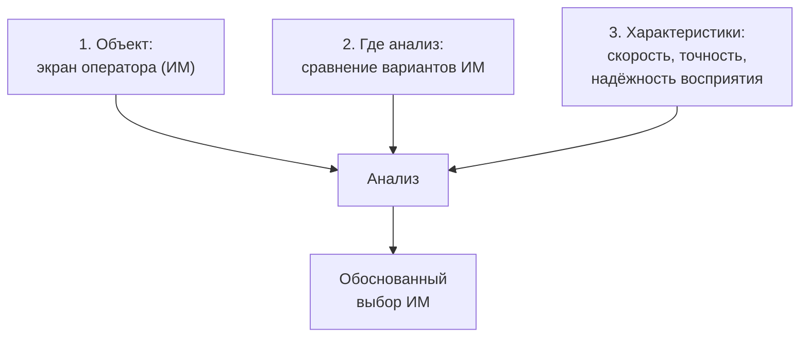

### 8.5. Чек-лист ответов

- [ ] Объект назван одним термином и не допускает расширения
- [ ] Указано, что с чем сравнивается
- [ ] Перечислены измеримые характеристики
- [ ] Каждая характеристика имеет единицу измерения
- [ ] Понятно, откуда берутся данные для оценки

---

## 9. Проблема научного доказательства

### 9.1. Требование Горячкина

«Ты должен научно доказать, что ты будешь тестировать». При этом
профессиональное тестирование (с реальными операторами-профессионалами)
недоступно. Тестировать «на бабушке, дедушке, папе и маме» — не
принимается.

### 9.2. Доступные методы доказательства

| Метод | Суть | Применимость | Ограничение |
|---|---|---|---|
| Метод экспертных оценок | группа оценивает варианты | ❌ недоступен (нет группы) | нужна группа, согласованность |
| Нормы/ГОСТ | опора на норматив | ❌ недоступны для восприятия | нет ГОСТ на скорость восприятия |
| **Анализ литературы** | опора на принципы эргономики | ✅ высокая | нет своего эксперимента |
| **Аналитическое обоснование (СДП)** | вывод требований из деятельности | ✅ высокая | нужна строгая методология |
| Замер на записи | оценка по логам | ⚠️ средняя | без живого оператора |
| Пилотный эксперимент | малая выборка | ❌ недоступен | нет операторов |

### 9.3. Рекомендуемый подход

**Аналитическое обоснование**: вывод требований к информационной модели
из анализа деятельности оператора (системно-деятельностный подход) с
опорой на принципы эргономики из литературы. Иллюстрация — на реальных
данных симуляции (массивы телеметрии, см. [12.6](#126-как-мы-обнаруживаем-аномалию)).

Метод экспертных оценок **исключён**: группа экспертов не создаётся и
не собирается. Измерение скорости восприятия **исключено**: ГОСТ на неё
не существует, а без норматива измерение недоказуемо.

### 9.4. Схема доказательства

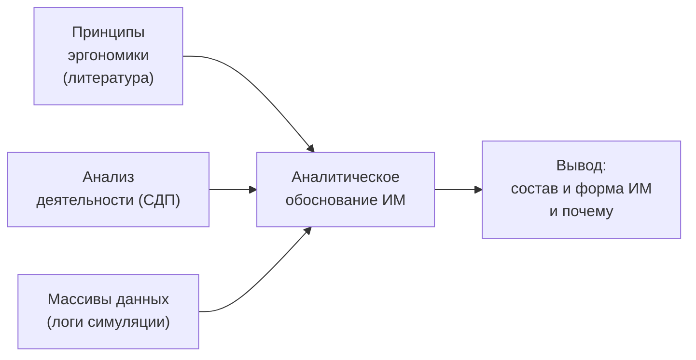

### 9.5. Честная оценка риска

Слабое место здесь — не «репрезентативность группы» (группы нет), а
**убедительность аналитического вывода**: нужно показать, что
требования выведены из деятельности строго, а не произвольно. Поэтому
важно описать метод (деятельность → информационные потребности →
требования) пошагово и подкреплять каждый шаг ссылками на литературу.

### 9.6. Методика аналитического обоснования (вместо экспертов)

Поскольку метод экспертных оценок исключён, его место занимает
**аналитическая процедура** вывода требований.

**Шаг 1. Модель деятельности.** Описать, что оператор делает: цель,
последовательность действий, условия.

**Шаг 2. Информационные потребности.** Для каждого действия определить,
какая информация нужна для его выполнения.

**Шаг 3. Приоритизация.** Разделить параметры на критичные и фоновые по
влиянию на решение.

**Шаг 4. Требования к ИМ.** Сформулировать принципы отображения
(полнота, своевременность, однозначность, минимум нагрузки).

**Шаг 5. Проверка вариантов.** Сопоставить формы представления с
требованиями (соответствует / не соответствует).

**Шаг 6. Вывод.** Обосновать рекомендуемый вариант как наиболее
соответствующий требованиям.

### 9.7. Что даёт выбранный метод

| Метод | Что подтверждает | Что не подтверждает |
|---|---|---|
| Принципы эргономики | соответствие известным требованиям | количественное превосходство |
| Анализ деятельности (СДП) | обоснованность состава ИМ | реакцию живого человека |
| Массивы данных | выявляемость аномалии | скорость восприятия |
| Аналитическое обоснование | строгость вывода | полноценный эксперимент |

### 9.8. План аналитического обоснования (черновик)

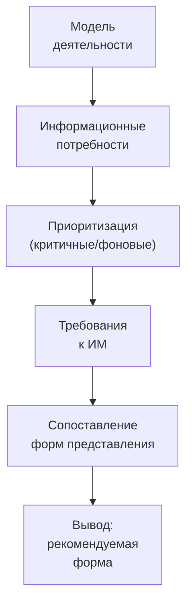

### 9.9. Пример обоснования (иллюстративный)

Пусть есть три формы представления и четыре принципа (полнота,
своевременность, однозначность, нагрузка). Сопоставим их:

| Форма | Полнота | Своевременность | Однозначность | Нагрузка | Итог |
|---|---|---|---|---|---|
| Числовая панель | ✅ | ⚠️ | ⚠️ | ❌ высокая | частично |
| Графическая | ✅ | ✅ | ⚠️ | ✅ | хорошо |
| Комбинированная | ✅ | ✅ | ✅ | ✅ | лучший |

Такой результат даёт основание рекомендовать комбинированную форму.
Отметки условны и будут наполнены обоснованием из литературы.

---

## 10. Разбор текущей темы A2

### 10.1. Текущая формулировка

«Разработка и оценка информационной модели состояния шагающего робота
для человека-оператора в контуре управления».

### 10.2. Что соответствует замечаниям

| Элемент темы | Соответствует | Комментарий |
|---|---|---|
| «информационная модель» | ✅ | попадает в объект 3 (экран) |
| «человек-оператор» | ✅ | про человека, не про технику |
| «контур управления» | ✅ | контекст деятельности |
| «шагающий робот» | ✅ | источник данных |

### 10.3. Что противоречит замечаниям

| Элемент темы | Проблема | Что делать |
|---|---|---|
| «состояния робота» | слишком широко | сузить до критичных параметров |
| «разработка и оценка» | две задачи + метод «оценка» | перейти к «обоснованию» |
| нет критериев | недоказуемо | задать принципы соответствия |
| нет границ | «всё состояние» | задать перечень параметров |
| «оценка» подразумевает экспертов | группы нет | аналитический метод |

### 10.4. Вердикт

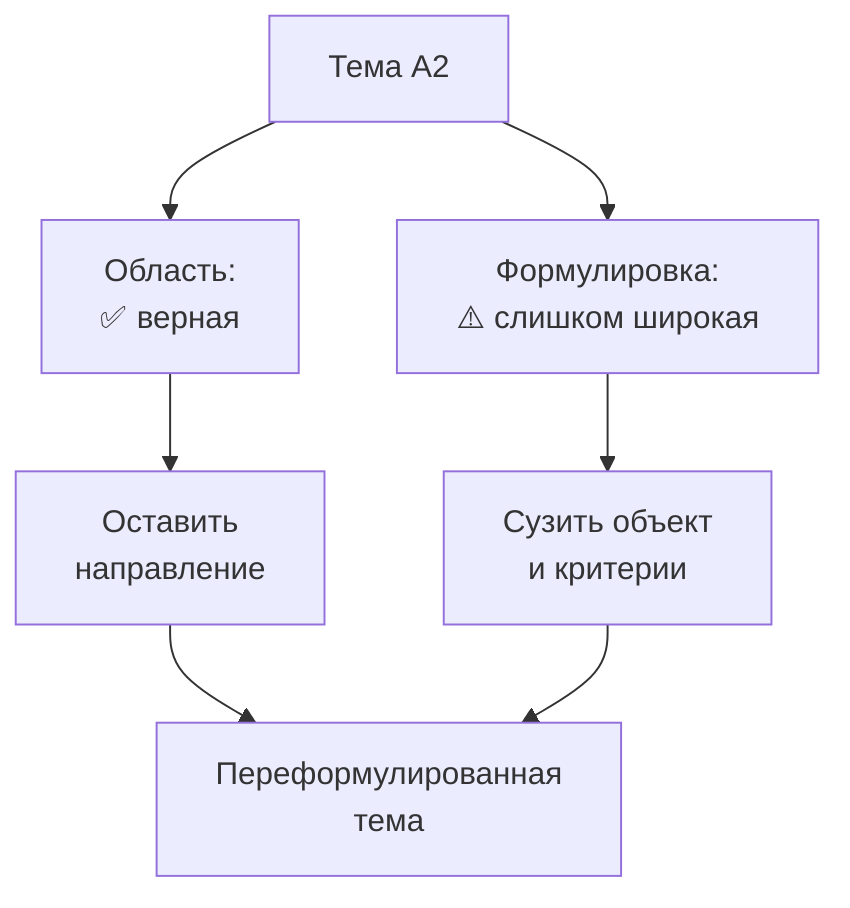

**Вывод:** направление сохраняем, формулировку сужаем.

---

## 11. Варианты сужения темы

### 11.1. Вариант 1 — сузить до критичных параметров

«Эргономическая оценка информационной модели критичных параметров
состояния шагающего робота для оператора».

- Объект: ИМ критичных параметров (устойчивость, высота, контакты).
- Анализ: сравнение вариантов отображения.
- Характеристики: время и точность считывания.

Плюс: чёткая граница. Минус: нужно обосновать выбор «критичных».

### 11.2. Вариант 2 — сузить до задачи обнаружения аномалий

«Оценка информационной модели оператора шагающего робота по критерию
своевременного обнаружения аномалий».

- Объект: ИМ в сценарии аномалии.
- Анализ: время обнаружения отклонения.
- Характеристики: время реакции, доля пропусков.

Плюс: очень измеримо. Минус: узкий сценарий.

### 11.3. Вариант 3 — сузить до сравнения форм представления

«Сравнительная эргономическая оценка форм представления телеметрии
шагающего робота оператору».

- Объект: формы представления (числа, графика, 3D).
- Анализ: сравнение форм по критериям.
- Характеристики: скорость, точность, нагрузка.

Плюс: хорошо ложится на метод сравнения. Минус: нужны варианты.

### 11.4. Сравнительная таблица вариантов

| Критерий | В1 (критичные) | В2 (аномалии) | В3 (формы) |
|---|---|---|---|
| Чёткость границ | ✅ | ✅✅ | ✅ |
| Проверяемость без людей | ✅ | ✅ | ✅ |
| Связь с дипломом | ✅✅ | ✅ | ✅✅ |
| Простота метода | ✅ | ✅ | ✅✅ |
| Риск на защите | средний | низкий | средний |

### 11.5. Рекомендуемый вариант

С учётом ограничений (нет группы экспертов, нет ГОСТ) рекомендуемая
формулировка объединяет В1 и В2: **эргономическое обоснование
информационной модели критичных параметров шагающего робота на основе
анализа деятельности, на примере обнаружения аномалий**. Объект —
экран оператора; метод — аналитический (СДП); сценарий — обнаружение
аномалии по массивам данных.

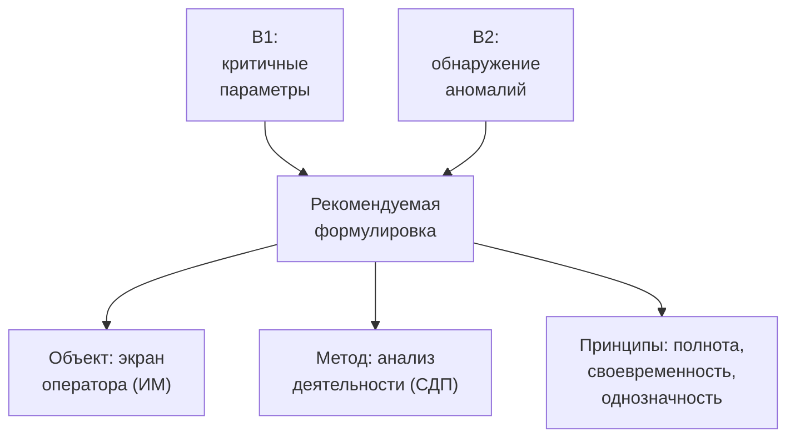

---

## 12. Целевая формулировка и структура

### 12.1. Целевая формулировка темы

С учётом двух ограничений — **нет группы экспертов** и **нет ГОСТ на
скорость восприятия зрением** — тема переосмыслена с «оценки» на
«обоснование»:

> **Эргономическое обоснование информационной модели оператора
> шагающего робота на основе анализа деятельности (на примере
> обнаружения аномалий)**

### 12.2. Постановка задачи (три вопроса)

| Вопрос | Ответ |
|---|---|
| Объект | Экран оператора (информационная модель) |
| Где анализ | Вывод требований из деятельности оператора (СДП) + сравнение форм представления |
| Характеристики | Принципы: полнота, своевременность, однозначность, минимум нагрузки |

### 12.2.1. Сравнение трёх формулировок темы

Тема прошла три итерации. Ниже — чем отличается каждая.

| Ось | 1. Исходная (A2) | 2. Промежуточная (после Горячкина) | 3. Новая (сейчас) |
|---|---|---|---|
| Формулировка | «Разработка и **оценка** ИМ **состояния робота** для оператора» | «Эргономическая **оценка** ИМ **критичных параметров**: сравнение форм» | «Эргономическое **обоснование** ИМ оператора **на основе анализа деятельности**» |
| Глагол-ядро | разработка + оценка | оценка | **обоснование** |
| Объект | состояние робота вообще | критичные параметры | **деятельность оператора** |
| Метод | не задан | экспертные оценки | **аналитический (СДП)** |
| Эксперты | предполагались | обязательны | **отсутствуют** |
| Измерения | не заданы | время/точность (нужен ГОСТ) | **не измеряем** |
| Выполнимость | низкая (нет границ) | низкая (нет группы/ГОСТ) | **высокая** |

**Отличие 1 → 2:** сузили объект (убрали «состояние робота вообще»,
добавили «критичные параметры» и сравнение форм), но сохранили опору на
экспертную оценку.

**Отличие 2 → 3:** сменили метод — вместо «оценки» (измерение/сравнение
с участием людей) взяли «обоснование» (вывод требований из деятельности,
без людей); движемся **от деятельности оператора**, а не «от экрана».

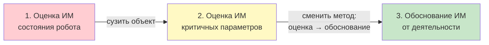

### 12.3. Структура работы

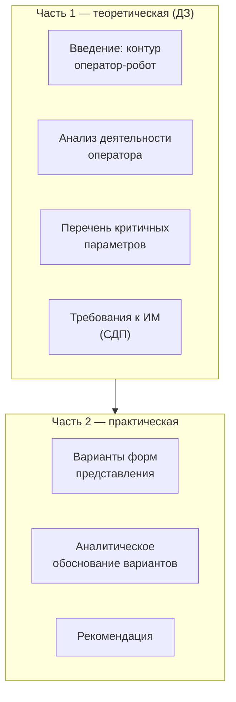

### 12.4. Критичные параметры (предварительно)

| Параметр | Почему критичен | Источник |
|---|---|---|
| Устойчивость (наклон) | риск опрокидывания | IMU |
| Высота корпуса | риск падения/просадки | одометрия |
| Контакты ног | потеря опоры | foot_contact |
| Отклонение от задания | уход с маршрута | одометрия |

### 12.5. Формы представления (варианты сравнения)

| Форма | Описание | Ожидаемый плюс |
|---|---|---|
| Числовая панель | таблица значений | точность |
| Графическая | графики трендов | динамика |
| Пространственная | 3D-сцена с маркерами | наглядность |
| Комбинированная | панель + сцена | баланс |

### 12.6. Как мы обнаруживаем аномалию

Аномалия — это отклонение поведения робота от нормы. Обнаружить её
можно **не по одному значению, а по массиву данных** (временному ряду):
нормальное поведение — это устойчивый «коридор», а аномалия — выход из
него. Ниже — три способа, от простого к более сложному.

**Способ 1. Порог (мгновенное значение).**
Берём один параметр и сравниваем с допустимой границей. Например, если
высота корпуса опустилась ниже допустимой — это аномалия.

**Способ 2. Коридор (диапазон).**
Нормальное значение колеблется в пределах коридора. Выход за коридор —
аномалия. Коридор строится по массиву: по среднему и разбросу.

**Способ 3. Отклонение от массива (тренд, скорость изменения).**
Смотрим на **ряд** значений и его динамику. Даже если каждое отдельное
значение ещё в допуске, но массив показывает устойчивое движение к
границе или резкий скачок — это аномалия. Так ловятся просадки и дрейф
раньше, чем сработает простой порог.

### 12.6.1. Пример от массива данных

Пусть на каждом такте записывается **массив высоты корпуса** (условно,
10 отсчётов подряд):

| Такт | 1 | 2 | 3 | 4 | 5 | 6 | 7 | 8 | 9 | 10 |
|---|---|---|---|---|---|---|---|---|---|---|
| Высота (усл. ед.) | 19 | 19 | 19 | 18 | 18 | 17 | 15 | 14 | 14 | 13 |

Как читать этот массив:

- **первые три значения** — устойчивая норма (19);
- **затем медленное снижение** (18 → 17) — ещё похоже на норму, порог
  не сработал бы;
- **далее резкое падение** (15 → 14 → 13) — очевидная просадка.

Вывод: аномалия видна **на массиве**, а не на одном значении. Оператору
нельзя показывать сырой массив — его нужно превратить в понятный
**признак** и событие.

### 12.6.2. Превращение массива в событие

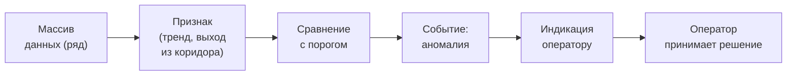

Ключевой эргономический момент: **от массива к однозначному сигналу**.
Сырые данные (десятки чисел в секунду) оператор обработать не может —
нужна индикация, которая сразу показывает «норма / внимание / авария».

### 12.6.3. Пример по каждому критичному параметру

| Параметр | Как формируется признак из массива | Что видит оператор |
|---|---|---|
| Высота корпуса | снижение ряда ниже коридора | индикатор «просадка» + тренд |
| Контакты ног | отсутствие контакта в ряду тактов | мигающий индикатор опоры |
| Наклон (устойчивость) | рост крена/дифферента к границе | тревожный цвет зоны риска |
| Отклонение от маршрута | накопление отклонения по ряду | смещение метки от цели |
| Потеря связи | пропуск данных в ряду | отдельный индикатор «нет данных» |

Так работа переходит от «массива информации» к **эргономически
осмысленному событию**, с которым оператор может работать.

### 12.6.4. Связь с эргономикой

Обнаружение аномалии технически происходит в роботе. Но **эргономика —
на последнем шаге**: как из массива сделать сигнал, который оператор
своевременно и безошибочно воспримет. Именно этот шаг и является
предметом КР.

---

## 13. Роль научного руководителя

### 13.1. Кто такой Канев Антон Игоревич

Канев Антон Игоревич — научный руководитель дипломной работы. Горячкин
несколько раз советует «посоветоваться с Антоном». Однако на текущий
момент научрук занят (первый курс магистратуры и выпускная работа
бакалавра), поэтому **работа ведётся самостоятельно**, а согласование
отложено.

### 13.2. Что желательно согласовать с Каневым (когда освободится)

| Вопрос | Зачем |
|---|---|
| Суженная формулировка темы | чтобы КР и диплом не расходились |
| Перечень критичных параметров | опора на реальные данные диплома |
| Доступные данные телеметрии | источник для анализа |
| Требования к интерфейсу оператора | связь с реальным дипломом |
| Метод обоснования | научрук оценит корректность |

### 13.3. Схема работы (без ожидания научрука)

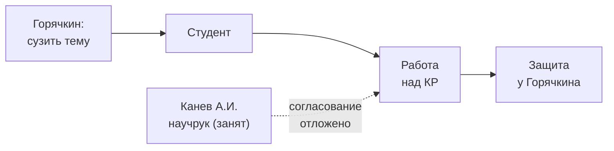

---

## 14. План действий

### 14.1. Ближайшие шаги

| № | Действие | Результат | Срок |
|---|---|---|---|
| 1 | Свести замечания в список | этот отчёт | сделан |
| 2 | Выбрать суженную формулировку | вариант темы | 1-2 дня |
| 3 | Определить критичные параметры | перечень | неделя |
| 4 | Продумать метод обоснования | методика | 2 недели |
| 5 | Подготовить постановку (3 вопроса) | текст | 2 недели |
| 6 | Согласовать с Каневым А.И. (когда освободится) | одобренная тема | позже |

### 14.2. Среднесрочные шаги

| № | Действие | Результат |
|---|---|---|
| 7 | Собрать данные телеметрии | логи для анализа |
| 8 | Сделать варианты форм | прототипы/описания |
| 9 | Провести аналитическое обоснование | результаты |
| 10 | Оформить РПЗ | черновик КР |

### 14.3. Диаграмма плана

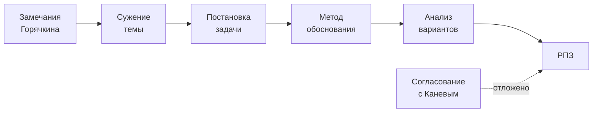

---

## 15. Риски и митигации

| Риск | Вероятность | Влияние | Митигация |
|---|---|---|---|
| Тема всё ещё покажется широкой | средняя | высокое | чёткая постановка + письмо Горячкину |
| Аналитический метод сочтут недоказательным | средняя | высокое | строгая методология + опора на литературу |
| Нет реального интерфейса оператора | средняя | среднее | использовать RViz как прототип |
| Формулировка аномалии окажется технической | средняя | среднее | акцент на представлении, не на детекторе |
| Данные телеметрии неполные | низкая | среднее | зафиксировать логи заранее |
| Расхождение КР и диплома | средняя | высокое | согласовать с научруком позже |

### 15.1. Дерево рисков

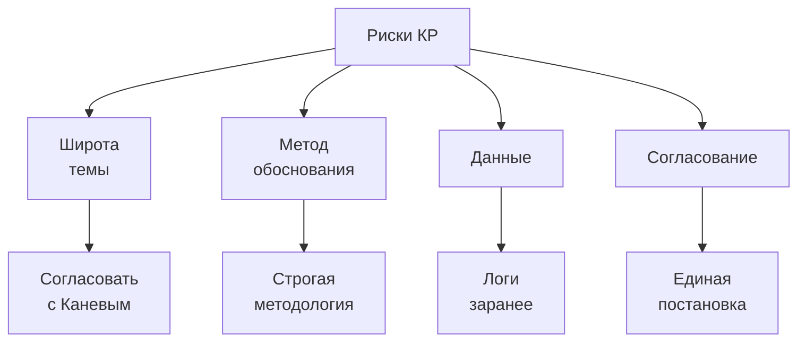

---

## 16. Открытые вопросы

1. Какую из суженных формулировок предпочтёт Канев А.И.?
2. Достаточно ли аналитического обоснования (СДП) без экспертной группы
   и без измерений?
3. Считать ли RViz «экраном оператора» для целей КР?
4. Нужны ли отдельные прототипы форм представления или достаточно
   описания?
5. Примет ли Горячкин метод без группы экспертов и без ГОСТ?
6. Требуется ли публикация по КР (вариант 1 методички)?
7. Какой набор аномалий считать достаточным для примера?

---

## 17. Связанные отчёты

| Файл | О чём |
|---|---|
| `docs/ergonomics-methodology/kr-ergonomics-methodology.md` | конспект методички Горячкина |
| `docs/ergonomics-methodology/topics.md` | список тем под проект |
| `docs/ergonomics-methodology/a2-structure.md` | структура КР по теме A2 |
| `docs/ergonomics-methodology/a2-draft.md` | черновик текста КР |
| `docs/ergonomics-methodology/a2-essence.md` | суть и польза темы A2 |
| `docs/ergonomics-methodology/risks-and-recommendation.md` | риски и рекомендации |
| `reports/isaam/2026-08-22_simulation-issues-report.md` | проблемы симуляции |
| `.agents/skills/architecture-report/SKILL.md` | формат этого отчёта |

---

## Приложение A. Очищенные цитаты

Ниже — фрагменты разговора, приведённые к читаемому виду (смысл
сохранён, слова-артефакты распознавания убраны).

### A.1. О широте темы

> «Мы не будем анализировать всё пространство — сил не хватит и времени
> не хватит. Надо определиться, что конкретно.»

> «Не надо всё в одну кучу. Надо продумать, что ты будешь
> анализировать.»

### A.2. О трёх объектах

> «Первое — мы можем анализировать робота. Второе — мы можем
> анализировать операторскую деятельность. Третье — мы можем
> анализировать экран оператора.»

### A.3. О границе эргономики

> «Технические параметры называешь — это уже не эргономика.
> Информационные характеристики называешь — вот это твоё железно.»

### A.4. Об эффективности

> «Эффективность — это что? Это что, вообще? Понимать конкретнее.
> Какие критерии эффективности? Например, скорость восприятия.»

### A.5. О доказательстве

> «Ты должен научно доказать, что ты будешь тестировать. Просто на
> бабушке, дедушке, папе и маме — конечно, нет.»

### A.6. Три вопроса

> «Первый вопрос — объект: главный объект, или процесс, или явление
> восприятия. Второй вопрос — где здесь анализ? Третий вопрос —
> определить конкретные характеристики.»

### A.7. О защите

> «Я у тебя спрошу каждую детальку и спрошу, почему так, а не иначе, и
> ты должен ответить, почему только так.»

### A.8. О научруке

> «Посоветуйся с Антоном. Он к этому подойдёт. Поговори с ним.»

---

## Приложение B. Глоссарий

| Термин | Значение |
|---|---|
| КР | курсовая работа |
| РПЗ | расчётно-пояснительная записка |
| ЭА_СОиОИ | дисциплина (эргономический анализ систем обработки информации и управления) |
| ИМ | информационная модель |
| ЧО | человек-оператор |
| КУ | контур управления |
| СДП | системно-деятельностный подход |
| АСОИУ | автоматизированная система обработки информации и управления |
| СЧМ | система «человек — машина» |
| ДЗ | домашнее задание (часть 1 КР, теория) |
| РПК | рубежный промежуточный контроль |

---

## Приложение C. Карта соответствия замечаний

| Замечание | Раздел отчёта | Решение |
|---|---|---|
| Тема слишком широкая | [4](#4-гипотеза-проблемы) | сузить объект |
| Три объекта анализа | [5](#5-три-возможных-объекта-анализа) | выбрать экран |
| Техника ≠ эргономика | [6](#6-граница-эргономики-и-техники) | оставить информацию |
| Эффективность неясна | [7](#7-понятие-эффективности) | задать критерии |
| Три вопроса | [8](#8-три-вопроса-на-которые-нужен-ответ) | ответить письменно |
| Научно доказать | [9](#9-проблема-научного-доказательства) | метод оценки |
| Посоветоваться с научруком | [13](#13-роль-научного-руководителя) | согласовать с Каневым |

### C.1. Сводная диаграмма

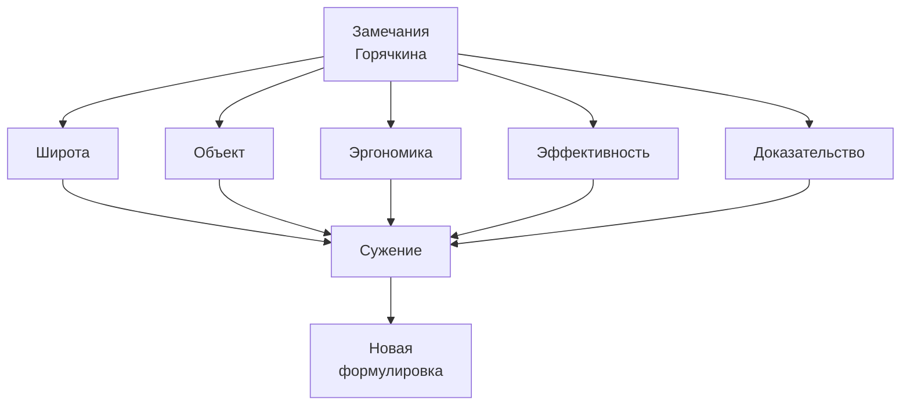

---

## Итог

Консультация подтвердила верность направления и указала на
необходимость сужения. Ключевые решения:

1. Объект анализа — **экран оператора (информационная модель)**, а не
   состояние робота вообще.
2. Предмет — **представление и восприятие** критичных параметров, а не
   технические характеристики робота.
3. Метод — **аналитическое обоснование** (СДП: деятельность →
   информационные потребности → требования), **без группы экспертов** и
   **без измерения скорости восприятия** (ГОСТ на неё нет).
4. Сценарий — **обнаружение аномалий** по массивам данных
   (см. [12.6](#126-как-мы-обнаруживаем-аномалию)).
5. Тема переосмыслена: «Эргономическое **обоснование** информационной
   модели оператора шагающего робота на основе анализа деятельности (на
   примере обнаружения аномалий)».
6. Согласование — с научным руководителем Каневым А.И. **отложено**
   (занят), работа ведётся самостоятельно.

Следующий шаг — отправить письмо Горячкину и продолжить постановку
самостоятельно.
