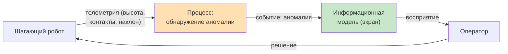
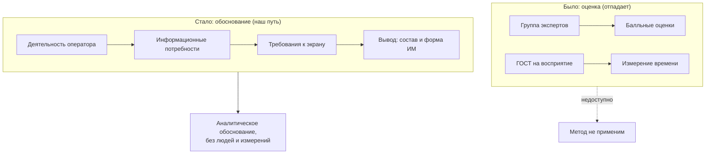

# Письмо Горячкину Б.С. — уточнение темы КР

**Дата:** 2026-09-07
**Кому:** Горячкин Б.С. (дисциплина ЭА_СОиОИ)
**Научный руководитель:** Канев А.И. (занят, согласование отложено)

---

Здравствуйте, Борис Сергеевич!

Спасибо за консультацию — сузил постановку.

**Тема:** «Эргономическое обоснование информационной модели оператора
шагающего робота на основе анализа деятельности (на примере обнаружения
аномалий)».

**Объект** — экран оператора (информационная модель), а не состояние
робота.

**Метод** — аналитический, без измерений и без группы экспертов:
системно-деятельностный анализ (деятельность оператора → информационные
потребности → требования к экрану) с опорой на принципы эргономики из
литературы. Скорость восприятия не измеряем — задаём её как проектное
требование, выведенное из деятельности.

**Анализ** — какие критичные параметры (просадка высоты, потеря
контакта, риск опрокидывания) и в какой форме должны быть представлены
оператору, чтобы он своевременно обнаружил аномалию. Сравнение форм
(числовая / графическая / пространственная / комбинированная) — по
соответствию принципам: полнота, своевременность, однозначность,
минимум нагрузки на внимание.

**Ключевая мысль:** сам процесс обнаружения аномалии — в роботе, но
эргономика начинается там, где событие превращается в информацию для
оператора. Поэтому из всего состояния робота берём один процесс —
обнаружение аномалии — и смотрим, как он доходит до оператора через
экран.

**Вопрос:** верна ли такая постановка — объект (экран оператора) и
аналитический метод обоснования (без экспертной группы и без измерения
скорости восприятия)?

---

## Иллюстрация: оператор — робот, выделяем один процесс

Из всего состояния робота берём **один процесс** — обнаружение аномалии,
и смотрим, как он доходит до оператора через экран.

Ключевая мысль: сам процесс обнаружения аномалии — в роботе, но
**эргономика начинается там, где событие превращается в информацию для
оператора** и он должен её вовремя воспринять.

## Примеры аномалий и эргономическая интерпретация

| Аномалия | Что происходит с роботом | Что должен увидеть оператор | Эргономическое требование |
|---|---|---|---|
| Просадка высоты | корпус опускается | тренд высоты вниз | быстрое считывание отклонения |
| Потеря контакта ноги | нога не касается опоры | индикатор опоры | заметность события (цвет/мигание) |
| Риск опрокидывания | растёт наклон | крен/дифферент в зоне риска | однозначная тревожная сигнализация |
| Отклонение от маршрута | робот уходит в сторону | положение относительно цели | наглядность пространственной картины |
| Потеря связи | нет данных | индикатор доступности | различие «нет данных» и «норма» |

**Интерпретация в правильную эргономику:** каждое из этих событий —
не техническая характеристика робота, а **информационная потребность
оператора**. Мы анализируем не робота, а то, насколько полно, своевременно
и однозначно экран сообщает оператору об аномалии. Это и есть предмет
эргономического обоснования.

## Почему метод — аналитический, а не «оценка с экспертами»

От «оценки» пришлось отказаться по двум причинам:

- **Нет группы экспертов.** Мы не создаём и не собираем группу
  экспертов для оценки вариантов.
- **Нет ГОСТ на скорость восприятия зрением.** Норматива, по которому
  можно было бы измерить время считывания, не существует — значит,
  «измерить эффективность» нельзя.

Из-за этого меняется сама логика работы:

**Переосмысленная тема и метод:**

- вместо «оценки» — **обоснование** (аналитический вывод требований);
- вместо измерений скорости — **проектные требования**, выведенные из
  деятельности (полнота, своевременность, однозначность);
- вместо ГОСТ — **принципы эргономики из литературы** и системно-
  деятельностный подход.

Это позволяет выполнить работу **одному человеку**, без экспериментов и
без сбора группы, опираясь на методологию, а не на недоступные
измерения.
