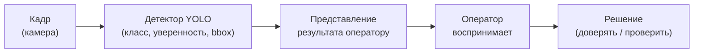
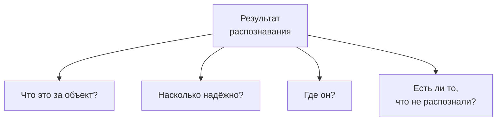
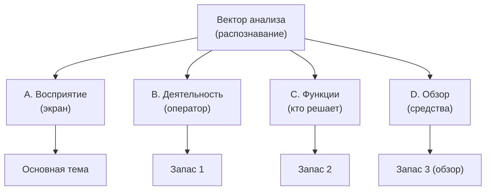

# Памятка по теме КР: распознавание объектов глазами эргономики

**Дата:** 2026-09-07
**Студент:** Папин А.В., ИУ5Ц-31М
**Научный руководитель:** Канев А.И. (предложил тему)
**Цель документа:** зафиксировать новую постановку КР с вектором анализа

---

## 1. Что требует преподаватель (по итогам консультаций)

- **Указать вектор анализа** — под каким углом смотрим на объект.
- **Узкий выбор темы** — не «робот вообще», а конкретный ракурс.
- **Понять, на что смотреть** — что именно анализируем и что оцениваем.
- Три вопроса: объект / где анализ / характеристики.
- **Не смешивать эргономику (человек) и технику (робот).**

---

## 2. Вектор анализа (основной)

**Вектор:** информационно-перцептивный — как **результат распознавания
объектов** доходит до оператора и воспринимается им.

| Что | Значение |
|---|---|
| Вектор | восприятие результатов распознавания оператором |
| Узкий выбор | экран с распознанными объектами |
| На что смотрим | класс, уверенность, положение объекта |
| Что оцениваем | однозначность, наглядность надёжности, нагрузка |
| Что НЕ смотрим | точность модели YOLO, обучение, mAP (это техника) |

**Тема:** «Эргономическое обоснование представления результатов
распознавания объектов оператору мобильного робота».

**Ключевая мысль:** распознаёт робот (YOLO), а эргономика начинается там,
где **результат распознавания** превращается в информацию для оператора —
и оператор должен правильно его понять и правильно ему доверять.

---

## 3. Ответы на три вопроса

| Вопрос | Мой ответ |
|---|---|
| 1. Объект | Экран оператора с результатами распознавания (ИМ) |
| 2. Где анализ | Вывод требований из деятельности + сравнение форм подачи |
| 3. Характеристики | Однозначность класса, наглядность уверенности, нагрузка |

---

## 4. Конвейер: от кадра до решения оператора

Ключевой момент: детектор — **источник данных**. Эргономика — в блоке
«представление результата» и в том, как оператор его воспринимает.

---

## 5. Характеристики и параметры (основная тема)

**Параметры** — что показываем оператору (с приоритетом):

| Параметр | Что означает | Приоритет |
|---|---|---|
| Класс объекта | тип распознанного (person, chair, …) | критичный |
| Уверенность (confidence) | надёжность распознавания | критичный |
| Тип ошибки | ложное срабатывание / пропуск | критичный |
| Положение (bbox) | где объект на кадре | важный |
| Размер объекта | крупный/мелкий (восприятие) | важный |
| Дистанция | оценка расстояния до объекта | важный |
| Число объектов | сколько распознано | важный |
| Опасность объекта | человек vs безопасный предмет | важный |
| Вид движения | стоит / движется | важный |
| Направление движения | куда смещается | средний |
| Зона (сектор) | в какой области кадра | средний |
| Время жизни метки | как долго объект виден | средний |
| Окклюзия | объект частично скрыт | средний |
| Центральность | близко к центру внимания | фоновый |
| Свежесть данных | как давно обновлялось | фоновый |

*Показываются не все параметры сразу — только по приоритету (иначе
перегрузка внимания).*

**Характеристики** — качества модели (с приоритетом):

| Характеристика | Что означает | Метрика | Пример | Приоритет |
|---|---|---|---|---|
| Однозначность класса | класс читается верно | число классов | N | высокий |
| Наглядность надёжности | видно, насколько детекция надёжна | число уровней уверенности | 3 | высокий |
| Помехозащищённость | «не распознан» ≠ «объекта нет» | наличие индикатора | да | высокий |
| Своевременность | результат не устарел | задержка отображения | ≤ 0.5 с | высокий |
| Полнота | показаны все распознанные | доля показанных | 100% | высокий |
| Калибровка доверия | уверенность передана правдиво | соответствие порогам | задано | высокий |
| Различимость объектов | метки не сливаются | мин. размер метки | задан | средний |
| Нагрузка на внимание | минимум одновременно | число объектов на экране | ≤ 6 | средний |
| Устойчивость метки | метка не мерцает | число срывов за время | 0 | средний |
| Локализуемость | место показано верно | ошибка позиции метки | мала | средний |
| Цветовая различимость | классы различаются цветом | число различимых цветов | ≥ числа классов | средний |
| Приоритизация | важное выделено | число уровней значимости | 3 | средний |
| Непрерывность (трекинг) | объект ведётся | доля потерь трека | низкая | фоновый |
| Простота восприятия | мало шагов считывания | число шагов | ≤ 2 | фоновый |

**Ключевой принцип приоритизации:** критичные параметры (класс,
уверенность, ошибки) — всегда и заметно; важные (положение, число) —
компактно; фоновые (свежесть) — по запросу.

---

## 6. Пример: результат распознавания по кадру

Пусть детектор на кадре вернул массив обнаружений:

| № | Класс | Уверенность | Позиция |
|---|---|---|---|
| 1 | person | 0.92 | центр |
| 2 | chair | 0.71 | слева |
| 3 | bottle | 0.55 | внизу |
| 4 | (bottle) | 0.48 | внизу (ниже порога) |

Как это читать:

- **person 0.92** — надёжно, оператор может доверять;
- **chair 0.71** — приемлемо;
- **bottle 0.55** — на грани порога: показать как «сомнительно» или нет?;
- **0.48** — ниже порога 0.5 → **не показано**, но объект мог быть.

Эргономическая проблема: если 0.55 показать так же, как 0.92, оператор
будет **доверять ошибочно**. Значит, уверенность нужно **выразить явно**
(цветом/значком), а не только цифрой.

---

## 7. Что должен понять оператор

| Вопрос оператора | Как ответить в ИМ |
|---|---|
| Что это за объект? | метка класса у рамки |
| Насколько надёжно? | цвет/значок уверенности |
| Где он? | рамка на изображении/карте |
| Есть ли пропуски? | отдельный индикатор «нет данных» |

---

## 8. Векторы анализа: выбор на встрече

| № | Вектор | На что смотрим | Возможная тема |
|---|---|---|---|
| **A** | Информационно-перцептивный | восприятие результатов распознавания | представление результатов оператору |
| B | Деятельностный | что оператор делает с распознанным | обработка результатов оператором |
| C | Функциональный | кто решает по объекту: детектор или человек | распределение доверия/контроля |
| D | Обзорно-системный | средства визуализации детекции | системный анализ средств |

Основной — **A**. Запасные (если A не устроит) — B или C.

---

## 9. Запасной план: другая тема, другой вектор

**Запас B (деятельностный вектор).**
Тема: «Эргономический анализ деятельности оператора по обработке
результатов распознавания объектов».
- Вектор: деятельность человека.
- На что смотрим: что оператор делает с распознанным (подтверждает,
  игнорирует, реагирует).
- Отличие от A: смотрим не на экран, а на действия человека.
- Ключевая мысль: ценность распознавания — в том, как оператор им
  пользуется.

**Запас C (функциональный вектор).**
Тема: «Распределение функций между детектором и оператором при обработке
распознанных объектов».
- Вектор: разделение труда человек—машина.
- На что смотрим: что решает автоматика, что — оператор.
- Отличие от A: смотрим на границу доверия и контроля.
- Ключевая мысль: эффективность — в верном распределении «кто решает».

**Запас D (обзорный вектор, вариант 2 методички).**
Тема: «Системный анализ средств визуализации результатов распознавания
для операторов роботов».
- Вектор: обзор существующих решений.
- На что смотрим: как разные системы показывают детекцию.
- Отличие: не исследование, а обзор + статья.

---

## 10. Примеры по запасным векторам

### Пример к вектору B (обработка результатов оператором)

**Ситуация:** детектор распознал объект, оператор решает, что с ним делать.

- **Объект:** деятельность оператора по обработке распознанного.
- **Метод:** анализ деятельности (разбор действий).
- **Анализ:** что оператор делает с распознанным и где ошибается.
- **Ключевая мысль:** распознавание полезно, только если оператор верно
  им пользуется.

Цикл обработки:

**Параметры** — действия оператора (с приоритетом):

| Параметр | Что означает | Приоритет |
|---|---|---|
| Заметил метку | увидел распознанный объект | критичный |
| Оценил доверие | решил, можно ли верить | критичный |
| Классифицировал | понял тип объекта | критичный |
| Проверил | уточнил при сомнении | важный |
| Оценил опасность | насколько объект значим | важный |
| Принял решение | что делать с объектом | важный |
| Действие | отреагировал | важный |
| Контроль ошибки | заметил ложное/пропуск | средний |

**Характеристики** — качества обработки (с приоритетом):

| Характеристика | Что означает | Метрика | Пример | Приоритет |
|---|---|---|---|---|
| Оперативность | быстро обрабатывает | число действий до решения | 3 | высокий |
| Безошибочность | не путает объекты | число ошибок | 0 | высокий |
| Правильное доверие | верит надёжному, проверяет слабое | доля верных решений | высокая | высокий |
| Полнота обработки | не пропускает объекты | доля обработанных | 100% | высокий |
| Своевременность | реагирует вовремя | задержка решения | малая | высокий |
| Устойчивость к ошибкам | замечает ложное/пропуск | доля замеченных ошибок | высокая | средний |
| Нагрузка | сколько объектов обрабатывает | число объектов | ≤ 6 | средний |
| Согласованность | единообразно реагирует | число вариантов реакции | 1 | средний |
| Простота | минимум лишних действий | число лишних действий | 0 | фоновый |

### Пример к вектору C (кто решает по объекту)

- **Объект:** система «детектор — оператор».
- **Метод:** функциональный анализ (кто что решает).
- **Анализ:** какие решения автоматике, какие оператору.
- **Ключевая мысль:** часть решений можно отдать детектору, но
  ответственные — человеку.

**Параметры** — функции/решения (с приоритетом):

| Параметр (функция) | Кто выполняет | Приоритет |
|---|---|---|
| Обнаружить объект | детектор | критичный |
| Подтвердить класс | оператор (при сомнении) | критичный |
| Оценить опасность | оператор | важный |
| Автодействие по объекту | детектор (порог) | важный |
| Уведомить о пропуске | интерфейс | средний |

**Характеристики** — качества распределения (с приоритетом):

| Характеристика | Что означает | Метрика | Пример | Приоритет |
|---|---|---|---|---|
| Автоматизация рутины | простые решения у машины | коэффициент | 3 из 5 | высокий |
| Ответственность человека | спорное — за человеком | число решений оператора | 2 | высокий |
| Полнота | все решения закреплены | всего функций | 5 | высокий |
| Своевременность | решение не запаздывает | задержка передачи | малая | высокий |
| Однозначность границы | ясно, кто решает | число спорных функций | 0 | высокий |
| Прозрачность | понятно, кто решил | число уровней решения | 2 | средний |
| Согласованность | единые правила передачи | число правил | 1 | средний |
| Надёжность передачи | нет потери функций | доля потерянных | 0 | средний |
| Обратимость | оператор может перехватить | число перехватов | любое | средний |
| Простота | минимум ручных операций | число ручных шагов | ≤ 2 | фоновый |

### Пример к вектору D (обзор средств визуализации детекции)

- **Объект:** средства визуализации результатов распознавания.
- **Метод:** системный анализ / обзор.
- **Анализ:** как разные системы показывают детекцию.
- **Ключевая мысль:** обзор выявляет, какие средства плохо передают
  уверенность и ошибки.

**Параметры** — средства (с приоритетом):

| Параметр (средство) | Что показывает | Приоритет |
|---|---|---|
| Визуализатор проекта | рамки, класс, цвет | базовое |
| RViz-конфиг детекции | метки на кадре | базовое |
| Промышленные панели | детекция в реальном времени | пример |
| Открытые дашборды | графики и рамки | пример |

**Характеристики** — качества обзора (с приоритетом):

| Характеристика | Что означает | Метрика | Пример | Приоритет |
|---|---|---|---|---|
| Покрытие | охват классов средств | число средств | 4 | высокий |
| Критериальность | единые критерии сравнения | число критериев | 3 | высокий |
| Показ уверенности | передают ли надёжность | доля средств с индикацией | 2 из 4 | высокий |
| Передача ошибок | видно ли ложное/пропуск | доля средств с индикацией | 1 из 4 | высокий |
| Различимость классов | кодируются ли классы | доля средств с легендой | 3 из 4 | средний |
| Актуальность | свежесть источников | доля ≤ 5 лет | ≥ 50% | средний |
| Доступность | прост ли для оператора | число шагов | ≤ 3 | средний |
| Полнота обзора | охват функций | число разобранных функций | 5 | средний |
| Согласованность | единая терминология | число синонимов | 1 | фоновый |

---

## 11. Что точно НЕ делаем (чтобы не уйти в технику)

- Не улучшаем точность модели YOLO (mAP, обучение, датасеты).
- Не настраиваем гиперпараметры детектора.
- Не анализируем технические метрики распознавания как цель.

Всё это — **источник данных**. Предмет — **представление результата
оператору и его восприятие**.

---

## 12. Математические основания и источники

Каждая характеристика и параметр опираются на измеримую модель
(психофизика, теория информации, теория обнаружения сигналов) или
стандарт. Это позволяет обосновывать решения ссылками, а не мнением.

### 12.1. Формулы

| Модель | Формула | Что даёт |
|---|---|---|
| Закон Хика–Хаймана | `RT = a + b·log2(n+1)` | время выбора растёт логарифмически от числа альтернатив |
| Закон Фиттса | `MT = a + b·log2(A/W + 1)` | время/точность наведения зависит от размера цели |
| Энтропия Шеннона | `H = −Σ pᵢ·log2 pᵢ` | количественная мера неопределённости |
| Теория обнаружения сигналов | `d′ = z(H) − z(F)`; `c = −½(z(H)+z(F))` | различимость сигнала и смещение критерия |
| Калибровка уверенности (ECE) | `ECE = Σ (|B_m|/n)·|acc(B_m) − conf(B_m)|` | насколько уверенность соответствует точности |
| Brier score | `BS = (1/N)Σ (fᵢ − oᵢ)²` | качество вероятностного прогноза |
| Закон Вебера (JND) | `ΔI/I = k` | минимально различимое изменение |
| Визуальный угол | `θ = 2·arctan(h/2d)` | связь размера и дистанции |
| Цветовое различие CIE | `ΔE00` (CIEDE2000) | численная различимость цветов |
| Контраст WCAG | `(L1+0.05)/(L2+0.05)` | читаемость текста/меток |
| Возраст информации (AoI) | `Δ(t) = t − u(t)` | свежесть данных |
| NASA-TLX | взвешенная сумма 6 шкал | субъективная нагрузка |
| SEEV | внимание ∝ Salience · Effort · Expectancy · Value | распределение внимания |

### 12.2. Характеристика → модель → источник

| Характеристика | Модель/формула | Источник |
|---|---|---|
| Однозначность класса | энтропия `H` | Shannon, 1948 |
| Наглядность надёжности | калибровка `ECE` | Guo et al., 2017; Niculescu-Mizil & Caruana, 2005 |
| Помехозащищённость | `d′`, ROC | Green & Swets, 1966; Tanner & Swets, 1954 |
| Своевременность | `RT` (Хик–Хайман) | Hick, 1952; Hyman, 1953 |
| Полнота | доля пропусков (SDT) | Green & Swets, 1966 |
| Калибровка доверия | `ECE`, `BS`; доверие к автоматике | Brier, 1950; Guo, 2017; Lee & See, 2004 |
| Различимость объектов | `ΔI/I`; визуальный угол | Weber; MIL-STD-1472 |
| Нагрузка на внимание | 7±2; 4±1; MRT | Miller, 1956; Cowan, 2001; Wickens, 2002 |
| Устойчивость метки | change blindness | Simons & Rensink, 2005 |
| Локализуемость | закон Фиттса | Fitts, 1954 |
| Цветовая различимость | `ΔE00`; контраст WCAG | CIE, 2000; Sharma et al., 2005; W3C WCAG 2.1 |
| Приоритизация | SEEV | Wickens et al., 2001 |
| Непрерывность (трекинг) | MOT (≈4 объекта) | Pylyshyn & Storm, 1988 |
| Простота восприятия | Хик; когнитивная нагрузка | Hick, 1952; Sweller, 1988 |

### 12.3. Параметр → модель → источник

| Параметр | Модель/формула | Источник |
|---|---|---|
| Класс объекта | идентификация (SDT) | Green & Swets, 1966 |
| Уверенность | апостериорная вероятность; `ECE` | Guo, 2017 |
| Тип ошибки | `H`, `F`, `d′`, `c` | Green & Swets, 1966 |
| Положение (bbox) | закон Фиттса | Fitts, 1954 |
| Размер | визуальный угол; мин. высота ≈20′ | MIL-STD-1472 |
| Дистанция | `θ = 2·arctan(h/2d)` | физиология зрения |
| Число объектов | 7±2 / 4±1 | Miller, 1956; Cowan, 2001 |
| Опасность | ценность (SEEV, Value) | Wickens et al., 2001 |
| Вид/направление движения | восприятие движения | Wickens, 2002 |
| Зона/центральность | салиентность, эксцентриситет | SEEV; зрение |
| Время жизни метки | временная интеграция | Simons & Rensink, 2005 |
| Окклюзия | перцептивная дополненность | психология восприятия |
| Свежесть данных | Age of Information | Kaul, Yates, Gruteser |

### 12.4. Стандарты

- **ГОСТ Р ИСО 9241** (ч. 110 — принципы диалога, ч. 112 — представление информации).
- **ГОСТ Р ИСО 6385-2007** — эргономические принципы.
- **ГОСТ 21829-76** (СЧМ, кодирование), **ГОСТ Р 50923-96**, **ГОСТ Р 50948-2001** (дисплеи, средства отображения).
- **ISO 9241-3/-303**, **ISO 9355**.
- **MIL-STD-1472** — человеко-инженерные критерии (высота знака, цвета, плотность).
- **ANSI/HFES 100**, **WCAG 2.1**.

### 12.5. Оговорки

- Часть характеристик выводится из формул напрямую (нагрузка,
  уверенность, ошибки, различимость, свежесть), часть — качественные
  принципы из стандартов (полнота, приоритизация, простота).
- **Скорость восприятия не нормируется ГОСТом** — она оценивается через
  экспериментальные законы (Хик, Фиттс) и SDT.
- В работе эти модели используются как **обоснование требований**, а не
  как обязательные измерения (без экспертов и без замеров на людях).
