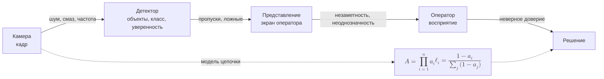
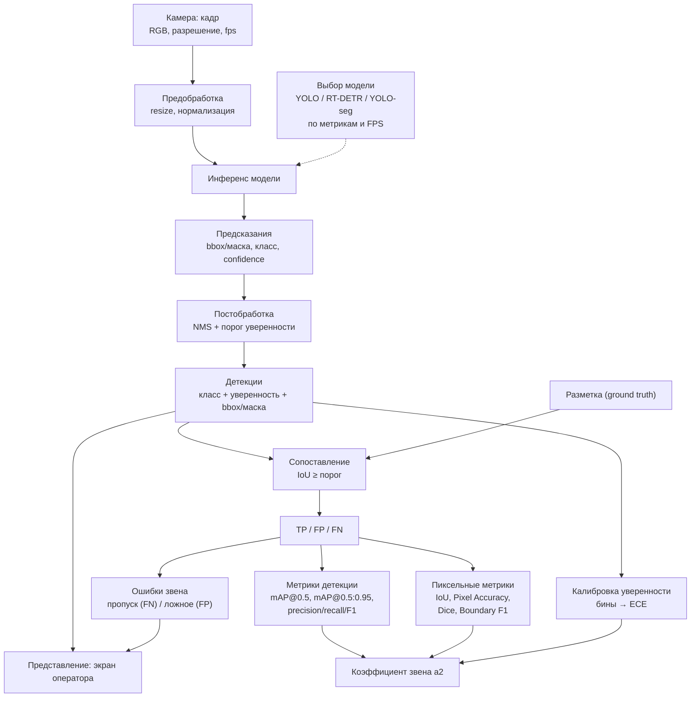

# КР — постановка (про распознавание объектов)

Привет, Антон Игоревич!

Обсудил с Б.С. Горячкиным предложенную тему — она связана с
распознаванием объектов. Спросил, какую эргономику можно взять по всему
конвейеру: от камеры до восприятия оператора (схема ниже). Он уточнил,
какой анализ будем брать.

Я предложил взять детекцию объекта: тогда видно, какая информация
сохраняется, а какая теряется при переходе от звена к звену, и так далее.

**Конвейер (5 звеньев):**
камера (захват) → детектор → представление → оператор → решение.

Считаю, сколько информации доходит на каждом шаге:

$$A = \prod_{i=1}^{n} a_i, \qquad
\ell_i = \frac{1 - a_i}{\sum_j (1 - a_j)}$$

где $A$ — что доходит до конца, $\ell_i$ — вклад звена в потери,
$a_i$ — сколько сохранилось на звене.

Метрики по звеньям:

- детектор — mAP/F1;
- представление — ECE и различимость ($\Delta E_{00}$, контраст, угол);
- оператор — $d'$, время, нагрузка.

Подскажите, так ок?

1. берём весь конвейер или только «представление → оператор»?
2. числа — из литературы/датасета?
3. сравнить детекторы (YOLO, RT-DETR) по пиксельным метрикам
   (IoU, Dice, Pixel Accuracy, Boundary F1)?
4. проверку сделать в Gazebo по логам (CSV)?

Спасибо!
А. Папин

## Схема: «Конвейер от камеры до восприятия оператора»

На схеме — путь кадра от камеры до решения: камера → детектор →
представление → оператор → решение. На стрелках подписано, что теряется
на каждом переходе (шум и смаз, пропуски и ложные, незаметность,
неверное доверие). Снизу — узел с моделью: итог $A$ и вклад звена
$\ell_i$.

## Схема 2: «Звено „Детектор“: как работает и как оценивается»

На схеме — что происходит внутри звена «детектор»: кадр проходит
предобработку, инференс модели и постобработку (NMS + порог); модель
выбирается сравнением (YOLO / RT-DETR / YOLO-seg по метрикам и FPS);
результат сравнивается с разметкой и считаются метрики (mAP/F1 и
пиксельные) и калибровка уверенности (ECE); ошибки звена (пропуск/ложное)
уходят на представление, а всё вместе даёт коэффициент $a_2$.

