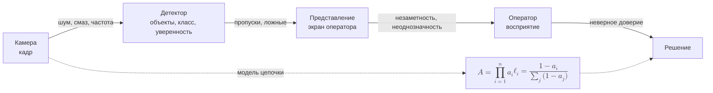

# Схема: «Конвейер от камеры до восприятия оператора»

```mermaid
graph LR
    A["Камера<br/>кадр"] -->|"шум, смаз, частота"| B["Детектор<br/>объекты, класс, уверенность"]
    B -->|"пропуски, ложные"| C["Представление<br/>экран оператора"]
    C -->|"незаметность, неоднозначность"| D["Оператор<br/>восприятие"]
    D -->|"неверное доверие"| E["Решение"]
    A -.->|"модель цепочки"| M["$$A = \prod_{i=1}^{n} a_i$$<br/>$$\ell_i = \frac{1 - a_i}{\sum_j (1 - a_j)}$$"]
    M -.-> E
```
