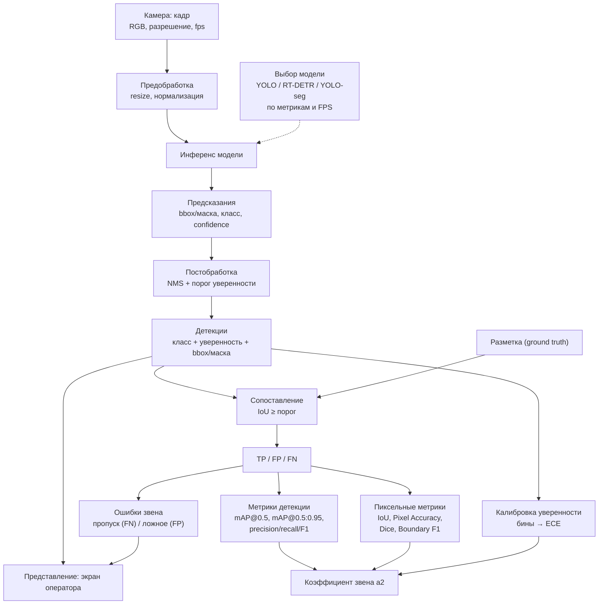

# Схема 2: «Звено „Детектор“: как работает и как оценивается»

```mermaid
graph TB
    CAM["Камера: кадр<br/>RGB, разрешение, fps"]
    PRE["Предобработка<br/>resize, нормализация"]
    SEL["Выбор модели<br/>YOLO / RT-DETR / YOLO-seg<br/>по метрикам и FPS"]
    INF["Инференс модели"]
    RAW["Предсказания<br/>bbox/маска, класс, confidence"]
    NMS["Постобработка<br/>NMS + порог уверенности"]
    OUT["Детекции<br/>класс + уверенность + bbox/маска"]
    REP["Представление: экран оператора"]

    GT["Разметка (ground truth)"]
    CMP["Сопоставление<br/>IoU ≥ порог"]
    CM["TP / FP / FN"]
    MD["Метрики детекции<br/>mAP@0.5, mAP@0.5:0.95,<br/>precision/recall/F1"]
    MP["Пиксельные метрики<br/>IoU, Pixel Accuracy,<br/>Dice, Boundary F1"]
    CAL["Калибровка уверенности<br/>бины → ECE"]
    ERR["Ошибки звена<br/>пропуск (FN) / ложное (FP)"]
    A2["Коэффициент звена a2"]

    CAM --> PRE --> INF --> RAW --> NMS --> OUT --> REP
    SEL -.-> INF
    OUT --> CMP
    GT --> CMP
    CMP --> CM
    CM --> MD
    CM --> MP
    OUT --> CAL
    CM --> ERR
    ERR --> REP
    MD --> A2
    MP --> A2
    CAL --> A2
```
