# Конспект консультации с Горячкиным Б.С. — 06.10.2026

**Тема КР:** Эргономическое обоснование представления результатов
распознавания объектов оператору мобильного робота
**Дисциплина:** ЭА_СОиОИ (эргономика), МГТУ им. Н.Э. Баумана
**Научный руководитель:** Канев Антон Игоревич
**Источник:** расшифровка аудиозаписи «Конса_горячкин_06102026.docx»
**Статус документа:** конспект (реконструкция смысла, не дословный текст)

---

## Содержание

1. [Резюме](#1-резюме)
2. [Участники и контекст](#2-участники-и-контекст)
3. [Реконструкция разговора](#3-реконструкция-разговора)
4. [Что такое «эргономическое обоснование»](#4-что-такое-эргономическое-обоснование)
5. [Требование: считать цепочку по модели](#5-требование-считать-цепочку-по-модели)
6. [Отвержение экспертизы и фокус-групп](#6-отвержение-экспертизы-и-фокус-групп)
7. [Три объекта анализа](#7-три-объекта-анализа)
8. [Информационная цепочка: разбор звеньев](#8-информационная-цепочка-разбор-звеньев)
9. [Количественная модель цепочки](#9-количественная-модель-цепочки)
10. [Что меняется в постановке](#10-что-меняется-в-постановке)
11. [План работ: теория → модель → проверка](#11-план-работ-теория--модель--проверка)
12. [Роль научного руководителя](#12-роль-научного-руководителя)
13. [Открытые вопросы](#13-открытые-вопросы)
14. [Административные вопросы (подписи, заключения)](#14-административные-вопросы-подписи-заключения)
15. [Математические основания и модели](#15-математические-основания-и-модели)
16. [Разобранный пример по шагам](#16-разобранный-пример-по-шагам)
17. [Риски и ограничения](#17-риски-и-ограничения)
18. [Возможные возражения и ответы](#18-возможные-возражения-и-ответы)
19. [Связь с дипломом](#19-связь-с-дипломом)
20. [Следующие шаги (кратко)](#20-следующие-шаги-кратко)
21. [Детализация: объект «аварийные сигналы»](#21-детализация-объект-аварийные-сигналы)
22. [Детализация: объект «деятельность оператора»](#22-детализация-объект-деятельность-оператора)
23. [Как измерять показатели звеньев](#23-как-измерять-показатели-звеньев)
24. [Резюме ключевых чисел (заготовка таблицы для РПЗ)](#24-резюме-ключевых-чисел-заготовка-таблицы-для-рпз)
25. [Приложение A. Очищенные цитаты](#приложение-a-очищенные-цитаты)
26. [Приложение B. Глоссарий](#приложение-b-глоссарий)
27. [Приложение C. Чек-лист на следующую встречу](#приложение-c-чек-лист-на-следующую-встречу)

---

## 1. Резюме

Консультация 06.10.2026 была посвящена теме
«Эргономическое обоснование представления результатов распознавания
объектов оператору мобильного робота». Главное, что прозвучало: работа
должна быть **не про эксперимент и не про экспертные оценки**, а про
**расчёт информационной цепочки по модели**.

Ключевые требования преподавателя:

| № | Требование | Смысл |
|---|---|---|
| 1 | Не смешивать работы | сначала закончить одну, потом другую |
| 2 | Понять, что такое «эргономическое обоснование» | обосновать = доказать, на каком основании |
| 3 | Посчитать цепочку по модели | где и сколько теряется на каждом звене |
| 4 | Эксперты и фокус-группы — не годятся | «это не наука» |
| 5 | Эксперимент — только практика/проверка | не основание работы |
| 6 | Сначала теория/модель, потом проверка | классический порядок |
| 7 | Задача может быть частью цепочки | но анализ без экспертизы |

**Главная мысль консультации одной фразой:** нужно не «прогнать опыт и
посмотреть», а **построить модель информационного канала и посчитать, где
теряется точность (надёжность) информации, дойдя от сенсора до решения
оператора**; выбранное представление обосновывается этим расчётом.

---

## 2. Участники и контекст

### 2.1. Участники

| Роль | Персона | Комментарий |
|---|---|---|
| Преподаватель по эргономике | Горячкин Б.С. | требует строгого анализа, отвергает «науку на оценках» |
| Научный руководитель | Канев Антон Игоревич | предложил тему распознавания; с ним советоваться |
| Студент | Папин А.В., ИУ5Ц-31М | автор КР |

### 2.2. Предыстория

- Ранее обсуждалась тема через «информационную модель состояния робота»
  и «обнаружение аномалий».
- Научный руководитель предложил новую тему — **распознавание объектов**.
- Первая консультация (≈15.09.2026) дала триаду объектов и требование
  сузить вектор.
- Настоящая консультация (06.10.2026) уточняет **метод**: расчёт по
  модели, без экспертов.

### 2.3. Хронология работы над темой

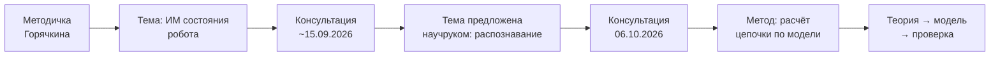

---

## 3. Реконструкция разговора

Расшифровка имеет низкое качество (автоматическое распознавание речи),
поэтому ниже приведена реконструкция смысла по блокам разговора.

### 3.1. Блок 1. «Не будем смешивать»

Преподаватель с самого начала говорит: не нужно смешивать две вещи
(подготовку статьи и работу по роботу/КР). Сначала доводится до конца
одно, затем берётся другое. Это организационное замечание, но важное: не
распылять усилия.

### 3.2. Блок 2. Постановка темы

Обсуждается тема: у робота есть **экран управления**, **оператор
управляет роботом**. Значит, есть цепочка «оператор — робот — экран».
Тема — про то, как результаты работы робота доходят до оператора.

### 3.3. Блок 3. «Вам нужны исключительно аномалии»

Звучит мысль: в работе робота важны **отклонения** (аномалии). Если что-то
идёт не так, оператор должен предпринять действие. Отсюда — потребность
понять, **как проявляется ошибка** и **как оператор её увидит на экране**.

### 3.4. Блок 4. «Что такое эргономическое обоснование?»

Центральный вопрос консультации. Преподаватель раз за разом спрашивает:
что вы собираетесь обосновывать и **на каком основании**. «Обосновать» =
«доказать». Без основания обоснование превращается в декларацию.

### 3.5. Блок 5. Пример с цепочкой и 20%

Преподаватель приводит пример: есть цепочка, где на каком-то этапе
теряется 20% (точности/надёжности). Надо **пройти по квадратикам** —
по звеньям цепочки — и посчитать, где именно теряется и почему.
«Просчитайте мне модель».

### 3.6. Блок 6. Отвержение экспертизы

На предложение оценивать надёжность («насколько надёжно?») следует
жёсткий ответ: это экспертиза, эксперимент; **фокусных групп у вас нет**;
даже если бы были — «оцените на пять или на десять» — это не наука.
Нужно **залезть внутрь и посчитать**.

### 3.7. Блок 7. Порядок: теория → практика

Преподаватель предлагает классический путь: сначала честно построить
**теорию/модель**, а потом проверять на практике (эксперимент) как
тестирование. «Гипотезы и тестирование — упрощённый вариант».

### 3.8. Блок 8. Три объекта анализа

Повторяется триада: анализировать можно
(1) **процесс**, (2) **операторскую деятельность**, (3) **аварийные
сигналы и их представление на экране**.

### 3.9. Блок 9. «Конкретика, без гипотез»

«Гипотетически здесь ничего не надо, занимаемся конкретикой». То есть
нужны конкретные числа и конкретные звенья цепочки, а не общие слова.

### 3.10. Блок 10. Задача может быть меньше

Преподаватель допускает, что задача может быть **частью цепочки** —
не обязательно вся цепочка. Главное — чтобы был **анализ**, а не только
статистика и графики.

---

## 4. Что такое «эргономическое обоснование»

### 4.1. Определение, к которому ведёт преподаватель

**Эргономическое обоснование** — это доказательство того, что выбранный
способ представления информации оператору **обеспечивает требуемое
качество его деятельности**, с указанием основания: модели, по которой
это качество рассчитано.

### 4.2. Чего обоснование НЕ есть

| Не обоснование | Почему |
|---|---|
| Опрос экспертов | субъективно, не наука |
| Фокус-группа | малая выборка, «оцените на 5 или 10» |
| Только эксперимент | это практика/проверка, не основание |
| Графики и статистика без модели | «в этом нет анализа» |
| «Так удобнее/красивее» | нет доказательства |

### 4.3. Что является основанием

- **модель информационного канала** (цепочка звеньев);
- **расчёт потерь** точности/надёжности на каждом звене;
- **сравнение вариантов представления** по расчётному критерию;
- **числа** (проценты, вероятности), а не слова «удобнее».

### 4.4. Схема «обоснование = основание + вывод»

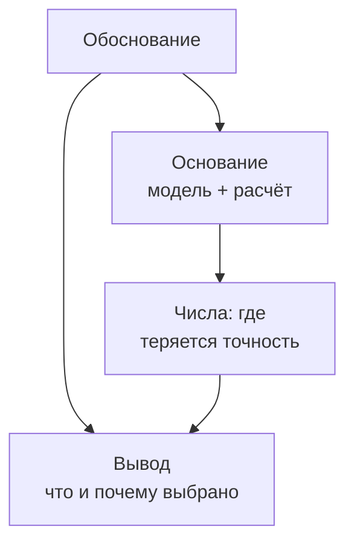

---

## 5. Требование: считать цепочку по модели

### 5.1. Суть требования

Информация проходит путь: от физического события (кадр, датчик) через
обработку к экрану и к оператору. На **каждом** звене информация может
искажаться или теряться. Нужно посчитать это **по модели**.

### 5.2. Цепочка (как её описывает преподаватель)

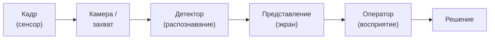

### 5.3. Что именно считать

- **точность** на каждом звене (доля правильного);
- **потери** (где и сколько теряется);
- **итоговую** точность/надёжность на выходе;
- **вклад** каждого звена в итоговую ошибку.

### 5.4. Аналогия преподавателя

«Здесь 20%, здесь 3%, здесь 5%» — то есть цепочка разбивается на звенья,
и по каждому указывается число. Итог — где сосредоточена потеря и можно
ли её уменьшить представлением.

### 5.5. Разница между «посчитать» и «прогнать опыт»

| Посчитать по модели | Прогнать опыт |
|---|---|
| до практики | после практики |
| даёт понимание «почему» | даёт «что получилось» |
| основание работы | проверка гипотезы |
| требует формул | требует стенда |

Вывод преподавателя: **основание — расчёт; опыт — подтверждение**.

---

## 6. Отвержение экспертизы и фокус-групп

### 6.1. Прямые формулировки

- «Это экспертиза, это эксперимент».
- «У тебя нет фокусных групп».
- «Даже если была фокусная группа — оцените на пять или на десять — это
  не наука».
- «Экспертная оценка… у тебя нет такой возможности; у тебя ты и Канев».

### 6.2. Почему это меняет метод

Ранее в наших черновиках фигурировали «экспертные оценки» и «группа
5–7 человек». Здесь это **прямо исключено**. Значит, раздел «оценка»
надо переписать как **расчёт по модели**.

### 6.3. Что остаётся допустимым

- теоретический расчёт по модели;
- ссылки на нормы/модели из литературы;
- эксперимент — как **проверка** в конце, а не как основа.

### 6.4. Схема «что исключаем и чем заменяем»

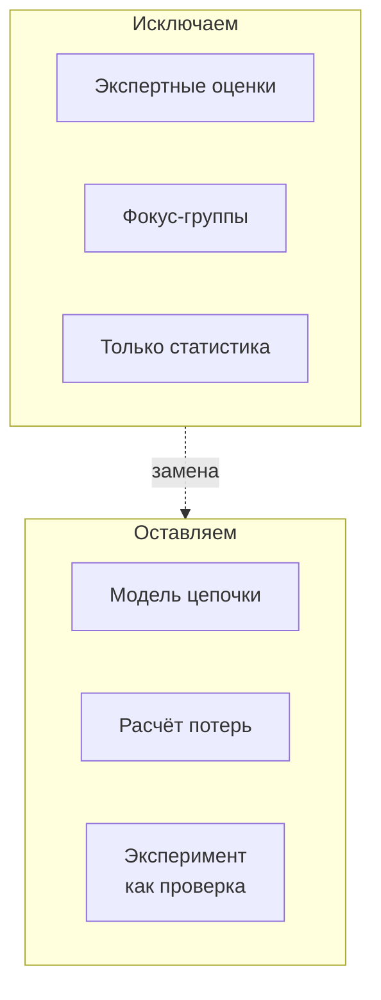

---

## 7. Три объекта анализа

Преподаватель настойчиво повторяет: нужно выбрать, **что** анализируем.

### 7.1. Объект 1 — процесс

Анализ информационного процесса: как данные идут по цепочке, где
искажаются, как меняется точность на звеньях. Это ближе всего к
«расчёту цепочки».

### 7.2. Объект 2 — операторская деятельность

Анализ того, **что делает оператор**: воспринимает, оценивает, решает,
действует. Вектор — деятельностный.

### 7.3. Объект 3 — аварийные сигналы и их представление

Анализ того, **какие аварийные сигналы** формируются и **как они
представлены на экране** (цвет, форма, место, заметность).

### 7.4. Сравнение объектов

| Объект | На что смотрим | Подходит ли |
|---|---|---|
| Процесс | звенья цепочки, потери точности | да (расчёт) |
| Деятельность оператора | действия человека | да (но без людей сложнее) |
| Аварийные сигналы | сигналы и их представление | да (представление) |

### 7.5. Дерево выбора объекта

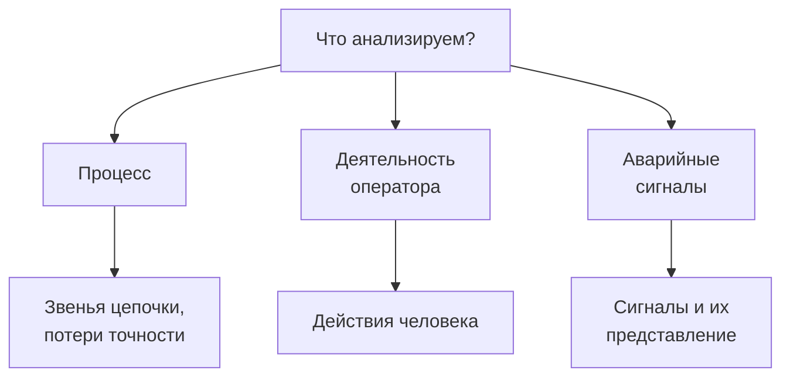

---

## 8. Информационная цепочка: разбор звеньев

Рассмотрим цепочку «сенсор → детектор → экран → оператор → решение»
подробно, звено за звеном. Это основа будущей модели.

### 8.1. Звено 1. Кадр и захват (сенсор → изображение)

**Что происходит:** физическая сцена фиксируется камерой. Здесь
возможны потери: освещение, размытие, шум матрицы, частота кадров.

**Параметры звена:** разрешение, частота, экспозиция, шум.

**Возможные потери точности:** пропуск из-за низкой частоты (объект
смазан), искажение из-за освещения.

### 8.2. Звено 2. Детектор (изображение → объекты)

**Что происходит:** модель распознавания выдаёт класс, уверенность,
положение. Здесь основные потери: ложные срабатывания и пропуски.

**Параметры звена:** точность, полнота, уверенность (confidence),
порог.

**Возможные потери:** часть объектов не распознана; часть — ошибочно
отнесена к классу.

### 8.3. Звено 3. Представление (объекты → экран)

**Что происходит:** результат превращается в информацию для оператора:
рамки, метки, цвета, индикаторы уверенности.

**Параметры звена:** наглядность, однозначность, различимость,
заметность.

**Возможные потери:** оператор не замечает объект; путает класс; не
видит, что уверенность низкая.

### 8.4. Звено 4. Оператор (экран → восприятие)

**Что происходит:** человек считывает информацию и формирует понимание.

**Параметры звена:** время считывания, доля ошибок, нагрузка.

**Возможные потери:** пропуск из-за нагрузки; неверная интерпретация.

### 8.5. Звено 5. Решение (восприятие → действие)

**Что происходит:** оператор принимает решение (доверять/проверить/
игнорировать).

**Параметры:** вероятность правильного решения.

**Возможные потери:** избыточное доверие; избыточное недоверие.

### 8.6. Сводная таблица звеньев

| Звено | Вход | Выход | Ключевые потери |
|---|---|---|---|
| Захват | сцена | кадр | шум, смаз, частота |
| Детектор | кадр | объекты | пропуски, ложные |
| Представление | объекты | экран | незаметность |
| Оператор | экран | понимание | ошибки считывания |
| Решение | понимание | действие | неверное доверие |

### 8.7. Схема потерь по звеньям

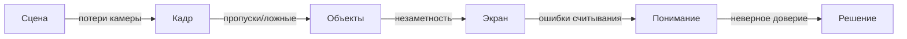

---

## 9. Количественная модель цепочки

Здесь переходим к тому, чего требует преподаватель: **считать**.

### 9.1. Обозначения

Обозначим звенья индексами:

- $a_1$ — вероятность сохранения информации на захвате;
- $a_2$ — точность детектора (доля верных обнаружений);
- $a_3$ — вероятность правильного восприятия представления;
- $a_4$ — вероятность правильного решения оператора.

### 9.2. Итоговая точность цепочки

Если звенья независимы, итоговая вероятность правильного результата:

$$A = \prod_{i=1}^{n} a_i$$

Это прямо отвечает на вопрос преподавателя: «где теряется 20%».

### 9.3. Вклад звена в потерю

Вклад звена $i$ в относительную потерю:

$$\ell_i = \frac{1 - a_i}{\sum_j (1 - a_j)}$$

Это показывает, какое звено «виновато» больше всех.

### 9.4. Пример с числами

Пусть $a_1 = 0.98$, $a_2 = 0.80$, $a_3 = 0.90$, $a_4 = 0.95$. Тогда:

- $A = 0.98 \cdot 0.80 \cdot 0.90 \cdot 0.95 \approx 0.670$;
- общая потеря ≈ 33%;
- вклад детектора: $(1-0.80)/0.37 \approx 0.54$ — то есть **больше
  половины всех потерь приходится на детектор**.

Вывод: улучшать представление ($a_3$) полезно, но потолок задаёт
детектор. Отсюда — требование показать уверенность, чтобы оператор
компенсировал слабое звено.

### 9.5. Учёт уверенности детектора (байесовский взгляд)

Вероятность правильного класса при уверенности $p$ (идеально
калиброванной) равна $p$. Если калибровка нарушена, то оператор
переоценивает/недооценивает. Мера калибровки:

$$\mathrm{ECE} = \sum_m \frac{|B_m|}{n}\,\big|\mathrm{acc}(B_m) - \mathrm{conf}(B_m)\big|$$

Чем выше ECE, тем опаснее показывать уверенность «как есть» без
пояснения.

### 9.6. Разделение ошибок (теория обнаружения сигналов)

Для аномалий/объектов:

$$d' = z(H) - z(F), \qquad c = -\tfrac{1}{2}\big(z(H)+z(F)\big)$$

где $H$ — доля попаданий, $F$ — доля ложных тревог. Это даёт
формальную меру «различимости сигнала на фоне шума».

### 9.7. Ошибка решения оператора

Итоговая вероятность правильного решения с учётом представления:

$$P_{\text{верно}} = a_1 a_2 \, f_{\text{предст}}(\cdot) \, a_4$$

где $f_{\text{предст}}$ — вклад представления (например, как отображается
уверенность и ошибки).

### 9.8. Что это даёт для обоснования

- можно **сравнить варианты представления**: у каждого своя $a_3$;
- обоснование = «вариант X даёт $a_3$ выше, потому что …»;
- числа показывают, **где** узкое место и **почему** выбранное
  представление помогает.

### 9.9. Диаграмма расчёта

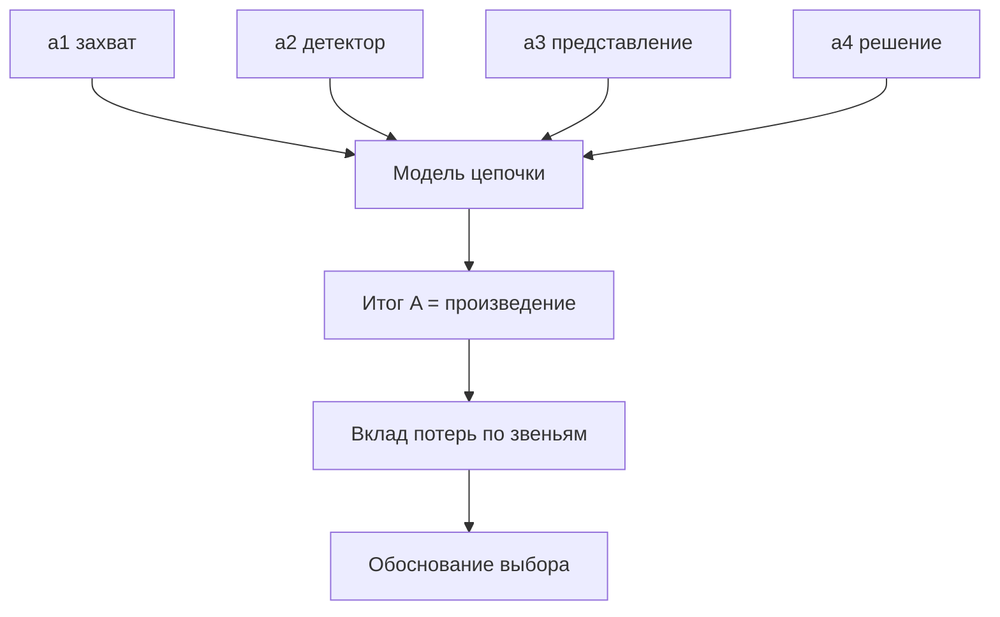

---

## 10. Что меняется в постановке

### 10.1. Было (до консультации)

- объект — «представление результатов распознавания»;
- метод — сравнение форм, опора на принципы;
- оценка — предполагалась экспертная/принципиальная.

### 10.2. Стало (после консультации)

- объект — **процесс/цепочка** (или её часть) представления результата;
- метод — **расчёт по модели** информационной цепочки;
- оценка — **числа**: где теряется точность, вклад звеньев;
- эксперимент — **проверка** в конце, не основание.

### 10.3. Таблица «было / стало»

| Аспект | Было | Стало |
|---|---|---|
| Основание | принципы, сравнение | модель + расчёт |
| Роль экспертов | предполагалась | исключена |
| Роль эксперимента | основа | проверка |
| Результат | «какой вариант лучше» | «где теряется и почему» |
| Критерий | качественный | численный |

### 10.4. Схема перехода

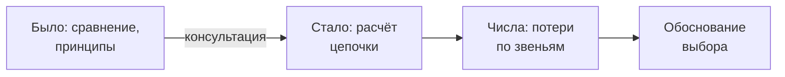

---

## 11. План работ: теория → модель → проверка

### 11.1. Этап 1. Теория

- описать цепочку и звенья;
- определить, что считать точностью на каждом звене;
- собрать модель задачи.

### 11.2. Этап 2. Модель и расчёт

- записать формулы пропуска точности по звеньям;
- подставить числа (из литературы/параметров);
- посчитать потери и вклады;
- показать, где узкое место.

### 11.3. Этап 3. Представление

- предложить вариант представления, компенсирующий слабое звено;
- посчитать, как меняется итоговая точность.

### 11.4. Этап 4. Проверка (практика)

- эксперимент/стенд — как подтверждение расчёта;
- сопоставить расчёт и опыт.

### 11.5. Диаграмма плана

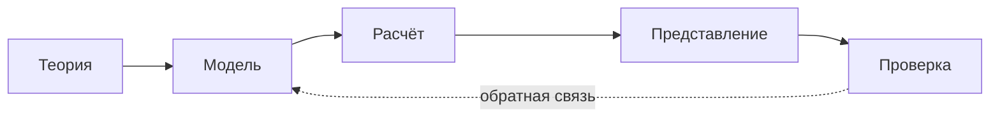

### 11.6. Критерий готовности каждого этапа

| Этап | Признак готовности |
|---|---|
| Теория | описаны звенья и их показатели |
| Модель | есть формулы связи |
| Расчёт | есть числа и вклады |
| Представление | есть вариант и расчёт эффекта |
| Проверка | сопоставление с опытом |

---

## 12. Роль научного руководителя

### 12.1. Совет преподавателя

«С Антоном Игоревичем посоветуйся. Всё будет — это маленькая задача».
Преподаватель допускает сужение задачи и направляет к научруку.

### 12.2. Что согласовать с научруком

| Вопрос | Зачем |
|---|---|
| Какую часть цепочки берём | объём задачи |
| Откуда числа для звеньев | источники параметров |
| Формат результата | расчёт/модель |
| Связь с дипломом | общая постановка |

### 12.3. Схема взаимодействия

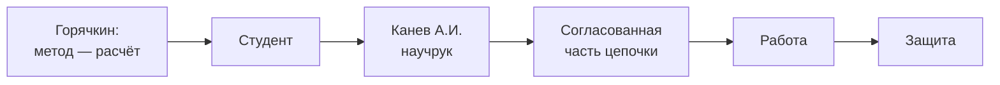

---

## 13. Открытые вопросы

1. Какую **часть цепочки** берём (всю или звено)?
2. Откуда берём числовые параметры звеньев (литература, датасеты)?
3. Какое звено считать «представлением» и как его измерять?
4. Как формально связать детектор (уверенность) с решением оператора?
5. Нужен ли эксперимент в конце и в каком объёме?
6. Достаточно ли расчёта по модели без испытаний с людьми?

---

## 14. Административные вопросы (подписи, заключения)

В конце записи обсуждались организационные вещи: подписи под документом,
заключения, кто и когда подписывает. Отмечено, что «отправленные
заключения не принимают» — то есть документы нужно оформлять
непосредственно, лично. Возможно, речь о статьях/заключениях, а не о КР.
Это не относится к содержанию работы, но требует внимания при оформлении.

---

## 15. Математические основания и модели

Этот раздел — заготовка для «расчёта по модели», которого требует
преподаватель. Модели дают числа, которыми обосновывается представление.

### 15.1. Формулы

| Модель | Формула | Что даёт |
|---|---|---|
| Пропуск точности по цепочке | $A = \prod_{i=1}^{n} a_i$ | итоговая точность |
| Вклад звена в потерю | $\ell_i = \dfrac{1-a_i}{\sum_j (1-a_j)}$ | где узкое место |
| Теория обнаружения сигналов | $d' = z(H) - z(F)$; $c = -\tfrac{1}{2}(z(H)+z(F))$ | сигнал vs шум |
| Калибровка уверенности | $\mathrm{ECE} = \sum_m \tfrac{|B_m|}{n}\,|\,\mathrm{acc}-\mathrm{conf}\,|$ | правдивость уверенности |
| Brier score | $BS = \tfrac{1}{N}\sum_i (f_i - o_i)^2$ | качество вероятностей |
| Энтропия Шеннона | $H = -\sum_i p_i \log_2 p_i$ | неопределённость класса |
| Закон Хика–Хаймана | $RT = a + b\,\log_2(n+1)$ | время выбора от числа вариантов |
| Закон Фиттса | $MT = a + b\,\log_2(A/W + 1)$ | наведение на цель/метку |
| Закон Вебера (JND) | $\Delta I / I = k$ | различимость |
| Визуальный угол | $\theta = 2\arctan(h/2d)$ | размер/дистанция знака |
| Цветовое различие CIE | $\Delta E_{00}$ | различимость цветов |
| Контраст WCAG | $(L_1+0.05)/(L_2+0.05)$ | читаемость |
| Возраст информации | $\Delta(t) = t - u(t)$ | свежесть данных |
| Рабочая память | $7\pm2$ / $4\pm1$ | предел числа объектов |

### 15.2. Что какая модель обосновывает

| Показатель представления | Модель | Источник |
|---|---|---|
| Однозначность класса | энтропия | Shannon, 1948 |
| Наглядность уверенности | ECE / Brier | Guo et al., 2017; Brier, 1950 |
| Ошибки (пропуск/ложное) | SDT | Green & Swets, 1966 |
| Различимость | Вебер / CIE | Weber; CIE, 2000 |
| Время считывания | Хик / Фиттс | Hick, 1952; Fitts, 1954 |
| Нагрузка | Миллер / Коуэн | Miller, 1956; Cowan, 2001 |
| Свежесть | Age of Information | Kaul et al. |
| Прогноз | ситуационная осведомлённость | Endsley, 1995 |

### 15.3. Схема «модели → числа → обоснование»

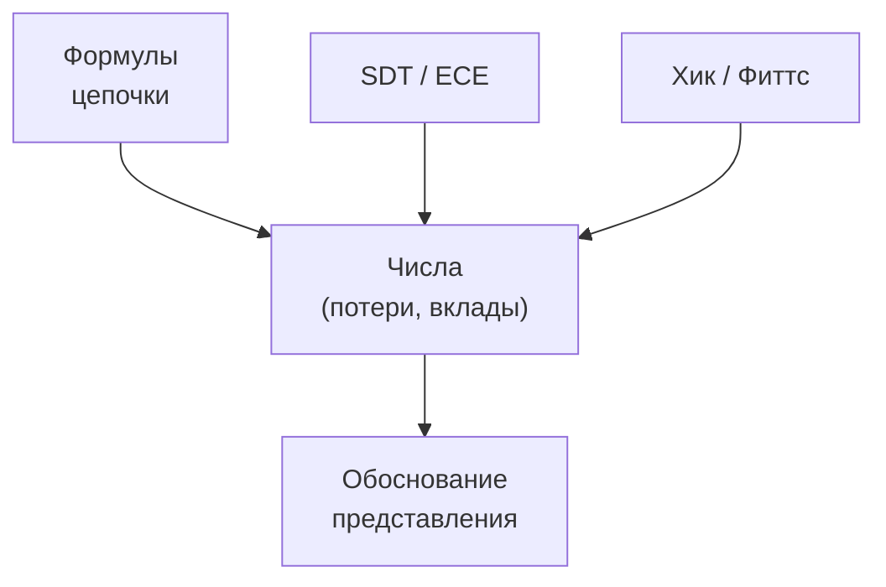

### 15.4. Стандарты

- **ГОСТ Р ИСО 9241** (эргономика взаимодействия человек–система).
- **ГОСТ Р ИСО 6385-2007** — эргономические принципы.
- **ГОСТ 21829-76**, **ГОСТ Р 50923-96**, **ГОСТ Р 50948-2001**.
- **ISO 9241-3/-303**, **ISO 9355**.
- **MIL-STD-1472**, **ANSI/HFES 100**, **WCAG 2.1**.
- **ISA-18.2 / IEC 62682** — управление сигнализацией.

---

## 16. Разобранный пример по шагам

Покажем, как может выглядеть «расчёт цепочки» на условных числах. Этот
пример — шаблон для будущей работы.

### 16.1. Исходные данные

| Звено | Показатель | Значение |
|---|---|---|
| Захват | сохранение | 0.98 |
| Детектор | точность | 0.80 |
| Представление | правильное восприятие | 0.90 |
| Решение | правильность | 0.95 |

### 16.2. Расчёт итога

$$A = 0.98 \cdot 0.80 \cdot 0.90 \cdot 0.95 \approx 0.67$$

### 16.3. Расчёт вкладов

Потери по звеньям: 0.02, 0.20, 0.10, 0.05; сумма 0.37.

| Звено | Потеря | Вклад |
|---|---|---|
| Захват | 0.02 | 5% |
| Детектор | 0.20 | 54% |
| Представление | 0.10 | 27% |
| Решение | 0.05 | 14% |

### 16.4. Вывод

Больше половины потерь — на детекторе. Значит:
- улучшать представление полезно, но потолок задаёт детектор;
- представление должно **показать уверенность**, чтобы оператор
  компенсировал слабое звено;
- обоснование: «вариант с индикацией уверенности повышает $a_3$».

### 16.5. Проверка чувствительности

| Изменение | Итог $A$ | Комментарий |
|---|---|---|
| база | 0.67 | — |
| $a_3$ 0.90 → 0.95 | 0.71 | представление помогает |
| $a_2$ 0.80 → 0.90 | 0.75 | детектор влияет сильнее |
| оба | 0.80 | синергия |

### 16.6. Диаграмма примера

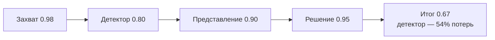

---

## 17. Риски и ограничения

### 17.1. Риски

| Риск | Вероятность | Влияние | Митигация |
|---|---|---|---|
| Числа звеньев негде взять | средняя | высокое | опора на литературу/датасеты |
| Модель сочтут слишком простой | средняя | среднее | обосновать допущения |
| Смешение с техникой детектора | средняя | высокое | акцент на представлении |
| Эксперимент вытеснит теорию | низкая | среднее | сначала модель, потом опыт |
| Не согласовано с научруком | средняя | высокое | согласовать часть цепочки |

### 17.2. Ограничения

- модель предполагает независимость звеньев (допущение);
- реальные значения $a_i$ требуют измерений или литературы;
- представление в модели — один коэффициент, его надо раскрыть.

### 17.3. Дерево рисков

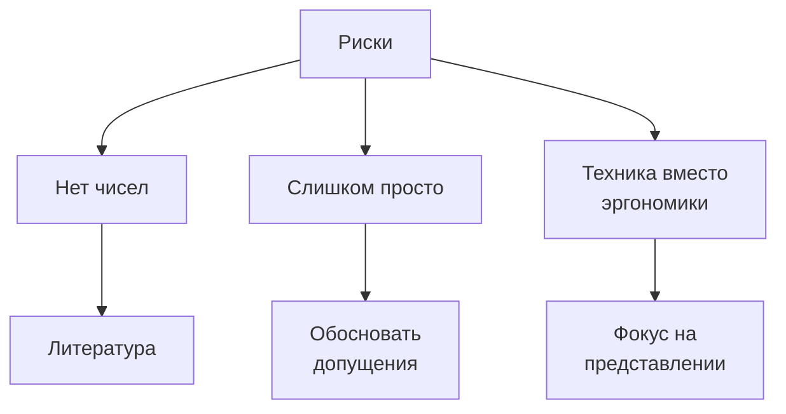

---

## 18. Возможные возражения и ответы

### 18.1. «Это же просто перемножение»

Ответ: перемножение — минимальная модель; её ценность в том, что она
показывает **где** узкое место. Далее звенья раскрываются (SDT, ECE).

### 18.2. «Откуда числа?»

Ответ: из литературы (точность детекторов), из норм (различимость,
время), из датасетов; для представления — из моделей восприятия.

### 18.3. «А где эргономика?»

Ответ: звено «представление → оператор»; именно оно описывает, как форма
подачи влияет на $a_3$ и итоговое решение.

### 18.4. «Почему не эксперимент?»

Ответ: эксперимент — проверка; основание — расчёт. Сначала модель.

### 18.5. «Модель не учитывает всё»

Ответ: это нормально; модель упрощает, но даёт числа и основание,
чего не дают слова «удобнее».

### 18.6. Схема вопросов-ответов

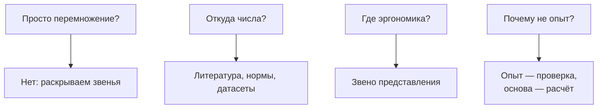

---

## 19. Связь с дипломом

Диплом связан с управлением шагающим роботом и распознаванием объектов.
КР даёт **эргономическую часть**: как результат распознавания подаётся
оператору и как это влияет на его решение. Расчёт цепочки — мост между
технической частью диплома и эргономикой.

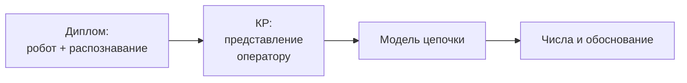

---

## 20. Следующие шаги (кратко)

1. Выбрать часть цепочки.
2. Описать звенья и их показатели.
3. Записать формулы пропуска точности.
4. Подставить числа, посчитать потери и вклады.
5. Предложить представление и посчитать его эффект.
6. Согласовать с научруком.
7. Продумать проверку (эксперимент) в конце.

---

## 21. Детализация: объект «аварийные сигналы»

Один из трёх объектов преподавателя — аварийные сигналы и их
представление. Разберём подробно, потому что это близко к теме
распознавания (ошибки детекции — тоже своего рода сигнал).

### 21.1. Что такое аварийный сигнал

Сигнал — это сообщение оператору о том, что состояние вышло за норму
(объект не распознан, уверенность низкая, потеря связи и т. п.).

### 21.2. Свойства сигнала

| Свойство | Значение |
|---|---|
| Тип | световой / звуковой / текстовый |
| Приоритет | авария / предупреждение / информация |
| Место | где на экране показан |
| Заметность | цвет, размер, мигание |

### 21.3. Проблемы сигнализации

- **перегрузка** сигналами (слишком много);
- **привыкание** (оператор перестаёт замечать);
- **ложные тревоги** (доверие падает);
- **пропуск** (нет сигнала там, где нужен).

### 21.4. Модель сигнала

Вероятность, что оператор заметит сигнал, зависит от заметности и
нагрузки. Формально это можно связать с $d'$ (различимость) и с числом
одновременных сигналов (рабочая память $7\pm2$).

### 21.5. Схема сигнала

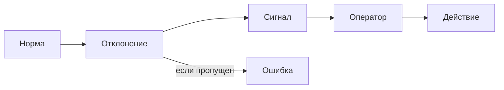

---

## 22. Детализация: объект «деятельность оператора»

Второй объект — операторская деятельность. Разберём по этапам.

### 22.1. Этапы деятельности

1. Восприятие информации с экрана.
2. Понимание (что происходит).
3. Оценка (насколько критично).
4. Решение (что делать).
5. Действие.

### 22.2. Где теряется точность

| Этап | Возможная потеря |
|---|---|
| Восприятие | не заметил объект |
| Понимание | неверно понял класс |
| Оценка | неверно оценил опасность |
| Решение | выбрал не то действие |
| Действие | ошибся при исполнении |

### 22.3. Формализация

Каждый этап — множитель в цепочке:

$$a_{\text{оп}} = a_{\text{воспр}} \cdot a_{\text{поним}} \cdot a_{\text{оцен}} \cdot a_{\text{реш}}$$

### 22.4. Схема деятельности

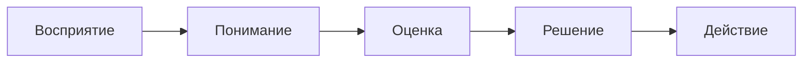

---

## 23. Как измерять показатели звеньев

Чтобы модель наполнить числами, нужны источники данных. Ниже — варианты
без испытаний с людьми (как требует преподаватель).

### 23.1. Из литературы и норм

- точность детекторов — из публикаций по YOLO и датасетам;
- различимость, время — из эргономических норм;
- лимиты внимания — из работ по рабочей памяти.

### 23.2. Из данных проекта

- уверенность детектора (confidence), порог;
- число объектов на кадре;
- частота кадров (влияет на свежесть и пропуски).

### 23.3. Из модели

- потери по звеньям — расчёт;
- вклады звеньев — расчёт;
- итоговая точность — расчёт.

### 23.4. Таблица источников

| Показатель | Источник | Примечание |
|---|---|---|
| Точность детектора | литература/датасет | без наших измерений |
| Время считывания | нормы/литература | Хик/Фиттс |
| Различимость | нормы | Вебер/CIE |
| Нагрузка | литература | Миллер/Коуэн |
| Свежесть | параметры системы | fps |

### 23.5. Схема источников

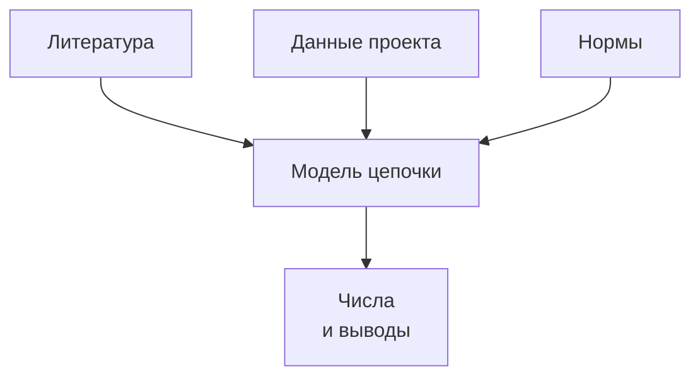

---

## 24. Резюме ключевых чисел (заготовка таблицы для РПЗ)

| Величина | Обозначение | Значение (пример) |
|---|---|---|
| Точность захвата | $a_1$ | 0.98 |
| Точность детектора | $a_2$ | 0.80 |
| Восприятие представления | $a_3$ | 0.90 |
| Правильность решения | $a_4$ | 0.95 |
| Итоговая точность | $A$ | 0.67 |
| Доля потерь детектора | $\ell_2$ | 0.54 |

Эту таблицу предстоит наполнить реальными значениями и обосновать.

---

## Приложение A. Очищенные цитаты

### A.1. О смешивании

> «Давайте не будем смешивать — сначала с одним закончим, потом другой».

### A.2. Об обосновании

> «Что значит эргономическое обоснование? Обосновать — значит доказать,
> на каком основании».

### A.3. О расчёте цепочки

> «Вот у тебя цепочка. Посчитай по этой цепочке, где теряется 20%,
> где 3%, где 5%».

### A.4. Об экспертизе

> «Это экспертиза, это эксперимент. У тебя нет фокусных групп.
> Это не наука».

### A.5. О статистике

> «Вы собрали статистику, построили графики, посчитали точность — но
> в этом нет анализа».

### A.6. О конкретике

> «Гипотетически здесь ничего не надо, занимаемся конкретикой».

### A.7. О задаче

> «Пусть это будет часть цепочки, но мне нужен анализ, который будет
> подтверждён без экспертизы».

### A.8. О научруке

> «С Антоном Игоревичем посоветуйся».

---

## Приложение B. Глоссарий

| Термин | Значение |
|---|---|
| КР | курсовая работа |
| РПЗ | расчётно-пояснительная записка |
| ЭА_СОиОИ | дисциплина (эргономика АСОИУ) |
| ЭО | эргономическое обеспечение |
| ИМ | информационная модель |
| ЧО | человек-оператор |
| СДП | системно-деятельностный подход |
| SDT | теория обнаружения сигналов |
| ECE | ошибка калибровки уверенности |
| AoI | возраст информации |
| цепочка | последовательность звеньев обработки информации |

---

## Приложение C. Чек-лист на следующую встречу

- [ ] Определить, какую часть цепочки берём
- [ ] Описать звенья и их показатели
- [ ] Записать формулы пропуска точности
- [ ] Подставить числа и посчитать потери
- [ ] Показать вклад каждого звена
- [ ] Предложить представление, компенсирующее слабое звено
- [ ] Посчитать эффект представления
- [ ] Согласовать с научруком
- [ ] Продумать проверку (эксперимент) в конце

---

## Итог

Консультация 06.10.2026 меняет **метод**, а не тему: вместо экспертных
оценок и эксперимента как основы — **расчёт информационной цепочки по
модели**, где показано, сколько точности теряется на каждом звене и
почему выбранное представление улучшает итоговый результат. Эксперимент
остаётся как проверка. Задача может быть частью цепочки, обязательно —
согласование с научным руководителем.
