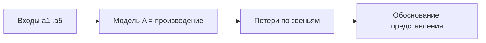
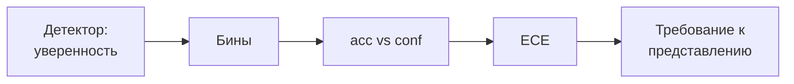

# План КР: расчёт информационной цепочки (ответы и план)

**Тема:** Эргономическое обоснование представления результатов
распознавания объектов оператору мобильного робота
**Дата:** 2026-10-09
**Статус:** черновик (на проверку и правку)
**Основание:** консультация 06.10.2026 (расчёт модели, без экспертов)
**Справка по теме:** см. `kr-brief.md`

---

## 1. Решения (ответы на 6 вопросов)

| №   | Вопрос                     | Решение                                                       |
| --- | -------------------------- | ------------------------------------------------------------- |
| 1   | Какую часть цепочки берём  | всю: кадр, камера, детектор, представление, оператор, решение |
| 2   | Откуда числа               | литература / датасет                                          |
| 3   | Формализация представления | % уверенности правильного ответа, F1-score и др. метрики      |
| 4   | Связь с ВКРМ               | прямая                                                        |
| 5   | Эксперимент                | в конце, Gazebo-симуляция                                     |
| 6   | Результат                  | расчёт/модель + рекомендации по представлению                 |

---

## 2. Модель цепочки (5 звеньев)

Звенья: захват → детектор → представление → оператор → решение.

Итоговая точность (звенья независимы):

$$A = \prod_{i=1}^{n} a_i = a_{cap}\cdot a_{det}\cdot a_{rep}\cdot a_{op}\cdot a_{dec}$$

Вклад звена в относительную потерю:

$$\ell_i = \frac{1 - a_i}{\sum_j (1 - a_j)}$$

**Пример** ($a_1=0.98$, $a_2=0.80$, $a_3=0.90$, $a_4=0.95$,
$a_5=0.95$):

- $A \approx 0.64$; общая потеря ≈ 36%;
- вклады: детектор ≈ 48%, представление ≈ 24%, оператор и решение —
  по ≈ 12%, захват ≈ 5%.

Вывод: потолок задаёт **детектор**, второе узкое место —
**представление** ($a_3$). Отсюда требование **показывать уверенность**,
чтобы оператор компенсировал слабое звено.

---

## 3. Калибровка (ECE) и различимость

### 3.1. Калибровка ECE — «правдивость уверенности»

Идея: детектор выдаёт уверенность (например, 0.8). **Калибровка** — это
совпадение уверенности с фактической долей верных ответов. Если детектор
говорит «0.8», а прав в 60% случаев — он **переуверен**.

Формула (Expected Calibration Error):

$$\mathrm{ECE} = \sum_m \frac{|B_m|}{n}\,\big|\mathrm{acc}(B_m) - \mathrm{conf}(B_m)\big|$$

где $B_m$ — доверительный интервал (бины по уверенности), acc —
фактическая точность в бине, conf — средняя уверенность в бине.

**Как выглядит** (reliability diagram, пример):

| Бин уверенности | Средняя уверенность | Фактическая точность | Разрыв (пере-уверенность) |
| --------------- | ------------------- | -------------------- | ------------------------- |
| 0.5–0.6         | 0.55                | 0.50                 | +0.05                     |
| 0.6–0.7         | 0.65                | 0.58                 | +0.07                     |
| 0.7–0.8         | 0.75                | 0.66                 | +0.09                     |
| 0.8–0.9         | 0.85                | 0.78                 | +0.07                     |
| 0.9–1.0         | 0.95                | 0.93                 | +0.02                     |

Если фактические точки лежат **ниже** диагонали — детектор переуверен
(оператор будет доверять ошибочно). ECE = средневзвешенный разрыв.

**Чем дополнить:**

- **MCE** (Maximum Calibration Error) — худший бин;
- **Brier score** — $BS = \frac{1}{N}\sum_i (f_i - o_i)^2$;
- способы калибровки: temperature scaling, isotonic/Platt.

### 3.2. Различимость — «можно ли уверенно считать сигнал»

Различимость — насколько оператор может отличить одно состояние
(класс/метку/индикатор) от другого. Основные модели:

| Модель                | Формула                   | Что задаёт                             |
| --------------------- | ------------------------- | -------------------------------------- |
| Закон Вебера (JND)    | $\Delta I / I = k$        | минимально различимое изменение        |
| Визуальный угол       | $\theta = 2\arctan(h/2d)$ | размер знака vs дистанция; порог ≈ 20′ |
| Цветовое различие CIE | $\Delta E_{00}$           | численная различимость цветов          |
| Контраст WCAG         | $(L_1+0.05)/(L_2+0.05)$   | порог читаемости 4.5:1                 |

Практические пороги:

- **$\Delta E_{00}$**: < 1 — неразличимо; 1–2 — заметно при близком взгляде;
  2–10 — заметно сразу; > 10 — разные цвета.
- **Контраст**: ≥ 4.5:1 — обычный текст; ≥ 3:1 — крупный.

**Как выглядит** (для меток детекции): цвет класса берётся с
$\Delta E_{00} \ge 10$ к соседним классам и к фону; толщина рамки — не
тоньше X px; высота шрифта метки — ≥ 20 угловых минут.

### 3.3. Что ещё стоит добавить в модель

| Значение              | Метрика                                     | Звено                    |
| --------------------- | ------------------------------------------- | ------------------------ |
| Качество детекции     | precision, recall, **F1**, mAP@0.5, AUC-ROC | детектор                 |
| Калибровка            | ECE, MCE, Brier                             | детектор → представление |
| Различимость          | $\Delta E_{00}$, контраст WCAG, угл. минуты | представление            |
| Различение сигнал/шум | SDT $d'$, критерий $c$, ROC                 | оператор                 |
| Время                 | Хик–Хайман, Фиттс                           | оператор                 |
| Нагрузка              | число объектов vs $7 \pm 2$                 | представление/оператор   |
| Свежесть              | Age of Information                          | камера → представление   |

**Вывод:** F1 — метрика **детектора**; для звена «представление» нужна
**своя** метрика (ECE + различимость). Их нельзя смешивать — иначе
«представление» окажется просто копией детектора.

---

## 4. Сколько звеньев — обоснование (5)

### 4.1. Варианты

| Вариант       | Звенья                                                   | Плюсы                               | Минусы                                                |
| ------------- | -------------------------------------------------------- | ----------------------------------- | ----------------------------------------------------- |
| 6 звеньев     | кадр, камера, детектор, представление, оператор, решение | полное соответствие сказанному      | кадр и камера — одна стадия; трудно разделить числами |
| **5 звеньев** | захват, детектор, представление, оператор, решение       | каждая стадия различима и обоснуема | «кадр+камера» объединены                              |
| 4 звена       | захват, детектор, представление, оператор+решение        | проще считать                       | теряется отдельный этап «решение»                     |

### 4.2. Рекомендация: **5 звеньев**

- **Захват** (кадр+камера) — одна физическая стадия: сенсор → изображение.
  Разделять «кадр» и «камеру» нечем: это один акт захвата;
- **Детектор** — метрики precision/recall/F1;
- **Представление** — ECE + различимость (ядро эргономики);
- **Оператор** — восприятие/понимание (SDT, время, нагрузка);
- **Решение** — итог.

Обоснование:

1. **Считаемость:** у каждой стадии есть свой источник чисел (датасет,
   нормы, литература). Для «кадра» и «камеры» отдельные числа взять негде.
2. **Прозрачность вклада:** 5 звеньев достаточно, чтобы показать, где
   теряется точность (требование преподавателя).
3. **Соответствие цели:** эргономика сосредоточена в «представление →
   оператор»; остальные звенья дают контекст и вклад.

> Если преподаватель настаивает на 6 — просто разделим захват на
> «кадр» и «камера» ($a_1$, $a_2$). Модель это выдержит.

---

## 5. Сравнение моделей распознавания (выбор детектора)

Стратегия: подобрать несколько моделей распознавания и выбрать лучшую
для звена **детектор** ($a_2$). Сравнение — по пиксельным метрикам на
общем датасете/сцене.

**Кандидаты:** детекторы (YOLO-семейство, RT-DETR) и сегментаторы
(YOLO-seg, Mask R-CNN).

**Метрики пиксельного распознавания:**

| Метрика          | Формула                                       | Что показывает         |
| ---------------- | --------------------------------------------- | ---------------------- |
| IoU / mask mAP   | $\mathrm{IoU} = \frac{\lvert A \cap B \rvert}{\lvert A \cup B \rvert}$ | совпадение масок/рамок |
| Pixel Accuracy   | $PA = \frac{N_{correct}}{N_{total}}$          | доля верных пикселей   |
| Dice / pixel F1  | $\mathrm{Dice} = \frac{2\lvert A \cap B \rvert}{\lvert A \rvert + \lvert B \rvert}$ | перекрытие по классу |
| Boundary F1      | $BF = \frac{2 P_b R_b}{P_b + R_b}$            | точность границ        |

Плюс стандартные: mAP@0.5, mAP@0.5:0.95, precision/recall/F1 и скорость
(fps).

**Протокол:** один датасет, одинаковые классы и пороги; замер метрик и
скорости; выбирается модель с лучшим балансом точность/скорость.

**Связь с моделью:** выбранная модель задаёт **$a_2$**; для КР это
входной параметр (эргономика — на $a_3$). Технические детали сравнения
относятся к ВКРМ.

---

## 6. План работ

### 6.1. Шаги

### 6.2. Этапы и результат

| Этап | Действие                                 | Результат             |
| ---- | ---------------------------------------- | --------------------- |
| 1    | Описать 5 звеньев и метрики              | таблица звеньев       |
| 2    | Записать формулы потерь                  | модель $A=\prod a_i$  |
| 3    | Собрать числа (датасет/литература/нормы) | таблица значений      |
| 4    | Посчитать потери и вклады                | где узкое место       |
| 5    | Варианты представления и их $a_3$        | сравнение             |
| 6    | Эксперимент в Gazebo                     | проверка расчёта      |
| 7    | Выводы и рекомендации                    | раздел РПЗ            |

### 6.3. Метрики по звеньям (сводно)

| Звено         | Коэф. | Метрика                           | Источник        |
| ------------- | ----- | --------------------------------- | --------------- |
| Захват        | $a_1$ | доля потерянных объектов          | параметры сцены |
| Детектор      | $a_2$ | F1, precision, recall, mAP        | датасет         |
| Представление | $a_3$ | ECE, $\Delta E_{00}$, контраст    | нормы + модель  |
| Оператор      | $a_4$ | $d'$, время (Хик/Фиттс), нагрузка | литература      |
| Решение       | $a_5$ | вероятность верного решения       | модель          |

### 6.4. Связь с ВКРМ

- ВКРМ: Go2, Gazebo/Isaac, YOLO-детектор (`quadropted_perception`),
  `gazebo_sim`.
- КР: эргономическая часть — модель цепочки + рекомендации по
  представлению.

### 6.5. Эксперимент в Gazebo

- прогнать сцену, записать детекции (класс, confidence, bbox/маска);
- посчитать фактические ошибки и метрики (см. §5);
- сравнить с моделью (совпал/не совпал расчёт).

### 6.6. Результат

- расчёт (числа по звеньям, вклады) + рекомендации по представлению.

---

## 7. Что предстоит согласовать

- [ ] Оставляем 5 звеньев или возвращаемся к 6?
- [ ] Метрика представления: ECE + различимость (не F1) — согласны?
- [ ] Набор дополнительных метрик (см. 3.3).
- [ ] Числа для «захвата» — брать из параметров сцены или зафиксировать?
- [ ] Набор моделей и метрик для сравнения (см. §5).
- [ ] Объём Gazebo-эксперимента (число прогонов).

---

## 8. Вопросы к научруку

- Какую часть цепочки берём (весь процесс или звено
  «представление → оператор»)?
- Откуда числа для звеньев (литература, датасет, нормы)?
- Как формализовать именно звено представления?
- Какие модели и метрики сравнивать для выбора детектора?
- Нужен ли эксперимент и в каком объёме?
