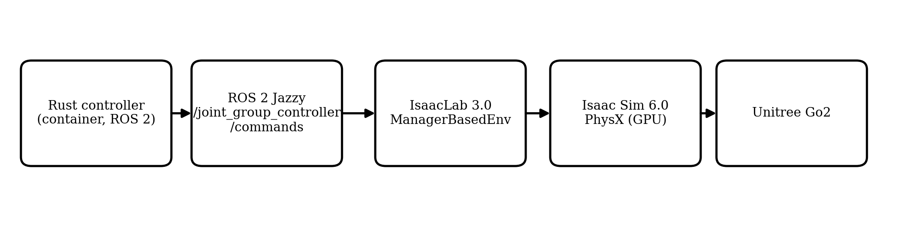
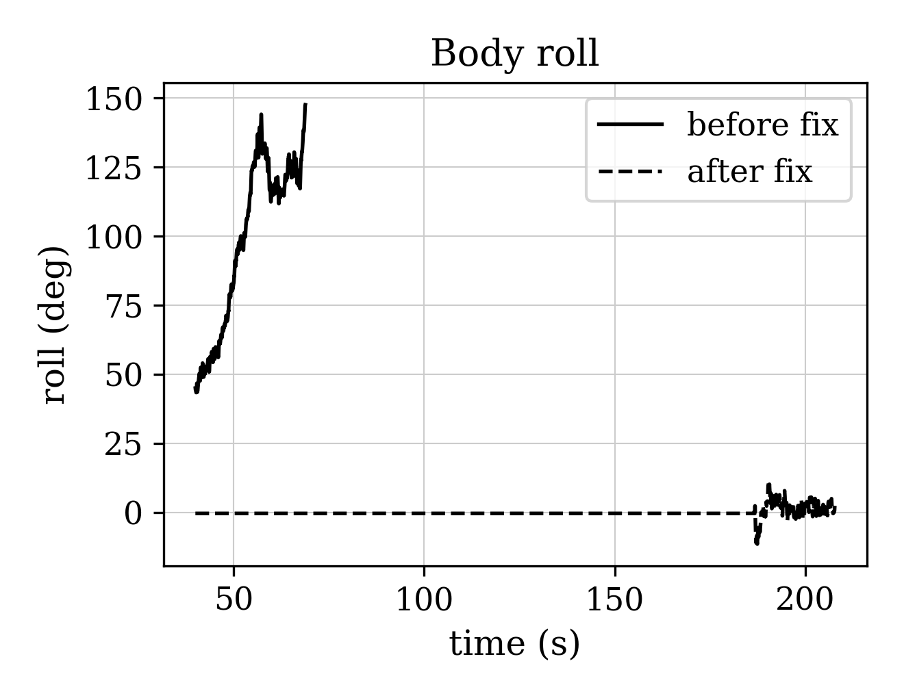
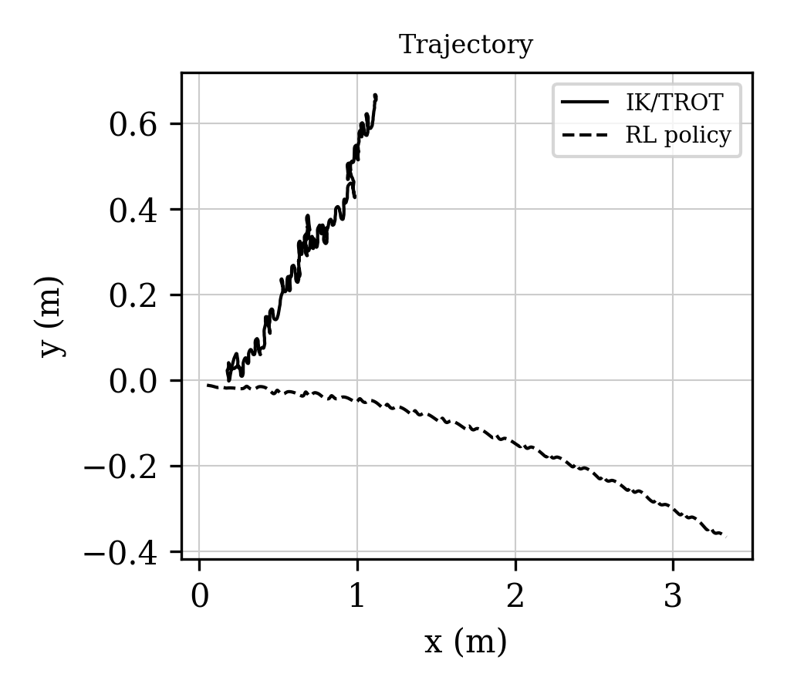
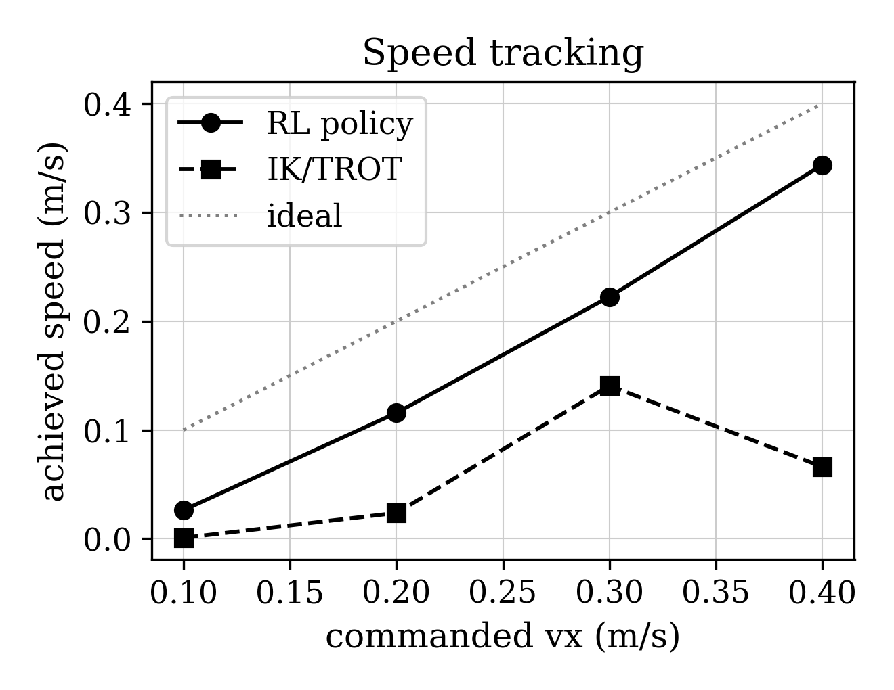

# Comparing a Learned Policy and a Model-Based IK/TROT Controller for Quadruped Locomotion in Isaac Sim

**A. V. Papin**
Bauman Moscow State Technical University
Moscow, Russia
papinav@student.bmstu.ru

---

## Abstract

Quadruped robots are increasingly used in inspection, logistics, and
search-and-rescue, and their development relies heavily on physics
simulation. We compare two different locomotion-control
paradigms for the Unitree Go2 quadruped: a pre-trained
reinforcement-learning (RL) policy distributed with NVIDIA Isaac Sim,
and a classical model-based controller that implements a TROT gait
generator with analytic inverse kinematics (IK), written in Rust and
integrated through ROS 2. Both controllers drive the robot through the same
low-level joint-position interface, emulating the robot's native
low-level mode. Experiments in Isaac Sim 6.0 with IsaacLab 3.0, with
three runs per controller at a commanded speed of 0.3 m/s, show that both
paradigms walk at comparable speed (model-based 0.215 m/s, RL 0.231 m/s)
and comparable cost of transport (2.83 vs 2.84). The RL policy is markedly
more stable (maximum roll 2.3° vs 27.8°, lateral drift 0.37 m vs 1.09 m)
and tracks the commanded velocity over the full range 0.1–0.4 m/s, whereas
the model-based controller is stable only near 0.3 m/s. Conversely, the
model-based controller holds body height more tightly (standard deviation
0.025 m vs 0.040 m) and is fully deterministic, requiring no GPU training
and no learned weights. We also report five concrete integration defects
found and fixed in the model-based controller, and show that it was
unpredictably coupled to real time, while the RL policy is not. The
model-based controller is a transparent baseline and a reliable fallback.

**Keywords** — quadruped robot, Isaac Sim, inverse kinematics, TROT gait,
reinforcement learning, locomotion control (key words)

---

## Introduction

Legged robots are attractive where wheeled platforms are ineffective:
inspection of unstructured environments, search and rescue, logistics, and
operation on rough terrain. Among commercially available quadrupeds, the
Unitree Go2 [1] is widely used in research because of its open low-level
control interface, its SDK, and the availability of simulation assets.
Developing and validating locomotion controllers requires physics
simulation; NVIDIA Isaac Sim and IsaacLab [2], [3] have become a de-facto
standard for GPU-accelerated training and testing of legged robots.

Two fundamentally different paradigms are used to control walking. The
first is **learned policies**: a neural network maps observations to joint
commands [4]–[7]. Such policies are flexible and can handle complex
terrain, but they require GPU training, behave as a black box, generalize
poorly outside the training distribution, and do not always recover after a
fall. The second is **model-based control**: deterministic algorithms that
combine a gait generator with inverse kinematics [8]–[11], often with
an inertial attitude-compensation loop. Model-based controllers are
transparent and can run on a CPU, but they are less adaptive to unexpected
disturbances.

Direct comparisons of the two paradigms in a single simulator, on a single
robot, and through a single interface remain rare. The closest work [12]
compares model-predictive control (MPC) and RL in MuJoCo on the Unitree
Go1. Our work differs in three ways: the model-based controller is an
analytic IK/TROT controller (not MPC), the environment is Isaac Sim /
IsaacLab (not MuJoCo), and the robot is the Unitree Go2 with the official
NVIDIA RL policy. Other work trains RL policies for the Go1 with domain
randomization and transfers them to hardware [13]; the comparison there is
against the built-in controller. Kine2Go [14] provides a kinematic dataset
for the Go2 and confirms the popularity of the platform, but does not
compare against a model-based controller.

The contributions of this paper are: (1) the implementation of a
model-based IK/TROT controller in Rust and its integration with Isaac Sim
through IsaacLab and ROS 2; (2) a direct comparison against the official
NVIDIA RL policy on a single asset and through one low-level joint
interface; (3) a set of practical integration patterns (joint re-mapping,
angle convention calibration, amplitude limiting, and time-base
correction); (4) a quantitative evaluation of stability, body height,
speed, lateral drift, energy, and the operating range of both paradigms;
and (5) a reproducible finding that the model-based controller was coupled
to real time, whereas the learned policy was not.

### Problem Statement and Research Questions

Given a single quadruped (Unitree Go2), a single simulator (Isaac Sim /
IsaacLab), and a single low-level joint-position interface, we address the
following questions:

- **RQ1.** How do a pre-trained RL policy and a hand-tuned IK/TROT
  controller compare in speed, body-height stability, roll, lateral drift,
  and cost of transport on flat terrain?
- **RQ2.** What is the operating range of each controller in commanded
  speed?
- **RQ3.** Is the model-based controller's behavior reproducible, or is it
  coupled to the simulator's real-time performance?
- **RQ4.** What are the practical integration defects that must be
  addressed to run a model-based controller through a modern
  GPU-accelerated simulator, and what is the limit of a simple
  proportional attitude stabilizer?

## Theory

This section presents the theory behind the implemented system. It first
describes the overall architecture and the two controllers, then summarizes
the practical integration problems and the telemetry used for the
evaluation. The emphasis is on the model-based controller, which is the
subject of this work, and on the points where it differs from the learned
policy.

### System Architecture

The system consists of a Rust controller running in a container, a ROS 2
bridge, and the IsaacLab environment:

**Fig. 1.** System architecture.

The controller publishes twelve joint-position targets as a
`std_msgs/Float64MultiArray`. IsaacLab applies them through position
actuators with a proportional–derivative law, emulating the low-level mode
of the real robot. The RL path uses the same asset and the same
joint-position interface; the policy is a TorchScript model executed inside
the simulator.

### Robot and Actuation

The Unitree Go2 has twelve actuated joints: four legs (front-right,
front-left, rear-right, rear-left), each with a hip (ab/adduction), a
thigh, and a calf joint. Control is performed through target joint
positions and a PD law; the model-based controller uses stiffness 75 and
damping 0.5, while the NVIDIA policy uses stiffness 25 and damping 0.5, as
specified by its environment configuration.

### Mathematical Formulation

The metrics and control relations used in this work are summarized below.

Stance foot velocity:

$$v_{\mathrm{st}} = -\frac{\mathrm{step\_dist}}{4\,dt\,\tau_{\mathrm{st}}} \tag{1}$$

where $\mathrm{step\_dist}$ is the commanded stride distance, $dt$ is the
control time step, and $\tau_{\mathrm{st}}$ is the stance duration.

Joint torque estimate:

$$\tau_i = k_p\,(q_i^{\mathrm{cmd}} - q_i) - k_d\,\dot{q}_i \tag{2}$$

where $q_i^{\mathrm{cmd}}$ is the commanded joint angle, $q_i$ is the
measured angle, $\dot{q}_i$ is the joint velocity, and $k_p$ and $k_d$ are
the stiffness and damping gains.

Cost of transport:

$$\mathrm{CoT} = \frac{E}{m\,g\,d} \tag{3}$$

where $E$ is the mechanical energy, $m$ is the robot mass, $g$ is the
gravitational acceleration, and $d$ is the distance travelled.

Capture point:

$$y_{\mathrm{foot}} = y_{\mathrm{cm}} + \frac{v_y}{\omega},
\qquad \omega = \sqrt{\frac{g}{h}} \tag{4}$$

where $y_{\mathrm{foot}}$ is the required foot placement, $y_{\mathrm{cm}}$
is the center-of-mass position, $v_y$ is the lateral velocity, $g$ is the
gravitational acceleration, and $h$ is the center-of-mass height.

Positive-feedback mode of the roll loop:

$$\dot{\varphi} = \alpha\,\varphi \tag{5}$$

where $\varphi$ is the body roll and $\alpha$ is the growth rate of the
unstable mode caused by the hip coupling.

### Model-Based IK/TROT Controller

The controller is a finite-state machine with REST, STAND, and TROT
states. The TROT generator drives two diagonal pairs in antiphase (FR–RL
and FL–RR) with stance and swing phases and a double-support phase. Foot
trajectories are generated in the body frame: during stance the foot is
fixed in the world and therefore moves backwards in the body frame at the
commanded velocity; during swing a Raibert-style heuristic [8] places the
foot at the neutral point shifted by the velocity. The foot positions are
converted to joint angles by an analytic inverse-kinematics solution using
the Go2 link lengths (thigh and calf 0.213 m).

An attitude-compensation loop uses the IMU orientation to keep the feet
level: the pitch error is compensated by rotating the feet about the
lateral axis, and the roll error by a differential leg-length adjustment,
which avoids driving the hip joints into saturation. A proportional
yaw-stabilization term keeps the heading fixed.

### Learned RL Policy

The RL baseline is the pre-trained NVIDIA policy distributed with Isaac
Sim [15]. Its observation is a 48-dimensional vector (base linear and
angular velocity in the body frame, gravity direction, commanded
velocities, joint position error from the default, joint velocities, and
the previous action). The policy outputs twelve actions at a decimated
rate, which are converted to joint-position targets. The policy is
executed step-by-step, so its behavior does not depend on wall-clock time.

### Practical Problems and Their Solutions

Five concrete defects were found and fixed, each confirmed by telemetry
(125 columns: pose, angles, velocities, torques, foot positions and
contacts):

1. **Stance foot drift.** The stance foot velocity was computed as
   $-\frac{\mathrm{step\_dist}}{4\,dt\,\tau_{\mathrm{st}}}$, where `stance_ticks` is the length
   of one stance phase, whereas the leg is on the ground for several phases
   in a row. The foot drifted backwards (up to −1.2 m) and the IK saturated
   (`calf = 0`). It was replaced by the physically correct velocity,
   Eq. (1) with v_st = -cmd_vel.
2. **IMU compensation accumulation.** The compensation was applied
   incrementally to the gait state, so the tilt accumulated. It is now
   applied only to the copy used for IK.
3. **Inverted IMU sign.** The compensation used `R(-comp)` instead of
   `R(comp)`, amplifying the tilt. After correction, roll dropped from a
   full flip (180°) to about 8°.
4. **Inverted yaw sign.** The yaw stabilization used `-0.5·yaw_err`, which
   spun the robot up. With `+0.5·yaw_err` the heading is maintained.
5. **Wall-clock PID.** After switching the controller to a simulation-time
   step, the PID still used wall-clock `dt`, causing a mismatch in the
   integral and derivative terms.

A structural defect was also identified: compensating the roll by rotating
the feet created a positive feedback loop through the hip joints. The roll
is now compensated by a differential leg length, which does not actuate the
hip; the roll dropped from 50° to about 8° (Fig. 2).

**Fig. 2.** Body roll over time before (solid) and after (dashed) the differential leg-length fix.

### Telemetry and Reproducibility

A unified telemetry system records 125 quantities per physics step in CSV
format: the body pose and orientation, linear and angular velocities in the
world and body frames, accelerations and the gravity direction, commanded
velocities and the controller mode, world positions and contacts of the
four feet, angles and velocities of the twelve joints, an estimate of the
joint torques, instantaneous powers and accumulated energy, joint tracking
errors, and flags for falls, hip saturation, and NaNs. The same format is
used for both controllers. The joint torque is estimated by Eq. (2); the energy is the integral of the
sum of joint powers, and the cost of transport is given by Eq. (3). To remove the
influence of performance, the model-based controller steps on simulation
time, published by the environment on a dedicated topic, which makes its
behavior deterministic and independent of the frame rate.

## Experimental Results

This section reports the experimental comparison of the two controllers.
We first describe the setup and the metrics, then present the results of
forward walking, the operating range in commanded speed, additional
metrics, and the failure taxonomy with the negative results. All numbers
are reported as the mean and standard deviation over three runs unless
stated otherwise.

### Setup

The simulator is Isaac Sim 6.0.1 with IsaacLab 3.0 on an Ubuntu 26.04
workstation with an NVIDIA RTX 5070 Ti GPU. The terrain is a flat plane
with a friction coefficient of 1.0. The robot is the Unitree Go2 with the
IsaacLab asset. The commanded velocity is 0.3 m/s (with a sweep from 0.1
to 0.4 m/s). Each controller was run three times; telemetry was recorded at
the physics rate.

### Metrics

To compare the two controllers objectively we use a set of kinematic and
energetic metrics computed from the recorded telemetry. The distance
travelled and the mean speed characterize the locomotion performance; the
mean and standard deviation of the body height quantify how steadily the
robot holds its posture; the maximum roll and pitch quantify the body
attitude; the lateral drift quantifies how well the controller keeps a
straight line; the cost of transport (CoT) quantifies the energy
efficiency; and the time to reach a steady gait quantifies the transient
response. All metrics are averaged over the three runs of each controller.

### Results

**Table 1. Forward walking (vx = 0.3 m/s, mean ± std, n = 3).**

| Metric | RL policy (NVIDIA) | IK/TROT (ours) |
|---|---|---|
| Mean body height (m) | 0.159 ± 0.000 | 0.235 ± 0.001 |
| Std of height (m) | 0.040 ± 0.000 | 0.025 ± 0.001 |
| Mean speed (m/s) | 0.231 ± 0.000 | 0.215 ± 0.012 |
| Distance (m) | 3.34 ± 0.00 (15 s) | 2.75 ± 0.12 (19.3 s) |
| Lateral drift (m) | 0.37 ± 0.00 | 1.09 ± 0.16 |
| Max roll (deg) | 2.3 ± 0.0 | 27.8 ± 3.7 |
| Max pitch (deg) | 4.1 ± 0.0 | 35.6 ± 0.0 * |
| Falls | none | none |
| CoT | 2.84 | 2.83 ± 0.41 |

\* the IK pitch maximum is a startup transient; the steady-state pitch is
about 2°. The RL policy is deterministic across runs (standard deviation
zero). The trajectories of the two controllers are compared in Fig. 3.

**Fig. 3.** Trajectory in the horizontal plane: model-based IK/TROT (solid) and RL policy (dashed).

**Table 2. Operating range (speed / roll / drift).**

| vx (m/s) | RL policy | IK/TROT |
|---|---|---|
| 0.1 | 0.026 / 2.6° / 0.09 m | 0.001 / 69° / 0.28 m |
| 0.2 | 0.116 / 3.6° / 0.21 m | 0.024 / 47° / 0.23 m |
| 0.3 | 0.222 / 2.3° / 0.37 m | 0.141 / 25° / 0.77 m |
| 0.4 | 0.344 / 3.0° / 0.80 m | 0.066 / 31° / 0.60 m |

The RL policy tracks the commanded velocity over the whole range with a
small roll, whereas the model-based controller is stable only near
0.3 m/s. The speed tracking of both controllers is shown in Fig. 4.

**Fig. 4.** Achieved speed versus commanded speed for the RL policy (circles) and the IK/TROT controller (squares); the dotted line is the ideal.

### Additional Metrics

The body jerk (root-mean-square of the derivative of the body-frame
acceleration) is high for the model-based controller (about 370, 580, and
620 m/s³ on the three axes), reflecting the impulsive stance/swing
transitions. The energy distribution across joint groups is about 8% in
the hip joints, 37% in the thigh joints, and 55% in the calf joints; the
calf joints dominate, consistent with their role in supporting and
propelling the body.

### Failure Taxonomy and Negative Results

**Table 3. Failure modes of the model-based controller.**

| Defect | Symptom | Root cause | Resolution |
|---|---|---|---|
| Stance foot drift | IK saturation (`calf=0`) | wrong velocity divisor | `velocity = -cmd_vel` |
| IMU accumulation | growing tilt | fed back into gait state | apply to IK copy only |
| Inverted IMU sign | flip over 180° | `R(-comp)` | correct sign, `kp=1.0` |
| Inverted yaw sign | yaw spin | `-0.5·yaw_err` | `+0.5·yaw_err` |
| Wall-clock PID | fps-dependent behavior | wall-clock `dt` | simulation-time PID |
| Roll via hip | hip saturated at −0.30 | positive feedback via hip | differential leg length |
| Forward-motion loss | lateral motion | wrong gait `time_step` | restore `time_step=0.02` |

Several plausible remedies did not help: increasing the attitude gain
(`kp=1.0→2.0`), relaxing the hip limit (`0.3→0.6`), inverting the
roll-compensation sign, and a symmetric stance/swing trot all degraded
stability. Only the differential leg-length compensation reduced the roll
substantially.

## Conclusions

The two paradigms trade off differently. The learned policy is markedly
more stable, keeps the course, and works over a wide speed range; it is
the natural choice when a trained policy is available and a GPU is present.
The model-based controller is fully deterministic, transparent, requires no
GPU or training, and holds the body height more tightly, but it is stable
only in a narrow regime and has a residual roll and drift.

A key observation concerns time-base coupling. Before correction, the
model-based controller ran its 60 Hz loop on wall-clock time while the
simulation advanced by fixed steps; when the simulation slowed down, the
number of physics steps per control command changed, and the robot's
behavior changed with it. After switching the controller to simulation
time, the behavior became deterministic. The learned policy, being
step-based, never had this problem.

The residual roll of the model-based controller is not an implementation
defect but a reproducible limit of a simple proportional attitude
stabilizer. A linearized view explains why: compensating the roll by
rotating the feet necessarily actuates the hip, and if the sign of this
coupling reinforces the roll, the loop has positive feedback,
Eq. (5), limited only by the hip clamp. Compensating the roll through
the leg length removes the feedback and reduced the roll from 50° to about
8°. Full elimination requires placing the feet outside the center of mass —
a capture-point condition, Eq. (4) —
which the simple proportional loop does not satisfy.

The results are summarized as four propositions. **P1 (time-base
coupling):** a model-based controller that runs on wall-clock time is
unpredictably coupled to the simulator's real-time performance, whereas a
simulation-time loop is deterministic. **P2 (limit of a proportional
attitude stabilizer):** compensating roll by rotating the feet actuates
the hip and can create positive feedback; a differential leg length reduces
but does not eliminate it. **P3 (stability versus determinism):** the RL
policy is more stable and tracks a wider velocity range, while the
model-based controller is deterministic, training-free, and holds height
better; the two are complementary. **P4 (comparable energy):** despite the
stability gap, the two achieve a comparable cost of transport (2.83 vs
2.84).

**Limitations.** The study is simulation-only; sim-to-real was not
verified. The two controllers use different assets and PD gains, so part
of the difference may be attributable to these rather than to the control
paradigm. The model-based controller's operating range is narrow. The RL
policy is a ready-made NVIDIA model and was not trained by us.

**Future work.** Implement a capture-point balancer and a turning
controller to eliminate the residual roll and drift; equalize the
comparison conditions by running both controllers on a single asset with
identical PD gains; conduct disturbance experiments (lateral push,
slippery surface); and transfer the result to a real robot.

## Acknowledgment

The author thanks the Department of Robotics and Mechatronics of Bauman
Moscow State Technical University for supporting this work.

## References

[1] Unitree Robotics, "Unitree Go2 — quadruped robot and SDK," documentation, 2024.
[2] NVIDIA, "Isaac Lab: A unified and modular framework for robot learning," documentation, 2024.
[3] NVIDIA, "Isaac Sim," documentation, 2026.
[4] J. Hwangbo et al., "Learning agile and dynamic motor skills for legged robots," *Science Robotics*, vol. 4, no. 26, 2019.
[5] J. Lee, J. Hwangbo, L. Sentis, V. Kim, and P. Fankhauser, "Learning quadrupedal locomotion over challenging terrain," *Science Robotics*, vol. 5, no. 47, 2020.
[6] T. Miki et al., "Learning robust perceptive locomotion for quadrupedal robots in the wild," *Science Robotics*, vol. 7, no. 62, 2022.
[7] N. Rudin, D. Hoeller, P. Reist, and M. Hutter, "Learning to walk in minutes using massively parallel deep reinforcement learning," in *Proc. Conf. Robot Learning (CoRL)*, 2021.
[8] M. H. Raibert, *Legged Robots That Balance*. Cambridge, MA, USA: MIT Press, 1986.
[9] B. Katz, J. Di Carlo, and S. Kim, "Mini Cheetah: A platform for pushing the limits of dynamic quadruped control," in *Proc. IEEE Int. Conf. Robotics and Automation (ICRA)*, 2019, pp. 6295–6301.
[10] J. M. Jimeno, "CHAMP: Controller for highly agile multi-legged platforms," GitHub repository, 2021.
[11] G. Bledt et al., "MIT Cheetah 3: Design and control of a robust, dynamic quadruped robot," in *Proc. IEEE/RSJ Int. Conf. Intelligent Robots and Systems (IROS)*, 2018, pp. 2245–2252.
[12] *Benchmarking MPC and RL for legged robot locomotion in MuJoCo*, arXiv:2501.16590, 2025.
[13] *Isaac Sim-to-real: RL-based locomotion for quadrupeds*, arXiv:2607.18135, 2026.
[14] *Kine2Go: A kinematic dataset for the Unitree Go2*, arXiv:2606.14433, 2026.
[15] NVIDIA, "Isaac Gym: High performance GPU-based physics simulation for robot learning," arXiv:2108.10470, 2021.
