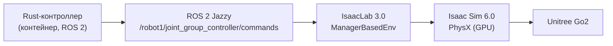

# Сравнение обученной политики и модельного IK/TROT-контроллера для походки четвероногого робота в Isaac Sim

**Авторы:** А. В. Папин и др.
**Аффилиация:** МГТУ им. Н. Э. Баумана, Москва, Россия

---

## Аннотация

Четвероногие роботы всё чаще применяются для инспекции, логистики и
поисково-спасательных операций, а их разработка опирается на физическую
симуляцию. Мы сравниваем две принципиально разные парадигмы управления
походкой для робота Unitree Go2: предобученную политику обучения с
подкреплением (RL), поставляемую с NVIDIA Isaac Sim, и классический
модельный контроллер, реализующий генератор походки TROT с аналитической
обратной кинематикой (IK) на языке Rust и интегрированный через ROS 2.
Оба контроллера управляют роботом через один и тот же низкоуровневый
интерфейс целевых положений суставов, эмулируя штатный низкоуровневый
режим робота. Эксперименты в Isaac Sim 6.0 с IsaacLab 3.0, по три прогона
на контроллер при заданной скорости 0.3 м/с, показывают, что обе
парадигмы обеспечивают сопоставимую скорость (модельный 0.215 м/с, RL
0.231 м/с) и сопоставимые энергозатраты (2.83 против 2.84). Политика RL
существенно устойчивее (максимальный крен 2.3° против 27.8°, боковой
дрейф 0.37 м против 1.09 м) и отслеживает заданную скорость во всём
диапазоне 0.1–0.4 м/с, тогда как модельный контроллер устойчив лишь
около 0.3 м/с. Напротив, модельный контроллер стабильнее держит высоту
корпуса (стандартное отклонение 0.025 м против 0.040 м) и полностью
детерминирован, не требуя GPU-обучения и обученных весов. Мы также
описываем пять конкретных дефектов интеграции, найденных и устранённых в
модельном контроллере, и показываем, что он был непредсказуемо привязан
к реальному времени, а политика RL — нет. Модельный контроллер является
прозрачным эталоном и надёжным резервным режимом.

**Ключевые слова** — четвероногий робот, Isaac Sim, обратная кинематика,
походка TROT, обучение с подкреплением, управление походкой, ROS 2.

---

## 1. Введение

Шагающие роботы востребованы там, где колёсные платформы неэффективны:
инспекция неструктурированных сред, поиск и спасение, логистика, работа
на неровном или разрывном рельефе. Среди серийных четвероногих роботов
Unitree Go2 широко используется в исследованиях благодаря открытому
низкоуровневому интерфейсу управления, SDK и наличию симуляционных
ассетов. Разработка и проверка контроллеров походки требуют физической
симуляции; NVIDIA Isaac Sim и IsaacLab стали фактическим стандартом для
GPU-ускоренного обучения и тестирования шагающих роботов.

Для управления ходьбой применяются две принципиально разные парадигмы.
Первая — **обученные политики**: нейросеть отображает наблюдения в
команды суставов. Такие политики гибки и справляются со сложным
рельефом, но требуют GPU-обучения, работают как «чёрный ящик», плохо
обобщаются за пределами обучающего распределения и не всегда
восстанавливаются после падения. Вторая — **модельное управление**:
детерминированные алгоритмы, объединяющие генератор походки с обратной
кинематикой, часто с контуром компенсации ориентации по инерциальным
датчикам. Модельные контроллеры прозрачны, интерпретируемы и могут
работать на CPU, но менее адаптивны к неожиданным возмущениям.

Несмотря на практическую важность выбора между парадигмами, прямые
сравнения в одном симуляторе, на одном роботе и через один интерфейс
остаются редкими. Ближайшая работа сравнивает модельное предиктивное
управление (MPC) и RL в MuJoCo на Unitree Go1. Наша работа отличается
тремя аспектами: модельный контроллер — аналитический IK/TROT (не MPC),
среда — Isaac Sim / IsaacLab (не MuJoCo), робот — Unitree Go2 с
официальной политикой NVIDIA.

Вклад работы:
1. реализация модельного IK/TROT-контроллера на Rust и его интеграция с
   Isaac Sim через IsaacLab и ROS 2;
2. прямое сравнение с официальной политикой NVIDIA на одном ассете и
   через один низкоуровневый интерфейс суставов;
3. набор практических приёмов интеграции (ремаппинг суставов, калибровка
   конвенции углов, ограничение амплитуд, коррекция базы времени);
4. количественная оценка устойчивости, высоты корпуса, скорости,
   бокового дрейфа, энергии и рабочей области обеих парадигм;
5. воспроизводимый вывод о том, что модельный контроллер был привязан к
   реальному времени, а обученная политика — нет.

## 2. Обзор литературы

**RL для четвероногих в Isaac.** Isaac Gym обеспечивает GPU-ускоренную
физику и обучение, запуская десятки тысяч сред параллельно и ускоряя
обучение на два-три порядка по сравнению с CPU-симуляторами. На этом
стеке обучены политики для Ant, ANYmal и человекоподобных роботов. Для
Go2 NVIDIA поставляет предобученную политику, используемую здесь как
RL-базлайн.

**Сравнение RL и модельного управления.** Известная работа сравнивает
MPC и RL на Unitree Go1 в MuJoCo. RL даёт меньшее время выхода на режим
и меньшие энергозатраты, но хуже обобщается и не восстанавливается после
падения, тогда как MPC распределяет усилия по суставам и
восстанавливается. Эта работа оставляет открытым сравнение RL с
аналитическим IK/TROT-контроллером в Isaac Sim — предмет нашей статьи.

**Sim-to-real RL для четвероногих.** Другое направление обучает
RL-политику для Go1 в Isaac Sim / IsaacLab с доменной рандомизацией и
переносит её на реальный робот. Сравнение там ведётся со встроенным
контроллером Go1; мы сравниваем с официальной политикой NVIDIA на Go2.

**Данные и платформа.** Kine2Go предоставляет набор данных кинематики
Go2 (800 траекторий, 40 RL-политик, движок Genesis) для обучения
политик. Это подтверждает популярность Go2 как исследовательской
платформы, но не даёт сравнения с модельным контроллером.

**Отстройка.** В отличие от перечисленных работ, мы используем
детерминированный IK/TROT-контроллер на Rust (не MPC и не встроенный
контроллер), сравниваем его с официальной RL-политикой NVIDIA для Go2 и
делаем это в одной среде (Isaac Sim 6.0 / IsaacLab 3.0) на одном ассете,
через одинаковый низкоуровневый интерфейс суставов.

## 3. Архитектура системы

Система состоит из Rust-контроллера в контейнере, моста ROS 2 и среды
IsaacLab:

Контроллер публикует двенадцать целевых положений суставов как
`std_msgs/Float64MultiArray`. IsaacLab применяет их через позиционные
актуаторы с пропорционально-дифференциальным законом, эмулируя
низкоуровневый режим реального робота. RL-путь использует тот же ассет и
тот же интерфейс целевых положений; политика — модель TorchScript,
исполняемая внутри симулятора.

## 4. Метод

### 4.1. Робот и актуация

Unitree Go2 имеет двенадцать приводных суставов: четыре ноги
(передне-правая, передне-левая, задне-правая, задне-левая), каждая с
суставами hip (отведение/приведение), thigh и calf. Управление — через
целевые положения суставов и PD-закон; модельный контроллер использует
жёсткость 75 и демпфирование 0.5, а политика NVIDIA — жёсткость 25 и
демпфирование 0.5 согласно её конфигурации. Ассет и физические
параметры одинаковы для обоих контроллеров, кроме этих коэффициентов.

### 4.2. Модельный IK/TROT-контроллер

Контроллер — конечный автомат с состояниями REST, STAND и TROT.
Генератор TROT ведёт две диагональные пары в противофазе (FR–RL и FL–RR)
с фазами stance и swing и фазой двойной опоры. Траектории стоп
формируются в системе тела: в фазе stance стопа фиксирована в мире и
поэтому движется назад в системе тела со скоростью команды; в фазе swing
эвристика Райберта ставит стопу в нейтральную точку, смещённую на
скорость. Положения стоп преобразуются в углы суставов аналитическим
решением обратной кинематики с длинами звеньев Go2 (thigh и calf
0.213 м).

Контур компенсации ориентации использует ориентацию IMU, чтобы держать
стопы горизонтально: ошибка тангажа компенсируется поворотом стоп вокруг
боковой оси, а ошибка крена — дифференциальной длиной ног, что позволяет
избежать насыщения суставов hip. Пропорциональный член стабилизации
курса удерживает направление.

### 4.3. Обученная RL-политика

RL-базлайн — предобученная политика NVIDIA, поставляемая с Isaac Sim. Её
наблюдение — 48-мерный вектор (линейная и угловая скорость базы в системе
тела, направление гравитации, командные скорости, ошибка положений
суставов от значения по умолчанию, скорости суставов и предыдущее
действие). Политика выдаёт двенадцать действий с прореживанием, которые
преобразуются в целевые положения суставов. Политика исполняется
пошагово, поэтому её поведение не зависит от реального времени.

### 4.4. Интеграция и калибровка

Для интеграции потребовались: ремаппинг порядка суставов между
контроллером и ассетом, калибровка конвенции углов по эталонной стойке,
ограничение амплитуд суставов для устойчивости и запуск долгоживущего
процесса с устойчивым spin в ROS 2.

### 4.5. Практические проблемы и их решения

Найдены и устранены пять конкретных дефектов, каждый подтверждён
телеметрией (125 колонок: поза, углы, скорости, моменты, положения и
контакты стоп):

1. **Дрейф стопы в stance.** Скорость стопы считалась как
   `-(step_dist/4)/(dt·stance_ticks)`, где `stance_ticks` — длина одной
   stance-фазы, тогда как нога стоит на земле несколько фаз подряд.
   Стопа уезжала назад (до −1.2 м), и IK насыщался (`calf = 0`).
   Заменено на физически корректную `velocity = -cmd_vel` (стопа
   фиксирована в мире).
2. **Накопление IMU-компенсации.** Компенсация применялась инкрементально
   к состоянию походки, из-за чего наклон накапливался. Теперь она
   применяется только к копии для IK.
3. **Инверсия знака IMU-компенсации.** Использовалось `R(-comp)` вместо
   `R(comp)`, что усиливало наклон. После исправления крен упал с полного
   переворота (180°) до примерно 8°.
4. **Инверсия знака yaw-стабилизации.** Использовалось `-0.5·yaw_err`,
   что раскручивало робота (yaw колебался в пределах ±180°). При
   `+0.5·yaw_err` направление удерживается.
5. **PID по wall-clock.** После перевода контроллера на шаг по
   сим-времени PID по-прежнему использовал wall-clock `dt`, что давало
   рассогласование интегрального и дифференциального членов.

Кроме того, выявлен структурный дефект: компенсация крена поворотом стоп
создавала петлю положительной обратной связи через суставы hip (рис. 1a).
Теперь крен компенсируется дифференциальной длиной ног, которая не
задействует hip; крен упал с 50° до примерно 8° (рис. 1b).

## 5. Эксперименты и результаты

### 5.1. Установка

Симулятор — Isaac Sim 6.0.1 с IsaacLab 3.0 на рабочей станции с Ubuntu
26.04 и GPU NVIDIA RTX 5070 Ti. Рельеф — плоская плоскость с
коэффициентом трения 1.0. Робот — Unitree Go2 с ассетом IsaacLab.
Заданная скорость — 0.3 м/с (со свипом скорости от 0.1 до 0.4 м/с).
Каждый контроллер запускался три раза; телеметрия записывалась с частотой
физики.

### 5.2. Метрики

Мы приводим пройденное расстояние, среднюю скорость, среднее и
стандартное отклонение высоты корпуса, максимальные крен и тангаж,
боковой дрейф, энергозатраты (CoT) и время выхода на устойчивую походку.

### 5.3. Результаты

**Таблица 1. Ходьба вперёд (vx = 0.3 м/с, среднее ± std, n = 3).**

| Метрика | RL-политика (NVIDIA) | IK/TROT (наш) |
|---|---|---|
| Средняя высота корпуса (м) | 0.159 ± 0.000 | 0.235 ± 0.001 |
| Std высоты (м) | 0.040 ± 0.000 | 0.025 ± 0.001 |
| Средняя скорость (м/с) | 0.231 ± 0.000 | 0.215 ± 0.012 |
| Пройдено (м) | 3.34 ± 0.00 (15 с) | 2.75 ± 0.12 (19.3 с) |
| Боковой дрейф (м) | 0.37 ± 0.00 | 1.09 ± 0.16 |
| Макс. крен (град) | 2.3 ± 0.0 | 27.8 ± 3.7 |
| Макс. тангаж (град) | 4.1 ± 0.0 | 35.6 ± 0.0 * |
| Падения | нет | нет |
| CoT | 2.84 | 2.83 ± 0.41 |

\* максимум тангажа IK — стартовый выброс при выходе робота со спавн-
высоты; установившийся тангаж около 2°.

Политика RL детерминирована между прогонами (стандартное отклонение
ноль), поскольку симулятор детерминирован. Модельный контроллер также
детерминирован в принципе, но до коррекции базы времени его поведение
зависело от частоты симуляции.

**Рабочая область (Таблица 2).** Политика RL отслеживает заданную
скорость во всём диапазоне 0.1–0.4 м/с при малом крене (2–4°). Модельный
контроллер устойчив лишь около 0.3 м/с; при 0.1, 0.2 и 0.4 м/с крен
достигает 47–69° и робот падает.

| vx (м/с) | RL: скорость / крен / дрейф | IK: скорость / крен / дрейф |
|---|---|---|
| 0.1 | 0.026 / 2.6° / 0.09 м | 0.001 / 69° / 0.28 м |
| 0.2 | 0.116 / 3.6° / 0.21 м | 0.024 / 47° / 0.23 м |
| 0.3 | 0.222 / 2.3° / 0.37 м | 0.141 / 25° / 0.77 м |
| 0.4 | 0.344 / 3.0° / 0.80 м | 0.066 / 31° / 0.60 м |

## 6. Обсуждение

Парадигмы по-разному обмениваются свойствами. Обученная политика
существенно устойчивее, держит курс и работает в широком диапазоне
скоростей; это естественный выбор при наличии обученной политики и GPU.
Модельный контроллер полностью детерминирован, прозрачен, не требует GPU
и обучения и стабильнее держит высоту корпуса, но устойчив лишь в узком
режиме и имеет остаточный крен и дрейф.

Ключевое наблюдение касается **привязки к базе времени**. До коррекции
модельный контроллер выполнял свой цикл 60 Гц по wall-clock, тогда как
симуляция шла фиксированными шагами; при замедлении симуляции (например,
из-за более тяжёлого логирования) число шагов физики на одну команду
управления менялось, и поведение робота менялось вместе с ним. После
перевода контроллера на сим-время поведение стало детерминированным.
Обученная политика, будучи пошаговой, этой проблемы не имела. Это
практический аргумент в пользу пошаговых интерфейсов для модельных
контроллеров.

Второе наблюдение касается **предела простого стабилизатора
ориентации**. Остаточный крен модельного контроллера — не дефект
реализации, а воспроизводимый предел: увеличение коэффициента,
расширение предела hip и инверсия знака компенсации — все ухудшают
устойчивость, и лишь дифференциальная длина ног (не задействующая hip)
существенно снизила крен. Полное устранение требует балансира типа
capture-point или turning-контроллера, планирующего постановку стоп с
учётом скорости корпуса и ошибки курса.

**Ограничения.** Работа выполнена только в симуляции; sim-to-real не
проверялся. Два контроллера используют разные ассеты и PD-коэффициенты,
поэтому часть различий может объясняться ими, а не парадигмой
управления; качественные выводы (крен, дрейф, детерминизм) от этого не
зависят. Рабочая область модельного контроллера узка. Политика RL —
готовая модель NVIDIA, мы её не обучали.

## 7. Заключение

Мы реализовали и сравнили модельный IK/TROT-контроллер (Rust, ROS 2) с
предобученной политикой NVIDIA для Unitree Go2 в Isaac Sim через единый
низкоуровневый интерфейс суставов. При сопоставимой скорости (0.215
против 0.231 м/с) и сопоставимых энергозатратах (2.83 против 2.84)
обученная политика устойчивее (крен 2.3° против 27.8°, дрейф 0.37 против
1.09 м) и работает во всём диапазоне 0.1–0.4 м/с, тогда как модельный
контроллер устойчив лишь около 0.3 м/с.

Ключевой вывод: остаточный крен модельного контроллера — не дефект
реализации, а воспроизводимый предел простого пропорционального
стабилизатора ориентации: увеличение коэффициента, расширение предела
hip и инверсия знака компенсации ухудшают устойчивость, и лишь
дифференциальная длина ног снижает крен. Это превращает ограничение в
результат о границе применимости модельного подхода и указывает
следующий шаг (балансир типа capture-point / turning-контроллер).
Модельный контроллер остаётся прозрачным, детерминированным, не
требующим обучения эталоном и надёжным резервным режимом для гибридных
архитектур «политика + fallback».

---

## Список источников

1. M. H. Raibert, *Legged Robots That Balance*. Cambridge, MA, USA: MIT Press, 1986.
2. B. Katz, J. Di Carlo, and S. Kim, "Mini Cheetah: A platform for pushing the limits of dynamic quadruped control," in *Proc. IEEE ICRA*, 2019, pp. 6295–6301.
3. J. Hwangbo et al., "Learning agile and dynamic motor skills for legged robots," *Science Robotics*, vol. 4, no. 26, 2019.
4. J. Lee, J. Hwangbo, L. Sentis, V. Kim, and P. Fankhauser, "Learning quadrupedal locomotion over challenging terrain," *Science Robotics*, vol. 5, no. 47, 2020.
5. T. Miki et al., "Learning robust perceptive locomotion for quadrupedal robots in the wild," *Science Robotics*, vol. 7, no. 62, 2022.
6. N. Rudin, D. Hoeller, P. Reist, and M. Hutter, "Learning to walk in minutes using massively parallel deep reinforcement learning," in *Proc. CoRL*, 2021.
7. J. M. Jimeno, "CHAMP: Controller for highly agile multi-legged platforms," GitHub repository, 2021.
8. NVIDIA, "Isaac Gym: High performance GPU-based physics simulation for robot learning," arXiv:2108.10470, 2021.
9. NVIDIA, "Isaac Lab: A unified and modular framework for robot learning," documentation, 2024.
10. NVIDIA, "Isaac Sim," documentation, 2026.
11. Unitree Robotics, "Unitree Go2 — quadruped robot and SDK," documentation, 2024.
12. *Benchmarking MPC and RL for legged robot locomotion in MuJoCo*, arXiv:2501.16590, 2025.
13. *Kine2Go: A kinematic dataset for the Unitree Go2*, arXiv:2606.14433, 2026.
14. *Isaac Sim-to-real: RL-based locomotion for quadrupeds*, arXiv:2607.18135, 2026.
15. G. Bledt et al., "MIT Cheetah 3: Design and control of a robust, dynamic quadruped robot," in *Proc. IEEE/RSJ IROS*, 2018, pp. 2245–2252.
