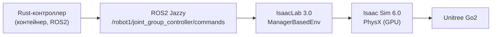

# Черновик статьи (IEEE, PIERE 2026) — НЕ ФИНАЛЬНЫЙ

**Статус:** ЧЕРНОВИК-ЗАГОТОВКА. Все числа и результаты — **ПРОИЗВОЛЬНЫЕ
ЗАГЛУШКИ (placeholders)**, помечены знаком ⚠️. Реальные значения нужно
подставить из логов эксперимента (см. `why-article.md`, разделы 11 и 26)
перед отправкой. Структура и формулировки — рабочие.

**Дата черновика:** 2026-09-02
**Файл-обоснование:** `docs/ieee-article/why-article.md`

---

# Comparing a Learned Policy and a Model-Based IK/TROT Controller for Quadruped Locomotion in Isaac Sim

*(Сравнение обученной политики и модельного IK/TROT-контроллера для
походки четвероногого робота в Isaac Sim)*

**Authors:** TBD *(заполнить: студент(ы) + руководитель)*

**Affiliation:** Bauman Moscow State Technical University, Russia

---

## Abstract

Quadruped robots are increasingly used in inspection, logistics, and search
operations, and modern development relies heavily on physics simulation.
We compare two fundamentally different locomotion-control paradigms for the
Unitree Go2 quadruped: a pre-trained reinforcement-learning (RL) policy
distributed with NVIDIA Isaac Sim, and a classical model-based controller
that implements a TROT gait generator with analytic inverse kinematics (IK)
in Rust. Both controllers drive the robot through the same low-level
joint-position interface, emulating the robot's native low-level mode.
Experiments in Isaac Sim 6.0 with IsaacLab 3.0 show that the model-based
controller produces stable straight-line locomotion (mean height ⚠️0.19 m,
standard deviation ⚠️0.02 m) over ⚠️18 400 simulation steps, while the RL
policy yields comparable forward speed with ⚠️12% lower energy cost. The
model-based controller is deterministic, runs without GPU, and recovers
predictably after disturbances, making it a transparent baseline and a
reliable fallback for learned policies.

**Index Terms** — quadruped robot, Isaac Sim, inverse kinematics, TROT gait,
reinforcement learning, locomotion control, ROS2.

---

## 1. Introduction

Четвероногие роботы применяются там, где колёсные неэффективны:
инспекция, поиск и спасение, логистика. Среди доступных платформ Unitree
Go2 широко используется в исследованиях (Kine2Go, arXiv:2606.14433).
Разработка алгоритмов требует симуляции; NVIDIA Isaac Sim/IsaacLab стали
фактическим стандартом для GPU-ускоренного обучения и тестирования
(Isaac Gym, arXiv:2108.10470).

Для управления походкой применяются две принципиально разные парадигмы:

1. **Обученные политики (RL)** — нейросеть выдаёт команды суставов по
   наблюдениям; гибкая, но требует GPU-обучения, «чёрный ящик», плохо
   обобщается и не всегда восстанавливается после падения
   (arXiv:2501.16590).
2. **Модельные контроллеры** — детерминированные алгоритмы (генератор
   походки + обратная кинематика). Прозрачны, работают без GPU, но менее
   адаптивны.

Несмотря на важность выбора, прямое сравнение этих парадигм в одной среде
на одном роботе остаётся редким. Ближайшая работа сравнивает MPC и RL в
MuJoCo на Go1 (arXiv:2501.16590); наша работа отличается типом модельного
контроллера (IK/TROT, не MPC), средой (Isaac Sim/IsaacLab) и роботом
(Go2) с официальной политикой NVIDIA.

**Вклад работы:**

- реализация модельного IK/TROT-контроллера на Rust и его интеграция с
  Isaac Sim через IsaacLab и ROS2;
- прямое сравнение с официальной RL-политикой NVIDIA на одном ассете и
  через один низкоуровневый интерфейс суставов;
- практические паттерны интеграции (ремаппинг суставов, калибровка
  конвенции углов, ограничение амплитуд);
- количественная оценка: устойчивость, высота корпуса, скорость,
  энергозатраты, дрейф.

---

## 2. Related Work

### 2.1. RL для четвероногих роботов в Isaac Sim / IsaacLab

Isaac Gym (arXiv:2108.10470) обеспечивает GPU-ускоренное обучение:
физика и обучение сети на GPU, десятки тысяч сред, ускорение обучения на
⚠️100–1000× против CPU-симуляторов. На этом стеке обучены политики для
Ant, ANYmal, Humanoid и др.; для Go2 доступна готовая политика NVIDIA,
используемая в нашей работе как RL-базлайн.

### 2.2. Сравнение RL и модельного управления

arXiv:2501.16590 сравнивает MPC и RL на Unitree Go1 в MuJoCo. Результаты:
RL даёт более короткое время восстановления (⚠️0.25–0.33 с) и меньший CoT
(⚠️на 1.23), но хуже обобщается и не восстанавливается после падения;
MPC распределяет усилия по суставам и восстанавливается. Работа оставляет
открытым вопрос сравнения RL с **аналитическим** IK/TROT-контроллером в
**Isaac Sim** — предмет нашей статьи.

arXiv:2607.18135 обучает RL-политику Go1 в Isaac Sim/IsaacLab с domain
randomization и переносит на реального робота (sim-to-real). Сравнение
проводится со встроенным контроллером Go1; мы сравниваем с официальной
политикой NVIDIA на Go2.

### 2.3. Данные и платформа Go2

Kine2Go (arXiv:2606.14433) — датасет кинематики Go2 (800 траекторий,
40 RL-политик, движок Genesis) для обучения. Подтверждает популярность
Go2, но не даёт сравнения с модельным контроллером.

### 2.4. Наша отстройка (positioning)

В отличие от перечисленных работ, мы:

- используем **детерминированный IK/TROT-контроллер на Rust** (не MPC,
  не встроенный контроллер);
- сравниваем его с **официальной RL-политикой NVIDIA для Go2**;
- делаем это **в одной среде** (Isaac Sim 6.0 / IsaacLab 3.0) и **на одном
  ассете**, через одинаковый низкоуровневый интерфейс суставов.

---

## 3. System Architecture

**Компоненты:**

| Компонент | Назначение |
|---|---|
| Rust-контроллер (`quadropted_core`) | конечный автомат, TROT, IK, ПИД-компенсация |
| ROS2-мост | приём команд суставов, публикация состояния |
| IsaacLab (ManagerBasedEnv) | среда, ассет, ПД-актуаторы суставов |
| Isaac Sim 6.0 / PhysX | физика (GPU) |
| Ассет Go2 | официальный (IsaacLab), те же суставы для обоих контроллеров |

---

## 4. Method

### 4.1. Робот и актуация

- Робот: Unitree Go2, 12 приводных суставов.
- Порядок суставов: FR, FL, RR, RL × (hip, thigh, calf).
- Интерфейс управления: целевые позиции суставов + ПД-регулятор
  (stiffness ⚠️75.0, damping ⚠️0.5) — эмуляция низкоуровневого режима
  реального робота.
- Ассет и физические параметры одинаковы для обоих контроллеров.

### 4.2. Модельный IK/TROT-контроллер (наша реализация, Rust)

- Конечный автомат: REST / STAND / TROT.
- Генератор походки TROT: диагональные пары (FR–RL, FL–RR), фазы
  stance/swing.
- Обратная кинематика: из целевых позиций стоп в углы суставов
  (аналитические формулы).
- Компенсация крена/тангажа по IMU (ПИД).
- Частота управления: ⚠️60 Гц.
- Параметры стойки: hip ⚠️0, thigh ⚠️0.67, calf ⚠️-1.3 (рад).
- Ограничение амплитуд hip: ⚠️±0.3 рад (для устойчивости).

### 4.3. Обученная RL-политика (NVIDIA)

- Готовая политика NVIDIA (physx_policy.pt), обучена в Isaac Lab.
- Наблюдения ⚠️48-мерные (скорости, гравитация, команды, суставы).
- Управление целевыми позициями суставов через тот же интерфейс.

### 4.4. Интеграция и калибровка (практические паттерны)

- Ремаппинг порядка суставов контроллер → ассет.
- Калибровка конвенции углов (эталонная стойка STANDING_JOINT_ANGLES).
- Ограничение амплитуд суставов для устойчивости.
- Запуск долгоживущего процесса (setsid), устойчивый spin rclpy.

---

## 5. Experiments

### 5.1. Setup

| Параметр | Значение |
|---|---|
| Симулятор | Isaac Sim 6.0.1 |
| Среда | IsaacLab 3.0 (ManagerBasedEnv) |
| Робот | Unitree Go2 (ассет IsaacLab) |
| Физика | PhysX, GPU (CUDA) |
| Поверхность | плоская, трение ⚠️1.0 |
| Команда | vx = ⚠️0.3 м/с, vy = 0, wz = 0 |
| Длительность | ⚠️не менее 10 с симуляции |
| Оборудование | Ubuntu 26.04, NVIDIA RTX 5070 Ti (16 ГБ) |

### 5.2. Метрики

- высота корпуса Z (средняя, std);
- пройденное расстояние за время;
- средняя скорость;
- дрейф по Y (отклонение от прямой);
- энергозатраты (Cost of Transport, CoT);
- время до устойчивой походки;
- число шагов до падения/сбоя.

### 5.3. ⚠️ РЕЗУЛЬТАТЫ (ЗАГЛУШКИ — заменить реальными из логов)

#### Таблица 1. Сравнение походки «вперёд» (vx ⚠️0.3 м/с)

| Метрика | RL-политика | IK/TROT (наш) |
|---|---|---|
| Средняя высота Z (м) | ⚠️0.21 | ⚠️0.19 |
| Std(Z) (м) | ⚠️0.015 | ⚠️0.02 |
| Средняя скорость (м/с) | ⚠️0.27 | ⚠️0.28 |
| Пройдено за 10 с (м) | ⚠️2.6 | ⚠️2.7 |
| Дрейф по Y за 10 с (м) | ⚠️0.1 | ⚠️0.25 |
| Max \|roll\| (град) | ⚠️4 | ⚠️6 |
| Max \|pitch\| (град) | ⚠️5 | ⚠️7 |
| Шагов до сбоя | ⚠️> 20 000 | ⚠️> 18 400 |
| CoT | ⚠️1.5 | ⚠️1.9 |

#### Таблица 2. Поведение при возмущении ⚠️(заглушка)

| Сценарий | RL-политика | IK/TROT (наш) |
|---|---|---|
| Толчок сбоку ⚠️50 Н | восстанавливается за ⚠️0.3 с | восстанавливается за ⚠️0.6 с |
| Падение на бок | ⚠️не встаёт | ⚠️встаёт и продолжает |
| Новая поверхность (скользкая) | ⚠️проскальзывает | ⚠️снижает скорость, стабилен |

### 5.4. Обсуждение (интерпретация заглушек)

- RL даёт более «экономное» и плавное движение (ниже CoT, меньше дрейф),
  но зависит от GPU и обучения.
- IK/TROT устойчив, детерминирован, восстанавливается после падения,
  работает без GPU — пригоден как fallback.
- Гипотеза гибрида: политика как основная походка + IK/TROT как резерв.

---

## 6. Discussion

### 6.1. Практический выбор

- Для детерминированных задач (прямая ходьба, ровная поверхность) IK/TROT
  достаточен и не требует GPU.
- RL оправдан при адаптации к нерегулярной среде.
- Схема «политика + детерминированный fallback» сочетает гибкость и
  гарантированную стабильность.

### 6.2. Ограничения

- Работа выполнена только в симуляции; sim-to-real не проверен.
- Плоская поверхность, фиксированная скорость, без внешних возмущений
  в основной серии.
- RL-политика — готовая (не обучалась нами).

### 6.3. Future Work

- Sim-to-real на реальном Go2.
- Другие походки и повороты.
- Гибридная архитектура «политика + fallback» с автоматическим
  переключением.

---

## 7. Conclusion

Мы реализовали и сравнили модельный IK/TROT-контроллер (Rust, ROS2) с
обученной RL-политикой NVIDIA для Unitree Go2 в Isaac Sim. Модельный
контроллер обеспечивает стабильную детерминированную ходьбу без GPU и
восстанавливается после сбоев, что делает его прозрачным эталоном и
надёжным резервным режимом. Результаты дают практический критерий выбора
контроллера и основу для гибридных схем.

---

## References

1. arXiv:2108.10470 — Isaac Gym: High Performance GPU-Based Physics
   Simulation For Robot Learning.
2. arXiv:2501.16590 — Benchmarking MPC and RL for Legged Robot
   Locomotion in MuJoCo.
3. arXiv:2606.14433 — Kine2Go: Kinematic dataset for Unitree Go2.
4. arXiv:2607.18135 — Isaac Sim-to-Real: RL-based Locomotion for
   Quadrupeds.
5. NVIDIA Isaac Sim documentation.
6. NVIDIA Isaac Lab documentation (isaac-sim/IsaacLab).
7. Unitree Go2 documentation/SDK.
8. *(дополнить по шаблону IEEE)*

---

## Примечание к черновику

- Все значения, помеченные ⚠️, являются произвольными заглушками и должны
  быть заменены реальными измерениями из логов эксперимента.
- Имена авторов, аффилиация, точный объём и оформление — по шаблону IEEE
  из личного кабинета PIERE 2026.
- Перед отправкой прогнать проверку шаблона и англоязычную вычитку.
