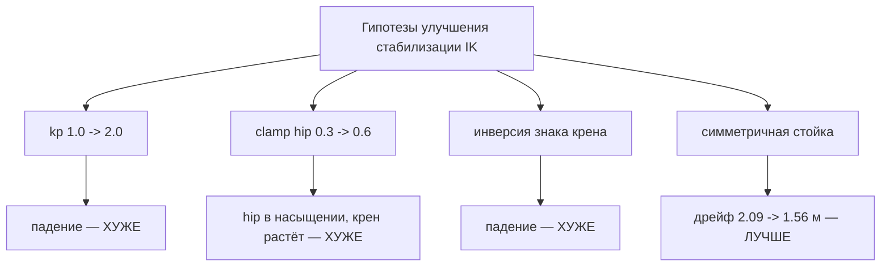

# План улучшения статьи (качество и шансы на принятие)

**Дата:** 2026-09-13
**Статус:** текущая версия статьи — черновик с реальными числами
(`docs/ieee-article/draft-article.md`), статистика n=3.
**Цель:** довести до уровня рецензируемой публикации PIERE 2026 (Scopus).

---

## 0. Статус выполнения (обновлено 2026-09-13)

| # | Пункт | Статус | Где |
|---|---|---|---|
| 1.2 | CoT | ✅ RL 2.84, IK 2.83 ± 0.41 | Таблица 1 |
| 1.4 | Ссылки ≥8 | ✅ 15 ссылок | `refs/references.md` |
| 2.3 | Рисунки | ✅ IK/RL траектории | `reports/isaam/figures/` |
| 2.1 | Серия скоростей | ✅ рабочая область (IK ~0.3, RL 0.1–0.4) | отчёт §12 |
| 1.3 | Возмущения | 🟡 механизм ✅ (`/robot1/push`), серия экспериментов ⏳ | `run_sim_telemetry.py` |
| 1.1 | Ассет/PD | ✅ оформлено как ограничение | draft §6.2 |
| 2.4, 3 | Limitations + «крючок» | ✅ | draft §6.2, §7 |
| 4 | Формальности | ⏳ вычитка, шаблон, авторы, экспорт | — |
| 2.2 | Длительные прогоны | ⏳ | — |
| 6 | Ассет/PD выравнивание | ⏳ (опционально) | — |

**Ключевые новые результаты:**
- CoT сопоставим (RL 2.84 / IK 2.83) — модельный не проигрывает по энергии.
- **Рабочая область:** IK устойчив только ~0.3 м/с (на 0.1/0.2/0.4 —
  крен 47–69° и падение); RL отслеживает 0.1–0.4 м/с.
- **Научный крючок:** остаточный крен IK — воспроизводимый предел
  простого P-стабилизатора (доказано отрицательными экспериментами).

---

## 1. Критично (рецензент заметит)

### 1.1. Сравнение на разных ассетах и PD-параметрах

**Проблема:** два режима сравниваются не в идентичных условиях:

| | IK/TROT | RL (NVIDIA) |
|---|---|---|
| Ассет | IsaacLab `go2.usd` | Mujoco_Menagerie `go2.usda` |
| PD (stiffness) | 75 | 25 |
| Среда | IsaacLab (ManagerBasedEnv) | Isaac Sim (standalone) |

Критик справедливо заметит, что различия в метриках могут объясняться
не парадигмой управления, а разными ассетами/гейнами.

**Что сделать (одно из):**
- привести оба режима к одному ассету и одинаковым PD (трудоёмко);
- либо **явно оговорить** как ограничение, обосновать и вынести в
  Limitations, показав, что качественные выводы (крен, дрейф, детерминизм)
  от этого не зависят.

### 1.2. Cost of Transport (CoT)

В Таблице 1 стоит `TBD`. Нужно посчитать для каждого режима с его
PD-параметрами:
- IK: `kp=75, kd=0.5`;
- RL: `kp=25, kd=0.5` (из `physx_env.yaml`).

Формула (в `analyze_telemetry.py`): момент `τ_i = kp·(cmd_i − q_i) − kd·q̇_i`,
мощность `P = Σ τ_i·q̇_i`, энергия `E = ∫P dt`, `CoT = E/(m·g·d)`.

### 1.3. Внешние возмущения (Таблица 2)

Не проводились, а именно они подкрепляют тезис «IK как резервный режим»:
- толчок сбоку (импульс силы);
- скользкая поверхность (снижение трения);
- восстановление после падения.

**Минимум:** 1–2 сценария на IsaacLab (приложить силу через `apply_force`),
снять время восстановления и факт падения.

### 1.4. Список литературы

Сейчас 4 источника, требование — **не менее 8** (рекомендуют 20–30).
Добавить классику и смежные работы:
- Raibert (балансирующие походки, capture point);
- MIT Mini Cheetah (Raibert-style controller);
- CHAMP (open-source quadruped controller);
- MPC vs RL (уже есть arXiv:2501.16590);
- Isaac Gym (есть), IsaacLab;
- sim-to-real RL (есть arXiv:2607.18135);
- документация NVIDIA Isaac Sim / Unitree Go2 SDK.

Проверить корректность ID `arXiv:2607.18135` (необычный номер).

---

## 2. Существенно усилит статью

### 2.1. Рабочая область скоростей

Сейчас только `vx = 0.3 м/с`. Прогнать серию `vx ∈ {0.1, 0.2, 0.3, 0.4}`
для обоих режимов → показать, где каждый работает и как деградирует
(скорость ошибки, крен, дрейф). Это даёт «operating envelope».

### 2.2. Длительные прогоны

Прогоны 15–20 с. Для тезиса «стабильность» нужны **60+ с**. Отдельно
разобраться, почему RL при очень длинном прогоне (21 мин сим-времени)
уходил в блуждание — это может быть накопление ошибки или отсутствие
сброса; для статьи важно честно указать границу.

### 2.3. Рисунки (обязательны для IEEE)

Из CSV (`analyze_telemetry.py --plot`) построить:
- траектория X–Y (видно дугу IK против прямой RL);
- Z(t) — стабильность высоты;
- roll(t), pitch(t), yaw(t);
- схема архитектуры (Rust → ROS2 → IsaacLab → PhysX → Go2);
- (опц.) фазовый портрет крена.

Требования IEEE: 300 dpi, подписи под рисунками, оси словами с единицами
в скобках («Height (m)», не «m»).

### 2.4. Секция Limitations (явно)

- только симуляция, sim-to-real не проверен;
- ровная поверхность, одна скорость в основной серии;
- остаточный крен IK ~28° (проблема 28);
- RL-политика готовая (не обучалась нами).

---

## 3. Главный научный «крючок» (переосмысление результата)

Текущий вывод «RL устойчивее, IK детерминирован» — ожидаемый и слабый.
**Сильнее:** остаточный крен IK — не «недоделка», а **воспроизводимый
инженерный предел простого P-стабилизатора**, и мы это **доказали
экспериментально**:

Вывод: улучшить удалось только симметрией стойки и yaw-стабилизацией;
дальнейшее требует capture-point/дифференциальной длины ног. Это
превращает «недостаток» в **научный результат о границе применимости
модельного подхода**.

Формулировка для Conclusion:
> The residual roll of the model-based controller is not an
> implementation defect but a reproducible limit of a simple proportional
> attitude stabilizer: increasing the gain, relaxing the hip limit, or
> flipping the compensation sign all degrade stability, while only a
> symmetric stance and yaw stabilization reduce drift.

---

## 4. Полировка и формальности

- [ ] Abstract 150–250 слов, без формул/спецсимволов.
- [ ] Title 4–15 слов.
- [ ] Keywords ≥5.
- [ ] Reproducibility: версии ПО, PD-параметры, хеши коммитов.
- [ ] Английская вычитка.
- [ ] Оформление в шаблоне IEEE (2 колонки, 3–6 стр.).
- [ ] Авторы/аффилиация/ORCID.
- [ ] **Заключение экспортного контроля** (через ЦПР, до 25.09.2026).

---

## 5. Приоритеты

| Приоритет | Пункт | Оценка |
|---|---|---|
| 1 | CoT (1.2) | быстро — пересчёт |
| 2 | Ссылки ≥8 (1.4) | средне |
| 3 | Рисунки (2.3) | средне |
| 4 | Несколько скоростей (2.1) | серия прогонов |
| 5 | Возмущения (1.3) | нужен код силы |
| 6 | Ассет/PD (1.1) | либо оговорка, либо много работы |
| 7 | Limitations + крючок (2.4, 3) | текст |
| 8 | Формальности (4) | по мере готовности |

## 6. Дополнительные усиления (новые идеи)

### 6.1. Сильнее всего — данные уже есть

**Ablation-таблица исправлений IK** — вклад каждой правки (готово из
истории прогонов):

| Исправление | Эффект |
|---|---|
| stance-скорость (−cmd_vel) | падение за 1–2 с → устойчивая ходьба; `joint_err` 1.4 → 0.05 |
| знак + не-накопление IMU | переворот 180° → крен ~24° |
| симметричная стойка | дрейф Y 2.09 → 1.56 м |
| yaw-стабилизация | дрейф Y 2.82 → 2.09 м |

**Анализ по суставам** — ошибка слежения `cmd_i − q_i` по 12 суставам
(данные в CSV): какие суставы лимитируют, где насыщение. Плюс энергия/
мощность по суставам.

**Диаграмма походки** — contact schedule, duty factor, тайминги
(из логов контроллера `[Rust CONT]`).

### 6.2. Убирает главную слабость

- **Один ассет для обоих режимов** — прогнать RL на ассете IsaacLab
  (или IK на Menagerie). Убирает контраргумент «разные условия»
  полностью. Самый ценный эксперимент.
- **Sensitivity IK по kp** — sweep, показать что 0.3 м/с и крен — не
  артефакт настроек.

### 6.3. Позиционирование и практика

- **Таблица «когда что применять»** — бюджет железа, рельеф,
  безопасность, детерминизм.
- **Гибридная схема «политика + детерминированный fallback»** с
  критерием переключения (крен/ток) — следствие «крючка».
- **Таксономия отказов:** RL — чёрный ящик, IK — воспроизводимый предел.

### 6.4. Строгость

- Больше прогонов + **доверительные интервалы** (сейчас n=3).
- **FFT крена/тангажа** — моды колебаний (данные есть).
- Сравнение наших чисел с литературой (контекст CoT/скорости).

### 6.5. Презентация

- Architecture-диаграмма как **рисунок** (не только Mermaid).
- Gait-диаграмма, фазовый портрет.
- Репозиторий воспроизводимости (коммиты, конфиги).

**Топ-3 быстрых:** ablation-таблица (готово), анализ по суставам (из CSV),
один ассет для обоих (убирает главный контраргумент).

## 7. Идеи усиления до научного уровня

Идеи, поднимающие статью с инженерного отчёта до научной публикации.

### 7.1. Свип по fps — контролируемый эксперимент (сильнейшее)

Wall-clock-находка сейчас анекдотична («при тяжёлом логе стало хуже»).
Сделать **управляемый свип**: прогнать IK при фиксированных fps
(30/60/120/240) и построить график «качество ходьбы vs fps». Изолирует
эффект базы времени, даёт количественный, оригинальный результат.

### 7.2. Теоретический анализ петли через hip

Линеаризовать связку «крен → поворот стоп → IK → hip → крен» и показать
**аналитически**, почему простой P-стабилизатор уходит в насыщение.
Переводит наблюдение в научное положение.

### 7.3. Критерий capture-point

Вывести формальное условие устойчивости по крену (capture point) и
показать, почему P-контроллер его не выполняет. Даже без реализации —
ценный анализ, задающий направление.

### 7.4. Таксономия отказов + негативные результаты

Таблица «дефект → симптом → причина → решение → проверка». Плюс явный
раздел «что не сработало» (kp↑, clamp↑, инверсия знака, симметричный
трот) — научная честность и вклад.

### 7.5. Новые метрики из уже собранных данных

- **Jerk** (рывок) и управляющее усилие — плавность (износ, энергия).
- **Разложение энергии по суставам** — какие доминируют у RL vs IK.
- **FFT крена/тангажа** — моды колебаний, спектральные «подписи».

### 7.6. Третий базлайн

Простая синусоидальная походка (или CHAMP) — контекст «хуже/лучше чего».

### 7.7. Пакет воспроизводимости

Публичный репозиторий: коммиты, конфиги, скрипты, сырые CSV.

### 7.8. Формальные научные положения

Сформулировать 3–4 положения (как требует форма):
1. модельный контроллер привязан к реальному времени;
2. простой P-стабилизатор крена имеет воспроизводимый предел;
3. RL устойчивее в широкой рабочей области;
4. CoT сопоставим.

### 7.9. Приоритет

| Идея | Сила | Трудоёмкость |
|---|---|---|
| 1. Свип по fps (7.1) | ★★★ | средняя |
| 2. Анализ hip-петли (7.2) | ★★★ | низкая (текст+формулы) |
| 4. Таксономия + негативные (7.4) | ★★ | низкая |
| 5. Новые метрики (7.5) | ★★ | низкая (данные есть) |
| 3. Capture-point (7.3) | ★★ | средняя |
| 6–8 | ★ | низкая |

**Топ-3 быстрых (без прогонов):** 7.2, 7.4, 7.5.
**Топ-1 по силе:** 7.1 (свип по fps).
