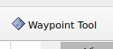
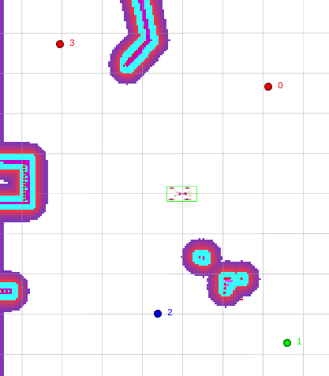
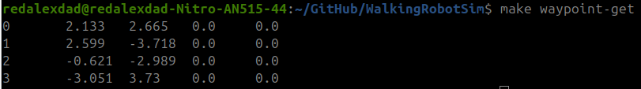

# Лабораторная работа №1: Автономная навигация по массиву путевых точек из файла

## Цель

Научиться загружать маршрут из внешнего файла, запускать автономную навигацию робота по путевым точкам, собирать метрики точности и времени прохождения.

## Теоретическая часть

**Nav2 (Navigation 2)** — стек навигации ROS 2. Состоит из:

- `planner_server` — строит глобальный путь от точки А до точки Б.
- `controller_server` — локальное управление, отслеживание пути.
- `bt_navigator` — поведенческое дерево для выполнения навигационных задач.
- `waypoint_follower` — ActionServer для последовательного прохождения путевых точек.
- `amcl` — локализация робота на карте.

**Waypoint** — путевая точка, заданная координатами (x, y, z, yaw). В проекте используется тип `quadropted_msgs/msg/Waypoint`.

**ActionServer/ActionClient** — механизм ROS 2 для задач, требующих времени. Action позволяет:

1. Отправить цель (goal)
2. Получать обратную связь (feedback) во время выполнения
3. Получить результат (result)

**RViz WaypointTool** — плагин для RViz, который публикует позицию клика мыши в топик `/custom_goal_pose`, не запуская навигацию (в отличие от стандартного Nav2 Goal).

## Программное обеспечение

То же, что в Работе №0, дополнительно:

- `quadropted_msgs` — пользовательские сообщения и сервисы (Waypoint.msg, LoadWaypoints.srv, GetWaypoints.srv)
- `rviz_waypoint_tool` — плагин RViz для установки путевых точек

---

## Ход работы

### Шаг 1. Запуск симуляции

Откройте **терминал на хосте** и запустите симуляцию, как в Работе №0:

```bash
cd WalkingRobotSim
make gazebo-cpp
```

Дождитесь полной загрузки (30-60 секунд). Убедитесь, что Gazebo и RViz открылись.

### Шаг 2. Изучение waypoint коллектора

Откройте **второй терминал на хосте** и подключитесь к контейнеру:

```bash
cd WalkingRobotSim
make shell
```

**Команды `find`, `ros2`, `cat` выполняются внутри контейнера** (в `make shell`).  
**Запуск навигации — на хосте** через `make waypoint-*`.

WaypointCollector — узел, который управляет путевыми точками. Найдите его исходный код:

```bash
find ~/ws/src -name "waypoint_collector.py"
```

Откройте файл и бегло изучите его структуру. Найдите:

- Какие сервисы предоставляет узел
- Как происходит загрузка waypoint из файла
- Как происходит отправка цели в Nav2

Проверьте доступные сервисы:

```bash
ros2 service list | grep waypoint
```

Вы должны увидеть:

- `/start_navigation`
- `/stop_navigation`
- `/clear_waypoints`
- `/load_waypoints`
- `/get_waypoints`
- `/navigate_to_waypoint`

### Шаг 3. Ручное добавление waypoint через RViz

1. В RViz на верхней панели инструментов найдите кнопку `Waypoint Tool` (иконка с точками).
2. Выберите её.



3. Кликните левой кнопкой мыши по карте в 3 разных местах.
4. В RViz появятся сферы с подписями (Waypoint 0, Waypoint 1, Waypoint 2).



Проверьте, что waypoint добавились (в контейнере):

```bash
ros2 service call /get_waypoints quadropted_msgs/srv/GetWaypoints
```

Или на хосте:

```bash
make waypoint-get
```



### Шаг 4. Навигация по вручную заданным точкам

Запустите прохождение маршрута (на хосте, в отдельном терминале):

```bash
make waypoint-start
```

Наблюдайте движение робота в RViz и Gazebo. Дождитесь, пока робот пройдёт все 3 точки.

### Шаг 5. Изучение формата файла waypoint

Внутри контейнера (`make shell`) ознакомьтесь с существующими файлами waypoint:

```bash
cat ~/ws/src/gazebo_sim/config/waypoints/default.yaml
cat ~/ws/src/gazebo_sim/config/waypoints/test.yaml
```

Обратите внимание на структуру:

- Файл в формате YAML
- Корневой ключ `waypoints:`
- Каждый waypoint содержит поля `x`, `y`, `z`, `yaw`

### Шаг 6. Создание своего файла с путевыми точками

**На хосте** (в отдельном редакторе) создайте файл `src/gazebo_sim/config/waypoints/my_route.yaml` с 7 путевыми точками. Можно использовать `nano`, `vim`, `gedit` или любой редактор.

```yaml
waypoints:
  - x: 1.0
    y: 0.5
    z: 0.0
    yaw: 0.0
  - x: 2.0
    y: 1.0
    z: 0.0
    yaw: 0.0
  - x: 3.0
    y: 1.5
    z: 0.0
    yaw: 0.0
  - x: 2.5
    y: 0.0
    z: 0.0
    yaw: 0.0
  - x: 1.5
    y: -0.5
    z: 0.0
    yaw: 0.0
  - x: 0.5
    y: 0.0
    z: 0.0
    yaw: 0.0
  - x: 1.0
    y: 0.5
    z: 0.0
    yaw: 0.0
```

Рекомендуемые требования к маршруту:

- Расстояние между соседними точками: 1-2 метра
- Точки должны находиться на проходимой области карты (серые зоны в RViz)
- Маршрут должен быть замкнутым (последняя точка рядом с первой)

### Шаг 7. Загрузка waypoint из файла

На хосте загрузите созданный файл:

```bash
make waypoint-load FILE=my_route
```

Проверьте результат загрузки (на хосте):

```bash
make waypoint-get
```

Если загрузка прошла успешно — вы увидите таблицу с 7 точками. Если нет — проверьте формат файла и путь.

### Шаг 8. Очистка и перезагрузка

Если нужно очистить текущие waypoint (на хосте):

```bash
make waypoint-clear
```

После очистки можно загрузить новый файл.

### Шаг 9. Запуск навигации

Запустите прохождение маршрута (на хосте):

```bash
make waypoint-start
```

Наблюдайте движение робота в RViz. Дождитесь завершения навигации.


### Шаг 10. Создание второго маршрута

Создайте второй файл `test_route.yaml` с другим расположением точек (например, зигзагообразный маршрут). Повторите шаги 7-9, загружая его через `make waypoint-load FILE=test_route`.

### Шаг 11. Динамическое препятствие

Запустите навигацию по одному из маршрутов (`make waypoint-start`). Во время движения робота добавьте в симуляцию препятствие на пути робота:

1. В окне Gazebo выберите вкладку **Insert** (слева)
2. Выберите **Model Database → simple shapes → unit box**
3. Разместите куб на пути движения робота


Наблюдайте, как Nav2 перестраивает траекторию (costmap обновляется). Попробуйте переместить куб в другое место.

## Результат ЛР1

После выполнения вы должны уметь:

- Создавать файл waypoint в формате YAML
- Загружать waypoint из файла через сервис
- Управлять навигацией (старт, стоп, очистка)
- Сравнивать маршруты разной конфигурации

---

## Контрольные вопросы к ЛР1

1. Что такое ROS 2 Node, Topic, Service, Action?
2. Чем отличается Service от Action?
3. Какой формат имеет файл waypoint? Какие поля обязательны?
4. Какой сервис используется для загрузки waypoint из файла?
5. Что такое Nav2 waypoint_follower?
6. Для чего нужен RViz?
7. Как получить список всех топиков в запущенной системе?
8. Как посмотреть тип сообщения сервиса?

---

## Оформление отчёта

Отчёт должен содержать:

1. **Цель работы**
2. **Краткая теория** (ROS 2 Node, Topic, Service, Action, Nav2, waypoint_follower)
3. **Ход работы**:
   - Команды запуска симуляции и навигации
   - Структура файла waypoint (YAML формат)
   - Содержимое созданных файлов `my_route.yaml` и `test_route.yaml`
   - Скриншоты RViz с траекториями (минимум 2 — для каждого маршрута)
4. **Метрики и анализ**:
   - Таблица времени прохождения каждого маршрута (засеките по секундомеру от старта до финиша)
5. **Выводы**:
   - Какие маршруты были созданы и чем отличаются
   - Какие сложности возникли при навигации

---

## Критерии оценки ЛР1

| Критерий                                       | Баллы  |
| ---------------------------------------------- | ------ |
| Создан файл waypoint с 5-7 точками             | 2      |
| Waypoint загружены и навигация запущена        | 2      |
| Робот прошёл маршрут (подтверждено скриншотом) | 2      |
| Создан второй маршрут                          | 2      |
| Визуальное сравнение маршрутов                 | 2      |
| Оформлен отчёт                                 | 3      |
| Ответы на контрольные вопросы                  | 2      |
| **Итого**                                      | **15** |
