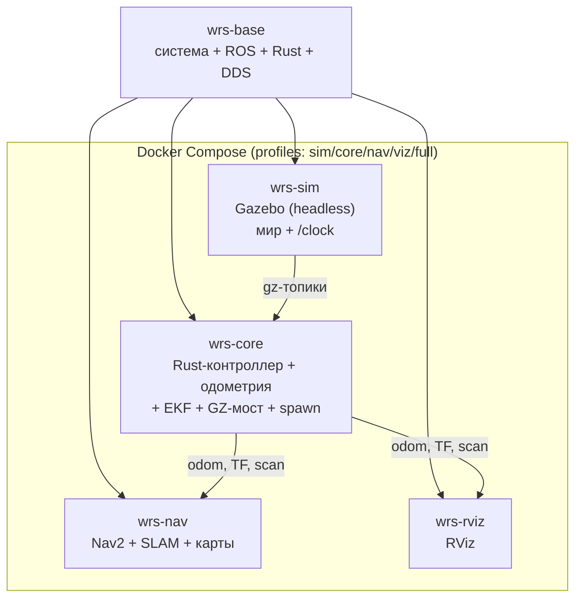

# Отчёт о развёртывании микросервисной архитектуры Docker

**Дата:** 2026-10-02
**Ветка:** `feat/docker-microservices`
**Версия:** 1.0

---

## Содержание

### Часть A. Развёртывание микросервисов

1. [Введение](#a1-введение)
2. [Выбор решения (история)](#a2-выбор-решения-история)
3. [Ход работ](#a3-ход-работ)
4. [Проблемы и решения](#a4-проблемы-и-решения)
5. [Итоговая архитектура](#a5-итоговая-архитектура)
6. [Дальнейшие шаги](#a6-дальнейшие-шаги)
7. [Приложения](#a7-приложения)

### Часть B. Эксплуатационные проблемы

8. [Проблема: Отсутствие управления роботом](#8-проблема-отсутствие-управления-роботом)
9. [Проблема: Параллельный запуск двух стеков](#9-проблема-параллельный-запуск-двух-стеков)
10. [Проблема: wrs-rviz не собирается](#10-проблема-wrs-rviz-не-собирается)
11. [Проблема: Нет ROS clock](#11-проблема-нет-ros-clock)

---

## Часть A. Развёртывание микросервисов

> **Связь с Частью B.** По ходу развёртывания встречались проблемы.
> Здесь (Часть A) они описаны кратко, а детальные разборы — в
> [Части B](#part-b): каждая проблема по цепочке «Симптом → Гипотезы →
> Причина → Диагностика → Решение → Результат». Нумерация сквозная: 8–11.

### A.1. Введение

#### A.1.1. Предпосылки

Проект использовал **один монолитный Docker-образ** `walking_robot_sim`
(физика Gazebo + мост GZ↔ROS + Rust-контроллер + одометрия + EKF + Nav2 +
RViz + vision). Сборка занимает 15–20 минут, а любое изменение тянуло
полную пересборку. План декомпозиции на микросервисы описан в
`reports/isaam/2026-08-22_docker-microservices-v2.md`.

#### A.1.2. Цели

- Разделить монолит на независимые образы: база, симулятор, ядро,
  навигация, визуализация.
- Пересборка изменяемого сервиса — минуты, а не всё сразу.
- Изоляция: падение симулятора не рушит ядро.
- GPU — только симулятору и визуализации.
- Монолит сохранить как fallback.

#### A.1.3. Оборудование

| Роль | Хост | GPU | OS | RAM |
|---|---|---|---|---|
| Симуляция (Docker) | Lenovo Lecoo N155A | AMD iGPU (+ eGPU NVIDIA) | Ubuntu 26.04 | 30 GB |

### A.2. Выбор решения (история)

#### A.2.1. Рассмотренные варианты

| Вариант | Плюсы | Минусы | Вердикт |
|---|---|---|---|
| Монолит (текущий) | просто, один образ | 15–20 мин пересборка, всё в одном | fallback |
| Микросервисы | быстрая пересборка, изоляция, GPU точечно | больше образов, сложнее оркестрация | **выбран** |
| Нативный запуск | нет overhead | невоспроизводимо | отклонён |

#### A.2.2. Хронология решений

1. План v2 (август) описывает 5 сервисов и порядок внедрения.
2. Принято решение реализовать все этапы плана в отдельной ветке
   `feat/docker-microservices`, монолит не удалять.
3. При планировании выявлено, что цикл итераций по Rust уже ускорен
   ранее (`rust-build` + bind-mount `src`), поэтому микросервисы дают
   в первую очередь изоляцию и раздельную установку тяжёлых групп
   пакетов (Nav2, vision).

### A.3. Ход работ

#### A.3.1. Сборка базового образа

**Действие:** создан `src/docker/Dockerfile.base` — общий образ
`wrs-base` (система + ROS base + CycloneDDS + инструменты сборки +
Rust + rosbridge + Python-зависимости). Цель `make base`.

**Результат:** образ собран, `wrs-base:latest` (~7.84 ГБ).

#### A.3.2. Сборка образов сервисов

**Действие:** созданы `Dockerfile.core`, `Dockerfile.sim`,
`Dockerfile.nav`, `Dockerfile.rviz`; launch-файлы разделены на
`launch_sim.py`, `launch_core.py`, `launch_nav.py` (+ существующий
`rviz_launch.py`); в `compose.yml` добавлены сервисы `wrs-*` с профилями
`sim|core|nav|viz|full`; добавлен `makefiles/microservices.mk`.
Сборка `make ms-build`.

**Ошибка 1 (сборка rviz):** `wrs-rviz` не собирался — `gazebo_sim` (C++)
требует `gz-msgs10` (подробно — [Проблема 10](#10-проблема-wrs-rviz-не-собирается)).

**Решение 1:** rviz собирает только описания роботов, конфиг копируется.

**Результат:** все 5 образов собраны: `wrs-base`, `wrs-sim`, `wrs-core`,
`wrs-nav`, `wrs-rviz`.

#### A.3.3. Запуск стека и проверка

**Действие:** `make ms-up` (профиль full).

**Ошибка 1 (управление):** стек поднялся, но **робот не управлялся** —
`controller_manager` не грузил контроллеры (подробно —
[Проблема 8](#8-проблема-отсутствие-управления-роботом)).

**Решение 1:** плагины контроллеров добавлены в образ `wrs-sim`.

**Ошибка 2 (конфликт):** параллельно оставался запущен монолит
`walking_robot_sim` — два стека в одном DDS-домене дублировали топики
(подробно — [Проблема 9](#9-проблема-параллельный-запуск-двух-стеков)).

**Решение 2:** монолит остановлен.

**Ошибка 3 (часы):** ROS-`/clock` не публикуется → use_sim_time-узлы
идут по wall-time, EKF не публикует (подробно —
[Проблема 11](#11-проблема-нет-ros-clock)). **Статус: не решено.**

**Результат проверки после фиксов:**

| Проверка | Значение |
|---|---|
| `wrs-sim`/`core`/`nav` health | healthy |
| `wrs-rviz` | up |
| `/robot1/joint_states` | ~94 Гц |
| `/robot1/odom` | 50 Гц |
| `/robot1/scan` | ~9 Гц |
| Управление (TROT + `vx=0.05`) | odom 0.64 → 4.73 за 6 с |
| `/robot1/odometry/filtered` (EKF) | нет данных |
| `/clock` (ROS) | нет данных |

### A.4. Проблемы и решения

| № | Проблема | Причина | Решение | Статус |
|---|----------|---------|---------|:------:|
| [8](#8-проблема-отсутствие-управления-роботом) | Робот не управляется | В `wrs-sim` нет плагинов контроллеров | Плагины добавлены в `Dockerfile.sim` | [x] |
| [9](#9-проблема-параллельный-запуск-двух-стеков) | Дублирование топиков | Монолит запущен параллельно | Остановка монолита | [x] |
| [10](#10-проблема-wrs-rviz-не-собирается) | Сборка rviz падает | `gazebo_sim` требует `gz-msgs10` | rviz без сборки `gazebo_sim` | [x] |
| [11](#11-проблема-нет-ros-clock) | Use_sim_time, EKF | ROS `/clock` не публикуется | Не найдено | [ ] |

### A.5. Итоговая архитектура



#### A.5.1. Компоненты

| Компонент | Образ | Профиль | Статус |
|---|---|---|---|
| Общая база | `wrs-base` | — | ✅ |
| Симулятор | `wrs-sim` | `sim` | ✅ |
| Ядро | `wrs-core` | `core` | ✅ |
| Навигация | `wrs-nav` | `nav` | ⚠️ (нужен clock) |
| Визуализация | `wrs-rviz` | `viz` | ✅ |

#### A.5.2. Параметры

| Параметр | Значение |
|---|---|
| ROS_DISTRO | jazzy |
| RMW | rmw_cyclonedds_cpp |
| Сеть | host |
| Gazebo | 8.15.0 |
| Профили | `sim`, `core`, `nav`, `viz`, `full` |

#### A.5.3. Сравнение «было / стало»

| Аспект | Монолит | Микросервисы |
|---|---|---|
| Изоляция сбоев | нет | да (по сервисам) |
| GPU | всему стеку | sim + rviz |
| Тяжёлые группы | все (Nav2, torch) | раздельно |
| Оркестрация | одна команда | профили compose |
| Управление роботом | работало | работает (после [Проблемы 8](#8-проблема-отсутствие-управления-роботом)) |
| `/clock` | (не проверялось) | **не работает** ([Проблема 11](#11-проблема-нет-ros-clock)) |

### A.6. Дальнейшие шаги

#### Краткосрочно

- [x] Собрать `wrs-base` и образы сервисов
- [x] Разделить launch по сервисам
- [x] compose-профили и Makefile
- [x] Починить управление ([Проблема 8](#8-проблема-отсутствие-управления-роботом))
- [ ] Починить ROS `/clock` ([Проблема 11](#11-проблема-нет-ros-clock))

#### Среднесрочно

- [ ] Прогнать интеграционный тест `scripts/test_sim_integration.sh` на стеке
- [ ] Проверить Nav2/SLAM (после починки clock)
- [ ] Healthcheck'и и порядок старта

#### Долгосрочно

- [ ] Замена источника на Isaac Sim нативно (только `wrs-sim`)
- [ ] Профиль vision (YOLO) отдельным сервисом

### A.7. Приложения

#### Приложение A. Команды

- Сборка базы: `make base`
- Сборка сервисов: `make ms-build` (или `ms-build-core/sim/nav/rviz`)
- Поднять/остановить: `make ms-up` / `make ms-down`
- Профили: `make ms-sim`, `ms-core`, `ms-nav`, `ms-viz`
- Проверки: `ros2 topic hz /robot1/joint_states`, `ros2 topic hz /clock`

#### Приложение B. Файлы

| Файл | Назначение |
|---|---|
| `src/docker/Dockerfile.base` | общий базовый образ |
| `src/docker/Dockerfile.core/sim/nav/rviz` | образы сервисов |
| `src/gazebo_sim/launch/launch_sim.py` | launch симулятора |
| `src/gazebo_sim/launch/launch_core.py` | launch ядра |
| `src/gazebo_sim/launch/launch_nav.py` | launch навигации |
| `makefiles/microservices.mk` | цели микросервисов |
| `compose.yml` | сервисы `wrs-*` |

---

<a id="part-b"></a>
## Часть B. Эксплуатационные проблемы

## Сводная таблица

| № | Проблема | Гипотезы | Причина | Решение | Методы | Сложность |
|---|----------|----------|---------|---------|--------|-----------|
| [8](#8-проблема-отсутствие-управления-роботом) | Робот не управляется | ✅ нет плагинов контроллеров в sim; ❌ монолит; ❌ нет спавна | `gz_ros2_control`/`controller_manager` работают в симуляторе, а `ros2_controllers` стояли только в ядре | Добавить `ros2-control/ros2-controllers/controller-manager` в `Dockerfile.sim` | `cargo`/`ros2 topic hz`, лог `Loader for controller` | 🔴 |
| [9](#9-проблема-параллельный-запуск-двух-стеков) | Дублирование топиков | ✅ два стека в DDS; ❌ причина отсутствия управления | Монолит и микросервисы в одном домене | `docker stop walking_robot_sim` | `docker ps`, `ros2 node list` | 🟢 |
| [10](#10-проблема-wrs-rviz-не-собирается) | rviz не собирается | ✅ `gazebo_sim` требует gz-msgs; ❌ базовый образ | C++ `laser_to_cloud_converter` тянет `gz-msgs10` | rviz без сборки `gazebo_sim` | лог `colcon`, `Find gz-msgs10` | 🟡 |
| [11](#11-проблема-нет-ros-clock) | ROS `/clock` пуст | ✅ gz-топик `/clock` пуст; ❌ двунаправленный мост; ❌ `-s`; ❌ версия gz | Не локализована: запущенный gz не публикует `/clock` (изолированный — публикует) | Не найдено | `gz topic -e`, `ros2 topic hz` | 🔴 |

---

## 8. Проблема: Отсутствие управления роботом

### 8.1. Симптом

После `make ms-up` (микросервисы) стек поднимается, робот спавнится,
топики `/robot1/...` есть, но **управления нет**. В логе `wrs-sim`:

```
[gazebo-1] [ERROR] [robot1.controller_manager]: Loader for controller
  'joint_group_controller' (type 'position_controllers/JointGroupPositionController') not found.
[gazebo-1] [ERROR] [robot1.controller_manager]: Loader for controller
  'joint_state_broadcaster' (type 'joint_state_broadcaster/JointStateBroadcaster') not found.
```

### 8.2. Гипотезы

- ❌ **Гипотеза A:** робот не спавнится. **Опровергнута:** топики
  `/robot1/odom`, `/robot1/joint_states`, `/robot1/scan` существуют.
- ❌ **Гипотеза B:** мешает параллельно запущенный монолит.
  **Опровергнута:** после остановки монолита управление не появилось
  (исходная причина иная — см. [8.3](#83-причина)).
- ✅ **Гипотеза C:** в образе `wrs-sim` нет плагинов контроллеров.
  **Принята** — подтвердилась как причина в [8.3](#83-причина).

### 8.3. Причина

`gz_ros2_control` и `controller_manager` работают **внутри симулятора**
(плагин загружается в процесс Gazebo из SDF робота). Плагины контроллеров
(`joint_state_broadcaster`, `position_controllers/JointGroupPositionController`)
поставляются пакетом `ros2_controllers`, который был установлен только в
образе `wrs-core`, но **не в `wrs-sim`**. Поэтому `controller_manager` не
находил загрузчики контроллеров и не активировал их — суставы не получали
команды.

### 8.4. Диагностика

```
# частоты: commands идёт (контроллер ядра работает), joint_states — нет
ros2 topic hz /robot1/joint_group_controller/commands   # 61 Гц
ros2 topic hz /robot1/joint_states                      # нет данных

# ошибки контроллеров в логе симулятора
docker logs wrs-sim | grep "Loader for controller"
# → ... 'joint_group_controller' ... not found
```

После добавления пакетов и перезапуска:

```
ros2 topic hz /robot1/joint_states    # ~97 Гц
```

### 8.5. Решение

Добавить в `src/docker/Dockerfile.sim` пакеты `ros2-control`,
`ros2-controllers`, `controller-manager` и пересобрать `wrs-sim`.

### 8.6. Исправление в скриптах/конфигах

- `src/docker/Dockerfile.sim` — добавлены `ros-${ROS_DISTRO}-ros2-control`,
  `ros-${ROS_DISTRO}-ros2-controllers`,
  `ros-${ROS_DISTRO}-controller-manager`.
- Коммит `930c50c`.

### 8.7. Результат

| Метрика | До | После |
|---|---|---|
| `Loader for controller ... not found` | есть | отсутствует |
| `/robot1/joint_states` | нет данных | ~97 Гц |
| Управление (TROT + vx=0.05) | робот стоит | odom 0.64 → 4.73 за 6 с |

**Связь с развёртыванием (Часть A):** проблема встречена на этапе
[A.3.3 «Запуск стека и проверка»](#a33-запуск-стека-и-проверка).

---

## 9. Проблема: Параллельный запуск двух стеков

### 9.1. Симптом

При поднятии микросервисов одновременно работал монолит
`walking_robot_sim`. В одном DDS-домене (host-сеть) топики `/robot1/...`
видели два стека, узлы дублировались, поведение непредсказуемо.

### 9.2. Гипотезы

- ✅ **Гипотеза A:** два стека в одном DDS-домене дублируют топики.
  **Принята** — подтвердилась как причина в [9.3](#93-причина).
- ❌ **Гипотеза B:** монолит — причина отсутствия управления.
  **Опровергнута:** после остановки монолита управление не появилось
  (причина — плагины, [Проблема 8](#8-проблема-отсутствие-управления-роботом)).

### 9.3. Причина

Контейнеры используют `network_mode: host` и один DDS-домен
(`ROS_DOMAIN_ID=0`). Монолит и микросервисы публикуют одни и те же
топики (`/robot1/robot_mode`, `/robot1/robot_velocity`, `/robot1/joint_states`
и т.д.), поэтому команды и данные перемешиваются.

### 9.4. Диагностика

```
docker ps --format '{{.Names}} {{.Status}}' | grep -E "wrs-|walking"
# → одновременнно wrs-* и walking_robot_sim
ros2 node list    # узлы обоих стеков вперемешку
```

### 9.5. Решение

Останавливать монолит перед запуском микросервисов:
`docker stop walking_robot_sim`.

### 9.6. Исправление в скриптах/конфигах

Явного автоматического шага нет. Рекомендуется в `make ms-up` при
необходимости останавливать `simulator` (профиль-конфликт).
Кандидат на доработку.

### 9.7. Результат

| Метрика | До | После |
|---|---|---|
| Число стеков в DDS | 2 | 1 |
| Дублирование узлов | есть | нет |

**Связь с развёртыванием (Часть A):** проблема встречена на этапе
[A.3.3 «Запуск стека и проверка»](#a33-запуск-стека-и-проверка).

---

## 10. Проблема: wrs-rviz не собирается

### 10.1. Симптом

Сборка образа `wrs-rviz` падала на шаге `colcon build`:

```
CMake Error at CMakeLists.txt:22 (find_package):
  Could not find a package configuration file provided by "gz-msgs10"
1 package failed: gazebo_sim
target wrs-rviz: failed to solve: process "... colcon build ..." did not
  complete successfully: exit code: 1
```

### 10.2. Гипотезы

- ❌ **Гипотеза A:** неверный базовый образ. **Опровергнута:** база
  `wrs-base` собирается и используется другими сервисами.
- ✅ **Гипотеза B:** `gazebo_sim` содержит C++ узел, требующий `gz-msgs`.
  **Принята** — подтвердилась как причина в [10.3](#103-причина).

### 10.3. Причина

В образ `wrs-rviz` не ставятся gz-vendor пакеты, а `gazebo_sim` (пакет
`quadropted_controller_cpp`/`gz`-зависимости) собирает C++
`laser_to_cloud_converter`, которому нужен `gz-msgs10`. RViz при этом
нужны только конфиг и меши роботов — сам `gazebo_sim` не нужен.

### 10.4. Диагностика

```
grep "gz-msgs10" /tmp/wrs_ms_build.log
# → CMake Error ... gz-msgs10 ... 1 package failed: gazebo_sim
```

### 10.5. Решение

В `Dockerfile.rviz` собирать только `go1_description` и
`go2_description`, а конфиг RViz копировать в `/opt/wrs/rviz`
(без сборки `gazebo_sim`).

### 10.6. Исправление в скриптах/конфигах

- `src/docker/Dockerfile.rviz` — `colcon build --packages-select
  go1_description go2_description`, конфиг через `COPY`.
- Коммит `e18a9fd`.

### 10.7. Результат

| Метрика | До | После |
|---|---|---|
| `make ms-build-rviz` | падает | собирается (`wrs-rviz:latest`, 8.07 ГБ) |

**Связь с развёртыванием (Часть A):** проблема встречена на этапе
[A.3.2 «Сборка образов сервисов»](#a32-сборка-образов-сервисов).

---

## 11. Проблема: Нет ROS clock

### 11.1. Симптом

ROS-топик `/clock` существует, но **не публикуется**:

```
ros2 topic hz /clock            # нет данных
ros2 topic echo /clock --once   # пусто (best_effort и reliable)

# в логе wrs-sim:
[robot1.controller_manager]: No clock received, using time argument instead!
```

Следствие: use_sim_time-узлы идут по wall-time; EKF
`/robot1/odometry/filtered` не публикует данные; Nav2/SLAM работают
некорректно. Управление при этом есть (Rust-контроллер падает на
wall-clock 60 Гц).

### 11.2. Гипотезы

- ✅ **Гипотеза A:** gz-топик `/clock` не публикуется. **Принята**
  (как рабочая): в запущенном стеке `gz topic -e -t /clock` пуст.
- ❌ **Гипотеза B:** мешает двунаправленный `clock_bridge`.
  **Опровергнута:** после `pkill clock_bridge` gz `/clock` всё равно пуст.
- ❌ **Гипотеза C:** нужен headless (`-s`). **Опровергнута:** перевод
  `launch_sim.py` на `-s` не помог.
- ❌ **Гипотеза D:** версия Gazebo. **Опровергнута:** и монолит, и
  `wrs-base` используют Gazebo 8.15.0.

### 11.3. Причина

**Не локализована окончательно.** Факты: Gazebo шагает
(в `/world/default/stats` `sim_time` растёт, `real_time_factor ≈ 1.0`),
gz-transport работает (тот же `/world/default/stats` читается), но
gz-топик `/clock` пуст в запущенном стеке. При этом **изолированный**
headless-сервер `gz sim -s -r -v4 world/cafe.world --force-version 8`
в отдельном `GZ_PARTITION` **публикует** `/clock` с теми же аргументами.
Наиболее вероятно — особенность gz-transport/публикации `/clock`
в конфигурации запущенного сервера (возможно, взаимодействие с
сенсорами/плагинами мира). Требует дальнейшего разбора.

### 11.4. Диагностика

```
# gz шагает и публикует stats, но /clock пуст
docker exec wrs-sim bash -lc 'source /opt/ros/jazzy/setup.bash;
  gz topic -e -n1 -m gz.msgs.Clock -t /clock'      # пусто
  gz topic -e -n1 -m gz.msgs.WorldStatistics -t /world/default/stats
  # → sim_time растёт (55 → 57 c)

# изолированный сервер тех же аргументов — /clock есть
GZ_PARTITION=t3 gz sim -s -r -v4 world/cafe.world --force-version 8 &
gz topic -e -n1 -m gz.msgs.Clock -t /clock          # → сообщение Clock
```

### 11.5. Решение

Не найдено. Варианты для следующего шага: явный `GZ_PARTITION` для всего
стека; проверка публикации `/clock` при разных наборах плагинов мира
(сенсоры/camera); сверка с монолитом (там clock работал) на предмет
различий в мире/плагинах.

### 11.6. Исправление в скриптах/конфигах

Пока нет. (`launch_sim.py` переведён на headless `-s` — это не решило
проблему, но полезно для симулятора без GUI.)

### 11.7. Результат

| Метрика | До | После |
|---|---|---|
| `/clock` | нет данных | нет данных (не решено) |
| `/robot1/odometry/filtered` | нет данных | нет данных |
| Управление | работает | работает |

**Связь с развёртыванием (Часть A):** проблема встречена на этапе
[A.3.3 «Запуск стека и проверка»](#a33-запуск-стека-и-проверка).

---

## Итоговая статистика

| Метрика | Значение |
|---------|----------|
| Всего проблем | 4 |
| Из них решено | 3 |
| 🟢 (<1ч) | 1 |
| 🟡 (1-4ч) | 1 |
| 🔴 (>4ч) | 2 |
| Ключевые выводы | Микросервисы собираются и поднимаются; управление восстановлено переносом плагинов контроллеров в образ симулятора. Остаётся нерешённой публикация ROS `/clock` — блокирует EKF и Nav2/SLAM по симуляционному времени. |

---

## Связанные отчёты

- `reports/isaam/2026-08-22_docker-microservices-v2.md` — план декомпозиции
- `reports/isaam/2026-08-22_simulation-issues-report.md` — проблемы монолита
- `reports/devops/smart-deploy-scripts.md` — умная сборка
