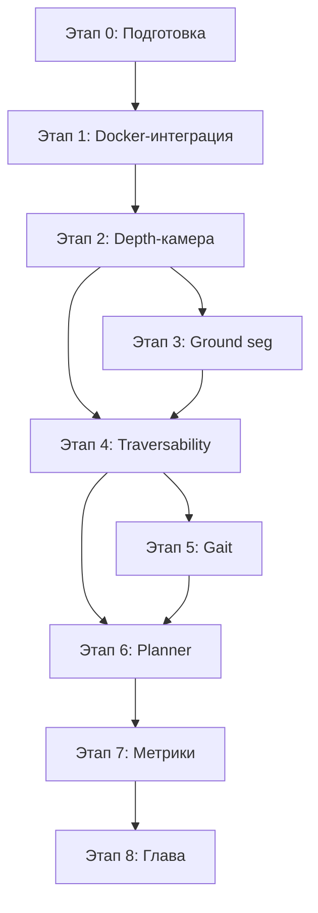

# Декомпозиция интеграции elevation_mapping_cupy в WalkingRobotSim

## Цель

Интегрировать GPU-ускоренное построение карты высот (elevation_mapping_cupy v2.1.0)
в существующую симуляцию Unitree Go2 в Gazebo Harmonic + ROS 2 Jazzy
и получить terrain-aware планирование маршрута.

---

## Этап 0. Подготовка окружения и изучение референса

### Задачи
- [x] Изучить архитектуру elevation_mapping_cupy (документация, примеры)
- [x] Запустить golden path тест из README (synthetic_depth_demo.launch.py) — работает
- [x] Проверить, что Docker-сборка работает на твоей машине
- [x] Выяснить, есть ли NVIDIA GPU и CUDA (GTX 1650 Ti + CUDA 12.8)
- [ ] Прочитать paper "Elevation Mapping for Locomotion and Navigation using GPU" (Miki et al., IROS 2022)

### Артефакты
- Конспект архитектуры elevation_mapping_cupy
- Результаты тестового прогона (41/41 тестов пройдено)

### Комментарии
- Dockerfile пришлось фиксить: `numpy<2`, PyTorch `cu126` вместо `cu121`
- CuPy JIT падает на numpy 2.x с CC 7.5 (GTX 1650 Ti) — решено `numpy<2`

---

## Этап 1. Интеграция в Docker-сборку проекта

### Задачи
- [x] Скопировать elevation_mapping_cupy (без .git) в корень WalkingRobotSim
- [x] Добавить Cyclone DDS в Dockerfile GPU-образа
- [x] Создать корневой compose.yml с двумя сервисами: simulator + elevation_mapping
- [x] Собрать GPU-образ с поддержкой CUDA + CuPy + Cyclone DDS
- [x] Настроить host network для передачи сообщений между контейнерами
- [x] Обновить Makefile и test.mk для новой структуры

### Архитектурное решение: два контейнера

```
WalkingRobotSim/
├── compose.yml                      # Корневой compose — оба сервиса
├── elevation_mapping_cupy/          # Копия репозитория (без .git)
├── src/
│   ├── docker/
│   │   ├── Dockerfile               # Simulator (CPU, 6-stage)
│   │   └── Dockerfile.x64           # (orig) — используется через build context
│   ├── gazebo_sim/
│   ├── go2_description/
│   └── ...
├── Makefile                         # DOCKER_DIR → $(CURDIR)
└── makefiles/test.mk                # проверяет корневой compose.yml
```

**Почему два контейнера, а не один:**
- Simulator: `osrf/ros:jazzy-desktop`, CPU-only, 6-stage Dockerfile
- Elevation: `nvidia/cuda:12.6.3-cudnn-devel-ubuntu24.04`, GPU, отдельный Dockerfile
- Общаются через host network + Cyclone DDS (`ROS_DOMAIN_ID=0`)
- Не нужно пересобирать основной образ (30 мин) при изменениях GPU-части

### Время
~1 неделя (факт: ~1.5 недели с учётом отладки)

---

## Этап 2. Подключение depth-камеры Unitree к elevation_mapping

### Мотивация смены источника данных

Изначально планировалось использовать LiDAR `/robot1/scan` (LaserScan).
Однако LaserScan — это 2D, а elevation_mapping принимает PointCloud2.
Варианты:
1. Конвертировать LaserScan → PointCloud2 через `laser_geometry::LaserProjection`
2. Добавить depth-камеру в Go2, которая публикует PointCloud2 напрямую

**Выбран вариант 2** — depth-камера даёт 3D облако точек с глубиной,
не требует дополнительной конвертации и лучше подходит для карты высот.

### Задачи
- [x] Добавить depth_camera sensor в gazebo.xacro — PointCloud2 на `/${robot_name}/depth/points`
- [x] Настроить gz_bridge.yaml для проброса depth-топиков
- [x] Настроить gazebo_multi_nav2_world.launch.py (inline bridge)
- [x] Создать terrain_test.world с рельефом (ramps, steps, bumps)
- [x] Переключить launch_python.launch.py на terrain_test.world
- [x] Верифицировать, что go2_description подхватывается через symlink-install
- [x] Создать конфиг elevation_mapping для Go2 depth (go2_depth.yaml)
- [ ] Запустить симуляцию + elevation_mapping_node вместе
- [ ] Верифицировать приём PointCloud2 в elevation_mapping_node
- [ ] Подобрать параметры sensor_model (noise model, cutoff depths)
- [ ] Калибровать min_variance, max_variance под depth-камеру Go2

### Конфигурация
`elevation_mapping_cupy/config/setups/go2/go2_depth.yaml`:
```yaml
/elevation_mapping_node:
  ros__parameters:
    map_frame: "odom"
    base_frame: "base_link"
    corrected_map_frame: "odom"
    subscribers:
      depth:
        topic_name: "/robot1/depth/points"
        data_type: "pointcloud"
    publishers:
      elevation_map:
        layers: ["elevation", "variance", "traversability"]
        basic_layers: ["elevation"]
        fps: 10.0
```

### Артефакты
- Конфигурационный файл elevation_mapping для Go2 depth (go2_depth.yaml)
- Depth-камера в URDF Go2 (gazebo.xacro)
- Terrain-тестовый мир (terrain_test.world)

### Время
~1.5 недели (факт: 1 неделя, часть работ выполнена)

---

## Этап 3. Сегментация ground/non-ground

### Задачи
- [ ] Написать Python-ноду для ground segmentation
- [ ] Алгоритм: Ground Plane Fitting (RANSAC на нижние точки)
- [ ] Выход: два топика PointCloud2 — ground_cloud и obstacle_cloud
- [ ] Объединить ground_cloud с elevation map
- [ ] Тестировать на синтетических данных из Gazebo

### Алгоритм (Zermas 2017)
1. Взять PointCloud2
2. Отфильтровать по высоте (ignore_points_above/below)
3. Запустить RANSAC на поиск плоскости земли
4. Точки в пределах threshold от плоскости → ground, иначе → obstacle

### Артефакты
- Пакет `walkingrobot_vision` с нодой `ground_segmenter`
- Тесты сегментации на записях из симуляции

### Время
~1 неделя (с учётом опыта с depth-камерой)

---

## Этап 4. Вычисление gradient поверхности и cost function

### Задачи
- [ ] Включить фильтр NormalVectorsFilter из grid_map_filters
- [ ] Вычислять угол наклона (slope) для каждой ячейки карты
- [ ] Вычислять roughness (отклонение высот в окне)
- [ ] Написать cost function: cost = w_slope * slope_cost + w_roughness * roughness_cost + w_elevation * elevation_diff_cost
- [ ] Интегрировать cost map как дополнительный слой в elevation map

### Формула
```
traversability = 1.0 - (w_slope * (slope / max_slope)
                + w_roughness * (roughness / max_roughness)
                + w_elevation * (elevation_diff / max_elevation_diff))
```

### Артефакты
- Пакет `walkingrobot_planning` с нодой `traversability_estimator`
- Конфиг filter chain для grid_map
- Визуализация слоёв traversability в RViz

### Время
~1.5 недели

---

## Этап 5. Адаптация походки по типу местности

### Задачи
- [ ] Определить классы terrain по traversability: дорога (high), трава (medium), камни (low), препятствие (no-go)
- [ ] Написать ноду, которая читает traversability под опорами робота
- [ ] Адаптировать параметры походки:
  - Высота шага (step_height)
  - Частота шага (step_frequency)
  - Угол наклона корпуса (body_angle)
- [ ] Связать с существующим контроллером (RobotControllerNode)

### Логика
```
if traversability < 0.3:  # опасная зона
    step_height = max, step_frequency = min, speed = min
elif traversability < 0.6:  # средняя
    step_height = medium, speed = medium
else:  # безопасная
    step_height = min, step_frequency = max
```

### Артефакты
- Пакет `walkingrobot_controller` с адаптацией gait
- Демонстрация адаптации на разных рельефах

### Время
~1.5 недели

---

## Этап 6. Terrain-aware path planning через Nav2

### Задачи
- [ ] Настроить Nav2 для использования cost map из elevation_mapping
- [ ] Либо: переписать глобальный planner с учётом traversability слоя
- [ ] Либо: подключить custom planner plugin через nav2_core
- [ ] Тестировать маршруты: A → B через сложный рельеф
- [ ] Сравнить маршруты с/без terrain-aware planning

### Артефакты
- Плагин terrain-aware planner (или адаптация Nav2)
- Сравнительная таблица маршрутов

### Время
~2 недели

---

## Этап 7. Сбор метрик и валидация

### Задачи
- [ ] Настроить запись rosbags для каждого сценария
- [ ] Собрать метрики карты высот (RMSE, MAE, max error)
- [ ] Собрать метрики производительности (FPS, latency, GPU/CPU)
- [ ] Собрать метрики пути (длина, время, энергозатраты, наклоны)
- [ ] Сделать скрипт для автоматического подсчёта метрик из rosbag
- [ ] Сравнить baseline (Nav2 без elevation map) vs terrain-aware

### Сценарии тестирования
1. Ровная дорога — baseline
2. Лёгкие неровности (трава, гравий)
3. Холмы, подъёмы/спуски
4. Смешанный рельеф
5. Лестницы (если доступны)

### Артефакты
- Скрипт `scripts/compute_metrics.py`
- CSV с результатами по каждому сценарию
- Графики сравнения

### Время
~1 неделя

---

## Этап 8. Оформление Главы 3

### Задачи
- [ ] Описать постановку задачи
- [ ] Архитектура модуля (диаграмма)
- [ ] Описание алгоритмов (elevation mapping, ground seg, cost function)
- [ ] Параметры и конфигурация
- [ ] Результаты тестирования (таблицы метрик)
- [ ] Анализ и выводы

### Структура главы
```
3.1. Постановка задачи
3.2. Архитектура модуля построения карты высот
3.3. Сегментация ground/non-ground
3.4. Функция стоимости и traversability
3.5. Адаптация походки по рельефу
3.6. Экспериментальная валидация
3.7. Выводы по главе
```

### Время
~1 неделя

---

## Итого по времени

| Этап | Недель | Статус |
|---|---|---|
| 0. Подготовка | 1 | ✅ Выполнен (кроме paper) |
| 1. Docker-интеграция | 1 | ✅ Выполнен |
| 2. Подключение depth-камеры | 1.5 | 🔄 В работе (75%) |
| 3. Ground segmentation | 1 | ⏳ Ожидает |
| 4. Gradient + cost function | 1.5 | ⏳ Ожидает |
| 5. Адаптация походки | 1.5 | ⏳ Ожидает |
| 6. Terrain-aware planning | 2 | ⏳ Ожидает |
| 7. Сбор метрик | 1 | ⏳ Ожидает |
| 8. Оформление главы | 1 | ⏳ Ожидает |
| **Итого** | **~11.5 недель** | **~2.5 недели выполнено** |

---

## Зависимости



---

## Ключевые изменения по ходу работ

### Проблема: Gazebo Harmonic `gpu_lidar` публикует LaserScan, а elevation_mapping требует PointCloud2
**Решение:** Добавлена depth-камера в Go2 (gazebo.xacro), публикует PointCloud2 напрямую

### Проблема: Разные базовые образы (CPU vs GPU)
**Решение:** Два контейнера с host network + Cyclone DDS, общаются как ROS 2 ноды

### Проблема: CuPy несовместим с numpy 2.x на GTX 1650 Ti (CC 7.5)
**Решение:** Пин `numpy<2` в Dockerfile

### Проблема: Разные RMW реализации (simulator на Cyclone DDS, elevation на Fast DDS)
**Решение:** Cyclone DDS установлен в GPU-образ, `RMW_IMPLEMENTATION=rmw_cyclonedds_cpp` для обоих

### Проблема: elevation_mapping_cupy v2.1.0 собирает torch c `cu121` — несовместимо с CUDA 12.8
**Решение:** PyTorch index `cu126` вместо `cu121`

---

## Стек технологий

- ROS 2 Jazzy (Ubuntu 24.04)
- Gazebo Harmonic
- elevation_mapping_cupy v2.1.0 (Python + CuPy)
- grid_map (C++ библиотека)
- Nav2 (планирование)
- Unitree Go2 (робот)
- NVIDIA GTX 1650 Ti + CUDA 12.8
- Docker + Docker Compose (two-container architecture)
- Cyclone DDS (межконтейнерная связь)
