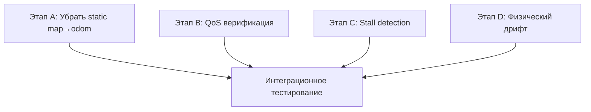

# Декомпозиция: Исправление costmap-bridge (дрифт одометрии + frame shift)

## Контекст

После интеграции elevation_mapping + bridge-ноды (`elevation_to_costmap_node.py`)
Nav2 не может построить маршрут. Диагностика выявила две связанные проблемы:

1. **Физический дрифт робота в Gazebo** — тело `(2.82, −4.09)` при spawn `(0,0,0.5)`
2. **static transform map→odom = (0,0,0)** — AMCL выдаёт коррекцию `(2.75, −2.56)`, но costmap остаётся в odom без трансформации

Плюс непроверенный QoS bridge-ноды и stall detection, которое не тестировали.

---

## Этап A. Убрать static transform map→odom

**Корневая причина:** `compose.yml` line 54:

```
ros2 run tf2_ros static_transform_publisher 0 0 0 0 0 0 map odom &
```

Жёстко фиксирует `map→odom = (0,0,0)`. AMCL публикует `map→odom` динамически
(`tf_broadcast: true` в `nav2_params.yaml`), но статик перекрывает.

Когда робот уезжает от `(0,0)`, AMCL видит робота в `map` кадре, а costmap
остаётся в `odom` без коррекции → визуальное смещение.

### Задачи

- [ ] **A.1** Удалить строку `static_transform_publisher 0 0 0 0 0 0 map odom` из `compose.yml` (line 54)
- [ ] **A.2** Проверить, что AMCL публикует `map→odom` (tf2 topic `/tf`, флаг `tf_broadcast: true`)
- [ ] **A.3** Проверить, что `elevation_mapping_node` использует `map_frame: "odom"` (уже в config — не менять)
- [ ] **A.4** Запустить симуляцию, проверить, что costmap не смещается относительно робота в RViz

### Артефакты

- `compose.yml` — удалена строка 54
- Видео/скриншот RViz: costmap совпадает с положением робота

### Время

~30 мин (правка + тест)

---

## Этап B. Верификация QoS bridge-ноды

**Гипотеза:** публикация GridMap (`RELIABLE + VOLATILE`) и подписка bridge
(`RELIABLE + VOLATILE`) совместимы. Но bridge использует TRANSIENT_LOCAL для
публикации OccupancyGrid, чтобы StaticLayer (с `map_subscribe_transient_local: true`)
успевал получить данные.

### Задачи

- [ ] **B.1** Внутри контейнера: `ros2 topic info /elevation_mapping_node/elevation_map -v`
      — проверить `Reliability: RELIABLE`, `Durability: VOLATILE`
- [ ] **B.2** `ros2 topic info /elevation_costmap -v`
      — проверить `Durability: TRANSIENT_LOCAL`
- [ ] **B.3** `ros2 topic echo /elevation_costmap --once` — проверить, что данные приходят
- [ ] **B.4** Проверить `nav2_params.yaml`: `map_subscribe_transient_local: true` у StaticLayer

**Если данные не приходят:** исправить QoS publisher-а bridge-ноды на
`qos_profile_sensor_data` (BEST_EFFORT) для подписки на GridMap.

### Артефакты

- Вывод `ros2 topic info` (логи)
- Если правка — коммит изменения QoS

### Время

~15 мин

---

## Этап C. Тестирование stall detection

**Текущее состояние:** stall detection реализован в C++ (odometry_update.cpp,
odometry_node.cpp), собран, но не протестирован.

**Ограничение:** в REST mode `delta_mag ≈ 0` → stall никогда не входит.
Только при активном движении (TROT) + упоре в стену.

### Задачи

- [ ] **C.1** Запустить симуляцию: `make gazebo-cpp`
- [ ] **C.2** Скомандовать TROT в стену terrain_test.world
- [ ] **C.3** Проверить `/stall_status` — должен стать `True` при контакте со стеной
- [ ] **C.4** Проверить, что odometry не дрифтует после stall (reset)
- [ ] **C.5** Расширить stall detection на REST mode:
  - Считывать команду контроллера (cmd_vel или custom command)
  - Если команда не-нулевая (TROT/STAND requested) И `|ang_vel| < threshold`
    И `delta_mag < 0.0001` — тоже stall (робот пытается двигаться, но застрял)

### Артефакты

- Логи `/stall_status`
- Если доработка — коммит в odometry_node.cpp

### Время

~1 час

---

## Этап D. Исследование физического дрифта в Gazebo

**Проблема:** робот не стоит на месте при spawn — GT `(2.82, −4.09)`.
Слишком низкое трение или контактные параметры.

### Задачи

- [ ] **D.1** Найти SDF/URDF робота (в `src/go2_description/`)
- [ ] **D.2** Проверить параметры контакта: `<mu>`, `<mu2>`, `<kd>`,
      `<max_vel>`, `<min_depth>` в collision-элементах
- [ ] **D.3** Увеличить mu/mu2 (например, 1.0 → 2.0) для ног
- [ ] **D.4** Проверить, стоит ли робот на месте после spawn
- [ ] **D.5** Если дрифт остаётся — попробовать `<contact> <ode> <cfm> <erp> </ode> </contact>`
- [ ] **D.6** Задокументировать найденные параметры в SDF/URDF

### Артефакты

- Изменение SDF/URDF с комментарием
- Скриншот Gazebo: робот стоит на месте

### Время

~1–2 часа

---

## Этап E. Интеграционное тестирование

После исправления A–D запустить полный сценарий:
Nav2 планирование с elevation costmap.

### Задачи

- [ ] **E.1** `make gazebo-cpp` — запуск симуляции
- [ ] **E.2** Убедиться, что `ros2 topic list | grep elevation_costmap` показывает топик
- [ ] **E.3** Убедиться, что `ros2 topic echo /elevation_costmap` показывает данные
- [ ] **E.4** Убедиться, что Nav2 global costmap показывает elevation costmap
      (проверить через RViz или `ros2 topic echo /global_costmap/costmap`)
- [ ] **E.5** Поставить цель навигации (2D Nav Goal)
- [ ] **E.6** Проверить, что маршрут избегает зон с высокой стоимостью
- [ ] **E.7** Записать rosbag: `ros2 bag record -a -o test_elevation_nav2`

### Артефакты

- Видео/скриншот Nav2 planning с elevation costmap
- rosbag с топиками
- Лог выполнения

### Время

~30 мин

---

## Итого по времени

| Этап      | Описание                         | Время         |
| --------- | -------------------------------- | ------------- |
| A         | Убрать static transform map→odom | ~30 мин       |
| B         | Верификация QoS bridge-ноды      | ~15 мин       |
| C         | Тестирование stall detection     | ~1 час        |
| D         | Исследование физического дрифта  | ~1–2 часа     |
| E         | Интеграционное тестирование      | ~30 мин       |
| **Итого** |                                  | **~3–4 часа** |

---

## Ветка git

Текущая ветка `feat/elevation-mapping` — активная feature-ветка, все изменения
по интеграции elevation_mapping ведутся в ней. Исправления A–E — логичное
продолжение той же работы (bugfix/build/test). **Новая ветка не требуется.**

Если в будущем понадобится чистый PR в `main`:

1. Создать ветку `feat/elevation-mapping-rebase` от `main`
2. `git cherry-pick` коммиты по одному, начиная с самых стабильных
3. Пропустить/исправить коммиты без тестов

---

## Зависимости



A–D независимы, выполняются параллельно.
E — после завершения всех A–D.
