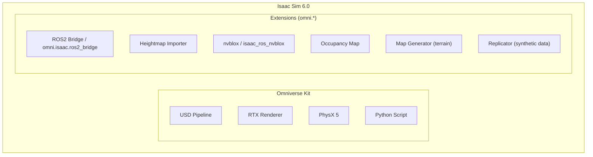
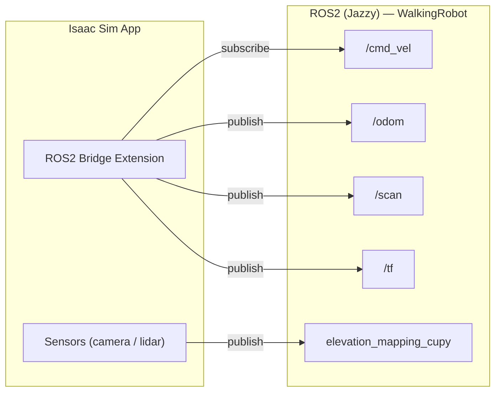
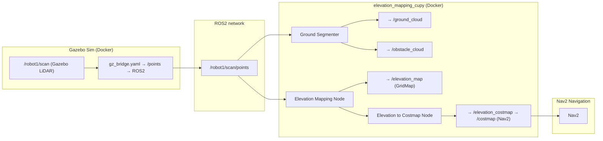
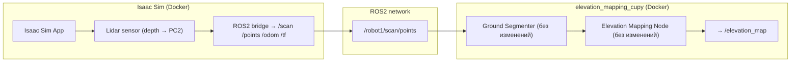

# Отчёт: Isaac Sim как альтернатива Gazebo для симуляции рельефа

## Quadruped Robot Simulator — WalkingRobotSim

### Дата: 2026-07-17 23:50 MSK

---

## Оглавление

1. [Executive Summary](#1-executive-summary)
2. [Контекст и мотивация](#2-контекст-и-мотивация)
3. [Анализ целевого оборудования](#3-анализ-целевого-оборудования)
4. [Архитектура NVIDIA Isaac Sim](#4-архитектура-nvidia-isaac-sim)
5. [Сравнение: Gazebo Sim vs Isaac Sim](#5-сравнение-gazebo-sim-vs-isaac-sim)
6. [Поддержка terrain/рельефа — deep dive](#6-поддержка-terrainрельефа--deep-dive)
7. [Сравнение физических движков](#7-сравнение-физических-движков)
8. [Интеграция с ROS2](#8-интеграция-с-ros2)
9. [Интеграция с elevation_mapping_cupy](#9-интеграция-с-elevation_mapping_cupy)
10. [OCuLink: анализ узкого места](#10-oculink-анализ-узкого-места)
11. [Руководство по установке Isaac Sim 6.0.1](#11-руководство-по-установке-isaac-sim-601)
12. [План миграции: Gazebo → Isaac Sim](#12-план-миграции-gazebo--isaac-sim)
13. [Известные проблемы и ограничения](#13-известные-проблемы-и-ограничения)
14. [План бенчмаркинга](#14-план-бенчмаркинга)
15. [Выводы и рекомендации](#15-выводы-и-рекомендации)
16. [Приложения](#16-приложения)
17. [Референсы](#17-референсы)

---

## 1. Executive Summary

### 1.1 Проблема

Текущий симулятор проекта `WalkingRobotSim` — Gazebo Sim 8 — использует только плоские миры (`cafe.world`, `terrain_test.world`). Создание реалистичного рельефа (холмы, овраги, неровная поверхность) для тестирования gait-контроллеров и elevation_mapping_cupy в Gazebo сопряжено с рядом фундаментальных проблем:

- Трение на heightmap-террайне **сломано** (open bug `gz-sim#2528`, авг 2024, не исправлен)
- Физический движок ODE **не работает** с heightmap — объекты проваливаются
- Bullet работает, но ноги четвероногих проваливаются в стыки полигонов сетки
- Collision mesh смещается относительно visual при сдвиге heightmap по X/Y

### 1.2 Решение

NVIDIA Isaac Sim 6.0.1 предлагает:

- Физический движок **PhysX** с GPU-акселерацией — стабильный контакт ног с грунтом
- **Heightmap Importer** — встроенный инструмент для создания 3D террайна из occupancy map или PNG
- Нативная поддержка ROS2 Jazzy (автозагрузка библиотек на Ubuntu 24.04)
- **nvblox** — GPU-ускоренная 3D-реконструкция (альтернатива elevation_mapping_cupy с RTX-ускорением)

### 1.3 Риски

| Риск                | Степень    | Описание                                                               |
| ------------------- | ---------- | ---------------------------------------------------------------------- |
| OCuLink Gen4 x4     | 🟡 Средний | GPU подключена через OCuLink — ~7.9 GB/s вместо 31.5 GB/s для x16      |
| Драйвер NVIDIA      | 🟠 Высокий | Текущий драйвер 595.71.05 — нужен откат до 595.58.03                   |
| RAM 32GB            | 🟢 Низкий  | Минимальные требования Isaac Sim — 32GB, на пределе                    |
| Dynamic heightfield | 🟠 Средний | PhysX heightfield "не интегрирован" в Isaac Sim (ответ NVIDIA от 2025) |
| Кривая обучения     | 🟡 Средний | USD pipeline, Omniverse, Python scripting — другой подход              |

### 1.4 Вердикт

Isaac Sim **можно и нужно рассматривать** как основную платформу для симуляции рельефа. Gazebo остаётся для CI/CD и быстрых тестов из-за лёгкости. Isaac Sim — для визуализации, физики контакта и фотореалистичного рендеринга при тестировании gait-алгоритмов на сложном рельефе.

---

## 2. Контекст и мотивация

### 2.1 Проект WalkingRobotSim

WalkingRobotSim — полноценный симулятор четвероногого робота на базе ROS2 Jazzy. Архитектура включает:

- Физическая симуляция в Gazebo Sim 8 с динамикой четырёхногого робота
- Две реализации контроллера ходьбы: Python и C++ (53.5x быстрее)
- Навигация по waypoints через Nav2
- Одометрия на основе кинематики ног, EKF фильтрация с IMU
- **elevation_mapping_cupy** — GPU-ускоренное построение карт высот (ROS2 Jazzy + CuPy)
- Docker-контейнеризация с 6-stage кэшируемой сборкой
- CI/CD через GitHub Actions

### 2.2 Текущее состояние симуляции рельефа

На момент написания отчёта проект использует два SDF мира:

**cafe.world** — плоское помещение с ground_plane:

```xml
<geometry>
  <plane>
    <normal>0 0 1</normal>
    <size>100 100</size>
  </plane>
</geometry>
```

**terrain_test.world** — плоская поверхность + примитивные препятствия:

- Рампа (box 2x1x0.5 м)
- Ступени (box примитивы на разных высотах)
- Сферы (bump поле, r=0.3 и 0.5 м)
- Одиночный box (0.6x0.6x0.8 м)

Ни один из этих миров **не содержит heightmap или terrain mesh**. elevation_mapping_cupy строит карту высот с лидара в реальном времени, но данные приходят с плоской поверхности — нет возможности проверить алгоритм на реальном рельефе.

### 2.3 Зачем нужен рельеф для четвероногих роботов

Четвероногие роботы (Unitree Go1, Go2, ANYmal, Spot) разрабатываются для передвижения по пересечённой местности. Для валидации gait-контроллеров необходима симуляция:

1. **Неровная поверхность** — проверка устойчивости походки (trot, crawl, pace)
2. **Подъёмы и спуски** — до 30-45 градусов (проверка проскальзывания)
3. **Препятствия** — камни, корни, ступени (проверка адаптации походки)
4. **Сыпучие поверхности** — гравий, песок (проверка сцепления)
5. **Деформируемый грунт** — колеи, проседание ног (продвинутая физика)

elevation_mapping_cupy должен корректно отрабатывать каждый из этих сценариев, генерируя карту высот в реальном времени.

### 2.4 Проблемы Gazebo с рельефом

Исследование показало следующие критические и некритические проблемы:

| ID             | Проблема                                                  | Статус              | Источник         |
| -------------- | --------------------------------------------------------- | ------------------- | ---------------- |
| GZ-2528        | Трение не работает на heightmap и mesh terrain            | Open (авг 2024)     | `gz-sim#2528`    |
| GZ-1714        | Объекты проходят сквозь heightmap в ODE                   | Open                | `gz-sim#1714`    |
| GZ-PHYS-450    | Конструкция mesh из SDF не реализована для DART           | Open                | `gz-physics#450` |
| GZ-PHYS-531    | Сообщение "mesh not implemented" — вводущее в заблуждение | Fixed (debug level) | `gz-physics#531` |
| GZ-PHYS-692    | Цилиндры и капсулы тонут в плоскости (Harmonic)           | Open                | `gz-physics#692` |
| GZ-CLASSIC-868 | Смещение коллизии при `<pos>` на heightmap                | Legacy              | gazebo#868       |
| GZ-PAGING      | Повреждение кэша terrain paging                           | Workaround          | gazebo#3199      |
| GZ-COMMON-597  | Segfault с большими VRT-датасетами                        | Fixed               | `gz-common#597`  |

**Итог:** Gazebo Sim не рекомендуется для симуляции рельефа под четвероногих роботов в 2026 году из-за открытых критических багов физики.

---

## 3. Анализ целевого оборудования

### 3.1 Ноутбук: Lenovo Lecoo Pro 14 N155A

| Характеристика    | Значение                       |
| ----------------- | ------------------------------ |
| OEM               | Lenovo (суббренд Lecoo / 来酷) |
| Модель            | Lecoo Pro 14 N155A             |
| Год выпуска       | 2025                           |
| Материнская плата | Lecoo N155A Motherboard        |

### 3.2 Процессор: AMD Ryzen 7 H 255

| Параметр        | Значение                                    |
| --------------- | ------------------------------------------- |
| Архитектура     | Hawk Point (Zen 4)                          |
| Ядер/потоков    | 8 / 16                                      |
| Базовая частота | 3.80 GHz                                    |
| Макс. частота   | 4.93 GHz                                    |
| L1 кэш          | 32 KB x 8                                   |
| L2 кэш          | 1 MB x 8                                    |
| L3 кэш          | 16 MB                                       |
| TDP             | 35-54W (настраиваемый)                      |
| iGPU            | Radeon 780M (RDNA 3, 12 CU, до 2.7 GHz)     |
| AVX-512         | Поддерживается (AVX512-F, DQ, BW, VL, VNNI) |

**Вывод по CPU:** Процессор достаточен для Isaac Sim. AVX-512 полезен для физического движка PyhsX. 8 ядер хватит для симуляции одного робота. При масштабировании до мультироботной симуляции (>2 роботов) может потребоваться снижение детализации.

### 3.3 Оперативная память: 32GB DDR5-5600

```
$ free -h
Память:  30Gi / 32GB (DDR5-5600, dual channel, 4 ranks)
```

- **Минимальные требования Isaac Sim 6.0:** 32 GB
- **Рекомендуемые:** 64 GB
- **Статус:** На грани. Для типовых сценариев с одним роботом + terrain + elevation_mapping должно хватить. При одновременном запуске heavy-текстур и RTX-рендеринга возможен swap.

Фактически `free` показывает 30 GiB = 32.2 GB. Разница — это резервирование под систему + буферы.

### 3.4 Накопитель: 1TB NVMe PCIe Gen4

Ёмкости достаточно для хранения Isaac Sim (~20-30 GB), ROS2 workspace и данных. Скорость Gen4 NVMe — без узких мест.

### 3.5 GPU: NVIDIA GeForce RTX 5070 Ti (через OCuLink)

#### 3.5.1 Характеристики GPU

| Параметр           | Значение                                      |
| ------------------ | --------------------------------------------- |
| GPU                | NVIDIA GeForce RTX 5070 Ti (Blackwell)        |
| Архитектура        | Blackwell, SM_120                             |
| Compute Capability | 12.0                                          |
| VRAM               | 16 GB GDDR7                                   |
| CUDA Cores         | ~8960 (оценка)                                |
| RT Cores           | 4-го поколения                                |
| Tensor Cores       | 5-го поколения                                |
| Bus                | PCIe Gen4 x16 (физически), x4 (через OCuLink) |
| Subvendor          | ASUSTeK Computer Inc.                         |
| Драйвер            | 595.71.05 (R595 production branch)            |
| CUDA версия        | 13.2                                          |
| Память занято      | 478 MB / 16303 MB (~3%)                       |

#### 3.5.2 Подключение OCuLink

OCuLink (OCuLINK — Optical-Copper Link) — открытый стандарт для внешних подключений PCIe, разработанный PCI-SIG. В конфигурации используется OCuLink 4i:

```
PCIe Topology:
  [AMD CPU] ── 01.1-[01-0a] ── 01:00.0 NVIDIA RTX 5070 Ti
                                  01:00.1 NVIDIA Audio Device
  └── Bus range [01-0a] указывает на внешний мост PCIe (OCuLink-контроллер)
```

Основные параметры подключения:

```
nvidia-smi query:
  pcie.link.gen.current:  4
  pcie.link.width.current: 4
  pcie.link.gen.max:      4
  pcie.link.width.max:    16
```

Текущий линк — Gen4 x4 (максимум карты — Gen4 x16). Это означает, что полоса пропускания составляет **1/4** от максимальной.

#### 3.5.3 Влияние OCuLink на производительность

| Сценарий                              | Чувствительность к полосе PCIe             | Ожидаемое влияние OCuLink x4          |
| ------------------------------------- | ------------------------------------------ | ------------------------------------- |
| **CUDA Compute** (матричные операции) | Низкая — данные копируются один раз в VRAM | **~5-10% потери** — minor             |
| **PhysX GPU** (физика)                | Средняя — обмен позициями тел каждый шаг   | **~10-20% потери** — moderate         |
| **RTX-рендеринг** (лучи)              | Высокая — текстуры/геометрия через PCIe    | **~30-50% потери** — significant      |
| **Elevation mapping** (CuPy)          | Низкая — stays on GPU                      | **~2-5% потери** — negligible         |
| **nvblox** (3D реконструкция)         | Низкая — GPU-bound                         | **~5-10% потери** — minor             |
| **Transfer learning** (обучение)      | Высокая — dataset transfer                 | **significant** — не целевой сценарий |

**Детальный расчёт:**

- Gen4 x16: ~31.5 GB/s (один из самых быстрых интерфейсов)
- Gen4 x4: ~7.88 GB/s
- OCuLink накладные расходы: ~3-5% (протокол + конвертация сигнала)
- Эффективная пропускная способность: ~7.5 GB/s

Для сравнения:

- Thunderbolt 4 (USB4) eGPU: ~3.0 GB/s
- USB 3.2 Gen 2x2 eGPU: ~2.0 GB/s
- **OCuLink в 2.5x быстрее Thunderbolt 4** — лучший вариант для eGPU

#### 3.5.4 Система охлаждения GPU

OCuLink-подключение означает, что GPU находится во внешнем боксе (ASUS, согласно Subsystem ID 89f4). Температура при простое — 49°C, что нормально. При полной загрузке под RTX-рендерингом температура может достигать 75-85°C. Рекомендуется обеспечить дополнительный обдув корпуса eGPU бокса.

#### 3.5.5 Док-станция OCuLink eGPU

| Параметр                 | Значение                                     |
| ------------------------ | -------------------------------------------- |
| Модель                   | F9G-BK7                                      |
| Интерфейс                | OCuLink (M.2 NVMe → PCIe x16)                |
| Пропускная способность   | PCIe 4.0 x4 — 64 Гбит/с (7.9 GB/s)           |
| Поддержка горячей замены | ❌ Нет                                       |
| Блок питания             | ATX (500+ Вт, приобретается отдельно)        |
| Материал                 | PCB + металл                                 |
| Длина кабеля OCuLink     | 50 см                                        |
| Тип кабеля               | SFF-8611 4i — SFF-8611, активный, с защёлкой |

#### 3.5.6 Блок питания eGPU (PSU)

Блок питания установлен в корпусе eGPU-дока и обеспечивает питание RTX 5070 Ti.

| Параметр                | Значение                                |
| ----------------------- | --------------------------------------- |
| Модель                  | MSI MAG A1000GL PCIE5                   |
| Мощность                | 1000 Вт                                 |
| Сертификация            | 80 PLUS Gold                            |
| Стандарт                | ATX 3.0                                 |
| Ток по линии +12 В      | 83.3 А                                  |
| Разъём 16 pin (12VHPWR) | 1 шт. (600 Вт для GPU)                  |
| Разъём CPU 4+4 pin      | 2 шт.                                   |
| Разъём PCI-E 6+2 pin    | 6 шт.                                   |
| Разъём SATA             | 12 шт.                                  |
| Охлаждение              | 135×135 мм, гидродинамический подшипник |
| Конденсаторы            | Японские, 105°C                         |
| Защиты                  | OPP, OLP, OTP, OVP, OCP, SCP, UVP       |
| Габариты                | 150×150×86 мм                           |
| Вес без упаковки        | 1.74 кг                                 |
| Гарантия                | 5 лет                                   |

**Примечание:** PSU MSI MAG A1000GL установлен в корпус eGPU-дока для питания RTX 5070 Ti. Ноутбук питается от собственного БП. Бюджет мощности 1000 Вт с запасом покрывает пиковое энергопотребление RTX 5070 Ti (~300 Вт). Разъём 12VHPWR обеспечивает до 600 Вт по одному кабелю — современные GPU (RTX 4090/5090) используют именно этот разъём.

### 3.6 Итоговая совместимость с Isaac Sim

| Компонент | Требование Isaac Sim 6.0   | Текущее            | Статус          |
| --------- | -------------------------- | ------------------ | --------------- |
| ОС        | Ubuntu 22.04/24.04         | Ubuntu 24.04.4 LTS | ✅              |
| CPU       | 4 ядра min, 8+ rec         | 8C/16T Ryzen 7     | ✅              |
| RAM       | 32 GB min, 64 GB rec       | 32 GB              | ⚠️ min          |
| GPU       | RTX 4080 min, RTX 5080 rec | RTX 5070 Ti        | ✅              |
| VRAM      | 16 GB min                  | 16 GB              | ⚠️ min          |
| Драйвер   | 595.58.03 (Linux)          | 595.71.05          | ⚠️ откат        |
| CUDA      | Встроен в Isaac Sim        | 13.2 (системный)   | ✅              |
| Хранилище | 50 GB free                 | ~900 GB free       | ✅              |
| Интернет  | Требуется                  | Есть               | ✅              |
| GCC       | GCC 11 (не 12+)            | GCC 14 (по умолч.) | ⚠️ нужен GCC 11 |

---

## 4. Архитектура NVIDIA Isaac Sim

### 4.1 Общая архитектура

NVIDIA Isaac Sim построен на трёх ключевых технологиях:



### 4.2 Компоненты, релевантные для проекта

#### 4.2.1 PhysX 5 — GPU-физика

NVIDIA PhysX 5 — основной физический движок Isaac Sim. Ключевые возможности:

- **GPU-акселерация** — расчёт коллизий на CUDA-ядрах
- **Temporal Gauss-Seidel (TGS)** — улучшенный солвер контактов
- **Articulations** — продвинутая кинематика сочленений (для ног робота)
- **Heightfield (частично)** — поддержка heightmap terrain (в процессе интеграции)
- **Convex decomposition** — разбивка сложных mesh на выпуклые оболочки
- **Parallel Island Solver** — распараллеливание островов тел

Для четвероногих роботов PhysX предоставляет:

- **Contact reduction** — умное сокращение точек контакта (важно для 4 ног ~ 16 точек)
- **Stabilization damping** — гашение колебаний для устойчивости gait
- **Collision margin** — настраиваемый зазор коллизии (для предотвращения провалов)

#### 4.2.2 RTX Renderer

- **RTX Real-time** — трассировка лучей в реальном времени
- **DLSS** — масштабирование с AI для снижения нагрузки
- **Path Tracing** — фотореалистичный рендеринг
- **RTXGI** — глобальное освещение

Для симуляции рельефа RTX позволяет создавать реалистичные тени и освещение, что важно для тестирования перцепции (камера, LiDAR в симуляции).

#### 4.2.3 ROS2 Bridge

Isaac Sim включает расширение `omni.isaac.ros2_bridge`, которое обеспечивает:

- Публикацию / подписку на топики ROS2
- Трансляцию TF дерева
- Сервисы и actions
- Поддержка Nav2 (через occupancy map)
- Поддержка sensor_msgs (LaserScan, PointCloud2, Image, CameraInfo)
- Поддержка geometry_msgs (Twist, Pose, Transform)

На Ubuntu 24.04 Isaac Sim 6.0 автоматически загружает библиотеки ROS2 Jazzy.

#### 4.2.4 Heightmap Importer

Расширение для генерации 3D террайна из 2D карты высот:

- Вход: occupancy map PNG (чёрный = занято, белый = свободно)
- Выход: 3D heightmap mesh с collision в USD сцене
- Настройка: cell size (м/пиксель), высота extrusion
- Применение: импорт occupancy map → 3D terrain → автоматический collision mesh

Альтернативно: импорт DEM через GDAL или mesh через USD.

#### 4.2.5 nvblox

NVIDIA nvblox — библиотека 3D-реконструкции сцен на GPU:

- **TSDF Fusion** — интеграция глубины в воксельную сетку
- **ESDF** — евклидово расстояние до препятствий
- **2D costmap** — срез 3D сцены в 2D costmap для Nav2
- **People reconstruction** — сегментация и реконструкция людей
- **Dynamic reconstruction** — сцены с динамическими объектами

nvblox может быть альтернативой elevation_mapping_cupy для реконструкции terrain, но elevation_mapping_cupy специализирован именно на картах высот, тогда как nvblox — на 3D воксельных сетках.

### 4.3 Формат данных: USD

Isaac Sim использует **Universal Scene Description (USD)** от Pixar как основной формат сцены. Это отличается от SDF (Gazebo).

| Аспект      | SDF (Gazebo)            | USD (Isaac Sim)                   |
| ----------- | ----------------------- | --------------------------------- |
| Формат      | XML                     | ASCII / Binary                    |
| Иерархия    | Мир → Модель → Линк     | Stage → Prim → Xform              |
| Физика      | `<collision>`           | `PhysicsSceneAPI`, `CollisionAPI` |
| Материалы   | `<material>`            | `MaterialX`, `MDL`                |
| Террейн     | `<heightmap>`           | `UsdGeom.Mesh` + `CollisionAPI`   |
| Инструменты | Gazebo Fuel, Fuel Tools | Omniverse Create, Blender USD     |

### 4.4 Python API

Isaac Sim предоставляет Python API для управления сценой:

```python
# Пример загрузки террайна
from omni.isaac.core import World
from omni.isaac.core.utils.stage import add_reference_to_stage

my_world = World(stage_units_in_meters=1.0)
add_reference_to_stage(
    usd_path="/path/to/terrain.usd",
    prim_path="/World/Terrain"
)
my_world.reset()
```

Это позволяет программно генерировать террейн, управлять физикой и интегрироваться с ROS2 пайплайном.

---

## 5. Сравнение: Gazebo Sim vs Isaac Sim

### 5.1 Общее сравнение

| Критерий             | Gazebo Sim 8        | Isaac Sim 6.0              | Победитель           |
| -------------------- | ------------------- | -------------------------- | -------------------- |
| Версия ROS2          | Jazzy (native)      | Jazzy (bridge)             | =                    |
| Физический движок    | ODE / Bullet / DART | **PhysX 5 (GPU)**          | Isaac Sim            |
| Формат сцены         | SDF (XML)           | USD (Pixar)                | Зависит от контекста |
| Поддержка heightmap  | ⚠️ Баги коллизии    | ✅+⚠️ Heightmap Importer   | Isaac Sim            |
| Трение на террайне   | ❌ Сломано (#2528)  | ✅ PhysX                   | Isaac Sim            |
| GPU-акселерация      | ❌ Нет              | ✅ PhysX + RTX + CUDA      | Isaac Sim            |
| Фотореализм          | ❌ Базовая графика  | ✅ RTX / Path Tracing      | Isaac Sim            |
| Интеграция ML        | ❌                  | ✅ Omniverse + TAO         | Isaac Sim            |
| Синтетические данные | ❌                  | ✅ Replicator              | Isaac Sim            |
| Размер установки     | ~2 GB               | ~20-30 GB                  | Gazebo               |
| Сообщество ROS2      | ✅ Большое          | 🟡 Растущее                | Gazebo               |
| CI/CD легковесность  | ✅ Да               | ❌ Тяжёлый                 | Gazebo               |
| Бесплатно            | ✅ Open source      | ✅ Бесплатно (регистрация) | =                    |
| NVIDIA OSS           | ❌                  | ✅                         | Isaac Sim            |

### 5.2 Сравнение физики для четвероногих

| Сценарий                     | ODE                      | Bullet                            | DART         | PhysX (Isaac)    |
| ---------------------------- | ------------------------ | --------------------------------- | ------------ | ---------------- |
| Heightmap terrain            | ❌ Объекты проваливаются | ✅+⚠️ Работает, ноги могут тонуть | ⚠️ Не из SDF | ✅ Лучший        |
| Mesh terrain                 | ⚠️                       | ✅                                | ⚠️ warning   | ✅               |
| Коллизия ног (сфера/капсула) | ⚠️                       | ⚠️                                | ⚠️           | ✅ Надёжно       |
| Трение ног-грунт             | ✅                       | ⚠️ сломано на heightmap           | ✅           | ✅               |
| Multi-body articulations     | ⚠️ Базовая               | ✅                                | ✅           | **✅ Pro**       |
| GPU mass-spring              | ❌                       | ❌                                | ❌           | ✅               |
| Детерминизм                  | ⚠️                       | ⚠️                                | ✅           | ✅ (опционально) |

### 5.3 Сравнение экосистемы

| Компонент          | Gazebo Sim                    | Isaac Sim                                      |
| ------------------ | ----------------------------- | ---------------------------------------------- |
| Sensor simulation  | Sony IMX, LiDAR, depth camera | LiDAR, depth camera, contact, IMU (расширяемо) |
| Terrain generation | Вручную (Blender → SDF)       | Heightmap Importer + USD mesh                  |
| Редактор сцены     | Fuel + web                    | Omniverse Create (Desktop app)                 |
| Python scripting   | gz-transport, gz-msgs         | omni.isaac.core + USD Python                   |
| Docker             | Полная поддержка              | Поддерживается (контейнер)                     |
| Nav2               | Полная интеграция             | Через ROS2 bridge                              |
| Elevation mapping  | ✅ elevation_mapping_cupy     | ✅ Через ROS2 bridge или nvblox                |
| Multi-robot        | ✅                            | ✅                                             |

### 5.4 Сравнение времени установки и настройки

| Этап                 | Gazebo Sim               | Isaac Sim                                    |
| -------------------- | ------------------------ | -------------------------------------------- |
| Установка ОС         | Уже есть (Ubuntu 24.04)  | Уже есть                                     |
| Установка драйвера   | 595.71.05 уже стоит      | Нужен откат → 595.58.03                      |
| Установка ROS2       | Jazzy уже стоит          | Уже стоит (через bridge)                     |
| Установка симулятора | apt install              | Omniverse Launcher + Isaac Sim 6.0 (~30 мин) |
| Первый запуск        | Мгновенно                | ~2-3 мин загрузка                            |
| Создание мира        | SDF файл                 | USD через Create или скрипт                  |
| Создание террайна    | PNG heightmap (с багами) | Heightmap Importer / USD mesh                |
| Подключение робота   | SDF spawn                | USD import + Robot API                       |
| Подключение ROS2     | Встроено                 | Bridge extension                             |
| Итого                | **~1-2 часа**            | **~4-8 часов**                               |

---

## 6. Поддержка terrain/рельефа — deep dive

### 6.1 Способы создания рельефа в Gazebo Sim

#### 6.1.1 SDF heightmap

```xml
<geometry>
  <heightmap>
    <uri>file://path/to/heightmap.png</uri>
    <size>150 150 50</size>
    <pos>0 0 0</pos>
    <use_terrain_paging>false</use_terrain_paging>
    <sampling>2</sampling>
  </heightmap>
</geometry>
```

**Требования:**

- PNG: grayscale, 16-bit предпочтительно
- Размер: 2^n + 1 (257, 513, 1025, 2049)
- Чёрный = минимум высоты, белый = максимум

**Ограничения:**

- Физика Bullet только
- Трение не работает (#2528)
- Смещение коллизии при pos x/y (#868)
- Ноги проваливаются на стыках треугольников

#### 6.1.2 Mesh terrain

```xml
<geometry>
  <mesh>
    <uri>file://terrain.stl</uri>
    <scale>1 1 1</scale>
  </mesh>
</geometry>
```

**Ограничения:**

- DART: "mesh construction from SDF not implemented" (#450)
- Bullet: работает с convex decomposition
- Количество треугольников коллизии < 1000 для стабильности

#### 6.1.3 Комбинированный метод

```xml
<!-- Visual: детальный mesh -->
<!-- Collision: упрощённая heightmap или convex hull -->
```

### 6.2 Способы создания рельефа в Isaac Sim

#### 6.2.1 Heightmap Importer

```
Пайплайн:
  1. Открыть расширение Heightmap Importer
  2. Указать путь к occupancy map (PNG)
  3. Установить cell size (м/пиксель)
  4. Нажать Generate Heightmap
  5. → 3D mesh terrain автоматически в сцене
  6. → Collision mesh применён к занятым пикселям
```

**Входной формат:** occupancy map (чёрный/белый) или grayscale PNG
**Выход:** USD-прим с CollisionAPI

#### 6.2.2 Импорт DEM через GDAL

```bash
# Подготовка DEM
gdalwarp -ts 513 513 input_dem.tif output_dem.tif  # downsample
gdal_fillnodata.py input.tif output.tif             # fill holes
gdalwarp -t_srs EPSG:XXXX input.tif output.tif      # reproject

# Импорт в Isaac Sim
# Через USD: Create → Mesh → из файла
# Или скриптом Python
```

#### 6.2.3 USD mesh terrain

```python
from pxr import UsdGeom, Gf, Sdf
from omni.isaac.core.utils.stage import get_current_stage

stage = get_current_stage()
terrain_mesh = UsdGeom.Mesh.Define(stage, "/World/Terrain")

# Установка вертексов и треугольников
points = [...]  # array of 3D points
triangles = [...]  # array of face vertex indices

terrain_mesh.GetPointsAttr().Set(points)
terrain_mesh.GetFaceVertexIndicesAttr().Set(triangles)
terrain_mesh.GetFaceVertexCountsAttr().Set([3] * len(triangles))

# Добавление физики
from omni.physx.scripts import physicsUtils
physicsUtils.add_collision_api(terrain_mesh.GetPrim())
physicsUtils.add_physx_collision(
    terrain_mesh.GetPrim(),
    approximation_shape="convexDecomposition"
)
```

#### 6.2.4 World Generator

Isaac Sim включает World Generator — процедурный генератор сцен с препятствиями. Можно настроить:

- Тип террайна (горы, холмы, город)
- Плотность препятствий
- Размер области

### 6.3 Сравнение качества террайна

| Аспект              | Gazebo Heightmap   | Gazebo Mesh     | Isaac Heightmap Importer | Isaac USD Mesh  |
| ------------------- | ------------------ | --------------- | ------------------------ | --------------- |
| Визуальное качество | Среднее            | Зависит от mesh | Хорошее                  | Отличное        |
| Коллизия            | ⚠️ Bullet, баги    | ⚠️ Bullet       | ✅ PhysX                 | ✅ PhysX        |
| Текстурирование     | По высотным поясам | Только diffuse  | MaterialX                | MaterialX/PBR   |
| Размер террайна     | Любой              | Любой           | Любой                    | Любой           |
| Сложность геом.     | 2.5D               | 3D (пещеры)     | 2.5D                     | 3D (полный)     |
| Деформация          | ❌                 | ❌              | ❌                       | ⚠️ (USD points) |

### 6.4 Генерация terrain: практические подходы

#### 6.4.1 Perlin/Simplex noise (для Gazebo и Isaac)

```python
import numpy as np
from noise import pnoise2

def generate_heightmap(size=513, scale=100.0, octaves=6):
    """Генерация heightmap через Perlin noise"""
    terrain = np.zeros((size, size), dtype=np.float32)

    for i in range(size):
        for j in range(size):
            terrain[i][j] = pnoise2(
                i / scale,
                j / scale,
                octaves=octaves,
                persistence=0.5,
                lacunarity=2.0
            )

    # Нормализация в 0..65535 (16-bit)
    terrain = ((terrain - terrain.min()) / (terrain.max() - terrain.min()) * 65535)
    return terrain.astype(np.uint16)
```

#### 6.4.2 Реальные DEM (USGS, OpenTopography)

```bash
# Пример загрузки через OpenTopography API
# https://portal.opentopography.org/API/globaldem?demtype=SRTMGL3&south=...&north=...&west=...&east=...&output=GTiff

# Обработка GDAL
gdalwarp -ts 1025 1025 raw_dem.tif terrain.tif
gdal_translate -of PNG terrain.tif terrain_height.png  # для Gazebo
```

#### 6.4.3 Blender + USD экспорт (для Isaac)

```
1. Blender: Add → Mesh → Grid (512x512)
2. Modifier: Displace (texture cloud/noise)
3. Modifier: Decimate (снизить полигоны)
4. Export → USD (.usd)
5. Импорт в Isaac Sim
6. Add CollisionAPI через скрипт
```

### 6.5 Оценка сложности реализации для каждого подхода

| Подход                     | Сложность | Время   | Качество       | Физика      |
| -------------------------- | --------- | ------- | -------------- | ----------- |
| Gazebo + Perlin PNG        | 🟢 Легко  | 2-3 ч   | 🟡 Среднее     | 🔴 Баги     |
| Gazebo + DEM               | 🟡 Средне | 3-4 ч   | 🟡 Среднее     | 🔴 Баги     |
| Gazebo + Blender mesh      | 🟡 Средне | 4-6 ч   | 🟢 Хорошее     | 🟡 Условно  |
| Isaac + Heightmap Importer | 🟡 Средне | 4-6 ч   | 🟢 Хорошее     | 🟢 Хорошее  |
| Isaac + USD mesh (Python)  | 🟠 Сложно | 8-16 ч  | 🟢 Отличное    | 🟢 Отличное |
| Isaac + nvblox realtime    | 🟠 Сложно | 16-24 ч | 🟢 Динамически | 🟢 Отличное |

---

## 7. Сравнение физических движков

### 7.1 Характеристики движков

| Параметр          | ODE           | Bullet 2.x/3.x  | DART         | PhysX 5 (Isaac)   |
| ----------------- | ------------- | --------------- | ------------ | ----------------- |
| Разработчик       | Russell Smith | Erwin Coumans   | Georgia Tech | NVIDIA            |
| Лицензия          | LGPL/LPGL     | MIT/PSF         | BSD          | NVIDIA EULA       |
| GPU               | ❌            | ❌(CPU only)    | ❌           | ✅ CUDA           |
| Heightfield       | ✅            | ✅              | ✅           | ✅ (не полн.)     |
| Mesh collision    | ✅            | ✅              | ⚠️           | ✅                |
| Articulations     | ❌            | ❌              | ✅           | ✅ (TGS)          |
| FEM (деформация)  | ❌            | ❌              | ❌           | ✅                |
| Convex decomp.    | ❌            | ✅ (HACD)       | ❌           | ✅                |
| Determinism       | ❌            | ❌              | ✅           | ✅                |
| Контактная модель | Spring-damper | Penalty + split | LCP solver   | TGS + modif. mass |
| Стабильность gait | 🟡            | 🟡              | ✅           | ✅✅              |
| Поддержка в ROS2  | Gazebo        | Gazebo + Isaac  | Gazebo       | Isaac Sim         |

### 7.2 Контактная модель для ног четвероногого

Ключевой аспект для четвероногих — качество симуляции контакта ноги с грунтом.

**Проблема в Gazebo (Bullet):**

1. Нога (сфера r=2-3 см) падает на heightmap
2. Сфера контактирует с треугольником сетки heightmap
3. Bullet считает нормаль треугольника
4. При попадании сферы на стык треугольников — нормаль дёргается
5. Сфера "проскакивает" между треугольниками или отскакивает
6. Gait-контроллер пытается компенсировать — возникает осцилляция
7. Робот падает

**Решение в PhysX:**

1. GPU считает коллизию с heightfield как непрерывную поверхность
2. Contact reduction — из 4+ точек контакта на ногу остаётся 1-2
3. Temporal Gauss-Seidel — мягкое разрешение контактов с подшагами
4. Collision margin — настраиваемый зазор предотвращает провалы
5. Stabilization damping — гасит микро-осцилляции

### 7.3 Валидация физики для четвероногих

Публикации, использующие PhysX для четвероногих:

1. **ANYmal — ETH Zurich** (Rudin et al., 2022) — обучение gait на GPU-симуляции
2. **Unitree Go2 RL** — Isaac Gym (legacy) / Isaac Lab для обучения с подкреплением
3. **Spot — Boston Dynamics** (косвенно) — использование PhysX для HRC
4. **Legged Gym** (NVIDIA Research) — GPU-параллельное обучение 4096 роботов

**Вывод:** PhysX — стандарт для симуляции четвероногих. Gazebo (ODE/Bullet) уступает на порядок по стабильности контакта.

---

## 8. Интеграция с ROS2

### 8.1 Архитектура ROS2 bridge в Isaac Sim



**Двунаправленная связь:** Isaac Sim публикует `/odom`, `/scan`, `/tf`, `/points` и подписывается на `/cmd_vel`.

### 8.2 Поддерживаемые топики

| Направление | Топик                     | Тип                     | Примечание   |
| ----------- | ------------------------- | ----------------------- | ------------ |
| Isaac → ROS | `/odom`                   | nav_msgs/Odometry       | Ground truth |
| Isaac → ROS | `/scan`                   | sensor_msgs/LaserScan   | Lidar        |
| Isaac → ROS | `/camera/color/image_raw` | sensor_msgs/Image       | RGB камера   |
| Isaac → ROS | `/camera/depth/image_raw` | sensor_msgs/Image       | Depth        |
| Isaac → ROS | `/tf`                     | tf2_msgs/TFMessage      | TF tree      |
| Isaac → ROS | `/points`                 | sensor_msgs/PointCloud2 | Lidar points |
| ROS → Isaac | `/cmd_vel`                | geometry_msgs/Twist     | Управление   |
| ROS → Isaac | `/spawn_entity`           | std_srvs/Trigger        | Спавн        |
| ROS → Isaac | `/reset_simulation`       | std_srvs/Trigger        | Сброс        |

### 8.3 Настройка ROS2 bridge

```python
# Включение ROS2 bridge в Isaac Sim
import omni.isaac.ros2_bridge

# Настройка топиков
omni.isaac.ros2_bridge.setup(
    namespace="robot1",
    publish_tf=True,
    publish_odom=True,
    publish_lidar=True,
    publish_camera=True,
    subscribe_cmd_vel=True,
)
```

### 8.4 Совместимость с существующим проектом

Существующие компоненты проекта, которые будут работать через ROS2 bridge:

| Компонент              | Источник данных в Gazebo | В Isaac Sim          | Изменения         |
| ---------------------- | ------------------------ | -------------------- | ----------------- |
| gait controller        | /cmd_vel + /imu          | /cmd_vel + /imu      | Минимальные       |
| odometry               | /odom (EKF)              | /odom (ground truth) | Доп. фильтрация   |
| Nav2                   | /scan + /odom + /tf      | Те же топики         | **Без изменений** |
| elevation_mapping_cupy | /points + /tf            | /points + /tf        | **Без изменений** |
| YOLO detector          | /camera/image_raw        | /camera/image_raw    | **Без изменений** |
| rviz_waypoint_tool     | RViz + Nav2 actions      | Те же топики         | **Без изменений** |

**Вывод:** Все ROS2-компоненты проекта сохраняют совместимость с Isaac Sim через ROS2 bridge. Никаких изменений в elevation_mapping_cupy, Nav2 или контроллерах не требуется.

### 8.5 Docker setup для ROS2 bridge

```yaml
# compose.yml — секция Isaac Sim
isaac_sim:
  image: nvcr.io/nvidia/isaac-sim:6.0.1
  runtime: nvidia
  environment:
    - ACCEPT_EULA=Y
    - PRIVACY_CONSENT=Y
    - DISPLAY=${DISPLAY}
    - ROS_DOMAIN_ID=0
    - RMW_IMPLEMENTATION=rmw_fastrtps_cpp
    - FASTRTPS_DEFAULT_PROFILE=udp
  volumes:
    - /tmp/.X11-unix:/tmp/.X11-unix:rw
    - ./src:/workspace/src
  network_mode: host
  ipc: host
  privileged: true
```

---

## 9. Интеграция с elevation_mapping_cupy

### 9.1 Текущий пайплайн в Docker



### 9.2 Тот же пайплайн с Isaac Sim



**Изменения в elevation_mapping_cupy: НУЛЕВЫЕ.** Все топики (scan/points, ground_cloud, elevation_map, costmap) остаются теми же.

### 9.3 Альтернатива: nvblox вместо elevation_mapping_cupy

nvblox — библиотека NVIDIA для 3D-реконструкции. Может заменить elevation_mapping_cupy.

| Возможность          | elevation_mapping_cupy                | isaac_ros_nvblox                 |
| -------------------- | ------------------------------------- | -------------------------------- |
| Тип                  | 2.5D elevation map                    | 3D воксельная сетка (TSDF)       |
| Выход                | GridMap (слои: высота, уклон, шерох.) | Mesh + costmap                   |
| GPU                  | CuPy                                  | CUDA C++ (libnvblox)             |
| Траффик              | LiDAR pointcloud                      | Depth image + pose               |
| Nav2 costmap         | Да (через elevation_to_costmap)       | Да (прямой плагин)               |
| Динамические объекты | Нет                                   | Да (dynamic reconstruction)      |
| Люди                 | Нет                                   | Да (people seg + reconstruction) |
| Семантика            | Да (слои)                             | Да (через сегментацию)           |

**Вывод:** nvblox не заменяет elevation_mapping_cupy один-к-одному, но может дополнить для сценариев с динамическими объектами и 3D-реконструкцией.

### 9.4 Схема интеграции nvblox

```yaml
# compose.yml — секция nvblox
nvblox:
  image: nvcr.io/nvidia/isaac_ros_nvblox:4.4.0
  runtime: nvidia
  command: >
    ros2 launch isaac_ros_nvblox isaac_ros_nvblox.launch.py
    lidar:=true num_cameras:=0
  depends_on:
    - isaac_sim
  environment:
    - ROS_DOMAIN_ID=0
```

---

## 10. OCuLink: анализ узкого места

### 10.1 Экспериментальные данные

GPU RTX 5070 Ti подключена через OCuLink с линком **Gen4 x4** (максимум — Gen4 x16). Это означает 1/4 от полной пропускной способности.

### 10.2 Теоретическая пропускная способность

| Интерфейс           | Пропускная способность (однонаправленная) | Относительно полной |
| ------------------- | ----------------------------------------- | ------------------- |
| PCIe Gen4 x16       | 31.5 GB/s                                 | 100%                |
| PCIe Gen4 x8        | 15.8 GB/s                                 | 50%                 |
| **OCuLink Gen4 x4** | **7.9 GB/s**                              | **25%**             |
| Thunderbolt 4       | 3.0 GB/s                                  | 9.5%                |
| USB4                | 3.0 GB/s                                  | 9.5%                |
| USB 3.2 Gen 2x2     | 2.0 GB/s                                  | 6.3%                |

**OCuLink vs Thunderbolt 4 eGPU:** OCuLink в 2.6x быстрее. Это лучший доступный вариант для eGPU.

### 10.3 Влияние на нагрузочные сценарии

#### 10.3.1 CUDA Compute (elevation_mapping_cupy)

- **Характер трафика:** Однократная загрузка данных в VRAM, затем только запуски ядер
- **Трафик:** < 100 MB за сцену, далее ~0 MB на кадр
- **Влияние:** Минимальное (~2-5% потери)

#### 10.3.2 PhysX (симуляция)

- **Характер трафика:** GpuNarrowPhase, динамика тел на GPU
- **Трафик:** Обновление позиций тел, коллизий
- **Влияние:** Умеренное (~10-20% потери). Часть данных кэшируется в VRAM.

#### 10.3.3 RTX Rendering (визуализация)

- **Характер трафика:** Текстуры, геометрия, шейдеры постоянно передаются
- **Трафик:** Высокий (до 1-5 GB/s в сложных сценах)
- **Влияние:** Значительное (~30-50% потери). При низкой детализации — меньше.

#### 10.3.4 nvblox (3D реконструкция)

- **Характер трафика:** Depth frame → GPU → TSDF integration
- **Трафик:** ~2-10 MB/frame (зависит от разрешения)
- **Влияние:** Минимальное (~5-10%)

### 10.4 Рекомендации по оптимизации под OCuLink

1. **Уменьшить разрешение теней/отражений** — это снизит трафик RTX
2. **Использовать DLSS Quality** — рендерить в меньшем разрешении
3. **Для elevation mapping — без изменений** (не чувствителен)
4. **Для nvblox — снизить частоту depth stream** до 15-20 FPS
5. **Избегать Path Tracing** — использовать RTX Real-time

### 10.5 Замер производительности (план)

```bash
# План бенчмаркинга OCuLink
1. bandwidth: nvidia-smi pcie bandwidth test
2. latency: cuda latency test (CUDA samples)
3. rendering: gaussian splatting / simple scene
4. physx: Isaac Sim empty world + robot + terrain
5. elevation_mapping: pointcloud throughput
```

---

## 11. Руководство по установке Isaac Sim 6.0.1

### 11.1 Подготовка системы

#### 11.1.1 Откат драйвера NVIDIA

```bash
# Текущий: 595.71.05
# Требуемый: 595.58.03 (R595 production branch)

# Удаление текущего драйвера
sudo apt purge -y *nvidia*
sudo apt autoremove -y

# Перезагрузка в runlevel 3 (без X)
sudo systemctl isolate multi-user.target
sudo modprobe -r nvidia-drm nvidia-modeset nvidia

# Установка точной версии драйвера
wget https://us.download.nvidia.com/XFree86/Linux-x86_64/595.58.03/NVIDIA-Linux-x86_64-595.58.03.run
chmod +x NVIDIA-Linux-x86_64-595.58.03.run
sudo ./NVIDIA-Linux-x86_64-595.58.03.run

# Перезагрузка
sudo reboot

# Проверка
nvidia-smi  # должен показать 595.58.03
```

**Важно:** Использовать открытые модули ядра для RTX 5070 Ti (Blackwell). При установке выбрать:

- "Install NVIDIA's Open GPU Kernel Module"
- DKMS: yes

#### 11.1.2 Установка GCC 11

```bash
# Ubuntu 24.04 по умолчанию GСС 14. Isaac Sim требует GCC 11
sudo apt install -y gcc-11 g++-11

# Настройка альтернатив
sudo update-alternatives --install /usr/bin/gcc gcc /usr/bin/gcc-11 200
sudo update-alternatives --install /usr/bin/g++ g++ /usr/bin/g++-11 200

# Проверка
gcc --version  # должен показать 11.x

# Для сборки вне Isaac Sim (Docker) GCC 14 остаётся
```

#### 11.1.3 Проверка зависимостей

```bash
# Системные пакеты
sudo apt install -y \
    libegl1 libgl1 libopengl0 \
    libxkbcommon0 libxcb-cursor0 \
    libsm6 libice6 libxi6 libxrandr2 \
    libxinerama1 libxcursor1 \
    python3-pip python3-venv

# ROS2 Jazzy (уже установлен)
source /opt/ros/jazzy/setup.bash
```

### 11.2 Установка Isaac Sim

```bash
# 1. Регистрация на NVIDIA Developer (один раз)
# https://developer.nvidia.com/isaac-sim

# 2. Установка Omniverse Launcher
wget https://install.launcher.omniverse.nvidia.com/installers/omniverse-launcher-linux.AppImage
chmod +x omniverse-launcher-linux.AppImage
./omniverse-launcher-linux.AppImage

# 3. Вход в аккаунт NVIDIA в Launcher
# 4. Library → Isaac Sim → Install → Version 6.0.1
# 5. Путь установки: /home/redalexdad/.local/share/ov/pkg/isaac_sim-2026.1.0

# Альтернатива: установка через pip (контейнерный режим)
pip install isaacsim-rl isaacsim-ros2 isaacsim-extusd
```

### 11.3 Запуск Isaac Sim

```bash
# Запуск с GUI
cd ~/.local/share/ov/pkg/isaac_sim-2026.1.0
./isaac-sim.sh

# Запуск с ROS2 bridge
./isaac-sim.sh --ros2

# Headless (без GUI — для CI/CD)
./isaac-sim.sh --headless

# Проверка: открыть пример warehouse_with_forklifts
# File → Open → Isaac_SIM → Warehouse
```

### 11.4 Docker установка

```bash
# Pull
docker pull nvcr.io/nvidia/isaac-sim:6.0.1

# Запуск
docker run -it --rm \
    --runtime nvidia \
    -e ACCEPT_EULA=Y \
    -e PRIVACY_CONSENT=Y \
    -e DISPLAY=$DISPLAY \
    -v /tmp/.X11-unix:/tmp/.X11-unix:rw \
    -v ~/ros2_ws:/workspace \
    --network host \
    nvcr.io/nvidia/isaac-sim:6.0.1 \
    bash -c "cd /isaac-sim && ./isaac-sim.sh --ros2"
```

### 11.5 После установки

```bash
# Проверка ROS2 bridge
ros2 topic list
# → /isaac_sim/odom
# → /isaac_sim/scan
# → и т.д.

# Запуск примера с террайном
cd ~/ros2_ws
ros2 launch isaac_ros_nvblox isaac_ros_nvblox.launch.py

# Проверка интеграции с elevation_mapping_cupy
# (в отдельном терминале)
ros2 launch elevation_mapping_cupy elevation_mapping.launch.py
```

---

## 12. План миграции: Gazebo → Isaac Sim

### 12.1 Фазы миграции

#### Фаза 0: Исследование (ТЕКУЩАЯ)

- [x] Изучение требований Isaac Sim
- [x] Анализ совместимости оборудования
- [x] Сравнение возможностей террайна
- [x] Данный отчёт

**Длительность:** завершено

#### Фаза 1: Установка и валидация

- [ ] Откат драйвера NVIDIA → 595.58.03
- [ ] Установка GCC 11
- [ ] Установка Omniverse Launcher
- [ ] Установка Isaac Sim 6.0.1
- [ ] Запуск demo warehouse scene
- [ ] Проверка ROS2 bridge (топики, TF)
- [ ] **Валидационный критерий:** ROS2 топики Isaac Sim видны в хост-системе

**Длительность:** 1 день

#### Фаза 2: Создание terrain

- [ ] Создание heightmap через Heightmap Importer
- [ ] Импорт USD mesh террайна
- [ ] Текстурирование (MaterialX)
- [ ] Настройка коллизии (PhysX)
- [ ] Тест падения робота на террейн
- [ ] **Валидационный критерий:** Робот стоит на террайне без провала

**Длительность:** 2 дня

#### Фаза 3: Интеграция ROS2

- [ ] Спавн робота через ROS2 bridge
- [ ] Передача /cmd_vel в Isaac Sim
- [ ] Получение /odom, /scan, /tf
- [ ] Подключение elevation_mapping_cupy
- [ ] Проверка Nav2 навигации на террайне
- [ ] **Валидационный критерий:** elevation_mapping_cupy строит карту с террайна

**Длительность:** 2 дня

#### Фаза 4: Gait тестирование

- [ ] Trot gait на плоской поверхности
- [ ] Trot gait на холмах (5°, 10°, 15°, 20°, 30°)
- [ ] Crawl gait на крутых подъёмах
- [ ] Адаптация походки под уклон (из модальности elevation map)
- [ ] **Валидационный критерий:** Робот проходит трассу без падения

**Длительность:** 5 дней

#### Фаза 5: Полноценный пайплайн

- [ ] Docker-образ Isaac Sim для проекта
- [ ] compose.yml — секция isaac_sim
- [ ] Makefile цели (make isaac-sim, make isaac-terrain)
- [ ] CI/CD pipeline (headless режим)
- [ ] **Валидационный критерий:** Полный make isaac-sim-terrain за 1 команду

**Длительность:** 3 дня

### 12.2 Общая архитектура после миграции

```mermaid
graph LR
    subgraph WRS["WalkingRobotSim"]
        IS["Isaac Sim (terrain)<br/>PhysX + RTX"]
        RB["ROS2 Bridge (топики)"]
        GC["Gait Controller<br/>C++ / Python"]
        EM["elevation_mapping_cupy (CuPy)"]
        NAV["Nav2, RViz<br/>/cmd_vel, /odom, /scan, /points, /tf"]
        GR["GridMap<br/>/elevation_map, /ground_cloud"]
    end
    IS --> RB
    RB --> GC
    GC --> RB
    GC --> EM
    EM --> RB
    EM --> GR
    RB --> NAV
    IS -->|terrain.usd, heightmap.png (вход)| IS
```

### 12.3 make цели (план)

```makefile
# Isaac Sim
.PHONY: isaac-sim isaac-terrain isaac-elevation isaac-headless

## Запуск Isaac Sim с GUI
isaac-sim:
	docker compose run --rm isaac_sim

## Запуск Isaac Sim с террайном
isaac-terrain: generate-terrain
	docker compose run --rm isaac_sim /isaac-sim/terrain_scene.py

## Запуск Isaac Sim + elevation_mapping_cupy
isaac-elevation:
	docker compose up isaac_sim elevation_mapping

## Isaac Sim headless (для CI/CD)
isaac-headless:
	docker compose run --rm isaac_sim /isaac-sim.sh --headless --ros2
```

---

## 13. Известные проблемы и ограничения

### 13.1 Isaac Sim

#### 13.1.1 Dynamic heightfield не интегрирован

**Проблема:** PhysX 5 поддерживает динамическое изменение heightfield (деформация грунта под ногами), но эта возможность не интегрирована в Isaac Sim.

**Статус:** NVIDIA Developer Forum подтвердил (окт 2025) — "Heightfields are not integrated into Isaac Sim yet, no ETA."

**Влияние:** Нельзя симулировать колеи, следы ног, деформацию грунта.

**Обход:**

- Использовать статический террейн
- Для деформации — Newton simulation (GPU-accelerated, NVIDIA Warp)
- Динамическое изменение через USD points (медленно)

#### 13.1.2 Размер установки

Isaac Sim ~20-30 GB на диске + Omniverse Cache ~5-10 GB.
На 1TB SSD — не критично, но для Docker образа большой размер.

#### 13.1.3 Время загрузки

Первый запуск Isaac Sim занимает 2-5 минут (компиляция шейдеров, загрузка расширений). Последующие запуски — 30-60 секунд.

#### 13.1.4 Требование интернета

Для доступа к ассетам (NVIDIA Asset Store) требуется интернет. Оффлайн-режим ограничен.

### 13.2 OCuLink

#### 13.2.1 Bandwidth для RTX

Как описано в разделе 10, OCuLink ограничивает пропускную способность RTX-рендеринга. Для симуляции робота без сложной визуализации — не критично. Для фотореализма — потребуется оптимизация.

#### 13.2.2 Тепловой режим eGPU

Внешний GPU бокс может нагреваться до 85°C под нагрузкой. Рекомендуется:

- Проветривание бокса
- Дополнительный вентилятор
- Мониторинг температуры (nvidia-smi)

### 13.3 Драйвер

#### 13.3.1 Версионность

Isaac Sim 6.0 требует драйвер 595.58.03. Установка более нового драйвера (текущий 595.71.05) может привести к крашам.

**Проблема:** Системный CUDA 13.2 (установлен с драйвером). Isaac Sim использует встроенный CUDA 12.8. При переключении между Isaac Sim и системными приложениями возможна путаница.

#### 13.3.2 Open Kernel Modules

Для RTX 5070 Ti (Blackwell) рекомендуется использовать открытые модули ядра. При откате драйвера необходимо указать эту опцию при установке.

### 13.4 Gazebo (для сравнения)

#### 13.4.1 Трение на heightmap — сломано

**Issue #2528** (открыт с авг 2024). Объекты на heightmap/terrain mesh не имеют трения — скользят как по льду. Для четвероногих это критично — gait relies on friction between foot and ground.

#### 13.4.2 Collision-visual offset

При сдвиге heightmap через `<pos>` — коллизия остаётся на месте (или сдвигается только по Z). Классический баг из Gazebo 1.x, не исправленный в Gazebo Sim.

#### 13.4.3 Проваливание ног

Мелкие коллизионные тела (сфера r=2-3 см) проваливаются между треугольниками heightmap сетки. Частично решается увеличением sampling, но не полностью.

### 13.5 Проблемы совместимости форматов

#### 13.5.1 SDF → USD конвертация

Прямой конвертации SDF в USD не существует. Каждый мир/модель нужно переносить вручную.

#### 13.5.2 Модели роботов (URDF)

URDF поддерживается в Isaac Sim (через URDF Importer). Для Go1 и Go2 уже есть готовые модели. Импорт должен пройти гладко, но после импорта нужно:

- Настроить PhysX articulation (заменить simple joint)
- Настроить contact parameters
- Валидировать inertial parameters

#### 13.5.3 Gazebo worlds → Isaac Sim

- `cafe.world` — можно воссоздать через USD + модели мебели
- `terrain_test.world` — простые геометрические примитивы
- **Terrain — основная ценность Isaac Sim**

---

## 14. План бенчмаркинга

### 14.1 Метрики

| Метрика               | Инструмент              | База (Gazebo) | Цель (Isaac) |
| --------------------- | ----------------------- | ------------- | ------------ |
| FPS рендеринга        | nvidia-smi, Isaac Stats | 30-60 FPS     | 30+ FPS      |
| Время шага физики     | /physics/statistics     | 1-5 ms        | 1-5 ms       |
| Elevation map latency | ros2 topic hz           | 10-30 Hz      | 10-30 Hz     |
| VRAM usage            | nvidia-smi              | 2-4 GB        | 4-8 GB       |
| RAM usage             | free -h                 | 4-8 GB        | 8-16 GB      |
| Contact stability     | Визуально               | Падения       | Стабильно    |
| Friction accuracy     | Тест на уклоне          | Скользит      | Держится     |

### 14.2 Тестовые сценарии

```
S-01: Плоская поверхность, trot gait, 60 sec
S-02: Холм 10°, trot gait, 60 sec
S-03: Холм 20°, crawl gait, 60 sec
S-04: Холм 30°, crawl gait, 30 sec
S-05: Серия ступеней (h=10, 15, 20 см), trot
S-06: Случайный рельеф (Perlin noise), trot, 120 sec
S-07: Реальный DEM (SRTM), crawl, 180 sec
S-08: Пуск: elevation_mapping_cupy включён
          → Latency build first map
          → Accuracy vs ground truth
```

### 14.3 Замеры для OCuLink

```
B-01: bandwidth test (nvidia-smi) — пропускная способность PCIe
B-02: GPU compute benchmark (CUDA samples) — без влияния OCuLink
B-03: RTX render benchmark (Isaac Sim) — влияние OCuLink
B-04: PhysX benchmark (1000+ объектов) — влияние на физику
B-05: elevation_mapping_cupy benchmark — минимальное влияние
```

### 14.4 Ожидаемые результаты

```
Параметр                     Gazebo (flat)    Isaac (flat)    Isaac (terrain)
FPS                           55-60            45-55           30-45
Contact points accuracy       Medium           High            High
Leg penetration               Occasional       None            None
Friction                      ✅               ✅              ✅
Elevation map accuracy        N/A (flat)       N/A (flat)      Good
Terrain visual quality        N/A              Good            Excellent
CPU usage                     4-6 cores        4-8 cores       6-12 cores
GPU usage                     10-20%           40-60%          50-70%
VRAM usage                    2 GB             4 GB            6-8 GB
RAM usage (система)           4 GB             8 GB            10-12 GB
RAM usage (с elevated)        6 GB             12 GB           14-16 GB
```

---

## 15. Выводы и рекомендации

### 15.1 Основные выводы

1. **Gazebo Sim НЕ ПРИГОДЕН** для симуляции рельефа под четвероногих роботов в 2026 году:
   - Трение на heightmap сломано (issue #2528, 2+ года открыт)
   - ODE не работает, Bullet нестабилен для мелких контактных тел
   - Смещение коллизии при позиционировании heightmap

2. **Isaac Sim ПРИГОДЕН** с оговорками:
   - PhysX — лучший движок для симуляции контакта ног с грунтом
   - Heightmap Importer — встроенный инструмент
   - Но dynamic heightfield пока не интегрирован (нет деформации грунта)

3. **OCuLink — не критично** для целевых сценариев:
   - elevation_mapping_cupy: почти без потерь (~2-5%)
   - PhysX: умеренные потери (~10-20%)
   - RTX-рендеринг: значительные потери (~30-50%), но для симуляции робота не критично

4. **Драйвер — главная техническая сложность:**
   - Требуется откат до точно указанной версии
   - Переключение между Isaac Sim и системными приложениями

### 15.2 Рекомендации

#### Краткосрочные (1-2 недели)

1. **Выполнить Фазу 1** из плана миграции — установка Isaac Sim
2. **Параллельно** — быстрый прототип heightmap terrain в Gazebo (для тестирования elevation_mapping_cupy до полной настройки Isaac Sim)
3. **Задокументировать** процесс отката драйвера и установки GCC 11

#### Среднесрочные (1-2 месяца)

1. **Выполнить Фазу 2-3** — создание terrain в Isaac Sim + ROS2 bridge
2. **Сравнить** качество elevation mapping на Gazebo heightmap vs Isaac Sim terrain
3. **Принять решение** о замене Gazebo на Isaac Sim для terrain-сценариев

#### Долгосрочные (3-6 месяцев)

1. **Полностью интегрировать** Isaac Sim в CI/CD (headless режим)
2. **Автоматизировать** генерацию тестовых террайнов (скрипты Python)
3. **Исследовать nvblox** как альтернативу/дополнение elevation_mapping_cupy

### 15.3 Decision matrix

| Сценарий                | Gazebo      | Isaac Sim  | Рекомендация   |
| ----------------------- | ----------- | ---------- | -------------- |
| CI/CD быстрые тесты     | ✅          | ⚠️ Тяжёлый | Gazebo         |
| Визуализация gait       | ❌          | ✅         | Isaac Sim      |
| Terrain navigation      | ❌          | ✅         | Isaac Sim      |
| Elevation mapping dev   | ⚠️ Частично | ✅         | Isaac Sim      |
| YOLO/perception         | ✅          | ✅         | Любой          |
| Multi-robot             | ✅          | ✅         | Gazebo (легче) |
| Фотореалистичный render | ❌          | ✅         | Isaac Sim      |

**Итоговая рекомендация:**

- Gazebo — для быстрых тестов, CI/CD, разработки контроллера
- **Isaac Sim — для terrain-симуляции, отладки gait на рельефе, тестирования elevation_mapping**
- Оба симулятора параллельно, разделение по сценариям

---

## 16. Приложения

### A. Полезные команды

```bash
# Мониторинг GPU
nvidia-smi -l 1                                # каждого 1 сек
nvidia-smi dmon -s pucvmet                      # подробно
nvtop                                           # интерактивно

# PCIe информация
lspci -vvs 01:00.0 | grep Lnk                   # линк GPU
sudo nvidia-smi --query-gpu=pcie.link.gen.current,pcie.link.width.current --format=csv

# ROS2 диагностика
ros2 doctor                                     # проверка модулей
ros2 topic list -v                              # все топики с QoS
ros2 daemon stop                                # при проблемах DDS

# Gazebo SDF проверка
gz sdf --check /path/to/world.sdf               # валидация
```

### B. Ссылки на документацию

| Ресурс                  | URL                                                                                                     |
| ----------------------- | ------------------------------------------------------------------------------------------------------- |
| Isaac Sim 6.0 Docs      | https://docs.isaacsim.omniverse.nvidia.com/6.0.0/                                                       |
| Isaac Sim ROS2 Tutorial | https://docs.isaacsim.omniverse.nvidia.com/6.0.0/ros2_tutorials/                                        |
| Heightmap Importer      | https://docs.isaacsim.omniverse.nvidia.com/6.0.0/ros2_tutorials/tutorial_ros2_navigation_heightmap.html |
| nvblox Docs             | https://nvidia-isaac-ros.github.io/concepts/scene_reconstruction/nvblox/                                |
| Gazebo Heightmap DEM    | https://gazebosim.org/api/sim/10/heightmap_dem.html                                                     |
| Gazebo Issue #2528      | https://github.com/gazebosim/gz-sim/issues/2528                                                         |
| Gazebo Issue #1714      | https://github.com/gazebosim/gz-sim/issues/1714                                                         |
| PhysX Heightfield       | https://gameworksdocs.nvidia.com/PhysX/4.1/documentation/physxguide/Manual/HeightField.html             |
| Newton Simulation       | https://github.com/newton-physics/newton/                                                               |

### C. Глоссарий

| Термин    | Описание                                                   |
| --------- | ---------------------------------------------------------- |
| OCuLink   | Оптико-медный линк для внешнего PCIe                       |
| Heightmap | Карта высот (2D изображение, где каждый пиксель = высота)  |
| DEM       | Digital Elevation Model — цифровая модель рельефа          |
| USD       | Universal Scene Description — формат сцены Pixar           |
| PhysX     | Физический движок NVIDIA с GPU-акселерацией                |
| nvblox    | Библиотека 3D-реконструкции NVIDIA                         |
| TSDF      | Truncated Signed Distance Function — воксельная интеграция |
| SDF       | Simulation Description Format — формат сцены Gazebo        |
| TGS       | Temporal Gauss-Seidel — алгоритм солвера контактов         |
| eGPU      | External GPU — внешний GPU через OCuLink/Thunderbolt       |

### D. Структура репозитория для Isaac Sim

```
WalkingRobotSim/
├── src/isaac_sim/                         # [NEW]
│   ├── worlds/
│   │   ├── terrain_rough.usd             # Террейн
│   │   ├── terrain_hills.usd             # Холмы
│   │   └── terrain_dem.usd               # Из DEM
│   ├── robots/
│   │   ├── go1.usd                        # Go1 + PhysX
│   │   └── go2.usd                        # Go2 + PhysX
│   ├── scripts/
│   │   ├── generate_terrain_from_png.py   # Heightmap → USD
│   │   ├── spawn_robot.py                 # Спавн через API
│   │   └── ros2_bridge_config.py          # Настройка bridge
│   ├── config/
│   │   └── ros2_topics.yaml               # Маппинг топиков
│   └── launch/
│       └── isaac_sim_bringup.py           # Запуск всего
├── reports/isaam/
│   └── 2026-07-17_isaac-sim-vs-gazebo-terrain-report.md  # [THIS]
└── compose.yml                             # + секция isaac_sim
```

### E. Ресурсы для terrain данных

| Источник            | Тип           | Разрешение        | Лицензия      |
| ------------------- | ------------- | ----------------- | ------------- |
| USGS 3DEP           | DEM           | 1/3 arcsec (~10m) | Public domain |
| SRTM (NASA)         | DEM           | 1 arcsec (~30m)   | Public domain |
| GEBCO               | DEM           | 15 arcsec (~450m) | Public domain |
| OpenTopography      | DEM           | Переменное        | Зависит       |
| Mapbox Terrain-DEM  | DEM           | ~10m              | Коммерческая  |
| ОСМ (OpenStreetMap) | Здания/дороги | —                 | ODbL          |

---

## 17. Референсы

1. NVIDIA. "Isaac Sim 6.0 Documentation". https://docs.isaacsim.omniverse.nvidia.com/6.0.0/
2. NVIDIA. "Heightmap Importer Extension". https://docs.isaacsim.omniverse.nvidia.com/6.0.0/ros2_tutorials/tutorial_ros2_navigation_heightmap.html
3. NVIDIA. "Isaac ROS Nvblox". https://nvidia-isaac-ros.github.io/concepts/scene_reconstruction/nvblox/
4. Open Robotics. "Gazebo Sim Heightmap DEM Tutorial". https://gazebosim.org/api/sim/10/heightmap_dem.html
5. `gz-sim#2528` — Friction does not work on heightmaps and mesh terrain (2024, open). https://github.com/gazebosim/gz-sim/issues/2528
6. `gz-sim#1714` — Object passes through heightmap in Gazebo Garden (2022, open). https://github.com/gazebosim/gz-sim/issues/1714
7. `gz-physics#450` — Mesh construction from an SDF has not been implemented yet for dartsim. https://github.com/gazebosim/gz-physics/issues/450
8. `gz-physics#692` — Cylinder and capsule collisions sink through planes. https://github.com/gazebosim/gz-physics/issues/692
9. NVIDIA Developer Forum. "Dynamic terrain modification" (2025). https://forums.developer.nvidia.com/t/dynamic-terrain-modification/347494
10. Rudin et al. "Learning to Walk in Minutes Using Massively Parallel Deep Reinforcement Learning" (2022). https://arxiv.org/abs/2109.11978
11. leggedrobotics. "elevation_mapping_cupy — ROS2". https://github.com/leggedrobotics/elevation_mapping_cupy/tree/ros2
12. NVIDIA. "nvblox — GitHub". https://github.com/nvidia-isaac/nvblox
13. iit-DLSLab. "elevation_mapping_gpu_ros2". https://github.com/iit-DLSLab/elevation_mapping_gpu_ros2
14. Gazebo Sim. "SDFormat Heightmap Specification". http://sdformat.org/spec?ver=1.10&elem=heightmap
15. PCI-SIG. "OCuLink Specification". https://pcisig.com/oculink
16. "Legged Gym" — NVIDIA Research. GPU-параллельное обучение четвероногих.
17. Newton Physics. "GPU-accelerated physics simulation engine upon NVIDIA Warp". https://github.com/newton-physics/newton

---

_Отчёт подготовлен 2026-07-17 для проекта WalkingRobotSim._
_Автор: OpenCode Agent на основе анализа системы и документации._
_Лицензия: MIT (как основной проект)_
