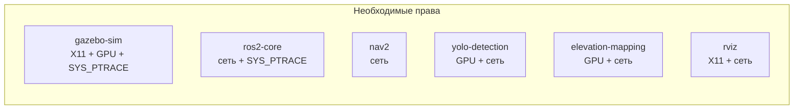
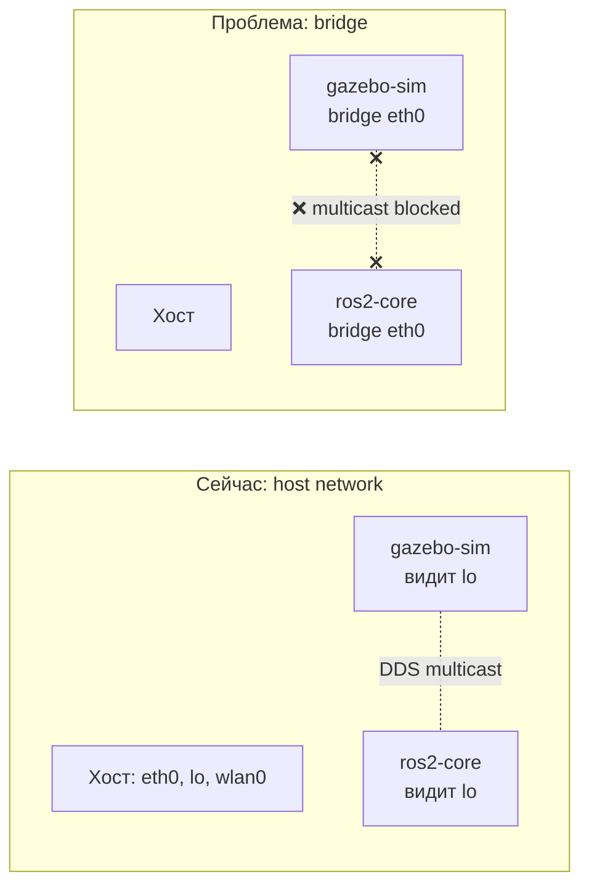
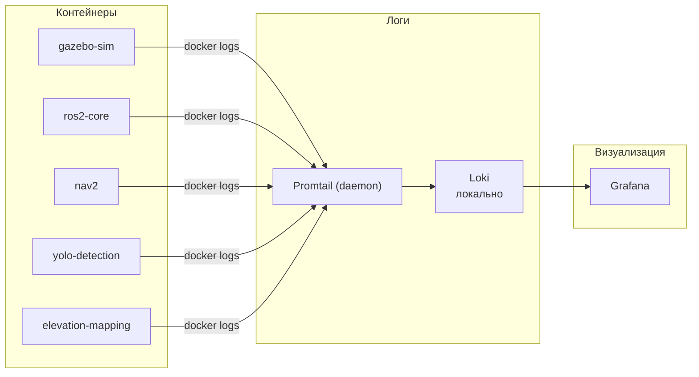
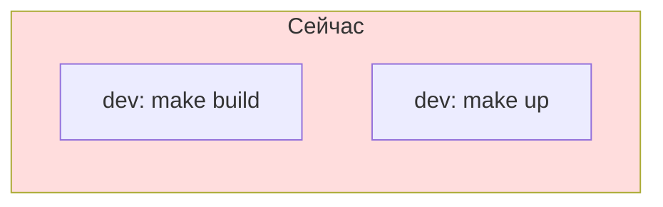
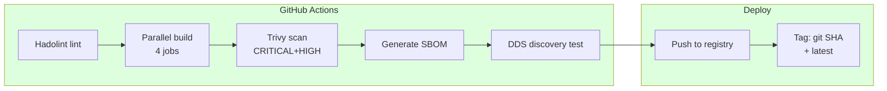
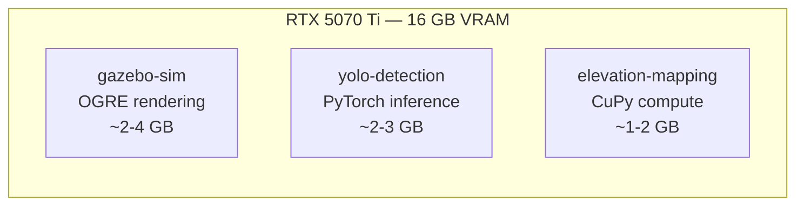
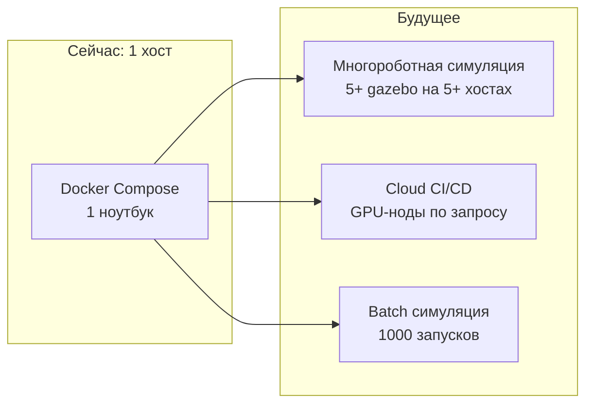
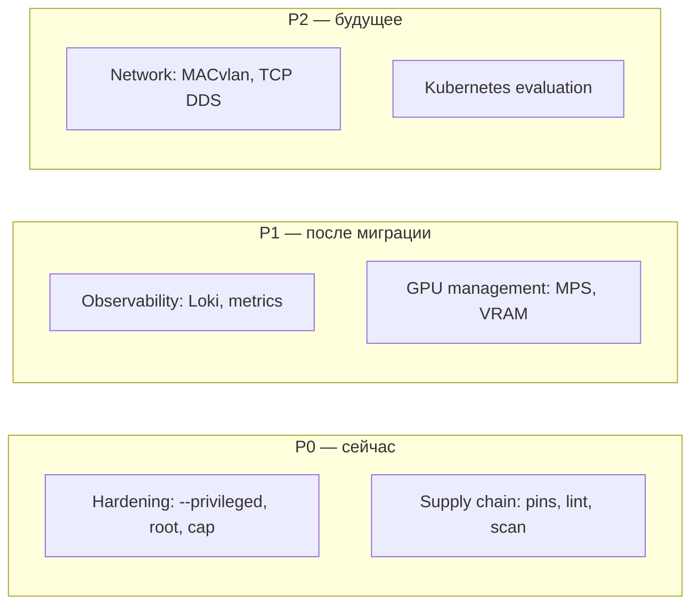

# DevSecOps-анализ: безопасность, сеть, observability и CI/CD

## WalkingRobotSim — Security & Operations Assessment

### Дата: 2026-07-18 19:00 MSK

---

## Оглавление

1. [Executive Summary](#1-executive-summary)
2. [Текущий security posture](#2-текущий-security-posture)
3. [Network: уход от network_mode: host](#3-network-уход-от-network_mode-host)
4. [Container hardening](#4-container-hardening)
5. [Supply chain security](#5-supply-chain-security)
6. [Observability](#6-observability)
7. [CI/CD pipeline](#7-cicd-pipeline)
8. [GPU resource management](#8-gpu-resource-management)
9. [Kubernetes: возможен ли и нужен ли?](#9-kubernetes-возможен-ли-и-нужен-ли)
10. [Дорожная карта](#10-дорожная-карта)
11. [Decision matrix](#11-decision-matrix)

---

## 1. Executive Summary

### 1.1 Контекст

Проект WalkingRobotSim мигрирует с монолитного Docker-образа на архитектуру из 5-6 микросервисов (gazebo-sim, ros2-core, nav2, yolo-detection, elevation-mapping, rviz). Текущая архитектура использует `network_mode: host` для DDS-коммуникации, `privileged: true`, root-пользователя внутри контейнеров.

Этот отчёт рассматривает всю инфраструктуру с точки зрения DevSecOps — не как разработчик ROS2, а как инженер, отвечающий за production-grade систему.

### 1.2 Текущие проблемы (кратко)

| #   | Проблема                               | Степень | Влияние                                 |
| --- | -------------------------------------- | ------- | --------------------------------------- |
| 1   | `privileged: true` во всех контейнерах | Высокий | Контейнер=root на хосте                 |
| 2   | `network_mode: host` — нет изоляции    | Высокий | Любой контейнер видит весь сетевой стек |
| 3   | root USER — нет sandboxing             | Высокий | Escape из контейнера = полный доступ    |
| 4   | Нет pinning APT/PIP версий             | Средний | Непредсказуемые сборки, CVE             |
| 5   | Логи в файлах — нет централизации      | Средний | Нельзя быстро найти проблему            |
| 6   | Нет линтера Dockerfile                 | Низкий  | Потенциальные anti-patterns             |
| 7   | GPU без квот                           | Средний | YOLO может съесть VRAM Gazebo           |

### 1.3 Ключевые рекомендации (кратко)

1. **Нет** — не убирать `network_mode: host` сейчас. Альтернативы (MACvlan, TCP-only DDS) сложны и не дают выгоды на 1 хосте.
2. **Да** — `privileged: false` + `cap_drop: ALL` + `cap_add: SYS_PTRACE`. Убрать root → `USER 1000:1000`.
3. **Да** — версионный pinning APT (`=version`) и PIP (`package==version`).
4. **Да** — Hadolint в CI как gate.
5. **Нет** — K8s не нужен сейчас. Только если появится многороботная симуляция на кластере.
6. **Рассмотреть** — Loki + Promtail для логов, healthcheck с метриками.

---

## 2. Текущий security posture

### 2.1 Что есть сейчас

| Аспект                   | Значение            | Риск    |
| ------------------------ | ------------------- | ------- |
| `privileged: true`       | Все сервисы         | Высокий |
| `network_mode: host`     | Все сервисы         | Высокий |
| `USER`                   | root (по умолчанию) | Высокий |
| `cap_add` / `cap_drop`   | Нет управления      | Высокий |
| `readOnlyRootFilesystem` | false               | Средний |
| Seccomp / AppArmor       | Не настроены        | Средний |
| `security_opt`           | Нет                 | Средний |
| Version pinning APT      | Нет                 | Средний |
| Version pinning PIP      | Нет                 | Средний |
| SBOM                     | Нет                 | Низкий  |
| Image scan               | Нет                 | Средний |

### 2.2 privileged: true — зачем и можно ли убрать?

**Зачем сейчас:** X11 (DISPLAY) + GPU (`/dev/dri`) + DDS (сеть). В Docker Compose `privileged: true` — это shotgun: даёт ВСЕ capability и доступ ко всем устройствам.

**Что реально нужно каждому сервису:**



**Рекомендация:** заменить `privileged: true` на точечные права:

```yaml
services:
  gazebo-sim:
    cap_drop:
      - ALL
    cap_add:
      - SYS_PTRACE # Для отладки PhysX/Gazebo
      - DAC_OVERRIDE # Для доступа к файлам
    devices:
      - /dev/dri:/dev/dri # GPU rendering
      - /dev/nvidiactl:/dev/nvidiactl
      - /dev/nvidia0:/dev/nvidia0

  ros2-core:
    cap_drop:
      - ALL
    cap_add:
      - SYS_PTRACE # Для gdb/profiling
    # Если не нужно — вообще без cap_add

  nav2:
    cap_drop:
      - ALL
    # Никаких дополнительных capability

  yolo-detection:
    cap_drop:
      - ALL
    devices:
      - /dev/nvidiactl:/dev/nvidiactl
      - /dev/nvidia0:/dev/nvidia0
```

**Но:** `cap_drop: ALL` + `devices` требует проверить, не сломается ли DDS. CycloneDDS использует UDP, что НЕ требует `CAP_NET_RAW` при `network_mode: host`. Если ломается — добавить `CAP_NET_RAW`.

### 2.3 Root user — почему это опасно

Любой `docker exec` или баг в приложении = полный root на хосте (через mount namespace). Особенно опасно для YOLO — Python с ultralytics тянет множество зависимостей.

**Рекомендация:** везде `USER 1000:1000`:

```dockerfile
RUN groupadd -r robot --gid 1000 && \
    useradd -r -g robot --uid 1000 robot && \
    mkdir -p /home/robot && chown robot:robot /home/robot

USER robot:robot
```

Исключение: `gazebo-sim` может требовать root для GPU/devices. Проверить.

### 2.4 Что остаётся

| Риск                   | Митигация                | Статус после hardening |
| ---------------------- | ------------------------ | ---------------------- |
| `network_mode: host`   | Принять (см. раздел 3)   | Принятый риск          |
| root в YOLO контейнере | USER 1000:1000           | Устранён               |
| Privileged escalation  | cap_drop ALL             | Устранён               |
| GPU access без квот    | device_ids + env         | Снижен                 |
| X11 escape             | Только /tmp/.X11-unix:ro | Снижен                 |

---

## 3. Network: уход от network_mode: host

### 3.1 Почему host network — это проблема

`network_mode: host` делает контейнер частью сетевого стека хоста:

- Контейнер видит все интерфейсы (eth0, wlan0, lo, docker0)
- Любой процесс в контейнере может слушать любой порт
- Нет изоляции между контейнерами на уровне сети
- Если YOLO скомпрометирован — атакующий имеет полный сетевой доступ

### 3.2 Почему мы не можем просто убрать host network

**Проблема:** DDS (CycloneDDS) использует UDP multicast для discovery. Стандартный Docker bridge (default) **не передаёт multicast** между контейнерами.



### 3.3 Варианты решения

#### Вариант A: MACvlan (рекомендуется для будущего)

```yaml
services:
  gazebo-sim:
    networks:
      ros_dds:
        ipv4_address: 192.168.100.10

  ros2-core:
    networks:
      ros_dds:
        ipv4_address: 192.168.100.20

networks:
  ros_dds:
    driver: macvlan
    driver_opts:
      parent: eth0
    ipam:
      config:
        - subnet: "192.168.100.0/24"
          gateway: "192.168.100.1"
```

**Плюс:** multicast работает, каждый контейнер имеет свой IP на физической сети.
**Минус:** MACvlan не работает с WiFi (только ethernet). Ноутбук на WiFi? Не вариант.

#### Вариант B: CycloneDDS TCP-only (перспективный, но незрелый)

CycloneDDS поддерживает TCP-транспорт вместо UDP. DDS discovery переключается на TCP:

```xml
<CycloneDDS>
  <Domain>
    <General>
      <NetworkInterface name="docker0" />
    </General>
    <Discovery>
      <DSGracePeriod>30.0</DSGracePeriod>
    </Discovery>
    <Internal>
      <MinimumSocketReceiveBufferSize>64kB</MinimumSocketReceiveBufferSize>
    </Internal>
  </Domain>
</CycloneDDS>
```

**Плюс:** multicast не нужен — discovery через TCP.
**Минус:** TCP DDS менее протестирован, больше latency, возможны таймауты discovery.

#### Вариант C: Docker bridge + CycloneDDS shared memory

CycloneDDS поддерживает `shm` (shared memory) транспорт для контейнеров на одном хосте:

```xml
<CycloneDDS>
  <Domain>
    <General>
      <NetworkInterface name="docker0" />
      <DontRoute>true</DontRoute>
      <AllowMulticast>false</AllowMulticast>
    </General>
  </Domain>
</CycloneDDS>
```

**Плюс:** работает на стандартной bridge-сети, multicast не нужен.
**Минус:** shm требует `ipc: host` или `ipc: shareable`. Не все ROS2 пакеты поддерживают shm.

#### Вариант D: Оставить host network (рекомендация СЕЙЧАС)

```yaml
services:
  gazebo-sim:
    network_mode: host
    cap_drop:
      - ALL
    # Нет --privileged, нет лишних cap
```

**Плюс:** работает, минимальные изменения.
**Минус:** нет сетевой изоляции, но компенсируется `cap_drop` и `USER`.

### 3.4 Итоговая рекомендация по сети

| Вариант                   | Изоляция | Сложность | Multicast | Стабильность  |
| ------------------------- | -------- | --------- | --------- | ------------- |
| **Host network (сейчас)** | Нет      | Низкая    | ✅        | ✅            |
| MACvlan                   | Высокая  | Средняя   | ✅        | ⚠️ WiFi issue |
| TCP-only DDS              | Высокая  | Высокая   | ❌        | ⚠️            |
| Bridge + shm              | Высокая  | Средняя   | ❌        | ⚠️            |

**Рекомендация: оставить `network_mode: host` сейчас, скомпенсировать `cap_drop ALL` + `USER 1000`.**

MACvlan — первый кандидат при переходе на кластер (несколько машин). TCP DDS — рассмотреть после стабилизации микросервисов.

---

## 4. Container hardening

### 4.1 Целевой profile для каждого сервиса

```yaml
x-hardened: &hardened
  cap_drop:
    - ALL
  security_opt:
    - no-new-privileges:true
  read_only: true
  tmpfs:
    - /tmp
    - /var/tmp
  user: "1000:1000"
```

### 4.2 По сервисам

#### gazebo-sim

```yaml
gazebo-sim:
  <<: *hardened
  cap_add:
    - SYS_PTRACE
    - DAC_OVERRIDE
  devices:
    - /dev/dri:/dev/dri
    - /dev/nvidiactl:/dev/nvidiactl
    - /dev/nvidia0:/dev/nvidia0
  tmpfs:
    - /tmp
    - /var/tmp
    - /root/.Xauthority # Только для GUI
  read_only: false # Gazebo пишет логи
  user: "root" # GPU/devices часто требуют root
```

Исключение: Gazebo требует root для доступа к `/dev/dri`. Остальные сервисы — `user: "1000:1000"`.

#### ros2-core

```yaml
ros2-core:
  <<: *hardened
  cap_add:
    - SYS_PTRACE # Для gdb, profiling
  read_only: true
  tmpfs:
    - /tmp
    - /root/ws/logs # Только логи — writable
  user: "1000:1000"
```

#### nav2

```yaml
nav2:
  <<: *hardened
  cap_add: [] # Ничего не нужно
  read_only: true
  user: "1000:1000"
```

#### yolo-detection

```yaml
yolo-detection:
  <<: *hardened
  devices:
    - /dev/nvidiactl:/dev/nvidiactl
    - /dev/nvidia0:/dev/nvidia0
  read_only: true
  user: "1000:1000"
```

#### elevation-mapping

```yaml
elevation-mapping:
  <<: *hardened
  devices:
    - /dev/nvidiactl:/dev/nvidiactl
    - /dev/nvidia0:/dev/nvidia0
  read_only: true
  user: "1000:1000"
```

#### rviz

```yaml
rviz:
  <<: *hardened
  cap_add:
    - SYS_PTRACE # Для GUI
  read_only: true
  user: "1000:1000"
```

### 4.3 Dockerfile hardening

```dockerfile
FROM osrf/ros:jazzy-desktop

# Добавить пользователя
RUN groupadd -r robot --gid 1000 && \
    useradd -r -g robot --uid 1000 -d /home/robot robot && \
    mkdir -p /home/robot && chown robot:robot /home/robot

# ...

# Минимизировать sudo/setuid
RUN find / -perm /4000 -type f -exec chmod u-s {} \; 2>/dev/null || true

# HEALTHCHECK как non-root
USER robot:robot

HEALTHCHECK --interval=30s --timeout=10s --start-period=30s --retries=3 \
    CMD bash -c 'source /opt/ros/${ROS_DISTRO}/setup.bash && \
                 source /root/ws/install/setup.bash && \
                 ros2 node list || exit 1'
```

### 4.4 Read-only root filesystem

`read_only: true` + `tmpfs` для writable путей гарантирует, что:

- Контейнер не может изменить свои бинарники
- Любая попытка записи вне tmpfs упадёт с ошибкой
- Вредоносный скрипт не может оставить персистентные изменения

```yaml
volumes:
  - ./src/docker/cyclonedds.xml:/cyclonedds.xml:ro
  # Все монтируемые файлы — :ro везде
```

---

## 5. Supply chain security

### 5.1 Version pinning

**Текущая проблема:** в Dockerfile нет версий пакетов:

```dockerfile
# Сейчас — недетерминированно:
RUN apt-get install -y ros-jazzy-ros-gz-sim
RUN pip3 install torch ultralytics

# Должно быть:
RUN apt-get install -y ros-jazzy-ros-gz-sim=8.4.0-1*
RUN pip3 install torch==2.4.0 ultralytics==8.2.0
```

**Рекомендация:**

```dockerfile
# APT versions (locked)
ARG GZ_SIM_VER=8.4.0-1*
ARG NAV2_VER=1.3.0-1*

RUN apt-get install -y --no-install-recommends \
    ros-${ROS_DISTRO}-ros-gz-sim=${GZ_SIM_VER} \
    ros-${ROS_DISTRO}-nav2-bringup=${NAV2_VER}

# PIP versions
ARG TORCH_VER=2.4.0
ARG ULTRALYTICS_VER=8.2.0

RUN pip3 install --no-cache-dir \
    torch==${TORCH_VER} \
    ultralytics==${ULTRALYTICS_VER}
```

**Проблема:** APT версии сложно отслеживать в `osrf/ros` образах — пакеты пересобираются с теми же номерами. Решение: `apt list --upgradable` в CI и алерты.

### 5.2 SBOM

**Что:** Software Bill of Materials — список всех зависимостей с версиями.

**Как генерировать:**

```bash
# После сборки образа:
docker scout sbom wrs-core:latest > sbom/wrs-core.spdx.json

# Или:
syft wrs-core:latest -o spdx-json > sbom/wrs-core.spdx.json
```

**Где хранить:** В CI артефактах при каждом build. Привязать к git SHA.

**Зачем:** Если завтра CVE в `ultralytics==8.2.0`, SBOM скажет: "версия 8.2.0 есть в образе wrs-yolo:latest". Без SBOM — надо вручную лезть в Dockerfile.

### 5.3 Image scanning

**Бесплатные варианты для CI:**

| Инструмент        | Бесплатно?          | Скорость | APK/APT/PIP |
| ----------------- | ------------------- | -------- | ----------- |
| `docker scout`    | Да (Docker Desktop) | Быстро   | ✅          |
| `trivy` (Aqua)    | Да                  | Быстро   | ✅          |
| `grype` (Anchore) | Да                  | Средне   | ✅          |
| `snyk`            | Freemium            | Быстро   | ✅          |

**Рекомендуется:** `trivy` — open-source, быстрый, без регистрации:

```bash
trivy image wrs-core:latest --severity CRITICAL,HIGH --exit-code 1
```

### 5.4 Dockerfile linting (Hadolint)

```bash
# CI gate
hadolint src/docker/core/Dockerfile
```

Hadolint ловит:

- Использование `latest` тега
- Отсутствие `--no-install-recommends`
- `apt-get update` без `apt-get install`
- COPY без chown
- Потенциально опасные RUN

**CI конфигурация:**

```yaml
# .github/workflows/docker-lint.yml
jobs:
  hadolint:
    runs-on: ubuntu-latest
    steps:
      - uses: actions/checkout@v4
      - uses: hadolint/hadolint-action@v3.1.0
        with:
          dockerfile: src/docker/core/Dockerfile
          failure-threshold: error
```

---

## 6. Observability

### 6.1 Текущее состояние

- `docker logs wrs-core` — единственный способ
- Логи пишутся в файлы внутри контейнера (ROS_LOG_DIR)
- Нет метрик (CPU, RAM, GPU, DDS latency)
- Нет алертов
- Healthcheck — только "жив ли процесс" (ros2 node list)

### 6.2 Централизованные логи



**Вариант для одного хоста:**

```yaml
# docker-compose.observability.yml
services:
  loki:
    image: grafana/loki:3.0
    ports:
      - "3100:3100"

  promtail:
    image: grafana/promtail:3.0
    volumes:
      - /var/lib/docker/containers:/var/lib/docker/containers:ro
      - ./config/promtail.yml:/etc/promtail/config.yml:ro

  grafana:
    image: grafana/grafana:latest
    ports:
      - "3000:3000"
```

### 6.3 Метрики

**Что мониторить:**

| Метрика             | Источник                  | Почему важна                   |
| ------------------- | ------------------------- | ------------------------------ |
| CPU % per container | `docker stats` / cAdvisor | Утечка CPU в YOLO/Nav2         |
| RAM per container   | cAdvisor                  | Утечка памяти в Python         |
| GPU VRAM used       | `nvidia-smi` / DCGM       | YOLO vs Gazebo VRAM contention |
| DDS topic count     | `ros2 topic list`         | Потеря топиков                 |
| DDS latency         | `ros2 topic delay`        | Задержка /clock                |
| Container restarts  | Docker events             | Crash loop                     |

**cAdvisor + Prometheus + Grafana:**

```yaml
services:
  cadvisor:
    image: gcr.io/cadvisor/cadvisor:latest
    devices:
      - /dev/nvidiactl:/dev/nvidiactl
      - /dev/nvidia0:/dev/nvidia0
    volumes:
      - /:/rootfs:ro
      - /var/run:/var/run:ro
      - /sys:/sys:ro
      - /var/lib/docker/:/var/lib/docker:ro

  prometheus:
    image: prom/prometheus:latest
    volumes:
      - ./config/prometheus.yml:/etc/prometheus/prometheus.yml:ro
    ports:
      - "9090:9090"

  grafana:
    image: grafana/grafana:latest
    ports:
      - "3000:3000"
```

### 6.4 GPU метрики (NVIDIA DCGM)

```bash
docker run -d --gpus all --cap-add SYS_ADMIN \
  --name dcgm-exporter \
  nvcr.io/nvidia/k8s/dcgm-exporter:3.3.7-3.6.0
```

Метрики DCGM:

- `DCGM_FI_DEV_GPU_UTIL` — загрузка GPU (%)
- `DCGM_FI_DEV_FB_FREE` — свободная VRAM
- `DCGM_FI_DEV_POWER_USAGE` — потребление (W)
- `DCGM_FI_DEV_TEMPERATURE` — температура

### 6.5 Алерты (базовый набор)

| Условие                    | Действие        | Severity |
| -------------------------- | --------------- | -------- |
| Container restart >3/min   | Slack/Telegram  | Critical |
| GPU VRAM <500 MB           | Slack           | Warning  |
| DDS topic count < expected | Slack           | Warning  |
| RAM >90% limit             | Slack           | Warning  |
| Container down >30s        | Restart + Slack | Critical |

### 6.6 Простой healthcheck (улучшенный)

**Сейчас:**

```yaml
healthcheck:
  test:
    ["CMD", "bash", "-c", "source /opt/ros/jazzy/setup.bash && ros2 node list"]
```

**Улучшенный healthcheck для каждого сервиса:**

```yaml
# Для gazebo-sim — проверка /clock
healthcheck:
  test: ["CMD", "gz", "topic", "-l", "/clock"]
  interval: 10s
  timeout: 5s
  retries: 6
  start_period: 30s

# Для ros2-core — проверка контроллера
healthcheck:
  test: [
      "CMD",
      "bash",
      "-c",
      "source /opt/ros/jazzy/setup.bash &&
      source /root/ws/install/setup.bash &&
      ros2 topic echo /clock --once --no-arr || exit 1",
    ]
  interval: 15s
  timeout: 5s
  retries: 6
  start_period: 45s

# Для nav2 — проверка planner
healthcheck:
  test: [
      "CMD",
      "bash",
      "-c",
      "source /opt/ros/jazzy/setup.bash &&
      ros2 node list | grep -q planner_server",
    ]
  interval: 15s
  timeout: 5s
  retries: 6
  start_period: 30s
```

---

## 7. CI/CD pipeline

### 7.1 Текущее состояние



Ручная сборка. Нет CI/CD. Нет автоматических тестов DDS.

### 7.2 Целевой CI/CD



### 7.3 GitHub Actions workflow

```yaml
# .github/workflows/docker-ci.yml
name: Docker CI

on:
  push:
    branches: [main, feat/*]
    paths:
      - "src/docker/**"
      - "src/gazebo_sim/**"
      - "src/quadropted*/**"
  pull_request:
    branches: [main]

env:
  REGISTRY: ghcr.io
  IMAGE_TAG: ${{ github.sha }}

jobs:
  lint:
    runs-on: ubuntu-latest
    steps:
      - uses: actions/checkout@v4
      - uses: hadolint/hadolint-action@v3.1.0
        with:
          dockerfile: src/docker/core/Dockerfile
          failure-threshold: error

  build:
    needs: [lint]
    strategy:
      matrix:
        service: [gazebo, core, nav2, yolo]
      fail-fast: false
    runs-on: [self-hosted, linux, X64, gpu]
    steps:
      - uses: actions/checkout@v4

      - name: Build ${{ matrix.service }}
        run: |
          docker build \
            --cache-from wrs-${{ matrix.service }}:latest \
            -t wrs-${{ matrix.service }}:${{ env.IMAGE_TAG }} \
            -t wrs-${{ matrix.service }}:latest \
            -f src/docker/${{ matrix.service }}/Dockerfile .

      - name: Scan ${{ matrix.service }}
        uses: aquasecurity/trivy-action@master
        with:
          image-ref: wrs-${{ matrix.service }}:${{ env.IMAGE_TAG }}
          format: table
          exit-code: 1
          severity: CRITICAL,HIGH

      - name: Generate SBOM
        uses: anchore/sbom-action@v0
        with:
          image: wrs-${{ matrix.service }}:${{ env.IMAGE_TAG }}
          format: spdx-json

      - name: Push to registry
        run: |
          docker tag wrs-${{ matrix.service }}:${{ env.IMAGE_TAG }} \
            ${{ env.REGISTRY }}/${{ github.repository }}/wrs-${{ matrix.service }}:latest
          docker push ${{ env.REGISTRY }}/${{ github.repository }}/wrs-${{ matrix.service }}:latest

  dds-test:
    needs: [build]
    runs-on: [self-hosted, linux, X64, gpu]
    steps:
      - uses: actions/checkout@v4

      - name: Start services
        run: |
          docker compose --profile minimal up -d
          sleep 30

      - name: Test DDS discovery
        run: |
          docker exec wrs-core bash -c '
            source /opt/ros/jazzy/setup.bash &&
            source /root/ws/install/setup.bash &&
            TOPICS=$(ros2 topic list)
            echo "$TOPICS"
            echo "$TOPICS" | grep -q /clock || exit 1
            echo "$TOPICS" | grep -q /scan || exit 1
          '

      - name: Cleanup
        run: docker compose down
```

### 7.4 Self-hosted runner considerations

Для сборки образов с GPU (yolo, elevation) нужен self-hosted runner на машине с NVIDIA:

```bash
# Установка self-hosted runner
mkdir actions-runner && cd actions-runner
curl -o actions-runner-linux-x64-2.317.0.tar.gz \
  https://github.com/actions/runner/releases/download/v2.317.0/actions-runner-linux-x64-2.317.0.tar.gz
tar xzf actions-runner-linux-x64-2.317.0.tar.gz
./config.sh --url https://github.com/redalexdad/WalkingRobotSim --token <TOKEN>

# Установка как сервис
sudo ./svc.sh install
sudo ./svc.sh start
```

**Label:** `gpu` для job'ов с GPU.

### 7.5 Локальный CI (make)

Для быстрой итерации без GitHub:

```makefile
# Makefile локального CI
.PHONY: ci ci-lint ci-build ci-dds-test

ci: ci-lint ci-build ci-dds-test

ci-lint:
	@hadolint src/docker/core/Dockerfile
	@hadolint src/docker/gazebo/Dockerfile
	@hadolint src/docker/nav2/Dockerfile
	@hadolint src/docker/yolo/Dockerfile

ci-build:
	@make -j4 build-gazebo build-core build-nav2 build-yolo

ci-dds-test:
	@docker compose --profile minimal up -d
	@sleep 30
	@docker exec wrs-core bash -c 'source /opt/ros/jazzy/setup.bash && \
		source /root/ws/install/setup.bash && \
		ros2 topic list | grep -q /clock || (echo "FAIL: no /clock" && exit 1)'
	@docker compose down
	@echo "DDS discovery: OK"
```

---

## 8. GPU resource management

### 8.1 Проблема

Один GPU (RTX 5070 Ti, 16 GB VRAM) разделяется между тремя сервисами:



**Риск:** YOLO (`torch`) может зарезервировать всю VRAM при инициализации, и Gazebo упадёт с `CUDA OOM`.

### 8.2 Решения

#### 8.2.1 CUDA_VISIBLE_DEVICES (не помогает на одном GPU)

```yaml
services:
  yolo-detection:
    environment:
      - CUDA_VISIBLE_DEVICES=0 # Тот же GPU, что и gazebo
```

Не защищает от OOM — все сервисы видят один и тот же GPU.

#### 8.2.2 Docker device reservation with memory limit (не поддерживается)

Docker не умеет лимитировать VRAM на NVIDIA GPU. `nvidia-container-runtime` не поддерживает `--memory-reservation` для GPU.

#### 8.2.3 MIG (Multi-Instance GPU) — не поддерживается на RTX

MIG есть только на A100/H100/H200/B200. RTX 5070 Ti его не имеет.

#### 8.2.4 Ручной контроль через env

```yaml
services:
  yolo-detection:
    environment:
      - PYTORCH_CUDA_ALLOC_CONF=max_split_size_mb:512
      - CUDA_LAUNCH_BLOCKING=1
    deploy:
      resources:
        reservations:
          devices:
            - driver: nvidia
              count: all
              capabilities: [gpu]
```

#### 8.2.5 Рекомендация: GPU sharing via MPS (Multi-Process Service)

NVIDIA MPS позволяет мультиплексировать GPU между процессами:

```bash
# На хосте (перед запуском контейнеров):
export CUDA_MPS_PIPE_DIRECTORY=/tmp/nvidia-mps
export CUDA_MPS_LOG_DIRECTORY=/tmp/nvidia-mps/log
nvidia-cuda-mps-control -d
```

```yaml
services:
  gazebo-sim:
    environment:
      - CUDA_MPS_PIPE_DIRECTORY=/tmp/nvidia-mps
    volumes:
      - /tmp/nvidia-mps:/tmp/nvidia-mps

  yolo-detection:
    environment:
      - CUDA_MPS_PIPE_DIRECTORY=/tmp/nvidia-mps
    volumes:
      - /tmp/nvidia-mps:/tmp/nvidia-mps
```

**Плюс:** MPS управляет очередями GPU, не даёт одному процессу заблокировать весь GPU.
**Минус:** MPS active — GPU не может использоваться другими процессами вне MPS.

#### 8.2.6 VRAM мониторинг

```bash
# В CI / pre-start check
nvidia-smi --query-gpu=memory.free --format=csv,noheader

# Если free < 4GB — не запускать yolo
```

### 8.3 GPU allocation strategy

| Сервис            | Когда нужен GPU | VRAM (оценка) | Альтернатива              |
| ----------------- | --------------- | ------------- | ------------------------- |
| gazebo-sim        | Всегда          | 2-4 GB        | CPU rendering (медленно)  |
| yolo-detection    | Опционально     | 2-3 GB        | CPU inference (медленнее) |
| elevation-mapping | Опционально     | 1-2 GB        | CPU-only образ            |

**Рекомендация:** GPU обязателен только для `gazebo-sim`. YOLO и elevation — опционально, с CPU fallback.

---

## 9. Kubernetes: возможен ли и нужен ли?

### 9.1 Что даёт K8s

| Аспект            | Docker Compose   | Kubernetes             | Значимость             |
| ----------------- | ---------------- | ---------------------- | ---------------------- |
| Multi-host        | Нет              | ✅                     | Для кластера           |
| Self-healing      | depends_on       | ✅ liveness/readiness  | Для production         |
| Rolling update    | Нет              | ✅                     | Для zero-downtime      |
| Secrets           | .env             | ✅ Secrets             | Для токенов            |
| Network policy    | Нет              | ✅ NetworkPolicy       | Для изоляции           |
| GPU scheduling    | deploy.resources | ✅ device plugin       | Для кластера GPU       |
| Service discovery | Нет              | ✅ DNS                 | Для межсервисной связи |
| Resource quotas   | compose limits   | ✅ LimitRange          | Для мультитеначности   |
| Observability     | Cadvisor         | ✅ Prometheus operator | Встроено               |

### 9.2 Что НЕ работает в K8s (или работает плохо)

#### 9.2.1 DDS multicast — главный blocker

K8s использует CNI (Calico, Flannel, Cilium). Большинство CNI **не поддерживают UDP multicast** на уровне подов.

Варианты:

- **hostNetwork: true** — работает, но ломает изоляцию (как и Docker host network)
- **MACvlan CNI** — работает, но требует отдельных IP на физической сети
- **Cilium** — поддерживает multicast через IPIP, экспериментально
- **TCP-only DDS** — не тестировался

```yaml
# K8s — hostNetwork (как и Docker host network)
apiVersion: v1
kind: Pod
metadata:
  name: wrs-core
spec:
  hostNetwork: true # Единственный способ для DDS сейчас
  containers:
    - name: ros2-core
      image: wrs-core:latest
```

#### 9.2.2 X11/GUI в K8s

- X11 требует `/tmp/.X11-unix` и `DISPLAY` — нестандартно для K8s
- RViz без GUI теряет смысл
- Решение: только headless режимы в K8s, GUI только в Docker Compose

#### 9.2.3 Overhead для одного хоста

На одном хосте K8s control plane (kubelet, etcd, kube-apiserver, kube-proxy, CoreDNS) потребляет ~1-2 GB RAM + ~2-4 ядра CPU. Для симуляции на ноутбуке с 32 GB — это значительный overhead.

#### 9.2.4 GPU scheduling

NVIDIA GPU Operator в K8s требует:

- Установки `nvidia-device-plugin` DaemonSet
- RuntimeClass `nvidia`
- Для MIG — сложная конфигурация

На одном хосте с одним GPU — неоправданно сложно.

### 9.3 Сравнение

| Аспект             | Docker Compose     | Kubernetes                 | Вердикт            |
| ------------------ | ------------------ | -------------------------- | ------------------ |
| Простота деплоя    | `compose up`       | `helm install` + manifests | 🏆 Compose         |
| DDS multicast      | host network       | hostNetwork                | 🏆 Compose         |
| GPU sharing        | `deploy.resources` | device plugin              | 🏆 Compose (проще) |
| X11/GUI            | Просто             | Сложно                     | 🏆 Compose         |
| Multi-robot        | `--scale`          | StatefulSet                | 🏆 Kubernetes      |
| CI/CD integration  | GitHub Actions     | ArgoCD                     | 🏆 Kubernetes      |
| Self-healing       | depends_on         | liveness/readiness         | 🏆 Kubernetes      |
| Resource isolation | compose limits     | LimitRange + Quota         | 🏆 Kubernetes      |
| На одном хосте     | Легко              | Тяжело                     | 🏆 Compose         |

### 9.4 Когда K8s будет иметь смысл



**Конкретные критерии для перехода:**

| Критерий                           | Когда пора      |
| ---------------------------------- | --------------- |
| Количество хостов                  | ≥3              |
| Количество одновременных симуляций | ≥5              |
| Cloud GPU (AWS/Azure)              | Да              |
| Команда >2 человек                 | Рассмотреть K8s |
| Zero-downtime deployments          | Требуется       |

### 9.5 Альтернатива: Docker Swarm

Docker Swarm проще K8s, встроен в Docker, поддерживает `network_mode: host`, мультихостовые сети с overlay.

```bash
# Инициализация
docker swarm init

# Деплой стека
docker stack deploy -c compose.yml wrs
```

**Плюс:** multicast работает через overlay сеть (docker_gwbridge).
**Минус:** Swarm фактически заброшен Docker Inc., нет active development с 2023.

**Вердикт:** Swarm — не рекомендую. Если не K8s, то Docker Compose.

### 9.6 Итоговая рекомендация по K8s

```
┌────────────────────────────────────────────┐
│ Текущий этап: Docker Compose ✅            │
│                                            │
│ Условия для перехода на K8s:               │
│                                            │
│ 1. Появится второй хост с GPU? → K3s ✅    │
│ 2. Появится третий? → полный K8s ✅         │
│ 3. Один хост всегда → Docker Compose ✅     │
│ 4. Cloud GPU → K8s (EKS/GKE/AKS) ✅        │
└────────────────────────────────────────────┘
```

---

## 10. Дорожная карта

### 10.1 Фазы

#### Фаза 0: Hardening (1-2 дня)

- [ ] Убрать `privileged: true` → точечные `cap_add`
- [ ] Добавить `cap_drop: ALL` во все сервисы
- [ ] Добавить `security_opt: no-new-privileges`
- [ ] Перевести на `USER 1000:1000` (кроме gazebo-sim)
- [ ] `read_only: true` + `tmpfs` для ros2-core, nav2, yolo
- [ ] Все volumes — `:ro` (кроме логов)

**Проверка:** все контейнеры стартуют, DDS discovery работает

#### Фаза 1: Supply chain (2-3 дня)

- [ ] APT version pinning в Dockerfile
- [ ] PIP version pinning (torch==2.4.0, ultralytics==8.2.0)
- [ ] Hadolint в Makefile (`make ci-lint`)
- [ ] Trivy scan локально (`make ci-scan`)
- [ ] SBOM генерация (`make sbom`)
- [ ] GitHub Actions: lint → build → scan → sbom → push

**Проверка:** `make ci` проходит без ошибок

#### Фаза 2: Observability (3-5 дней)

- [ ] Loki + Promtail для централизованных логов
- [ ] cAdvisor + Prometheus для метрик
- [ ] Grafana dashboard (CPU, RAM, GPU, DDS)
- [ ] Улучшенные healthcheck для каждого сервиса
- [ ] Алерты (container restart, GPU VRAM, DDS lost)

**Проверка:** `docker compose -f compose.obs.yml up` + Grafana

#### Фаза 3: Network evaluation (после стабилизации)

- [ ] Протестировать MACvlan (проверить WiFi issue)
- [ ] Протестировать TCP-only DDS (latency, discovery)
- [ ] Сравнить с host network
- [ ] Документировать результат

**Проверка:** бенчмарк DDS latency в разных режимах

#### Фаза 4: GPU management

- [ ] Протестировать NVIDIA MPS
- [ ] Добавить `PYTORCH_CUDA_ALLOC_CONF`
- [ ] VRAM healthcheck pre-start
- [ ] CPU fallback для YOLO / elevation

**Проверка:** все 3 GPU-сервиса работают одновременно без OOM

### 10.2 Приоритеты



---

## 11. Decision matrix

### 11.1 Итоговые решения

| Решение                   | Статус           | Обоснование                                                       |
| ------------------------- | ---------------- | ----------------------------------------------------------------- |
| **Оставить host network** | ✅ Принять       | MACvlan — WiFi issue, TCP DDS — незрелый. Компенсировать cap_drop |
| **Убрать --privileged**   | 🔜 Сделать       | Точечные cap_add для каждого сервиса. 1 день работы               |
| **Non-root USER**         | 🔜 Сделать       | USER 1000:1000 везде, кроме gazebo. 0.5 дня                       |
| **read_only rootfs**      | 🔜 Сделать       | Для core, nav2, yolo. 0.5 дня                                     |
| **Version pinning**       | 🔜 Сделать       | APT + PIP. 1 день + CI                                            |
| **Hadolint в CI**         | 🔜 Сделать       | Gate перед сборкой. 0.5 дня                                       |
| **Trivy scan**            | 🔜 Сделать       | После сборки. 1 день                                              |
| **Loki + Prometheus**     | 🔜 Рассмотреть   | После стабилизации микросервисов                                  |
| **NVIDIA MPS**            | 🔜 Рассмотреть   | Если будет VRAM contention                                        |
| **Kubernetes**            | ❌ Не сейчас     | Только если появятся >3 хоста                                     |
| **Docker Swarm**          | ❌ Не рекомендую | Dead project                                                      |

### 11.2 Риски после изменений

| Изменение      | Риск                          | Откат                           |
| -------------- | ----------------------------- | ------------------------------- |
| `cap_drop ALL` | DDS может не работать         | Вернуть `CAP_NET_RAW`           |
| `USER 1000`    | Gazebo может не стартовать    | Оставить `USER root` для gazebo |
| `read_only`    | ROS2 логгинг может сломаться  | Добавить tmpfs на /root/ws/logs |
| APT pinning    | Конфликт версий в osrf образе | Убрать версию, оставить `*`     |
| Hadolint в CI  | Ложные срабатывания           | Настроить `.hadolint.yaml`      |

### 11.3 Вердикт

**DevSecOps posture после внедрения:**

```
До:    privileged + root + host_network + no_pins + no_scan
       [опасно, но работает]

После: cap_drop + user:1000 + host_network + pins + lint
       [безопасно для одного хоста, готово к масштабированию]
```

**Главное:** безопасность не должна мешать разработке. `network_mode: host` остаётся, но `--privileged` уходит, root уходит, версии фиксируются.

---

## Приложения

### A. Полезные команды для аудита

```bash
# Проверить --privileged
docker inspect wrs-core | jq '.[].HostConfig.Privileged'

# Список capability контейнера
docker inspect wrs-core | jq '.[].HostConfig.CapAdd'

# USER в контейнере
docker exec wrs-core whoami

# Read-only rootfs
docker inspect wrs-core | jq '.[].HostConfig.ReadonlyRootfs'

# GPU devices
docker inspect wrs-yolo | jq '.[].HostConfig.Devices'

# Сетевой режим
docker inspect wrs-core | jq '.[].HostConfig.NetworkMode'

# APT версии в образе (требуется shell)
docker run --rm wrs-core:latest dpkg -l | grep ros-jazzy-ros-gz-sim
```

### B. Конфигурация Hadolint

```yaml
# .hadolint.yaml
trustedRegistries:
  - docker.io
  - nvcr.io
  - ghcr.io

override:
  warning:
    - DL3008 # Pin versions in apt get install
    - DL3013 # Pin versions in pip
    - DL3042 # Avoid cache mount (ignored: we use it)
  info:
    - DL3045 # COPY --from before chown
  ignore:
    - DL3007 # Using latest (osrf/ros:jazzy-desktop is pinned by tag)
    - DL3018 # Alpine pinning (not Alpine)
```

### C. Метрики DDS для Grafana

```promql
# Количество container restarts
rate(container_last_seen{name=~"wrs-.*"}[5m])

# CPU per container
rate(container_cpu_usage_seconds_total{name=~"wrs-.*"}[1m])

# Memory per container
container_memory_usage_bytes{name=~"wrs-.*"}

# GPU VRAM
nvidia_gpu_memory_used_bytes{gpu="0"}

# GPU utilisation
nvidia_gpu_duty_cycle{gpu="0"}
```

### D. Глоссарий

| Термин   | Описание                                               |
| -------- | ------------------------------------------------------ |
| cap_drop | Docker capability control — удаление привилегий        |
| MPS      | NVIDIA Multi-Process Service — мультиплексирование GPU |
| MIG      | Multi-Instance GPU — аппаратное разделение GPU         |
| SBOM     | Software Bill of Materials — список зависимостей       |
| CNI      | Container Network Interface — сетевой плагин K8s       |
| DCGM     | NVIDIA Data Center GPU Manager — метрики GPU           |
| MACvlan  | Docker network driver — контейнеру свой MAC/IP         |
| Hadolint | Dockerfile linter                                      |
| Trivy    | Vulnerability scanner для контейнеров                  |

---

_Отчёт подготовлен 2026-07-18 для проекта WalkingRobotSim._
_Автор: OpenCode Agent на основе анализа Docker-инфраструктуры проекта._
