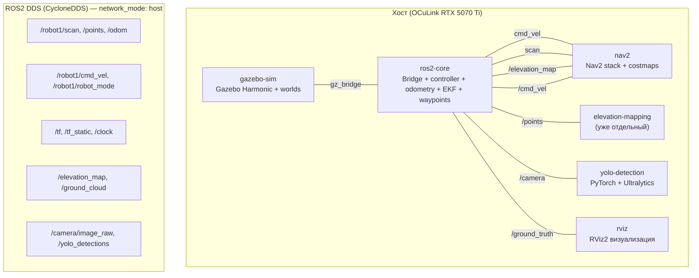
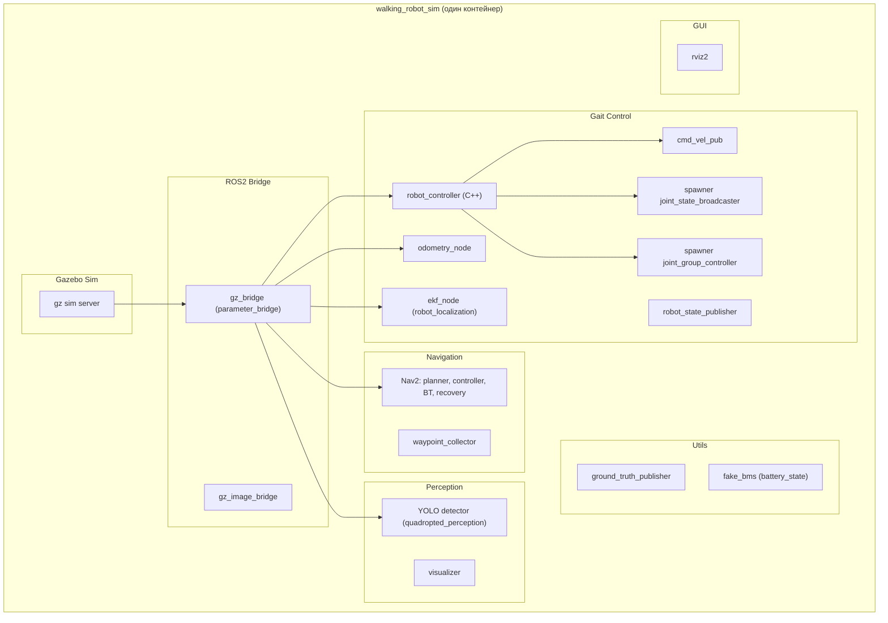
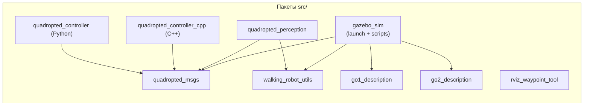
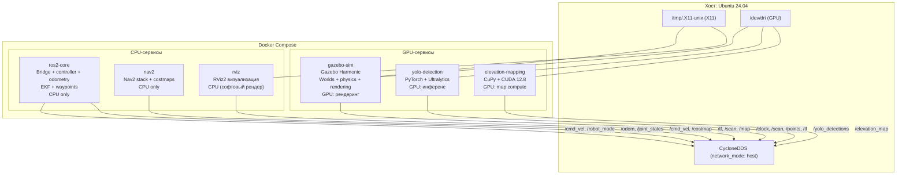
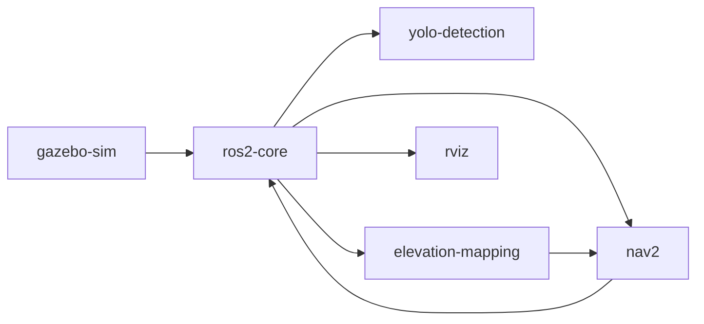
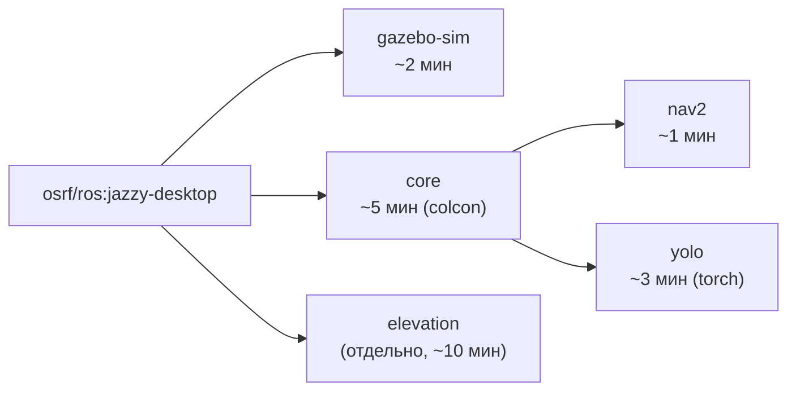
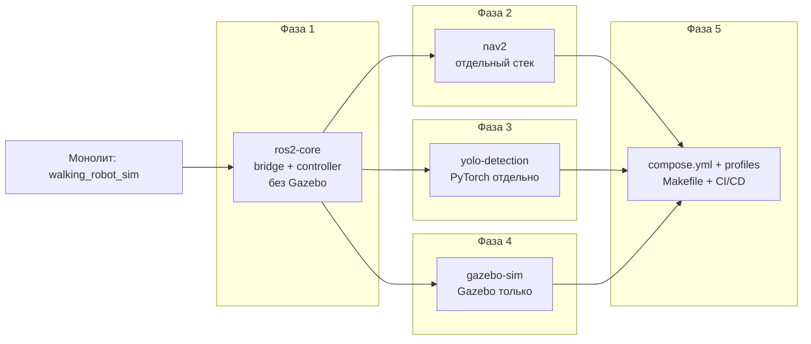

# План декомпозиции Docker: монолит → микросервисы

## WalkingRobotSim — Multi-Container Architecture

### Дата: 2026-07-18 17:30 MSK

---

## Оглавление

1. [Executive Summary](#1-executive-summary)
2. [Текущая архитектура Docker](#2-текущая-архитектура-docker)
3. [Анализ зависимостей и граф пакетов](#3-анализ-зависимостей-и-граф-пакетов)
4. [Целевая архитектура](#4-целевая-архитектура)
5. [Сервис: gazebo-sim (альтернатива: Isaac Sim)](#5-сервис-gazebo-sim)
6. [Сервис: ros2-core](#6-сервис-ros2-core)
7. [Сервис: nav2](#7-сервис-nav2)
8. [Сервис: yolo-detection](#8-сервис-yolo-detection)
9. [Сервис: elevation-mapping](#9-сервис-elevation-mapping)
10. [Сервис: rviz](#10-сервис-rviz)
11. [Коммуникация между контейнерами](#11-коммуникация-между-контейнерами)
12. [Dockerfiles: реализации](#12-dockerfiles-реализации)
13. [compose.yml: целевой](#13-composeyml-целевой)
14. [Makefile: новые цели](#14-makefile-новые-цели)
15. [Стратегия сборки и кэширования](#15-стратегия-сборки-и-кэширования)
16. [Профили запуска](#16-профили-запуска)
17. [Миграция: пошаговый план](#17-миграция-пошаговый-план)
18. [Сравнение: монолит vs микросервисы](#18-сравнение-монолит-vs-микросервисы)
19. [Риски и ограничения](#19-риски-и-ограничения)
20. [Заключение](#20-заключение)

---

## 1. Executive Summary

### 1.1 Проблема

Текущий проект WalkingRobotSim использует **один монолитный Docker-образ** (`walking_robot_sim:latest`, 6-stage сборка), который содержит:

- Gazebo Sim 8 (физика + рендеринг)
- ROS2 bridge (gz → ROS2)
- Gait-контроллер (C++ + Python)
- Nav2 (навигационный стек)
- YOLO (детекция объектов)
- Odometry, EKF, TF
- ground_truth_publisher, waypoint_collector
- RViz (визуализация)

Образ собирается **единым colcon build** из `src/`, что означает:

- Любое изменение (например, в YOLO) требует **полной пересборки** всей симуляции
- Gazebo с GUI (X11) привязан к одному контейнеру со всем остальным
- GPU выделяется всем процессам сразу, хотя YOLO/PyTorch может не понадобиться в базовом сценарии
- Невозможно запустить "только контроллер" или "только навигацию" без симуляции

### 1.2 Решение

Разделить монолит на **5-6 независимых контейнеров**, каждый со своей ответственностью:



**Ключевые изменения:**

| Аспект          | Монолит (сейчас)      | Микросервисы (цель)                         |
| --------------- | --------------------- | ------------------------------------------- |
| Кол-во образов  | 2 (sim + elevation)   | 6 (gazebo + core + nav2 + yolo + el + rviz) |
| Время сборки    | ~15-20 мин (полная)   | ~5-10 мин (только changed)                  |
| GPU             | Всегда занята         | Только gazebo + yolo + elevation            |
| GUI (X11)       | Один дисплей          | gazebo-sim + rviz                           |
| Перезапуск      | Весь контейнер        | Только нужный сервис                        |
| Масштабирование | 1 робот = 1 контейнер | 1 робот = N контейнеров                     |

### 1.3 Риски

| Риск                                | Степень    | Митигация                                   |
| ----------------------------------- | ---------- | ------------------------------------------- |
| DDS-коммуникация между контейнерами | 🟢 Низкий  | CycloneDDS + host network                   |
| Рассинхронизация `/clock`           | 🟡 Средний | `use_sim_time:=true` + `/clock` через DDS   |
| Увеличение RAM (N процессов)        | 🟡 Средний | Профили, отключение неиспользуемых сервисов |
| X11/GUI нескольких контейнеров      | 🟢 Низкий  | Каждый контейнер имеет свой DISPLAY         |
| Совместимость версий ROS2 пакетов   | 🟢 Низкий  | Все образы от одного base (jazzy-desktop)   |
| Colcon install в нескольких образах | 🟡 Средний | Volume или multistage copy                  |

### 1.4 Вердикт

Декомпозиция **технически возможна и оправдана**. CycloneDDS на `network_mode: host` обеспечивает прозрачную коммуникацию. Основная сложность — разделение colcon workspace между образами, решается через build-time copy или shared volume.

---

## 2. Текущая архитектура Docker

### 2.1 Структура образов

| Образ               | Размер  | База                       | Сборка               |
| ------------------- | ------- | -------------------------- | -------------------- |
| `walking_robot_sim` | ~4-6 GB | `osrf/ros:jazzy-desktop`   | 6-stage Dockerfile   |
| `elevation_mapping` | ~6 GB   | `nvidia/cuda:12.8.0-devel` | Отдельный Dockerfile |

### 2.2 Монолитный Dockerfile (src/docker/Dockerfile)

```
FROM osrf/ros:jazzy-desktop
├── base-system          # build-essential, cmake, pip, Eigen3
├── package-xmls         # Изоляция package.xml для rosdep cache
├── ros-deps             # rosdep install + pip (torch, ultralytics, numpy)
├── workspace            # colcon build --symlink-install
└── final                # ENV + HEALTHCHECK + ENTRYPOINT
```

**Что собирается colcon в workspace:**

```
src/
├── gazebo_sim/              # Launch files, worlds, scripts (153 MB)
├── go1_description/         # URDF Go1 (107 MB)
├── go2_description/         # URDF Go2 (51 MB)
├── quadropted_controller/   # Python controller (36 KB)
├── quadropted_controller_cpp/ # C++ controller (544 KB)
├── quadropted_msgs/         # Custom messages (64 KB)
├── quadropted_perception/   # YOLO + perception (39 MB)
├── rviz_waypoint_tool/      # RViz plugin (36 KB)
├── walking_robot_utils/     # Utilities (16 KB)
├── tests/                   # Tests (8 KB)
├── media/                   # Media assets (39 MB)
└── docker/                  # Dockerfile itself
```

**Итог:** colcon build собирает ВСЁ — от C++ контроллера до YOLO. Любое изменение в любом пакете требует пересборки всего workspace.

### 2.3 ROS2 Node Graph (текущий)



### 2.4 elevation_mapping — уже отдельный сервис

```yaml
elevation_mapping:
  image: elevation_mapping_cupy:jazzy
  runtime: nvidia
  network_mode: host
  profiles: ["elevation"]
  command: python3 /tf_relay.py &
    python3 /ground_segmenter.py &
    python3 /elevation_to_costmap_node.py &
    ros2 launch elevation_mapping_cupy elevation_mapping.launch.py
```

Он уже использует volumes для общих Python-скриптов и ROS2-пакетов:

```yaml
volumes:
  - ./src/gazebo_sim/scripts/tf_relay.py:/tf_relay.py:ro
  - ./src/gazebo_sim/scripts/ground_segmenter.py:/ground_segmenter.py:ro
  - ./src/walking_robot_utils/:/ws/install/.../walking_robot_utils/:ro
```

Этот **паттерн будет распространён** на все новые сервисы.

---

## 3. Анализ зависимостей и граф пакетов

### 3.1 Зависимости ROS2 пакетов



### 3.2 Системные зависимости по группам

**Группа A — Gazebo:**

- `ros_gz_sim`, `ros_gz_bridge`, `ros_gz_image`
- Gazebo Harmonic (из `osrf/ros:jazzy-desktop`)
- `gz-harmonic`, `libgz-*`

**Группа B — Controller Core:**

- `controller_manager`, `joint_state_broadcaster`
- `robot_localization` (для EKF)
- `robot_state_publisher`
- `teleop_twist_keyboard`
- Eigen3 (уже в base-system)

**Группа C — Nav2:**

- `nav2_bringup`, `nav2_*` (планировщик, контроллер, BT, recovery)
- `navigation2`, `nav2_msgs`
- `nav2_costmap_2d`, `nav2_planner`, `nav2_controller`

**Группа D — Perception (YOLO):**

- `ultralytics`, `torch` (PyTorch)
- `opencv-python-headless`, `numpy<2`
- `quadropted_perception` package

**Группа E — RViz:**

- `rviz2`, `rviz_common`, `rviz_default_plugins`
- `rviz_waypoint_tool` (плагин)
- X11/GUI зависимости

**Группа F — Elevation (уже отдельно):**

- CuPy, CUDA 12.8
- `elevation_mapping_cupy`
- `walking_robot_utils`, `tf_relay.py`, `ground_segmenter.py`

### 3.3 Граф пересечений

Зависимости, которые есть в нескольких группах:

| Зависимость           | Группы     | Комментарий                            |
| --------------------- | ---------- | -------------------------------------- |
| `quadropted_msgs`     | A, B, C, D | Везде — core message defs              |
| `walking_robot_utils` | B, C, F    | Вспомогательные функции                |
| `go2_description`     | A, B       | URDF нужен для spawn + state publisher |
| `numpy<2`             | B, D       | И контроллеру, и YOLO                  |

**Вывод:** `quadropted_msgs` и `walking_robot_utils` — самые пересекаемые пакеты. Их логично делать shared volume или собирать отдельно.

---

## 4. Целевая архитектура

### 4.1 Общая схема



### 4.2 Матрица сервисов

| Сервис              | Образ                    | GPU | X11 | Размер  | Профиль   |
| ------------------- | ------------------------ | --- | --- | ------- | --------- |
| `gazebo-sim`        | `wrs-gazebo:latest`      | ✅  | ✅  | ~2 GB   | full      |
| `ros2-core`         | `wrs-core:latest`        | ❌  | ❌  | ~2 GB   | full, min |
| `nav2`              | `wrs-nav2:latest`        | ❌  | ❌  | ~1.5 GB | full, min |
| `yolo-detection`    | `wrs-yolo:latest`        | ✅  | ❌  | ~3 GB   | full      |
| `elevation-mapping` | `elevation_mapping_cupy` | ✅  | ❌  | ~6 GB   | elevation |
| `rviz`              | `wrs-core:latest`        | ❌  | ✅  | shared  | full      |

### 4.3 Граф запуска (зависимости)



**Пояснение:** `gazebo-sim` стартует первым (создаёт мир, физику). После его готовности `ros2-core` запускает bridge, контроллер, odometry. Остальные сервисы стартуют параллельно.

---

## 5. Сервис: gazebo-sim

### 5.1 Назначение

Только симулятор физики/рендеринга. Никаких ROS2-нод (кроме bridge неявно — но bridge вынесен в ros2-core).

**Альтернатива:** вместо Gazebo Sim можно использовать **NVIDIA Isaac Sim** (см. раздел 5.5). Микросервисная архитектура позволяет заменить симулятор без изменения остальных сервисов.

### 5.2 Dockerfile

```dockerfile
# src/docker/gazebo/Dockerfile
FROM osrf/ros:jazzy-desktop AS gazebo-base

# Только Gazebo + runtime
RUN --mount=type=cache,target=/var/cache/apt,sharing=locked \
    apt-get update && apt-get install -y --no-install-recommends \
    ros-jazzy-ros-gz-sim \
    ros-jazzy-ros-gz-bridge \
    ros-jazzy-ros-gz-image \
    && rm -rf /var/lib/apt/lists/*

WORKDIR /workspace

# SDF worlds, models, media (читаются из src/)
COPY src/gazebo_sim/ /workspace/gazebo_sim/
COPY src/go1_description/ /workspace/go1_description/
COPY src/go2_description/ /workspace/go2_description/
COPY src/media/ /workspace/media/

ENV GZ_SIM_RESOURCE_PATH=/workspace/gazebo_sim/models/:/workspace/go2_description/:/workspace/media/
ENV GZ_GUI_PLUGIN_PATH=/opt/ros/jazzy/lib/

HEALTHCHECK --interval=30s --timeout=10s --start-period=30s --retries=3 \
    CMD gz topic -l /clock || exit 1

CMD ["gz", "sim", "-r", "-v4", "/workspace/gazebo_sim/world/cafe.world"]
```

### 5.3 Что НЕ входит

- ❌ ROS2 node (controller, odometry, EKF)
- ❌ Nav2
- ❌ YOLO / PyTorch
- ❌ RViz
- ❌ colcon workspace (не нужен — Gazebo запускается напрямую)

### 5.4 Публикуемые топики (через bridge в ros2-core)

Gazebo сам по себе публикует:

- `/clock` — время симуляции
- `/model/*/pose` — позы моделей
- `/world/*/dynamic_pose/info` — позы всех объектов
- `/lidar` (если настроен в SDF)
- `/camera` (если настроен)

### 5.5 Альтернатива: Isaac Sim

Вместо Gazebo Sim в сервисе `gazebo-sim` можно использовать **NVIDIA Isaac Sim** (см. отчёт `reports/isaam/2026-07-17_isaac-sim-vs-gazebo-terrain-report.md`):

```yaml
services:
  gazebo-sim:
    image: nvcr.io/nvidia/isaac-sim:6.0.1
    runtime: nvidia
    network_mode: host
    environment:
      - ACCEPT_EULA=Y
      - PRIVACY_CONSENT=Y
    volumes:
      - /tmp/.X11-unix:/tmp/.X11-unix:rw
      - /usr/share/vulkan/icd.d:/usr/share/vulkan/icd.d:ro
      - ./src:/workspace/src:ro
    entrypoint: ["/workspace/src/docker/isaac-entrypoint.sh"]
    profiles: ["full", "isaac"]
```

**Ключевые отличия от Gazebo:**

- Образ с `nvidia` runtime (нестандартный `runc`)
- Другой GPU-стек: Vulkan/RTX вместо OGRE
- Isaac Sim публикует те же ROS2-топики (честь встроенный ROS2 bridge с `use_sim_time:=true`)
- Нужен GCC 11, установленный внутри образа Isaac Sim (не влияет на `ros2-core`)
- EULA — требуется `ACCEPT_EULA=Y`

**Совместимость:** `ros2-core`, `nav2`, `yolo-detection`, `elevation-mapping` **не меняются** — меняется только источник данных. Это главное преимущество микросервисной архитектуры.

---

## 6. Сервис: ros2-core

### 6.1 Назначение

Центральный сервис: bridge от Gazebo к ROS2, gait-контроллер, odometry, EKF, state publisher, waypoints. Весь "интеллект" робота здесь.

### 6.2 Dockerfile

```dockerfile
# src/docker/core/Dockerfile
FROM osrf/ros:jazzy-desktop AS core-base

# Системные зависимости (без Gazebo!)
RUN --mount=type=cache,target=/var/cache/apt,sharing=locked \
    --mount=type=cache,target=/var/lib/apt,sharing=locked \
    apt-get update && apt-get install -y --no-install-recommends \
    build-essential cmake python3-pip python3-colcon-common-extensions \
    ros-dev-tools libeigen3-dev libbenchmark-dev \
    ros-${ROS_DISTRO}-robot-state-publisher \
    ros-${ROS_DISTRO}-robot-localization \
    ros-${ROS_DISTRO}-controller-manager \
    ros-${ROS_DISTRO}-joint-state-broadcaster \
    ros-${ROS_DISTRO}-teleop-twist-keyboard \
    ros-${ROS_DISTRO}-ros-gz-bridge \
    ros-${ROS_DISTRO}-ros-gz-image \
    ros-${ROS_DISTRO}-gz-msgs \
    && rm -rf /var/lib/apt/lists/*

ARG ROS_DISTRO=jazzy

# Python deps (без torch/ultralytics!)
RUN pip3 install --break-system-packages 'numpy<2' scipy PyYAML

WORKDIR /root/ws

# Только нужные пакеты для core
COPY src/gazebo_sim/ /root/ws/src/gazebo_sim/
COPY src/go2_description/ /root/ws/src/go2_description/
COPY src/go1_description/ /root/ws/src/go1_description/
COPY src/quadropted_msgs/ /root/ws/src/quadropted_msgs/
COPY src/quadropted_controller_cpp/ /root/ws/src/quadropted_controller_cpp/
COPY src/quadropted_controller/ /root/ws/src/quadropted_controller/
COPY src/walking_robot_utils/ /root/ws/src/walking_robot_utils/
COPY src/media/ /root/ws/src/media/

RUN bash -c "source /opt/ros/${ROS_DISTRO}/setup.bash && \
    colcon build --symlink-install"

# Настройка entrypoint
RUN sed -i '/exec "\$@"/i source "'/root/ws'/install/setup.bash"' /ros_entrypoint.sh

HEALTHCHECK --interval=30s --timeout=10s --start-period=30s --retries=3 \
    CMD bash -c 'source /opt/ros/${ROS_DISTRO}/setup.bash && ros2 node list | grep -q robot_controller' || exit 1

CMD ["bash", "-c", "source /opt/ros/jazzy/setup.bash && \
    source /root/ws/install/setup.bash && \
    ros2 launch gazebo_sim launch_cpp.launch.py use_sim_time:=true gui:=false \
    camera_fps:=${CAMERA_FPS:-10}"]
```

### 6.3 Что входит

- `gazebo_sim` (launch, config, scripts) — launch-файлы для bridge + controller
- `go1_description`, `go2_description` — URDF для RSP
- `quadropted_msgs` — custom message definitions
- `quadropted_controller_cpp` — C++ контроллер (сборка)
- `quadropted_controller` — Python контроллер
- `walking_robot_utils` — утилиты
- `media` — модели

### 6.4 Что НЕ входит

- ❌ Gazebo Sim (physics + rendering)
- ❌ Nav2
- ❌ YOLO / PyTorch / ultralytics
- ❌ RViz

---

## 7. Сервис: nav2

### 7.1 Назначение

Только Nav2 stack: планировщик, контроллер, behavior tree, recovery, costmaps.

### 7.2 Dockerfile

```dockerfile
# src/docker/nav2/Dockerfile
FROM osrf/ros:jazzy-desktop AS nav2-base

RUN --mount=type=cache,target=/var/cache/apt,sharing=locked \
    --mount=type=cache,target=/var/lib/apt,sharing=locked \
    apt-get update && apt-get install -y --no-install-recommends \
    ros-${ROS_DISTRO}-nav2-bringup \
    ros-${ROS_DISTRO}-nav2-lifecycle-manager \
    ros-${ROS_DISTRO}-nav2-planner \
    ros-${ROS_DISTRO}-nav2-controller \
    ros-${ROS_DISTRO}-nav2-bt-navigator \
    ros-${ROS_DISTRO}-nav2-recoveries \
    ros-${ROS_DISTRO}-nav2-costmap-2d \
    ros-${ROS_DISTRO}-nav2-velocity-smoother \
    ros-${ROS_DISTRO}-robot-localization \
    ros-${ROS_DISTRO}-rviz2 \
    && rm -rf /var/lib/apt/lists/*

ARG ROS_DISTRO=jazzy

WORKDIR /root/ws

# Только пакеты для навигации
COPY src/gazebo_sim/ /root/ws/src/gazebo_sim/
COPY src/quadropted_msgs/ /root/ws/src/quadropted_msgs/
COPY src/walking_robot_utils/ /root/ws/src/walking_robot_utils/

RUN bash -c "source /opt/ros/${ROS_DISTRO}/setup.bash && \
    colcon build --symlink-install"

RUN sed -i '/exec "\$@"/i source "'/root/ws'/install/setup.bash"' /ros_entrypoint.sh

HEALTHCHECK --interval=30s --timeout=10s --start-period=30s --retries=3 \
    CMD bash -c 'source /opt/ros/${ROS_DISTRO}/setup.bash && \
    ros2 node list | grep -q planner_server' || exit 1

CMD ["bash", "-c", "source /opt/ros/jazzy/setup.bash && \
    source /root/ws/install/setup.bash && \
    ros2 launch gazebo_sim nav2/bringup_launch.py use_sim_time:=true"]
```

### 7.3 Что входит

- Все Nav2 deb-пакеты (из `ros-jazzy-nav2-*`)
- `gazebo_sim` (только config/maps для Nav2)
- `quadropted_msgs`
- `walking_robot_utils`

---

## 8. Сервис: yolo-detection

### 8.1 Назначение

YOLO-детекция объектов. Тяжёлые зависимости (PyTorch, ultralytics) изолированы.

### 8.2 Dockerfile

```dockerfile
# src/docker/yolo/Dockerfile
FROM osrf/ros:jazzy-desktop AS yolo-base

RUN --mount=type=cache,target=/var/cache/apt,sharing=locked \
    --mount=type=cache,target=/var/lib/apt,sharing=locked \
    apt-get update && apt-get install -y --no-install-recommends \
    python3-pip python3-dev \
    && rm -rf /var/lib/apt/lists/*

ARG ROS_DISTRO=jazzy

# PyTorch (CPU — инференс, GPU optional через runtime)
RUN pip3 install --break-system-packages \
    torch --index-url https://download.pytorch.org/whl/cpu

RUN pip3 install --break-system-packages \
    ultralytics --no-deps \
    opencv-python-headless 'numpy<2'

WORKDIR /root/ws

COPY src/quadropted_msgs/ /root/ws/src/quadropted_msgs/
COPY src/quadropted_perception/ /root/ws/src/quadropted_perception/
COPY src/walking_robot_utils/ /root/ws/src/walking_robot_utils/

RUN bash -c "source /opt/ros/${ROS_DISTRO}/setup.bash && \
    colcon build --symlink-install"

RUN sed -i '/exec "\$@"/i source "'/root/ws'/install/setup.bash"' /ros_entrypoint.sh

CMD ["bash", "-c", "source /opt/ros/jazzy/setup.bash && \
    source /root/ws/install/setup.bash && \
    ros2 run quadropted_perception yolo_detector"]
```

---

## 9. Сервис: elevation-mapping

### 9.1 Текущее состояние

Сервис **уже отдельный**. Его файлы остаются без изменений:

```
elevation_mapping_cupy/
├── docker/Dockerfile.x64      # GPU (nvidia/cuda:12.8.0-devel)
├── docker/Dockerfile.cpu      # CPU (osrf/ros:jazzy-desktop)
└── elevation_mapping_cupy/    # исходники
```

### 9.2 Единственное изменение

Добавить `profiles: ["elevation", "full"]` в compose.yml, чтобы elevation-mapping можно было запускать как часть полного стека.

---

## 10. Сервис: rviz

### 10.1 Назначение

Отдельный контейнер для RViz-визуализации. Использует `wrs-core:latest` образ (там уже есть rviz2).

### 10.2 Концепция

```yaml
rviz:
  image: wrs-core:latest
  network_mode: host
  ipc: host
  environment:
    <<: *env_gui
    DISPLAY: ${DISPLAY}
  volumes:
    - /tmp/.X11-unix:/tmp/.X11-unix:rw
    - ./src/gazebo_sim/rviz/:/rviz_config/:ro
  command: >
    bash -c "source /opt/ros/jazzy/setup.bash &&
             source /root/ws/install/setup.bash &&
             rviz2 -d /rviz_config/multi_nav2_default_view.rviz"
  profiles: ["full"]
```

---

## 11. Коммуникация между контейнерами

### 11.1 CycloneDDS + host network

Текущий `cyclonedds.xml` привязывает DDS к `lo`:

```xml
<CycloneDDS>
  <Domain>
    <General>
      <Interfaces>
        <NetworkInterface name="lo" multicast="true" />
      </Interfaces>
    </General>
  </Domain>
</CycloneDDS>
```

При `network_mode: host` все контейнеры разделяют loopback-интерфейс хоста, и DDS-топики видны **прозрачно** между всеми контейнерами. Никаких изменений в DDS-конфигурации не требуется.

### 11.2 /clock и use_sim_time

Ключевая проблема: `/clock` публикуется **Gazebo** (в контейнере `gazebo-sim`). Остальные сервисы должны использовать `use_sim_time:=true`.

**Решение:** Все сервисы запускаются с параметром `use_sim_time:=true`. `/clock` приходит через DDS как обычный топик (`rosgraph_msgs/Clock`).

```yaml
# Каждый сервис
environment:
  ROS_DOMAIN_ID: 0
  RMW_IMPLEMENTATION: rmw_cyclonedds_cpp
  # use_sim_time передаётся через аргументы launch
```

### 11.3 Port conflicts

Поскольку все контейнеры используют `network_mode: host`, порты DDS (UDP 7400-7500) потенциально конфликтуют. Текущая конфигурация CycloneDDS использует `lo` (loopback), поэтому конфликтов быть не должно — каждый процесс получает свой UDP-порт на одном интерфейсе.

### 11.4 Shared volumes для кода

```yaml
volumes:
  # Скрипты, общие для нескольких контейнеров
  - ./src/gazebo_sim/scripts/:/scripts/:ro
  # Конфигурация DDS
  - ./src/docker/cyclonedds.xml:/cyclonedds.xml:ro
```

---

## 12. Dockerfiles: реализации

### 12.1 Структура директорий

```
src/docker/
├── Dockerfile                    # [REMOVE or freeze] старый монолит
├── cyclonedds.xml                # DDS config (общий)
├── gazebo/
│   └── Dockerfile                # gazebo-sim
├── core/
│   └── Dockerfile                # ros2-core (bridge + controller)
├── nav2/
│   └── Dockerfile                # nav2
└── yolo/
    └── Dockerfile                # yolo-detection
```

### 12.2 Оптимизация сборки: общий base layer

Все новые Dockerfile'ы используют `FROM osrf/ros:jazzy-desktop` как базовый образ (кроме elevation — он на `nvidia/cuda`).

```yaml
# Docker Compose build cache
x-build-cache: &build-cache
  cache_from:
    - wrs-gazebo:latest
    - wrs-core:latest
    - wrs-nav2:latest
    - wrs-yolo:latest
```

### 12.3 Порядок сборки (build order)



---

## 13. compose.yml: целевой

### 13.1 Полный файл

```yaml
x-basic: &basic
  ipc: host
  stdin_open: true
  network_mode: host
  tty: true
  privileged: true
  volumes:
    - /tmp/.X11-unix:/tmp/.X11-unix:rw
    - ${HOME}/.Xauthority:/root/.Xauthority
  environment:
    DISPLAY:
    XAUTHORITY: "/root/.Xauthority"
    QT_X11_NO_MITSHM: "1"
    XDG_RUNTIME_DIR:

x-env-ros: &env_ros
  RMW_IMPLEMENTATION: rmw_cyclonedds_cpp
  ROS_DOMAIN_ID: 0
  ROS_DISTRO: jazzy
  CYCLONEDDS_URI: file:///cyclonedds.xml

x-vol-dds: &vol_dds
  - ./src/docker/cyclonedds.xml:/cyclonedds.xml:ro

services:
  gazebo-sim:
    <<: *basic
    image: wrs-gazebo:latest
    container_name: wrs-gazebo
    build:
      context: .
      dockerfile: src/docker/gazebo/Dockerfile
    environment:
      <<: [*env_ros]
      GZ_SIM_RESOURCE_PATH: "/workspace/gazebo_sim/models/"
    volumes:
      - *vol_dds
      - ./src/gazebo_sim/world/:/workspace/gazebo_sim/world/:ro
      - ./src/gazebo_sim/models/:/workspace/gazebo_sim/models/:ro
      - ./src/media/:/workspace/media/:ro
    profiles: ["full"]
    healthcheck:
      test: ["CMD", "gz", "topic", "-l", "/clock"]
      interval: 10s
      timeout: 5s
      retries: 6
      start_period: 30s

  ros2-core:
    <<: *basic
    image: wrs-core:latest
    container_name: wrs-core
    build:
      context: .
      dockerfile: src/docker/core/Dockerfile
    environment:
      <<: [*env_ros]
    volumes:
      - *vol_dds
      - ./logs/gazebo:/root/ws/logs
    depends_on:
      gazebo-sim:
        condition: service_healthy
    profiles: ["full", "minimal"]
    command: >
      bash -c "sleep 5 && source /opt/ros/jazzy/setup.bash &&
               source /root/ws/install/setup.bash &&
               ros2 launch gazebo_sim launch_cpp.launch.py
               use_sim_time:=true gui:=false camera_fps:=${CAMERA_FPS:-10}"

  nav2:
    <<: *basic
    image: wrs-nav2:latest
    container_name: wrs-nav2
    build:
      context: .
      dockerfile: src/docker/nav2/Dockerfile
    environment:
      <<: [*env_ros]
    volumes:
      - *vol_dds
    depends_on:
      ros2-core:
        condition: service_started
    profiles: ["full", "minimal"]
    command: >
      bash -c "sleep 10 && source /opt/ros/jazzy/setup.bash &&
               source /root/ws/install/setup.bash &&
               ros2 launch gazebo_sim nav2/bringup_launch.py
               use_sim_time:=true use_namespace:=true namespace:=robot1"

  yolo-detection:
    <<: *basic
    image: wrs-yolo:latest
    container_name: wrs-yolo
    build:
      context: .
      dockerfile: src/docker/yolo/Dockerfile
    environment:
      <<: [*env_ros]
    volumes:
      - *vol_dds
    depends_on:
      ros2-core:
        condition: service_started
    profiles: ["full"]
    deploy:
      resources:
        reservations:
          devices:
            - driver: nvidia
              count: all
              capabilities: [gpu]
    command: >
      bash -c "sleep 15 && source /opt/ros/jazzy/setup.bash &&
               source /root/ws/install/setup.bash &&
               ros2 run quadropted_perception yolo_detector"

  elevation-mapping:
    <<: *basic
    image: elevation_mapping_cupy:jazzy
    container_name: elevation_mapping
    profiles: ["elevation", "full"]
    build:
      context: ./elevation_mapping_cupy
      dockerfile: docker/Dockerfile.x64
    environment:
      <<: [*env_ros]
      MESA_GLSL_CACHE_DISABLE: "true"
      QT_QPA_PLATFORM: "xcb"
    volumes:
      - *vol_dds
      - ./elevation_mapping_cupy/elevation_mapping_cupy/launch/:/ws/install/elevation_mapping_cupy/share/elevation_mapping_cupy/launch/:ro
      - ./elevation_mapping_cupy/elevation_mapping_cupy/config/:/ws/install/elevation_mapping_cupy/share/elevation_mapping_cupy/config/:ro
      - ./src/gazebo_sim/scripts/tf_relay.py:/tf_relay.py:ro
      - ./src/gazebo_sim/scripts/ground_segmenter.py:/ground_segmenter.py:ro
    depends_on:
      ros2-core:
        condition: service_started
    deploy:
      resources:
        reservations:
          devices:
            - driver: nvidia
              count: all
              capabilities: [gpu]
    command: *el_command # без изменений

  elevation-mapping-cpu:
    <<: *basic
    image: elevation_mapping_cupy:cpu-jazzy
    container_name: elevation_mapping_cpu
    profiles: ["cpu"]
    build:
      context: ./elevation_mapping_cupy
      dockerfile: docker/Dockerfile.cpu
    environment:
      <<: [*env_ros]
      MESA_GLSL_CACHE_DISABLE: "true"
      QT_QPA_PLATFORM: "xcb"
    volumes: *el_volumes # без изменений
    command: *el_command # без изменений

  rviz:
    <<: *basic
    image: wrs-core:latest # rviz2 уже есть в core
    container_name: wrs-rviz
    environment:
      <<: [*env_ros]
      DISPLAY: ${DISPLAY}
    volumes:
      - *vol_dds
      - /tmp/.X11-unix:/tmp/.X11-unix:rw
      - ./src/gazebo_sim/rviz/:/rviz_config/:ro
    depends_on:
      ros2-core:
        condition: service_started
    profiles: ["full"]
    command: >
      bash -c "sleep 20 && source /opt/ros/jazzy/setup.bash &&
               source /root/ws/install/setup.bash &&
               rviz2 -d /rviz_config/multi_nav2_default_view.rviz"
```

---

## 14. Makefile: новые цели

### 14.1 Дополнение docker.mk

```makefile
# Новые цели для multi-container

# Сборка всех микросервисов
.PHONY: build-all build-gazebo build-core build-nav2 build-yolo

## Сборка всех микросервисов
build-all: build-gazebo build-core build-nav2 build-yolo

## Сборка gazebo-sim
build-gazebo:
	@$(COMPOSE) build gazebo-sim

## Сборка ros2-core
build-core:
	@$(COMPOSE) build ros2-core

## Сборка nav2
build-nav2:
	@$(COMPOSE) build nav2

## Сборка yolo-detection
build-yolo:
	@$(COMPOSE) build yolo-detection
```

### 14.2 Дополнение simulation.mk

```makefile
# Новые цели для запуска
.PHONY: sim-full sim-minimal

## Полный стек: Gazebo + core + nav2 + rviz
sim-full:
	@xhost +local:root >/dev/null 2>&1 || true
	@$(COMPOSE) --profile full up -d
	@printf "${GREEN}${BOLD}[v]${NC} Полный стек запущен${NC}\n"

## Минимальный стек: только core + nav2 (Gazebo уже должен быть запущен)
sim-minimal:
	@$(COMPOSE) --profile minimal up -d
	@printf "${GREEN}${BOLD}[v]${NC} Минимальный стек запущен${NC}\n"

## Остановка всех сервисов
sim-down:
	@$(COMPOSE) down
```

### 14.3 Профили Makefile

```makefile
# В основном Makefile
include makefiles/docker.mk

# Переопределение DEPLOY_TARGET
DEPLOY_TARGET ?= minimal  # minimal | full

deploy:
ifeq ($(DEPLOY_TARGET),full)
	@$(MAKE) build-all
	@$(MAKE) sim-full
else
	@$(MAKE) build-gazebo build-core
	@$(MAKE) sim-minimal
endif
```

---

## 15. Стратегия сборки и кэширования

### 15.1 GitHub Actions CI/CD

```yaml
# .github/workflows/docker-build.yml
jobs:
  build-images:
    strategy:
      matrix:
        image: [gazebo, core, nav2, yolo]
    steps:
      - uses: actions/checkout@v4
      - name: Build ${{ matrix.image }}
        run: |
          docker build -t wrs-${{ matrix.image }}:latest \
            -f src/docker/${{ matrix.image }}/Dockerfile .
      - name: Push to registry
        run: docker push wrs-${{ matrix.image }}:latest
```

### 15.2 Локальное кэширование

```bash
# Кэширование base layer
docker pull osrf/ros:jazzy-desktop

# Параллельная сборка
make -j4 build-gazebo build-core build-nav2 build-yolo
```

### 15.3 Сравнение времени сборки

| Сценарий             | Монолит (сейчас) | Микросервисы         | Экономия |
| -------------------- | ---------------- | -------------------- | -------- |
| Полная сборка        | ~15-20 мин       | ~10-12 мин           | ~30%     |
| Изменение в YOLO     | ~15-20 мин       | ~3 мин (только yolo) | ~80%     |
| Изменение в C++ ctrl | ~15-20 мин       | ~5 мин (core)        | ~70%     |
| Изменение в Nav2     | ~15-20 мин       | ~1 мин (nav2)        | ~95%     |
| Добавление мира      | ~15-20 мин       | ~2 мин (gazebo)      | ~90%     |

---

## 16. Профили запуска

### 16.1 Матрица profile

| Профиль     | Сервисы                                                 | Когда использовать     |
| ----------- | ------------------------------------------------------- | ---------------------- |
| `minimal`   | ros2-core + nav2                                        | Разработка контроллера |
| `full`      | gazebo-sim + ros2-core + nav2 + yolo + rviz + elevation | Полный стек            |
| `gazebo`    | gazebo-sim только                                       | Отладка world/model    |
| `elevation` | elevation-mapping                                       | Работа с картами высот |
| `cpu`       | elevation-mapping-cpu                                   | Без GPU                |

### 16.2 Примеры запуска

```bash
# Разработка контроллера (Gazebo уже запущен)
make sim-minimal

# Полный стек
make sim-full   # или DEPLOY_TARGET=full make deploy

# Только Gazebo (без ROS2)
docker compose --profile gazebo up -d gazebo-sim

# Только elevation (для отладки карт)
make elevation
```

---

## 17. Миграция: пошаговый план

### 17.1 Фазы

#### Фаза 0: Подготовка (ТЕКУЩАЯ)

- [x] Анализ текущего монолита
- [x] Определение границ сервисов
- [x] Данный отчёт

**Длительность:** завершено

#### Фаза 1: Выделение ros2-core

1. Создать `src/docker/core/Dockerfile`
2. Скопировать только `gazebo_sim`, `go2_description`, `quadropted_msgs`, `quadropted_controller_cpp`, `walking_robot_utils`
3. Убрать Gazebo зависимости
4. Собрать (`make build-core`)
5. Запустить с `network_mode: host` — проверить, что bridge видит топики Gazebo
6. Отключить `gazebo_sim` из core-запуска (оставить только bridge + controller)

**Валидация:** `ros2 topic list` показывает `/clock`, `/scan`, `/odom`

**Длительность:** 2-3 дня

#### Фаза 2: Выделение nav2

1. Создать `src/docker/nav2/Dockerfile`
2. Скопировать только `gazebo_sim` (config/maps), `quadropted_msgs`, `walking_robot_utils`
3. Установить `ros-jazzy-nav2-*` через apt
4. Собрать (`make build-nav2`)
5. Запустить — проверить, что Nav2 получает `/scan` и `/odom` от core

**Валидация:** Nav2 планирует путь, робот движется

**Длительность:** 1-2 дня

#### Фаза 3: Выделение yolo-detection

1. Создать `src/docker/yolo/Dockerfile`
2. Скопировать только `quadropted_perception`, `quadropted_msgs`
3. Установить PyTorch + ultralytics
4. Собрать (`make build-yolo`)
5. Запустить — проверить, что YOLO получает `/camera/image_raw`

**Валидация:** Детекции публикуются в `/yolo_detections`

**Длительность:** 1 день

#### Фаза 4: Выделение gazebo-sim

1. Создать `src/docker/gazebo/Dockerfile` (минимальный — только Gazebo)
2. Скопировать worlds, models, media
3. Собрать (`make build-gazebo`)
4. Запустить — проверить, что Gazebo стартует и публикует `/clock`

**Валидация:** `gz topic -l /clock` работает

**Длительность:** 1 день

#### Фаза 5: Интеграция

1. Обновить `compose.yml` — добавить `depends_on`, `healthcheck`, `profiles`
2. Обновить `Makefile` — новые цели
3. Запустить профиль `full` — проверить весь стек
4. Запустить профиль `minimal` — проверить минимальный стек
5. Запустить CI/CD — проверить сборку

**Валидация:** `make sim-full` = работающий симулятор

**Длительность:** 2-3 дня

### 17.2 Граф миграции



---

## 18. Сравнение: монолит vs микросервисы

### 18.1 Количественное сравнение

| Метрика                       | Монолит      | Микросервисы                         |
| ----------------------------- | ------------ | ------------------------------------ |
| Количество образов            | 2 (sim + el) | 5 (gazebo + core + nav2 + yolo + el) |
| Суммарный размер образов      | ~10 GB       | ~14 GB (с overlap)                   |
| Время полной сборки           | ~15-20 мин   | ~10-12 мин (parallel)                |
| Время partial сборки          | ~15-20 мин   | ~1-5 мин                             |
| RAM при полном стеке          | ~8-12 GB     | ~10-14 GB (N процессов)              |
| GPU использование             | Всегда on    | Только gazebo + yolo + el            |
| Кол-во запущенных контейнеров | 2            | 5-6                                  |
| Время холодного старта        | ~30 сек      | ~60 сек (каскад depends_on)          |
| Overhead Docker               | Низкий       | Средний (N x entrypoint)             |

### 18.2 Качественное сравнение

| Аспект                       | Монолит                            | Микросервисы                         |
| ---------------------------- | ---------------------------------- | ------------------------------------ |
| Изоляция сбоев               | Падение Gazebo → падение всего     | Только gazebo-sim перезапускается    |
| Обновление зависимостей      | Всё в одном слое                   | Только нужный Dockerfile             |
| Разработка контроллера       | Полная сборка образа               | build-core + перезапуск core         |
| Отладка YOLO                 | Пересборка всего                   | build-yolo + запуск yolo             |
| CI/CD                        | 1 job → 20 мин                     | 4 jobs parallel → ~5 мин             |
| GPU allocation               | Нельзя отключить для CPU-сценариев | Только сервисы с deploy.reservations |
| Масштабирование на N роботов | N контейнеров × (всё включено)     | Можно запускать N × core + 1 gazebo  |
| Сложность деплоя             | Один docker compose up             | depends_on, healthcheck, profiles    |

### 18.3 Когда монолит лучше

- **CI/CD быстрые тесты** — один контейнер, меньше оверхеда
- **Локальная разработка студентом** — меньше концептуальной сложности
- **Демо / презентация** — просто `make deploy`

### 18.4 Когда микросервисы лучше

- **Командная разработка** — каждый разрабатывает свой сервис
- **Частичные изменения** — часто меняется YOLO / Nav2 / controller
- **GPU-экономия** — не платить за GPU, если не нужен YOLO
- **Multi-robot** — масштабирование core без дублирования Gazebo

---

## 19. Риски и ограничения

### 19.1 Технические риски

| Риск                             | Вероятность | Влияние | Митигация                           |
| -------------------------------- | ----------- | ------- | ----------------------------------- |
| `/clock` рассинхронизация        | Низкая      | Высокое | `use_sim_time:=true` + healthcheck  |
| DDS discovery timeout            | Средняя     | Среднее | `ROS_DOMAIN_ID=0`, `lo` interface   |
| PID namespace / shared memory    | Низкая      | Среднее | `ipc: host` во всех сервисах        |
| Container startup race condition | Средняя     | Среднее | `depends_on` + `condition: healthy` |
| Colcon install paths hardcoded   | Низкая      | Низкое  | Все образы собираются в `/root/ws`  |
| GPU device reservation conflict  | Низкая      | Среднее | `count: all` — только один consumer |

### 19.2 Архитектурные риски

| Риск                     | Описание                                                                                    |
| ------------------------ | ------------------------------------------------------------------------------------------- |
| **DDS multicast на lo**  | Все DDS трафик через loopback — при 5+ контейнерах может быть congestion                    |
| **RAM с N процессами**   | Каждый контейнер = Python + ROS2 node overhead. 5 контейнеров = ~500 MB overhead            |
| **X11 multiple windows** | Gazebo и RViz в разных контейнерах, но оба открывают GUI. DISPLAY один, окна не конфликтуют |
| **Log management**       | Логи теперь в N контейнерах вместо одного. Нужен централизованный сбор (или volume)         |
| **Debugging**            | `docker logs wrs-core` вместо `docker logs walking_robot_sim`                               |

### 19.3 Совместимость с Isaac Sim

Планируемый Isaac Sim (см. отчёт `2026-07-17_isaac-sim-vs-gazebo-terrain-report.md`) должен заменить `gazebo-sim`:

```yaml
services:
  isaac-sim: # замена gazebo-sim
    image: nvcr.io/nvidia/isaac-sim:6.0.1
    runtime: nvidia
    network_mode: host
    # ...

  ros2-core: # без изменений
    # ...
    depends_on:
      isaac-sim:
        condition: service_started
```

Это возможно именно благодаря микросервисной архитектуре — `ros2-core`, `nav2`, `yolo-detection` и `elevation-mapping` **не меняются**, меняется только источник данных (Gazebo → Isaac Sim).

### 19.4 Альтернатива: shared colcon volume

Вместо сборки colcon в каждом образе можно собирать workspace **один раз** и монтировать volume:

```yaml
services:
  ros2-core:
    volumes:
      - colcon_install:/root/ws/install:ro
      - colcon_build:/root/ws/build:ro

volumes:
  colcon_install:
    driver: local
    driver_opts:
      type: none
      o: bind
      device: ./src/install
```

**Плюс:** меньше дублирования слоёв, быстрее сборка.
**Минус:** все сервисы должны быть совместимы с одними и теми же собранными библиотеками.

**Рекомендация:** на начальном этапе — каждый образ собирает своё. После стабилизации — рассмотреть shared volume.

---

## 20. Заключение

### 20.1 Основные выводы

1. **Декомпозиция технически возможна** — CycloneDDS на `network_mode: host` обеспечивает прозрачную коммуникацию между контейнерами.
2. **elevation-mapping уже отдельный** — паттерн доказан на практике.
3. **Выигрыш в сборке** — partial rebuild на 70-95% быстрее монолита.
4. **GPU-экономия** — yolo и elevation используют GPU только когда нужны.
5. **Совместимость с Isaac Sim** — замена gazebo-sim на isaac-sim без изменения других сервисов.

### 20.2 Рекомендации

1. **Начать с Фазы 1** — выделить `ros2-core` (наибольший выигрыш, минимальный риск)
2. **Параллельно** — выделить `gazebo-sim` (отвязать физику от ROS2)
3. **Оставить монолит** для CI/CD quick tests (профиль `legacy`)
4. **Не дробить слишком мелко** — rviz можно оставить в core для простоты
5. **Задокументировать** порядок запуска и healthcheck для каждого сервиса

### 20.3 Decision matrix

| Сценарий               | Монолит | Микросервисы | Рекомендация |
| ---------------------- | ------- | ------------ | ------------ |
| CI/CD быстрые тесты    | ✅      | ⚠️ Overhead  | Монолит      |
| Разработка контроллера | ❌      | ✅           | Микросервисы |
| Разработка YOLO        | ❌      | ✅           | Микросервисы |
| Разработка Nav2        | ❌      | ✅           | Микросервисы |
| Elevation mapping      | ✅      | ✅ (уже)     | Микросервисы |
| Демо / презентация     | ✅      | ⚠️ Сложнее   | Монолит      |
| Командная разработка   | ❌      | ✅           | Микросервисы |
| Isaac Sim интеграция   | ❌      | ✅           | Микросервисы |

**Итоговая рекомендация:** перейти на микросервисы для разработки, оставить монолит для CI/CD и демо.

---

## Приложения

### A. Сравнение размеров образов (оценка)

| Образ                    | База                 | APT  | PIP  | Colcon | Итого   |
| ------------------------ | -------------------- | ---- | ---- | ------ | ------- |
| `osrf/ros:jazzy-desktop` | 1.2 GB               | —    | —    | —      | 1.2 GB  |
| `wrs-gazebo`             | jazzy-desktop + gz   | ~0.4 | —    | —      | ~1.6 GB |
| `wrs-core`               | jazzy-desktop        | ~0.3 | ~0.2 | ~0.5   | ~2.2 GB |
| `wrs-nav2`               | jazzy-desktop + nav2 | ~0.5 | —    | ~0.1   | ~1.8 GB |
| `wrs-yolo`               | jazzy-desktop        | ~0.1 | ~2.5 | ~0.3   | ~4.1 GB |
| `elevation_mapping_cupy` | nvidia/cuda:12.8     | ~0.5 | ~1.0 | ~0.5   | ~6.0 GB |

### B. Структура репозитория после миграции

```
WalkingRobotSim/
├── compose.yml
├── Makefile
├── src/
│   ├── docker/
│   │   ├── Dockerfile              # [FREEZE] старый монолит
│   │   ├── cyclonedds.xml
│   │   ├── gazebo/
│   │   │   └── Dockerfile          # gazebo-sim
│   │   ├── core/
│   │   │   └── Dockerfile          # ros2-core
│   │   ├── nav2/
│   │   │   └── Dockerfile          # nav2
│   │   └── yolo/
│   │       └── Dockerfile          # yolo-detection
│   ├── gazebo_sim/                 # без изменений
│   ├── go1_description/
│   ├── go2_description/
│   ├── quadropted_controller/
│   ├── quadropted_controller_cpp/
│   ├── quadropted_msgs/
│   ├── quadropted_perception/
│   ├── rviz_waypoint_tool/
│   └── walking_robot_utils/
├── elevation_mapping_cupy/         # без изменений
├── logs/
├── data/
├── reports/isaam/
│   ├── 2026-07-17_isaac-sim-vs-gazebo-terrain-report.md
│   └── 2026-07-18_docker-multi-container-plan.md  # [THIS]
└── makefiles/
    └── ...
```

### C. Полезные команды

```bash
# Сборка всех сервисов (параллельно)
make -j4 build-gazebo build-core build-nav2 build-yolo

# Запуск минимального стека (без Gazebo — предполагется внешний)
docker compose --profile minimal up -d

# Полный стек
docker compose --profile full up -d

# Логи конкретного сервиса
docker compose logs -f ros2-core

# Перезапуск только core (без перезапуска Gazebo)
docker compose restart ros2-core

# Проверка DDS discovery
docker exec wrs-core bash -c "source /opt/ros/jazzy/setup.bash && ros2 topic list"

# Сборка и запуск только core (для разработки контроллера)
make build-core && docker compose up ros2-core

# Healthcheck всех сервисов
docker compose ps

# GPU доступность в сервисе
docker exec wrs-yolo nvidia-smi
```

### D. Глоссарий

| Термин             | Описание                                            |
| ------------------ | --------------------------------------------------- |
| CycloneDDS         | ROS 2 middleware — децентрализованный DDS брокер    |
| network_mode: host | Контейнер использует сетевой стек хоста (без NAT)   |
| ipc: host          | Контейнер разделяет IPC namespace с хостом          |
| healthcheck        | Docker-проверка готовности сервиса                  |
| profile            | Docker Compose профиль для группировки сервисов     |
| colcon             | Система сборки ROS 2 workspace                      |
| rosdep             | Менеджер зависимостей ROS 2                         |
| symlink-install    | Режим colcon: симлинки вместо копирования (быстрее) |

---

_Отчёт подготовлен 2026-07-18 для проекта WalkingRobotSim._
_Автор: OpenCode Agent на основе анализа Docker-инфраструктуры проекта._
_Лицензия: MIT (как основной проект)_
