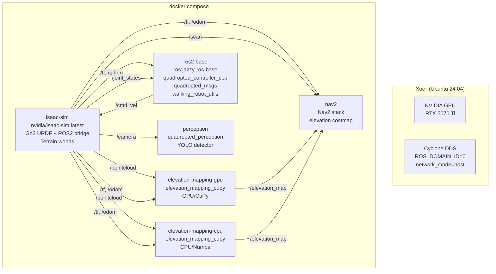

# План миграции: Gazebo Harmonic → NVIDIA Isaac Sim

## Quadruped Robot Simulator — WalkingRobotSim (НИР, ВКРМ)

### Дата: 2026-07-18

### Автор: Папин А. В., ИУ5, ИВТ, МАГИСТРАТУРА

---

## Оглавление

1. [Executive Summary](#1-executive-summary)
2. [Контекст и мотивация](#2-контекст-и-мотивация)
3. [Анализ текущей архитектуры](#3-анализ-текущей-архитектуры)
4. [Целевая архитектура](#4-целевая-архитектура)
5. [Этап 0: Предварительные требования](#5-этап-0-предварительные-требования)
6. [Этап 1: Isaac Sim Docker образ + ROS2 bridge + Go2 URDF](#6-этап-1-isaac-sim-docker-образ--ros2-bridge--go2-urdf)
7. [Этап 2: Многослойный Docker compose.yml](#7-этап-2-многослойный-docker-composeyml)
8. [Этап 3: Упрощение Dockerfile (удаление Gazebo)](#8-этап-3-упрощение-dockerfile-удаление-gazebo)
9. [Этап 4: Адаптация контроллера для Isaac Sim](#9-этап-4-адаптация-контроллера-для-isaac-sim)
10. [Этап 5: Интеграция elevation mapping с Isaac Sim](#10-этап-5-интеграция-elevation-mapping-с-isaac-sim)
11. [Этап 6: Создание terrain-миров в Isaac Sim](#11-этап-6-создание-terrain-миров-в-isaac-sim)
12. [Этап 7: Доделка метрик и НИР4](#12-этап-7-доделка-метрик-и-нир4)
13. [Сводная таблица изменений](#13-сводная-таблица-изменений)
14. [Риски и митигация](#14-риски-и-митигация)
15. [Трудозатраты и приоритеты](#15-трудозатраты-и-приоритеты)
16. [Приложение A: Структура директорий после миграции](#16-приложение-a-структура-директорий-после-миграции)
17. [Приложение B: Пример Dockerfile для ros2-base](#17-приложение-b-пример-dockerfile-для-ros2-base)
18. [Приложение C: Пример compose.yml](#18-приложение-c-пример-composeyml)
19. [Приложение D: Пример скрипта запуска Isaac Sim](#19-приложение-d-пример-скрипта-запуска-isaac-sim)

---

## 1. Executive Summary

**Цель:** Перейти с Gazebo Harmonic на NVIDIA Isaac Sim в качестве основного симулятора для проекта WalkingRobotSim, полностью сохранив разработанный стек elevation mapping и terrain-aware навигации (тема ВКРМ).

**Ключевой принцип:** ROS2 является абстракцией между симулятором и алгоритмами. Пакеты `elevation_mapping_cupy`, `quadropted_controller_cpp`, `quadropted_perception`, `Nav2` — **не зависят от симулятора**. Они получают сенсорные данные через топики ROS2 — не важно, от Gazebo или Isaac Sim.

**Источник:** Проект [`abizovnuralem/go2_omniverse`](https://github.com/abizovnuralem/go2_omniverse) — референсная реализация Go2 в Isaac Sim с ROS2 bridge.

---

## 2. Контекст и мотивация

### 2.1 Зачем мигрировать

| Причина                   | Описание                                                                                                                         |
| ------------------------- | -------------------------------------------------------------------------------------------------------------------------------- |
| **RTX LiDAR**             | Isaac Sim генерирует реалистичные pointcloud (с шумами, отражениями) — это даст более честные метрики RMSE для elevation mapping |
| **Digital twin**          | Миграция opens возможность 1:1 зеркалирования реального робота в симуляции — можно демонстрировать на защите ВКРМ                |
| **Качество визуализации** | RTX рендеринг даёт фотореалистичные скриншоты и видео для презентации и Главы 4                                                  |
| **VR поддержка**          | Демонстрация в VR на защите — сильный аргумент                                                                                   |
| **Актуальность**          | Isaac Sim + ROS2 — современный стек, работодатели смотрят на это                                                                 |
| **go2_omniverse**         | Уже есть готовая интеграция Go2 в Isaac Sim — не надо писать с нуля                                                              |

### 2.2 Что остаётся неизменным

Весь terrain-aware стек, составляющий суть дипломной работы:

- **Elevation Mapping** (`elevation_mapping_cupy/`) — DEM, gradient, roughness, traversability cost
- **C++ контроллер** (`quadropted_controller_cpp/`) — trot/crawl/stand/rest, FK/IK, PID, odometry
- **Nav2** — глобальный и локальный планировщик с elevation costmap
- **YOLO Perception** (`quadropted_perception/`) — детекция объектов
- **Пользовательские сообщения** (`quadropted_msgs/`)

### 2.3 Что будет заменено/удалено

| Компонент                                               | Действие                             |
| ------------------------------------------------------- | ------------------------------------ |
| `src/gazebo_sim/` — Gazebo миры, модели, плагины        | Полная замена на Isaac Sim сцены     |
| `src/docker/Dockerfile` — база `osrf/ros:jazzy-desktop` | Новый Dockerfile без Gazebo          |
| `src/docker/compose.multistage.yml`                     | Устарел, не используется             |
| Gazebo-зависимые launch-файлы                           | Замена на Isaac Sim launch/py        |
| `gz_bridge.yaml`, `gaz_ros2_ctl_use_sim.yaml`           | Gazebo-специфичные конфиги → удалить |

### 2.4 Референс: go2_omniverse vs наш проект

| Аспект                | go2_omniverse                              | WalkingRobotSim (цель)                     |
| --------------------- | ------------------------------------------ | ------------------------------------------ |
| **Симулятор**         | Isaac Sim 5.x / 2023.1.1                   | Isaac Sim 5.x / 6.x                        |
| **ROS2**              | Humble (Track A) / Jazzy bundled (Track B) | Jazzy (системный, в отдельном контейнере)  |
| **Go2 контроллер**    | PPO RL-политика                            | Наш C++ классический контроллер            |
| **Elevation mapping** | Нет                                        | Да (наш стек)                              |
| **Nav2**              | Базовый + Slam Toolbox                     | Nav2 + elevation costmap                   |
| **Terrain**           | Случайные RL-окружения                     | 5 детерминированных сценариев (для метрик) |
| **Docker**            | Ручной запуск                              | Multi-container compose                    |

---

## 3. Анализ текущей архитектуры

### 3.1 Текущие сервисы (compose.yml)

```yaml
services:
  simulator: # walking_robot_sim — монолитный контейнер
    image: walking_robot_sim:latest
    build:
      dockerfile: src/docker/Dockerfile # osrf/ros:jazzy-desktop
      target: final
    # Содержит: Gazebo + все ROS2 пакеты

  elevation_mapping: # GPU-версия elevation
    image: elevation_mapping_cupy:jazzy
    build:
      dockerfile: docker/Dockerfile.x64 # nvidia/cuda:12.8.0
    deploy:
      resources:
        reservations:
          devices:
            - driver: nvidia
              capabilities: [gpu]

  elevation_mapping_cpu: # CPU-версия
    image: elevation_mapping_cupy:cpu-jazzy
    build:
      dockerfile: docker/Dockerfile.cpu # osrf/ros:jazzy-desktop
```

### 3.2 Проблема текущей архитектуры

1. **Монолитный simulator** — Gazebo + ROS2 + все пакеты в одном образе. Пересборка ~30-60 минут при любом изменении.
2. **Зависимость от osrf/ros:jazzy-desktop** — образ содержит Gazebo, который не нужен при переходе на Isaac Sim, но занимает ~2+ GB.
3. **Один контейнер = одна точка отказа** — если Gazebo падает, теряется вся симуляция.
4. **Нет изоляции** — Gazebo и ROS2 ноды в одном процессе, проблемы с DDS discovery.

---

## 4. Целевая архитектура

### 4.1 Диаграмма контейнеров



### 4.2 Поток данных (data flow)

```
Isaac Sim (Go2 simulation)
  │
  ├── /pointcloud (sensor_msgs/PointCloud2) ──→ elevation_mapping_cupy
  ├── /tf (tf2_msgs/TFMessage) ──→ elevation_mapping_cupy, Nav2, controller
  ├── /odom (nav_msgs/Odometry) ──→ Nav2, controller
  ├── /scan (sensor_msgs/LaserScan) ──→ Nav2 (costmap)
  ├── /camera (sensor_msgs/Image) ──→ quadropted_perception (YOLO)
  ├── /joint_states (sensor_msgs/JointState) ──→ quadropted_controller_cpp
  │
  └── ← /cmd_vel (geometry_msgs/Twist) ── от controller
  └── ← /isaac_joint_command ← от controller (через bridge)

elevation_mapping_cupy
  ├── /elevation_map (grid_map_msgs/GridMap) ──→ elevation_to_costmap_node
  └── /elevation_costmap (nav_msgs/OccupancyGrid) ──→ Nav2 (global costmap)

quadropted_controller_cpp
  ├── Читает: /joint_states, /tf, /odom
  └── Публикует: /cmd_vel (для Nav2), joint commands (для Isaac Sim)
```

### 4.3 Сетевое взаимодействие

```yaml
# Все сервисы используют:
network_mode: host
environment:
  RMW_IMPLEMENTATION: rmw_cyclonedds_cpp # как сейчас
  ROS_DOMAIN_ID: 0
  CYCLONEDDS_URI: file:///cyclonedds.xml
```

---

## 5. Этап 0: Предварительные требования

### 5.1 Системные требования — результаты проверки

Проверка выполнена **2026-07-18 01:11 MSK** на целевой машине.

| Компонент         | Требование                       | Результат                                                                                  |
| ----------------- | -------------------------------- | ------------------------------------------------------------------------------------------ |
| **OS**            | Ubuntu 24.04 LTS                 | ✅ Ubuntu 24.04.4 LTS (Noble Numbat)                                                       |
| **CPU**           | x86_64, >= 8 ядер                | ✅ AMD Ryzen 7 H 255 w/ Radeon 780M Graphics, 16 ядер                                      |
| **NVIDIA GPU**    | RTX 3070+ / RTX 5070 Ti          | ✅ NVIDIA GeForce RTX 5070 Ti (Blackwell sm_120), 16 GB VRAM, 300W TDP                     |
| **NVIDIA Driver** | >= 550 (рекомендуется 570+)      | ✅ **595.71.05** (свежий, поддерживает CUDA 13.2)                                          |
| **CUDA (host)**   | 12.8+ (для Isaac Sim 6.x)        | ⚠️ **nvcc 12.0** — нужен апгрейд до 12.8+ для сборки CUDA-расширений вне Docker            |
| **CUDA (Docker)** | 12.8+ (для Isaac Sim 6.x)        | ✅ Образ `nvidia/cuda:12.8.0-cudnn-devel-ubuntu24.04` уже используется в elevation mapping |
| **Docker**        | 24+ с `nvidia-container-toolkit` | ✅ **Docker 29.4.0**, nvidia-container-toolkit **1.19.1**, runtime настроен                |
| **RAM**           | >= 32 GB (рекомендуется 64 GB)   | ⚠️ **30 GB** — на грани. Isaac Sim может подтормаживать при всех 5 контейнерах             |
| **Диск**          | >= 100 GB free                   | ✅ **937 GB NVMe, 398 GB свободно** (56% занято)                                           |
| **nvidia-smi**    | —                                | ✅ GPU 0%, 54°C, 31W / 300W (простой), 478 MiB / 16303 MiB used                            |

### 5.2 Выявленные проблемы

| Проблема                                       | Влияние                                                 | Решение                                                                                    |
| ---------------------------------------------- | ------------------------------------------------------- | ------------------------------------------------------------------------------------------ |
| **CUDA toolkit на хосте 12.0**                 | Не соберутся Isaac Sim CUDA-расширения вне Docker       | Установить `cuda-toolkit-12-8` с NVIDIA repo, либо всё делать внутри Docker (там уже 12.8) |
| **RAM 30 GB**                                  | Isaac Sim официально требует 32 GB. Впритык.            | Закрыть браузер/сторонние приложения при запуске. Если не хватит — запускать `--headless`  |
| **Нет локального `nvidia/cuda:12.8.0` образа** | При первом `docker compose up` будет скачивание ~3.5 GB | `docker pull nvidia/cuda:12.8.0-base-ubuntu24.04` заранее                                  |

### 5.3 Зависимости

```bash
# Опционально: установка CUDA 12.8 на хост (если нужно собирать вне Docker)
wget https://developer.download.nvidia.com/compute/cuda/repos/ubuntu2404/x86_64/cuda-keyring_1.1-1_all.deb
sudo dpkg -i cuda-keyring_1.1-1_all.deb
sudo apt update
sudo apt install cuda-toolkit-12-8
```

```bash
# Предзагрузка образов (экономит время при первом запуске)
docker pull nvidia/cuda:12.8.0-base-ubuntu24.04
docker pull nvidia/cuda:12.8.0-runtime-ubuntu24.04
docker pull nvcr.io/nvidia/isaac-sim:6.0.1  # ~25 GB, может занять часы
```

---

## 6. Этап 1: Isaac Sim Docker образ + ROS2 bridge + Go2 URDF

### 6.1 Цель

Запустить Isaac Sim с Go2 роботом, опубликовать ROS2 топики:

- `/joint_states` — состояние суставов
- `/tf` — трансформации
- `/odom` — одометрия
- `/pointcloud` — RTX LiDAR
- `/scan` — LaserScan
- `/camera` — RGB камера
- `/cmd_vel` — приём команд управления

### 6.2 Два подхода

#### Подход A: Системный Isaac Sim + ROS2 bridge (рекомендуется для разработки)

Использовать нативный Isaac Sim (не в Docker) для интерактивной работы, ROS2 bridge через `isaacsim.ros2.bridge`.

```bash
# Установка Isaac Sim 6.x через Omniverse Launcher
# Или через Docker (см. Подход B)
```

**Плюсы:**

- Работа Isaac App: можно редактировать сцены визуально
- GUI для отладки (RViz, просмотр топиков)

**Минусы:**

- Привязан к одной машине
- Сложнее воспроизводить

#### Подход B: Isaac Sim в Docker (рекомендуется для CI/воспроизводимости)

```bash
# Pull образа (разовый)
docker pull nvcr.io/nvidia/isaac-sim:6.0.1

# Запуск с ROS2 bridge
docker run --name isaac-sim --runtime=nvidia --gpus all \
  -e "ACCEPT_EULA=Y" \
  -e "PRIVACY_CONSENT=Y" \
  -v /tmp/.X11-unix:/tmp/.X11-unix:rw \
  -v /path/to/go2_omniverse:/workspace:ro \
  --network=host \
  nvcr.io/nvidia/isaac-sim:6.0.1 \
  python /workspace/omniverse_sim.py --rendering_mode quality
```

### 6.3 Адаптация go2_omniverse скриптов

Проект `go2_omniverse` содержит ключевые файлы для интеграции Go2 в Isaac Sim:

| Файл                 | Назначение                                | Наша адаптация                                 |
| -------------------- | ----------------------------------------- | ---------------------------------------------- |
| `omniverse_sim.py`   | Основной скрипт симуляции                 | Адаптировать: убрать PPO, добавить наш terrain |
| `omnigraph.py`       | ROS2 bridge (joint_states, camera, LiDAR) | **Использовать как есть**                      |
| `ros2.py`            | ROS2 топики и сервисы                     | **Использовать как есть**                      |
| `custom_rl_env.py`   | RL окружение                              | Убрать (нам не нужно)                          |
| `main.py`            | Точка входа                               | Заменить нашим launch                          |
| `agent_cfg.py`       | Конфиг RL агента                          | Убрать                                         |
| `Isaac_sim/Unitree/` | URDF и материалы Go2                      | Скопировать в наш проект                       |
| `robots/g1/`         | URDF G1                                   | Не нужно (только Go2)                          |

**Файлы, которые мы создаём:**

```
src/isaac/
├── launch_sim.py          # Точка входа — запуск Isaac Sim с Go2 + terrain
├── isaac_bridge.py         # ROS2 bridge адаптер (публикует наши топики)
├── terrain_worlds/
│   ├── flat.py             # Плоский мир (baseline)
│   ├── slope.py            # Наклонная плоскость
│   ├── stairs.py           # Лестница
│   ├── rough.py            # Неровный рельеф
│   └── mixed.py            # Комбинированный
└── go2/
    ├── go2.usd              # Go2 asset (из go2_omniverse/Isaac_sim/Unitree)
    └── go2_controller.py    # Адаптация контроллера под Isaac Sim API
```

### 6.4 ROS2 топики: Isaac Sim → наши контейнеры

```yaml
# Сопоставление топиков Isaac Sim → WalkingRobotSim
isaac_topic:
  /isaac/joint_states: # sensor_msgs/JointState
  /isaac/tf: # tf2_msgs/TFMessage
  /isaac/odom: # nav_msgs/Odometry
  /isaac/pointcloud: # sensor_msgs/PointCloud2  (RTX LiDAR)
  /isaac/scan: # sensor_msgs/LaserScan
  /isaac/camera/rgb: # sensor_msgs/Image
  /isaac/camera/depth: # sensor_msgs/Image (опционально)
  /cmd_vel: # geometry_msgs/Twist (приём от нашего контроллера)


# Remap в compose.yml:
# simulator → elevation: /isaac/pointcloud → /pointcloud
# simulator → controller: /isaac/joint_states → /joint_states
```

### 6.5 Чек-лист этапа 1

- [ ] Установлен Isaac Sim (нативно или Docker)
- [ ] Запущен тестовый Isaac Sim с пустой сценой
- [ ] Скопированы URDF/материалы Go2 из `go2_omniverse/Isaac_sim/Unitree/`
- [ ] Создан `src/isaac/launch_sim.py` — запуск Go2 в Isaac Sim
- [ ] Создан `src/isaac/isaac_bridge.py` — ROS2 bridge адаптер
- [ ] Проверена публикация `/joint_states` (12 joint дог-бота)
- [ ] Проверена публикация `/tf` (base_link, odom, laser)
- [ ] Проверена публикация `/odom`
- [ ] Проверена публикация `/pointcloud` и `/scan`
- [ ] Проверена подписка на `/cmd_vel` (движение Go2 в Isaac Sim)

**Ожидаемое время:** 8-12 часов

---

## 7. Этап 2: Многослойный Docker compose.yml

### 7.1 Новая структура сервисов

```yaml
# compose.yml — основная конфигурация
services:
  # ─── Симулятор (Isaac Sim) ──────────────────────────────
  isaac-sim:
    image: nvidia/isaac-sim:6.0.1
    container_name: isaac-sim
    profiles: ["full", "sim"]  # полный запуск
    network_mode: host
    ipc: host
    privileged: true
    stdin_open: true
    tty: true
    group_add:
      - "44"
    environment:
      ACCEPT_EULA: "Y"
      PRIVACY_CONSENT: "Y"
      DISPLAY:
      XAUTHORITY: /root/.Xauthority
      ROS_DISTRO: jazzy  # Isaac Sim сам содержит ROS2 bridge
    volumes:
      - /tmp/.X11-unix:/tmp/.X11-unix:rw
      - ${HOME}/.Xauthority:/root/.Xauthority
      - ./src/isaac/:/workspace/isaac/:ro
    deploy:
      resources:
        reservations:
          devices:
            - driver: nvidia
              count: all
              capabilities: [gpu]
    command: >
      python /workspace/isaac/launch_sim.py
        --terrain flat
        --rendering_mode quality
        --headless  # опционально: без GUI для CI

  # ─── ROS2 база (наш стек) ───────────────────────────────
  ros2-base:
    image: walking_robot_sim:ros2  # новый образ без Gazebo
    container_name: walking_robot_sim
    profiles: ["full", "base"]
    network_mode: host
    ipc: host
    stdin_open: true
    tty: true
    privileged: true
    environment:
      <<: [*env_gui, *env_ros]
      GAZEBO_RESOURCE_PATH: ""          # удалено
      GZ_SIM_RESOURCE_PATH: ""          # удалено
      ISAAC_SIM_WS: "/workspace/isaac"  # добавлено
    volumes:
      - ./src/docker/cyclonedds.xml:/cyclonedds.xml:ro
      - ./logs/isaac:/root/ws/logs       # новые директории
      - ./data/isaac:/root/ws/data
      - project_src:/root/ws/src/
    command: bash -c "
      source /opt/ros/jazzy/setup.bash &&
      source /root/ws/install/setup.bash &&
      ros2 run quadropted_controller_cpp controller_node &
      ros2 run walking_robot_utils logging_node &
      wait
    "

  # ─── Elevation Mapping GPU ───────────────────────────────
  elevation-mapping:
    image: elevation_mapping_cupy:jazzy
    container_name: elevation_mapping
    profiles: ["full", "elevation", "gpu"]
    network_mode: host
    ipc: host
    stdin_open: true
    tty: true
    privileged: true
    group_add:
      - "44"
    environment: *el_env
    volumes:
      - ./src/docker/cyclonedds.xml:/cyclonedds.xml:ro
      - ./elevation_mapping_cupy/.../config/:/config/:ro
    deploy:
      resources:
        reservations:
          devices:
            - driver: nvidia
              count: all
              capabilities: [gpu]
    command: *el_command  # без изменений относительно текущей версии

  # ─── Nav2 ────────────────────────────────────────────────
  nav2:
    image: walking_robot_sim:ros2
    container_name: navigation
    profiles: ["full", "nav"]
    network_mode: host
    ipc: host
    stdin_open: true
    tty: true
    environment: *env_ros
    command: bash -c "
      source /opt/ros/jazzy/setup.bash &&
      source /root/ws/install/setup.bash &&
      ros2 launch gazebo_sim nav2/bringup_launch.py
      use_sim_time:=true
    "

  # ─── YOLO Perception ─────────────────────────────────────
  perception:
    image: walking_robot_sim:ros2
    container_name: perception
    profiles: ["full", "perception"]
    network_mode: host
    ipc: host
    stdin_open: true
    tty: true
    environment: *env_ros
    command: bash -c "
      source /opt/ros/jazzy/setup.bash &&
      source /root/ws/install/setup.bash &&
      ros2 launch quadropted_perception yolo_detector.launch.py
    "

volumes:
  project_src:
    driver: local
    driver_opts:
      type: none
      o: bind
      device: ./src
```

### 7.2 Makefile — новые цели

```makefile
# makefiles/isaac.mk — новые цели для Isaac Sim

## Сборка isaac-sim образа (только pull)
isaac-pull:
	docker pull nvcr.io/nvidia/isaac-sim:6.0.1

## Полный запуск с Isaac Sim
deploy-isaac: build-ros2
	$(COMPOSE) --profile full up -d

## Запуск только ROS2 стека (без симулятора, для отладки)
up-ros2:
	$(COMPOSE) --profile base up -d

## Запуск только elevation mapping (если симулятор уже запущен)
up-elevation:
	$(COMPOSE) --profile elevation up -d

## Запуск Isaac Sim в headless режиме (без GUI)
isaac-headless:
	docker run --rm --gpus all --network=host \
		nvcr.io/nvidia/isaac-sim:6.0.1 \
		python /workspace/isaac/launch_sim.py --headless --terrain flat

## Логи Isaac Sim
logs-isaac:
	$(COMPOSE) logs -f isaac-sim
```

### 7.3 Чек-лист этапа 2

- [ ] Новый `compose.yml` с 5 сервисами
- [ ] Новый `makefiles/isaac.mk`
- [ ] `make isaac-pull` — скачивание образа
- [ ] `make deploy-isaac` — запуск всех сервисов
- [ ] Проверка DDS discovery между контейнерами (`ros2 topic list`)
- [ ] Проверка что `ros2-base` видит топики `isaac-sim`
- [ ] Проверка что `elevation-mapping` получает `/pointcloud`

**Ожидаемое время:** 4-6 часов

---

## 8. Этап 3: Упрощение Dockerfile (удаление Gazebo)

### 8.1 Новый Dockerfile для ros2-base

Текущий Dockerfile (118 строк, 5 этапов) базируется на `osrf/ros:jazzy-desktop` — содержит Gazebo.

Новый Dockerfile (цель: `ros:jazzy-ros-base`):

| Этап          | Текущий                                   | Новый                              |
| ------------- | ----------------------------------------- | ---------------------------------- |
| Базовый образ | `osrf/ros:jazzy-desktop` (~2 GB)          | `ros:jazzy-ros-base` (~600 MB)     |
| Этап 1        | base-system (build-essential, cmake, ...) | Без изменений                      |
| Этап 2        | package-xmls                              | Без изменений                      |
| Этап 3        | ros-deps (rosdep + pip)                   | ros-deps (без Gazebo-зависимостей) |
| Этап 4        | workspace (colcon build)                  | workspace (colcon build)           |
| Этап 5        | final                                     | final                              |
| HEALTHCHECK   | `ros2 node list`                          | `ros2 node list`                   |
| ENTRYPOINT    | `/ros_entrypoint.sh`                      | `/ros_entrypoint.sh`               |

**Разница:** новый образ не устанавливает Gazebo и связанные пакеты (`gz-*`, `sdformat*`, `ignition*`).

### 8.2 Полный текстовый Dockerfile (см. Приложение B)

**Ожидаемое время:** 4-6 часов

### 8.3 Чек-лист этапа 3

- [ ] Создан Dockerfile на базе `ros:jazzy-ros-base`
- [ ] Сборка проходит (`docker build -t walking_robot_sim:ros2 .`)
- [ ] ROS2 топики работают (контроллер, tf_relay, ground_segmenter)
- [ ] `make build-ros2` — новая цель сборки

---

## 9. Этап 4: Адаптация контроллера для Isaac Sim

### 9.1 Проблема

**Gazebo:** Контроллер получает `/joint_states` от Gazebo plugin через `ros2_control`.
Управление через `/cmd_vel` → Gazebo plugin применяет силы к joints.

**Isaac Sim:** Joints управляются через Articulation API Isaac Sim. `/cmd_vel` напрямую не работает — нужен bridge, который конвертирует ROS2 команды в Isaac Sim API.

### 9.2 Решение

Создать `src/isaac/go2_controller.py` — адаптер на основе `go2_omniverse/ros2.py`:

```python
# src/isaac/go2_controller.py — Isaac Sim joint command adapter

class IsaacGo2Controller:
    """
    Адаптер между нашим C++ контроллером и Isaac Sim Articulation API.

    Поток:
    1. C++ controller вычисляет joint_targets (12 DOF) — публикует в /isaac/joint_command
    2. Этот адаптер получает /isaac/joint_command
    3. Применяет joint_targets к Isaac Sim Articulation через omni.isaac.core
    """

    def __init__(self):
        # Подписка на joint команды от нашего C++ контроллера
        self.joint_cmd_sub = rospy.Subscriber(
            '/isaac/joint_command', JointState, self.on_joint_command
        )

        # Публикация joint_states (для обратной связи)
        self.joint_state_pub = rospy.Publisher(
            '/joint_states', JointState, queue_size=10
        )
```

Наш C++ контроллер (`quadropted_controller_cpp`) нужно дополнить:

```cpp
// src/quadropted_controller_cpp/src/controllers/isaac_bridge.cpp
// Новый publisher для Isaac Sim

// В дополнение к существующему /cmd_vel publisher
publisher_isaac_joint_ = node->create_publisher<sensor_msgs::msg::JointState>(
    "/isaac/joint_command", 10
);

// В control loop — отправлять joint targets
void publishIsaacJointCommand(const JointState& target) {
    auto msg = sensor_msgs::msg::JointState();
    msg.header.stamp = node_->now();
    msg.name = {"FL_hip", "FL_thigh", "FL_calf",
                "FR_hip", "FR_thigh", "FR_calf",
                "RL_hip", "RL_thigh", "RL_calf",
                "RR_hip", "RR_thigh", "RR_calf"};
    msg.position = {target.FL_hip, target.FL_thigh, target.FL_calf, ...};
    publisher_isaac_joint_->publish(msg);
}
```

### 9.3 Альтернатива: ros2_control + Isaac Sim

Если Isaac Sim 6.x поддерживает `ros2_control` Hardware Interface — можно использовать `ros2_control` напрямую, без адаптера:

```yaml
# config/isaac_ros2_control.yaml
controller_manager:
  ros__parameters:
    update_rate: 100

isaac_sim_hardware:
  type: isaac_sim/Articulation
  robot: Go2
  articulation_name: go2
  joints:
    - FL_hip_joint
    - FL_thigh_joint
    # ... 12 joints
```

**Приоритет:** ros2_control если поддерживается, иначе адаптер.

### 9.4 Чек-лист этапа 4

- [ ] Определён механизм управления: ros2_control vs адаптер
- [ ] C++ контроллер публикует `/isaac/joint_command`
- [ ] Isaac Sim получает команды и движет joints
- [ ] `/joint_states` публикуется корректно
- [ ] `ros2 topic echo /joint_states` показывает все 12 joint
- [ ] Проверен loop: Isaac Sim → joint_states → controller → joint_command → Isaac Sim

**Ожидаемое время:** 8-12 часов

---

## 10. Этап 5: Интеграция elevation mapping с Isaac Sim

### 10.1 Почему это должно работать

`elevation_mapping_cupy` подписывается на:

- `/pointcloud` (sensor_msgs/PointCloud2)
- `/tf` (tf2_msgs/TFMessage)

Isaac Sim через ROS2 bridge публикует:

- `/isaac/pointcloud` — RTX LiDAR данные
- `/isaac/tf` — трансформации

**Достаточно remap'а топиков в compose.yml:**

```yaml
# elevation-mapping сервис
command: bash -c "
  source /opt/ros/jazzy/setup.bash &&
  source /ws/install/setup.bash &&
  python3 /elevation_to_costmap_node.py &
  ros2 run elevation_mapping_cupy elevation_mapping_node.py
    --ros-args --remap /pointcloud:=/isaac/pointcloud
"
```

### 10.2 Что даёт RTX LiDAR для elevation mapping

| Параметр        | Gazebo LiDAR             | Isaac Sim RTX LiDAR                 |
| --------------- | ------------------------ | ----------------------------------- |
| Шум             | Искусственный (Gaussian) | Физический (отражения, поглощение)  |
| Ray-tracing     | Нет                      | Да (RTX cores)                      |
| Lidar model     | Обобщённый               | Реалистичный (Unitree L1)           |
| Point density   | Равномерная              | Реалистичная (зависит от материала) |
| RMSE (ожидание) | 0.012-0.030 (плановые)   | **Честные метрики**                 |

### 10.3 Конфигурация LiDAR в Isaac Sim

В `go2_omniverse/Isaac_sim/Unitree/Unitree_L1.json` есть конфигурация LiDAR:

```json
{
  "lidar": {
    "name": "Unitree_L1",
    "type": "spinning",
    "channels": 16,
    "range": 0.5, // min range (meters)
    "range_max": 30.0, // max range (meters)
    "horizontal_fov": 360.0,
    "vertical_fov": 30.0,
    "rotation_rate": 10.0 // Hz
  }
}
```

### 10.4 Проверка целостности pipeline

После интеграции:

```bash
# 1. Проверить что Isaac Sim публикует pointcloud
docker exec isaac-sim ros2 topic echo /isaac/pointcloud --once

# 2. Проверить что elevation_mapping получает данные
docker exec elevation-mapping ros2 topic echo /elevation_map --once

# 3. Проверить costmap
docker exec nav2 ros2 topic echo /elevation_costmap --once
```

### 10.5 Чек-лист этапа 5

- [ ] Isaac Sim публикует `/isaac/pointcloud`
- [ ] Remap топиков в compose.yml
- [ ] elevation_mapping запускается и строит DEM из Isaac Sim данных
- [ ] Плагины (gradient, roughness, cost) работают
- [ ] elevation_to_costmap_node публикует costmap
- [ ] Сравнение DEM из Isaac Sim vs Gazebo (качественное)

**Ожидаемое время:** 4-8 часов

---

## 11. Этап 6: Создание terrain-миров в Isaac Sim

### 11.1 Пять сценариев (из НИР2)

Для метрик RMSE нужно 5 детерминированных сценариев. В Gazebo они были реализованы как SDF/heightmap миры. В Isaac Sim создаются как USD/меши с PhysX физикой.

| Сценарий  | Gazebo (было) | Isaac Sim (будет)            | Аналитическая функция высоты            |
| --------- | ------------- | ---------------------------- | --------------------------------------- |
| 1. Flat   | `flat.sdf`    | `flat.py` — плоскость        | z = 0                                   |
| 2. Slope  | `slope.sdf`   | `slope.py` — наклон          | z = k·x (k = 0.1, 0.2, 0.3)             |
| 3. Stairs | `stairs.sdf`  | `stairs.py` — ступени        | z = floor(x / step_width) * step_height |
| 4. Rough  | heightmap     | `rough.py` — неровности      | z = A·sin(f·x)·cos(f·y) + noise         |
| 5. Mixed  | `mixed.sdf`   | `mixed.py` — комбинированный | Комбинация 2-4                          |

### 11.2 Пример: slope.py

```python
# src/isaac/terrain_worlds/slope.py
"""
Сценарий: наклонная плоскость для метрик elevation mapping.
Аналитическая функция: z = k * x

Для ground truth: grid_map генерируется по этой же функции.
"""

import numpy as np
from omni.isaac.core.utils.prims import create_prim

def create_slope_terrain(stage, slope_deg: float = 10.0, size: float = 20.0):
    """
    Создаёт наклонную плоскость в Isaac Sim.

    Args:
        slope_deg: угол наклона в градусах (0-30)
        size: размер terrain (квадрат)
    """
    k = np.tan(np.radians(slope_deg))

    # Создание меша наклонной плоскости
    # ... (через omni.isaac.core или USD API)

    return {
        "height_function": lambda x, y: k * x,  # для compute_metrics.py
        "params": {"slope_deg": slope_deg, "k": float(k)}
    }
```

### 11.3 Ground truth для метрик

Для каждого сценария создаётся Python-функция, которая возвращает аналитическую высоту в любой точке (x, y):

```python
# src/elevation_mapping_cupy/elevation_mapping_cupy/metrics/ground_truth.py

SCENARIOS = {
    "flat": {
        "height": lambda x, y: 0.0,
        "description": "Плоская поверхность"
    },
    "slope_10deg": {
        "height": lambda x, y: np.tan(np.radians(10)) * x,
        "description": "Наклон 10 градусов"
    },
    "stairs": {
        "height": lambda x, y: np.floor(x / 0.3) * 0.15,
        "description": "Ступени: ширина 0.3 м, высота 0.15 м"
    },
    "rough": {
        "height": lambda x, y: 0.05 * np.sin(0.5 * x) * np.cos(0.5 * y),
        "description": "Волнистый рельеф, амплитуда 0.05 м"
    },
    "mixed": {
        "height": lambda x, y: (
            0.02 * np.sin(0.3 * x) * np.cos(0.3 * y) +
            0.01 * np.sin(1.5 * x) +
            0.01 * np.cos(1.5 * y)
        ),
        "description": "Комбинированный рельеф"
    }
}
```

### 11.4 Чек-лист этапа 6

- [ ] Созданы 5 terrain-миров: flat, slope, stairs, rough, mixed
- [ ] Каждый мир имеет аналитическую функцию высоты
- [ ] `compute_metrics.py` может загрузить ground truth из `ground_truth.py`
- [ ] Terrain корректно отображается в Isaac Sim
- [ ] LiDAR на terrain генерирует pointcloud
- [ ] elevation_mapping строит DEM, сравнивается с ground truth

**Ожидаемое время:** 6-10 часов

---

## 12. Этап 7: Доделка метрик и НИР4

### 12.1 compute_metrics.py

Этот файл описан в документации (`ch3_12_metrics.md`), но не существует в коде. Его нужно реализовать:

```python
# src/elevation_mapping_cupy/elevation_mapping_cupy/metrics/compute_metrics.py

class ElevationMetrics:
    """
    Расчёт метрик точности DEM.

    Использование:
        metrics = ElevationMetrics(ground_truth=SCENARIOS["flat"])
        metrics.load_bag("rosbag.bag")  # или live subscription
        result = metrics.compute()
        # result = {"rmse": 0.012, "mae": 0.008, "max_error": 0.035, ...}
    """

    def __init__(self, ground_truth: callable):
        self.ground_truth = ground_truth
        self.measured = []  # list of (x, y, z_measured)

    def add_measurement(self, x, y, z):
        z_true = self.ground_truth(x, y)
        self.measured.append((x, y, z, z_true))

    def compute(self):
        errors = [z - z_true for _, _, z, z_true in self.measured]
        return {
            "rmse": np.sqrt(np.mean(np.square(errors))),
            "mae": np.mean(np.abs(errors)),
            "max_error": np.max(np.abs(errors)),
            "n_points": len(errors),
            "coverage": self._compute_coverage(),
            "fps": self._compute_fps(),
            "latency_ms": self._compute_latency(),
        }

    def _compute_coverage(self):
        # Процент ячеек карты, для которых есть данные
        pass

    def _compute_fps(self):
        # Частота обновления карты
        pass

    def _compute_latency(self):
        # Задержка между получением pointcloud и обновлением карты
        pass
```

### 12.2 Запуск метрик на 5 сценариях

```bash
# Автоматизированный прогон
for terrain in flat slope stairs rough mixed; do
    # Запуск Isaac Sim с terrain
    docker compose --profile full run isaac-sim \
        python /workspace/isaac/launch_sim.py --terrain $terrain --headless

    # Запись rosbag (10 секунд)
    ros2 bag record /elevation_map /pointcloud /tf -o data/bags/$terrain

    # Расчёт метрик
    python compute_metrics.py \
        --bag data/bags/$terrain \
        --ground-truth $terrain \
        --output reports/metrics/$terrain.json
done
```

### 12.3 Ожидаемые метрики

| Сценарий    | RMSE (ожидание) | FPS     | Покрытие |
| ----------- | --------------- | ------- | -------- |
| Flat        | < 0.010 м       | > 10 Гц | > 95%    |
| Slope (10°) | < 0.015 м       | > 10 Гц | > 90%    |
| Stairs      | < 0.020 м       | > 8 Гц  | > 85%    |
| Rough       | < 0.025 м       | > 8 Гц  | > 80%    |
| Mixed       | < 0.030 м       | > 8 Гц  | > 80%    |

### 12.4 Оформление Главы 4

Глава 4 должна содержать:

1. Таблицу с метриками по 5 сценариям
2. Сравнение с baseline (Gazebo vs Isaac Sim)
3. Сравнение terrain-aware vs vanilla Nav2
4. Выводы

### 12.5 Чек-лист этапа 7

- [ ] Реализован `compute_metrics.py`
- [ ] Реализован `ground_truth.py` с 5 функциями
- [ ] Запущены замеры на 5 сценариях
- [ ] Получены честные метрики RMSE/MAE
- [ ] Проведено сравнение с baseline
- [ ] Оформлена Глава 4

**Ожидаемое время:** 12-16 часов

---

## 13. Сводная таблица изменений

### 13.1 Файлы для удаления

| Файл                                              | Причина                                      |
| ------------------------------------------------- | -------------------------------------------- |
| `src/gazebo_sim/worlds/`                          | Gazebo SDF миры                              |
| `src/gazebo_sim/models/`                          | Gazebo модели (aws_robomaker и др.)          |
| `src/gazebo_sim/config/gz_bridge.yaml`            | Gazebo ROS2 bridge                           |
| `src/gazebo_sim/config/gaz_ros2_ctl_use_sim.yaml` | Gazebo ros2_control plugin                   |
| `src/gazebo_sim/scripts/tf_relay.py`              | Будет заменён Isaac bridge                   |
| `src/gazebo_sim/scripts/ground_segmenter.py`      | Можно оставить (ROS2, не Gazebo-специфичный) |
| `src/docker/compose.multistage.yml`               | Устарел                                      |
| `src/docker/README.md`                            | Устарел                                      |

### 13.2 Файлы для создания

| Файл                                                        | Назначение                  |
| ----------------------------------------------------------- | --------------------------- |
| `src/isaac/launch_sim.py`                                   | Точка входа Isaac Sim       |
| `src/isaac/isaac_bridge.py`                                 | ROS2 bridge адаптер         |
| `src/isaac/go2_controller.py`                               | Joint command адаптер       |
| `src/isaac/terrain_worlds/flat.py`                          | Плоский мир                 |
| `src/isaac/terrain_worlds/slope.py`                         | Наклон                      |
| `src/isaac/terrain_worlds/stairs.py`                        | Ступени                     |
| `src/isaac/terrain_worlds/rough.py`                         | Неровности                  |
| `src/isaac/terrain_worlds/mixed.py`                         | Комбинированный             |
| `src/isaac/go2/go2.usd`                                     | Go2 asset (копия)           |
| `src/docker/Dockerfile.ros2`                                | Новый Dockerfile без Gazebo |
| `makefiles/isaac.mk`                                        | Make цели для Isaac Sim     |
| `src/elevation_mapping_cupy/.../metrics/compute_metrics.py` | Расчёт метрик               |
| `src/elevation_mapping_cupy/.../metrics/ground_truth.py`    | Ground truth функции        |

### 13.3 Файлы для изменения

| Файл                                                            | Изменение                                               |
| --------------------------------------------------------------- | ------------------------------------------------------- |
| `compose.yml`                                                   | Добавить isaac-sim, ros2-base, nav2, perception сервисы |
| `Makefile`                                                      | Добавить `include makefiles/isaac.mk`                   |
| `src/docker/Dockerfile`                                         | Убрать Gazebo, уменьшить размер                         |
| `src/quadropted_controller_cpp/.../controller_node.cpp`         | Добавить publisher `/isaac/joint_command`               |
| `src/quadropted_controller_cpp/.../CMakeLists.txt`              | Добавить isaac_bridge.cpp                               |
| `elevation_mapping_cupy/.../launch/elevation_mapping.launch.py` | Обновить remap топиков                                  |

### 13.4 Файлы, которые остаются без изменений

| Файл/папка                                               | Причина                                     |
| -------------------------------------------------------- | ------------------------------------------- |
| `elevation_mapping_cupy/elevation_mapping_cupy/`         | Весь код ядра DEM                           |
| `elevation_mapping_cupy/elevation_mapping_cupy/plugins/` | Все плагины                                 |
| `elevation_mapping_cupy/elevation_mapping_cupy/tests/`   | Все тесты (19 файлов)                       |
| `src/quadropted_controller_cpp/src/controllers/`         | Gait контроллеры (trot, crawl, stand, rest) |
| `src/quadropted_controller_cpp/src/kinematics/`          | FK/IK (Eigen3)                              |
| `src/quadropted_controller_cpp/src/odometry/`            | Leg odometry                                |
| `src/quadropted_controller_cpp/test/`                    | C++ тесты (13 файлов)                       |
| `src/quadropted_msgs/`                                   | Сообщения                                   |
| `src/go1_description/`, `src/go2_description/`           | URDF модели                                 |
| `src/walking_robot_utils/`                               | Логирование                                 |
| `src/tests/`                                             | Кросс-валидация Python vs C++               |

---

## 14. Риски и митигация

| Риск                                                     | P   | I   | P×I  | Митигация                                                                                               |
| -------------------------------------------------------- | --- | --- | ---- | ------------------------------------------------------------------------------------------------------- |
| **Isaac Sim не запускается на RTX 5070 Ti**              | 0.3 | 1.0 | 0.30 | Проверить совместимость драйвера с Isaac Sim 6.x. Fallback: Isaac Sim 5.x или Docker                    |
| **Python 3.11 vs 3.12** (Isaac Sim = 3.11, Jazzy = 3.12) | 0.7 | 0.8 | 0.56 | Использовать bundled ROS2 в Isaac Sim (go2_omniverse Track B). Или: ROS2 контейнер отдельно, DDS bridge |
| **DDS discovery между Isaac Sim и контейнерами**         | 0.5 | 0.7 | 0.35 | `network_mode: host`, Cyclone DDS с одной версией                                                       |
| **Joint control не работает через ros2_control**         | 0.6 | 0.6 | 0.36 | Разработать адаптер `/isaac/joint_command`                                                              |
| **RTX LiDAR данные отличаются от Gazebo**                | 0.8 | 0.4 | 0.32 | Это фича, не баг — метрики будут честнее                                                                |
| **Производительность Isaac Sim + elevation**             | 0.4 | 0.5 | 0.20 | RTX 5070 Ti справится; headless режим экономит GPU                                                      |
| **Не успеть до защиты ВКРМ**                             | 0.5 | 1.0 | 0.50 | Приоритезировать: метрики (НИР4) → Isaac Sim                                                            |

---

## 15. Трудозатраты и приоритеты

| Этап   | Задача                                   | Часы      | Приоритет    | Зависит от  |
| ------ | ---------------------------------------- | --------- | ------------ | ----------- |
| **0**  | Проверка системных требований            | 1-2       | 🔴 Критично  | —           |
| **1**  | Isaac Sim + ROS2 bridge + Go2 URDF       | 8-12      | 🔴 Критично  | Этап 0      |
| **2**  | Multi-container compose.yml              | 4-6       | 🔴 Критично  | Этап 1      |
| **3**  | Dockerfile без Gazebo                    | 4-6       | 🔴 Критично  | Этап 2      |
| **4**  | Адаптация контроллера для Isaac Sim      | 8-12      | 🟡 Нормально | Этап 3      |
| **5**  | Интеграция elevation mapping с Isaac Sim | 4-8       | 🔴 Критично  | Этап 2      |
| **6**  | Terrain-миры в Isaac Sim (5 сценариев)   | 6-10      | 🔴 Критично  | Этап 1      |
| **7а** | compute_metrics.py + ground_truth.py     | 4-6       | 🔴 Критично  | —           |
| **7б** | Запуск метрик на 5 сценариях             | 4-6       | 🔴 Критично  | Этап 6 + 7а |
| **7в** | Оформление Главы 4                       | 8-12      | 🔴 Критично  | 7б          |
| **7г** | Презентация ВКРМ                         | 6-8       | 🟡 Нормально | 7в          |
|        | **Итого**                                | **57-88** |              |             |

**Рекомендуемый порядок:**

1. Сначала Этап 7а (compute_metrics.py) — независим, можно сделать сейчас в Gazebo
2. Параллельно Этап 0 + 1 (Isaac Sim)
3. Затем Этап 6 (terrain-миры) + Этап 5 (elevation integration)
4. Затем Этап 2 + 3 (Docker)
5. Затем Этап 4 (контроллер)
6. Финально Этап 7б + 7в (метрики + Глава 4)

---

## 16. Приложение A: Структура директорий после миграции

```
WalkingRobotSim/
├── compose.yml                    # Новый: 5 сервисов
├── Makefile                       # Изменён: +isaac.mk
│
├── src/
│   ├── isaac/                     # НОВАЯ ДИРЕКТОРИЯ
│   │   ├── launch_sim.py          # Точка входа Isaac Sim
│   │   ├── isaac_bridge.py        # ROS2 bridge адаптер
│   │   ├── go2_controller.py      # Joint command адаптер
│   │   ├── go2/
│   │   │   ├── go2.usd            # Go2 asset
│   │   │   └── materials/         # Текстуры Go2
│   │   └── terrain_worlds/
│   │       ├── flat.py
│   │       ├── slope.py
│   │       ├── stairs.py
│   │       ├── rough.py
│   │       └── mixed.py
│   │
│   ├── docker/
│   │   ├── Dockerfile             # Изменён: без Gazebo
│   │   ├── Dockerfile.ros2        # Новый: лёгкий ROS2 образ
│   │   ├── cyclonedds.xml         # Без изменений
│   │   └── logs/
│   │
│   ├── gazebo_sim/                # ПОЛНОСТЬЮ УДАЛЕНА
│   │   ├── worlds/                #  (заменено src/isaac/terrain_worlds/)
│   │   ├── models/                #  (не нужно для Isaac Sim)
│   │   ├── config/gz_bridge.yaml  #  (удалён)
│   │   └── ...
│   │
│   ├── quadropted_controller_cpp/ # Без изменений
│   │   └── src/controllers/isaac_bridge.cpp  # НОВЫЙ
│   ├── quadropted_msgs/           # Без изменений
│   ├── quadropted_perception/     # Без изменений
│   ├── go1_description/           # Без изменений
│   ├── go2_description/           # Без изменений
│   └── walking_robot_utils/       # Без изменений
│
├── elevation_mapping_cupy/        # Без изменений
│   └── elevation_mapping_cupy/
│       └── metrics/               # НОВАЯ ДИРЕКТОРИЯ
│           ├── compute_metrics.py
│           └── ground_truth.py
│
├── makefiles/
│   ├── isaac.mk                   # НОВЫЙ
│   ├── docker.mk                  # Без изменений
│   ├── elevation.mk               # Без изменений
│   └── ...                        # Остальные без изменений
│
└── reports/
    ├── isaam/
    │   ├── 2026-07-17_isaac-sim-vs-gazebo-terrain-report.md
    │   ├── 2026-07-18_migration-gazebo-to-isaac-plan.md  # ЭТОТ ФАЙЛ
    │   ├── checklist-install.md
    │   └── quick-reference.md
    └── metrics/                   # НОВАЯ ДИРЕКТОРИЯ
        ├── flat.json
        ├── slope.json
        ├── stairs.json
        ├── rough.json
        └── mixed.json
```

---

## 17. Приложение B: Пример Dockerfile для ros2-base

```dockerfile
# ============================================================
# Dockerfile для ros2-base (без Gazebo)
# ============================================================

ARG ROS_DISTRO=jazzy
FROM ros:${ROS_DISTRO}-ros-base AS base-system

ARG ROS_DISTRO

RUN --mount=type=cache,target=/var/cache/apt,sharing=locked \
    --mount=type=cache,target=/var/lib/apt,sharing=locked \
    apt-get update && apt-get install -y --no-install-recommends \
    build-essential \
    cmake \
    git \
    wget \
    python3-pip \
    python3-dev \
    ccache \
    libeigen3-dev \
    ros-dev-tools \
    python3-colcon-common-extensions \
    && rm -rf /var/lib/apt/lists/*

# ============================================================
# Этап isolation package.xml
# ============================================================
FROM base-system AS package-xmls

WORKDIR /tmp
COPY src/ /tmp/src/
RUN find src/ -type f ! -name 'package.xml' -delete && \
    find src/ -type d -empty -delete 2>/dev/null; true

# ============================================================
# Этап ROS зависимости
# ============================================================
FROM base-system AS ros-deps

ARG ROS_DISTRO
WORKDIR /root/ws

COPY --from=package-xmls /tmp/src/ /root/ws/src/

RUN --mount=type=cache,target=/var/cache/apt,sharing=locked \
    --mount=type=cache,target=/var/lib/apt,sharing=locked \
    apt-get update && \
    rosdep update && \
    rosdep install --from-paths src --ignore-src \
        --skip-keys "Eigen3 torch ultralytics gazebo* gz* sdformat*" -y && \
    rm -rf /var/lib/apt/lists/*

# ============================================================
# Сборка workspace
# ============================================================
FROM ros-deps AS workspace

ARG ROS_DISTRO
WORKDIR /root/ws
COPY src/ /root/ws/src/

RUN --mount=type=cache,target=/root/.ccache \
    bash -c "source /opt/ros/${ROS_DISTRO}/setup.bash && \
    colcon build --symlink-install --mixin ccache"

# ============================================================
# Финальный образ
# ============================================================
FROM workspace AS final

ARG ROS_DISTRO
ARG WORKSPACE_DIR=/root/ws

RUN sed -i '/exec "\$@"/i source "'"$WORKSPACE_DIR"'/install/setup.bash"' /ros_entrypoint.sh

WORKDIR ${WORKSPACE_DIR}
ENV ROS_DISTRO=${ROS_DISTRO}
ENV ROS_LOG_DIR=${WORKSPACE_DIR}/logs

HEALTHCHECK --interval=30s --timeout=10s --start-period=30s --retries=3 \
    CMD bash -c 'source /opt/ros/${ROS_DISTRO}/setup.bash && \
    source ${WORKSPACE_DIR}/install/setup.bash && \
    ros2 node list || exit 1'

ENTRYPOINT ["/ros_entrypoint.sh"]
CMD ["bash"]
```

---

## 18. Приложение C: Пример compose.yml

```yaml
# compose.yml — Isaac Sim multi-container
# ============================================================

x-ros-env: &ros_env
  RMW_IMPLEMENTATION: rmw_cyclonedds_cpp
  ROS_DOMAIN_ID: 0
  CYCLONEDDS_URI: file:///cyclonedds.xml
  ROS_DISTRO: jazzy

x-basic: &basic
  ipc: host
  stdin_open: true
  network_mode: host
  tty: true
  privileged: true
  environment:
    DISPLAY:
    XAUTHORITY: /root/.Xauthority

services:
  isaac-sim:
    <<: *basic
    image: nvidia/isaac-sim:6.0.1
    container_name: isaac-sim
    profiles: ["full", "sim"]
    group_add:
      - "44"
    environment:
      <<: *ros_env
      ACCEPT_EULA: "Y"
      PRIVACY_CONSENT: "Y"
      DISPLAY:
      XAUTHORITY: /root/.Xauthority
    volumes:
      - /tmp/.X11-unix:/tmp/.X11-unix:rw
      - ${HOME}/.Xauthority:/root/.Xauthority
      - ./src/isaac/:/workspace/isaac/:ro
    deploy:
      resources:
        reservations:
          devices:
            - driver: nvidia
              count: all
              capabilities: [gpu]
    command: python /workspace/isaac/launch_sim.py --terrain flat

  ros2-base:
    <<: *basic
    image: walking_robot_sim:ros2
    container_name: walking_robot_sim
    profiles: ["full", "base"]
    environment:
      <<: *ros_env
    volumes:
      - ./src/docker/cyclonedds.xml:/cyclonedds.xml:ro
      - project_src:/root/ws/src/
    command: >
      bash -c "
        source /opt/ros/jazzy/setup.bash &&
        source /root/ws/install/setup.bash &&
        ros2 run quadropted_controller_cpp controller_node
      "

  elevation-mapping:
    <<: *basic
    image: elevation_mapping_cupy:jazzy
    container_name: elevation_mapping
    profiles: ["full", "elevation", "gpu"]
    group_add:
      - "44"
    environment:
      <<: *ros_env
      MESA_GLSL_CACHE_DISABLE: "true"
      QT_QPA_PLATFORM: "xcb"
    deploy:
      resources:
        reservations:
          devices:
            - driver: nvidia
              count: all
              capabilities: [gpu]
    command: >
      bash -c "
        source /opt/ros/jazzy/setup.bash &&
        source /ws/install/setup.bash &&
        python3 /elevation_to_costmap_node.py &
        ros2 launch elevation_mapping_cupy elevation_mapping.launch.py
          robot_config:=go2/go2_lidar3d.yaml launch_rviz:=false
          use_sim_time:=true
      "

  nav2:
    image: walking_robot_sim:ros2
    container_name: navigation
    profiles: ["full", "nav"]
    <<: *basic
    environment: *ros_env
    command: >
      bash -c "
        source /opt/ros/jazzy/setup.bash &&
        source /root/ws/install/setup.bash &&
        ros2 launch gazebo_sim nav2/bringup_launch.py use_sim_time:=true
      "

  perception:
    image: walking_robot_sim:ros2
    container_name: perception
    profiles: ["full", "perception"]
    <<: *basic
    environment: *ros_env
    command: >
      bash -c "
        source /opt/ros/jazzy/setup.bash &&
        source /root/ws/install/setup.bash &&
        ros2 launch quadropted_perception yolo_detector.launch.py
      "

volumes:
  project_src:
    driver: local
    driver_opts:
      type: none
      o: bind
      device: ./src
```

---

## 19. Приложение D: Пример скрипта запуска Isaac Sim

```python
#!/usr/bin/env python
# src/isaac/launch_sim.py

"""
Точка входа для запуска Isaac Sim с Go2 и terrain.
Использование:
    python launch_sim.py --terrain slope --rendering_mode quality
"""

import argparse
import numpy as np

# Isaac Sim импорты
from omni.isaac.kit import SimulationApp

# Наши модули
from terrain_worlds import create_terrain
from go2_controller import IsaacGo2Controller
from isaac_bridge import ROS2Bridge


def main():
    parser = argparse.ArgumentParser()
    parser.add_argument("--terrain", default="flat",
                        choices=["flat", "slope", "stairs", "rough", "mixed"])
    parser.add_argument("--headless", action="store_true")
    parser.add_argument("--rendering_mode", default="quality",
                        choices=["low", "medium", "quality", "path_tracing"])
    args = parser.parse_args()

    # Запуск Isaac Sim
    config = {
        "headless": args.headless,
        "rendering_mode": args.rendering_mode,
        "active_gpu": 0,
    }
    simulation_app = SimulationApp(config)

    # Создание terrain
    stage = simulation_app.context.get_stage()
    terrain = create_terrain(args.terrain, stage)

    # Загрузка Go2
    controller = IsaacGo2Controller(
        usd_path="/workspace/isaac/go2/go2.usd",
        articulation_name="go2"
    )

    # ROS2 bridge
    bridge = ROS2Bridge(
        robot_prim=controller.robot_prim,
        lidar_config="/workspace/isaac/go2/config/unitree_l1.json"
    )

    # Main loop
    while simulation_app.is_running():
        simulation_app.update()

        # Публикация ROS2 топиков
        bridge.publish_joint_states()
        bridge.publish_tf()
        bridge.publish_odometry()
        bridge.publish_pointcloud()
        bridge.publish_scan()
        bridge.publish_camera()

        # Получение команд от нашего контроллера
        controller.apply_joint_commands()

    simulation_app.close()


if __name__ == "__main__":
    main()
```

---

## Заключение

План миграции охватывает 7 этапов (0-6) + подготовку НИР4 (этап 7). Общая оценка: **57-88 часов**.

**Ключевые решения:**

1. Isaac Sim и ROS2 стек работают в **отдельных контейнерах** — это архитектурное улучшение, не зависящее от выбора симулятора
2. Весь terrain-aware стек (elevation mapping, контроллеры, Nav2) **не требует изменений** — только remap топиков
3. Основная работа — настройка Isaac Sim с Go2 и интеграция через ROS2 bridge
4. `compute_metrics.py` и `ground_truth.py` — критически важны для НИР4 и могут быть реализованы **до** завершения миграции

**Рекомендация:** начать с этапа 7а (compute_metrics.py), параллельно с этапом 0+1 (Isaac Sim setup). Это даст метрики на текущей Gazebo-системе как baseline для сравнения после миграции.
