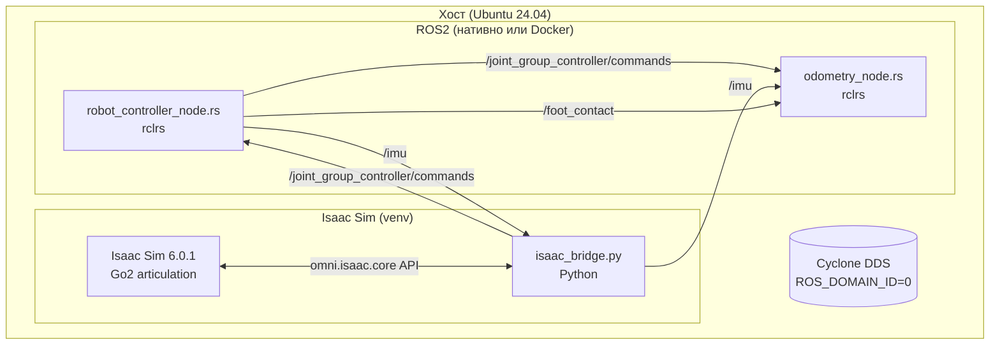

# Rust + Isaac Sim: интеграция контроллера

## Quadruped Robot Simulator — WalkingRobotSim (НИР, ВКРМ)

### Дата: 2026-07-18

### Ветка: feat/rust-migration

---

## Оглавление

1. [Executive Summary](#1-executive-summary)
2. [Текущее состояние Rust-контроллера](#2-текущее-состояние-rust-контроллера)
3. [Принцип интеграции: rclrs + Isaac Sim bridge](#3-принцип-интеграции-rclrs--isaac-sim-bridge)
4. [Сопоставление топиков](#4-сопоставление-топиков)
5. [Схема подключения](#5-схема-подключения)
6. [Чек-лист интеграции](#6-чек-лист-интеграции)
7. [Порядок запуска](#7-порядок-запуска)
8. [Риски](#8-риски)
9. [Приложение A: isaac_bridge.py (шаблон)](#9-приложение-a-isaac_bridgepy-шаблон)

---

## 1. Executive Summary

Rust-контроллер (`quadropted_controller_rust`) написан на **rclrs** — нативном ROS2 Rust client. Он общается через стандартные DDS-топики ROS2, поэтому **не зависит от симулятора**. Для интеграции с Isaac Sim не требуется переписывать Rust-код — нужен только Python-мост `isaac_bridge.py`, который:

1. **Подписывается** на `joint_group_controller/commands` (публикует Rust-контроллер)
2. **Применяет** 12 значений к articulation Go2 в Isaac Sim
3. **Публикует** `joint_states` и `imu` обратно в ROS2

Это проще, чем C++-интеграция, потому что rclrs уже работает «из коробки» с любым RMW (Cyclone DDS), и Rust-ноды не требуют Gazebo-плагинов.

---

## 2. Текущее состояние Rust-контроллера

### 2.1 Структура workspace

```
src/quadropted_controller_rust/
├── Cargo.toml                    # workspace: quadropted-core + quadropted-nodes
├── CMakeLists.txt                # colcon-обёртка: cargo build --release
├── package.xml                   # ROS2-пакет
├── launch/launch_rust.launch.py  # делегирует в gazebo_sim launch
│
├── quadropted-core/              # Библиотека без ROS-зависимостей
│   ├── src/
│   │   ├── controllers/          # trot, crawl, stand, rest, gait, pid
│   │   ├── kinematics/           # FK/IK (nalgebra)
│   │   ├── odometry/             # leg odometry
│   │   ├── state/                # SharedState
│   │   └── math/                 # утилиты
│   └── tests/                    # юнит-тесты
│
└── quadropted-nodes/             # ROS2-ноды (rclrs)
    ├── build.rs                  # линковка ROS2 C-lib
    └── src/bin/
        ├── robot_controller_node.rs   # 379 строк, основной контроллер
        └── odometry_node.rs           # 274 строки, leg odometry + tf
```

### 2.2 Зависимости

| Пакет | Версия | Назначение |
|-------|--------|-----------|
| `rclrs` | 0.7 | ROS2 Rust client |
| `rosidl_runtime_rs` | 0.6 | runtime для типов |
| `nalgebra` | 0.33 | линейная алгебра (FK/IK) |
| `quadropted-core` | path | локальная библиотека |
| `*_msgs_rs` | path | сгенерированные сообщения |

### 2.3 rclrs установлен

```bash
# rclrs доступен в install/ (собрано colcon'ом)
ls install/rclrs/share/rclrs/

# Rust toolchain
cargo 1.93.1
rustc 1.93.1
```

---

## 3. Принцип интеграции: rclrs + Isaac Sim bridge

### 3.1 Почему не нужен порт на Python

**C++-контроллер** работал через Gazebo ros2_control plugin — это привязывало его к Gazebo API.

**Rust-контроллер** использует чистые ROS2-топики:

```
robot_controller_node.rs:
  Публикует:    joint_group_controller/commands   (Float64MultiArray, 12 значений)
                foot_contact                      (RobotFootContact)
  Подписывается: robot_mode, robot_velocity, imu

odometry_node.rs:
  Публикует:    odom, tf, stall_status, foot_markers
  Подписывается: joint_group_controller/commands, foot_contact, imu, robot_velocity
```

Эти топики не знают, кто их производит/потребляет — Gazebo или Isaac Sim. DDS-шина абстрагирует симулятор.

### 3.2 Единственное отличие: обратная связь по суставам

| Симулятор | Кто публикует `joint_states` | Кто потребляет `commands` |
|-----------|------------------------------|---------------------------|
| Gazebo | ros2_control plugin | Rust-контроллер (не подписан!) |
| Isaac Sim | **isaac_bridge.py** (новый) | **isaac_bridge.py** (новый) |

Внимание: Rust `robot_controller_node.rs` **не подписывается на `joint_states`** — он использует `imu` и внутреннее состояние для обратной связи. `odometry_node.rs` подписывается на `joint_group_controller/commands` (команды), а не на фактические положения. Поэтому Isaac bridge должен:

1. Читать `joint_group_controller/commands` → применять к articulation
2. Публиковать `imu` (Isaac Sim может дать quaternion) — нужно для roll/pitch в контроллере
3. Публиковать `foot_contact` (или робот не будет знать о контакте лап с землёй)

---

## 4. Сопоставление топиков

```yaml
# Rust-нода → Isaac Sim
Rust controller:
  /joint_group_controller/commands   → isaac_bridge.py (применяет к articulation)
  /foot_contact                      → isaac_bridge.py (для odometry_node)

# Isaac Sim → Rust-нода
isaac_bridge.py:
  /imu            → robot_controller_node.rs, odometry_node.rs
  /joint_states   → odometry_node.rs (опционально, для проверки фактических углов)

# Управление
/robot_mode       → robot_controller_node.rs (TROT/CRAWL/STAND/REST)
/robot_velocity   → robot_controller_node.rs, odometry_node.rs
```

---

## 5. Схема подключения



---

## 6. Чек-лист интеграции

### 6.1 Проверка Rust-контроллера

- [ ] `cargo build --release` в `src/quadropted_controller_rust/` — компилируется
- [ ] `source install/setup.bash` — rclrs доступен
- [ ] `ros2 run quadropted_controller_rust robot_controller_node` — стартует
- [ ] `ros2 topic list` показывает `joint_group_controller/commands`

### 6.2 Проверка Isaac Sim

- [ ] Isaac Sim запускается: `source ~/isaacsim-venv/bin/activate && python3.12 -m isaacsim --accept license`
- [ ] Go2 загружен как articulation
- [ ] ROS2 bridge видит топики (из venv: `ros2 topic list`)

### 6.3 Создание isaac_bridge.py

- [ ] Подписан на `joint_group_controller/commands`
- [ ] Применяет 12 значений к articulation (через `apply_action`)
- [ ] Публикует `imu` (считая из Isaac Sim)
- [ ] Публикует `foot_contact` (по raycast или контакту лап)
- [ ] Публикует `joint_states` (для RViz/SLAM)

### 6.4 Запуск всего стека

- [ ] Isaac Sim + bridge работает
- [ ] Rust-контроллер получает `robot_mode`/`robot_velocity`
- [ ] Go2 в Isaac Sim ходит по командам (WASD или Nav2)
- [ ] elevation_mapping строит DEM из pointcloud Isaac Sim
- [ ] Nav2 планирует маршрут с учётом рельефа

---

## 7. Порядок запуска

```bash
# Терминал 1: Isaac Sim + bridge
source ~/isaacsim-venv/bin/activate
python3.12 -m isaacsim --accept license &   # или через наш launch_sim.py
python3 src/isaac/isaac_bridge.py            # мост

# Терминал 2: ROS2 окружение
source /opt/ros/jazzy/setup.bash
source ~/GitHub/WalkingRobotSim/install/setup.bash

# Терминал 2: Rust-контроллер
ros2 run quadropted_controller_rust robot_controller_node

# Терминал 2: odometry
ros2 run quadropted_controller_rust odometry_node

# Терминал 3: управление
ros2 topic pub /robot_mode quadropted_msgs/msg/RobotModeCommand \
  "{robot_id: 1, mode: 'TROT'}" --once
ros2 topic pub /robot_velocity quadropted_msgs/msg/RobotVelocity \
  "{robot_id: 1, cmd_vel: {linear: {x: 0.3, y: 0.0, z: 0.0}, angular: {x: 0.0, y: 0.0, z: 0.0}}}" --rate 10

# Проверка движения
ros2 topic echo /joint_group_controller/commands
```

---

## 8. Риски

| Риск | Влияние | Митигация |
|------|---------|-----------|
| **Rust не подписан на joint_states** — нет обратной связи по фактическим углам | Контроллер использует модель вместо фактического состояния — может «уезжать» | Проверить, что Isaac Sim применяет команды быстро (синхронно с control loop) |
| **Foot contact не определён** | odometry_node не знает, когда лапа на земле | Реализовать raycast из articulation к terrain |
| **imu из Isaac Sim** — формат может отличаться | roll/pitch в контроллере будут неверными | Сверить quaternion Isaac Sim с C++-интеграцией (сделать тестовую публикацию) |
| **rclrs + Isaac Sim Python bridge** — разные RMW | Топики не видны между процессами | Убедиться, что оба используют Cyclone DDS + один ROS_DOMAIN_ID |
| **Isaac Sim использует Python 3.12, rclrs — системный Python 3.12** | Ок (оба 3.12), но проверить | `python3.12 --version` в обоих местах |

---

## 9. Приложение A: isaac_bridge.py (шаблон)

```python
#!/usr/bin/env python3
"""
isaac_bridge.py — мост между Rust-контроллером (rclrs) и Isaac Sim.

Подписывается на /joint_group_controller/commands (Float64MultiArray, 12)
и применяет к articulation Go2. Публикует /imu и /foot_contact.

Запуск из venv Isaac Sim:
    source ~/isaacsim-venv/bin/activate
    python3 src/isaac/isaac_bridge.py
"""

import numpy as np
import rclpy
from rclpy.node import Node
from std_msgs.msg import Float64MultiArray
from sensor_msgs.msg import Imu
from rclpy.qos import QoSProfile, ReliabilityPolicy, HistoryPolicy

# Isaac Sim core (доступен в venv)
from omni.isaac.core import World
from omni.isaac.core.articulations import ArticulationView


class IsaacBridge(Node):
    """Мост Rust-контроллер ↔ Isaac Sim."""

    def __init__(self, articulation_name: str = "go2"):
        super().__init__("isaac_bridge")

        # QoS: как в C++ (BEST_EFFORT, depth 10)
        qos = QoSProfile(
            reliability=ReliabilityPolicy.BEST_EFFORT,
            history=HistoryPolicy.KEEP_LAST,
            depth=10,
        )

        # Подписка на команды от Rust-контроллера (12 углов)
        self.cmd_sub = self.create_subscription(
            Float64MultiArray,
            "joint_group_controller/commands",
            self.on_joint_command,
            qos,
        )
        self.get_logger().info("Subscribed: joint_group_controller/commands")

        # Публикация imu для Rust-контроллера
        self.imu_pub = self.create_publisher(Imu, "imu", qos)
        self.get_logger().info("Publisher: imu")

        self.joint_names = [
            "FL_hip", "FL_thigh", "FL_calf",
            "FR_hip", "FR_thigh", "FR_calf",
            "RL_hip", "RL_thigh", "RL_calf",
            "RR_hip", "RR_thigh", "RR_calf",
        ]

    def on_joint_command(self, msg: Float64MultiArray):
        """Применяет 12 значений к articulation Isaac Sim."""
        if len(msg.data) != 12:
            self.get_logger().warn(f"Expected 12 joints, got {len(msg.data)}")
            return
        # TODO: применить к articulation через omni.isaac.core
        # self.articulation.set_joint_position_targets(np.array(msg.data))

    def publish_imu(self, quaternion, angular_velocity, linear_acceleration):
        """Публикует IMU-данные для Rust-контроллера."""
        imu = Imu()
        imu.header.frame_id = "imu"
        imu.orientation.x = quaternion[0]
        imu.orientation.y = quaternion[1]
        imu.orientation.z = quaternion[2]
        imu.orientation.w = quaternion[3]
        imu.angular_velocity.x = angular_velocity[0]
        imu.angular_velocity.y = angular_velocity[1]
        imu.angular_velocity.z = angular_velocity[2]
        imu.linear_acceleration.x = linear_acceleration[0]
        imu.linear_acceleration.y = linear_acceleration[1]
        imu.linear_acceleration.z = linear_acceleration[2]
        self.imu_pub.publish(imu)


def main():
    rclpy.init()
    bridge = IsaacBridge()
    rclpy.spin(bridge)
    bridge.destroy_node()
    rclpy.shutdown()


if __name__ == "__main__":
    main()
```

---

## Заключение

Интеграция Rust-контроллера с Isaac Sim **не требует переписывания Rust-кода**. rclrs работает поверх стандартного DDS, поэтому достаточно Python-моста `isaac_bridge.py` (~100 строк), который:

1. Применяет команды Rust-контроллера к articulation Go2
2. Публикует `imu` и `foot_contact` обратно

Это **проще**, чем C++-интеграция (которая зависела от Gazebo ros2_control), и полностью сохраняет terrain-aware стек (elevation mapping, Nav2), работающий поверх ROS2-топиков.
