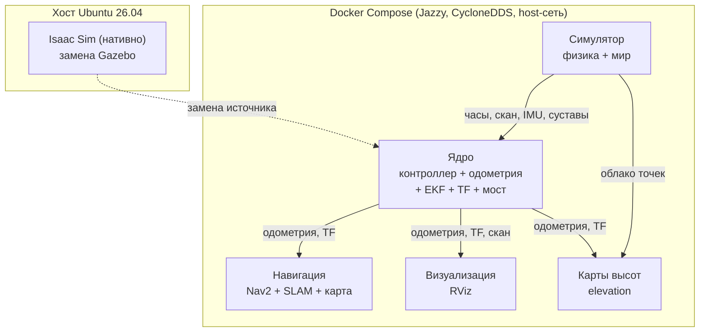
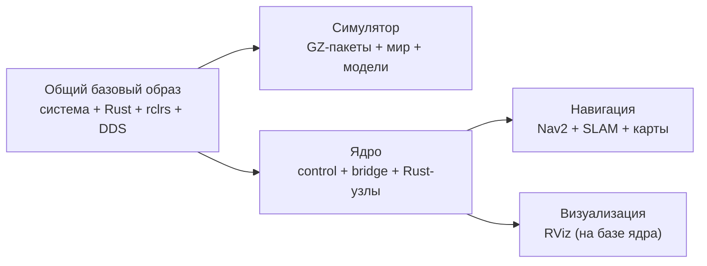
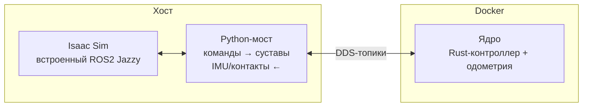

# План декомпозиции Docker: монолит → микросервисы (v2)

## WalkingRobotSim — Multi-Container Architecture

### Дата: 2026-08-22

### Ветка: feat/isaam-research

---

## Оглавление

1. [Резюме](#1-резюме)
2. [Текущее состояние: что есть сейчас](#2-текущее-состояние-что-есть-сейчас)
3. [Гипотеза проблемы](#3-гипотеза-проблемы)
4. [Почему прошлый план устарел](#4-почему-прошлый-план-устарел)
5. [Целевая архитектура](#5-целевая-архитектура)
6. [Сервисы и их ответственность](#6-сервисы-и-их-ответственность)
7. [Метод: разделение сборки по пакетам](#7-метод-разделение-сборки-по-пакетам)
8. [Метод: изоляция образами](#8-метод-изоляция-образами)
9. [Метод: запуск и оркестрация](#9-метод-запуск-и-оркестрация)
10. [Коммуникация между контейнерами](#10-коммуникация-между-контейнерами)
11. [Совместимость с Isaac Sim](#11-совместимость-с-isaac-sim)
12. [Порядок внедрения](#12-порядок-внедрения)
13. [Ожидаемый эффект](#13-ожидаемый-эффект)
14. [Риски и митигации](#14-риски-и-митигации)
15. [Связанные отчёты](#15-связанные-отчёты)

---

## 1. Резюме

Проект использует **один монолитный Docker-образ** `walking_robot_sim`, внутри которого живут все компоненты: физический симулятор, мост к ROS2, gait-контроллер, одометрия, фильтр оценок позы, стек навигации, визуализация и инструменты. Сборка этого образа занимает **15–20 минут**, и **любое изменение** — контроллера, мира, параметров навигации — запускает полную пересборку.

Предлагается разделить монолит на **пять независимых контейнеров** по принципу «одна ответственность — один образ»:

| Сервис | Роль |
|---|---|
| Симулятор | Только физика и мир (сейчас Gazebo, позже — Isaac Sim нативно) |
| Ядро управления | Rust-контроллер, одометрия, EKF, TF, мост к симулятору |
| Навигация | Планировщик, SLAM, карты |
| Визуализация | RViz |
| Карты высот | Elevation mapping (уже существует как отдельный сервис) |

Изменение любого компонента теперь требует пересборки **только своего образа** (1–3 минуты), а не всего проекта.

**Принципиальные решения:**
- Rust-контроллер — это **ядро**, выносится в собственный образ
- Визуализация — отдельный образ, не тянет GUI-зависимости в ядро
- Elevation mapping — остаётся контейнером (уже работает так)
- Isaac Sim — запускается **нативно на хосте**, не в Docker (тяжёлый: ~24 ГБ, GUI, GPU, лицензия)

---

## 2. Текущее состояние: что есть сейчас

### 2.1 Как система запущена фактически (проверено 2026-08-22)

| Компонент | Где работает сейчас | Комментарий |
|---|---|---|
| Gazebo + контроллер + одометрия + EKF + Nav2 | Контейнер `walking_robot_sim` | Единый монолит |
| Elevation mapping + costmap | Контейнер `elevation_mapping` | Уже отдельный сервис |
| Нативный ROS-стек (Lyrical) | Не запущен | 0 процессов |
| Нативные бинарники Rust | Собраны, но не запущены | Используются для тестов |

Примечание: ранее ошибочно считалось, что elevation работает нативно. Фактическая проверка (по пространствам имён процессов и inspect контейнера) показала — это **контейнерный** процесс.

### 2.2 Из чего состоит монолит

Монолитный образ собирается многоэтапно: базовые системные пакеты → ROS-пакеты управления → пакеты симуляции → навигации → vision → инструменты → установка зависимостей → сборка всего рабочего пространства. Каждый этап добавляет тяжёлые зависимости (PyTorch, YOLO, инструменты отладки), даже если они не нужны в текущем сценарии.

Rust-путь запуска (основной) использует: симулятор, мост GZ↔ROS, publisher TF, spawner контроллеров ros2_control, Rust-узел контроллера, Rust-узел одометрии, вспомогательный узел команд движения, EKF, сервер карты и менеджер жизненного цикла Nav2.

**Ключевая находка:** YOLO/vision **не задействованы** в Rust-пути запуска — их зависимость в монолите бесполезна для основного сценария и лишь удлиняет сборку.

---

## 3. Гипотеза проблемы

**Проблема не в производительности** (контейнер работает), а в **цикле разработки**: время пересборки 15–20 минут на каждое изменение тормозит итеративную разработку контроллера, навигации и мира.

Гипотеза: если разделить систему на независимые образы, где каждый собирает только свои пакеты, то:

1. **Время пересборки упадёт до 1–3 минут** для изменяемого компонента
2. **Перезапуск станет выборочным** — падение симулятора не перезапустит контроллер
3. **GPU выделяется только там, где нужен** — симулятору, а не всему стеку
4. **Источник данных станет заменяемым** — Gazebo ↔ Isaac Sim меняются без пересборки остальных сервисов

---

## 4. Почему прошлый план устарел

Предыдущий план (июль 2026) был написан до перехода на Rust и планировал разбиение, включая YOLO и Docker-версию Isaac Sim. С тех пор:

| Аспект | Было (июль) | Стало (август) |
|---|---|---|
| Контроллер | C++, привязан к Gazebo-плагинам | **Rust (rclrs)**, общается через чистые DDS-топики |
| Elevation | Только Docker | Docker + нативные тесты под Lyrical |
| Rust-контроллер | — | Ядро в контейнере |
| Isaac Sim | Планировался в Docker | **Нативно** (тяжёлый, GUI, лицензия) |

**Главное расхождение с прошлым планом:** замена «gazebo-sim → isaac-sim» через Docker нереалистична — Isaac Sim нельзя просто поместить в контейнер. Однако сама идея микросервисов остаётся верной: меняется только источник данных, остальные сервисы не трогаются.

---

## 5. Целевая архитектура

### Принцип

Ядро, навигация, визуализация и карты высот **не знают**, кто производит данные — Gazebo или Isaac Sim. Они видят только стандартные DDS-топики. Заменяемым элементом является только «Симулятор».

---

## 6. Сервисы и их ответственность

### 6.1 Симулятор (gazebo-sim)
- **Что делает:** запускает физический мир, модели, окружение; публикует часы, лазерный скан, IMU, состояния суставов.
- **Что не содержит:** никакого «интеллекта» — ни контроллера, ни навигации, ни Python-скриптов.
- **Проверка готовности:** наличие топика `/clock`.
- **Альтернатива:** тот же контейнер может быть заменён нативно запущенным Isaac Sim.

### 6.2 Ядро управления (wrs-core)
- **Что делает:** мост GZ↔ROS, Rust-контроллер (TROT/CRAWL/STAND), Rust-одометрия, EKF, publisher TF, spawner ros2_control, узел команд движения.
- **Почему отдельно:** это самое часто меняемое звено — разработка контроллера требует мгновенной пересборки.
- **Проверка готовности:** наличие узла контроллера в списке узлов.

### 6.3 Навигация (wrs-nav2)
- **Что делает:** планировщик, контроллер следования, SLAM, сервер карты, менеджер жизненного цикла Nav2.
- **Проверка готовности:** наличие узла planner_server.

### 6.4 Визуализация (wrs-rviz)
- **Что делает:** RViz с конфигом проекта.
- **Отдельный образ** — чтобы GUI-зависимости не попадали в ядро и визуализацию можно было включать/выключать независимо.

### 6.5 Карты высот (elevation_mapping)
- **Без изменений** — уже существует как отдельный контейнер с GPU.

### Исключено сейчас
YOLO/детекция — отложена (не используется в основном Rust-пути). В будущем — отдельный профиль.

---

## 7. Метод: разделение сборки по пакетам

Вместо сборки всего рабочего пространства каждый образ собирает **только свой набор пакетов** из `src/`.

**Подход:**
1. Выделяется **общий базовый слой** (системные инструменты, компилятор Rust, rclrs, CycloneDDS) — собирается один раз и переиспользуется всеми образами через многоэтапную сборку.
2. Каждый сервис-образ копирует **только необходимые ROS-пакеты** и запускает сборку с фильтром по списку пакетов.
3. Зависимые пакеты (`quadropted_msgs`, общие утилиты, Rust-описания сообщений) попадают в несколько образов — это допустимо, т.к. слои базового образа кэшируются.

**Карта пакетов по сервисам:**
- **Ядро:** Rust-контроллер, кастомные сообщения, launch/конфиги симуляции, описание робота, C++-утилита команд, общие утилиты, все Rust-описания сообщений.
- **Симулятор:** миры, модели, медиа, описания роботов (для спавна).
- **Навигация:** конфиги и карты симуляции, кастомные сообщения, общие утилиты.
- **Визуализация:** конфиги RViz (монтируются, не требуют сборки).

---

## 8. Метод: изоляция образами

**Общий базовый образ** выносится отдельным Dockerfile-этапом и содержит то, что нужно всем сервисам: набор системных инструментов сборки, компилятор Rust, клиент rclrs, реализацию CycloneDDS, инструменты ROS. Каждый сервис наследует этот слой и добавляет своё:

Иллюстрация показывает: базовый слой кэшируется один раз; ядро собирается из базы; навигация и визуализация наследуют ядро/базу. Это минимизирует суммарное время сборки и размер за счёт переиспользования слоёв.

---

## 9. Метод: запуск и оркестрация

Оркестрация через Docker Compose с **профилями** — наборы сервисов для разных сценариев:

- **Минимальный:** ядро + навигация (когда симулятор уже запущен отдельно).
- **Полный:** симулятор + ядро + навигация + визуализация + карты высот.
- **Elevation:** только карты высот.

**Порядок старта (каскад):**
1. Сначала симулятор — он источник `/clock`, физики, сенсоров.
2. После готовности симулятора стартует ядро (ждёт healthcheck симулятора).
3. Затем навигация и визуализация (ждут запуска ядра).
4. Карты высот — параллельно.

**Перезапуск выборочный:** упал симулятор → перезапускается только он; контроллер и навигация продолжают жить (или корректно переподключаются после восстановления источника).

**Makefile:** набор целей «собрать всё», «собрать ядро», «собрать симулятор» и т.д., плюс цели «полный стек», «минимальный стек», «остановить всё».

---

## 10. Коммуникация между контейнерами

### 10.1 DDS

Все контейнеры используют **host-сеть** и реализацию **CycloneDDS**, привязанную к loopback-интерфейсу. При host-сети все процессы разделяют один loopback, поэтому топики видны прозрачно между контейнерами — **никаких изменений в DDS-конфигурации не требуется**.

### 10.2 Время симуляции

Часы `/clock` публикует симулятор. Все остальные сервисы запускаются с использованием времени симуляции. Зависимость «ядро ждёт готовности симулятора» (healthcheck по `/clock`) гарантирует, что часы уже идут до старта остальных.

### 10.3 Общие данные

Общие файлы (конфигурация DDS, конфиги RViz, логи) пробрасываются в контейнеры как read-only-тома. Это позволяет менять конфиги **без пересборки образов**.

---

## 11. Совместимость с Isaac Sim

Isaac Sim запускается **нативно на хосте**, вне Docker.

### Почему нативно
~24 ГБ окружение, GUI, GPU через OCuLink, лицензионное соглашение, стек Vulkan/RTX — всё это плохо ложится на контейнеризацию.

### Ключевые находки (проверено)
1. Isaac Sim 6.0.1.0 установлен в `~/isaacsim-venv` (24 ГБ).
2. Isaac Sim поставляется **со встроенным ROS2 Jazzy** (rclpy для Python 3.12) — полный набор библиотек и сообщений внутри venv.
3. Встроенный rclpy **импортируется и работает** — проверено загрузкой базовых сообщений.
4. В обоих окружениях (Lyrical на хосте и встроенный Jazzy в Isaac Sim) есть **CycloneDDS** — DDS-связка совместима.

### Как стыкуется
Между Isaac Sim и ядром работает **Python-мост**, который:
- подписан на топик команд суставов (12 углов) от Rust-контроллера;
- применяет эти углы к роботу-четвероногу в Isaac Sim;
- публикует обратно IMU, состояние контактов лап, состояния суставов.

Ядро, навигация, визуализация и карты высот при этом **не меняются** — меняется только «Симулятор» (Gazebo → Isaac Sim).

---

## 12. Порядок внедрения

| Этап | Действие | Критерий готовности |
|---|---|---|
| 1 | Собрать общий базовый образ | Образ собирается |
| 2 | Выделить ядро + разделить launch-файлы | В списке узлов виден контроллер |
| 3 | Выделить симулятор | Появляется топик `/clock` |
| 4 | Выделить навигацию | Виден planner_server |
| 5 | Визуализация + compose + Makefile | Полный стек поднимается одной командой |
| 6 | Прогон интеграционных тестов | Все проверки зелёные |
| 7 | Подключить Isaac Sim нативно | Робот ходит в Isaac Sim |

---

## 13. Ожидаемый эффект

| Сценарий | Монолит | Микросервисы |
|---|---|---|
| Изменение Rust-контроллера | 15–20 мин | ~2–3 мин (только ядро) |
| Изменение мира/модели | 15–20 мин | ~1 мин (только симулятор) |
| Изменение параметров навигации | 15–20 мин | ~1 мин (только навигация) |
| Изменение карт высот | отдельно | без изменений |
| Падение симулятора | теряется всё | перезапускается только симулятор |
| GPU выделяется | всему стеку | только симулятору и картам высот |

---

## 14. Риски и митигации

| Риск | Вероятность | Влияние | Митигация |
|---|---|---|---|
| Рассинхронизация часов симуляции | Низкая | Высокое | use_sim_time + ожидание готовности симулятора |
| Таймауты DDS-discovery | Средняя | Среднее | Единый домен, loopback-интерфейс |
| Гонки при старте контейнеров | Средняя | Среднее | Каскад зависимостей + healthcheck |
| Совместимость версии rclrs в ядре | Низкая | Среднее | rclrs из crates.io, как в монолите |
| Рост суммарного размера образов | Высокая | Низкое | Общий базовый слой, кэш Docker |
| Рост потребления RAM | Средняя | Среднее | Профили, отключение ненужных сервисов |

### Ограничение Isaac Sim
- Не в Docker (тяжёлый, GUI, GPU, лицензия).
- Нативно + Python-мост в окружении Isaac Sim.
- Совместимость DDS: встроенный Jazzy (Python 3.12) ↔ Rust-контроллер (Jazzy) — оба CycloneDDS.

---

## 15. Связанные отчёты

- `reports/isaam/2026-07-18_docker-multi-container-plan.md` — предыдущая версия плана (устарела)
- `reports/isaam/2026-07-18_rust-isaac-integration.md` — интеграция Rust-контроллера с Isaac Sim
- `reports/isaam/2026-07-18_isaac-sim-install-and-launch.md` — установка Isaac Sim
- `reports/elevation-mapping/2026-08-22_debugging-report.md` — диагностика elevation
