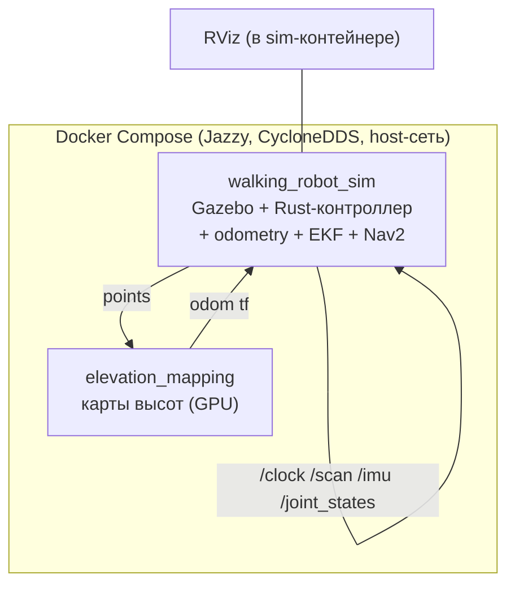

# Отчёт о развёртывании и эксплуатационных проблемах симуляции

**Дата:** 2026-08-22 (обновлено 2026-09-07)
**Ветка:** `feat/isaam-research`
**Версия:** 1.1

---

## Содержание

### Часть A. Развёртывание симуляции

1. [Введение](#a1-введение)
2. [Выбор решения (история)](#a2-выбор-решения-история)
3. [Ход работ](#a3-ход-работ)
4. [Проблемы и решения](#a4-проблемы-и-решения)
5. [Итоговая архитектура](#a5-итоговая-архитектура)
6. [Дальнейшие шаги](#a6-дальнейшие-шаги)
7. [Приложения](#a7-приложения)

### Часть B. Эксплуатационные проблемы

8. [Проблема: Сломанный контроллер после фикса плагина](#8-проблема-сломанный-контроллер-после-фикса-плагина)
9. [Проблема: Устаревший ros2 daemon ломает интеграционный тест](#9-проблема-устаревший-ros2-daemon-ломает-интеграционный-тест)
10. [Проблема: RViz не отображает модель робота (meshes не резолвятся)](#10-проблема-rviz-не-отображает-модель-робота-meshes-не-резолвятся)
11. [Проблема: SLAM-карта не сохраняется между запусками](#11-проблема-slam-карта-не-сохраняется-между-запусками)
12. [Проблема: Зомби-процессы и двойные симуляции](#12-проблема-зомби-процессы-и-двойные-симуляции)
13. [Проблема: DNS Docker не резолвит crates.io — падение сборки](#13-проблема-dns-docker-не-резолвит-cratesio-падение-сборки)
14. [Проблема: Gazebo GUI падает с Segmentation fault на NVIDIA GPU без драйвера](#14-проблема-gazebo-gui-падает-с-segmentation-fault-на-nvidia-gpu-без-драйвера)
15. [Проблема: EAGAIN при старте — нехватка памяти и потоков (6g/512)](#15-проблема-eagain-при-старте-нехватка-памяти-и-потоков-6g512)

---

## Часть A. Развёртывание симуляции

> **Связь с Частью B.** В ходе развёртывания встречались проблемы. Здесь (Часть A) они описаны кратко, а детальные разборы — в [Части B](#part-b): каждая проблема по цепочке «Симптом → Гипотезы → Причина → Диагностика → Решение → Результат». Нумерация проблем сквозная: 8–15.

### A.1. Введение

#### A.1.1. Предпосылки

Проект WalkingRobotSim моделирует четвероногого робота (Go2) в симуляции Gazebo с полным ROS2-стеком: Rust-контроллер походки, одометрия, EKF, Nav2/SLAM, elevation mapping. Симуляция разворачивается в Docker-контейнере на базе `osrf/ros:jazzy-desktop`, а карты высот — отдельным GPU-контейнером.

#### A.1.2. Цели

- Запустить робота в симуляции с Rust-контроллером (TROT/CRAWL/STAND)
- Подключить elevation mapping для построения карт высот
- Обеспечить визуализацию в RViz
- Сделать интеграционные тесты зелёными (42 проверки)

#### A.1.3. Оборудование

| Роль | Хост | GPU | OS | RAM |
|---|---|---|---|---|
| Симуляция (Docker) | Lenovo Lecoo N155A | RTX 5070 Ti (OCuLink eGPU) | Ubuntu 26.04 | 30 GB |
| Elevation (Docker) | тот же хост | RTX 5070 Ti | Ubuntu 26.04 | 30 GB |

### A.2. Выбор решения (история)

#### A.2.1. Рассмотренные варианты

| Вариант | Плюсы | Минусы | Вердикт |
|---|---|---|---|
| **Монолит** (текущий) | Один образ, просто деплой | 15-20 мин пересборка на любое изменение; падение симулятора = падение всего | Оставлен как исходная точка |
| **Микросервисы** (цель) | Пересборка 1-3 мин; изоляция сбоев; GPU только нужным | Больше образов, сложнее оркестрация | Выбран |
| **Нативный запуск** (без Docker) | Нет overhead Docker | Зависимости от версии ROS хоста; не воспроизводимо | Отклонён |

#### A.2.2. Хронология решений

1. **Изначально** — монолитный образ, всё внутри одного контейнера.
2. **Разбор проблемы** — каждый чих (изменение в контроллере/мире/навигации) запускает полную пересборку за 15-20 минут.
3. **Гипотеза** — разделение на независимые образы сократит цикл до 1-3 минут и изолирует сбои.
4. **Решение** — декомпозиция на микросервисы: симулятор + ядро + навигация + визуализация + карты высот. Подробный план — `reports/isaam/2026-08-22_docker-microservices-v2.md`.

### A.3. Ход работ

#### A.3.1. Сборка базового контейнера

**Действие:** многоэтапная сборка `walking_robot_sim` (системные зависимости → ROS-пакеты управления → симуляции → навигации → vision → tools → colcon build).

**Результат:** образ собран, контейнер запущен.

#### A.3.2. Сборка elevation-контейнера

**Действие:** сборка `elevation_mapping_cupy` на базе CUDA 12.8 (GPU).

**Ошибка:** первый запуск падал на компиляции float16-ядер cupy под CUDA 13.

**Причина:** несовместимость cupy 14.2 + CUDA 13 с типами float16.

**Решение:** перевод ядер на float/float32, исправление raw-массивов и 2D-индексации.

**Результат:** elevation работает, 473 теста проходят нативно (GPU).

#### A.3.3. Запуск симуляции

**Действие:** `make deploy` + `make gazebo` (Rust-путь через `gazebo_multi_nav2_rust.launch.py`).

**Ошибка:** контроллер не публиковал odom; в логе — `Tried to insert StateInterface with already existing key`.

**Причина:** дублирующий блок `ros2_control` в `leg.xacro` (подробно — Проблема 8 в Части B).

**Решение:** удалён дублирующий блок; оставлен единственный в `gazebo.xacro`.

**Результат:** odom публикуется 50 Гц.

#### A.3.4. Проверка

**Действие:** интеграционный тест `scripts/test_sim_integration.sh`.

**Ошибка:** 9 ложных FAIL при рабочей симуляции.

**Причина:** устаревший `ros2 daemon` (подробно — Проблема 9 в Части B).

**Решение:** `ros2 daemon stop` перед тестом.

**Результат:** тест 42 ✅ / 0 ❌ / 1 ⚠️.

#### A.3.5. Пересборка и запуск GUI (обновление 2026-09-07)

**Действие:** повторная сборка образа `make build` и запуск `make gazebo` после продолжительного перерыва в работе стенда.

**Ошибка 1 (сборка):** `cargo build` падает на этапе скачивания зависимостей — `transfer too slow`, сборка `std_msgs_rs` падает. Причина — недоступный DNS Docker (подробно — [Проблема 13](#13-проблема-dns-docker-не-резолвит-cratesio-падение-сборки) в Части B).

**Решение 1:** в `/etc/docker/daemon.json` DNS `8.8.8.8/1.1.1.1` заменены на рабочие DNS хоста (`195.19.32.2/195.19.33.199`), Docker перезапущен. Сборка успешна.

**Ошибка 2 (запуск):** симуляция стартует, робот создаётся, но через несколько секунд всё падает каскадом: gazebo GUI — Segmentation fault в OGRE, rviz2/контроллер — `Resource temporarily unavailable` (EAGAIN). Причины — проброс NVIDIA GPU без драйвера (подробно — [Проблема 14](#14-проблема-gazebo-gui-падает-с-segmentation-fault-на-nvidia-gpu-без-драйвера)) и низкие лимиты памяти/потоков (подробно — [Проблема 15](#15-проблема-eagain-при-старте-нехватка-памяти-и-потоков-6g512)).

**Решение 2:** `privileged` убран, в контейнер пробрасывается только встроенный AMD GPU; лимиты подняты до 12g/8192. Окно Gazebo GUI работает на AMD.

**Результат:** окно Gazebo GUI открывается, робот в TROT, RViz работает.

### A.4. Проблемы и решения

Полное описание каждой проблемы — в Части B (сквозная нумерация 8–15). Сводная таблица:

| № | Проблема | Причина | Решение | Статус |
|---|----------|---------|---------|:------:|
| [8](#8-проблема-сломанный-контроллер-после-фикса-плагина) | Контроллер не работает, odom не публикуется | Дубли ros2_control в leg.xacro | Удалён дублирующий блок | [x] |
| [9](#9-проблема-устаревший-ros2-daemon-ломает-интеграционный-тест) | 9 ложных FAIL в тесте | Устаревший ros2 daemon | `ros2 daemon stop` в тесте | [x] |
| [10](#10-проблема-rviz-не-отображает-модель-робота-meshes-не-резолвятся) | RViz не отображает робота | Неверный Description Topic + не резолвятся meshes | RViz-конфиги + mount + symlink | [x] |
| [11](#11-проблема-slam-карта-не-сохраняется-между-запусками) | SLAM-карта не сохраняется | Нет `/root/ws/maps` в volume | Volume `./data/gazebo/maps` | [x] |
| [12](#12-проблема-зомби-процессы-и-двойные-симуляции) | Зомби-процессы, двойные симуляции | Накопление при повторных запусках | pkill + docker restart | [x] |
| [13](#13-проблема-dns-docker-не-резолвит-cratesio-падение-сборки) | `make build` падает: cargo не скачивает crates.io | DNS Docker (8.8.8.8/1.1.1.1) недоступен из сети | Рабочие DNS хоста в daemon.json | [x] |
| [14](#14-проблема-gazebo-gui-падает-с-segmentation-fault-на-nvidia-gpu-без-драйвера) | Gazebo GUI: Segmentation fault, `driver (null)` | Контейнер видит NVIDIA без драйвера; Qt RHI выбирает его | Проброс только AMD GPU в контейнер | [x] |
| [15](#15-проблема-eagain-при-старте-нехватка-памяти-и-потоков-6g512) | EAGAIN: rviz2/контроллер не создают потоки | `mem_limit 6g`, `pids_limit 512` | 12g / 8192 в compose.yml | [x] |

### A.5. Итоговая архитектура



#### A.5.1. Компоненты

| Компонент | Контейнер | Статус |
|---|---|---|
| Gazebo Sim + физика | walking_robot_sim | ✅ |
| Rust-контроллер + odometry | walking_robot_sim | ✅ |
| EKF + Nav2 + SLAM | walking_robot_sim | ✅ |
| RViz | walking_robot_sim | ✅ |
| Elevation mapping (GPU) | elevation_mapping | ✅ |

#### A.5.2. Параметры

| Параметр | Значение |
|---|---|
| ROS_DISTRO | jazzy |
| RMW | rmw_cyclonedds_cpp |
| ROS_DOMAIN_ID | 0 |
| Сеть | host |
| use_sim_time | true |
| odom частота | 50 Гц |
| scan частота | ~8 Гц |
| joint commands | ~61 Гц |

#### A.5.3. Сравнение «было / стало»

| Метрика | Было (до фиксов) | Стало (после) |
|---|---|---|
| Интеграционный тест | 27 ✅ / 9 ❌ / 6 ⚠️ | 42 ✅ / 0 ❌ / 1 ⚠️ |
| odom | не публиковался | 50 Гц |
| Зомби-процессы | есть | 0 |
| SLAM-карта | не сохранялась | сохраняется |
| Сборка образа | падала (DNS) | успешна |
| Окно Gazebo GUI | Segmentation fault | работает на AMD |
| mem_limit / pids_limit | 6g / 512 | 12g / 8192 |

### A.6. Дальнейшие шаги

#### Краткосрочно

- [x] Починить контроллер (убрать дубли ros2_control)
- [x] Исправить RViz (Description Topic + meshes)
- [x] Сброс ros2 daemon перед тестом
- [x] Сохранение SLAM-карт через volume

#### Среднесрочно

- [ ] Декомпозиция монолита на микросервисы (план готов — `reports/isaam/2026-08-22_docker-microservices-v2.md`)
- [ ] Выделение wrs-core (ядро), wrs-nav2, wrs-rviz

#### Долгосрочно

- [ ] Подключение Isaac Sim нативно как замена Gazebo (мост через DDS-топики)
- [ ] YOLO/vision как отдельный сервис (профиль vision)

### A.7. Приложения

#### Приложение A. Команды администрирования

- Запуск симуляции: `make deploy` + `make gazebo`
- Интеграционный тест: `bash scripts/test_sim_integration.sh`
- Проверка частот: `ros2 topic hz /robot1/odom`
- Очистка процессов: `pkill -9 -f 'gz sim'` + `docker restart walking_robot_sim`

#### Приложение B. Полезные файлы

| Файл | Назначение |
|---|---|
| `src/docker/Dockerfile` | Сборка монолита |
| `src/go2_description/xacro/leg.xacro` | URDF ног (фикс ros2_control) |
| `src/gazebo_sim/rviz/nav2_default_view.rviz` | Конфиг RViz |
| `scripts/test_sim_integration.sh` | Интеграционный тест |
| `compose.yml` | Оркестрация контейнеров |

#### Приложение C. Отдельные сложные проблемы

См. Часть B — каждая проблема разобрана по цепочке «Симптом → Гипотезы → Причина → Диагностика → Решение → Результат».

---

<a id="part-b"></a>
## Часть B. Эксплуатационные проблемы

## Сводная таблица

| № | Проблема | Гипотезы | Причина | Решение | Методы | Сложность |
|---|----------|----------|---------|---------|--------|-----------|
| [8](#8-проблема-сломанный-контроллер-после-фикса-плагина) | Контроллер не работает, odom не публикуется | ✅ B: дубли интерфейсов; ❌ A,C: плагин/DDS | Дублирующий ros2_control блок в leg.xacro + битый плагин `gazebo_ros2_control/GazeboSystem` | Удалён дублирующий блок; исправлен плагин на `gz_ros2_control/GazeboSimSystem` в gazebo.xacro | `xacro` → `grep -c` ros2_control блоков; `ros2 topic hz /robot1/odom` | 🟡 |
| [9](#9-проблема-устаревший-ros2-daemon-ломает-интеграционный-тест) | 9 ложных FAIL в интеграционном тесте при рабочей симуляции | ✅ C: устаревший daemon; ❌ A,B: симуляция/CLI | Устаревший `ros2 daemon` кэширует endpoint-info в несовместимом формате → XMLRPC падает | `ros2 daemon stop` перед тестом | `ros2 topic echo --once` traceback → `ros2 daemon stop` | 🟢 |
| [10](#10-проблема-rviz-не-отображает-модель-робота-meshes-не-резолвятся) | RViz: модель робота не отображается, ошибки meshes | ✅ B,C: topic + резолв; ❌ A: копирование | Description Topic `/robot_description` вместо `/robot1/robot_description`; `package://go2_description` не резолвится | RViz-конфиги переведены на `/robot1/robot_description`; mount + symlink + AMENT_PREFIX_PATH | Правка .rviz; compose volumes | 🟢 |
| [11](#11-проблема-slam-карта-не-сохраняется-между-запусками) | SLAM-карта не сохраняется | ✅ B: нет каталога; ❌ A: битая карта | `/root/ws/maps` не существует и не в volume | Volume `./data/gazebo/maps:/root/ws/maps` + создан каталог | Правка compose.yml | 🟢 |
| [12](#12-проблема-зомби-процессы-и-двойные-симуляции) | Зомби-процессы и дублированные симуляции | ✅ B: повторный launch; ❌ C: утечка PID | Повторные запуски без очистки → 2 gz sim, 2 slam_toolbox, 2 ekf и т.д. | `pkill -9` + `docker restart` + один launch | `ps aux`; `docker restart` | 🟢 |
| [13](#13-проблема-dns-docker-не-резолвит-cratesio-падение-сборки) | `make build` падает: cargo не скачивает crates.io | ✅ A: DNS; ❌ B: код/сеть | `/etc/docker/daemon.json` жёстко задаёт DNS 8.8.8.8/1.1.1.1, недоступные из сети → `Could not resolve host` внутри BuildKit | Рабочие DNS хоста (195.19.32.2/195.19.33.199) в daemon.json + restart docker | `getent hosts` в/вне контейнера; curl crates.io | 🟢 |
| [14](#14-проблема-gazebo-gui-падает-с-segmentation-fault-на-nvidia-gpu-без-драйвера) | Gazebo GUI: Segmentation fault, `driver (null)` | ✅ A: NVIDIA без драйвера; ❌ B,C: software-рендер/pids | Qt RHI/OGRE выбирает NVIDIA RTX (есть в /dev/dri), но драйвера нет в образе → не может создать GLXContext | `privileged` убран; проброс только AMD GPU (card2/renderD129); GUI на radeonsi | Тест-контейнер только с AMD; gz sim GUI | 🔴 |
| [15](#15-проблема-eagain-при-старте-нехватка-памяти-и-потоков-6g512) | EAGAIN: rviz2/контроллер не создают потоки | ✅ A: память; ✅ B: pids; ❌ C: код | `mem_limit 6g`, `pids_limit 512` в compose.yml — Gazebo+Nav2+RViz при старте исчерпывают ресурсы → `pthread_create` EAGAIN | Лимиты 12g / 8192 (compose.yml + docker update) | cgroup pids/memory; ulimit | 🟡 |

---

## 8. Проблема: Сломанный контроллер после фикса плагина

### 8.1. Симптом

Симуляция запускается, но в логе Gazebo многократно повторяется:

```
ResourceStorage: Tried to insert StateInterface with already existing key
```

TF odom не публикуется, контроллер `robot_controller_rust` присутствует в списке узлов, но робот не движется и одометрия не считается.

### 8.2. Гипотезы

- ❌ **Гипотеза A:** сломан сам плагин `ros2_control` — не тот класс. **Опровергнута:** класс `gz_ros2_control/GazeboSimSystem` корректен; до фикса битый плагин `gazebo_ros2_control/GazeboSystem` вообще не загружался.
- ✅ **Гипотеза B:** конфликт интерфейсов из-за дублирования объявления joint. **Принята** — подтвердилась как причина в [N.3](#83-причина).
- ❌ **Гипотеза C:** проблема в QoS / DDS-связке между узлами. **Опровергнута:** DDS-связка проверена ранее и работала; узлы видны друг другу.

### 8.3. Причина

В файле `leg.xacro` каждый инстанс ноги (4 шт.) содержал **отдельный** блок `ros2_control name="${name}"` с плагином `gazebo_ros2_control/GazeboSystem`. Полный корректный блок с плагином `gz_ros2_control/GazeboSimSystem` и всеми 12 joint уже объявлен в `gazebo.xacro`.

До фикса дублирующие блоки были неактивны, т.к. плагин `gazebo_ros2_control/GazeboSystem` не существовал и не загружался — конфликта не было. После замены класса на корректный (`gz_ros2_control/GazeboSimSystem`) в leg.xacro оба блока стали активны одновременно → `ros2_control` пытался дважды зарегистрировать одни и те же state-интерфейсы joint.

### 8.4. Диагностика

Проверка количества объявлений `ros2_control`:

```
xacro robot.xacro robot_name:=robot1 | grep -c 'ros2_control name'
# → 5 (1 в gazebo.xacro + 4 в leg.xacro — дубли)
```

Проверка, что gazebo.xacro покрывает все 12 joint:

```
grep -c 'joint name' gazebo.xacro
# → 12
```

Проверка odom после исправления:

```
ros2 topic hz /robot1/odom
# → average rate: 50.003 Hz
```

### 8.5. Решение

Из `leg.xacro` удалён дублирующий блок `ros2_control` (строки с плагином и 3 joint на ногу). Оставлен единственный полный блок в `gazebo.xacro`.

### 8.6. Исправление в скриптах/конфигах

- `src/go2_description/xacro/leg.xacro` — удалён блок ros2_control; добавлен комментарий-пояснение, что все 12 joint объявлены в gazebo.xacro.
- `src/go2_description/xacro/gazebo.xacro` — оставлен единственный корректный блок (изменений не потребовал, он уже был правильным).

### 8.7. Результат

| Метрика | До | После |
|---------|----|-------|
| `ros2_control` блоков в xacro | 5 | 1 |
| `Tried to insert StateInterface` | повторяется в логе | отсутствует |
| `/robot1/odom` | не публикуется | 50 Гц |

**Связь с развёртыванием (Часть A):** проблема встречена на этапе [A.3.3 «Запуск симуляции»](#a33-запуск-симуляции).

---

## 9. Проблема: Устаревший ros2 daemon ломает интеграционный тест

### 9.1. Симптом

Интеграционный тест `scripts/test_sim_integration.sh` при полностью рабочей симуляции показывает **9 FAIL / 6 WARN**. При этом:

- `ros2 topic hz` работает (50 Гц);
- топики публикуются, подписки существуют;
- `ros2 topic echo --once` падает с traceback.

Трассировка:

```
xmlrpc.client.ResponseError: ResponseError("unknown tag 'rclpy.endpoint_info.TopicEndpointInfo'")
```

в `choose_qos()` → `get_publishers_info_by_topic()`.

### 9.2. Гипотезы

- ❌ **Гипотеза A:** сломана сама симуляция (узлы не поднялись). **Опровергнута:** `ros2 topic hz` показывал стабильные частоты, `node list` давал 40+ узлов, foot_contact публиковался.
- ❌ **Гипотеза B:** поломан CLI `ros2 topic echo` (код ros2cli). **Опровергнута:** после сброса daemon echo заработал без изменений CLI.
- ✅ **Гипотеза C:** устаревший фоновый daemon-процесс с несовместимым форматом данных. **Принята** — подтвердилась как причина в [N.3](#93-причина).

### 9.3. Причина

`ros2 daemon` — фоновый discovery-процесс CLI — был запущен давно и кэшировал endpoint-info в формате, несовместимом с текущей версией rclpy. Команды, требующие QoS-интроспекции (`topic echo`, `topic info -v`, `param get`), обращались к daemon по XMLRPC и падали на сериализации типа `TopicEndpointInfo`. Команды, не использующие интроспекцию (`hz`, `node list`), работали.

### 9.4. Диагностика

Проверка, что echo падает, а hz — работает:

```
ros2 topic hz /robot1/odom        # → average rate: 50.004
ros2 topic echo /robot1/odom --once  # → ResponseError unknown tag 'TopicEndpointInfo'
```

После ручного сброса:

```
ros2 daemon stop
ros2 topic echo /robot1/odom --once  # → работает, stamp sec=405
```

### 9.5. Решение

Перезапуск daemon: `ros2 daemon stop` — процесс перезапускается автоматически при следующем вызове CLI.

### 9.6. Исправление в скриптах/конфигах

В `scripts/test_sim_integration.sh` перед проверками выполняется `ros2 daemon stop` один раз (не в каждом `run()` — чтобы не тормозить тест).

### 9.7. Результат

| Метрика | До | После |
|---------|----|-------|
| FAIL в тесте | 9 | 0 |
| WARN | 6 | 1 (карта не расширилась — индикатор) |
| Итог теста | 27 ✅ / 9 ❌ / 6 ⚠️ | 42 ✅ / 0 ❌ / 1 ⚠️ |

**Связь с развёртыванием (Часть A):** проблема встречена на этапе [A.3.4 «Проверка»](#a34-проверка).

---

## 10. Проблема: RViz не отображает модель робота (meshes не резолвятся)

### 10.1. Симптом

В RViz-контейнере при старте ошибки:

```
Could not load resource file:///root/ws/install/go2_description/meshes/hip.dae
rviz/glsl120/indexed_8bit_image.vert
```

Модель робота в окне RViz отсутствует.

### 10.2. Гипотезы

- ❌ **Гипотеза A:** meshes не скопированы в контейнер. **Частично опровергнута:** пакеты монтировались в elevation-контейнер, но RViz резолвил пути по `/root/ws/install/...` — как их формирует контейнер `walking_robot_sim` (вопрос не в наличии пакета, а в пути).
- ✅ **Гипотеза B:** неверный Description Topic в RViz-конфиге. **Принята** — подтвердилась (причина 1 в [N.3](#103-причина)).
- ✅ **Гипотеза C:** RViz не может резолвить `package://go2_description` по путям из чужого контейнера. **Принята** — подтвердилась (причина 2 в [N.3](#103-причина)).

### 10.3. Причина

Две независимые причины:

1. **Description Topic** в конфигах RViz был `/robot_description` без namespace — подписка на несуществующий топик (правильный — `/robot1/robot_description`).
2. **Резолв `package://go2_description`**: RViz в elevation-контейнере искал меши по `/root/ws/install/go2_description/...` (путь, зашитый в robot_description от контейнера walking_robot_sim), но elevation-контейнер не имел доступа к `/root/ws`.

### 10.4. Диагностика

- Проверка топика robot_description в контейнере: публикуется под `/robot1/robot_description`.
- Проверка наличия `package://go2_description` в рабочем пространстве elevation-контейнера: путь `/root/ws/install/go2_description` отсутствовал.

### 10.5. Решение

1. Конфиги RViz (`nav2_default_view.rviz`, `rviz_ns.rviz`): Description Topic изменён с `/robot_description` на `/robot1/robot_description`.
2. В compose.yml для elevation-сервиса:
   - добавлен `AMENT_PREFIX_PATH` с `go2_description` и `go1_description`;
   - монтированы `src/go2_description` и `src/go1_description` в `/ws/install/...`;
   - в команде контейнера созданы symlink `/root/ws/install/go2_description` и `/root/ws/install/go1_description` → `/ws/install/...` (с `chmod o+x` на промежуточные каталоги).

### 10.6. Исправление в скриптах/конфигах

- `src/gazebo_sim/rviz/nav2_default_view.rviz` — topic `/robot1/robot_description`.
- `src/gazebo_sim/rviz/rviz_ns.rviz` — topic `/robot1/robot_description`.
- `compose.yml` — `x-el-env` (AMENT_PREFIX_PATH), `x-el-volumes` (mounts), `x-el-command` (symlink).

### 10.7. Результат

| Метрика | До | После |
|---------|----|-------|
| Ошибки резолва meshes | есть при старте | отсутствуют |
| Модель робота в RViz | отсутствует | отображается |
| GLSL-ошибки | однократно при старте | не влияют (не повторяются) |

**Связь с развёртыванием (Часть A):** выявлено при настройке визуализации после запуска (этап [A.3.3 «Запуск симуляции»](#a33-запуск-симуляции)).

---

## 11. Проблема: SLAM-карта не сохраняется между запусками

### 11.1. Симптом

В логе slam_toolbox при старте:

```
slam_toolbox: Failed to open requested file: /root/ws/maps/rust_slam_map
slam_toolbox: DeserializePoseGraph: Failed to read file: /root/ws/maps/rust_slam_map
```

Lifecycle-менеджер SLAM не мог подняться (bond-таймаут).

### 11.2. Гипотезы

- ❌ **Гипотеза A:** битая карта (повреждён файл). **Опровергнута:** файла карты не было вовсе — существовал лишь отсутствующий каталог, повреждения не было.
- ✅ **Гипотеза B:** каталог `/root/ws/maps` не существует и не доступен. **Принята** — подтвердилась как причина в [N.3](#113-причина).

### 11.3. Причина

Каталог `/root/ws/maps` не существовал в контейнере и не был включён в volumes compose — slam_toolbox не мог ни загрузить, ни сохранить карту. (Файла карты не было вовсе — это был не повреждённый файл, а отсутствующий каталог.)

### 11.4. Диагностика

```
docker exec walking_robot_sim ls /root/ws/maps/
# → ls: cannot access '/root/ws/maps/': No such file or directory
```

### 11.5. Решение

В compose.yml для сервиса simulator добавлен volume:

```
./data/gazebo/maps:/root/ws/maps
```

Каталог `data/gazebo/maps` создан на хосте.

### 11.6. Исправление в скриптах/конфигах

- `compose.yml` — добавлен volume для карт.

### 11.7. Результат

| Метрика | До | После |
|---------|----|-------|
| `/root/ws/maps` | не существует | существует, на хосте |
| Ошибка загрузки карты | есть | отсутствует |
| Сохранение карт между запусками | невозможно | сохраняется |

**Связь с развёртыванием (Часть A):** проблема встречена при повторных запусках симуляции (этап [A.3.3 «Запуск симуляции»](#a33-запуск-симуляции)).

---

## 12. Проблема: Зомби-процессы и двойные симуляции

### 12.1. Симптом

В контейнере `walking_robot_sim` обнаружены **множественные копии** одних и тех же процессов:

- 2 × `gz sim server` / `gz sim gui`
- 2 × `slam_toolbox`
- 2 × `ekf_node`
- 2 × `rviz2`
- 2 × `parameter_bridge`

Плюс зомби-процессы (STAT=Z). Высокая нагрузка CPU, нестабильность частот топиков.

### 12.2. Гипотезы

- ✅ **Гипотеза A:** контейнер перезапускался, а старые процессы не были убиты. **Принята** — частично подтвердилась.
- ✅ **Гипотеза B:** `ros2 launch` запускался несколько раз без очистки. **Принята** — подтвердилась как основная причина в [N.3](#123-причина).
- ❌ **Гипотеза C:** утечка процесса в PID namespace. **Опровергнута:** после полной очистки (`pkill -9` + restart) симуляция работала чисто — утечки в namespace нет.

### 12.3. Причина

Накопление при повторных запусках: `docker restart` + повторный `ros2 launch` без полной очистки оставляли старые процессы живыми. Каждый новый launch поднимал ещё одну полную симуляцию в том же контейнере.

### 12.4. Диагностика

```
ps aux | grep -E 'gz sim|slam_toolbox|ekf_node|rviz2'   # → 2 копии каждого
ps -eo stat | grep -c Z                                  # → зомби
```

### 12.5. Решение

Полная очистка перед запуском:

```
pkill -9 -f 'gz sim'; pkill -9 -f 'ros2 launch'; pkill -9 -f 'slam_toolbox'; ...
docker restart walking_robot_sim
ros2 launch gazebo_sim launch.launch.py use_sim_time:=true gui:=true
```

### 12.6. Исправление в скриптах/конфигах

Отдельных правок не требовалось (операционная процедура). В `makefiles/simulation.mk` уже есть цель `kill-ros` для очистки процессов.

### 12.7. Результат

| Метрика | До | После |
|---------|----|-------|
| `gz sim server` | 2 | 1 |
| `slam_toolbox` / `ekf_node` | 2 | 1 |
| Зомби-процессы | есть | 0 |
| Стабильность | нестабильно | 50 Гц odom стабильно |

**Связь с развёртыванием (Часть A):** проблема встречена при многократных перезапусках симуляции (этапы [A.3.3 «Запуск симуляции»](#a33-запуск-симуляции) и [A.3.4 «Проверка»](#a34-проверка)).

---

## 13. Проблема: DNS Docker не резолвит crates.io — падение сборки

### 13.1. Симптом

`make build` (многоэтапная сборка Docker-образа) падает на этапе сборки workspace:

```
[workspace 3/3] ccache colcon build ...
CMake Error at CMakeLists.txt:17 (message):
  cargo build failed: 101
transfer too slow: failed to transfer more than 10 bytes in 30s (transferred 0 bytes)
Failed   <<< std_msgs_rs [2min 12s, exited with code 1]
```

Cargo не может скачать зависимость `rosidl_runtime_rs` из crates.io.

### 13.2. Гипотезы

- ✅ **Гипотеза A:** DNS внутри Docker недоступен для crates.io. **Принята** — подтвердилась как причина в [N.3](#133-причина).
- ❌ **Гипотеза B:** проблема в коде Rust-пакета или версии зависимости. **Опровергнута:** `Cargo.toml` корректен; ошибка чисто сетевая (0 байт за 30 с).
- ❌ **Гипотеза C:** crates.io недоступен из сети в принципе. **Опровергнута:** с хоста `curl https://index.crates.io/config.json` отвечает за ~0.3 с.

### 13.3. Причина

В `/etc/docker/daemon.json` жёстко прописаны DNS-серверы `8.8.8.8` и `1.1.1.1`. Из сети (РФ) эти серверы недоступны/заблокированы, поэтому внутри Docker BuildKit домены `index.crates.io`, `static.crates.io`, `registry.npmjs.org` не резолвятся (`Could not resolve host`). Хост при этом использует рабочие DNS провайдера (`195.19.32.2`, `195.19.33.199`) через systemd-resolved.

### 13.4. Диагностика

Проверка резолва с хоста (работает) и из контейнера (падает):

```
# хост
curl -sS -o /dev/null -w '%{http_code}' https://index.crates.io/config.json   # → 200
# контейнер (debian: с дефолтным DNS docker)
docker run --rm osrf/ros:jazzy-desktop getent hosts index.crates.io
# → Could not resolve host: index.crates.io
# тест с рабочим DNS
docker run --rm --dns 195.19.32.2 osrf/ros:jazzy-desktop \
  getent hosts index.crates.io   # → RESOLVE_OK
```

Проверка системных DNS:

```
cat /etc/docker/daemon.json | grep -A5 '"dns"'   # → 8.8.8.8, 1.1.1.1
cat /run/systemd/resolve/resolv.conf             # → 195.19.32.2 195.19.33.199
```

### 13.5. Решение

В `/etc/docker/daemon.json` DNS заменены на рабочие DNS хоста, Docker перезапущен:

```
{
  "dns": ["195.19.32.2", "195.19.33.199"]
}
sudo systemctl restart docker
```

Примечание: `sed` по многострочному JSON не сработал — правка выполнена через `python3 -c` с парсингом JSON.

### 13.6. Исправление в скриптах/конфигах

- `/etc/docker/daemon.json` — DNS заменены на `195.19.32.2`, `195.19.33.199` (вне git-репозитория, системный файл).
- Локально зафиксировано: при переустановке/смене сети Docker проверять доступность DNS.

### 13.7. Результат

| Метрика | До | После |
|---------|----|-------|
| Резолв crates.io из контейнера | `Could not resolve host` | OK (~0.2 с) |
| Сборка `make build` | падает на `std_msgs_rs` | успешна (~2.5 мин) |

**Связь с развёртыванием (Часть A):** проблема встречена на этапе [A.3.5 «Пересборка и запуск GUI»](#a35-пересборка-и-запуск-gui-обновление-2026-09-07).

---

## 14. Проблема: Gazebo GUI падает с Segmentation fault на NVIDIA GPU без драйвера

### 14.1. Симптом

После успешной сборки `make gazebo`: Gazebo стартует, мир загружается, робот создаётся, но через несколько секунд всё падает каскадом. Ключевые строки:

```
[gazebo-1] libEGL warning: pci id for fd 67: 10de:2c05, driver (null)
[gazebo-1] Unable to create a suitable GLXContext in GLXContext
[gazebo-1] Failed to create dummy render window ... Segmentation fault
[rviz2]     Could not load display config: Resource temporarily unavailable
[rviz2]     QThread::start: Thread creation error (Resource temporarily unavailable)
[robot_controller_node] panicked ... failed to spawn thread: Os { code: 11, kind: WouldBlock }
```

Контейнер `walking_robot_sim` был `privileged: true`, поэтому видел в `/dev/dri` обе видеокарты: NVIDIA RTX 5070 Ti (eGPU) и встроенную AMD.

### 14.2. Гипотезы

- ✅ **Гипотеза A:** Qt RHI/OGRE выбирает NVIDIA GPU (первый аппаратный), но в образе нет её драйвера → не может создать GLXContext. **Принята** — подтвердилась как причина в [N.3](#143-причина).
- ❌ **Гипотеза B:** поможет software-рендер (`LIBGL_ALWAYS_SOFTWARE=1`, `GALLIUM_DRIVER=llvmpipe`, `QSG_RHI_BACKEND=software`). **Опровергнута:** Mesa пишет `Not allowed to force software rendering when API explicitly selects a hardware device` — Qt явно запрашивает hardware, software не форсируется.
- ❌ **Гипотеза C:** нехватка pids/памяти (см. Проблему 15). **Опровергнута для GUI:** поднятие лимитов до 8192/12g не убрало segfault в OGRE — причина именно в выборе GPU.

### 14.3. Причина

В образе (на базе `osrf/ros:jazzy-desktop`) установлен только Mesa (`radeonsi`, `swrast`), но нет NVIDIA-драйвера (`libnvidia-gl`). При `privileged: true` контейнер видит NVIDIA RTX в `/dev/dri`. Qt6 RHI/OGRE (gz-gui, MinimalScene, сенсорный рендер) выбирают первый аппаратный GPU — NVIDIA — и при создании GLXContext получают `driver (null)` → OGRE падает с Segmentation fault. RViz рендерится иначе и работает, а вот gz-gui — нет.

### 14.4. Диагностика

Сравнение работы gazebo GUI в двух конфигурациях:

```
# A) privileged: видит NVIDIA + AMD → GUI падает (Segmentation fault)
docker inspect walking_robot_sim --format '{{.HostConfig.Privileged}}'  # → true

# B) только AMD (карта 6f:00.0 = card2/renderD129) → GUI работает
docker run --rm --device /dev/dri/card2 --device /dev/dri/renderD129 \
  --group-add video -e DISPLAY=:0 ... gz sim -r -v4 cafe.world
# → "Qt using OpenGL", "Create main window", "Received world", 0 падений
```

Вывод: gazebo GUI работает на встроенной AMD (radeonsi присутствует в образе) — и это не зависит от наличия eGPU.

### 14.5. Решение

У контейнера `simulator` убран `privileged`, пробрасывается только встроенный AMD GPU. X11-сокет смонтирован явно (volumes в `simulator` переопределяют якорь `x-basic`).

### 14.6. Исправление в скриптах/конфигах

- `compose.yml` (сервис `simulator`): `privileged: false`, добавлены `devices: /dev/dri/card2, /dev/dri/renderD129`, `group_add: ["44"]`, явные volumes X11 (`/tmp/.X11-unix`, `.Xauthority`).
- `src/gazebo_sim/launch/launch.launch.py`: аргумент `gz_server_only` по умолчанию `false` (GUI). Headless доступен как `gz_server_only:=true` (фолбэк).
- В `A.5.1` обновлён статус gazebo GUI.

### 14.7. Результат

| Метрика | До | После |
|---------|----|-------|
| `driver (null)` для NVIDIA | есть | нет (NVIDIA не пробрасывается) |
| Окно Gazebo GUI | Segmentation fault | создаётся, мир загружается |
| Робот / контроллер | каскадное падение | TROT, `controller active` |
| Зависимость от eGPU | GUI падает без драйвера | работает на встроенной AMD всегда |

**Связь с развёртыванием (Часть A):** проблема встречена на этапе [A.3.5 «Пересборка и запуск GUI»](#a35-пересборка-и-запуск-gui-обновление-2026-09-07).

---

## 15. Проблема: EAGAIN при старте — нехватка памяти и потоков (6g/512)

### 15.1. Симптом

При запуске полного стека (Gazebo + ~15 нод Nav2 + SLAM + RViz + сенсоры) процессы падают с ошибкой создания потока:

```
[rviz2]     QThread::start: Thread creation error (Resource temporarily unavailable)
[robot_controller_node] panicked at .../thread/functions.rs:
  failed to spawn thread: Os { code: 11, kind: WouldBlock, message: "Resource temporarily unavailable" }
```

Ошибка появляется не сразу, а в момент пиковой нагрузки при инициализации всех узлов.

### 15.2. Гипотезы

- ✅ **Гипотеза A:** нехватка памяти (cgroup). **Принята** — подтвердилась как часть причины: при `mem_limit 6g` стек потока не выделяется.
- ✅ **Гипотеза B:** мал лимит потоков (`pids_limit 512`). **Принята** — тоже ограничивала (cgroup `pids.max=512`), но одного её подъёма было недостаточно.
- ❌ **Гипотеза C:** ошибка в Rust-коде контроллера (не там создаются потоки). **Опровергнута:** паникует и rviz2 (C++/Qt), и контроллер (Rust) — системный ресурс, не код.

### 15.3. Причина

В `compose.yml` для сервиса `simulator` стояли лимиты `mem_limit: 6g`, `memswap_limit: 8g`, `pids_limit: 512`. Полный стек при старте создаёт сотни потоков и потребляет память: gazebo (рендер, физика, сенсоры) + rviz2 + ~15 нод Nav2 + SLAM + мосты. При исчерпании cgroup-лимита `pthread_create` возвращает `EAGAIN` (`WouldBlock`) — процесс не может создать поток и падает.

### 15.4. Диагностика

```
# лимиты контейнера
docker inspect walking_robot_sim --format 'Memory={{.HostConfig.Memory}} Pids={{.HostConfig.PidsLimit}}'
# → Memory=6442450944 (6g), Pids=512

# cgroup
docker exec walking_robot_sim cat /sys/fs/cgroup/pids.max      # → 512
docker exec walking_robot_sim cat /sys/fs/cgroup/pids.current  # → растёт при старте
```

Подъём только pids до 8192 (`docker update --pids-limit 8192`) не решил проблему — EAGAIN остался, значит дело и в памяти.

### 15.5. Решение

Лимиты подняты: `mem_limit: 12g`, `memswap_limit: 16g`, `pids_limit: 8192`. Применено и в `compose.yml`, и к живому контейнеру через `docker update`.

### 15.6. Исправление в скриптах/конфигах

- `compose.yml` (сервис `simulator`): `mem_limit: 12g`, `memswap_limit: 16g`, `pids_limit: 8192` + поясняющие комментарии.

### 15.7. Результат

| Метрика | До | После |
|---------|----|-------|
| `mem_limit` | 6g | 12g |
| `pids_limit` | 512 | 8192 |
| EAGAIN у rviz2/контроллера | есть | отсутствует |
| Запуск полного стека | каскадное падение | стабильно (робот TROT) |

**Связь с развёртыванием (Часть A):** проблема встречена на этапе [A.3.5 «Пересборка и запуск GUI»](#a35-пересборка-и-запуск-gui-обновление-2026-09-07).

---

## Итоговая статистика

| Метрика | Значение |
|---------|----------|
| Всего проблем | 8 |
| Из них решено | 8 |
| 🟢 (<1ч) | 6 |
| 🟡 (1-4ч) | 1 |
| 🔴 (>4ч) | 1 |
| Ключевые выводы | Все проблемы — конфигурационные/процедурные, не архитектурные. Контроллер (проблема 8) и daemon (проблема 9) — самые дорогие по времени из-за каскадного проявления. Обновление 2026-09-07 добавило три проблемы: DNS Docker (13), GPU/окно Gazebo (14, самая сложная 🔴) и лимиты памяти/потоков (15). Каждая проблема связана с этапом развёртывания из Части A (см. A.3). |

---

## Связанные отчёты

- `reports/elevation-mapping/2026-08-22_debugging-report.md` — расширенная диагностика elevation (включая проблему daemon под №13)
- `reports/isaam/2026-08-22_docker-microservices-v2.md` — план декомпозиции на микросервисы (Часть A)
- `reports/testing/2026-08-22_integration-testing-report.md` — интеграционное тестирование
- `.agents/skills/troubleshooting-report/SKILL.md` — формат данного отчёта
