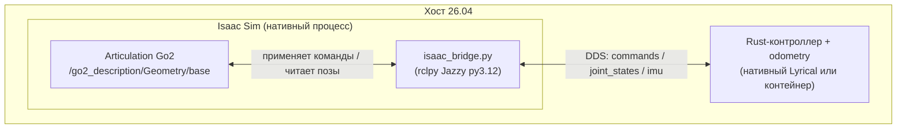

# Отчёт о развёртывании и эксплуатационных проблемах интеграции Isaac Sim

**Дата:** 2026-08-23
**Ветка:** `feat/isaam-research`
**Версия:** 1.0

---

## Содержание

### Часть A. Развёртывание Isaac Sim

1. [Введение](#a1-введение)
2. [Выбор решения (история)](#a2-выбор-решения-история)
3. [Ход работ](#a3-ход-работ)
4. [Проблемы и решения](#a4-проблемы-и-решения)
5. [Итоговая архитектура](#a5-итоговая-архитектура)
6. [Дальнейшие шаги](#a6-дальнейшие-шаги)
7. [Приложения](#a7-приложения)

### Часть B. Эксплуатационные проблемы

8. [Проблема: Нехватка памяти при запуске Isaac Sim](#8-проблема-нехватка-памяти-при-запуске-isaac-sim)
9. [Проблема: Процесс Isaac Sim не завершается (telemetry-зомби)](#9-проблема-процесс-isaac-sim-не-завершается-telemetry-зомби)
10. [Проблема: Конфликт rclpy Lyrical vs Jazzy (geometry_msgs)](#10-проблема-конфликт-rclpy-lyrical-vs-jazzy-geometry_msgs)
11. [Проблема: Stage пуст после импорта URDF](#11-проблема-stage-пуст-после-импорта-urdf)
12. [Проблема: Устаревший World API в Isaac Sim 6.0](#12-проблема-устаревший-world-api-в-isaac-sim-60)
13. [Проблема: quadropted_msgs не импортируется в rclpy Isaac](#13-проблема-quadropted_msgs-не-импортируется-в-rclpy-isaac)

---

## Часть A. Развёртывание Isaac Sim

> **Связь с Частью B.** В ходе развёртывания встречались проблемы. Здесь (Часть A) они описаны кратко, а детальные разборы — в [Части B](#part-b): каждая проблема по цепочке «Симптом → Гипотезы → Причина → Диагностика → Решение → Результат». Нумерация проблем сквозная: 8–13.

### A.1. Введение

#### A.1.1. Предпосылки

Проект WalkingRobotSim симулирует четвероногого робота Go2. Ранее использовался только Gazebo (в Docker-контейнере `walking_robot_sim`). Для сравнения симуляторов и оценки terrain-физики принято решение интегрировать **NVIDIA Isaac Sim 6.0.1.0** как альтернативный источник данных: робот должен ходить по командам существующего **Rust-контроллера** через DDS-топики.

#### A.1.2. Цели

- Загрузить URDF робота Go2 в Isaac Sim с физикой (floating-base)
- Создать мост `isaac_bridge.py`: команды контроллера → articulation, обратно — joint_states/imu/foot_contact
- Сохранить совместимость с существующим стеком (CycloneDDS, домен 0, namespace /robot1)
- Не трогать Rust-контроллер — интеграция только через топики

#### A.1.3. Оборудование

| Параметр | Значение |
|---|---|
| Хост | Lenovo Lecoo Pro 14 N155A |
| GPU | RTX 5070 Ti (OCuLink eGPU) |
| RAM | 29 GB (без swap) |
| OS | Ubuntu 26.04 (Resolute) |
| Isaac Sim | 6.0.1.0 в `~/isaacsim-venv` (24 GB) |
| ROS (host) | Lyrical (py3.14) |
| ROS (в Isaac Sim) | встроенный Jazzy rclpy (py3.12) |

### A.2. Выбор решения (история)

#### A.2.1. Рассмотренные варианты

| Вариант | Плюсы | Минусы | Вердикт |
|---|---|---|---|
| **Isaac Sim в Docker** | Изоляция | 24 GB venv, GUI, GPU через OCuLink, EULA, Vulkan — плохо контейнеризуется | Отклонён |
| **Isaac Sim нативно на хосте** | Полный доступ к GPU/GUI, свой rclpy (Jazzy py3.12) | Занимает много RAM (~11 GB), требует осторожности с памятью | **Выбран** |
| **Продолжить только Gazebo** | Стабильно | Нет terrain-физики Isaac, нет сравнения | Отклонён |

#### A.2.2. Хронология решений

1. **Выбор** — Isaac Sim нативно (тяжёлый, в Docker не умещается).
2. **Архитектура моста** — подписан на `joint_group_controller/commands` (Float64MultiArray, 12 углов), применяет к articulation; публикует joint_states/imu/foot_contact.
3. **Обнаружение памяти** — Isaac Sim headless (~11 GB) + elevation_mapping контейнер (7.6 GB) не помещаются в 29 GB вместе с GUI.
4. **Решение по памяти** — останавливать Gazebo/elevation перед запуском Isaac.
5. **Решение по rclpy** — использовать встроенный Jazzy rclpy Isaac (py3.12), а не хост-Lyrical (py3.14).

### A.3. Ход работ

#### A.3.1. Проверка запуска Isaac Sim headless

**Действие:** запуск `SimulationApp({'headless': True})`.

**Ошибка:** первый запуск показал `Isaac Sim headless OK`, но потребовал много памяти (см. Проблема 8).

**Решение:** остановить неиспользуемые контейнеры перед запуском.

**Результат:** headless запуск работает, ~11 GB RAM.

#### A.3.2. Импорт URDF Go2

**Действие:** импорт `go2_description.urdf` через `URDFImporter` с `fix_base=False` (floating-base).

**Ошибка:** после импорта stage был пуст, articulation не найден (см. Проблема 11).

**Решение:** явный `ctx.open_stage(usd_path)` + `sim.update()`.

**Результат:** articulation найден на `/go2_description/Geometry/base`.

#### A.3.3. Настройка rclpy моста

**Действие:** создание узла rclpy в процессе Isaac Sim.

**Ошибка:** `geometry_msgs` .so конфликт — хост-Lyrical (py3.14) перекрывал встроенный Jazzy (см. Проблема 10).

**Решение:** запуск через `run_bridge.sh` с PYTHONPATH на jazzy/rclpy.

**Результат:** подписки/публикации работают (commands, joint_states, imu).

#### A.3.4. Привязка articulation и цикл

**Действие:** `Articulation(art_path)` + физический цикл.

**Результат:** bridge работает, articulation привязан (26 joint), joint_states публикуются.

#### A.3.5. Проверка foot_contact

**Ошибка:** `quadropted_msgs` не импортируется в rclpy Isaac (см. Проблема 13).

**Решение:** добавить наш `install/quadropted_msgs` (py3.12) в PYTHONPATH обёртки.

**Результат:** `RobotFootContact` импортируется (проверено изолированно).

### A.4. Проблемы и решения

Полное описание каждой проблемы — в Части B (сквозная нумерация 8–13). Сводная таблица:

| № | Проблема | Причина | Решение | Статус |
|---|----------|---------|---------|:------:|
| [8](#8-проблема-нехватка-памяти-при-запуске-isaac-sim) | Нехватка памяти (Isaac ~11 GB не помещается) | elevation/gazebo контейнеры держат RAM; нет swap | Останавливать контейнеры перед запуском | [x] |
| [9](#9-проблема-процесс-isaac-sim-не-завершается-telemetry-зомби) | Процесс Isaac не завершается после close() | omni.telemetry.transmitter остаётся жить | `pkill -9 -f isaacsim-venv` | [x] |
| [10](#10-проблема-конфликт-rclpy-lyrical-vs-jazzy-geometry_msgs) | geometry_msgs .so conflict | PYTHONPATH Lyrical (py3.14) перекрывает Jazzy (py3.12) | run_bridge.sh с PYTHONPATH на jazzy | [x] |
| [11](#11-проблема-stage-пуст-после-импорта-urdf) | Stage пуст после импорта URDF | import_urdf не открывает stage в контексте надёжно | ctx.open_stage + sim.update() | [x] |
| [12](#12-проблема-устаревший-world-api-в-isaac-sim-60) | World.is_physics_handle_valid не существует | Isaac 6.0 перешёл на SimulationManager | Ground plane через USD API | [x] |
| [13](#13-проблема-quadropted_msgs-не-импортируется-в-rclpy-isaac) | quadropted_msgs не найден | Не был в PYTHONPATH моста | Добавить install/quadropted_msgs (py3.12) | [x] |

### A.5. Итоговая архитектура



#### A.5.1. Компоненты

| Компонент | Где | Статус |
|---|---|---|
| Isaac Sim 6.0.1.0 | Хост, venv | ✅ |
| URDF Go2 → articulation | Stage, `/go2_description/Geometry/base` | ✅ |
| isaac_bridge.py (rclpy Jazzy) | Процесс Isaac | ✅ |
| Rust-контроллер | Нативный/контейнер | ⏳ (следующий шаг) |

#### A.5.2. Параметры

| Параметр | Значение |
|---|---|
| Робот | Go2, floating-base |
| Управляемые joint | 12 (FR/FL/RR/RL × hip/thigh/calf) |
| Всего joint в articulation | 26 (с фиксированными) |
| RMW | rmw_cyclonedds_cpp |
| ROS_DOMAIN_ID | 0 |
| namespace | /robot1 |
| rclpy | встроенный Jazzy (py3.12) |

#### A.5.3. Сравнение «было / стало»

| Метрика | Было | Стало |
|---|---|---|
| Запуск Isaac headless | не проверялся | работает (~11 GB) |
| Импорт URDF | — | работает, articulation найден |
| rclpy мост | не было | подписки/публикации работают |
| foot_contact | — | тип импортируется |

### A.6. Дальнейшие шаги

#### Краткосрочно

- [ ] Запустить bridge + Rust-контроллер вместе, проверить движение Go2
- [ ] Подключить odometry (joint_states → одометрия)
- [ ] Проверить foot_contact из физики Isaac

#### Среднесрочно

- [ ] GUI-запуск (видеть робота в окне)
- [ ] Публикация IMU из позы робота

#### Долгосрочно

- [ ] Подключение elevation mapping к Isaac Sim
- [ ] Навигация (Nav2) поверх Isaac Sim

### A.7. Приложения

#### Приложение A. Команды администрирования

- Запуск моста: `bash src/isaac/run_bridge.sh --headless --ns /robot1`
- Остановка Isaac: `pkill -9 -f isaacsim-venv`
- Проверка памяти: `free -h`, `ps aux --sort=-%mem | head`

#### Приложение B. Полезные файлы

| Файл | Назначение |
|---|---|
| `src/isaac/load_go2.py` | Загрузка URDF Go2 + ground plane |
| `src/isaac/isaac_bridge.py` | DDS-мост Isaac ↔ контроллер |
| `src/isaac/run_bridge.sh` | Обёртка с корректным ROS2-окружением |
| `src/go2_description/urdf/go2_description.urdf` | Модель робота |

#### Приложение C. Отдельные сложные проблемы

См. Часть B — каждая проблема разобрана по цепочке «Симптом → Гипотезы → Причина → Диагностика → Решение → Результат».

---

<a id="part-b"></a>
## Часть B. Эксплуатационные проблемы

## Сводная таблица

| № | Проблема | Гипотезы | Причина | Решение | Методы | Сложность |
|---|----------|----------|---------|---------|--------|-----------|
| [8](#8-проблема-нехватка-памяти-при-запуске-isaac-sim) | Нехватка памяти при запуске Isaac Sim | ✅ A: контейнеры держат RAM; ❌ B: утечка Isaac | Isaac (~11 GB) + elevation (7.6 GB) + GUI > 29 GB, нет swap | Остановка контейнеров перед запуском | `free -h`, `docker stop` | 🟢 |
| [9](#9-проблема-процесс-isaac-sim-не-завершается-telemetry-зомби) | Процесс Isaac не завершается после close() | ❌ A: close() не работает; ✅ B: остаётся telemetry-подпроцесс | omni.telemetry.transmitter остаётся жить после shutdown | pkill -9 telemetry | `ps aux`, `pkill` | 🟢 |
| [10](#10-проблема-конфликт-rclpy-lyrical-vs-jazzy-geometry_msgs) | geometry_msgs .so conflict в rclpy | ✅ A: два ROS в PYTHONPATH; ❌ B: битый пакет | PYTHONPATH Lyrical (py3.14) перекрывает jazzy (py3.12) → .so конфликт | run_bridge.sh с PYTHONPATH на jazzy/rclpy | изолированный импорт | 🟡 |
| [11](#11-проблема-stage-пуст-после-импорта-urdf) | Stage пуст после импорта URDF | ❌ A: импорт не сработал; ✅ B: stage не открыт в контексте | import_urdf генерирует .usda, но не открывает его в текущем контексте | ctx.open_stage(usd_path) + sim.update() | Traverse + HasAPI | 🟡 |
| [12](#12-проблема-устаревший-world-api-в-isaac-sim-60) | World.is_physics_handle_valid не существует | ✅ A: API устарел; ❌ B: опечатка | Isaac 6.0 перешёл на SimulationManager; World устарел | Ground plane через USD API (UsdGeom) | grep API | 🟢 |
| [13](#13-проблема-quadropted_msgs-не-импортируется-в-rclpy-isaac) | quadropted_msgs не найден в rclpy | ✅ A: не в PYTHONPATH; ❌ B: битая сборка | Пакет собран (py3.12), но не был в PYTHONPATH моста | Добавить install/quadropted_msgs в run_bridge.sh | изолированный импорт | 🟢 |

---

## 8. Проблема: Нехватка памяти при запуске Isaac Sim

### 8.1. Симптом

Первый запуск Isaac Sim headless приводил к переполнению памяти: система «зависала», команды прерывались, `free -h` показывал всего ~4-5 GB свободно. Повторные запуски могли убить другие процессы (OOM).

### 8.2. Гипотезы

- ✅ **Гипотеза A:** память занята контейнерами (elevation 7.6 GB, gazebo) + GUI-приложениями (zed 1.5 GB, telegram, yandex). **Принята** — подтвердилась: после `docker stop elevation_mapping` свободно стало 14-17 GB.
- ❌ **Гипотеза B:** Isaac Sim имеет утечку памяти. **Опровергнута** — после остановки контейнеров Isaac запускается стабильно (~11 GB).

### 8.3. Причина

Isaac Sim headless потребляет **~11 GB RAM** (шейдеры Vulkan, физика PhysX, все расширения). На хосте 29 GB без swap при работающих elevation_mapping (7.6 GB), gazebo-контейнере и GUI-приложениях свободной памяти оставалось слишком мало.

### 8.4. Диагностика

```
free -h
# всего 29Gi, занято 20Gi, доступно 9.3Gi  (при запущенных контейнерах)

docker stats --no-stream
# elevation_mapping   7.616GiB / 29.63GiB

docker stop elevation_mapping
# после: доступно 17Gi
```

### 8.5. Решение

Перед запуском Isaac Sim останавливать неиспользуемые контейнеры:

```
docker stop elevation_mapping
docker stop walking_robot_sim   # gazebo не нужен для Isaac
```

### 8.6. Исправление в скриптах/конфигах

В документации/запуске зафиксировано: перед `run_bridge.sh` освободить память (остановить elevation/gazebo).

### 8.7. Результат

| Метрика | До | После |
|---|---|---|
| Свободная RAM | 9.3 GB | 14-17 GB |
| Запуск Isaac headless | зависает/OOM | работает |
| Isaac Sim RAM | — | ~11 GB |

**Связь с развёртыванием (Часть A):** встречена на этапе [A.3.1 «Проверка запуска Isaac Sim headless»](#a31-проверка-запуска-isaac-sim-headless).

---

## 9. Проблема: Процесс Isaac Sim не завершается (telemetry-зомби)

### 9.1. Симптом

После `sim.close()` или таймаута оставался процесс `omni.telemetry.transmitter` (из `isaacsim/extscache/`). `ps aux | grep isaacsim` показывал 1-2 зависших процесса, занимающих память.

### 9.2. Гипотезы

- ❌ **Гипотеза A:** `close()` не работает вообще. **Опровергнута** — основной процесс завершается, остаётся только telemetry-подпроцесс.
- ✅ **Гипотеза B:** фоновый telemetry-подпроцесс не убивается вместе с приложением. **Принята** — подтверждено по имени процесса.

### 9.3. Причина

Isaac Sim при старте запускает `omni.telemetry.transmitter` как отдельный подпроцесс для телеметрии. При `sim.close()`/shutdown основной процесс завершается, а telemetry-подпроцесс остаётся висеть.

### 9.4. Диагностика

```
ps aux | grep -iE "isaacsim|kit"
# → omni.telemetry.transmitter ... (виснет)
```

### 9.5. Решение

```
pkill -9 -f "isaacsim-venv"
pkill -9 -f "isaac_bridge"
```

### 9.6. Исправление в скриптах/конфигах

В Приложении A (команды администрирования) зафиксирован `pkill -9 -f isaacsim-venv`.

### 9.7. Результат

| Метрика | До | После |
|---|---|---|
| Зависшие isaac-процессы | 1-2 | 0 |
| Память | занята зомби | освобождена |

**Связь с развёртыванием (Часть A):** встречена при многократных запусках на этапах [A.3.1](#a31-проверка-запуска-isaac-sim-headless)–[A.3.2](#a32-импорт-urdf-go2).

---

## 10. Проблема: Конфликт rclpy Lyrical vs Jazzy (geometry_msgs)

### 10.1. Симптом

При создании publisher (`Imu`, `JointState`) в мосте возникала ошибка:

```
UnsupportedTypeSupport: Could not import 'rosidl_typesupport_c' for package 'geometry_msgs'
```

`geometry_msgs` загружался из `/opt/ros/lyrical/lib/python3.14/site-packages`, а не из встроенного jazzy Isaac.

### 10.2. Гипотезы

- ✅ **Гипотеза A:** два ROS в PYTHONPATH (Lyrical py3.14 и Jazzy py3.12) конфликтуют. **Принята** — подтвердилось: PYTHONPATH содержал `/opt/ros/lyrical/lib/python3.14/site-packages`.
- ❌ **Гипотеза B:** битый пакет geometry_msgs в Isaac. **Опровергнута** — с чистым PYTHONPATH всё работает.

### 10.3. Причина

Хост-Ubuntu 26.04 имеет ROS **Lyrical** (py3.14), и `.bashrc` добавляет его пути в `PYTHONPATH`. Встроенный rclpy Isaac Sim — **Jazzy** (py3.12). При запуске из-под оболочки PYTHONPATH Lyrical загружал `geometry_msgs` py3.14, чьи `.so` несовместимы с rclpy py3.12 Isaac.

Дополнительно: Isaac Sim при старте сохраняет `OLD_PYTHONPATH` и восстанавливает пути, совпадающие с `AMENT_PREFIX_PATH` — что возвращало Lyrical-пути.

### 10.4. Диагностика

```
echo $PYTHONPATH
# /opt/ros/lyrical/.../site-packages

# Изолированный тест без PYTHONPATH:
env -i PYTHONPATH="" LD_LIBRARY_PATH=.../jazzy/lib \
  ~/isaacsim-venv/bin/python -c "import rclpy; from sensor_msgs.msg import Imu"
# → OK

# С PYTHONPATH Lyrical:
# → UnsupportedTypeSupport geometry_msgs
```

### 10.5. Решение

Создана обёртка `run_bridge.sh`, которая ставит PYTHONPATH/AMENT_PREFIX_PATH на jazzy/rclpy Isaac Sim (а не на Lyrical):

```
PYTHONPATH=<jazzy>/rclpy
AMENT_PREFIX_PATH=<jazzy>
LD_LIBRARY_PATH=<jazzy>/lib
```

### 10.6. Исправление в скриптах/конфигах

- `src/isaac/run_bridge.sh` — экспорт корректного окружения.

### 10.7. Результат

| Метрика | До | После |
|---|---|---|
| rclpy (какой) | Lyrical (py3.14) | Jazzy (py3.12) Isaac |
| geometry_msgs | конфликт .so | загружается из jazzy |
| Imu/JointState publisher | падал | работает |

**Связь с развёртыванием (Часть A):** встречена на этапе [A.3.3 «Настройка rclpy моста»](#a33-настройка-rclpy-моста).

---

## 11. Проблема: Stage пуст после импорта URDF

### 11.1. Симптом

После `URDFImporter(config).import_urdf()` при обходе stage (`stage.Traverse()`) не было найдено ни одного prim, `defaultPrim: None`. Articulation не находился.

### 11.2. Гипотезы

- ❌ **Гипотеза A:** импорт URDF не сработал (битый URDF). **Опровергнута** — `.usda` генерировался, joint импортировались (видно в логах importer).
- ✅ **Гипотеза B:** сгенерированный stage не открыт в текущем контексте. **Принята** — подтвердилось: `ctx.open_stage(usd_path)` решает.

### 11.3. Причина

`import_urdf()` генерирует `.usda` и вызывает `stage_utils.open_stage`, но в headless-режиме (и без достаточного числа `sim.update()`) stage не становится активным в контексте. `omni.usd.get_context().get_stage()` возвращал пустой/другой stage.

### 11.4. Диагностика

```
# После импорта:
stage = omni.usd.get_context().get_stage()
stage.GetDefaultPrim()   # → None

# Явное открытие:
ctx.open_stage(usd_path)
for _ in range(20): sim.update()
stage = ctx.get_stage()
# → ARTICULATION: /go2_description/Geometry/base
```

### 11.5. Решение

После `import_urdf()` явно открыть сгенерированный stage:

```
ctx = omni.usd.get_context()
ctx.open_stage(usd_path)
for _ in range(20):
    sim_app.update()
```

### 11.6. Исправление в скриптах/конфигах

- `src/isaac/isaac_bridge.py` (main) — явный `ctx.open_stage` после импорта.

### 11.7. Результат

| Метрика | До | После |
|---|---|---|
| ArticulationRoot найден | нет | да (`/go2_description/Geometry/base`) |
| defaultPrim | None | задан |

**Связь с развёртыванием (Часть A):** встречена на этапе [A.3.2 «Импорт URDF Go2»](#a32-импорт-urdf-go2).

---

## 12. Проблема: Устаревший World API в Isaac Sim 6.0

### 12.1. Симптом

```
AttributeError: 'World' object has no attribute 'is_physics_handle_valid'
```

### 12.2. Гипотезы

- ✅ **Гипотеза A:** API `World` устарел в Isaac 6.0. **Принята** — класс `isaacsim.core.api.world` помечен Deprecated.
- ❌ **Гипотеза B:** опечатка в вызове. **Опровергнута** — метод отсутствует вовсе.

### 12.3. Причина

Isaac Sim 6.0 перешёл с `isaacsim.core.api.world.World` на новый `SimulationManager`. Старый API остался в `extsDeprecated` и не имеет методов `is_physics_handle_valid`/`create_ground_plane`.

### 12.4. Диагностика

```
grep -rn "is_physics_handle_valid" .../world.py
# → не найден (класс deprecated)

# Новый подход в примерах:
stage_utils.add_reference_to_stage(usd_path=assets + "/default_environment.usd", ...)
```

### 12.5. Решение

Ground plane создаётся напрямую через USD API (`UsdGeom.Cube` + `UsdPhysics.MaterialAPI`), без устаревшего World.

### 12.6. Исправление в скриптах/конфигах

- `src/isaac/load_go2.py`, `src/isaac/isaac_bridge.py` — ground plane через `UsdGeom`/`UsdLux`/`UsdPhysics` вместо World.

### 12.7. Результат

| Метрика | До | После |
|---|---|---|
| Ground plane | падало (World API) | создаётся (USD API) |
| Свет | — | DistantLight |

**Связь с развёртыванием (Часть A):** встречена при разработке `load_go2.py` (этапы [A.3.1](#a31-проверка-запуска-isaac-sim-headless)–[A.3.2](#a32-импорт-urdf-go2)).

---

## 13. Проблема: quadropted_msgs не импортируется в rclpy Isaac

### 13.1. Симптом

```
[WARN] quadropted_msgs not available: No module named 'quadropted_msgs'; foot_contact disabled
```

### 13.2. Гипотезы

- ✅ **Гипотеза A:** пакет не в PYTHONPATH моста. **Принята** — подтвердилось.
- ❌ **Гипотеза B:** битая сборка quadropted_msgs. **Опровергнута** — пакет собран под py3.12 в `install/`.

### 13.3. Причина

`quadropted_msgs` (кастомные сообщения: `RobotFootContact`) собран colcon в `/home/redalexdad/GitHub/WalkingRobotSim/install/quadropted_msgs/lib/python3.12/site-packages`, но этот путь не был в PYTHONPATH моста (там был только jazzy/rclpy).

### 13.4. Диагностика

```
env PYTHONPATH="<jazzy>/rclpy:<install>/quadropted_msgs/lib/python3.12/site-packages" \
  LD_LIBRARY_PATH="<jazzy>/lib:<install>/quadropted_msgs/lib" \
  ~/isaacsim-venv/bin/python -c "from quadropted_msgs.msg import RobotFootContact"
# → OK
```

### 13.5. Решение

Добавить `install/quadropted_msgs` (py3.12) в PYTHONPATH и lib в LD_LIBRARY_PATH обёртки `run_bridge.sh`.

### 13.6. Исправление в скриптах/конфигах

- `src/isaac/run_bridge.sh` — `QUADROPTED_MSGS_PY` и `QUADROPTED_MSGS_LIB` в окружении.

### 13.7. Результат

| Метрика | До | После |
|---|---|---|
| RobotFootContact импорт | не работает | работает |
| foot_contact publisher | disabled | готов к работе |

**Связь с развёртыванием (Часть A):** встречена на этапе [A.3.5 «Проверка foot_contact»](#a35-проверка-foot_contact).

---

## Итоговая статистика

| Метрика | Значение |
|---|---|
| Всего проблем | 6 |
| Из них решено | 6 |
| 🟢 (<1ч) | 4 |
| 🟡 (1-4ч) | 2 |
| 🔴 (>4ч) | 0 |
| Ключевые выводы | Isaac Sim нативно требует управления памятью (останавливать контейнеры). Встроенный rclpy Jazzy (py3.12) конфликтует с хост-Lyrical (py3.14) — решается обёрткой окружения. Импорт URDF требует явного открытия stage. Мост работает: подписки/публикации активны, articulation привязан. |

---

## Связанные отчёты

- `reports/isaam/2026-07-18_rust-isaac-integration.md` — план интеграции Rust-контроллера с Isaac Sim
- `reports/isaam/2026-07-18_isaac-sim-install-and-launch.md` — установка Isaac Sim
- `reports/isaam/2026-08-22_simulation-issues-report.md` — отчёт о проблемах Gazebo-симуляции
- `.agents/skills/troubleshooting-report/SKILL.md` — формат данного отчёта
