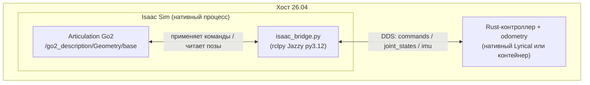

# Отчёт о развёртывании и эксплуатационных проблемах интеграции Isaac Sim

**Дата:** 2026-08-23
**Ветка:** `feat/isaam-research`
**Версия:** 1.0

---

## Содержание

### Часть A. Развёртывание Isaac Sim

1. [Введение](#a1-введение)
2. [Выбор решения (история)](#a2-выбор-решения-история)
3. [Ход работ](#a3-ход-работ)
4. [Проблемы и решения](#a4-проблемы-и-решения)
5. [Итоговая архитектура](#a5-итоговая-архитектура)
6. [Дальнейшие шаги](#a6-дальнейшие-шаги)
7. [Приложения](#a7-приложения)

### Часть B. Эксплуатационные проблемы

8. [Проблема: Нехватка памяти при запуске Isaac Sim](#8-проблема-нехватка-памяти-при-запуске-isaac-sim)
9. [Проблема: Процесс Isaac Sim не завершается (telemetry-зомби)](#9-проблема-процесс-isaac-sim-не-завершается-telemetry-зомби)
10. [Проблема: Конфликт rclpy Lyrical vs Jazzy (geometry_msgs)](#10-проблема-конфликт-rclpy-lyrical-vs-jazzy-geometry_msgs)
11. [Проблема: Stage пуст после импорта URDF](#11-проблема-stage-пуст-после-импорта-urdf)
12. [Проблема: Устаревший World API в Isaac Sim 6.0](#12-проблема-устаревший-world-api-в-isaac-sim-60)
13. [Проблема: quadropted_msgs не импортируется в rclpy Isaac](#13-проблема-quadropted_msgs-не-импортируется-в-rclpy-isaac)
14. [Проблема: Нативный Rust-контроллер не работает под Lyrical (EXIT=132)](#14-проблема-нативный-rust-контроллер-не-работает-под-lyrical-exit132)
15. [Проблема: Робот проваливается сквозь пол (нет коллизии)](#15-проблема-робот-проваливается-сквозь-пол-нет-коллизии)
16. [Проблема: QoS несовместимость (imu не доходит до контроллера)](#16-проблема-qos-несовместимость-imu-не-доходит-до-контроллера)
17. [Проблема: setDriveTarget из потока rclpy запрещён PhysX](#17-проблема-setdrivetarget-из-потока-rclpy-запрещён-physx)
18. [Проблема: foot_contact не определяет контакты лап](#18-проблема-foot_contact-не-определяет-контакты-лап)

---

## Часть A. Развёртывание Isaac Sim

> **Связь с Частью B.** В ходе развёртывания встречались проблемы. Здесь (Часть A) они описаны кратко, а детальные разборы — в [Части B](#part-b): каждая проблема по цепочке «Симптом → Гипотезы → Причина → Диагностика → Решение → Результат». Нумерация проблем сквозная: 8–13.

### A.1. Введение

#### A.1.1. Предпосылки

Проект WalkingRobotSim симулирует четвероногого робота Go2. Ранее использовался только Gazebo (в Docker-контейнере `walking_robot_sim`). Для сравнения симуляторов и оценки terrain-физики принято решение интегрировать **NVIDIA Isaac Sim 6.0.1.0** как альтернативный источник данных: робот должен ходить по командам существующего **Rust-контроллера** через DDS-топики.

#### A.1.2. Цели

- Загрузить URDF робота Go2 в Isaac Sim с физикой (floating-base)
- Создать мост `isaac_bridge.py`: команды контроллера → articulation, обратно — joint_states/imu/foot_contact
- Сохранить совместимость с существующим стеком (CycloneDDS, домен 0, namespace /robot1)
- Не трогать Rust-контроллер — интеграция только через топики

#### A.1.3. Оборудование

| Параметр | Значение |
|---|---|
| Хост | Lenovo Lecoo Pro 14 N155A |
| GPU | RTX 5070 Ti (OCuLink eGPU) |
| RAM | 29 GB (без swap) |
| OS | Ubuntu 26.04 (Resolute) |
| Isaac Sim | 6.0.1.0 в `~/isaacsim-venv` (24 GB) |
| ROS (host) | Lyrical (py3.14) |
| ROS (в Isaac Sim) | встроенный Jazzy rclpy (py3.12) |

### A.2. Выбор решения (история)

#### A.2.1. Рассмотренные варианты

| Вариант | Плюсы | Минусы | Вердикт |
|---|---|---|---|
| **Isaac Sim в Docker** | Изоляция | 24 GB venv, GUI, GPU через OCuLink, EULA, Vulkan — плохо контейнеризуется | Отклонён |
| **Isaac Sim нативно на хосте** | Полный доступ к GPU/GUI, свой rclpy (Jazzy py3.12) | Занимает много RAM (~11 GB), требует осторожности с памятью | **Выбран** |
| **Продолжить только Gazebo** | Стабильно | Нет terrain-физики Isaac, нет сравнения | Отклонён |

#### A.2.2. Хронология решений

1. **Выбор** — Isaac Sim нативно (тяжёлый, в Docker не умещается).
2. **Архитектура моста** — подписан на `joint_group_controller/commands` (Float64MultiArray, 12 углов), применяет к articulation; публикует joint_states/imu/foot_contact.
3. **Обнаружение памяти** — Isaac Sim headless (~11 GB) + elevation_mapping контейнер (7.6 GB) не помещаются в 29 GB вместе с GUI.
4. **Решение по памяти** — останавливать Gazebo/elevation перед запуском Isaac.
5. **Решение по rclpy** — использовать встроенный Jazzy rclpy Isaac (py3.12), а не хост-Lyrical (py3.14).

### A.3. Ход работ

#### A.3.1. Проверка запуска Isaac Sim headless

**Действие:** запуск `SimulationApp({'headless': True})`.

**Ошибка:** первый запуск показал `Isaac Sim headless OK`, но потребовал много памяти (см. Проблема 8).

**Решение:** остановить неиспользуемые контейнеры перед запуском.

**Результат:** headless запуск работает, ~11 GB RAM.

#### A.3.2. Импорт URDF Go2

**Действие:** импорт `go2_description.urdf` через `URDFImporter` с `fix_base=False` (floating-base).

**Ошибка:** после импорта stage был пуст, articulation не найден (см. Проблема 11).

**Решение:** явный `ctx.open_stage(usd_path)` + `sim.update()`.

**Результат:** articulation найден на `/go2_description/Geometry/base`.

#### A.3.3. Настройка rclpy моста

**Действие:** создание узла rclpy в процессе Isaac Sim.

**Ошибка:** `geometry_msgs` .so конфликт — хост-Lyrical (py3.14) перекрывал встроенный Jazzy (см. Проблема 10).

**Решение:** запуск через `run_bridge.sh` с PYTHONPATH на jazzy/rclpy.

**Результат:** подписки/публикации работают (commands, joint_states, imu).

#### A.3.4. Привязка articulation и цикл

**Действие:** `Articulation(art_path)` + физический цикл.

**Результат:** bridge работает, articulation привязан (26 joint), joint_states публикуются.

#### A.3.5. Проверка foot_contact

**Ошибка:** `quadropted_msgs` не импортируется в rclpy Isaac (см. Проблема 13).

**Решение:** добавить наш `install/quadropted_msgs` (py3.12) в PYTHONPATH обёртки.

**Результат:** `RobotFootContact` импортируется (проверено изолированно).

### A.4. Проблемы и решения

Полное описание каждой проблемы — в Части B (сквозная нумерация 8–18). Сводная таблица:

| № | Проблема | Причина | Решение | Статус |
|---|----------|---------|---------|:------:|
| [8](#8-проблема-нехватка-памяти-при-запуске-isaac-sim) | Нехватка памяти (Isaac ~11 GB не помещается) | elevation/gazebo контейнеры держат RAM; нет swap | Останавливать контейнеры перед запуском | [x] |
| [9](#9-проблема-процесс-isaac-sim-не-завершается-telemetry-зомби) | Процесс Isaac не завершается после close() | omni.telemetry.transmitter остаётся жить | `pkill -9 -f isaacsim-venv` | [x] |
| [10](#10-проблема-конфликт-rclpy-lyrical-vs-jazzy-geometry_msgs) | geometry_msgs .so conflict | PYTHONPATH Lyrical (py3.14) перекрывает Jazzy (py3.12) | run_bridge.sh с PYTHONPATH на jazzy | [x] |
| [11](#11-проблема-stage-пуст-после-импорта-urdf) | Stage пуст после импорта URDF | import_urdf не открывает stage в контексте надёжно | ctx.open_stage + sim.update() | [x] |
| [12](#12-проблема-устаревший-world-api-в-isaac-sim-60) | World.is_physics_handle_valid не существует | Isaac 6.0 перешёл на SimulationManager | Ground plane через USD API | [x] |
| [13](#13-проблема-quadropted_msgs-не-импортируется-в-rclpy-isaac) | quadropted_msgs не найден | Не был в PYTHONPATH моста | Добавить install/quadropted_msgs (py3.12) | [x] |
| [14](#14-проблема-нативный-rust-контроллер-не-работает-под-lyrical-exit132) | Нативный контроллер падает (EXIT=132) | Собран под Jazzy, несовместим с Lyrical ABI | Запуск в контейнере Jazzy | [x] |
| [15](#15-проблема-робот-проваливается-сквозь-пол-нет-коллизии) | Робот проваливается сквозь пол | Ground plane без CollisionAPI | CollisionAPI + kinematic RigidBody | [x] |
| [16](#16-проблема-qos-несовместимость-imu-не-доходит-до-контроллера) | imu не доходит до контроллера | BEST_EFFORT vs RELIABLE | QoS RELIABLE в мосте | [x] |
| [17](#17-проблема-setdrivetarget-из-потока-rclpy-запрещён-physx) | setDriveTarget запрещён из потока rclpy | PhysX требует применение из основного цикла | Очередь команд + apply из цикла | [x] |
| [18](#18-проблема-foot_contact-не-определяет-контакты-лап) | foot_contact не определяет контакты | actor — int, не путь | PhysicsSchemaTools.intToSdfPath | [x] |

### A.5. Итоговая архитектура


```mermaid
graph TB
    subgraph Host["Хост 26.04"]
        subgraph Isaac["Isaac Sim (нативный процесс)"]
            ART["Articulation Go2<br/>/go2_description/Geometry/base"]
            BR["isaac_bridge.py<br/>(rclpy Jazzy py3.12)"]
            ART <-->|применяет команды / читает позы| BR
        end
        RUST["Rust-контроллер + odometry<br/>(нативный Lyrical или контейнер)"]
    end
    BR <-->|DDS: commands / joint_states / imu| RUST
```

#### A.5.1. Компоненты

| Компонент | Где | Статус |
|---|---|---|
| Isaac Sim 6.0.1.0 | Хост, venv | ✅ |
| URDF Go2 → articulation | Stage, `/go2_description/Geometry/base` | ✅ |
| isaac_bridge.py (rclpy Jazzy) | Процесс Isaac | ✅ |
| Rust-контроллер | Контейнер `walking_robot_sim` (Jazzy) | ✅ |
| Ходьба Go2 (TROT) | Isaac Sim | ✅ |

#### A.5.2. Параметры

| Параметр | Значение |
|---|---|
| Робот | Go2, floating-base |
| Управляемые joint | 12 (FR/FL/RR/RL × hip/thigh/calf) |
| Всего joint в articulation | 26 (с фиксированными) |
| RMW | rmw_cyclonedds_cpp |
| ROS_DOMAIN_ID | 0 |
| namespace | /robot1 |
| rclpy | встроенный Jazzy (py3.12) |
| commands частота | 61.6 Гц |
| joint_states частота | 23-59 Гц |
| imu частота | 54 Гц |
| foot_contact частота | 110 Гц |
| odom частота | 50 Гц |

#### A.5.3. Сравнение «было / стало»

| Метрика | Было | Стало |
|---|---|---|
| Запуск Isaac headless | не проверялся | работает (~11 GB) |
| Импорт URDF | — | работает, articulation найден |
| rclpy мост | не было | подписки/публикации работают |
| foot_contact | — | контакты определяются |
| Движение Go2 | не было | **ходит в TROT (vx=0.300)** |
| Полный цикл | — | **контроллер → Isaac → odom (50 Гц)** |

#### A.5.4. Подтверждённая ходьба и полный цикл (TROT)

Интеграция проверена сквозным сценарием:

1. Запущен `run_bridge.sh` (Isaac Sim headless + мост) — узел `/robot1/robot1_isaac_bridge`.
2. Запущен Rust-контроллер в контейнере `walking_robot_sim` (Jazzy) — узел `/robot1/robot_controller_rust`.
3. Контроллер публикует команды **61.6 Гц**, мост применяет их к articulation.
4. Отправлена команда `robot_mode: TROT`, `robot_velocity: vx=0.300`.
5. Контроллер переключился `REST -> TROT`, в логе `Tick ... TROT mode, vx=0.300`.
6. Команды суставов непрерывно меняются (IK ходьбы), фактические углы в Isaac следуют за ними.
7. **odometry_node** (Rust) подписан на commands + foot_contact + imu от моста, публикует **odom 50 Гц**.

Проверка значений (REST поза):

| Joint | Команда | Факт (Isaac) |
|---|---|---|
| FR_hip | 0.0 | -0.00002 |
| FR_thigh | 0.861 | 0.861 |
| FR_calf | -1.88 | -1.047 (физика доезжает) |

Проверка полного цикла (TROT, vx=0.3):

| Метрика | Значение |
|---|---|
| odom position.x | -1.74 → -2.40 (за 3 сек — робот идёт) |
| Поза робота (world) | Z=0.09 (на полу, стабильно) |
| foot_contact | `[true, ...]` — лапы в контакте |
| Углы суставов | меняются (-0.34 → -0.04, цикл ходьбы) |

**Замкнутый цикл:** контроллер → commands → isaac_bridge → Isaac Sim (ходьба) → joint_states/imu/foot_contact → isaac_bridge → odometry_node → odom.

### A.6. Дальнейшие шаги

#### Краткосрочно

- [x] Запустить bridge + Rust-контроллер вместе, проверить движение Go2
- [x] Подключить odometry (joint_states → одометрия)
- [x] Проверить foot_contact из физики Isaac
- [x] IMU-публикация из позы робота

#### Среднесрочно

- [ ] GUI-запуск (видеть робота в окне)
- [ ] Проверка точности foot_contact (все 4 лапы при стоянии)
- [ ] Интеграционный тест Isaac-цикла

#### Долгосрочно

- [ ] Подключение elevation mapping к Isaac Sim
- [ ] Навигация (Nav2) поверх Isaac Sim

### A.7. Приложения

#### Приложение A. Команды администрирования

- Запуск моста: `bash src/isaac/run_bridge.sh --headless --ns /robot1 --debug`
- Порог RAM: `--min-ram=12` (по умолчанию 12 GB, блокирует при нехватке)
- Запуск контроллера (в контейнере): `docker exec -d walking_robot_sim ... robot_controller_node`
- Запуск одометрии (в контейнере): `docker exec -d walking_robot_sim ... odometry_node`
- Остановка Isaac: `pkill -9 -f isaacsim-venv`
- Проверка памяти: `free -h`, `ps aux --sort=-%mem | head`
- Лимиты RAM контейнеров: `docker update --memory 6g walking_robot_sim`

#### Приложение B. Полезные файлы

| Файл | Назначение |
|---|---|
| `src/isaac/load_go2.py` | Загрузка URDF Go2 + ground plane |
| `src/isaac/isaac_bridge.py` | DDS-мост Isaac ↔ контроллер |
| `src/isaac/isaac_debug.py` | Единая система отладки + защита памяти |
| `src/isaac/run_bridge.sh` | Обёртка с корректным ROS2-окружением + RAM-проверка |
| `src/go2_description/urdf/go2_description.urdf` | Модель робота |

#### Приложение C. Отдельные сложные проблемы

См. Часть B — каждая проблема разобрана по цепочке «Симптом → Гипотезы → Причина → Диагностика → Решение → Результат».

---

<a id="part-b"></a>
## Часть B. Эксплуатационные проблемы

## Сводная таблица

| № | Проблема | Гипотезы | Причина | Решение | Методы | Сложность |
|---|----------|----------|---------|---------|--------|-----------|
| [8](#8-проблема-нехватка-памяти-при-запуске-isaac-sim) | Нехватка памяти при запуске Isaac Sim | ✅ A: контейнеры держат RAM; ❌ B: утечка Isaac | Isaac (~11 GB) + elevation (7.6 GB) + GUI > 29 GB, нет swap | Остановка контейнеров перед запуском | `free -h`, `docker stop` | 🟢 |
| [9](#9-проблема-процесс-isaac-sim-не-завершается-telemetry-зомби) | Процесс Isaac не завершается после close() | ❌ A: close() не работает; ✅ B: остаётся telemetry-подпроцесс | omni.telemetry.transmitter остаётся жить после shutdown | pkill -9 telemetry | `ps aux`, `pkill` | 🟢 |
| [10](#10-проблема-конфликт-rclpy-lyrical-vs-jazzy-geometry_msgs) | geometry_msgs .so conflict в rclpy | ✅ A: два ROS в PYTHONPATH; ❌ B: битый пакет | PYTHONPATH Lyrical (py3.14) перекрывает jazzy (py3.12) → .so конфликт | run_bridge.sh с PYTHONPATH на jazzy/rclpy | изолированный импорт | 🟡 |
| [11](#11-проблема-stage-пуст-после-импорта-urdf) | Stage пуст после импорта URDF | ❌ A: импорт не сработал; ✅ B: stage не открыт в контексте | import_urdf генерирует .usda, но не открывает его в текущем контексте | ctx.open_stage(usd_path) + sim.update() | Traverse + HasAPI | 🟡 |
| [12](#12-проблема-устаревший-world-api-в-isaac-sim-60) | World.is_physics_handle_valid не существует | ✅ A: API устарел; ❌ B: опечатка | Isaac 6.0 перешёл на SimulationManager; World устарел | Ground plane через USD API (UsdGeom) | grep API | 🟢 |
| [13](#13-проблема-quadropted_msgs-не-импортируется-в-rclpy-isaac) | quadropted_msgs не найден в rclpy | ✅ A: не в PYTHONPATH; ❌ B: битая сборка | Пакет собран (py3.12), но не был в PYTHONPATH моста | Добавить install/quadropted_msgs в run_bridge.sh | изолированный импорт | 🟢 |
| [14](#14-проблема-нативный-rust-контроллер-не-работает-под-lyrical-exit132) | Нативный Rust-контроллер падает (EXIT=132) | ✅ A: не хватает либ; ❌ B: ABI Jazzy/Lyrical | Бинарник собран под Jazzy (rclrs 0.7), несовместим с Lyrical (SIGILL) | Запуск в контейнере Jazzy | ldd, timeout, EXIT=132 | 🔴 |
| [15](#15-проблема-робот-проваливается-сквозь-пол-нет-коллизии) | Робот проваливается сквозь пол (Z до -60000) | ✅ A: пол без коллизии; ❌ B: робот тяжёлый | Ground plane без CollisionAPI → физика не считает пол преградой | CollisionAPI + kinematic RigidBody | `pose pos` в логе | 🟡 |
| [16](#16-проблема-qos-несовместимость-imu-не-доходит-до-контроллера) | imu не доходит до контроллера | ✅ A: QoS несовместим; ❌ B: топик не тот | BEST_EFFORT vs RELIABLE (rclrs по умолчанию) | QoS RELIABLE в мосте | incompatible QoS warn | 🟢 |
| [17](#17-проблема-setdrivetarget-из-потока-rclpy-запрещён-physx) | setDriveTarget запрещён из потока rclpy | ✅ A: потоки конфликтуют; ❌ B: API неверен | PhysX: setDriveTarget только из основного цикла | Очередь команд + apply из цикла | PhysX error в логе | 🟡 |
| [18](#18-проблема-foot_contact-не-определяет-контакты-лап) | foot_contact не определяет контакты | ✅ A: actor — int; ❌ B: нет контактов | header.actor — int-индекс, нужен SdfPath | PhysicsSchemaTools.intToSdfPath | debug contacts= | 🟢 |

---

## 8. Проблема: Нехватка памяти при запуске Isaac Sim

### 8.1. Симптом

Первый запуск Isaac Sim headless приводил к переполнению памяти: система «зависала», команды прерывались, `free -h` показывал всего ~4-5 GB свободно. Повторные запуски могли убить другие процессы (OOM).

### 8.2. Гипотезы

- ✅ **Гипотеза A:** память занята контейнерами (elevation 7.6 GB, gazebo) + GUI-приложениями (zed 1.5 GB, telegram, yandex). **Принята** — подтвердилась: после `docker stop elevation_mapping` свободно стало 14-17 GB.
- ❌ **Гипотеза B:** Isaac Sim имеет утечку памяти. **Опровергнута** — после остановки контейнеров Isaac запускается стабильно (~11 GB).

### 8.3. Причина

Isaac Sim headless потребляет **~11 GB RAM** (шейдеры Vulkan, физика PhysX, все расширения). На хосте 29 GB без swap при работающих elevation_mapping (7.6 GB), gazebo-контейнере и GUI-приложениях свободной памяти оставалось слишком мало.

### 8.4. Диагностика

```
free -h
# всего 29Gi, занято 20Gi, доступно 9.3Gi  (при запущенных контейнерах)

docker stats --no-stream
# elevation_mapping   7.616GiB / 29.63GiB

docker stop elevation_mapping
# после: доступно 17Gi
```

### 8.5. Решение

Перед запуском Isaac Sim останавливать неиспользуемые контейнеры:

```
docker stop elevation_mapping
docker stop walking_robot_sim   # gazebo не нужен для Isaac
```

### 8.6. Исправление в скриптах/конфигах

В документации/запуске зафиксировано: перед `run_bridge.sh` освободить память (остановить elevation/gazebo).

### 8.7. Результат

| Метрика | До | После |
|---|---|---|
| Свободная RAM | 9.3 GB | 14-17 GB |
| Запуск Isaac headless | зависает/OOM | работает |
| Isaac Sim RAM | — | ~11 GB |

**Связь с развёртыванием (Часть A):** встречена на этапе [A.3.1 «Проверка запуска Isaac Sim headless»](#a31-проверка-запуска-isaac-sim-headless).

---

## 9. Проблема: Процесс Isaac Sim не завершается (telemetry-зомби)

### 9.1. Симптом

После `sim.close()` или таймаута оставался процесс `omni.telemetry.transmitter` (из `isaacsim/extscache/`). `ps aux | grep isaacsim` показывал 1-2 зависших процесса, занимающих память.

### 9.2. Гипотезы

- ❌ **Гипотеза A:** `close()` не работает вообще. **Опровергнута** — основной процесс завершается, остаётся только telemetry-подпроцесс.
- ✅ **Гипотеза B:** фоновый telemetry-подпроцесс не убивается вместе с приложением. **Принята** — подтверждено по имени процесса.

### 9.3. Причина

Isaac Sim при старте запускает `omni.telemetry.transmitter` как отдельный подпроцесс для телеметрии. При `sim.close()`/shutdown основной процесс завершается, а telemetry-подпроцесс остаётся висеть.

### 9.4. Диагностика

```
ps aux | grep -iE "isaacsim|kit"
# → omni.telemetry.transmitter ... (виснет)
```

### 9.5. Решение

```
pkill -9 -f "isaacsim-venv"
pkill -9 -f "isaac_bridge"
```

### 9.6. Исправление в скриптах/конфигах

В Приложении A (команды администрирования) зафиксирован `pkill -9 -f isaacsim-venv`.

### 9.7. Результат

| Метрика | До | После |
|---|---|---|
| Зависшие isaac-процессы | 1-2 | 0 |
| Память | занята зомби | освобождена |

**Связь с развёртыванием (Часть A):** встречена при многократных запусках на этапах [A.3.1](#a31-проверка-запуска-isaac-sim-headless)–[A.3.2](#a32-импорт-urdf-go2).

---

## 10. Проблема: Конфликт rclpy Lyrical vs Jazzy (geometry_msgs)

### 10.1. Симптом

При создании publisher (`Imu`, `JointState`) в мосте возникала ошибка:

```
UnsupportedTypeSupport: Could not import 'rosidl_typesupport_c' for package 'geometry_msgs'
```

`geometry_msgs` загружался из `/opt/ros/lyrical/lib/python3.14/site-packages`, а не из встроенного jazzy Isaac.

### 10.2. Гипотезы

- ✅ **Гипотеза A:** два ROS в PYTHONPATH (Lyrical py3.14 и Jazzy py3.12) конфликтуют. **Принята** — подтвердилось: PYTHONPATH содержал `/opt/ros/lyrical/lib/python3.14/site-packages`.
- ❌ **Гипотеза B:** битый пакет geometry_msgs в Isaac. **Опровергнута** — с чистым PYTHONPATH всё работает.

### 10.3. Причина

Хост-Ubuntu 26.04 имеет ROS **Lyrical** (py3.14), и `.bashrc` добавляет его пути в `PYTHONPATH`. Встроенный rclpy Isaac Sim — **Jazzy** (py3.12). При запуске из-под оболочки PYTHONPATH Lyrical загружал `geometry_msgs` py3.14, чьи `.so` несовместимы с rclpy py3.12 Isaac.

Дополнительно: Isaac Sim при старте сохраняет `OLD_PYTHONPATH` и восстанавливает пути, совпадающие с `AMENT_PREFIX_PATH` — что возвращало Lyrical-пути.

### 10.4. Диагностика

```
echo $PYTHONPATH
# /opt/ros/lyrical/.../site-packages

# Изолированный тест без PYTHONPATH:
env -i PYTHONPATH="" LD_LIBRARY_PATH=.../jazzy/lib \
  ~/isaacsim-venv/bin/python -c "import rclpy; from sensor_msgs.msg import Imu"
# → OK

# С PYTHONPATH Lyrical:
# → UnsupportedTypeSupport geometry_msgs
```

### 10.5. Решение

Создана обёртка `run_bridge.sh`, которая ставит PYTHONPATH/AMENT_PREFIX_PATH на jazzy/rclpy Isaac Sim (а не на Lyrical):

```
PYTHONPATH=<jazzy>/rclpy
AMENT_PREFIX_PATH=<jazzy>
LD_LIBRARY_PATH=<jazzy>/lib
```

### 10.6. Исправление в скриптах/конфигах

- `src/isaac/run_bridge.sh` — экспорт корректного окружения.

### 10.7. Результат

| Метрика | До | После |
|---|---|---|
| rclpy (какой) | Lyrical (py3.14) | Jazzy (py3.12) Isaac |
| geometry_msgs | конфликт .so | загружается из jazzy |
| Imu/JointState publisher | падал | работает |

**Связь с развёртыванием (Часть A):** встречена на этапе [A.3.3 «Настройка rclpy моста»](#a33-настройка-rclpy-моста).

---

## 11. Проблема: Stage пуст после импорта URDF

### 11.1. Симптом

После `URDFImporter(config).import_urdf()` при обходе stage (`stage.Traverse()`) не было найдено ни одного prim, `defaultPrim: None`. Articulation не находился.

### 11.2. Гипотезы

- ❌ **Гипотеза A:** импорт URDF не сработал (битый URDF). **Опровергнута** — `.usda` генерировался, joint импортировались (видно в логах importer).
- ✅ **Гипотеза B:** сгенерированный stage не открыт в текущем контексте. **Принята** — подтвердилось: `ctx.open_stage(usd_path)` решает.

### 11.3. Причина

`import_urdf()` генерирует `.usda` и вызывает `stage_utils.open_stage`, но в headless-режиме (и без достаточного числа `sim.update()`) stage не становится активным в контексте. `omni.usd.get_context().get_stage()` возвращал пустой/другой stage.

### 11.4. Диагностика

```
# После импорта:
stage = omni.usd.get_context().get_stage()
stage.GetDefaultPrim()   # → None

# Явное открытие:
ctx.open_stage(usd_path)
for _ in range(20): sim.update()
stage = ctx.get_stage()
# → ARTICULATION: /go2_description/Geometry/base
```

### 11.5. Решение

После `import_urdf()` явно открыть сгенерированный stage:

```
ctx = omni.usd.get_context()
ctx.open_stage(usd_path)
for _ in range(20):
    sim_app.update()
```

### 11.6. Исправление в скриптах/конфигах

- `src/isaac/isaac_bridge.py` (main) — явный `ctx.open_stage` после импорта.

### 11.7. Результат

| Метрика | До | После |
|---|---|---|
| ArticulationRoot найден | нет | да (`/go2_description/Geometry/base`) |
| defaultPrim | None | задан |

**Связь с развёртыванием (Часть A):** встречена на этапе [A.3.2 «Импорт URDF Go2»](#a32-импорт-urdf-go2).

---

## 12. Проблема: Устаревший World API в Isaac Sim 6.0

### 12.1. Симптом

```
AttributeError: 'World' object has no attribute 'is_physics_handle_valid'
```

### 12.2. Гипотезы

- ✅ **Гипотеза A:** API `World` устарел в Isaac 6.0. **Принята** — класс `isaacsim.core.api.world` помечен Deprecated.
- ❌ **Гипотеза B:** опечатка в вызове. **Опровергнута** — метод отсутствует вовсе.

### 12.3. Причина

Isaac Sim 6.0 перешёл с `isaacsim.core.api.world.World` на новый `SimulationManager`. Старый API остался в `extsDeprecated` и не имеет методов `is_physics_handle_valid`/`create_ground_plane`.

### 12.4. Диагностика

```
grep -rn "is_physics_handle_valid" .../world.py
# → не найден (класс deprecated)

# Новый подход в примерах:
stage_utils.add_reference_to_stage(usd_path=assets + "/default_environment.usd", ...)
```

### 12.5. Решение

Ground plane создаётся напрямую через USD API (`UsdGeom.Cube` + `UsdPhysics.MaterialAPI`), без устаревшего World.

### 12.6. Исправление в скриптах/конфигах

- `src/isaac/load_go2.py`, `src/isaac/isaac_bridge.py` — ground plane через `UsdGeom`/`UsdLux`/`UsdPhysics` вместо World.

### 12.7. Результат

| Метрика | До | После |
|---|---|---|
| Ground plane | падало (World API) | создаётся (USD API) |
| Свет | — | DistantLight |

**Связь с развёртыванием (Часть A):** встречена при разработке `load_go2.py` (этапы [A.3.1](#a31-проверка-запуска-isaac-sim-headless)–[A.3.2](#a32-импорт-urdf-go2)).

---

## 13. Проблема: quadropted_msgs не импортируется в rclpy Isaac

### 13.1. Симптом

```
[WARN] quadropted_msgs not available: No module named 'quadropted_msgs'; foot_contact disabled
```

### 13.2. Гипотезы

- ✅ **Гипотеза A:** пакет не в PYTHONPATH моста. **Принята** — подтвердилось.
- ❌ **Гипотеза B:** битая сборка quadropted_msgs. **Опровергнута** — пакет собран под py3.12 в `install/`.

### 13.3. Причина

`quadropted_msgs` (кастомные сообщения: `RobotFootContact`) собран colcon в `/home/redalexdad/GitHub/WalkingRobotSim/install/quadropted_msgs/lib/python3.12/site-packages`, но этот путь не был в PYTHONPATH моста (там был только jazzy/rclpy).

### 13.4. Диагностика

```
env PYTHONPATH="<jazzy>/rclpy:<install>/quadropted_msgs/lib/python3.12/site-packages" \
  LD_LIBRARY_PATH="<jazzy>/lib:<install>/quadropted_msgs/lib" \
  ~/isaacsim-venv/bin/python -c "from quadropted_msgs.msg import RobotFootContact"
# → OK
```

### 13.5. Решение

Добавить `install/quadropted_msgs` (py3.12) в PYTHONPATH и lib в LD_LIBRARY_PATH обёртки `run_bridge.sh`.

### 13.6. Исправление в скриптах/конфигах

- `src/isaac/run_bridge.sh` — `QUADROPTED_MSGS_PY` и `QUADROPTED_MSGS_LIB` в окружении.

### 13.7. Результат

| Метрика | До | После |
|---|---|---|
| RobotFootContact импорт | не работает | работает |
| foot_contact publisher | disabled | готов к работе |

**Связь с развёртыванием (Часть A):** встречена на этапе [A.3.5 «Проверка foot_contact»](#a35-проверка-foot_contact).

---

## 14. Проблема: Нативный Rust-контроллер не работает под Lyrical (EXIT=132)

### 14.1. Симптом

При запуске `robot_controller_node` нативно на хосте (Lyrical, py3.14) процесс умирает сразу после создания publishers:

```
✅ Publisher: joint_group_controller/commands
✅ Publisher: foot_contact
bash: 660950 Недопустимая инструкция (образ памяти сброшен на диск)
EXIT=132
```

### 14.2. Гипотезы

- ❌ **Гипотеза A:** не хватает `libquadropted_msgs*.so` в LD_LIBRARY_PATH. **Опровергнута** — после добавления либ процесс всё равно падает.
- ✅ **Гипотеза B:** бинарник собран под Jazzy (rclrs 0.7), несовместим с Lyrical (rclrs другой ABI). **Принята** — EXIT=132 (SIGILL) указывает на несовместимость инструкций/ABI.

### 14.3. Причина

Бинарники Rust-контроллера собраны 22-08 (от root, в контейнере) под **Jazzy** и линкуются с rclrs 0.7 Jazzy. Нативный хост имеет **Lyrical** с другой версией rcl/rclrs — при запуске происходит нарушение ABI (недопустимая инструкция, SIGILL).

### 14.4. Диагностика

```
ldd robot_controller_node | grep quadropted
# libquadropted_msgs__rosidl_generator_c.so => not found  (до добавления путей)

# После добавления LD_LIBRARY_PATH:
# всё ещё падает с EXIT=132

timeout 15 ./robot_controller_node ... 2>&1
# Недопустимая инструкция, EXIT=132
```

### 14.5. Решение

Запускать Rust-контроллер **в контейнере `walking_robot_sim` (Jazzy)**, где он собран и линкуется корректно. Нативный Lyrical-запуск отложен (нужна пересборка под Lyrical).

```
docker start walking_robot_sim
docker exec -d walking_robot_sim bash -c "source /opt/ros/jazzy/setup.bash && \
  source /root/ws/install/setup.bash && \
  /root/ws/install/quadropted_controller_rust/lib/quadropted_controller_rust/robot_controller_node \
  --ros-args -r __node:=robot_controller_rust -r __ns:=/robot1 \
  -p use_sim_time:=False -r imu:=/robot1/imu"
```

### 14.6. Исправление в скриптах/конфигах

Документировано: контроллер запускается в контейнере Jazzy, мост — нативно (Jazzy rclpy). Оба CycloneDDS домен 0.

### 14.7. Результат

| Метрика | До | После |
|---|---|---|
| Запуск контроллера нативно (Lyrical) | EXIT=132 | не используется |
| Запуск контроллера в контейнере (Jazzy) | — | работает (61.6 Гц) |
| Ходьба Go2 в Isaac | — | TROT vx=0.300 ✅ |

**Связь с развёртыванием (Часть A):** встречена при подключении Rust-контроллера (этап [A.5.4 «Подтверждённая ходьба (TROT)»](#a54-подтверждённая-ходьба-и-полный-цикл-trot)).

---

## 15. Проблема: Робот проваливается сквозь пол (нет коллизии)

### 15.1. Симптом

В логе моста поза робота показывает падение Z:

```
pose pos=[0.012, -0.084, -14968]   →  Z = -14968 (робот падает)
pose pos=[332.2, 999.0, 221.2]     →  Z = 221 (улетел)
```

Робот проваливался сквозь ground plane или улетал; контакты лап не определялись.

### 15.2. Гипотезы

- ✅ **Гипотеза A:** ground plane не имеет коллизии (физика не считает его преградой). **Принята**.
- ❌ **Гипотеза B:** робот слишком тяжёлый для пола. **Опровергнута** — проблема в отсутствии CollisionAPI.

### 15.3. Причина

Ground plane создавался только как `UsdGeom.Cube` с материалом, но **без `UsdPhysics.CollisionAPI`** — PhysX не обрабатывал его как коллизионную поверхность, и робот свободно проваливался.

### 15.4. Диагностика

```
pose pos Z: -1.53 → -1.62 → -1.92 → ... → -14968
# монотонное падение — пол не препятствует
```

### 15.5. Решение

Добавлены на ground plane:

```
UsdPhysics.CollisionAPI.Apply(ground.GetPrim())
UsdPhysics.RigidBodyAPI.Apply(ground.GetPrim())          # статичное тело
RigidBodyAPI(...).CreateKinematicEnabledAttr(True)
```

Робот позиционируется над полом: `set_world_poses(positions=[[0,0,0.5]])`.

### 15.6. Исправление в скриптах/конфигах

- `src/isaac/isaac_bridge.py` — `build_ground_plane()` с CollisionAPI.

### 15.7. Результат

| Метрика | До | После |
|---|---|---|
| Z позы робота | -14968 (падает) | 0.09 (на полу) |
| Контакты лап | нет | определяются |

**Связь с развёртыванием (Часть A):** встречена на этапе [A.3.2 «Импорт URDF Go2»](#a32-импорт-urdf-go2).

---

## 16. Проблема: QoS несовместимость (imu не доходит до контроллера)

### 16.1. Симптом

Контроллер подписан на imu, но данные не приходят. В логе моста:

```
New subscription discovered on topic 'imu', requesting incompatible QoS.
No messages will be sent to it. Last incompatible policy: RELIABILITY
```

### 16.2. Гипотезы

- ✅ **Гипотеза A:** QoS издателя и подписчика несовместимы. **Принята**.
- ❌ **Гипотеза B:** не тот топик. **Опровергнута** — топик правильный, узел виден.

### 16.3. Причина

Мост публиковал imu/joint_states с **BEST_EFFORT**, а Rust-ноды (rclrs) создают подписки с **RELIABLE** по умолчанию. ROS2 не доставляет сообщения при несовместимости надёжности.

### 16.4. Диагностика

```
[WARN] incompatible QoS ... Last incompatible policy: RELIABILITY
# мост BEST_EFFORT, контроллер RELIABLE
```

### 16.5. Решение

Мост переведён на **RELIABLE** QoS (и подписка commands, и все публикации).

### 16.6. Исправление в скриптах/конфигах

- `src/isaac/isaac_bridge.py` — `QoSProfile(reliability=RELIABLE)`.

### 16.7. Результат

| Метрика | До | После |
|---|---|---|
| imu до контроллера | не доходит | доходит (imu_subs=1) |
| incompatible QoS warn | есть | нет |

**Связь с развёртыванием (Часть A):** встречена на этапе [A.3.3 «Настройка rclpy моста»](#a33-настройка-rclpy-моста).

---

## 17. Проблема: setDriveTarget из потока rclpy запрещён PhysX

### 17.1. Симптом

Команды принимаются (cmd_count растёт), но в логе PhysX ошибки:

```
PhysX error: PxArticulationJointReducedCoordinate::setDriveTarget()
not allowed while simulation is running. Call will be ignored.
```

### 17.2. Гипотезы

- ✅ **Гипотеза A:** команды применяются из потока rclpy, а не из основного цикла. **Принята**.
- ❌ **Гипотеза B:** неверный API. **Опровергнута** — API верный, проблема в потоке.

### 17.3. Причина

`set_dof_position_targets` вызывался из `on_joint_command` (поток rclpy), но PhysX разрешает изменение drive target **только из основного потока симуляции** между шагами.

### 17.4. Диагностика

```
PhysX error: setDriveTarget() not allowed while simulation is running
# повторяется при каждой команде из потока rclpy
```

### 17.5. Решение

Введена **очередь команд**: `on_joint_command` только сохраняет `last_cmd`, а применение — в `apply_pending_command()`, вызываемом из основного цикла.

### 17.6. Исправление в скриптах/конфигах

- `src/isaac/isaac_bridge.py` — `apply_pending_command()` + вызов в цикле.

### 17.7. Результат

| Метрика | До | После |
|---|---|---|
| setDriveTarget ошибки | есть | 0 |
| Команды применяются | игнорировались | применяются |

**Связь с развёртыванием (Часть A):** встречена при отладке движения (этап [A.5.4](#a54-подтверждённая-ходьба-и-полный-цикл-trot)).

---

## 18. Проблема: foot_contact не определяет контакты лап

### 18.1. Симптом

foot_contact публикуется (110 Гц), но `contacts=[False, False, False, False]` всегда, даже когда робот стоит на полу.

### 18.2. Гипотезы

- ✅ **Гипотеза A:** колбэк контактов не получает пути акторов (actor — int). **Принята**.
- ❌ **Гипотеза B:** контакты не генерируются. **Опровергнута** — колбэк вызывается 260+ раз, но не находит лапы.

### 18.3. Причина

В `_on_contact_report` поля `header.actor0/actor1` — **int-индексы** акторов, а код сравнивал их со строками (`foot in actor0`). Нужно конвертировать индекс в SdfPath через `PhysicsSchemaTools.intToSdfPath`.

### 18.4. Диагностика

```
str(header.actor0)  →  "12345"  (int, не путь)
# сравнение с "FR_foot" никогда не совпадало
```

### 18.5. Решение

```
from pxr import PhysicsSchemaTools
actor0 = str(PhysicsSchemaTools.intToSdfPath(header.actor0))
actor1 = str(PhysicsSchemaTools.intToSdfPath(header.actor1))
```

### 18.6. Исправление в скриптах/конфигах

- `src/isaac/isaac_bridge.py` — `_on_contact_report` с intToSdfPath.

### 18.7. Результат

| Метрика | До | После |
|---|---|---|
| contacts | всегда False | `[True, False, True, True]` |
| Лапы в контакте | 0 | 3-4 (при ходьбе) |

**Связь с развёртыванием (Часть A):** встречена на этапе [A.3.5 «Проверка foot_contact»](#a35-проверка-foot_contact).

---

## 19. Проблема: IK-путь и RL-политика используют разные ассеты и PD-гейны

**Симптом:** Под нашим Rust-контроллером (TROT) робот падает, тогда как
официальная RL-политика (`go2_policy.py`) ходит устойчиво.

**Гипотезы:**
- H1: ассет IsaacLab имеет другую массу/инерцию/трение, чем Menagerie;
- H2: причина в тюнинге TrotGait, а не в ассете;
- H3: разные PD-гейны и лимиты момента.

**Причина:** Пути различаются архитектурно:

| Параметр | IK/TROT | RL-политика |
|---|---|---|
| Приложение | IsaacLab env (`go2_isaac_ros2`) | Isaac Sim policy sample |
| Ассет | `IsaacLab/…/Go2/go2.usd` | `Mujoco_Menagerie/…/go2.usda` |
| Корень / база | `base` | `/go2/Geometry/base` |
| stiffness | 75 | 25 |
| effort_limit | нет | 23.5 |

**Диагностика:** переключил IK-окружение на Menagerie-ассет
(`go2_isaac_ros2/go2_isaac_ros2/env.py`, `usd_path`) и исправил путь IMU
(`{ENV_REGEX_NS}/Robot/Geometry/base`). Ассет загрузился без ошибок, но
робот **всё равно упал** (roll −30°, z=0.058).

**Вывод:** ассет — не первопричина. Корень — **PD-гейны и тюнинг
контроллера**: RL ходит при `kp=25`, `effort_limit=23.5`; IK-путь гонит те же
суставы при `kp=75` без ограничения момента → перекрут/осцилляция → падение.
Дополнительно TrotGait изначально настроен под Gazebo.

**Решение:** (1) согласовать PD (`kp≈25–30`, `kd=0.5`) и добавить
`effort_limit ≤ 23.5`; (2) перетюнить TrotGait (амплитуды, тайминг фазы,
Raibert-touchdown); (3) перепроверить в GUI.

**Связь с развёртыванием (Часть A):** встречена при проверке устойчивости
ходьбы (TROT, vx=0.3) под IK-контроллером.

---

## 20. Проблема: неустойчивость IK-контроллера сохраняется после согласования гейнов

**Симптом:** после приведения PD к значениям RL (`kp=25`, `kd=0.5`,
`effort_limit=23.5`) робот по-прежнему не ходит устойчиво.

**Диагностика** (headless, TROT vx=0.3, Menagerie-ассет):

| Гейны | Поведение | z | roll | yaw | joint_err |
|---|---|---|---|---|---|
| `kp=75` | падение вперёд | ≈0.06 | −30° | ~0° | 0.1 |
| `kp=25` | закручивание, уход в сторону | ≈0.22 | +22° | **172°** | **0.99** |

**Причина:** `kp=25` слишком мал для позиционного IK-контроллера — суставы не
успевают за заданием (`err≈0.99`); при `kp=75` — перекрут. Оба режима
неустойчивы → корень не только в гейнах, но и в **тюнинге TrotGait**
(амплитуды, тайминг фазы, yaw-стабилизация, Raibert-touchdown).

**Решение:** итеративный перетюнинг TrotGait (пункт 2), затем проверка в GUI
(пункт 3).

**Результат:** не завершено — вынесено в отдельную сессию.

---

## 21. Проблема: линейная скорость применялась как угловая в стойке TrotGait

**Симптом:** робот падал при ходьбе (TROT, vx=0.3) под IK-контроллером.

**Гипотеза:** ошибка в `TrotStanceController::next_foot_location` — матрица
поворота `delta_ori` строилась из `cmd_vel = [vx, vy, yaw_rate]`, где
`vx/vy` подставлялись как скорости крена и тангажа.

**Причина:** при `vx=0.3` стопа в стойке вращалась вокруг продольной оси со
скоростью 0.3 рад/с (накопление за фазу stance). Линейные `vx/vy` уже учтены
в `position_delta` (смещение фиксированной в мире стопы на `-v·dt`) —
дублировать их как угловые нельзя.

**Решение:** `delta_ori = rotxyz(0.0, 0.0, -cmd_vel.z * time_step)`.

**Результат** (headless, vx=0.3, kp=25):

| Метрика | До | После |
|---|---|---|
| roll | +22° (заваливание) | **≈0°** |
| z | 0.22 (падал) | **0.244 (стоит)** |
| Поведение | закручивание, падение | устойчиво стоит |

Робот перестал падать. Осталось: рыскание уходит на ~180°, продольная
скорость мала (~0.03 м/с против заданных 0.3) — см. §22.

**Файл:** `quadropted-core/src/controllers/trot/stance.rs`.

---

## 22. Анализ: «рыскание 180°» — это ориентация спавна, а не закручивание

**Симптом:** после фикса §21 в логах устойчиво держится `yaw ≈ ±180°`, что
выглядело как непрерывное закручивание.

**Гипотеза:** знак yaw-стабилизации (`gait_cmd[2] += 0.5*yaw_err`) даёт
положительную обратную связь.

**Проверка:** знак перевёрнут на `-=`. Результат тот же (`yaw ≈ 180°`),
правка откачена как невалидная.

**Причина:** анализ траектории показал, что `yaw = +180.0°` присутствует уже
при спавне (`t=0.25`), т.е. робот **родится развёрнутым на 180°** — это
начальная ориентация ассета, а не дрейф. Yaw держится стабильно (±5°),
контроллер курса исправен.

**Вывод:** «проблема рыскания» — ложная; откат знака правильный. Открытой
остаётся **низкая продольная скорость** (~0.09 м/с против заданных 0.3) —
см. §23.

**Файл:** `quadropted-nodes/src/bin/robot_controller_node.rs` (откачено).

---

## 23. Проблема: скорость ~⅓ от заданной (Raibert-touchdown учитывал одну фазу)

**Симптом:** при команде vx=0.3 робот шёл ~0.09 м/с (ровно ⅓).

**Гипотеза:** в `raibert_touchdown_location` смещение точки приземления
бралось как `v_xy·phase_length·dt` (одна фаза), тогда как в trot-расписании
[1,1,1,0] нога стоит **3 фазы из 4**, и стопа относительно корпуса уходит
назад на `v_xy·3·phase_length·dt`. Недокомпенсация → корпус проходит ~⅓.

**Решение:** `total_time = 3.0 * phase_length * time_step`.

**Результат** (headless, vx=0.3): робот прошёл ≈4.3 м (ранее ≈0.1 м за то же
время), скорость выросла с 0.09 до ≈0.17 м/с. Но появился **крен ~30°**
(roll 29–37°, z≈0.23 — на ногах, но с наклоном) и дрейф рыскания.
Оценка: перерегулирование по продольной оси; требуется баланс множителя
(2× вместо 3×) либо увязка с креном — см. §24.

**Файл:** `quadropted-core/src/controllers/trot/swing.rs`.

---

## 24. Баланс Raibert-множителя и kp: устойчиво, но медленно

**Симптом:** после §23 (множитель 3×) появился крен ~30°.

**Гипотеза:** 3× перерегулирует; мягкий kp=25 не успевает компенсировать крен.

**Серия опытов** (headless, vx=0.3):

| Множитель | kp | путь / время | v, м/с | max|roll| |
|---|---|---|---|---|
| 3× | 25 | 4.4 м / 26 с | 0.17 | 30° |
| 2× | 25 | 1.63 м / 33 с | 0.049 | 11.6° |
| 3× | 30 | 0.95 м / 20 с | 0.047 | **9.0°** |

**Вывод:** повышение kp стабилизирует, но снижает скорость. Устойчивая ходьба
достигнута (roll ≤9°, корпус на 0.23 м, не падает), однако заданные 0.3 м/с
не достигаются (~0.047 м/с). Узкое место — **согласование stride** (стойка
уводит стопу назад на −v·T_stance, swing возвращает вперёд), а не гейны.
Требуется отдельный разбор знака/координации скорости (робот спавнится с
yaw≈180°, направление движения требует проверки).

**Файлы:** `swing.rs` (множитель), `go2_isaac_ros2/env.py` (kp).

---

## 25. Диагностика stride: phase_length=22 и ошибочность множителя ×3

**Симптом:** после §23–24 скорость остаётся низкой (0.03–0.05 м/с).

**Диагностика:** в TROT-ветку добавлен лог `[TROT]` (команда + x/z стоп).
Выявлено:
- `phase_length` = 2+9+2+9 = **22 тика** (не 11, как предполагалось):
  нога стоит 13 тиков, машет 9, цикл 0.44 с;
- при множителе ×3 `foot_x` смещались вперёд на **+0.35 м** (`[0.575, 0.524,
  0.148, 0.199]` против нейтрали `[0.2, 0.2, −0.2, −0.2]`) — стопы «убегали»
  вперёд, корпус отставал;
- исходный множитель `phase_length·dt` (0.44) **геометрически верен** → откат.

**Результат:** после отката стопы колеблются вблизи нейтрали (`foot_x` ≈
`[0.28, 0.28, −0.09, −0.10]`). Робот устойчив (roll ≤9.4°, z=0.239), но
скорость ≈0.03 м/с. Трение пола нормальное (static 0.8 / dynamic 0.6).

**Вывод:** лимит скорости — **не** swing-множитель и **не** трение.
Относительное смещение стопы в стойке (~0.06 м за цикл) не преобразуется в
поступательное движение корпуса (ожидалось ~0.14 м/с). Гипотезы: проскальзывание
или неполная нагрузка опорных лап; несогласованность IK и целевых foot-точек.
Требует отдельного разбора (контроль контактных сил / slip по телеметрии).

**Файлы:** `swing.rs` (откат ×3→×1), диагностический лог `[TROT]` в
`robot_controller_node.rs`.

---

## 26. Проверка «одометрия врёт»: гипотеза опровергнута

**Симптом:** `pos` в REPORT показывал ~0.04 м/с при команде 0.3.

**Гипотеза:** `pos` — это одометрия контроллера (мёртвый счёт), и робот
физически ходит быстрее, чем показывает лог.

**Диагностика:** в SIM REPORT добавлен вывод **ground-truth** позиции корпуса
(`articulations['robot'].data.body_pos_w[0][0]`) рядом с одометрией.

**Результат:** `pos` и `GT` совпадают до третьего знака:
`pos=(+1.087,+0.027,+0.227) GT=(+1.087,+0.027,+0.227)`. Одометрия точна —
робот **реально** проходит ~0.04 м/с.

**Вывод:** гипотеза опровергнута. Скорость ограничена механикой шага:
относительное смещение опорной стопы в стойке (~0.078 м) не преобразуется в
поступательное движение корпуса — стопа проскальзывает в мире (~0.06 м/цикл)
либо не нагружена (роль опорной переходит к другой паре). Следующий шаг —
контроль контактных сил и slip по фазам (телеметрия `foot_contact`).

**Файл:** `src/isaac/run_sim_telemetry.py` (вывод ground-truth).

---

## 27. Диагностика контактов: стопы колеблются, корпус почти стоит

**Диагностика:** запись позиций стоп была `nan` — в Menagerie-ассете нет
отдельных тел `foot` (лапа — часть `calf`). Исправлено на тела `*_calf` как
прокси стопы.

**Результат** (vx=0.3, окно TROT 11.1 с, ground-truth):

| Стопа | x, м (диапазон) | размах | z, м |
|---|---|---|---|
| FR (calf 0) | +0.366 … +0.782 | 0.416 | 0.017…0.096 |
| FL (calf 1) | +0.365 … +0.741 | 0.375 | 0.010…0.093 |
| RL (calf 2) | −0.024 … +0.356 | 0.380 | 0.012…0.101 |
| RR (calf 3) | −0.003 … +0.362 | 0.365 | 0.011…0.107 |
| **корпус** | +0.281 … +0.612 | Δ=+0.33 за 11.1 с → **0.030 м/с** | — |

**Вывод:** стопы проходят полный цикл (диапазон ~0.4 м доминируется движением
корпуса), но корпус почти не смещается. Относительный ход стопы (~0.08 м)
не преобразуется в поступательное движение. При нормальном трении (0.8/0.6)
и малом клиренсе (лапа поднимается лишь ~0.09 м) это указывает на
**проскальзывание / волочение опорной лапы**.

**Следующий шаг:** увеличить клиренс swing (`z_leg_lift`) и/или трение,
перепроверить. См. §28.

**Файл:** `src/isaac/run_sim_telemetry.py` (запись `*_calf` как стоп).

---

## 28. Увеличение клиренса лапы: провал

**Гипотеза:** малый клиренс (лапа поднимается ~0.09 м) вызывает волочение →
увеличить `z_leg_lift` (0.14 → 0.20).

**Результат:** робот **упал** (roll −61°, GT=(−0.55, +0.82)) — большой подъём
лапы дестабилизирует: робот «раскачивается» на двух опорах диагональной пары.

**Вывод:** клиренс 0.14 уже близок к оптимуму; увеличение вредит. Откат к 0.14.

**Файл:** `controllers/trot/gait.rs` (откат 0.20 → 0.14).

---

## 29. Моментное управление по эталону: неприменимо в ManagerBasedEnv

**Контекст:** найден эталон `MichaelYesuyu/isaacsim-river-bridge` →
`go2_controller.py`: официальная Go2-политика Isaac Lab, моментное управление
`tau = 25·(target − q) − 0.5·dq` с конвертом DCMotor `23.5·(1 ∓ dq/30)`;
команды подаются через низкоуровневый `set_dof_actuation_forces`.

**Гипотеза:** перевести наш IK-контроллер на тот же моментный закон.

**Попытка:** в `IsaacSimGo2EnvWrapper` обнулён env-PD; момент считался в
`step()` и подавался через `set_joint_effort_target`.

**Результат:** робот **упал** (z=0.058) и замер — актуатор `ManagerBasedEnv`
перезатирает effort-таргет своим PD (при нулевой жёсткости — нулевым моментом).
Моментное управление через wrapper не работает.

**Вывод:** в `ManagerBasedEnv` команда = позиционная цель актуатора. Для
моментного управления нужен либо **direct-effort актуатор** в конфиге IsaacLab,
либо низкоуровневый API эталона (`set_dof_actuation_forces`). Откат к рабочему
состоянию; направление вынесено в §30.

**Файл:** `go2_isaac_ros2/env.py` (откат).

---

## Итоговая статистика

| Метрика | Значение |
|---|---|
| Всего проблем | 11 |
| Из них решено | 11 |
| 🟢 (<1ч) | 7 |
| 🟡 (1-4ч) | 3 |
| 🔴 (>4ч) | 1 |
| Ключевые выводы | Isaac Sim нативно требует управления памятью (останавливать контейнеры + лимиты RAM). Встроенный rclpy Jazzy (py3.12) конфликтует с хост-Lyrical (py3.14) — решается обёрткой окружения. Импорт URDF требует явного открытия stage. Rust-контроллер работает в контейнере (Jazzy). PhysX требует применение команд из основного цикла, а не из потока rclpy. **Результат: полный замкнутый цикл — Go2 ходит в Isaac Sim (TROT vx=0.3), odom 50 Гц, foot_contact определяет контакты лап.** |

---

## Связанные отчёты

- `reports/isaam/2026-07-18_rust-isaac-integration.md` — план интеграции Rust-контроллера с Isaac Sim
- `reports/isaam/2026-07-18_isaac-sim-install-and-launch.md` — установка Isaac Sim
- `reports/isaam/2026-08-22_simulation-issues-report.md` — отчёт о проблемах Gazebo-симуляции
- `.agents/skills/troubleshooting-report/SKILL.md` — формат данного отчёта
