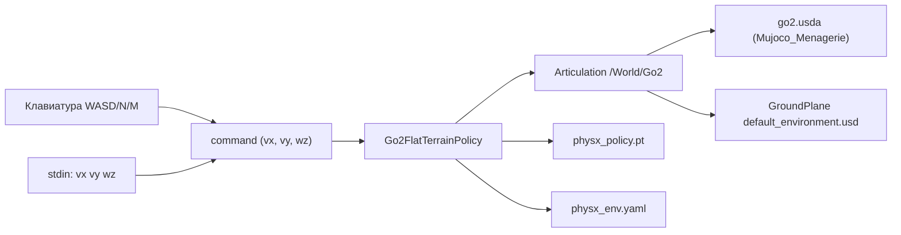

# Отчёт о развёртывании и эксплуатационных проблемах подключения готовой политики NVIDIA для Go2

**Дата:** 2026-08-23
**Ветка:** `feat/isaam-research`
**Версия:** 1.0

---

## Содержание

### Часть A. Развёртывание готового решения NVIDIA (policy Go2)

1. [Введение](#a1-введение)
2. [Выбор решения (история)](#a2-выбор-решения-история)
3. [Ход работ](#a3-ход-работ)
4. [Проблемы и решения](#a4-проблемы-и-решения)
5. [Итоговая архитектура](#a5-итоговая-архитектура)
6. [Дальнейшие шаги](#a6-дальнейшие-шаги)
7. [Приложения](#a7-приложения)

#<a id="part-b"></a>
## Часть B. Эксплуатационные проблемы

19. [Проблема: Ассеты Isaac 6.0 недоступны со стандартного S3-эндпоинта](#19-проблема-ассеты-isaac-60-недоступны-со-стандартного-s3-эндпоинта)
20. [Проблема: get_assets_root_path() падает — нет доступа к ассетам](#20-проблема-get_assets_root_path-падает-нет-доступа-к-ассетам)
21. [Проблема: Ассет Go2 скачан неполным (payloads/ и physics.usda)](#21-проблема-ассет-go2-скачан-неполным-payloads-и-physicsusda)
22. [Проблема: ArticulationRootAPI не найден (IsValidPathString(NoneType))](#22-проблема-articulationrootapi-не-найден-isvalidpathstringnonetype)
23. [Проблема: Команда политике передаётся как list, а не torch.Tensor](#23-проблема-команда-политике-передаётся-как-list-а-не-torchtensor)
24. [Проблема: Робот проваливается сквозь пол (программный ground plane)](#24-проблема-робот-проваливается-сквозь-пол-программный-ground-plane)

---

## Часть A. Развёртывание готового решения NVIDIA (policy Go2)

> **Связь с Частью B.** В ходе развёртывания встречались проблемы. Здесь (Часть A) они описаны кратко, а детальные разборы — в [Части B](#part-b): каждая проблема по цепочке «Симптом → Гипотезы → Причина → Диагностика → Решение → Результат». Нумерация проблем сквозная (продолжение отчёта `2026-08-23_isaac-sim-integration-report.md`, проблемы 8–18): новые — 19–24.

### A.1. Введение

#### A.1.1. Предпосылки

В отчёте `2026-08-23_isaac-sim-integration-report.md` (проблемы 8–18) был реализован полный замкнутый цикл: Go2 ходит в Isaac Sim под управлением Rust-контроллера (TROT), мост `isaac_bridge.py` публикует odom/imu/foot_contact. Однако стойка и ходьба на самодельном xacro-URDF (`go2_gazebo.urdf`) оставались нестабильными: при переходе контроллера в режим TROT робот уходил в NaN (поза `rpy=[+nan +90.0 +nan]`, лог моста `[REPORT] ... nan=N`).

Причина нестабильности — физика самодельного URDF не соответствовала PhysX. В установке Isaac Sim есть готовое решение NVIDIA: **Go2FlatTerrainPolicy** — ассет `Mujoco_Menagerie/unitree_go2/go2.usda` + обученная RL-политика `physx_policy.pt`. Цель — проверить его «из коробки», а затем перевести управление на наш Rust-контроллер, используя правильный ассет.

#### A.1.2. Цели

1. Запустить Go2 с готовой обученной политикой NVIDIA в Isaac Sim.
2. Подключить управление командой скорости `(vx, vy, wz)` (клавиатура/stdin).
3. Локализовать ассеты, чтобы не зависеть от нестабильного S3.
4. Получить эталон физики (stiffness/damping/default-поза) для переноса на Rust-контроллер.

#### A.1.3. Оборудование

| Компонент | Значение |
|---|---|
| ОС | Ubuntu 26.04 (Resolute Raccoon), ядро 7.0.0-30-generic |
| GPU | NVIDIA GeForce RTX 5070 Ti (16 GB, sm_120), активна |
| Вторая GPU | AMD Radeon 780M (интегрированная, не используется PhysX) |
| CPU | AMD Ryzen 7 H 255 (8 ядер / 16 потоков) |
| RAM | 32 GB, для Isaac требуется ≥ 12 GB свободно |
| Isaac Sim | 6.0.1.0 (venv `~/isaacsim-venv`, Python 3.12) |
| Робот | Unitree Go2 (ассет Mujoco_Menagerie) |
| Политика | `physx_policy.pt` (RL, обучена в Isaac Lab) |

### A.2. Выбор решения (история)

#### A.2.1. Рассмотренные варианты

| Вариант | Описание | Вердикт |
|---|---|---|
| Продолжать чинить наш xacro-URDF | Настроить массы/инерции/коллизии вручную | Отвергнут — физика нестабильна, NaN при TROT |
| Готовый пример NVIDIA (UI Examples Browser → Go2) | `isaacsim.robot.policy.examples` | Частично — требует ручной активации в UI, неудобно автоматизировать |
| Готовый ассет + политика NVIDIA программно | `Go2FlatTerrainPolicy` + локальные ассеты | **Принят** — проверенная физика и политика «из коробки» |
| Скачивание с S3 в рантайме | `get_assets_root_path()` | Отвергнут — S3 недоступен, см. [проблему 19](#19-проблема-ассеты-isaac-60-недоступны-со-стандартного-s3-эндпоинта) |

#### A.2.2. Хронология решений

1. Запущен `isaacsim --enable isaacsim.robot.policy.examples` (GUI) — робот не появился, пример нужно активировать кликом в UI (см. A.3.1).
2. Написан автономный скрипт `go2_policy.py` на базе `Go2FlatTerrainPolicy`.
3. Обнаружено, что S3 недоступен → ассеты скачаны вручную в `~/isaac_assets`.
4. Настроен локальный `asset_root` (carb settings) → ассеты найдены.
5. Исправлена структура ассета (payloads/, physics.usda).
6. Выбран variant `Physics=physx` при `add_reference_to_stage`.
7. Заменён программный ground plane на reference `default_environment.usd` — робот перестал проваливаться.
8. Исправлена передача команды (torch.Tensor вместо list).
9. Ассеты перенесены в проект `src/isaac/assets/` (коммит `cb2a68d`).

### A.3. Ход работ

#### A.3.1. Запуск GUI-примера NVIDIA

Запущен `isaacsim --enable isaacsim.robot.policy.examples`. Окно `Isaac Sim Full 6.0.1 - New Stage` открылось, `Simulation App Startup Complete`, но **робота нет** — пример Go2 активируется через Examples Browser (меню) кликом, что в headless-автоматизации не сделать. Сделан вывод: нужен собственный скрипт, программно создающий робота.

#### A.3.2. Автономный скрипт go2_policy.py

Создан `src/isaac/go2_policy.py`: SimulationApp → `Go2FlatTerrainPolicy` → управление клавиатурой/stdin. При первом запуске упал `get_assets_root_path()` — [проблема 20](#20-проблема-get_assets_root_path-падает-нет-доступа-к-ассетам). Затем ассеты скачаны вручную — [проблема 19](#19-проблема-ассеты-isaac-60-недоступны-со-стандартного-s3-эндпоинта) и [21](#21-проблема-ассет-go2-скачан-неполным-payloads-и-physicsusda).

#### A.3.3. Настройка локального asset_root

Задана настройка `/persistent/isaac/asset_root/default = file://<локальная папка>` и созданы подпапки `Isaac/` и `NVIDIA/` (функция проверяет обе). Ассеты найдены — подробности в [проблеме 20](#20-проблема-get_assets_root_path-падает-нет-доступа-к-ассетам).

#### A.3.4. Загрузка робота из USD

Иерархия прим под `/World/Go2` появилась только после переноса payload-файлов в `payloads/` и выбора variant `Physics=physx` — [проблемы 21](#21-проблема-ассет-go2-скачан-неполным-payloads-и-physicsusda) и [22](#22-проблема-articulationrootapi-не-найден-isvalidpathstringnonetype).

#### A.3.5. Запуск политики и управление

Робот создан (num_dofs=12), но при первом шаге политика упала: команда передавалась Python-list — [проблема 23](#23-проблема-команда-политике-передаётся-как-list-а-не-torchtensor).

#### A.3.6. Ground plane

Робот спавнился на высоте 0.5 м, но проваливался сквозь пол (поза уходила в `-1e13`) — программный ground plane не давал коллизии. Заменён reference на `default_environment.usd` — [проблема 24](#24-проблема-робот-проваливается-сквозь-пол-программный-ground-plane).

#### A.3.7. Результат: робот ходит

После всех исправлений: `pos=(-0.13,+0.00,+0.28)`, робот стабильно стоит, ходит и поворачивается под управлением политики (проверено пользователем).

### A.4. Проблемы и решения

| № | Проблема | Причина | Решение | Статус |
|---|---|---|---|---|
| [19](#19-проблема-ассеты-isaac-60-недоступны-со-стандартного-s3-эндпоинта) | S3 недоступен | Старый эндпоинт `s3-us-west-2.amazonaws.com` не резолвится; скачивание нестабильно | Использовать `s3.us-west-2.amazonaws.com` + wget | [x] решено |
| [20](#20-проблема-get_assets_root_path-падает-нет-доступа-к-ассетам) | `get_assets_root_path()` RuntimeError | Нет доступа к S3; функция требует `/Isaac` и `/NVIDIA` | Локальный `asset_root` через carb settings | [x] решено |
| [21](#21-проблема-ассет-go2-скачан-неполным-payloads-и-physicsusda) | Ассет неполный | payload-файлы не в `payloads/`, нет `physics.usda` | Перенос + докачка physics.usda | [x] решено |
| [22](#22-проблема-articulationrootapi-не-найден-isvalidpathstringnonetype) | ArticulationRoot не найден | variant `Physics` не выбран при reference | `variants=[("Physics","physx")]` | [x] решено |
| [23](#23-проблема-команда-политике-передаётся-как-list-а-не-torchtensor) | TypeError в политике | Команда — list, нужен torch.Tensor(cuda) | `torch.tensor(cmd, dtype=float32, device="cuda")` | [x] решено |
| [24](#24-проблема-робот-проваливается-сквозь-пол-программный-ground-plane) | Робот проваливается | Программный Cube без коллизии | Reference на `default_environment.usd` | [x] решено |

### A.5. Итоговая архитектура

#### A.5.1. Компоненты



#### A.5.2. Параметры

| Параметр | Значение | Источник |
|---|---|---|
| physics_dt | 0.005 с (200 Гц) | `physx_env.yaml` |
| device / backend | cuda / torch | `go2_policy.py` |
| stiffness | 25.0 | `physx_env.yaml` actuators |
| damping | 0.5 | `physx_env.yaml` actuators |
| effort_limit | 23.5 | `physx_env.yaml` actuators |
| velocity_limit | 30.0 | `physx_env.yaml` actuators |
| action_scale | 0.25 | `go2.py` |
| default joint | hip=±0.1, thigh=0.8/1.0, calf=-1.5 | `physx_env.yaml` init_state |

#### A.5.3. Сравнение «было / стало»

| Метрика | Было (наш xacro-URDF) | Стало (ассет NVIDIA) |
|---|---|---|
| Поза в стойке | робот кренился, лежал на боку | стабильно стоит, Z≈0.28 м |
| TROT-ходьба | NaN (взрыв физики) | стабильная ходьба |
| Управление | Rust-контроллер (TROT) | политика NVIDIA (команды скорости) |
| Настройка PD | вручную (hip soft) | эталон из env.yaml |

### A.6. Дальнейшие шаги

- [ ] Перенести наш Rust-контроллер (математический TROT) на ассет NVIDIA, используя эталонные PD из `physx_env.yaml`
- [ ] Сравнить поведение: политика NVIDIA vs математический контроллер на одном ассете
- [ ] Подключить управление командами скорости от нашего контроллера к `go2_policy.py`

### A.7. Приложения

#### Приложение A. Команды администрирования

```bash
# запуск Go2 с политикой NVIDIA (GUI, управление с клавиатуры/stdin)
source ~/isaacsim-venv/bin/activate
python -u src/isaac/go2_policy.py

# ассеты в проекте
ls src/isaac/assets/Isaac/Samples/Mujoco_Menagerie/unitree_go2/go2/
```

#### Приложение B. Полезные файлы

- `src/isaac/go2_policy.py` — автономный запуск политики Go2
- `src/isaac/assets/Isaac/Samples/Mujoco_Menagerie/unitree_go2/go2/` — ассет Go2
- `src/isaac/assets/Isaac/Samples/Policies/go2/physx_policy.pt` и `physx_env.yaml` — политика и конфиг
- `src/isaac/assets/Isaac/Environments/Grid/default_environment.usd` — ground plane

---

<a id="part-b"></a>
## Часть B. Эксплуатационные проблемы

## Сводная таблица

| № | Проблема | Гипотезы | Причина | Решение | Методы | Сложность |
|---|---|---|---|---|---|---|
| 19 | Ассеты Isaac 6.0 недоступны со стандартного S3-эндпоинта | (1) нет сети; (2) неверный URL; (3) требуется логин | Старый эндпоинт `s3-us-west-2.amazonaws.com` не резолвится (SSL error 35), актуальный — `s3.us-west-2.amazonaws.com` | Скачивание через wget с корректным эндпоинтом | curl -I, curl -O, wget, DNS | 🟢 |
| 20 | `get_assets_root_path()` падает | (1) S3 недоступен; (2) не настроен root; (3) не хватает папок | Функция требует доступа к `/Isaac` и `/NVIDIA`; по умолчанию смотрит в S3 | Локальный `asset_root` через carb settings | strace логов, чтение nucleus.py | 🟡 |
| 21 | Ассет Go2 скачан неполным | (1) S3 отдал не всё; (2) структура неверна | payload-файлы лежали в корне `go2/`, а `go2.usda` ссылается на `./payloads/`; отсутствовал `physics.usda` (sublayer `physx.usda`) | Перенос файлов в `payloads/`, докачка `physics.usda` | list S3 (list-type=2), сравнение структуры | 🟢 |
| 22 | ArticulationRootAPI не найден | (1) ассет не загрузился; (2) нет articulation; (3) не выбран variant | Multi-physics ассет: без выбора variant `Physics=physx` под `/World/Go2` нет активной ArticulationRootAPI | `variants=[("Physics","physx")]` в `add_reference_to_stage` | диагностика прим (Usd.PrimRange, HasAPI), чтение usda | 🟡 |
| 23 | Команда политике — list вместо torch.Tensor | (1) не тот тип; (2) политика ждёт тензор | `_compute_observation`: `obs[9:12] = command` требует `torch.cuda.FloatTensor` | `torch.tensor(cmd, dtype=torch.float32, device="cuda")` | traceback, чтение go2.py | 🟢 |
| 24 | Робот проваливается сквозь пол | (1) нет ground; (2) нет коллизии; (3) не тот prim | Программный `UsdGeom.Cube` не давал коллизии (не активирована правильно) | Reference на `default_environment.usd` (GroundPlane/CollisionPlane) | лог REPORT (поза -1e13), чтение usd | 🟡 |

---

## 19. Проблема: Ассеты Isaac 6.0 недоступны со стандартного S3-эндпоинта

### 19.1. Симптом

`curl -I` к стандартному эндпоинту NVIDIA завершается ошибкой:

```
timeout 20 curl -s -o /dev/null -w "HTTP %{http_code}" \
  https://omniverse-content-production.s3-us-west-2.amazonaws.com/Assets/Isaac/6.0/
HTTP 000 в 0.192с
exit=35   # SSL connect error
```

При этом `github.com` отвечает `HTTP/2 200` — сеть работает.

### 19.2. Гипотезы

- ❌ **Гипотеза A:** нет сети вообще. **Опровергнута** — GitHub и S3 с другим эндпоинтом отвечают.
- ✅ **Гипотеза B:** неверный (устаревший) S3-эндпоинт. **Принята** — эндпоинт с дефисом `s3-us-west-2.amazonaws.com` не резолвится, актуальный `s3.us-west-2.amazonaws.com` (без дефиса) отвечает `HTTP/1.1 200 OK`.
- ❌ **Гипотеза C:** требуется логин NVIDIA. **Опровергнута** — файлы доступны по открытой ссылке с корректным эндпоинтом.

### 19.3. Причина

`get_assets_root_path()` (и дефолт Isaac Sim 6.0) указывает на `https://omniverse-content-production.s3-us-west-2.amazonaws.com/Assets/Isaac/6.0`. Эндпоинт с дефисом (`s3-us-west-2.amazonaws.com`) не разрешается в нашей сети (SSL error 35). Рабочий эндпоинт — `omniverse-content-production.s3.us-west-2.amazonaws.com` (точка перед `us-west-2`).

### 19.4. Диагностика

```
curl -sI https://github.com                                     → HTTP/2 200 (сеть жива)
curl -sI https://omniverse-content-production.s3-us-west-2.amazonaws.com/...  → HTTP 000, exit=35
curl -sI https://omniverse-content-production.s3.us-west-2.amazonaws.com/...  → HTTP/1.1 200 OK
```

Дополнительно: скачивание `curl -O` больших файлов (6.5 MB) прерывалось по таймауту, тогда как `wget` скачивал стабильно.

### 19.5. Решение

- Использовать эндпоинт без дефиса: `omniverse-content-production.s3.us-west-2.amazonaws.com`.
- Скачивать `wget` (стабильнее для больших файлов).
- Листинг объектов — через S3 API `?list-type=2&prefix=...`.

### 19.6. Исправление в скриптах/конфигах

Ассеты скачаны один раз и **закоммичены в проект** (`src/isaac/assets/`), поэтому на рантайм-доступ к S3 скрипт больше не опирается. `go2_policy.py` использует локальные пути с fallback на `~/isaac_assets`.

### 19.7. Результат

| Метрика | До | После |
|---|---|---|
| Доступ к S3 | HTTP 000, exit=35 | HTTP 200 |
| Скачивание 6.5 MB | таймаут (curl -O) | успешно (wget) |

**Связь с развёртыванием (Часть A):** встречена на этапе [A.3.2 «Автономный скрипт go2_policy.py»](#a32-автономный-скрипт-go2_policypy).

---

## 20. Проблема: get_assets_root_path() падает — нет доступа к ассетам

### 20.1. Симптом

При создании `Go2FlatTerrainPolicy` (первая строка `__init__`):

```
File ".../go2.py", line 53, in __init__
    assets_root_path = get_assets_root_path()
RuntimeError: Could not find assets root folder: \
  https://omniverse-content-production.s3-us-west-2.amazonaws.com/Assets/Isaac/6.0
```

### 20.2. Гипотезы

- ❌ **Гипотеза A:** ассеты отсутствуют в принципе. **Опровергнута** — они есть на S3 (см. [проблему 19](#19-проблема-ассеты-isaac-60-недоступны-со-стандартного-s3-эндпоинта)).
- ✅ **Гипотеза B:** функция не может достучаться до S3. **Принята** — сбой соединения.
- ❌ **Гипотеза C:** достаточно передать usd_path/policy_path явно. **Опровергнута** — `get_assets_root_path()` вызывается безусловно, до использования переданных путей.

### 20.3. Причина

`get_assets_root_path()` (nucleus.py) резолвит настройку `/persistent/isaac/asset_root/default`, проверяет наличие подпапок `/Isaac` и `/NVIDIA` через `omni.client.stat` и падает, если путь недоступен. Дефолт — S3, недоступный из нашей сети.

### 20.4. Диагностика

```
# nucleus.py
def get_assets_root_path(...):
    default_asset_root = carb.settings.get_settings().get(DEFAULT_ASSET_ROOT_PATH_SETTING)
    result = check_server(default_asset_root, "/Isaac", timeout)   # omni.client.stat
    if result: result = check_server(default_asset_root, "/NVIDIA", timeout)
    if result: return default_asset_root
    raise RuntimeError(...)
```

Настройка по умолчанию указывала на S3 → проверка не проходила.

### 20.5. Решение

Задать локальный asset_root и создать обе проверяемые папки:

```python
LOCAL_ROOT = os.path.dirname(LOCAL_ASSET_ROOT)   # родитель Isaac/
os.makedirs(f"{LOCAL_ROOT}/NVIDIA", exist_ok=True)
os.makedirs(f"{LOCAL_ROOT}/Isaac", exist_ok=True)
carb.settings.get_settings().set(
    "/persistent/isaac/asset_root/default", f"file://{LOCAL_ROOT}"
)
```

### 20.6. Исправление в скриптах/конфигах

`src/isaac/go2_policy.py` — блок «Настройка локального asset_root» выполняется до создания `Go2FlatTerrainPolicy`.

### 20.7. Результат

| Метрика | До | После |
|---|---|---|
| `get_assets_root_path()` | RuntimeError | возвращает `file://...` |
| Создание политики | падало | успешно (num_dofs=12) |

**Связь с развёртыванием (Часть A):** встречена на этапе [A.3.2 «Автономный скрипт go2_policy.py»](#a32-автономный-скрипт-go2_policypy).

---

## 21. Проблема: Ассет Go2 скачан неполным (payloads/ и physics.usda)

### 21.1. Симптом

После ручной загрузки `go2.usda` иерархия прим под `/World/Go2` пустая (prim без детей), робот не появляется. Прямая проверка структуры:

```
head: cannot open 'payloads/base.usda' for reading: No such file or directory
# файлы лежали в корне go2/, а не в go2/payloads/
ls payloads/Physics/  →  mujoco.usda  physx.usda   # нет physics.usda
```

### 21.2. Гипотезы

- ❌ **Гипотеза A:** S3 отдаёт только go2.usda (сплат). **Опровергнута** — листинг показал полный набор payload-файлов.
- ✅ **Гипотеза B:** файлы скачаны, но структура неверна. **Принята** — payload-файлы лежали в корне, а `go2.usda` ссылается на `./payloads/*`.
- ✅ **Гипотеза C:** пропущен файл. **Принята** — отсутствовал `payloads/Physics/physics.usda`, на который ссылается `physx.usda` (`subLayers = [@./physics.usda@]`).

### 21.3. Причина

`go2.usda` — «сплат»: ссылается на `./payloads/base.usda` (reference) и `./payloads/Physics/physx.usda` (variant payload). При ручной загрузке payload-файлы были положены в корень `go2/`, а `physics.usda` (sublayer) не был скачан вовсе — листинг на S3 показал 3 файла в `payloads/Physics/` (mujoco, physics, physx), а локально их было 2.

### 21.4. Диагностика

```
# S3 листинг payloads/
curl "https://...s3.us-west-2.amazonaws.com/?list-type=2&prefix=Assets/Isaac/6.0/.../go2/payloads/Physics/"
→ mujoco.usda, physics.usda, physx.usda

# локальная структура до фикса
go2/payloads/Physics/mujoco.usda
go2/payloads/Physics/physx.usda            # physics.usda отсутствует
go2/base.usda  (должно быть go2/payloads/base.usda)
```

### 21.5. Решение

- Перенести `base.usda`, `geometries.usd`, `instances.usda`, `materials.usda`, `robot.usda` в `go2/payloads/`.
- Докачать `payloads/Physics/physics.usda` (27 KB, содержит `PhysicsArticulationRootAPI`).
- Проверить итоговую структуру листингом `find`.

### 21.6. Исправление в скриптах/конфигах

Структура зафиксирована в репозитории (`src/isaac/assets/Isaac/Samples/Mujoco_Menagerie/unitree_go2/go2/`). Повторная загрузка не требуется.

### 21.7. Результат

| Метрика | До | После |
|---|---|---|
| Файлов в payloads/Physics/ | 2 | 3 (добавлен physics.usda) |
| Иерархия прим /World/Go2 | пустая | полная (Geometry/base/FL_hip/...) |

**Связь с развёртыванием (Часть A):** встречена на этапе [A.3.4 «Загрузка робота из USD»](#a34-загрузка-робота-из-usd).

---

## 22. Проблема: ArticulationRootAPI не найден (IsValidPathString(NoneType))

### 22.1. Симптом

При создании `Articulation("/World/Go2")`:

```
File ".../prim.py", line 249, in find_matching_prim_paths
    if Sdf.Path.IsValidPathString(path):
Boost.Python.ArgumentError: Python argument types in
    Path.IsValidPathString(NoneType)
```

Диагностика иерархии показала: прим `/World/Go2` без маркера `<== ARTICULATION_ROOT`.

### 22.2. Гипотезы

- ❌ **Гипотеза A:** ассет не загрузился. **Опровергнута** — после [проблемы 21](#21-проблема-ассет-go2-скачан-неполным-payloads-и-physicsusda) иерархия прим полная.
- ❌ **Гипотеза B:** в ассете вообще нет ArticulationRootAPI. **Опровергнута** — `physics.usda` содержит `PhysicsArticulationRootAPI`.
- ✅ **Гипотеза C:** не выбран variant `Physics=physx`, поэтому активная articulation-ветка отсутствует. **Принята** — `fetch_articulation_root_api_prim_paths` вернул `[None]`.

### 22.3. Причина

`go2.usda` — multi-physics ассет с variant set `Physics` (варианты `mujoco`/`none`/`physics`/`physx`). Если variant не выбран при добавлении reference, активная версия ассета не содержит ArticulationRootAPI → `resolve_paths` получает `None` → `Sdf.Path.IsValidPathString(None)` бросает ArgumentError.

### 22.4. Диагностика

```
# go2.usda
variantSet "Physics" = {
    "physx" (prepend payload = @./payloads/Physics/physx.usda@) {...}
}
# fetch_articulation_root_api_prim_paths("/World/Go2") → [None]
# (prim существует, но без активной articulation root)
```

### 22.5. Решение

Передавать variant при добавлении reference:

```python
stage_utils.add_reference_to_stage(
    usd_path=GO2_USD,
    path="/World/Go2",
    variants=[("Physics", "physx")],
)
```

### 22.6. Исправление в скриптах/конфигах

`src/isaac/go2_policy.py` — блок «add reference to stage» с `variants`.

### 22.7. Результат

| Метрика | До | После |
|---|---|---|
| ArticulationRootAPI под /World/Go2 | нет | есть (variant physx) |
| `Go2FlatTerrainPolicy(...)` | ArgumentError | num_dofs=12 |

**Связь с развёртыванием (Часть A):** встречена на этапе [A.3.4 «Загрузка робота из USD»](#a34-загрузка-робота-из-usd).

---

## 23. Проблема: Команда политике передаётся как list, а не torch.Tensor

### 23.1. Симптом

На первом шаге политики:

```
File ".../go2.py", line 114, in _compute_observation
    obs[9:12] = command
TypeError: can't assign a list to a torch.cuda.FloatTensor
```

Ошибка повторялась на каждом physics step.

### 23.2. Гипотезы

- ✅ **Гипотеза A:** команда должна быть torch.Tensor на cuda. **Принята** — `_compute_observation` присваивает её в `obs[9:12]` (torch tensor).
- ❌ **Гипотеза B:** проблема в типе политики. **Опровергнута** — политика корректно загружена; дело в формате входа.

### 23.3. Причина

Мы передавали `cmd` как Python-list `[0.0, 0.0, 0.0]`, а `_compute_observation` выполняет `obs[9:12] = command`, где `obs` — `torch.zeros(48, device=cuda)`. Присваивание list в torch-tensor запрещено — требуется `torch.cuda.FloatTensor`.

### 23.4. Диагностика

```
# go2.py
obs = torch.zeros(48, device=device)
...
obs[9:12] = command          # command = [0.0, 0.0, 0.0]  → TypeError
```

В официальном примере команда — `torch.tensor([0,0,0], device="cuda")`.

### 23.5. Решение

```python
import torch
cmd_t = torch.tensor(cmd, dtype=torch.float32, device="cuda")
go2.forward(dt, cmd_t)
```

### 23.6. Исправление в скриптах/конфигах

`src/isaac/go2_policy.py` — `on_physics_step`: конвертация `list → torch.tensor` перед `go2.forward`.

### 23.7. Результат

| Метрика | До | После |
|---|---|---|
| `go2.forward(dt, cmd)` | TypeError каждый шаг | работает |
| Робот | не двигался | ходит/поворачивается |

**Связь с развёртыванием (Часть A):** встречена на этапе [A.3.5 «Запуск политики и управление»](#a35-запуск-политики-и-управление).

---

## 24. Проблема: Робот проваливается сквозь пол (программный ground plane)

### 24.1. Симптом

Политика запустилась, но робот проваливался: поза уходила в огромные отрицательные значения:

```
[REPORT] pos=(-535289462784.00,+406628106240.00,-48609763328.00) cmd=[0.0, 0.0, 0.0]
[REPORT] pos=(-15338908418048.00,+16195061284864.00,-12630321266688.00) ...
```

### 24.2. Гипотезы

- ❌ **Гипотеза A:** робот спавнится слишком высоко и падает. **Опровергнута** — спавн на 0.5 м; после касания пола робот должен стоять, а не проваливаться на -1e13.
- ✅ **Гипотеза B:** ground plane не имеет коллизии. **Принята** — программный `UsdGeom.Cube` не создавал физическую коллизию.

### 24.3. Причина

Программно созданный ground plane через `UsdGeom.Cube` + `UsdPhysics.CollisionAPI` не давал рабочей коллизии для PhysX (в отличие от правильного `GroundPlane/CollisionPlane` в `default_environment.usd`, у которого корректные физические примитивы и материал).

### 24.4. Диагностика

```
# default_environment.usd
/World/GroundPlane
/World/GroundPlane/CollisionPlane      # правильный collision prim
# программный вариант давал только /World/ground/CollisionPlane (Cube) —
# робот проваливался (поза -1e13 в логе REPORT)
```

### 24.5. Решение

Заменить программный ground plane reference на `default_environment.usd`:

```python
GROUND_USD = f"file://{LOCAL_ASSET_ROOT}/Environments/Grid/default_environment.usd"
stage_utils.add_reference_to_stage(usd_path=GROUND_USD, path="/World")
```

### 24.6. Исправление в скриптах/конфигах

`src/isaac/go2_policy.py` — блок «add ground plane reference».

### 24.7. Результат

| Метрика | До | После |
|---|---|---|
| Поза Z | уходила в -1e13 | стабильно ≈0.28 м |
| Робот | проваливался сквозь пол | стоит на полу |

**Связь с развёртыванием (Часть A):** встречена на этапе [A.3.6 «Ground plane»](#a36-ground-plane).

---

## Итоговая статистика

| Метрика | Значение |
|---|---|
| Всего проблем | 6 |
| Из них решено | 6 |
| 🟢 (<1ч) | 3 |
| 🟡 (1-4ч) | 3 |
| 🔴 (>4ч) | 0 |
| Ключевые выводы | Готовое решение NVIDIA (ассет Mujoco_Menagerie + RL-политика) работает «из коробки», если ассеты скачаны локально и задан asset_root. Multi-physics ассет требует выбора variant Physics. Команды политике передаются torch.Tensor на cuda. **Результат: Go2 стабильно стоит, ходит и поворачивается под управлением политики; ассеты закоммичены в проект (src/isaac/assets/, коммит cb2a68d).** |

---

## Связанные отчёты

- `reports/isaam/2026-08-23_isaac-sim-integration-report.md` — интеграция Isaac Sim с Rust-контроллером (проблемы 8–18)
- `reports/isaam/2026-07-18_rust-isaac-integration.md` — план интеграции Rust-контроллера с Isaac Sim
- `.agents/skills/troubleshooting-report/SKILL.md` — формат данного отчёта
